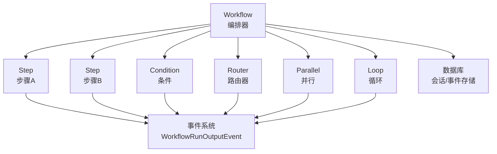
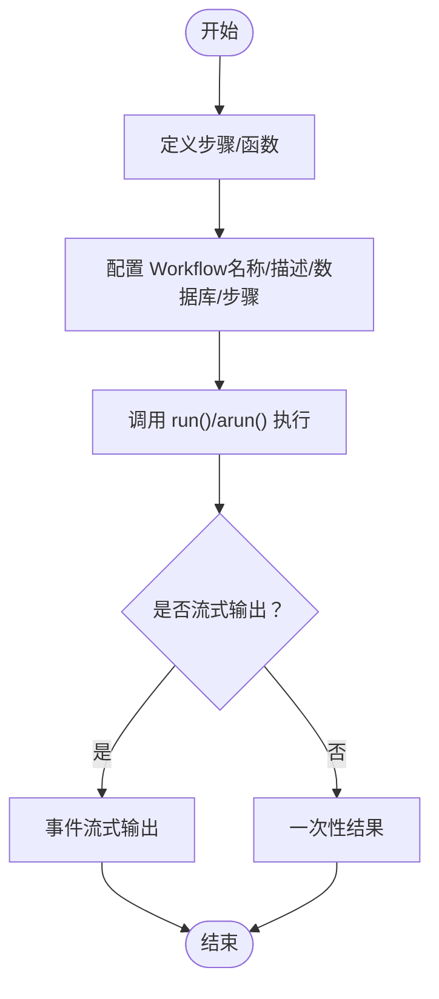
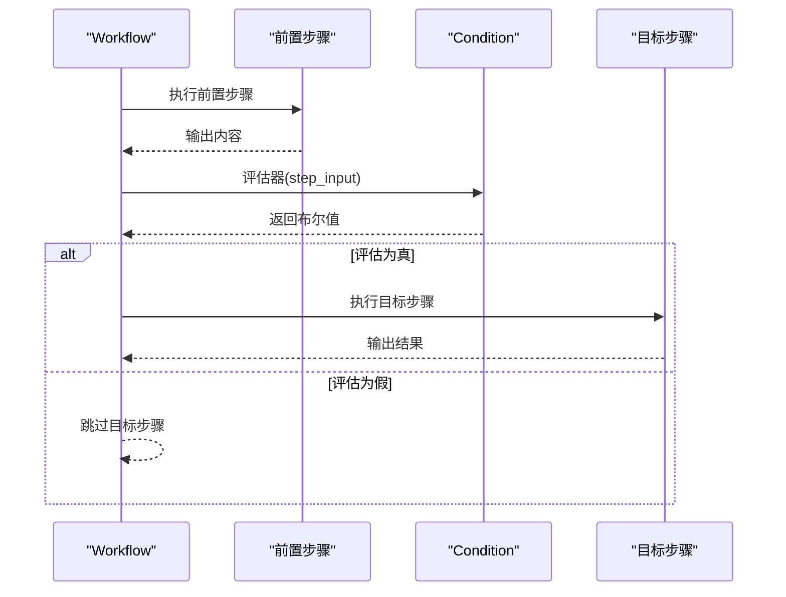
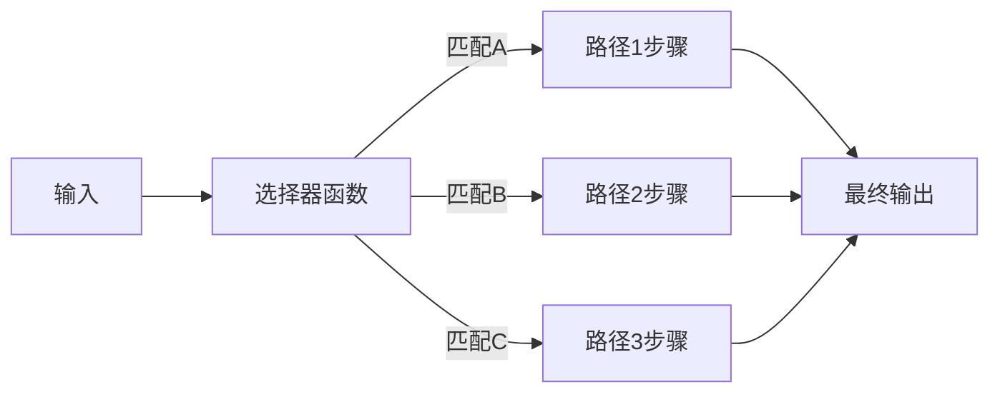
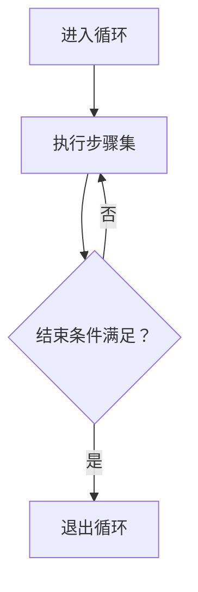
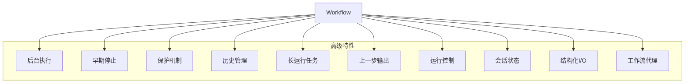
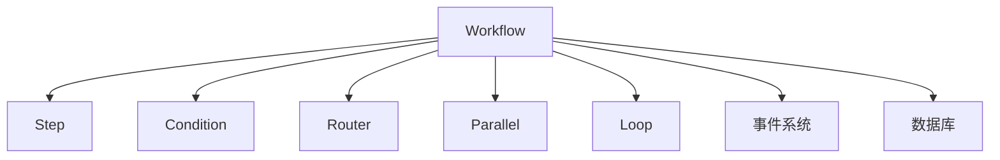

# 工作流示例

<cite>
**本文引用的文件**
- [workflows/overview.mdx](file://workflows/overview.mdx)
- [workflows/building-workflows.mdx](file://workflows/building-workflows.mdx)
- [workflows/running-workflows.mdx](file://workflows/running-workflows.mdx)
- [workflows/workflow-patterns/overview.mdx](file://workflows/workflow-patterns/overview.mdx)
- [workflows/usage/sequence-of-steps.mdx](file://workflows/usage/sequence-of-steps.mdx)
- [workflows/usage/function-instead-of-steps.mdx](file://workflows/usage/function-instead-of-steps.mdx)
- [workflows/usage/parallel-steps-workflow.mdx](file://workflows/usage/parallel-steps-workflow.mdx)
- [workflows/usage/condition-with-list-of-steps.mdx](file://workflows/usage/condition-with-list-of-steps.mdx)
- [workflows/usage/router-steps-workflow.mdx](file://workflows/usage/router-steps-workflow.mdx)
- [workflows/usage/loop-steps-workflow.mdx](file://workflows/usage/loop-steps-workflow.mdx)
- [workflows/access-previous-steps.mdx](file://workflows/access-previous-steps.mdx)
- [workflows/background-execution.mdx](file://workflows/background-execution.mdx)
- [workflows/early-stop.mdx](file://workflows/early-stop.mdx)
- [workflows/workflow-tools.mdx](file://workflows/workflow-tools.mdx)
- [workflows/conversational-workflows.mdx](file://workflows/conversational-workflows.mdx)
- [workflows/running-workflows.mdx](file://workflows/running-workflows.mdx)
- [workflows/usage/structured-io-at-each-step-level.mdx](file://workflows/usage/structured-io-at-each-step-level.mdx)
- [workflows/usage/class-based-executor.mdx](file://workflows/usage/class-based-executor.mdx)
- [workflows/usage/async-events-streaming.mdx](file://workflows/usage/async-events-streaming.mdx)
- [workflows/usage/workflow-cancellation.mdx](file://workflows/usage/workflow-cancellation.mdx)
- [workflows/usage/workflow-with-input-schema.mdx](file://workflows/usage/workflow-with-input-schema.mdx)
- [workflows/usage/condition-steps-workflow-stream.mdx](file://workflows/usage/condition-steps-workflow-stream.mdx)
- [workflows/usage/condition-and-parallel-steps-stream.mdx](file://workflows/usage/condition-and-parallel-steps-stream.mdx)
- [workflows/usage/loop-with-parallel-steps-stream.mdx](file://workflows/usage/loop-with-parallel-steps-stream.mdx)
- [workflows/usage/loop-iterative-accumulation.mdx](file://workflows/usage/loop-iterative-accumulation.mdx)
- [workflows/usage/router-with-loop-steps.mdx](file://workflows/usage/router-with-loop-steps.mdx)
- [workflows/usage/router-with-step-choices.mdx](file://workflows/usage/router-with-step-choices.mdx)
- [workflows/usage/examples/router-choices/dynamic-selector.mdx](file://workflows/usage/examples/router-choices/dynamic-selector.mdx)
- [workflows/usage/examples/router-choices/nested-selector.mdx](file://workflows/usage/examples/router-choices/nested-selector.mdx)
- [workflows/usage/examples/router-choices/string-selector.mdx](file://workflows/usage/examples/router-choices/string-selector.mdx)
- [workflows/usage/step-with-function.mdx](file://workflows/usage/step-with-function.mdx)
- [workflows/usage/step-with-function-additional-data.mdx](file://workflows/usage/step-with-function-additional-data.mdx)
- [workflows/usage/step-with-function-streaming-agentos.mdx](file://workflows/usage/step-with-function-streaming-agentos.mdx)
- [workflows/usage/access-multiple-previous-steps-output.mdx](file://workflows/usage/access-multiple-previous-steps-output.mdx)
- [workflows/usage/store-events-and-events-to-skip-in-a-workflow.mdx](file://workflows/usage/store-events-and-events-to-skip-in-a-workflow.mdx)
- [workflows/hitl/overview.mdx](file://workflows/hitl/overview.mdx)
- [workflows/hitl/condition.mdx](file://workflows/hitl/condition.mdx)
- [workflows/hitl/error-handling.mdx](file://workflows/hitl/error-handling.mdx)
- [workflows/hitl/loop.mdx](file://workflows/hitl/loop.mdx)
- [workflows/hitl/router.mdx](file://workflows/hitl/router.mdx)
- [workflows/hitl/step.mdx](file://workflows/hitl/step.mdx)
- [workflows/hitl/steps.mdx](file://workflows/hitl/steps.mdx)
- [workflows/workflow-patterns/sequential.mdx](file://workflows/workflow-patterns/sequential.mdx)
- [workflows/workflow-patterns/parallel-workflow.mdx](file://workflows/workflow-patterns/parallel-workflow.mdx)
- [workflows/workflow-patterns/conditional-workflow.mdx](file://workflows/workflow-patterns/conditional-workflow.mdx)
- [workflows/workflow-patterns/iterative-workflow.mdx](file://workflows/workflow-patterns/iterative-workflow.mdx)
- [workflows/workflow-patterns/branching-workflow.mdx](file://workflows/workflow-patterns/branching-workflow.mdx)
- [workflows/workflow-patterns/grouped-steps-workflow.mdx](file://workflows/workflow-patterns/grouped-steps-workflow.mdx)
- [workflows/workflow-patterns/custom-function-step-workflow.mdx](file://workflows/workflow-patterns/custom-function-step-workflow.mdx)
- [workflows/workflow-patterns/fully-python-workflow.mdx](file://workflows/workflow-patterns/fully-python-workflow.mdx)
- [workflows/workflow-patterns/advanced-workflow-patterns.mdx](file://workflows/workflow-patterns/advanced-workflow-patterns.mdx)
</cite>

## 目录
1. [简介](#简介)
2. [项目结构](#项目结构)
3. [核心组件](#核心组件)
4. [架构总览](#架构总览)
5. [详细组件分析](#详细组件分析)
6. [依赖关系分析](#依赖关系分析)
7. [性能考量](#性能考量)
8. [故障排查指南](#故障排查指南)
9. [结论](#结论)
10. [附录](#附录)

## 简介
本技术文档围绕工作流示例进行系统化梳理与讲解，覆盖从基础概念到高级模式的完整路径。内容以“步骤序列、函数工作流、步骤中的函数使用”为基础，逐步扩展至“条件执行、条件分支（路由器）、并行执行、循环执行”，并深入到“后台执行、早期停止、保护机制、历史管理、长运行任务、上一步输出、运行控制、会话状态、结构化 I/O、工作流代理”等高级主题。文档同时提供可直接定位到源码示例的路径指引，便于读者按图索骥、快速落地。

## 项目结构
工作流示例主要分布在以下目录：
- workflows：工作流概览、构建、运行、模式与用法示例
- workflows/usage：具体场景示例（顺序、并行、条件、路由、循环等）
- workflows/workflow-patterns：工作流模式总览与分项详解
- workflows/hitl：人机协作（Human-in-the-loop）相关示例
- workflows/usage/examples/router-choices：路由器选择器示例集合

下图给出与示例相关的高层组织关系：

```mermaid
graph TB
A["工作流概览<br/>workflows/overview.mdx"] --> B["构建工作流<br/>workflows/building-workflows.mdx"]
A --> C["运行工作流<br/>workflows/running-workflows.mdx"]
A --> D["工作流模式总览<br/>workflows/workflow-patterns/overview.mdx"]
D --> D1["顺序工作流<br/>sequential.mdx"]
D --> D2["并行工作流<br/>parallel-workflow.mdx"]
D --> D3["条件工作流<br/>conditional-workflow.mdx"]
D --> D4["迭代工作流<br/>iterative-workflow.mdx"]
D --> D5["分支工作流<br/>branching-workflow.mdx"]
D --> D6["分组步骤工作流<br/>grouped-steps-workflow.mdx"]
D --> D7["自定义函数步骤工作流<br/>custom-function-step-workflow.mdx"]
D --> D8["完全Python工作流<br/>fully-python-workflow.mdx"]
D --> D9["高级组合模式<br/>advanced-workflow-patterns.mdx"]
E["顺序示例<br/>usage/sequence-of-steps.mdx"]
F["函数替代步骤示例<br/>usage/function-instead-of-steps.mdx"]
G["并行示例<br/>usage/parallel-steps-workflow.mdx"]
H["条件含多步示例<br/>usage/condition-with-list-of-steps.mdx"]
I["路由器示例<br/>usage/router-steps-workflow.mdx"]
J["循环示例<br/>usage/loop-steps-workflow.mdx"]
B --> E
B --> F
B --> G
B --> H
B --> I
B --> J
```



图表来源
- [workflows/overview.mdx:1-102](file://workflows/overview.mdx#L1-L102)
- [workflows/building-workflows.mdx:1-59](file://workflows/building-workflows.mdx#L1-L59)
- [workflows/workflow-patterns/overview.mdx:1-92](file://workflows/workflow-patterns/overview.mdx#L1-L92)
- [workflows/usage/sequence-of-steps.mdx:1-85](file://workflows/usage/sequence-of-steps.mdx#L1-L85)
- [workflows/usage/function-instead-of-steps.mdx:1-103](file://workflows/usage/function-instead-of-steps.mdx#L1-L103)
- [workflows/usage/parallel-steps-workflow.mdx:1-47](file://workflows/usage/parallel-steps-workflow.mdx#L1-L47)
- [workflows/usage/condition-with-list-of-steps.mdx:1-160](file://workflows/usage/condition-with-list-of-steps.mdx#L1-L160)
- [workflows/usage/router-steps-workflow.mdx:1-119](file://workflows/usage/router-steps-workflow.mdx#L1-L119)
- [workflows/usage/loop-steps-workflow.mdx:1-103](file://workflows/usage/loop-steps-workflow.mdx#L1-L103)

章节来源
- [workflows/overview.mdx:1-102](file://workflows/overview.mdx#L1-L102)
- [workflows/building-workflows.mdx:1-59](file://workflows/building-workflows.mdx#L1-L59)
- [workflows/workflow-patterns/overview.mdx:1-92](file://workflows/workflow-patterns/overview.mdx#L1-L92)

## 核心组件
- 工作流（Workflow）：顶层编排器，负责管理执行流程、事件存储、会话与运行控制。
- 步骤（Step）：最小执行单元，封装一个执行器（Agent、Team 或自定义函数），支持命名与描述。
- 条件（Condition）：基于评估器在步骤前后进行条件判断，决定是否执行后续步骤或并行分支。
- 路由器（Router）：根据选择器动态选择下一步执行路径，实现互斥分支与智能路由。
- 并行（Parallel）：并发执行多个步骤，合并输出，提升吞吐。
- 循环（Loop）：重复执行一组步骤直到满足结束条件，支持最大迭代次数与累积策略。
- 执行输入/输出（StepInput/StepOutput）：标准化步骤间数据接口，支持访问上一步输出与附加数据。
- 事件系统：提供工作流启动/完成、步骤开始/完成、条件/并行/循环/路由器执行等事件，支持流式输出与事件过滤。

章节来源
- [workflows/building-workflows.mdx:9-32](file://workflows/building-workflows.mdx#L9-L32)
- [workflows/running-workflows.mdx:462-525](file://workflows/running-workflows.mdx#L462-L525)

## 架构总览
下图展示工作流在运行时的整体交互：Workflow 作为编排入口，Step 作为执行单元，Condition/Router/Parallel/Loop 作为控制结构，事件系统贯穿始终，数据库用于持久化会话与事件。



图表来源
- [workflows/running-workflows.mdx:462-525](file://workflows/running-workflows.mdx#L462-L525)
- [workflows/running-workflows.mdx:527-598](file://workflows/running-workflows.mdx#L527-L598)

## 详细组件分析

### 基础概念与构建
- 步骤序列：通过命名 Step 组成线性流程，便于追踪与日志记录。
- 函数工作流：以单个自定义函数作为执行体，仍可享受工作流的存储、流式与会话能力。
- 步骤中的函数：在 Step 中使用自定义函数处理输入/输出，结合 StepInput/StepOutput 实现结构化 I/O。



图表来源
- [workflows/usage/sequence-of-steps.mdx:56-83](file://workflows/usage/sequence-of-steps.mdx#L56-L83)
- [workflows/usage/function-instead-of-steps.mdx:87-101](file://workflows/usage/function-instead-of-steps.mdx#L87-L101)
- [workflows/running-workflows.mdx:11-71](file://workflows/running-workflows.mdx#L11-L71)

章节来源
- [workflows/usage/sequence-of-steps.mdx:1-85](file://workflows/usage/sequence-of-steps.mdx#L1-L85)
- [workflows/usage/function-instead-of-steps.mdx:1-103](file://workflows/usage/function-instead-of-steps.mdx#L1-L103)
- [workflows/building-workflows.mdx:9-32](file://workflows/building-workflows.mdx#L9-L32)

### 条件执行示例
- 基本条件：在步骤后插入 Condition，基于评估器返回布尔值决定是否执行后续步骤。
- 带 else 的条件：可通过两个 Condition 分支模拟“是/否”路径。
- 带列表的条件：Condition 内部可包含多个步骤，形成多步条件分支。
- 带并行的条件：将多个 Condition 放入 Parallel，实现并行条件分支。



图表来源
- [workflows/usage/condition-with-list-of-steps.mdx:124-160](file://workflows/usage/condition-with-list-of-steps.mdx#L124-L160)
- [workflows/running-workflows.mdx:169-184](file://workflows/running-workflows.mdx#L169-L184)

章节来源
- [workflows/usage/condition-with-list-of-steps.mdx:1-160](file://workflows/usage/condition-with-list-of-steps.mdx#L1-L160)
- [workflows/running-workflows.mdx:169-184](file://workflows/running-workflows.mdx#L169-L184)

### 条件分支（路由器）示例
- 基本路由器：根据输入内容选择一条路径（互斥）。
- 带循环的路由器：在路由器之后继续循环，实现“路由+迭代”的复合模式。
- 选择器类型：动态选择器、嵌套选择器、字符串选择器等。
- 步骤选择器参数：通过选择器函数返回步骤列表，支持复杂路由逻辑。
- 字符串选择器：以字符串映射到不同步骤，简化路由配置。



图表来源
- [workflows/usage/router-steps-workflow.mdx:99-111](file://workflows/usage/router-steps-workflow.mdx#L99-L111)
- [workflows/usage/router-with-step-choices.mdx](file://workflows/usage/router-with-step-choices.mdx)
- [workflows/usage/examples/router-choices/dynamic-selector.mdx](file://workflows/usage/examples/router-choices/dynamic-selector.mdx)
- [workflows/usage/examples/router-choices/nested-selector.mdx](file://workflows/usage/examples/router-choices/nested-selector.mdx)
- [workflows/usage/examples/router-choices/string-selector.mdx](file://workflows/usage/examples/router-choices/string-selector.mdx)

章节来源
- [workflows/usage/router-steps-workflow.mdx:1-119](file://workflows/usage/router-steps-workflow.mdx#L1-L119)
- [workflows/usage/router-with-loop-steps.mdx](file://workflows/usage/router-with-loop-steps.mdx)
- [workflows/usage/router-with-step-choices.mdx](file://workflows/usage/router-with-step-choices.mdx)
- [workflows/usage/examples/router-choices/dynamic-selector.mdx](file://workflows/usage/examples/router-choices/dynamic-selector.mdx)
- [workflows/usage/examples/router-choices/nested-selector.mdx](file://workflows/usage/examples/router-choices/nested-selector.mdx)
- [workflows/usage/examples/router-choices/string-selector.mdx](file://workflows/usage/examples/router-choices/string-selector.mdx)

### 并行执行示例
- 基础并行：将多个独立步骤放入 Parallel，同时执行以缩短总耗时。
- 带条件的并行：在并行内部嵌套条件，实现“并行+分支”的混合模式。

```mermaid
sequenceDiagram
participant W as "Workflow"
participant P as "Parallel"
participant S1 as "步骤1"
participant S2 as "步骤2"
W->>P : 启动并行
par S1
par S2
P-->>W : 汇聚结果
```

图表来源
- [workflows/usage/parallel-steps-workflow.mdx:34-42](file://workflows/usage/parallel-steps-workflow.mdx#L34-L42)
- [workflows/usage/condition-and-parallel-steps-stream.mdx](file://workflows/usage/condition-and-parallel-steps-stream.mdx)

章节来源
- [workflows/usage/parallel-steps-workflow.mdx:1-47](file://workflows/usage/parallel-steps-workflow.mdx#L1-L47)
- [workflows/usage/condition-and-parallel-steps-stream.mdx](file://workflows/usage/condition-and-parallel-steps-stream.mdx)

### 循环执行示例
- 基本循环：通过 Loop 重复执行一组步骤，直至满足结束条件。
- 带并行的循环：在循环内嵌套并行，实现“迭代+并发”的组合模式。
- 迭代累积：利用 StepOutput 列表进行累积评估，决定是否终止循环。



图表来源
- [workflows/usage/loop-steps-workflow.mdx:81-94](file://workflows/usage/loop-steps-workflow.mdx#L81-L94)
- [workflows/usage/loop-with-parallel-steps-stream.mdx](file://workflows/usage/loop-with-parallel-steps-stream.mdx)
- [workflows/usage/loop-iterative-accumulation.mdx](file://workflows/usage/loop-iterative-accumulation.mdx)

章节来源
- [workflows/usage/loop-steps-workflow.mdx:1-103](file://workflows/usage/loop-steps-workflow.mdx#L1-L103)
- [workflows/usage/loop-with-parallel-steps-stream.mdx](file://workflows/usage/loop-with-parallel-steps-stream.mdx)
- [workflows/usage/loop-iterative-accumulation.mdx](file://workflows/usage/loop-iterative-accumulation.mdx)

### 高级概念示例
- 后台执行：在工作流中异步运行，适合长任务与非阻塞场景。
- 早期停止：通过评估器或外部信号提前终止工作流。
- 保护机制：通过事件过滤、错误处理与回滚策略保障稳定性。
- 历史管理：启用事件存储与会话持久化，支持审计与复盘。
- 长运行任务：结合后台执行与事件流，持续跟踪进度。
- 上一步输出：通过 StepInput 访问 previous_step_content，实现跨步骤数据传递。
- 运行控制：通过流式事件与事件过滤，精细化控制输出粒度。
- 会话状态：通过数据库与会话表，保存中间状态与历史记录。
- 结构化 I/O：使用 StepInput/StepOutput 规范化输入输出，便于调试与测试。
- 工作流代理：在步骤中调用其他工作流或外部代理，实现模块化与复用。



图表来源
- [workflows/running-workflows.mdx:527-598](file://workflows/running-workflows.mdx#L527-L598)
- [workflows/access-previous-steps.mdx](file://workflows/access-previous-steps.mdx)
- [workflows/background-execution.mdx](file://workflows/background-execution.mdx)
- [workflows/early-stop.mdx](file://workflows/early-stop.mdx)
- [workflows/workflow-tools.mdx](file://workflows/workflow-tools.mdx)
- [workflows/conversational-workflows.mdx](file://workflows/conversational-workflows.mdx)

章节来源
- [workflows/running-workflows.mdx:527-598](file://workflows/running-workflows.mdx#L527-L598)
- [workflows/access-previous-steps.mdx](file://workflows/access-previous-steps.mdx)
- [workflows/background-execution.mdx](file://workflows/background-execution.mdx)
- [workflows/early-stop.mdx](file://workflows/early-stop.mdx)
- [workflows/workflow-tools.mdx](file://workflows/workflow-tools.mdx)
- [workflows/conversational-workflows.mdx](file://workflows/conversational-workflows.mdx)

### CEL 表达式示例
- 条件表达式：在条件评估中使用表达式语言进行判定。
- 循环表达式：在循环结束条件中使用表达式进行收敛判断。
- 路由器表达式：在选择器中使用表达式进行路径选择。

说明：CEL 表达式通常与工作流的评估器/选择器集成，实现声明式的逻辑表达。具体集成方式请参考相应示例与参考文档。

（本节为概念性说明，不直接分析具体文件）

## 依赖关系分析
- 组件耦合：Workflow 对 Step 具有强依赖；Condition/Router/Parallel/Loop 作为控制结构依赖 Step；事件系统贯穿所有组件。
- 外部依赖：数据库（SQLite/PostgreSQL 等）用于会话与事件持久化；模型服务用于推理；工具库用于外部检索与调用。
- 事件过滤：通过 events_to_skip 控制事件存储，降低噪声与存储开销。



图表来源
- [workflows/running-workflows.mdx:527-598](file://workflows/running-workflows.mdx#L527-L598)

章节来源
- [workflows/running-workflows.mdx:527-598](file://workflows/running-workflows.mdx#L527-L598)

## 性能考量
- 并行优先：对无依赖的步骤尽量采用并行执行，减少总时延。
- 事件过滤：生产环境建议过滤高频事件（如 step_started/completed），仅保留关键事件以降低成本。
- 流式输出：在长任务中使用流式事件，避免一次性输出带来的内存压力。
- 最大迭代限制：循环执行应设置合理上限，防止无限循环导致资源耗尽。
- 数据库优化：合理设计会话表与事件表，开启必要的索引以提升查询效率。

（本节提供通用建议，不直接分析具体文件）

## 故障排查指南
- 事件存储与审计：启用 store_events 并通过 events_to_skip 过滤冗余事件，便于问题定位。
- 错误事件：关注 WorkflowError/StepError 等错误事件，结合上下文输出定位根因。
- 早期停止：检查评估器返回值与外部信号，确保提前终止逻辑正确。
- 会话一致性：确认会话表与数据库连接配置一致，避免数据丢失或不一致。

章节来源
- [workflows/running-workflows.mdx:527-598](file://workflows/running-workflows.mdx#L527-L598)
- [workflows/hitl/error-handling.mdx](file://workflows/hitl/error-handling.mdx)
- [workflows/usage/store-events-and-events-to-skip-in-a-workflow.mdx](file://workflows/usage/store-events-and-events-to-skip-in-a-workflow.mdx)

## 结论
通过本技术文档，读者可以系统掌握工作流从基础到高级的完整实践路径。建议先从顺序与函数工作流入手，逐步引入条件、路由器、并行与循环，再结合后台执行、历史管理与结构化 I/O 等高级能力，构建可维护、可观测、可扩展的自动化流水线。示例文件提供了可直接运行的参考路径，便于快速验证与迭代。

## 附录
- 运行与调试
  - 使用 print_response 快速查看结果，或使用 run/stream 获取更细粒度的输出。
  - 在生产环境启用事件存储与事件过滤，平衡可观测性与成本。
- 会话与历史
  - 通过数据库与会话表持久化中间状态，支持复盘与审计。
- 人机协作（HITL）
  - 在关键节点引入人工确认与外部执行，增强可控性与安全性。

章节来源
- [workflows/running-workflows.mdx:11-71](file://workflows/running-workflows.mdx#L11-L71)
- [workflows/running-workflows.mdx:527-598](file://workflows/running-workflows.mdx#L527-L598)
- [workflows/hitl/overview.mdx](file://workflows/hitl/overview.mdx)
- [workflows/hitl/condition.mdx](file://workflows/hitl/condition.mdx)
- [workflows/hitl/loop.mdx](file://workflows/hitl/loop.mdx)
- [workflows/hitl/router.mdx](file://workflows/hitl/router.mdx)
- [workflows/hitl/step.mdx](file://workflows/hitl/step.mdx)
- [workflows/hitl/steps.mdx](file://workflows/hitl/steps.mdx)