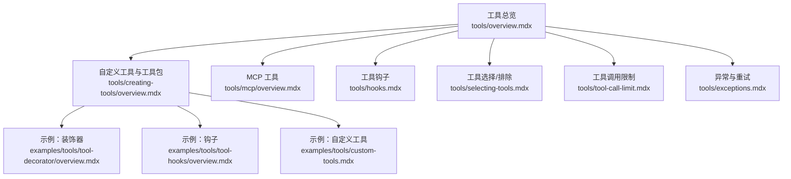
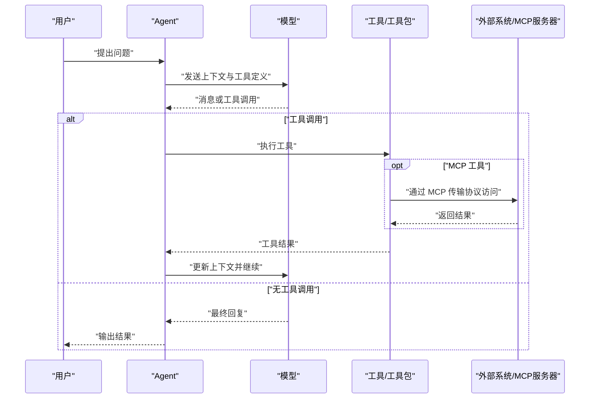
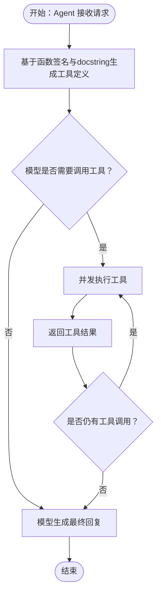
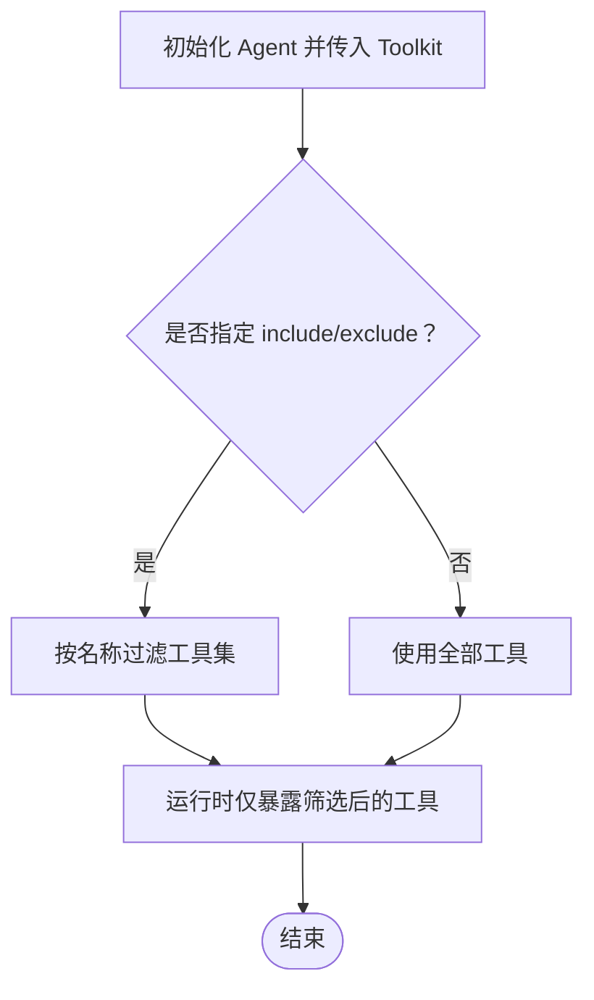
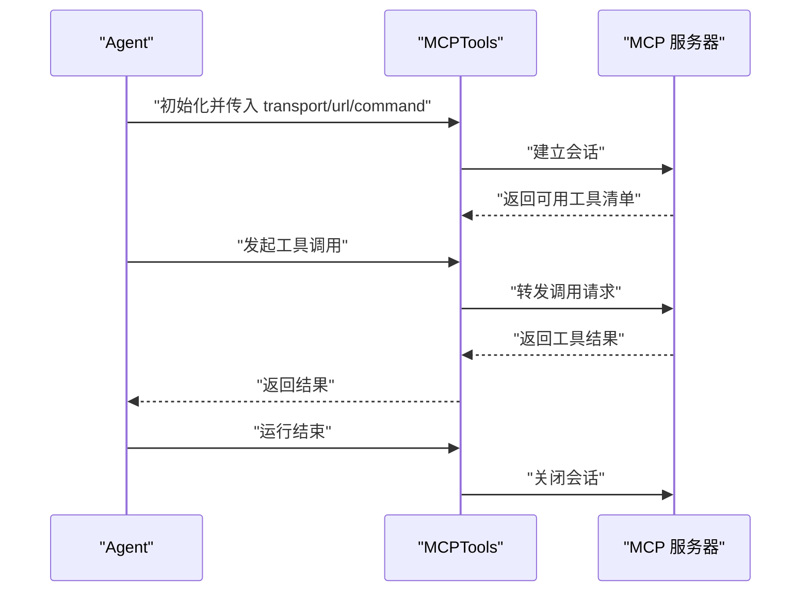
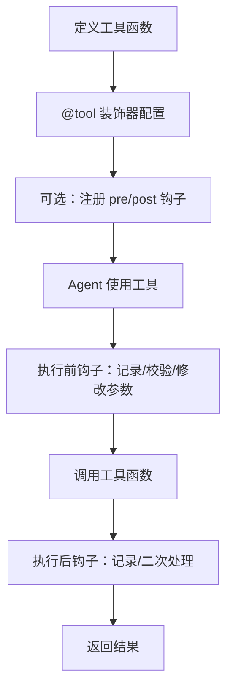
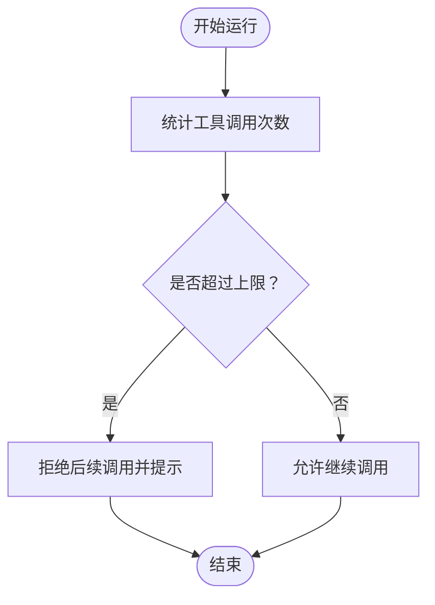
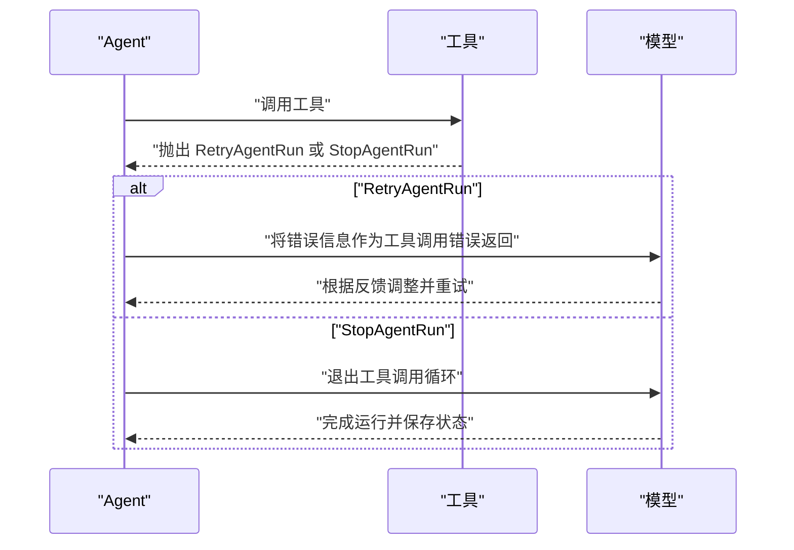
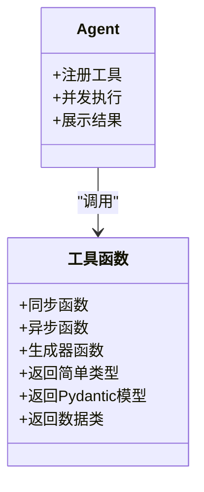
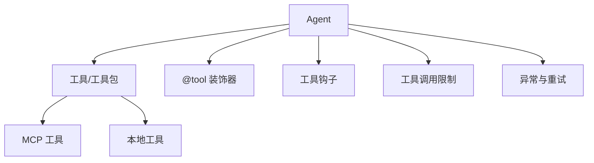

# 工具示例

<cite>
**本文引用的文件**   
- [tools/overview.mdx](file://tools/overview.mdx)
- [tools/creating-tools/overview.mdx](file://tools/creating-tools/overview.mdx)
- [tools/mcp/overview.mdx](file://tools/mcp/overview.mdx)
- [tools/hooks.mdx](file://tools/hooks.mdx)
- [tools/selecting-tools.mdx](file://tools/selecting-tools.mdx)
- [tools/tool-call-limit.mdx](file://tools/tool-call-limit.mdx)
- [tools/exceptions.mdx](file://tools/exceptions.mdx)
- [examples/tools/tool-decorator/overview.mdx](file://examples/tools/tool-decorator/overview.mdx)
- [examples/tools/tool-decorator/tool-decorator.mdx](file://examples/tools/tool-decorator/tool-decorator.mdx)
- [examples/tools/tool-hooks/overview.mdx](file://examples/tools/tool-hooks/overview.mdx)
- [examples/tools/tool-hooks/tool-hook.mdx](file://examples/tools/tool-hooks/tool-hook.mdx)
- [examples/tools/custom-tools.mdx](file://examples/tools/custom-tools.mdx)
</cite>

## 目录
1. [简介](#简介)
2. [项目结构](#项目结构)
3. [核心组件](#核心组件)
4. [架构总览](#架构总览)
5. [详细组件分析](#详细组件分析)
6. [依赖关系分析](#依赖关系分析)
7. [性能考量](#性能考量)
8. [故障排查指南](#故障排查指南)
9. [结论](#结论)
10. [附录](#附录)

## 简介
本章节面向“工具示例”主题，系统化梳理 Agno 的工具体系与使用范式，覆盖预构建工具（120+）、MCP 工具、自定义工具、工具包（Toolkit）以及工具装饰器、工具钩子、工具选择与调用限制等能力，并给出异常处理与重试机制的最佳实践。文档同时提供可直接定位到示例与参考页面的路径，便于读者快速上手。

## 项目结构
围绕“工具示例”的知识域，仓库中与之直接相关的文档主要分布在以下位置：
- 工具总览与基础概念：tools/overview.mdx
- 自定义工具与工具包：tools/creating-tools/overview.mdx
- MCP 工具：tools/mcp/overview.mdx
- 工具钩子：tools/hooks.mdx
- 工具选择与排除：tools/selecting-tools.mdx
- 工具调用限制：tools/tool-call-limit.mdx
- 异常与重试：tools/exceptions.mdx
- 示例：examples/tools 下的各类示例页（装饰器、钩子、自定义工具等）

**图表来源**
- [tools/overview.mdx:1-566](file://tools/overview.mdx#L1-L566)
- [tools/creating-tools/overview.mdx:1-27](file://tools/creating-tools/overview.mdx#L1-L27)
- [tools/mcp/overview.mdx:1-257](file://tools/mcp/overview.mdx#L1-L257)
- [tools/hooks.mdx:1-188](file://tools/hooks.mdx#L1-L188)
- [tools/selecting-tools.mdx:1-56](file://tools/selecting-tools.mdx#L1-L56)
- [tools/tool-call-limit.mdx:1-35](file://tools/tool-call-limit.mdx#L1-L35)
- [tools/exceptions.mdx:1-112](file://tools/exceptions.mdx#L1-L112)
- [examples/tools/tool-decorator/overview.mdx:1-14](file://examples/tools/tool-decorator/overview.mdx#L1-L14)
- [examples/tools/tool-hooks/overview.mdx:1-13](file://examples/tools/tool-hooks/overview.mdx#L1-L13)
- [examples/tools/custom-tools.mdx:1-202](file://examples/tools/custom-tools.mdx#L1-L202)

**章节来源**
- [tools/overview.mdx:1-566](file://tools/overview.mdx#L1-L566)
- [tools/creating-tools/overview.mdx:1-27](file://tools/creating-tools/overview.mdx#L1-L27)
- [tools/mcp/overview.mdx:1-257](file://tools/mcp/overview.mdx#L1-L257)
- [tools/hooks.mdx:1-188](file://tools/hooks.mdx#L1-L188)
- [tools/selecting-tools.mdx:1-56](file://tools/selecting-tools.mdx#L1-L56)
- [tools/tool-call-limit.mdx:1-35](file://tools/tool-call-limit.mdx#L1-L35)
- [tools/exceptions.mdx:1-112](file://tools/exceptions.mdx#L1-L112)
- [examples/tools/tool-decorator/overview.mdx:1-14](file://examples/tools/tool-decorator/overview.mdx#L1-L14)
- [examples/tools/tool-hooks/overview.mdx:1-13](file://examples/tools/tool-hooks/overview.mdx#L1-L13)
- [examples/tools/custom-tools.mdx:1-202](file://examples/tools/custom-tools.mdx#L1-L202)

## 核心组件
- 工具函数与自动定义：Agno 将 Python 函数自动转换为模型可用的工具定义（JSON Schema），支持 docstring 的参数说明与 Pydantic 模型入参。
- 工具执行与并发：在异步运行时，模型可并发触发多个工具调用；Agno 支持线程池并发执行同步工具。
- 工具包（Toolkit）：将一组相关工具封装为可复用的集合，支持 include/exclude 精细控制。
- MCP 工具：通过标准化的 MCP 协议连接外部系统，支持多种传输方式（stdio、Streamable HTTP、SSE）。
- 工具装饰器与钩子：通过 @tool 装饰器与 pre/post 钩子实现结果展示、缓存、指令注入、状态管理等增强行为。
- 工具选择与调用限制：支持按名称包含/排除工具，以及设置单次运行的工具调用上限。
- 异常与重试：在工具调用循环内通过 RetryAgentRun/StopAgentRun 提供反馈或提前结束。

**章节来源**
- [tools/overview.mdx:50-175](file://tools/overview.mdx#L50-L175)
- [tools/creating-tools/overview.mdx:14-27](file://tools/creating-tools/overview.mdx#L14-L27)
- [tools/mcp/overview.mdx:26-257](file://tools/mcp/overview.mdx#L26-L257)
- [tools/hooks.mdx:7-188](file://tools/hooks.mdx#L7-L188)
- [tools/selecting-tools.mdx:8-56](file://tools/selecting-tools.mdx#L8-L56)
- [tools/tool-call-limit.mdx:6-35](file://tools/tool-call-limit.mdx#L6-L35)
- [tools/exceptions.mdx:8-112](file://tools/exceptions.mdx#L8-L112)

## 架构总览
下图展示了从 Agent 到工具的典型调用链路，以及 MCP 工具与本地工具的并存模式：

**图表来源**
- [tools/overview.mdx:50-175](file://tools/overview.mdx#L50-L175)
- [tools/mcp/overview.mdx:26-189](file://tools/mcp/overview.mdx#L26-L189)

## 详细组件分析

### 组件一：工具函数与自动定义
- 自动定义：Agno 基于函数签名与 docstring 自动生成工具定义（含参数类型、描述、必填字段），并支持 Pydantic 模型作为参数。
- 执行流程：模型决定是否调用工具；若调用则并发执行，结果回传给模型以迭代直至无工具调用。
- 结果类型：简单类型（字符串、整数、字典、列表等）或 ToolResult（用于媒体类产物）。

**图表来源**
- [tools/overview.mdx:50-175](file://tools/overview.mdx#L50-L175)

**章节来源**
- [tools/overview.mdx:50-175](file://tools/overview.mdx#L50-L175)

### 组件二：工具包（Toolkit）与工具选择
- 工具包：将一组相关工具聚合为 Toolkit，便于统一管理与分发。
- 工具选择：通过 include_tools/exclude_tools 精准控制暴露给 Agent 的工具集，避免“过度授权”。

**图表来源**
- [tools/selecting-tools.mdx:8-56](file://tools/selecting-tools.mdx#L8-L56)

**章节来源**
- [tools/selecting-tools.mdx:8-56](file://tools/selecting-tools.mdx#L8-L56)

### 组件三：MCP 工具
- 连接方式：支持命令行启动或直接连接已部署的 MCP 服务；推荐显式 connect()/close() 生命周期管理。
- 传输协议：stdio、Streamable HTTP、SSE 三种传输方式。
- 自动管理：在 AgentOS 中可由框架自动管理生命周期；也可设置 refresh_connection 在每次运行前刷新连接与工具清单。

**图表来源**
- [tools/mcp/overview.mdx:26-257](file://tools/mcp/overview.mdx#L26-L257)

**章节来源**
- [tools/mcp/overview.mdx:26-257](file://tools/mcp/overview.mdx#L26-L257)

### 组件四：工具装饰器与钩子
- 装饰器：通过 @tool 可配置展示结果、缓存、指令、停止后立即结束等行为；支持静态方法与类方法上的装饰。
- 钩子：支持全局工具钩子（pre/post）与针对具体工具的钩子；可在钩子中访问 RunContext、Agent/Team 实例，实现日志、校验、参数替换等逻辑。

**图表来源**
- [examples/tools/tool-decorator/tool-decorator.mdx:1-177](file://examples/tools/tool-decorator/tool-decorator.mdx#L1-L177)
- [examples/tools/tool-hooks/tool-hook.mdx:1-91](file://examples/tools/tool-hooks/tool-hook.mdx#L1-L91)
- [tools/hooks.mdx:1-188](file://tools/hooks.mdx#L1-L188)

**章节来源**
- [examples/tools/tool-decorator/overview.mdx:1-14](file://examples/tools/tool-decorator/overview.mdx#L1-L14)
- [examples/tools/tool-decorator/tool-decorator.mdx:1-177](file://examples/tools/tool-decorator/tool-decorator.mdx#L1-L177)
- [examples/tools/tool-hooks/overview.mdx:1-13](file://examples/tools/tool-hooks/overview.mdx#L1-L13)
- [examples/tools/tool-hooks/tool-hook.mdx:1-91](file://examples/tools/tool-hooks/tool-hook.mdx#L1-L91)
- [tools/hooks.mdx:1-188](file://tools/hooks.mdx#L1-L188)

### 组件五：工具调用限制
- 通过 tool_call_limit 限制单次运行的工具调用次数，防止无限循环与成本失控；限制作用于整次运行而非单次请求。

**图表来源**
- [tools/tool-call-limit.mdx:6-35](file://tools/tool-call-limit.mdx#L6-L35)

**章节来源**
- [tools/tool-call-limit.mdx:6-35](file://tools/tool-call-limit.mdx#L6-L35)

### 组件六：异常与重试
- RetryAgentRun：在工具调用循环内向模型提供反馈，指导其调整策略并重试当前工具调用。
- StopAgentRun：退出工具调用循环并完成本次 Agent 运行，保存当前状态与历史。

**图表来源**
- [tools/exceptions.mdx:8-112](file://tools/exceptions.mdx#L8-L112)

**章节来源**
- [tools/exceptions.mdx:8-112](file://tools/exceptions.mdx#L8-L112)

### 组件七：自定义工具与多形态返回
- 支持同步/异步函数、生成器、Pydantic 模型、数据类等多种返回形态；示例覆盖了常见场景与异步变体。

**图表来源**
- [examples/tools/custom-tools.mdx:1-202](file://examples/tools/custom-tools.mdx#L1-L202)

**章节来源**
- [examples/tools/custom-tools.mdx:1-202](file://examples/tools/custom-tools.mdx#L1-L202)

## 依赖关系分析
- 工具层依赖：Agent 依赖工具函数/工具包；工具包可进一步依赖外部系统（如 MCP 服务器）。
- 生命周期依赖：MCP 工具依赖显式连接/断开；装饰器与钩子依赖 Agent 上下文（RunContext、Agent/Team）。
- 控制流依赖：工具调用限制与异常处理影响 Agent 的执行循环与最终状态。

**图表来源**
- [tools/overview.mdx:50-175](file://tools/overview.mdx#L50-L175)
- [tools/mcp/overview.mdx:26-257](file://tools/mcp/overview.mdx#L26-L257)
- [tools/hooks.mdx:1-188](file://tools/hooks.mdx#L1-L188)
- [tools/tool-call-limit.mdx:6-35](file://tools/tool-call-limit.mdx#L6-L35)
- [tools/exceptions.mdx:8-112](file://tools/exceptions.mdx#L8-L112)

**章节来源**
- [tools/overview.mdx:50-175](file://tools/overview.mdx#L50-L175)
- [tools/mcp/overview.mdx:26-257](file://tools/mcp/overview.mdx#L26-L257)
- [tools/hooks.mdx:1-188](file://tools/hooks.mdx#L1-L188)
- [tools/tool-call-limit.mdx:6-35](file://tools/tool-call-limit.mdx#L6-L35)
- [tools/exceptions.mdx:8-112](file://tools/exceptions.mdx#L8-L112)

## 性能考量
- 并发执行：在异步运行时，模型可并发触发多个工具调用，显著降低端到端延迟；需确保工具本身具备并发安全性。
- 缓存策略：通过 @tool 的 cache_results 或工具层缓存减少重复调用；对易变数据谨慎使用缓存。
- 连接管理：MCP 工具建议显式 connect/close，避免频繁刷新带来的额外开销；在 AgentOS 中可由框架自动管理生命周期。
- 工具选择：通过 include/exclude 精简工具集，减少模型上下文负担与误调用风险。

[本节为通用建议，不直接分析具体文件]

## 故障排查指南
- 工具未被识别：检查函数签名与 docstring 是否完整；确认是否正确使用 @tool 装饰器。
- 工具并发失败：确认模型支持并行函数调用；检查工具内部是否线程安全。
- MCP 连接异常：核对 transport/url/command 参数；必要时启用 refresh_connection；确保资源清理（connect/close）。
- 工具调用过多：设置 tool_call_limit；在工具中尽早返回或抛出异常以终止循环。
- 重试无效：RetryAgentRun 仅影响当前工具调用循环内的反馈；如需完全中断，请使用 StopAgentRun。

**章节来源**
- [tools/exceptions.mdx:8-112](file://tools/exceptions.mdx#L8-L112)
- [tools/tool-call-limit.mdx:6-35](file://tools/tool-call-limit.mdx#L6-L35)
- [tools/mcp/overview.mdx:131-211](file://tools/mcp/overview.mdx#L131-L211)

## 结论
Agno 的工具体系以“函数即工具”为核心理念，辅以装饰器、钩子、工具包、MCP 协议与严格的生命周期管理，形成从开发到生产的完整闭环。通过 include/exclude、调用限制与异常重试机制，既能保证灵活性，又能有效控制成本与稳定性。建议在生产环境中结合缓存、并发与连接管理最佳实践，持续优化工具链路的性能与可靠性。

[本节为总结性内容，不直接分析具体文件]

## 附录
- 快速索引
  - 工具总览与并发执行：[tools/overview.mdx:50-175](file://tools/overview.mdx#L50-L175)
  - 自定义工具与工具包：[tools/creating-tools/overview.mdx:14-27](file://tools/creating-tools/overview.mdx#L14-L27)
  - MCP 工具接入与传输：[tools/mcp/overview.mdx:26-257](file://tools/mcp/overview.mdx#L26-L257)
  - 工具钩子与装饰器：[tools/hooks.mdx:1-188](file://tools/hooks.mdx#L1-188)、[examples/tools/tool-decorator/overview.mdx:1-14](file://examples/tools/tool-decorator/overview.mdx#L1-L14)
  - 工具选择与排除：[tools/selecting-tools.mdx:8-56](file://tools/selecting-tools.mdx#L8-L56)
  - 工具调用限制：[tools/tool-call-limit.mdx:6-35](file://tools/tool-call-limit.mdx#L6-L35)
  - 异常与重试：[tools/exceptions.mdx:8-112](file://tools/exceptions.mdx#L8-L112)
  - 自定义工具示例：[examples/tools/custom-tools.mdx:1-202](file://examples/tools/custom-tools.mdx#L1-L202)

[本节为导航性内容，不直接分析具体文件]