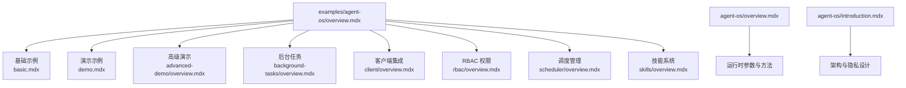
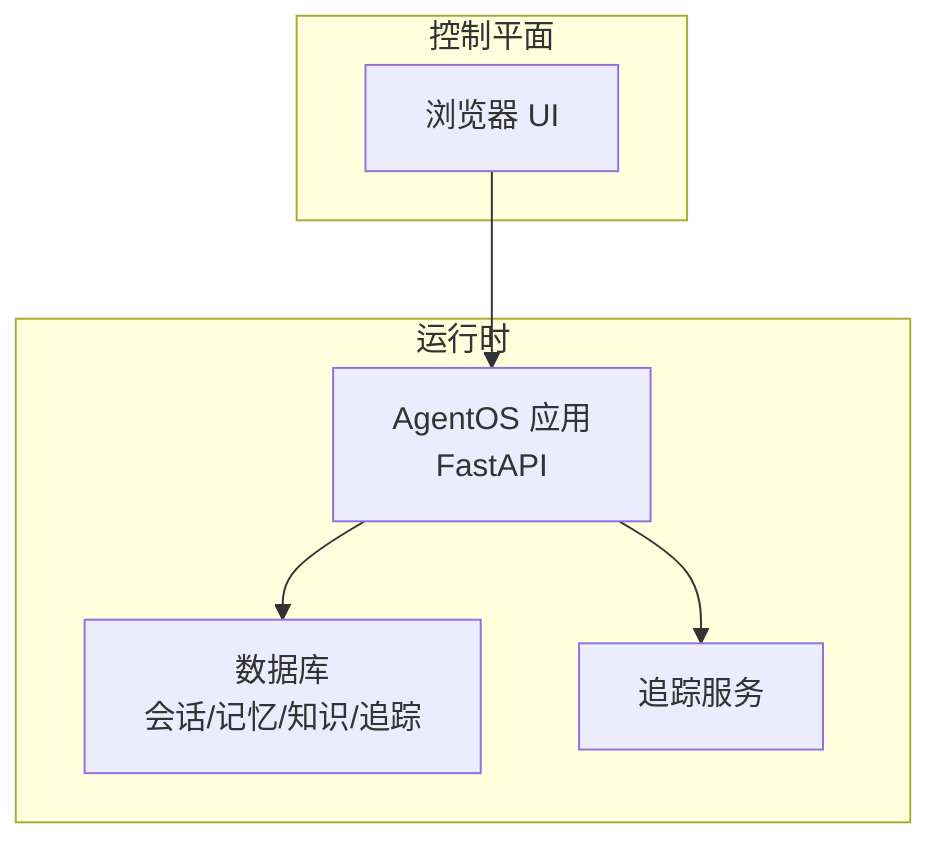
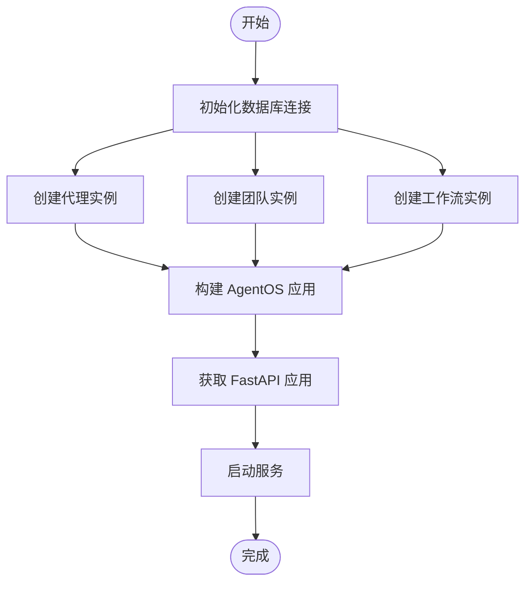
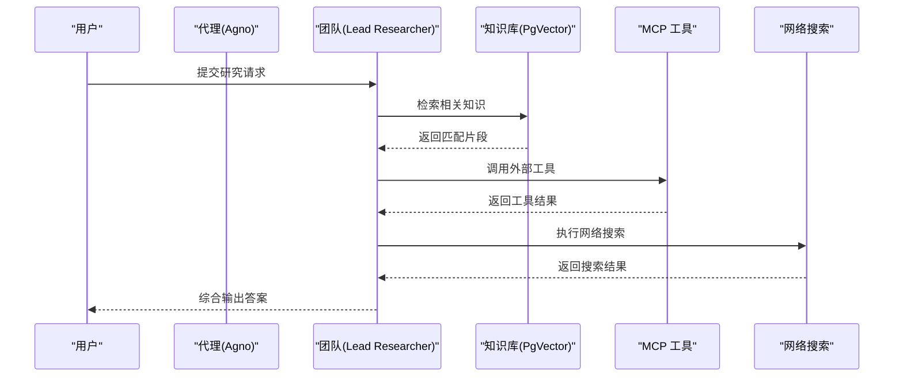
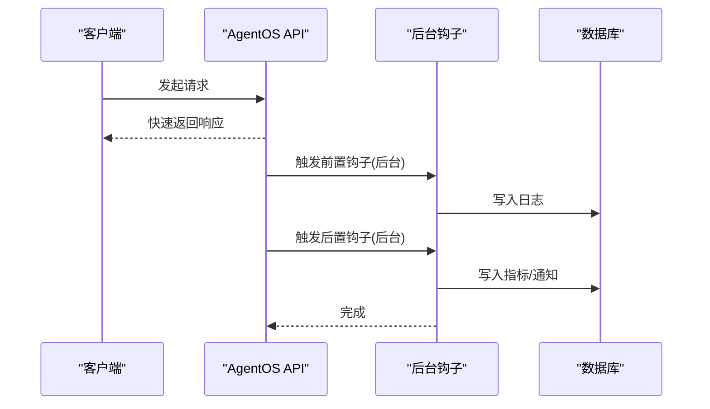
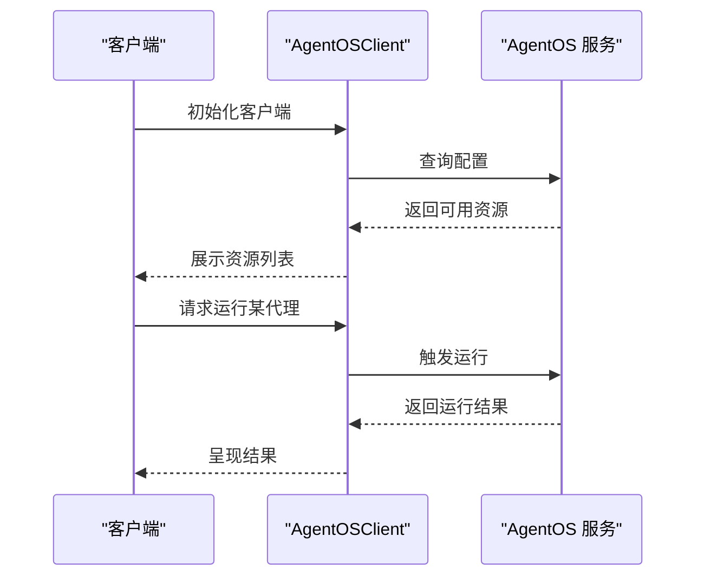
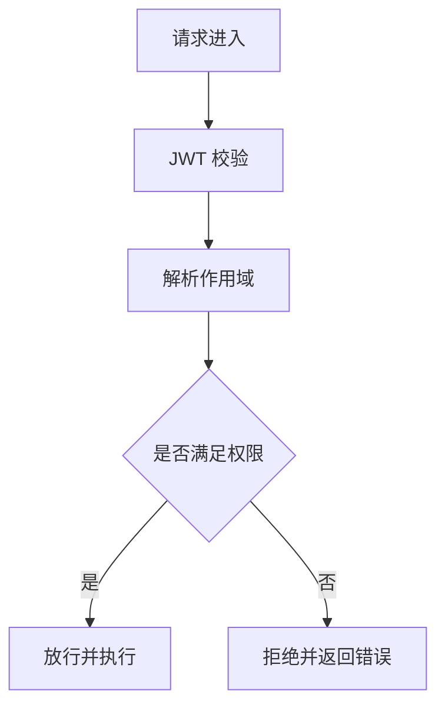
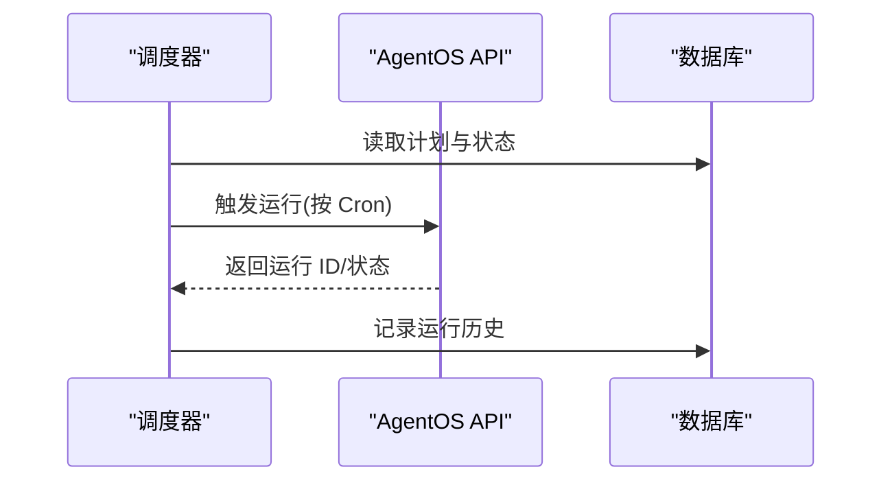
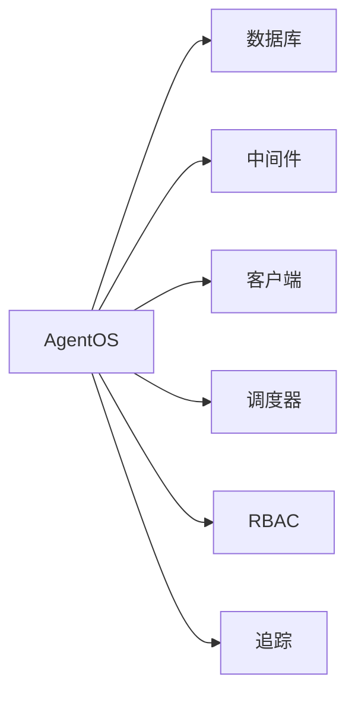

# AgentOS 示例

<cite>
**本文引用的文件**
- [agent-os/introduction.mdx](file://agent-os/introduction.mdx)
- [agent-os/overview.mdx](file://agent-os/overview.mdx)
- [examples/agent-os/overview.mdx](file://examples/agent-os/overview.mdx)
- [examples/agent-os/basic.mdx](file://examples/agent-os/basic.mdx)
- [examples/agent-os/demo.mdx](file://examples/agent-os/demo.mdx)
- [examples/agent-os/advanced-demo/overview.mdx](file://examples/agent-os/advanced-demo/overview.mdx)
- [examples/agent-os/background-tasks/overview.mdx](file://examples/agent-os/background-tasks/overview.mdx)
- [examples/agent-os/background-tasks/background-hooks-decorator.mdx](file://examples/agent-os/background-tasks/background-hooks-decorator.mdx)
- [examples/agent-os/client/overview.mdx](file://examples/agent-os/client/overview.mdx)
- [examples/agent-os/client/basic-client.mdx](file://examples/agent-os/client/basic-client.mdx)
- [examples/agent-os/rbac/overview.mdx](file://examples/agent-os/rbac/overview.mdx)
- [examples/agent-os/rbac/asymmetric/overview.mdx](file://examples/agent-os/rbac/asymmetric/overview.mdx)
- [examples/agent-os/scheduler/overview.mdx](file://examples/agent-os/scheduler/overview.mdx)
- [examples/agent-os/scheduler/basic-schedule.mdx](file://examples/agent-os/scheduler/basic-schedule.mdx)
- [examples/agent-os/skills/overview.mdx](file://examples/agent-os/skills/overview.mdx)
</cite>

## 目录
1. [简介](#简介)
2. [项目结构](#项目结构)
3. [核心组件](#核心组件)
4. [架构总览](#架构总览)
5. [详细组件分析](#详细组件分析)
6. [依赖关系分析](#依赖关系分析)
7. [性能考量](#性能考量)
8. [故障排查指南](#故障排查指南)
9. [结论](#结论)
10. [附录](#附录)

## 简介
本文件面向希望在生产环境中使用 AgentOS 的工程师与架构师，系统梳理 AgentOS 运行时与控制平面的典型使用场景：从基础设置、高级演示、后台任务、客户端集成、接口配置、数据库连接、中间件设置、RBAC 权限控制、远程执行、调度管理、模式验证、技能系统到跟踪功能。文档以示例为线索，逐项说明核心概念、使用场景与最佳实践，并提供可直接定位到仓库源码的路径指引。

## 项目结构
AgentOS 示例位于 examples/agent-os 下，按功能域划分多个子目录，覆盖运行时配置、数据库、接口、权限、调度、技能、跟踪等主题；同时 agent-os 目录提供运行时与控制平面的总体介绍与参数说明。

**图表来源**
- [examples/agent-os/overview.mdx:1-30](file://examples/agent-os/overview.mdx#L1-L30)
- [agent-os/overview.mdx:1-86](file://agent-os/overview.mdx#L1-L86)
- [agent-os/introduction.mdx:1-113](file://agent-os/introduction.mdx#L1-L113)

**章节来源**
- [examples/agent-os/overview.mdx:1-30](file://examples/agent-os/overview.mdx#L1-L30)
- [agent-os/overview.mdx:1-86](file://agent-os/overview.mdx#L1-L86)
- [agent-os/introduction.mdx:1-113](file://agent-os/introduction.mdx#L1-L113)

## 核心组件
- AgentOS 运行时：通过 AgentOS 类构建 FastAPI 应用，统一暴露代理、团队、工作流等资源的 API，并支持追踪、知识库、接口、中间件、RBAC、调度、MCP 等扩展能力。
- 数据层：支持多种数据库后端（如 SQLite、Postgres、PgVector 等），用于会话、记忆、知识向量存储与追踪。
- 客户端：提供 AgentOSClient 以异步方式连接远端 AgentOS，查询配置、执行代理/团队/工作流运行、管理会话与知识。
- 中间件与安全：内置 JWT/RBAC 支持，可自定义作用域映射；支持 CORS 与自定义 FastAPI 应用。
- 调度器：基于 Cron 表达式定时触发代理/团队/工作流运行，支持 REST 管理与自动发现。
- 技能系统：支持加载与创建技能，提升代理复用性与模块化。
- 跟踪：可启用数据库级追踪，记录请求、响应、会话与运行历史，便于审计与调试。

**章节来源**
- [agent-os/overview.mdx:27-48](file://agent-os/overview.mdx#L27-L48)
- [agent-os/overview.mdx:51-72](file://agent-os/overview.mdx#L51-L72)

## 架构总览
AgentOS 由“运行时”和“控制平面”组成：运行时以 FastAPI 暴露 API，控制平面提供可视化管理与调试界面。数据完全驻留在用户数据库中，无第三方传输或锁定。

**图表来源**
- [agent-os/introduction.mdx:40-61](file://agent-os/introduction.mdx#L40-L61)

**章节来源**
- [agent-os/introduction.mdx:40-61](file://agent-os/introduction.mdx#L40-L61)

## 详细组件分析

### 基础设置：最小示例与多组件编排
- 目标：快速搭建包含代理、团队、工作流的最小 AgentOS 应用，验证配置与服务启动流程。
- 关键点：
  - 使用 PostgresDb 作为数据后端，确保会话、记忆、知识与追踪持久化。
  - 通过 AgentOS 构建应用，调用 get_app() 获取 FastAPI 实例，再通过 serve() 启动。
  - 工作流可选加入工作流历史，增强步骤上下文。
- 最佳实践：
  - 明确数据库连接字符串与表空间，避免迁移冲突。
  - 在开发环境开启 reload，提高迭代效率；生产环境关闭。
  - 将模型、工具、指令等参数集中于配置文件或对象，便于维护。

**图表来源**
- [examples/agent-os/basic.mdx:20-64](file://examples/agent-os/basic.mdx#L20-L64)

**章节来源**
- [examples/agent-os/basic.mdx:1-93](file://examples/agent-os/basic.mdx#L1-L93)

### 高级演示：知识库、MCP 工具与研究型团队
- 目标：展示复杂场景下的 AgentOS 集成，包括知识库检索、MCP 工具、网页搜索工具与多代理团队协作。
- 关键点：
  - 使用 PostgresDb 与 PgVector 构建知识库，支持向量化检索与重排。
  - 为代理注入 MCP 工具与 WebSearch 工具，扩展外部能力。
  - 团队成员包含不同角色的代理，统一由团队模型协调。
- 最佳实践：
  - 将知识库内容与向量表分离，便于独立扩容与维护。
  - 对工具调用进行限流与超时控制，避免阻塞主流程。
  - 为团队设定明确的协调策略与提示词，减少重复与冲突。

**图表来源**
- [examples/agent-os/demo.mdx:40-99](file://examples/agent-os/demo.mdx#L40-L99)

**章节来源**
- [examples/agent-os/demo.mdx:1-126](file://examples/agent-os/demo.mdx#L1-L126)

### 后台任务：非阻塞钩子与评估
- 目标：通过后台钩子实现日志、通知等非关键任务的异步执行，不阻塞主请求响应。
- 关键点：
  - 使用装饰器标记钩子在后台运行，前置钩子不可修改输入，后置钩子适合异步统计与通知。
  - 异步数据库与异步工具需配合事件循环，避免阻塞。
- 最佳实践：
  - 将耗时任务放入后台钩子，保持 API 响应时间稳定。
  - 对后台任务增加幂等与重试策略，防止重复执行。
  - 记录后台任务状态与错误，便于监控与回溯。

**图表来源**
- [examples/agent-os/background-tasks/background-hooks-decorator.mdx:27-76](file://examples/agent-os/background-tasks/background-hooks-decorator.mdx#L27-L76)

**章节来源**
- [examples/agent-os/background-tasks/overview.mdx:1-15](file://examples/agent-os/background-tasks/overview.mdx#L1-L15)
- [examples/agent-os/background-tasks/background-hooks-decorator.mdx:1-110](file://examples/agent-os/background-tasks/background-hooks-decorator.mdx#L1-L110)

### 客户端集成：远程访问与资源管理
- 目标：通过 AgentOSClient 连接远端 AgentOS，查询配置、执行运行、管理会话与知识。
- 关键点：
  - 使用异步客户端连接本地或云端 AgentOS，获取可用代理/团队/工作流列表。
  - 可对指定资源发起运行请求，接收流式或非流式响应。
- 最佳实践：
  - 在客户端侧缓存配置信息，降低重复查询成本。
  - 对长连接与重试进行合理配置，避免瞬时失败影响用户体验。
  - 对敏感操作（如删除知识）增加二次确认与审计日志。

**图表来源**
- [examples/agent-os/client/basic-client.mdx:40-65](file://examples/agent-os/client/basic-client.mdx#L40-L65)

**章节来源**
- [examples/agent-os/client/overview.mdx:1-18](file://examples/agent-os/client/overview.mdx#L1-L18)
- [examples/agent-os/client/basic-client.mdx:1-80](file://examples/agent-os/client/basic-client.mdx#L1-L80)

### 接口配置：自定义 FastAPI 与跨域
- 目标：在 AgentOS 中注入自定义 FastAPI 应用与路由，或配置跨域来源，满足前端直连与安全策略。
- 关键点：
  - 通过 base_app 参数传入自定义 FastAPI 实例，扩展业务路由或中间件。
  - 通过 cors_allowed_origins 控制允许的前端域名，避免 CSRF 与跨站风险。
- 最佳实践：
  - 将自定义路由与 AgentOS 路由分层，避免命名冲突。
  - 生产环境仅开放必要来源，结合 HTTPS 与安全头强化防护。

**章节来源**
- [agent-os/overview.mdx:41-46](file://agent-os/overview.mdx#L41-L46)

### 数据库连接：多后端与向量存储
- 目标：在 AgentOS 中接入多种数据库后端，支撑会话、记忆、知识与追踪。
- 关键点：
  - 使用 PostgresDb 作为通用数据存储；结合 PgVector 作为向量数据库，支持 RAG 场景。
  - 可根据需要选择 SQLite（开发）、Postgres（生产）、Redis/Mongo 等作为缓存或辅助存储。
- 最佳实践：
  - 将数据库连接参数集中管理，区分开发/测试/生产环境。
  - 对向量表进行分区与索引优化，平衡检索精度与性能。

**章节来源**
- [examples/agent-os/basic.mdx:20-21](file://examples/agent-os/basic.mdx#L20-L21)
- [examples/agent-os/demo.mdx:32-44](file://examples/agent-os/demo.mdx#L32-L44)

### 中间件设置：JWT 与自定义中间件
- 目标：在 AgentOS 中启用 JWT 验证与自定义中间件，实现鉴权与请求处理扩展。
- 关键点：
  - 通过 authorization 与 authorization_config 开启 RBAC，结合 JWT 验证。
  - 自定义中间件可用于日志、限流、请求改写等。
- 最佳实践：
  - 将密钥与证书置于安全位置，定期轮换。
  - 中间件链路尽量轻量，避免影响请求延迟。

**章节来源**
- [agent-os/overview.mdx:42-44](file://agent-os/overview.mdx#L42-L44)

### RBAC 权限控制：对称与非对称场景
- 目标：在 AgentOS 中启用基于角色的访问控制，支持对称与非对称权限映射。
- 关键点：
  - 通过授权开关与配置启用 JWT 验证与作用域映射。
  - 非对称场景下，可为不同端点定义差异化权限，细化控制粒度。
- 最佳实践：
  - 为不同用户/客户端分配最小权限集合，遵循“按需授权”原则。
  - 对关键操作（如删除、修改配置）强制二次校验与审计日志。

**图表来源**
- [examples/agent-os/rbac/asymmetric/overview.mdx:8-9](file://examples/agent-os/rbac/asymmetric/overview.mdx#L8-L9)

**章节来源**
- [examples/agent-os/rbac/overview.mdx:1-10](file://examples/agent-os/rbac/overview.mdx#L1-L10)
- [examples/agent-os/rbac/asymmetric/overview.mdx:1-10](file://examples/agent-os/rbac/asymmetric/overview.mdx#L1-L10)

### 远程执行：网关与远程代理/团队/工作流
- 目标：通过 AgentOS 的远程执行能力，将本地代理/团队/工作流暴露为远程服务，供其他系统调用。
- 关键点：
  - 使用远程执行网关与远程代理/团队/工作流，实现跨边界协作。
  - 结合认证与授权，确保远程调用的安全性。
- 最佳实践：
  - 对远程调用进行速率限制与超时控制，避免级联故障。
  - 记录远程调用的元数据与错误，便于问题定位。

**章节来源**
- [agent-os/overview.mdx:44-44](file://agent-os/overview.mdx#L44-L44)

### 调度管理：定时触发与 REST 管理
- 目标：在 AgentOS 中启用调度器，基于 Cron 表达式定时触发代理/团队/工作流运行，并通过 REST API 管理计划。
- 关键点：
  - 启用 scheduler 并设置轮询间隔，自动发现与执行计划。
  - 通过 REST API 创建、列出、更新、启用/禁用、查看运行历史。
- 最佳实践：
  - 将调度与业务高峰错开，避免资源争抢。
  - 对失败的调度任务进行告警与重试，保障可靠性。

**图表来源**
- [examples/agent-os/scheduler/basic-schedule.mdx:56-70](file://examples/agent-os/scheduler/basic-schedule.mdx#L56-L70)

**章节来源**
- [examples/agent-os/scheduler/overview.mdx:1-18](file://examples/agent-os/scheduler/overview.mdx#L1-L18)
- [examples/agent-os/scheduler/basic-schedule.mdx:1-88](file://examples/agent-os/scheduler/basic-schedule.mdx#L1-L88)

### 模式验证：配置与运行时参数校验
- 目标：在 AgentOS 中对配置与运行时参数进行校验，确保一致性与安全性。
- 关键点：
  - 通过配置对象或 YAML 文件集中管理参数，避免硬编码。
  - 对数据库、模型、工具等关键参数进行类型与范围校验。
- 最佳实践：
  - 在 CI 中加入配置校验步骤，提前发现错误。
  - 对外部依赖（如模型密钥、数据库地址）进行环境变量校验。

**章节来源**
- [agent-os/overview.mdx:73-85](file://agent-os/overview.mdx#L73-L85)

### 技能系统：模块化与复用
- 目标：通过技能系统提升代理能力的模块化与复用性，降低重复开发成本。
- 关键点：
  - 技能可被多个代理共享，统一训练与迭代。
  - 支持在 AgentOS 中加载与创建技能，适配不同业务场景。
- 最佳实践：
  - 将高频任务抽象为技能，形成内部能力池。
  - 对技能进行版本管理与灰度发布，确保稳定性。

**章节来源**
- [examples/agent-os/skills/overview.mdx:1-10](file://examples/agent-os/skills/overview.mdx#L1-L10)

### 跟踪功能：数据库级追踪与审计
- 目标：启用 AgentOS 的追踪能力，将请求、响应、会话与运行历史持久化至数据库，便于审计与调试。
- 关键点：
  - 通过 tracing 参数启用追踪，所有运行数据写入配置的数据库。
  - 追踪数据可用于性能分析、合规审计与问题回放。
- 最佳实践：
  - 对敏感字段进行脱敏处理，遵守数据保护法规。
  - 定期清理过期追踪数据，控制存储成本。

**章节来源**
- [agent-os/overview.mdx:36-36](file://agent-os/overview.mdx#L36-L36)

## 依赖关系分析
- AgentOS 与数据库：通过 BaseDb 抽象对接多种数据库，知识库与向量库可独立配置。
- AgentOS 与中间件：可注入自定义 FastAPI 应用与中间件，实现鉴权、日志与限流。
- AgentOS 与客户端：通过 AgentOSClient 提供异步访问能力，支持运行、会话与知识管理。
- AgentOS 与调度器：通过 Cron 表达式与 REST API 管理定时任务，支持多代理与团队工作流。
- AgentOS 与 RBAC：基于 JWT 的角色控制，支持对称与非对称权限映射。

**图表来源**
- [agent-os/overview.mdx:27-48](file://agent-os/overview.mdx#L27-L48)

**章节来源**
- [agent-os/overview.mdx:27-48](file://agent-os/overview.mdx#L27-L48)

## 性能考量
- 数据库：优先使用连接池与批量写入，减少 IO 延迟；对向量检索建立合适索引。
- 网络：客户端与服务端均启用合理的超时与重试策略；对大文本与流式响应进行分片处理。
- 调度：将高负载任务分散到不同时间段，避免峰值拥塞。
- 追踪：对追踪数据进行采样与压缩，平衡可观测性与成本。

## 故障排查指南
- 启动失败：检查数据库连接字符串、模型密钥与端口占用；确认依赖安装完整。
- 权限错误：核对 JWT 令牌与作用域映射，确保端点权限正确配置。
- 调度异常：检查 Cron 表达式与调度轮询间隔，查看运行历史与错误日志。
- 追踪缺失：确认 tracing 开关与数据库写入权限，检查追踪表结构与索引。
- 客户端连接：验证 base_url 与 CORS 配置，确保网络可达与证书有效。

**章节来源**
- [faq/rbac-auth-failed.mdx](file://faq/rbac-auth-failed.mdx)
- [faq/environment-variables.mdx](file://faq/environment-variables.mdx)

## 结论
AgentOS 提供了从开发到生产的全栈能力：以 AgentOS 类为核心，统一编排代理、团队与工作流；通过数据库、中间件、RBAC、调度与追踪等模块，满足企业级部署与治理需求。建议在实际落地中，优先完成数据库与权限配置，再逐步引入调度、技能与追踪，最终形成可演进的智能体平台。

## 附录
- 快速入口：参考示例概览，选择对应场景的示例文件进行对照学习。
- 参数参考：AgentOS 类参数与方法详见运行时概览文档。
- 架构说明：运行时与控制平面的关系、隐私设计与数据流见介绍文档。

**章节来源**
- [examples/agent-os/overview.mdx:6-30](file://examples/agent-os/overview.mdx#L6-L30)
- [agent-os/overview.mdx:27-72](file://agent-os/overview.mdx#L27-L72)
- [agent-os/introduction.mdx:40-91](file://agent-os/introduction.mdx#L40-L91)