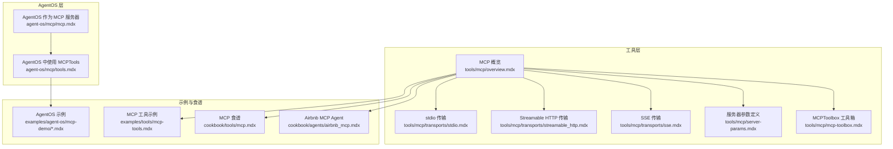
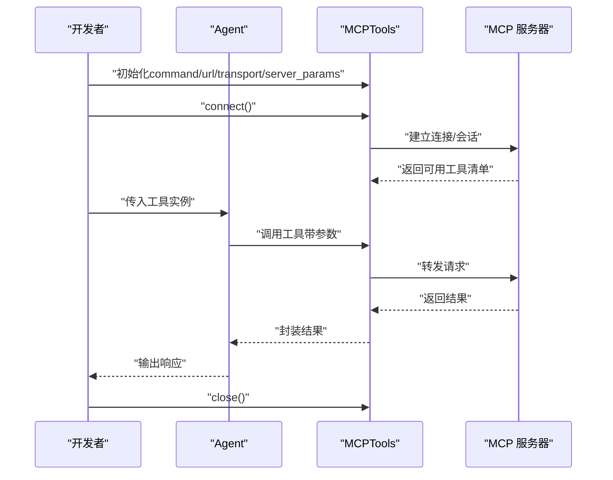
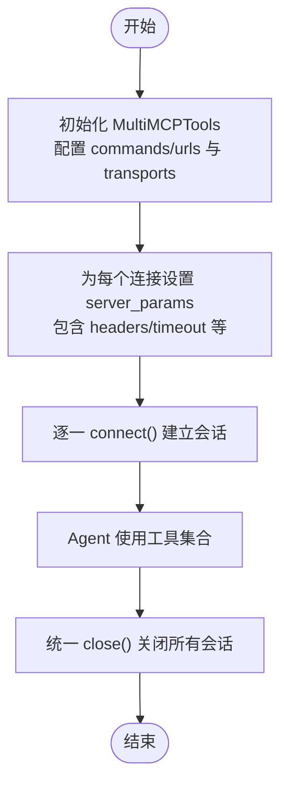
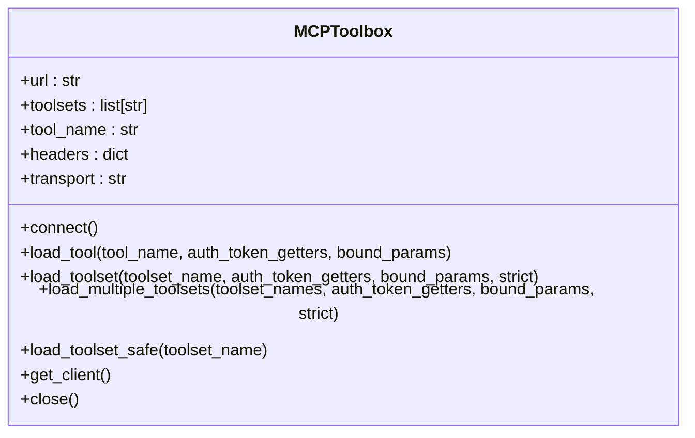
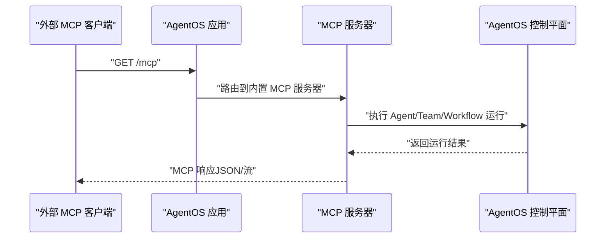
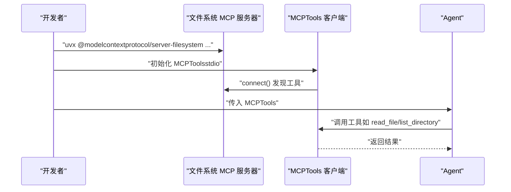
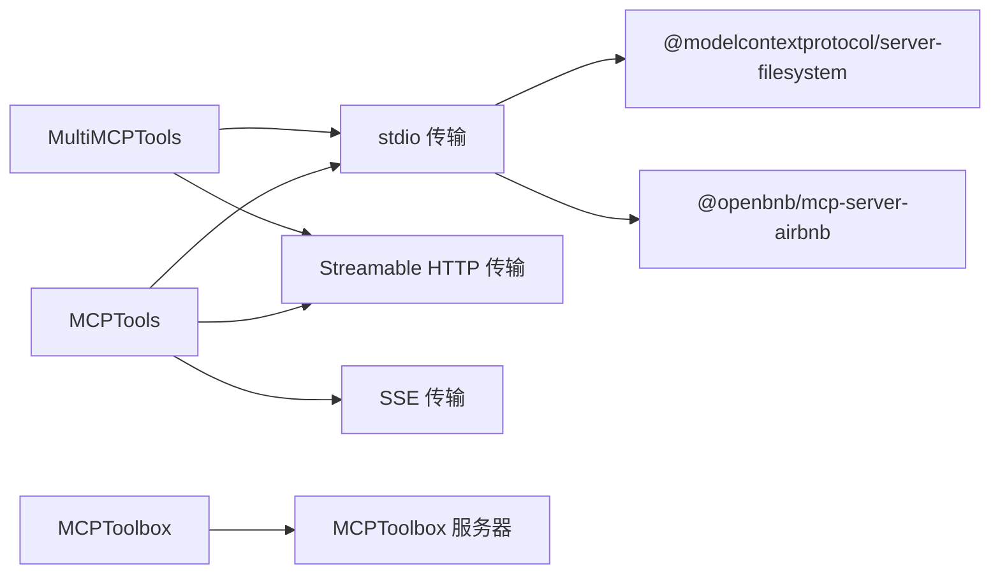

# MCP 集成示例

<cite>
**本文引用的文件**
- [tools/mcp/overview.mdx](file://tools/mcp/overview.mdx)
- [tools/mcp/transports/stdio.mdx](file://tools/mcp/transports/stdio.mdx)
- [tools/mcp/transports/streamable_http.mdx](file://tools/mcp/transports/streamable_http.mdx)
- [tools/mcp/transports/sse.mdx](file://tools/mcp/transports/sse.mdx)
- [tools/mcp/server-params.mdx](file://tools/mcp/server-params.mdx)
- [tools/mcp/mcp-toolbox.mdx](file://tools/mcp/mcp-toolbox.mdx)
- [agent-os/mcp/mcp.mdx](file://agent-os/mcp/mcp.mdx)
- [agent-os/mcp/tools.mdx](file://agent-os/mcp/tools.mdx)
- [examples/agent-os/mcp-demo/mcp-tools-example.mdx](file://examples/agent-os/mcp-demo/mcp-tools-example.mdx)
- [examples/agent-os/mcp-demo/mcp-tools-advanced-example.mdx](file://examples/agent-os/mcp-demo/mcp-tools-advanced-example.mdx)
- [examples/agent-os/mcp-demo/mcp-tools-existing-lifespan.mdx](file://examples/agent-os/mcp-demo/mcp-tools-existing-lifespan.mdx)
- [examples/tools/mcp-tools.mdx](file://examples/tools/mcp-tools.mdx)
- [cookbook/tools/mcp.mdx](file://cookbook/tools/mcp.mdx)
- [cookbook/agents/airbnb_mcp.mdx](file://cookbook/agents/airbnb_mcp.mdx)
</cite>

## 目录
1. [简介](#简介)
2. [项目结构](#项目结构)
3. [核心组件](#核心组件)
4. [架构总览](#架构总览)
5. [详细组件分析](#详细组件分析)
6. [依赖关系分析](#依赖关系分析)
7. [性能考虑](#性能考虑)
8. [故障排查指南](#故障排查指南)
9. [结论](#结论)
10. [附录](#附录)

## 简介
本技术文档围绕 AgentOS 的 MCP（Model Context Protocol）集成示例，系统讲解如何通过 MCP 协议连接外部工具与服务，覆盖以下主题：
- MCP 协议工作原理与三大传输方式（stdio、Streamable HTTP、SSE）
- 工具注册机制与工具过滤能力（含 MCPToolbox）
- 生命周期管理与连接刷新策略
- 动态头部配置与多服务器并行接入
- 测试客户端与示例工程运行方式
- 如何扩展 AgentOS 的工具生态系统

## 项目结构
与 MCP 集成相关的内容主要分布在如下位置：
- 工具层：MCP 基础用法、传输层、工具箱（MCPToolbox）、服务器参数定义
- AgentOS 层：作为 MCP 服务器暴露能力、在 AgentOS 中使用 MCPTools
- 示例与食谱：本地/远程 MCP 服务器示例、多服务器并行、AgentOS 集成示例、Airbnb 搜索 Agent



**图表来源**
- [tools/mcp/overview.mdx:1-240](file://tools/mcp/overview.mdx#L1-L240)
- [tools/mcp/transports/stdio.mdx:1-82](file://tools/mcp/transports/stdio.mdx#L1-L82)
- [tools/mcp/transports/streamable_http.mdx:1-155](file://tools/mcp/transports/streamable_http.mdx#L1-L155)
- [tools/mcp/transports/sse.mdx:1-38](file://tools/mcp/transports/sse.mdx#L1-L38)
- [tools/mcp/server-params.mdx:26-37](file://tools/mcp/server-params.mdx#L26-L37)
- [tools/mcp/mcp-toolbox.mdx:1-252](file://tools/mcp/mcp-toolbox.mdx#L1-L252)
- [agent-os/mcp/mcp.mdx:1-146](file://agent-os/mcp/mcp.mdx#L1-L146)
- [agent-os/mcp/tools.mdx:1-57](file://agent-os/mcp/tools.mdx#L1-L57)
- [examples/agent-os/mcp-demo/mcp-tools-example.mdx:1-75](file://examples/agent-os/mcp-demo/mcp-tools-example.mdx#L1-L75)
- [examples/tools/mcp-tools.mdx:1-73](file://examples/tools/mcp-tools.mdx#L1-L73)
- [cookbook/tools/mcp.mdx:1-193](file://cookbook/tools/mcp.mdx#L1-L193)
- [cookbook/agents/airbnb_mcp.mdx:1-87](file://cookbook/agents/airbnb_mcp.mdx#L1-L87)

**章节来源**
- [tools/mcp/overview.mdx:1-240](file://tools/mcp/overview.mdx#L1-L240)
- [agent-os/mcp/mcp.mdx:1-146](file://agent-os/mcp/mcp.mdx#L1-L146)
- [agent-os/mcp/tools.mdx:1-57](file://agent-os/mcp/tools.mdx#L1-L57)

## 核心组件
- MCPTools/MultiMCPTools：封装与 MCP 服务器的连接、工具发现与调用，支持多种传输方式与生命周期管理。
- MCPToolbox：在 MCPToolbox 服务器上按“工具集”或“工具名”进行筛选，减少工具过载问题。
- AgentOS 作为 MCP 服务器：将 AgentOS 的控制平面能力以 MCP 工具形式暴露，便于外部客户端直接调用。
- 传输层：stdio（默认，适合本地）、Streamable HTTP（推荐）、SSE（已不推荐）。

关键要点
- 连接管理：支持显式 connect/close 或异步上下文管理器；在 AgentOS 中可自动管理生命周期。
- 连接刷新：可通过 refresh_connection 在每次运行前检查并重建连接。
- 多服务器并行：MultiMCPTools 可同时连接多个不同传输类型的 MCP 服务器。
- 工具过滤：MCPToolbox 支持按 toolset/tool_name 过滤工具，降低认知负担。

**章节来源**
- [tools/mcp/overview.mdx:166-212](file://tools/mcp/overview.mdx#L166-L212)
- [tools/mcp/mcp-toolbox.mdx:1-252](file://tools/mcp/mcp-toolbox.mdx#L1-L252)
- [agent-os/mcp/mcp.mdx:62-146](file://agent-os/mcp/mcp.mdx#L62-L146)
- [agent-os/mcp/tools.mdx:11-16](file://agent-os/mcp/tools.mdx#L11-L16)

## 架构总览
下图展示了 Agent 使用 MCPTools/MultiMCPTools 访问外部 MCP 服务器，以及 AgentOS 将自身能力暴露为 MCP 服务器的整体交互。

```mermaid
graph TB
Agent["Agent代理"]
Tools["MCPTools / MultiMCPTools"]
Transport_Stdio["stdio 传输"]
Transport_HTTP["Streamable HTTP 传输"]
Transport_SSE["SSE 传输"]
MCP_Server_Remote["外部 MCP 服务器"]
MCP_Server_Local["本地 MCP 服务器"]
AgentOS_Server["AgentOS 作为 MCP 服务器"]
AgentOS_Client["外部 MCP 客户端"]
Agent --> Tools
Tools --> Transport_Stdio
Tools --> Transport_HTTP
Tools --> Transport_SSE
Transport_Stdio --> MCP_Server_Local
Transport_HTTP --> MCP_Server_Remote
Transport_SSE --> MCP_Server_Remote
AgentOS_Server <- --> AgentOS_Client
```

**图表来源**
- [tools/mcp/transports/stdio.mdx:1-82](file://tools/mcp/transports/stdio.mdx#L1-L82)
- [tools/mcp/transports/streamable_http.mdx:1-155](file://tools/mcp/transports/streamable_http.mdx#L1-L155)
- [tools/mcp/transports/sse.mdx:1-38](file://tools/mcp/transports/sse.mdx#L1-L38)
- [agent-os/mcp/mcp.mdx:1-146](file://agent-os/mcp/mcp.mdx#L1-L146)

## 详细组件分析

### 组件一：MCPTools 与生命周期管理
- 初始化与连接
  - 支持命令行启动本地 MCP 服务器（stdio）或连接远程服务器（Streamable HTTP/SSE）。
  - 异步上下文管理器自动完成连接与清理。
- 生命周期与刷新
  - 在 AgentOS 中使用时由 AgentOS 自动管理生命周期；若手动管理，建议设置 refresh_connection 并在每次运行前检查连接有效性。
- 最佳实践
  - 资源清理：始终在 finally 中关闭连接。
  - 错误处理：对连接失败、超时等异常进行捕获与降级。
  - 清晰指令：向 Agent 提供明确的工具使用说明，避免歧义。



**图表来源**
- [tools/mcp/overview.mdx:166-212](file://tools/mcp/overview.mdx#L166-L212)
- [tools/mcp/transports/stdio.mdx:1-82](file://tools/mcp/transports/stdio.mdx#L1-L82)
- [tools/mcp/transports/streamable_http.mdx:1-155](file://tools/mcp/transports/streamable_http.mdx#L1-L155)
- [tools/mcp/transports/sse.mdx:1-38](file://tools/mcp/transports/sse.mdx#L1-L38)

**章节来源**
- [tools/mcp/overview.mdx:166-212](file://tools/mcp/overview.mdx#L166-L212)
- [agent-os/mcp/tools.mdx:11-16](file://agent-os/mcp/tools.mdx#L11-L16)

### 组件二：多服务器并行与动态头部配置
- MultiMCPTools
  - 同时连接多个 MCP 服务器，支持不同传输类型混合使用。
  - 可通过 server_params 为每个连接指定 headers、超时等参数。
- 动态头部配置
  - 通过 server_params.headers 注入认证头、追踪头等，适用于需要鉴权或可观测性的场景。
- 示例
  - 本地日历助手（Streamable HTTP）+ Airbnb（stdio）的组合客户端示例。



**图表来源**
- [tools/mcp/transports/streamable_http.mdx:112-141](file://tools/mcp/transports/streamable_http.mdx#L112-L141)
- [tools/mcp/server-params.mdx:26-37](file://tools/mcp/server-params.mdx#L26-L37)

**章节来源**
- [tools/mcp/transports/streamable_http.mdx:112-141](file://tools/mcp/transports/streamable_http.mdx#L112-L141)
- [tools/mcp/server-params.mdx:26-37](file://tools/mcp/server-params.mdx#L26-L37)

### 组件三：MCPToolbox 工具过滤与认证绑定
- 作用
  - 从 MCPToolbox 服务器加载工具时，按 toolset 或 tool_name 进行筛选，显著减少工具数量，提升 Agent 决策效率。
- 参数与函数
  - url、toolsets、tool_name、headers、transport 等。
  - connect、load_tool、load_toolset、load_multiple_toolsets、load_toolset_safe、get_client、close 等。
- 生产环境建议
  - 使用 auth_token_getters 与 bound_params 绑定认证令牌与固定参数，确保安全与一致性。
  - 手动连接模式下务必在 finally 中关闭连接。



**图表来源**
- [tools/mcp/mcp-toolbox.mdx:209-234](file://tools/mcp/mcp-toolbox.mdx#L209-L234)

**章节来源**
- [tools/mcp/mcp-toolbox.mdx:1-252](file://tools/mcp/mcp-toolbox.mdx#L1-L252)

### 组件四：AgentOS 作为 MCP 服务器
- 启用方式
  - 在创建 AgentOS 实例时设置 enable_mcp_server=True，即可在 /mcp 端点暴露 MCP 服务器。
- 可用工具
  - get_agentos_config、run_agent、run_team、run_workflow、get_sessions_for_*、create_memory、get_memories_for_user、update_memory、delete_memory 等。
- 使用建议
  - 在 AgentOS 中使用 MCPTools 时不要启用热重载（reload），以免破坏 MCP 连接生命周期。



**图表来源**
- [agent-os/mcp/mcp.mdx:22-58](file://agent-os/mcp/mcp.mdx#L22-L58)
- [agent-os/mcp/mcp.mdx:62-146](file://agent-os/mcp/mcp.mdx#L62-L146)

**章节来源**
- [agent-os/mcp/mcp.mdx:1-146](file://agent-os/mcp/mcp.mdx#L1-L146)
- [agent-os/mcp/tools.mdx:11-16](file://agent-os/mcp/tools.mdx#L11-L16)

### 组件五：现有生命周期中的 MCP 工具
- 在已有 lifespan 的应用中集成 MCPTools
  - 通过自定义 lifespan 管理应用生命周期，AgentOS 仍负责 MCPTools 的连接与断开。
- 注意事项
  - 不要与 reload=True 同时使用，避免 FastAPI 重启导致 MCP 连接中断。

**章节来源**
- [examples/agent-os/mcp-demo/mcp-tools-existing-lifespan.mdx:1-89](file://examples/agent-os/mcp-demo/mcp-tools-existing-lifespan.mdx#L1-L89)
- [agent-os/mcp/tools.mdx:11-16](file://agent-os/mcp/tools.mdx#L11-L16)

### 组件六：测试客户端与示例工程
- 本地 MCP 服务器示例
  - 使用 npx 启动文件系统 MCP 服务器，并通过 MCPTools 与 Agent 协作。
- Streamable HTTP 客户端
  - 启动本地 FastMCP 服务器，使用 Streamable HTTP 传输连接并调用工具。
- 多服务器并行示例
  - 同时连接 Airbnb 与 Google Maps 的 MCP 服务器，展示 MultiMCPTools 的能力。
- Airbnb MCP Agent
  - 结合 Groq 与 ReasoningTools，使用 MCP 工具进行 Airbnb 列表检索与推理。



**图表来源**
- [examples/tools/mcp-tools.mdx:1-73](file://examples/tools/mcp-tools.mdx#L1-L73)
- [tools/mcp/transports/stdio.mdx:1-82](file://tools/mcp/transports/stdio.mdx#L1-L82)
- [tools/mcp/transports/streamable_http.mdx:56-155](file://tools/mcp/transports/streamable_http.mdx#L56-L155)
- [cookbook/agents/airbnb_mcp.mdx:1-87](file://cookbook/agents/airbnb_mcp.mdx#L1-L87)

**章节来源**
- [examples/tools/mcp-tools.mdx:1-73](file://examples/tools/mcp-tools.mdx#L1-L73)
- [tools/mcp/transports/stdio.mdx:1-82](file://tools/mcp/transports/stdio.mdx#L1-L82)
- [tools/mcp/transports/streamable_http.mdx:56-155](file://tools/mcp/transports/streamable_http.mdx#L56-L155)
- [cookbook/agents/airbnb_mcp.mdx:1-87](file://cookbook/agents/airbnb_mcp.mdx#L1-L87)

## 依赖关系分析
- 工具层依赖
  - MCPTools 依赖 mcp 协议库与具体传输实现（stdio/http/sse）。
  - MCPToolbox 依赖 toolbox-core 与 MCPToolbox 服务器。
- AgentOS 依赖
  - AgentOS 作为 MCP 服务器时，内部封装了工具调用与会话管理。
- 示例依赖
  - 示例工程通常依赖对应 MCP 服务器（如 @modelcontextprotocol/server-filesystem、@openbnb/mcp-server-airbnb 等）。



**图表来源**
- [tools/mcp/transports/stdio.mdx:1-82](file://tools/mcp/transports/stdio.mdx#L1-L82)
- [tools/mcp/transports/streamable_http.mdx:1-155](file://tools/mcp/transports/streamable_http.mdx#L1-L155)
- [tools/mcp/transports/sse.mdx:1-38](file://tools/mcp/transports/sse.mdx#L1-L38)
- [tools/mcp/mcp-toolbox.mdx:1-252](file://tools/mcp/mcp-toolbox.mdx#L1-L252)
- [cookbook/tools/mcp.mdx:1-193](file://cookbook/tools/mcp.mdx#L1-L193)

**章节来源**
- [tools/mcp/transports/stdio.mdx:1-82](file://tools/mcp/transports/stdio.mdx#L1-L82)
- [tools/mcp/transports/streamable_http.mdx:1-155](file://tools/mcp/transports/streamable_http.mdx#L1-L155)
- [tools/mcp/transports/sse.mdx:1-38](file://tools/mcp/transports/sse.mdx#L1-L38)
- [tools/mcp/mcp-toolbox.mdx:1-252](file://tools/mcp/mcp-toolbox.mdx#L1-L252)
- [cookbook/tools/mcp.mdx:1-193](file://cookbook/tools/mcp.mdx#L1-L193)

## 性能考虑
- 传输选择
  - Streamable HTTP 更适合生产与多客户端场景；SSE 已不推荐。
- 连接刷新
  - 对于易重启或频繁变更 schema 的托管 MCP 服务器，建议开启 refresh_connection，但仅在手动管理生命周期时使用。
- 工具过滤
  - 使用 MCPToolbox 的工具集过滤，减少工具数量，降低模型推理负担与响应延迟。
- 生命周期管理
  - 在 AgentOS 中使用 MCPTools 时，避免启用 reload，防止连接被热重载打断。

[本节为通用指导，无需特定文件来源]

## 故障排查指南
- 连接失败
  - 检查 transport 与 server_params 配置是否正确（URL、headers、超时）。
  - 确认 MCP 服务器可达且未被防火墙拦截。
- 工具不可见
  - 若使用 MCPToolbox，请确认 toolsets/tool_name 是否正确，或尝试 load_toolset_safe 获取可用工具列表。
- 生命周期冲突
  - 在 AgentOS 中使用 MCPTools 时不要启用 reload；若手动管理生命周期，请确保在 finally 中调用 close。
- 连接刷新
  - 若出现工具列表变化或服务器重启，启用 refresh_connection 并在每次运行前检查连接状态。

**章节来源**
- [tools/mcp/overview.mdx:191-212](file://tools/mcp/overview.mdx#L191-L212)
- [agent-os/mcp/tools.mdx:11-16](file://agent-os/mcp/tools.mdx#L11-L16)
- [tools/mcp/mcp-toolbox.mdx:219-221](file://tools/mcp/mcp-toolbox.mdx#L219-L221)

## 结论
通过 MCP 协议，AgentOS 能够无缝连接本地与远程工具，借助 MultiMCPTools 与 MCPToolbox，既能实现多服务器并行接入，又能有效控制工具规模与复杂度。配合 AgentOS 的 MCP 服务器能力，用户可以将 AgentOS 的控制平面能力以标准化接口暴露给外部客户端，从而构建更开放、可扩展的智能体工具生态。

[本节为总结性内容，无需特定文件来源]

## 附录
- 快速开始
  - 使用 MCPTools 连接远程 Streamable HTTP 服务器或本地 stdio 服务器。
  - 使用 MCPToolbox 按工具集筛选数据库工具，减少工具过载。
- 示例工程
  - 文件系统 MCP 服务器 + Agent 的示例。
  - Streamable HTTP 本地服务器 + 客户端示例。
  - 多服务器并行（Airbnb + Google Maps）示例。
  - Airbnb MCP Agent 的完整实现。

**章节来源**
- [examples/tools/mcp-tools.mdx:1-73](file://examples/tools/mcp-tools.mdx#L1-L73)
- [tools/mcp/transports/streamable_http.mdx:56-155](file://tools/mcp/transports/streamable_http.mdx#L56-L155)
- [tools/mcp/transports/stdio.mdx:1-82](file://tools/mcp/transports/stdio.mdx#L1-L82)
- [cookbook/agents/airbnb_mcp.mdx:1-87](file://cookbook/agents/airbnb_mcp.mdx#L1-L87)