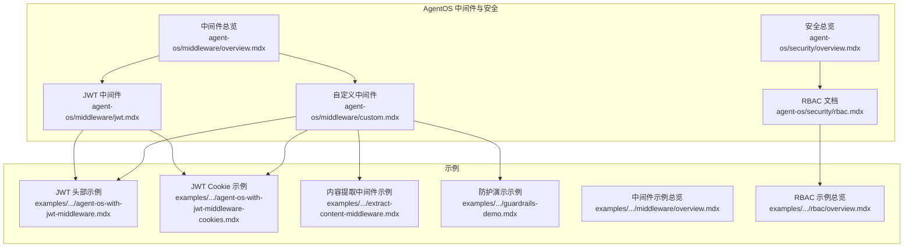
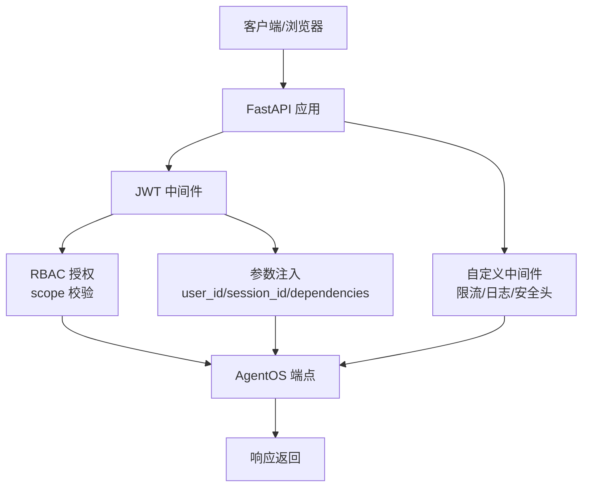
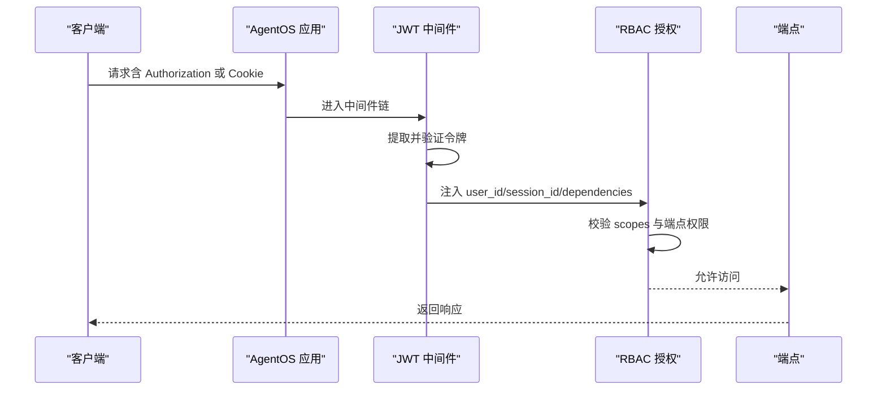
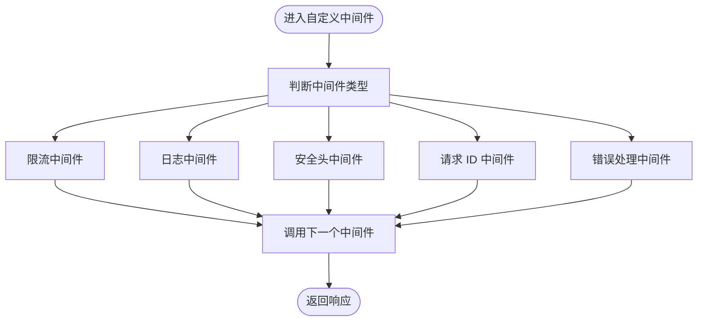
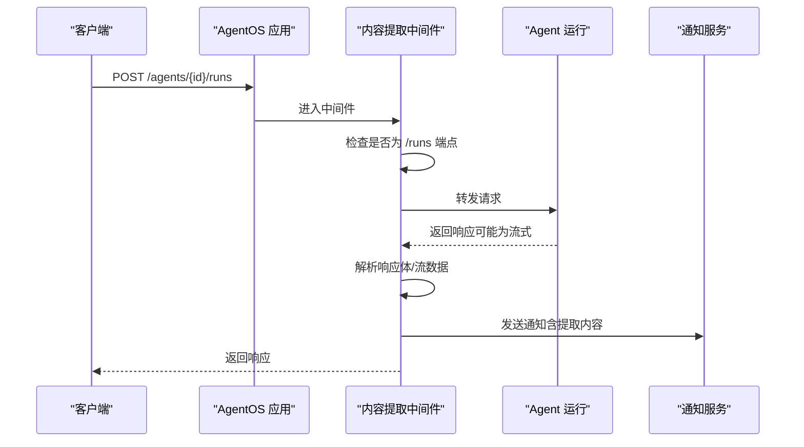
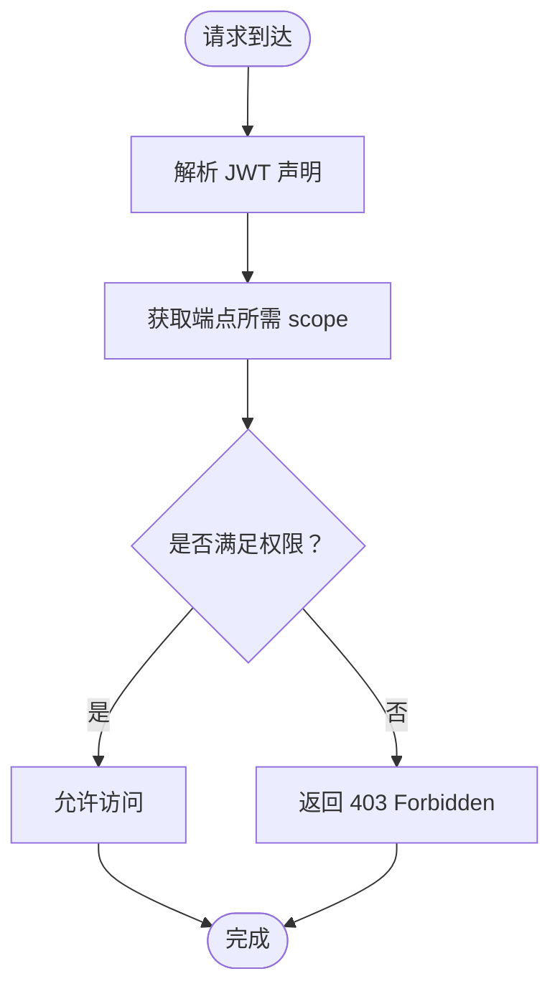
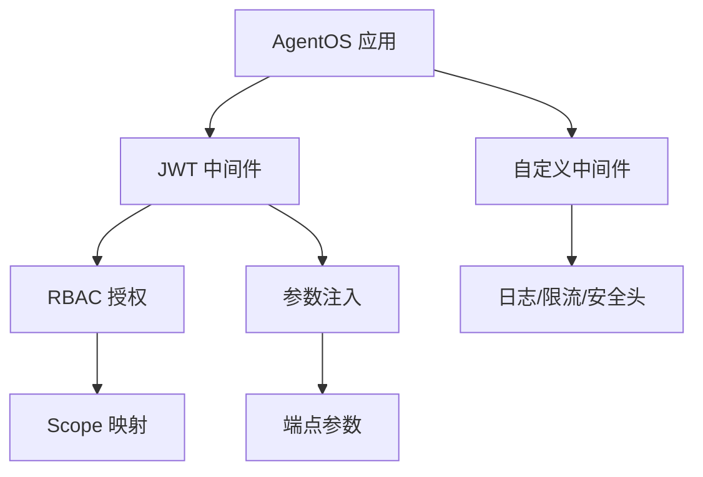

# 中间件与安全示例

<cite>
**本文档引用的文件**
- [agent-os/middleware/overview.mdx](file://agent-os/middleware/overview.mdx)
- [agent-os/middleware/custom.mdx](file://agent-os/middleware/custom.mdx)
- [agent-os/middleware/jwt.mdx](file://agent-os/middleware/jwt.mdx)
- [agent-os/security/overview.mdx](file://agent-os/security/overview.mdx)
- [agent-os/security/rbac.mdx](file://agent-os/security/rbac.mdx)
- [examples/agent-os/middleware/agent-os-with-jwt-middleware.mdx](file://examples/agent-os/middleware/agent-os-with-jwt-middleware.mdx)
- [examples/agent-os/middleware/agent-os-with-jwt-middleware-cookies.mdx](file://examples/agent-os/middleware/agent-os-with-jwt-middleware-cookies.mdx)
- [examples/agent-os/middleware/extract-content-middleware.mdx](file://examples/agent-os/middleware/extract-content-middleware.mdx)
- [examples/agent-os/middleware/guardrails-demo.mdx](file://examples/agent-os/middleware/guardrails-demo.mdx)
- [examples/agent-os/middleware/overview.mdx](file://examples/agent-os/middleware/overview.mdx)
- [examples/agent-os/rbac/overview.mdx](file://examples/agent-os/rbac/overview.mdx)
</cite>

## 目录
1. [简介](#简介)
2. [项目结构](#项目结构)
3. [核心组件](#核心组件)
4. [架构概览](#架构概览)
5. [详细组件分析](#详细组件分析)
6. [依赖关系分析](#依赖关系分析)
7. [性能考虑](#性能考虑)
8. [故障排除指南](#故障排除指南)
9. [结论](#结论)
10. [附录](#附录)

## 简介
本文件为 AgentOS 中间件与安全示例的全面技术文档。重点介绍如何在 AgentOS 中实现中间件与安全控制，包括：
- 自定义中间件开发与集成
- JWT 中间件（支持 Authorization 头与 HTTP-only Cookie）
- 内容提取中间件与防护演示
- RBAC（基于角色的访问控制）系统，涵盖对称与非对称权限模型

文档提供具体实现步骤、配置方法与最佳实践，帮助开发者保护 AgentOS 应用免受未授权访问与恶意请求的影响。

## 项目结构
AgentOS 的中间件与安全相关文档主要分布在以下路径：
- agent-os/middleware：中间件总览、自定义中间件、JWT 中间件
- agent-os/security：安全总览与 RBAC 文档
- examples/agent-os/middleware：中间件使用示例
- examples/agent-os/rbac：RBAC 示例（对称与非对称）

**图表来源**
- [agent-os/middleware/overview.mdx:1-223](file://agent-os/middleware/overview.mdx#L1-L223)
- [agent-os/middleware/custom.mdx:1-249](file://agent-os/middleware/custom.mdx#L1-L249)
- [agent-os/middleware/jwt.mdx:1-341](file://agent-os/middleware/jwt.mdx#L1-L341)
- [agent-os/security/overview.mdx:1-70](file://agent-os/security/overview.mdx#L1-L70)
- [agent-os/security/rbac.mdx:1-410](file://agent-os/security/rbac.mdx#L1-L410)
- [examples/agent-os/middleware/agent-os-with-jwt-middleware.mdx:1-122](file://examples/agent-os/middleware/agent-os-with-jwt-middleware.mdx#L1-L122)
- [examples/agent-os/middleware/agent-os-with-jwt-middleware-cookies.mdx:1-174](file://examples/agent-os/middleware/agent-os-with-jwt-middleware-cookies.mdx#L1-L174)
- [examples/agent-os/middleware/extract-content-middleware.mdx:1-211](file://examples/agent-os/middleware/extract-content-middleware.mdx#L1-L211)
- [examples/agent-os/middleware/guardrails-demo.mdx:1-99](file://examples/agent-os/middleware/guardrails-demo.mdx#L1-L99)
- [examples/agent-os/middleware/overview.mdx:1-14](file://examples/agent-os/middleware/overview.mdx#L1-L14)
- [examples/agent-os/rbac/overview.mdx:1-10](file://examples/agent-os/rbac/overview.mdx#L1-L10)

**章节来源**
- [agent-os/middleware/overview.mdx:1-223](file://agent-os/middleware/overview.mdx#L1-L223)
- [agent-os/security/overview.mdx:1-70](file://agent-os/security/overview.mdx#L1-L70)

## 核心组件
本节概述 AgentOS 中间件与安全的关键能力与组件：

- 中间件执行顺序与最佳实践
  - 中间件按添加顺序的逆序执行，建议优先放置安全与认证中间件
  - 推荐顺序：安全头与 CORS → 认证（JWT）→ 监控（日志/指标）→ 业务逻辑（限流/自定义）

- JWT 中间件功能
  - 令牌验证：支持对称（HS256）与非对称（RS256）算法
  - 参数注入：自动从令牌提取 user_id、session_id、dependencies、session_state 并注入到端点参数
  - RBAC 授权：校验 scopes 与端点所需权限，支持自定义 scope 映射与排除路由

- RBAC 权限模型
  - 对称权限模型：使用共享密钥生成与验证 JWT，适合内部服务或简单部署
  - 非对称权限模型：使用公私钥对，适合多租户或多服务场景，支持 JWKS 文件管理
  - 范围格式：resource:action、resource:id:action、resource:*:action、agent_os:admin

- 自定义中间件
  - 基于 BaseHTTPMiddleware 实现，可扩展限流、日志、安全头、请求 ID、错误处理等
  - 支持同步与异步响应处理，包含对 SSE 流式响应的解析与内容提取

**章节来源**
- [agent-os/middleware/overview.mdx:143-163](file://agent-os/middleware/overview.mdx#L143-L163)
- [agent-os/middleware/jwt.mdx:14-35](file://agent-os/middleware/jwt.mdx#L14-L35)
- [agent-os/security/rbac.mdx:52-62](file://agent-os/security/rbac.mdx#L52-L62)
- [agent-os/middleware/custom.mdx:16-139](file://agent-os/middleware/custom.mdx#L16-L139)

## 架构概览
下图展示 AgentOS 中间件与安全的整体架构，包括 JWT 中间件、RBAC 授权、自定义中间件以及示例应用的交互流程。

**图表来源**
- [agent-os/middleware/overview.mdx:143-163](file://agent-os/middleware/overview.mdx#L143-L163)
- [agent-os/middleware/jwt.mdx:14-35](file://agent-os/middleware/jwt.mdx#L14-L35)
- [agent-os/security/rbac.mdx:176-194](file://agent-os/security/rbac.mdx#L176-L194)

## 详细组件分析

### JWT 中间件（头部与 Cookie）
JWT 中间件支持两种令牌来源：Authorization 头与 HTTP-only Cookie，并提供参数注入与 RBAC 授权能力。

- 令牌来源选择
  - 头部：Authorization: Bearer <token>
  - Cookie：HTTP-only Cookie（推荐用于 Web 应用）
  - 双来源：优先头部，其次 Cookie

- 参数注入
  - user_id：来自 sub 或自定义声明
  - session_id：来自自定义声明
  - dependencies：从多个声明组合，供工具使用
  - session_state：用于会话状态管理

- RBAC 授权
  - 启用 authorization=True 后，校验 scopes 与端点所需权限
  - 支持自定义 scope 映射与排除路由列表

- 配置要点
  - verification_keys：对称算法使用共享密钥；非对称算法使用公钥
  - jwks_file：通过 JWKS 文件加载公钥，按 kid 匹配
  - verify_audience：验证 aud 声明是否匹配 AgentOS ID

**图表来源**
- [agent-os/middleware/jwt.mdx:20-35](file://agent-os/middleware/jwt.mdx#L20-L35)
- [agent-os/middleware/jwt.mdx:176-194](file://agent-os/middleware/jwt.mdx#L176-L194)

**章节来源**
- [agent-os/middleware/jwt.mdx:38-83](file://agent-os/middleware/jwt.mdx#L38-L83)
- [agent-os/middleware/jwt.mdx:229-244](file://agent-os/middleware/jwt.mdx#L229-L244)
- [agent-os/middleware/jwt.mdx:245-288](file://agent-os/middleware/jwt.mdx#L245-L288)

### 自定义中间件
自定义中间件基于 BaseHTTPMiddleware，可实现限流、日志、安全头、请求 ID、错误处理等功能。

- 常见实现模式
  - 速率限制：按 IP 统计请求频率，超过阈值返回 429
  - 请求日志：记录方法、路径、客户端 IP、耗时等信息
  - 安全头：设置 X-Content-Type-Options、X-Frame-Options、Strict-Transport-Security 等
  - 请求 ID：生成唯一 ID 并写入响应头，便于追踪
  - 错误处理：捕获异常并返回统一 JSON 响应

- 添加方式
  - 在 AgentOS 应用启动后调用 app.add_middleware(...) 添加中间件
  - 注意中间件顺序，确保安全与认证中间件靠前

**图表来源**
- [agent-os/middleware/custom.mdx:16-139](file://agent-os/middleware/custom.mdx#L16-L139)

**章节来源**
- [agent-os/middleware/custom.mdx:16-139](file://agent-os/middleware/custom.mdx#L16-L139)
- [agent-os/middleware/custom.mdx:176-222](file://agent-os/middleware/custom.mdx#L176-L222)

### 内容提取中间件与防护演示
内容提取中间件可从响应体中提取内容，支持流式与非流式响应，适用于通知与审计场景。

- 功能特性
  - 仅对 POST /runs 端点进行处理
  - 提取 X-APP-UUID 请求头作为上下文标识
  - 流式响应：解析 SSE 数据行，提取 RunContent 事件的内容
  - 非流式响应：解析 JSON 响应体中的 content 字段

- 防护演示
  - 结合 Guardrails（如 OpenAI Moderation、Prompt Injection、PII 检测）在运行前拦截不当内容
  - UI 层显示 Guardrail 触发错误，提升安全性与合规性

**图表来源**
- [examples/agent-os/middleware/extract-content-middleware.mdx:24-114](file://examples/agent-os/middleware/extract-content-middleware.mdx#L24-L114)
- [examples/agent-os/middleware/guardrails-demo.mdx:17-68](file://examples/agent-os/middleware/guardrails-demo.mdx#L17-L68)

**章节来源**
- [examples/agent-os/middleware/extract-content-middleware.mdx:1-211](file://examples/agent-os/middleware/extract-content-middleware.mdx#L1-L211)
- [examples/agent-os/middleware/guardrails-demo.mdx:1-99](file://examples/agent-os/middleware/guardrails-demo.mdx#L1-L99)

### RBAC（基于角色的访问控制）
RBAC 使用 JWT scopes 控制对 AgentOS 资源的访问，支持对称与非对称权限模型。

- 权限模型
  - 对称模型：使用共享密钥（HS256），适合内部服务
  - 非对称模型：使用公私钥对（RS256），支持 JWKS 文件管理，适合多租户

- 范围格式
  - resource:action（全局资源操作）
  - resource:id:action（特定资源）
  - resource:*:action（通配符）
  - agent_os:admin（管理员）

- 默认映射与自定义映射
  - 系统、Agent、Team、Workflow、Session、Memory、Knowledge、Metrics、Evals 等端点均有默认 scope 映射
  - 可通过 scope_mappings 自定义或覆盖默认映射

- 配置选项
  - verification_keys 或 jwks_file：公钥来源
  - algorithm：RS256 或 HS256
  - authorization：启用 RBAC
  - excluded_route_paths：排除检查的路由
  - verify_audience：验证 aud 声明

**图表来源**
- [agent-os/security/rbac.mdx:149-255](file://agent-os/security/rbac.mdx#L149-L255)
- [agent-os/security/rbac.mdx:257-282](file://agent-os/security/rbac.mdx#L257-L282)

**章节来源**
- [agent-os/security/rbac.mdx:52-62](file://agent-os/security/rbac.mdx#L52-L62)
- [agent-os/security/rbac.mdx:149-255](file://agent-os/security/rbac.mdx#L149-L255)
- [agent-os/security/rbac.mdx:257-282](file://agent-os/security/rbac.mdx#L257-L282)

## 依赖关系分析
中间件与安全组件之间的依赖关系如下：

**图表来源**
- [agent-os/middleware/overview.mdx:143-163](file://agent-os/middleware/overview.mdx#L143-L163)
- [agent-os/middleware/jwt.mdx:14-35](file://agent-os/middleware/jwt.mdx#L14-L35)
- [agent-os/middleware/custom.mdx:16-139](file://agent-os/middleware/custom.mdx#L16-L139)
- [agent-os/security/rbac.mdx:176-194](file://agent-os/security/rbac.mdx#L176-L194)

**章节来源**
- [agent-os/middleware/overview.mdx:143-163](file://agent-os/middleware/overview.mdx#L143-L163)
- [agent-os/middleware/jwt.mdx:14-35](file://agent-os/middleware/jwt.mdx#L14-L35)
- [agent-os/middleware/custom.mdx:16-139](file://agent-os/middleware/custom.mdx#L16-L139)
- [agent-os/security/rbac.mdx:176-194](file://agent-os/security/rbac.mdx#L176-L194)

## 性能考虑
- 中间件执行顺序影响延迟：越靠外层的中间件越早执行，建议将轻量中间件置于内层
- JWT 验证与 RBAC 授权会增加请求处理时间，生产环境建议缓存公钥与 scope 映射
- 流式响应处理需谨慎：内容提取中间件会遍历响应体，避免不必要的解析
- 限流中间件应结合分布式缓存（如 Redis）以支持多实例部署

## 故障排除指南
- 401 未授权
  - 检查令牌是否存在、格式是否正确、签名是否有效
  - 确认 verification_keys 或 jwks_file 配置正确
  - 非对称算法需确保公钥与私钥匹配

- 403 禁止访问
  - 检查 JWT 中 scopes 是否包含端点所需权限
  - 确认 scope 映射是否正确，必要时使用自定义映射
  - 排除路由列表是否误排除了目标端点

- Cookie 相关问题
  - 确保 Cookie 设置为 httponly、secure、samesite
  - 检查域名与路径是否匹配，避免跨域问题

- 日志与调试
  - 启用自定义日志中间件记录请求与响应
  - 使用请求 ID 中间件关联请求链路
  - 对流式响应使用内容提取中间件辅助调试

**章节来源**
- [agent-os/security/rbac.mdx:367-373](file://agent-os/security/rbac.mdx#L367-L373)
- [agent-os/middleware/jwt.mdx:158-175](file://agent-os/middleware/jwt.mdx#L158-L175)
- [agent-os/middleware/custom.mdx:142-174](file://agent-os/middleware/custom.mdx#L142-L174)

## 结论
通过 JWT 中间件与 RBAC 授权，AgentOS 能够在多种部署场景下提供强大的安全控制。结合自定义中间件，可以灵活实现限流、日志、安全头与内容提取等能力。建议在生产环境中采用非对称权限模型与 JWKS 管理，配合严格的 scope 映射与排除路由策略，确保系统的安全性与可维护性。

## 附录
- 示例清单
  - JWT 头部认证示例：[示例路径:1-122](file://examples/agent-os/middleware/agent-os-with-jwt-middleware.mdx#L1-L122)
  - JWT Cookie 认证示例：[示例路径:1-174](file://examples/agent-os/middleware/agent-os-with-jwt-middleware-cookies.mdx#L1-L174)
  - 内容提取中间件示例：[示例路径:1-211](file://examples/agent-os/middleware/extract-content-middleware.mdx#L1-L211)
  - 防护演示示例：[示例路径:1-99](file://examples/agent-os/middleware/guardrails-demo.mdx#L1-L99)
  - 中间件示例总览：[示例路径:1-14](file://examples/agent-os/middleware/overview.mdx#L1-L14)
  - RBAC 示例总览：[示例路径:1-10](file://examples/agent-os/rbac/overview.mdx#L1-L10)