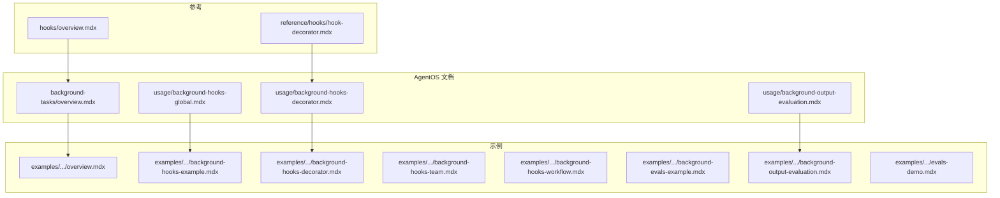
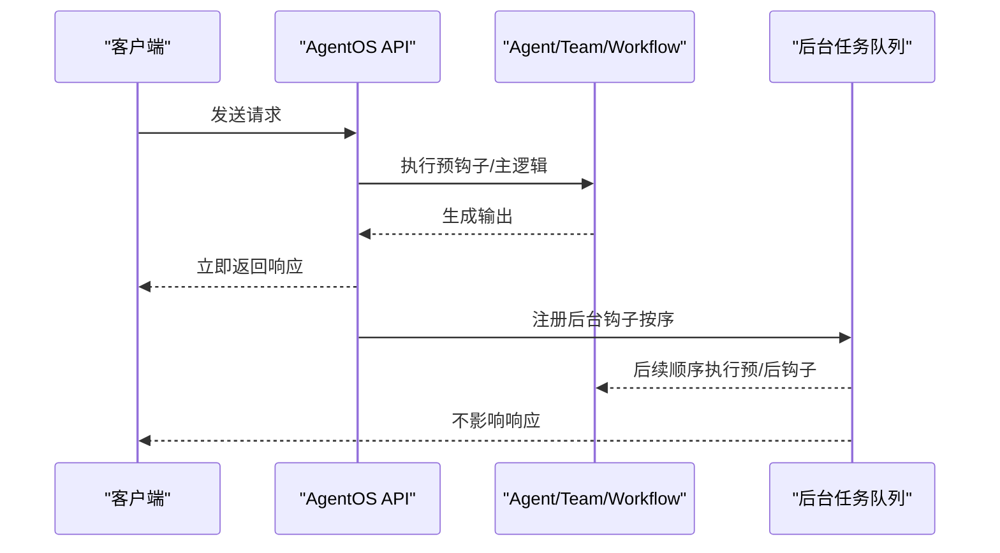
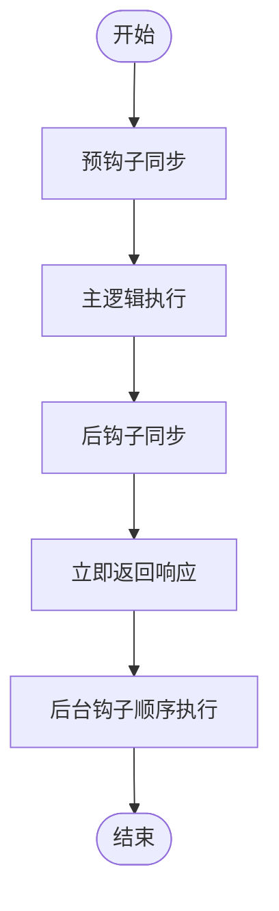
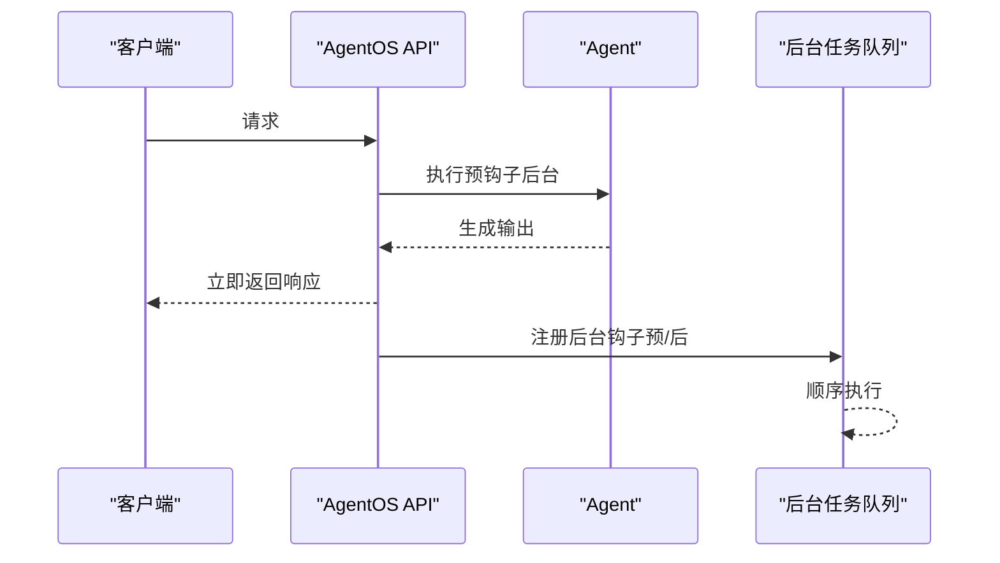
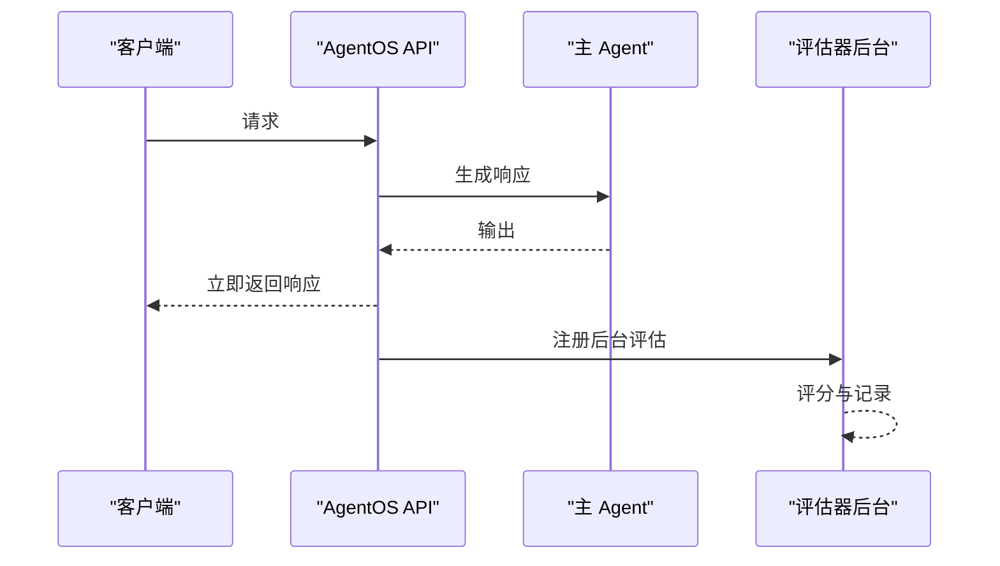
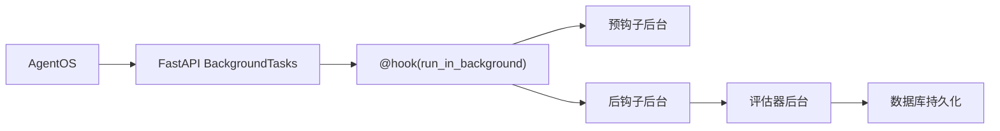

# 后台任务示例

<cite>
**本文引用的文件**
- [agent-os/background-tasks/overview.mdx](file://agent-os/background-tasks/overview.mdx)
- [agent-os/usage/background-hooks-decorator.mdx](file://agent-os/usage/background-hooks-decorator.mdx)
- [agent-os/usage/background-hooks-global.mdx](file://agent-os/usage/background-hooks-global.mdx)
- [agent-os/usage/background-output-evaluation.mdx](file://agent-os/usage/background-output-evaluation.mdx)
- [examples/agent-os/background-tasks/overview.mdx](file://examples/agent-os/background-tasks/overview.mdx)
- [examples/agent-os/background-tasks/background-hooks-example.mdx](file://examples/agent-os/background-tasks/background-hooks-example.mdx)
- [examples/agent-os/background-tasks/background-hooks-decorator.mdx](file://examples/agent-os/background-tasks/background-hooks-decorator.mdx)
- [examples/agent-os/background-tasks/background-hooks-team.mdx](file://examples/agent-os/background-tasks/background-hooks-team.mdx)
- [examples/agent-os/background-tasks/background-hooks-workflow.mdx](file://examples/agent-os/background-tasks/background-hooks-workflow.mdx)
- [examples/agent-os/background-tasks/background-evals-example.mdx](file://examples/agent-os/background-tasks/background-evals-example.mdx)
- [examples/agent-os/background-tasks/background-output-evaluation.mdx](file://examples/agent-os/background-tasks/background-output-evaluation.mdx)
- [examples/agent-os/background-tasks/evals-demo.mdx](file://examples/agent-os/background-tasks/evals-demo.mdx)
- [reference/hooks/hook-decorator.mdx](file://reference/hooks/hook-decorator.mdx)
- [hooks/overview.mdx](file://hooks/overview.mdx)
</cite>

## 目录
1. [简介](#简介)
2. [项目结构](#项目结构)
3. [核心组件](#核心组件)
4. [架构总览](#架构总览)
5. [详细组件分析](#详细组件分析)
6. [依赖关系分析](#依赖关系分析)
7. [性能考量](#性能考量)
8. [故障排查指南](#故障排查指南)
9. [结论](#结论)
10. [附录](#附录)

## 简介
本技术文档围绕 AgentOS 的后台任务示例，系统讲解如何在 AgentOS 中实现与管理后台任务，包括：
- 背景评估示例：使用“代理即评判者”进行响应质量评估，且不阻塞主流程
- 后台钩子装饰器：通过 @hook(run_in_background=True) 对单个钩子进行细粒度控制
- 全局后台钩子：通过 AgentOS 配置对所有钩子启用后台执行
- 团队后台钩子：在团队（Team）场景中使用后台钩子
- 工作流后台钩子：在工作流（Workflow）步骤中使用后台钩子
- 后台输出评估：在响应返回后进行评估与日志记录
- 评估演示：结合数据库与会话应用，展示评估运行与查询接口

重点说明后台任务的生命周期管理、钩子机制、事件处理与异步执行模式，并提供可直接运行的示例路径与配置方法。

## 项目结构
后台任务示例主要分布在以下位置：
- 概览与用法文档：agent-os/background-tasks/overview.mdx、agent-os/usage/*.mdx
- 示例集合：examples/agent-os/background-tasks/*.mdx
- 参考与钩子装饰器：reference/hooks/hook-decorator.mdx、hooks/overview.mdx

**图表来源**
- [agent-os/background-tasks/overview.mdx:1-168](file://agent-os/background-tasks/overview.mdx#L1-L168)
- [examples/agent-os/background-tasks/overview.mdx:1-15](file://examples/agent-os/background-tasks/overview.mdx#L1-L15)

**章节来源**
- [agent-os/background-tasks/overview.mdx:1-168](file://agent-os/background-tasks/overview.mdx#L1-L168)
- [examples/agent-os/background-tasks/overview.mdx:1-15](file://examples/agent-os/background-tasks/overview.mdx#L1-L15)

## 核心组件
- 后台钩子装饰器：通过 @hook(run_in_background=True) 标记钩子在响应发送后再执行，适用于非关键性日志、通知、外部调用等
- 全局后台设置：在 AgentOS 初始化时开启 run_hooks_in_background=True，使该实例下所有钩子均以后台方式执行
- 输出评估器：使用 AgentAsJudgeEval 或自定义评估钩子，在响应返回后进行质量评估并记录结果
- 数据隔离与错误处理：后台任务执行前对 run_input、run_context、run_output 进行深拷贝，避免竞态；后台异常不影响已发送的响应
- 生命周期与事件：预钩子在模型上下文准备前执行，后钩子在输出生成后、响应返回前执行；后台模式下均在响应发送后继续执行

**章节来源**
- [agent-os/background-tasks/overview.mdx:102-135](file://agent-os/background-tasks/overview.mdx#L102-L135)
- [reference/hooks/hook-decorator.mdx:14-66](file://reference/hooks/hook-decorator.mdx#L14-L66)
- [hooks/overview.mdx:25-32](file://hooks/overview.mdx#L25-L32)

## 架构总览
AgentOS 使用 FastAPI 的 BackgroundTasks 在响应发送后顺序执行后台钩子。整体流程如下：

**图表来源**
- [agent-os/background-tasks/overview.mdx:102-110](file://agent-os/background-tasks/overview.mdx#L102-L110)

## 详细组件分析

### 组件一：后台钩子装饰器（按钩子级别）
- 功能要点
  - 使用 @hook(run_in_background=True) 标记单个钩子在响应发送后执行
  - 适合混合场景：关键钩子同步执行，非关键钩子后台执行
  - 响应仅等待同步钩子完成，后台钩子不阻塞
- 实现要点
  - 预钩子在后台模式下不可修改 run_input
  - 后钩子在后台模式下不可修改 run_output
  - 异常需在钩子内部捕获并记录
- 示例路径
  - [examples/agent-os/background-tasks/background-hooks-decorator.mdx:1-110](file://examples/agent-os/background-tasks/background-hooks-decorator.mdx#L1-L110)
  - [agent-os/usage/background-hooks-decorator.mdx:1-144](file://agent-os/usage/background-hooks-decorator.mdx#L1-L144)

**图表来源**
- [agent-os/usage/background-hooks-decorator.mdx:125-132](file://agent-os/usage/background-hooks-decorator.mdx#L125-L132)

**章节来源**
- [agent-os/usage/background-hooks-decorator.mdx:1-144](file://agent-os/usage/background-hooks-decorator.mdx#L1-L144)
- [examples/agent-os/background-tasks/background-hooks-decorator.mdx:1-110](file://examples/agent-os/background-tasks/background-hooks-decorator.mdx#L1-L110)

### 组件二：全局后台钩子（按 AgentOS 级别）
- 功能要点
  - 在 AgentOS 初始化时开启 run_hooks_in_background=True
  - 使该实例下的所有 Agent/Team/Workflow 的钩子均在后台执行
  - 适合非关键性任务较多的场景，最大化响应速度
- 实现要点
  - 预钩子在后台模式下不可修改 run_input
  - 后钩子在后台模式下不可修改 run_output
  - 多个后台钩子顺序执行
- 示例路径
  - [examples/agent-os/background-tasks/background-hooks-example.mdx:1-120](file://examples/agent-os/background-tasks/background-hooks-example.mdx#L1-L120)
  - [agent-os/usage/background-hooks-global.mdx:1-140](file://agent-os/usage/background-hooks-global.mdx#L1-L140)

**图表来源**
- [agent-os/usage/background-hooks-global.mdx:129-135](file://agent-os/usage/background-hooks-global.mdx#L129-L135)

**章节来源**
- [agent-os/usage/background-hooks-global.mdx:1-140](file://agent-os/usage/background-hooks-global.mdx#L1-L140)
- [examples/agent-os/background-tasks/background-hooks-example.mdx:1-120](file://examples/agent-os/background-tasks/background-hooks-example.mdx#L1-L120)

### 组件三：团队后台钩子
- 功能要点
  - 在 Team 的后钩子中记录团队执行结果
  - 响应在发送后由后台钩子继续执行
- 示例路径
  - [examples/agent-os/background-tasks/background-hooks-team.mdx:1-102](file://examples/agent-os/background-tasks/background-hooks-team.mdx#L1-L102)

**章节来源**
- [examples/agent-os/background-tasks/background-hooks-team.mdx:1-102](file://examples/agent-os/background-tasks/background-hooks-team.mdx#L1-L102)

### 组件四：工作流后台钩子
- 功能要点
  - 在 Workflow 的每个步骤中的 Agent 后钩子记录步骤完成情况
  - 响应在发送后由后台钩子继续执行
- 示例路径
  - [examples/agent-os/background-tasks/background-hooks-workflow.mdx:1-98](file://examples/agent-os/background-tasks/background-hooks-workflow.mdx#L1-L98)

**章节来源**
- [examples/agent-os/background-tasks/background-hooks-workflow.mdx:1-98](file://examples/agent-os/background-tasks/background-hooks-workflow.mdx#L1-L98)

### 组件五：后台输出评估（代理即评判者）
- 功能要点
  - 使用 AgentAsJudgeEval 在响应返回后进行质量评估
  - 支持阈值、附加准则与评分策略
  - 结果存储到数据库，便于监控与分析
- 示例路径
  - [examples/agent-os/background-tasks/background-output-evaluation.mdx:1-222](file://examples/agent-os/background-tasks/background-output-evaluation.mdx#L1-L222)
  - [agent-os/usage/background-output-evaluation.mdx:1-160](file://agent-os/usage/background-output-evaluation.mdx#L1-L160)

**图表来源**
- [agent-os/usage/background-output-evaluation.mdx:116-125](file://agent-os/usage/background-output-evaluation.mdx#L116-L125)

**章节来源**
- [agent-os/usage/background-output-evaluation.mdx:1-160](file://agent-os/usage/background-output-evaluation.mdx#L1-L160)
- [examples/agent-os/background-tasks/background-output-evaluation.mdx:1-222](file://examples/agent-os/background-tasks/background-output-evaluation.mdx#L1-L222)

### 组件六：后台评估示例（细粒度控制）
- 功能要点
  - 对不同评估器分别设置 run_in_background=True 或默认行为
  - 同步评估先于响应返回，后台评估随后执行
- 示例路径
  - [examples/agent-os/background-tasks/background-evals-example.mdx:1-106](file://examples/agent-os/background-tasks/background-evals-example.mdx#L1-L106)

**章节来源**
- [examples/agent-os/background-tasks/background-evals-example.mdx:1-106](file://examples/agent-os/background-tasks/background-evals-example.mdx#L1-L106)

### 组件七：评估演示（会话与数据库）
- 功能要点
  - 展示如何通过 AgentOS 暴露评估运行接口
  - 使用 PostgreSQL 存储评估结果
- 示例路径
  - [examples/agent-os/background-tasks/evals-demo.mdx:1-95](file://examples/agent-os/background-tasks/evals-demo.mdx#L1-L95)

**章节来源**
- [examples/agent-os/background-tasks/evals-demo.mdx:1-95](file://examples/agent-os/background-tasks/evals-demo.mdx#L1-L95)

## 依赖关系分析
- AgentOS 提供后台任务能力，依赖 FastAPI 的 BackgroundTasks
- 钩子装饰器 @hook 来自 agno.hooks，支持 run_in_background 参数
- 评估器（如 AgentAsJudgeEval）作为后钩子使用，可在后台执行
- 数据库组件用于持久化评估结果与会话数据

**图表来源**
- [agent-os/background-tasks/overview.mdx:102-110](file://agent-os/background-tasks/overview.mdx#L102-L110)
- [reference/hooks/hook-decorator.mdx:14-33](file://reference/hooks/hook-decorator.mdx#L14-L33)

**章节来源**
- [agent-os/background-tasks/overview.mdx:102-135](file://agent-os/background-tasks/overview.mdx#L102-L135)
- [reference/hooks/hook-decorator.mdx:1-74](file://reference/hooks/hook-decorator.mdx#L1-L74)

## 性能考量
- 响应延迟优化：后台钩子不阻塞响应，显著降低用户感知延迟
- 顺序执行：后台任务按注册顺序串行执行，避免并发竞争
- 资源隔离：对 run_input、run_context、run_output 进行深拷贝，防止竞态
- 错误处理：后台异常不影响已发送响应，需在钩子内记录日志与告警
- 适用场景：日志、分析、通知、外部 API 调用、非关键数据处理

**章节来源**
- [agent-os/background-tasks/overview.mdx:113-135](file://agent-os/background-tasks/overview.mdx#L113-L135)

## 故障排查指南
- 症状：使用 @hook(run_in_background=True) 但未见后台效果
  - 排查：确认是否通过 AgentOS 启动服务，直接运行代理不会触发后台执行
  - 参考：[参考文档:60-62](file://reference/hooks/hook-decorator.mdx#L60-L62)
- 症状：后台钩子修改了输入或输出
  - 排查：后台模式下无法修改 run_input/run_output，应仅用于日志与监控
  - 参考：[参考文档:64-66](file://reference/hooks/hook-decorator.mdx#L64-L66)
- 症状：多个后台钩子执行顺序不符合预期
  - 排查：后台任务按序执行，若需并行请拆分为独立后台任务并在钩子内并发调度
  - 参考：[概览文档:106-110](file://agent-os/background-tasks/overview.mdx#L106-L110)
- 症状：评估结果未入库
  - 排查：检查数据库连接与评估器初始化参数，确保 run_in_background 设置正确
  - 参考：[示例:22-68](file://examples/agent-os/background-tasks/background-output-evaluation.mdx#L22-L68)

**章节来源**
- [reference/hooks/hook-decorator.mdx:58-66](file://reference/hooks/hook-decorator.mdx#L58-L66)
- [agent-os/background-tasks/overview.mdx:106-110](file://agent-os/background-tasks/overview.mdx#L106-L110)
- [examples/agent-os/background-tasks/background-output-evaluation.mdx:22-68](file://examples/agent-os/background-tasks/background-output-evaluation.mdx#L22-L68)

## 结论
AgentOS 的后台任务机制通过 @hook 装饰器与全局配置，实现了对钩子的灵活控制与高效执行。在保证用户体验的前提下，将非关键性任务移至后台，既能提升响应速度，又能满足日志、分析、通知与评估等多样化需求。建议根据业务场景选择合适的控制粒度：关键校验使用同步钩子，日志与分析使用后台钩子，并配合完善的错误处理与观测体系。

## 附录
- 快速开始
  - 安装依赖：参见各示例文档中的安装步骤
  - 导出密钥：按示例导出模型 API 密钥
  - 运行服务：使用 uvicorn 启动示例脚本
- 相关参考
  - 钩子装饰器 API：参见 [参考文档:1-74](file://reference/hooks/hook-decorator.mdx#L1-L74)
  - 钩子概述与生命周期：参见 [参考文档:25-32](file://hooks/overview.mdx#L25-L32)