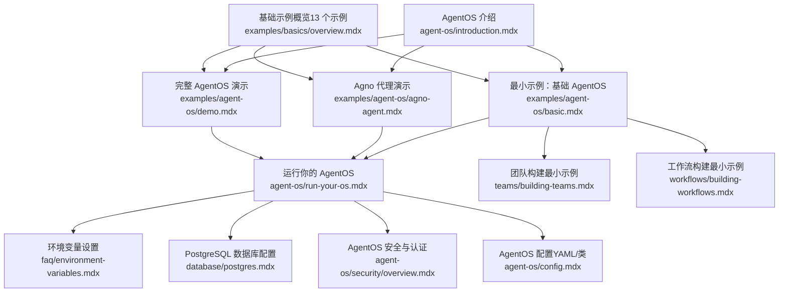
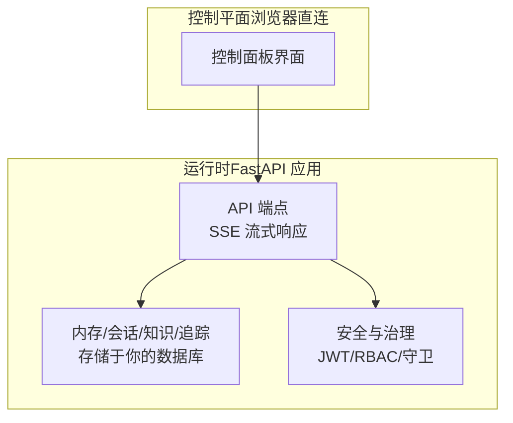
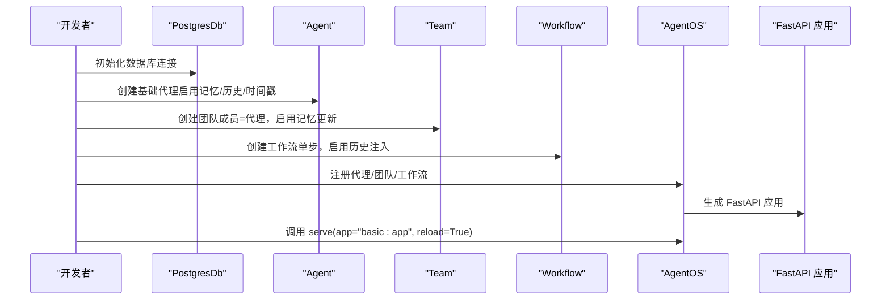
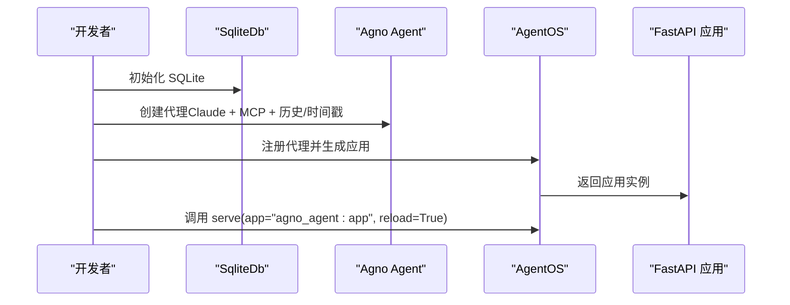
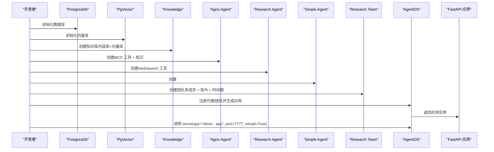
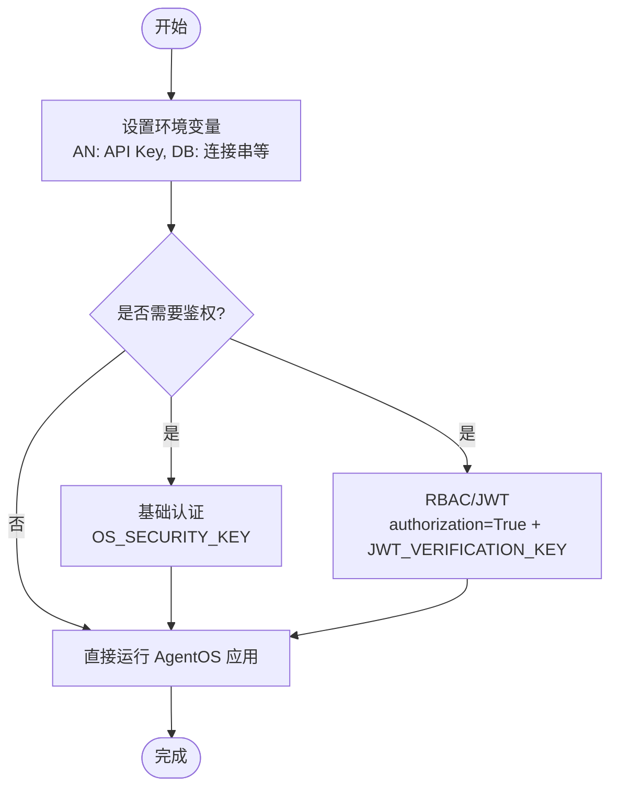
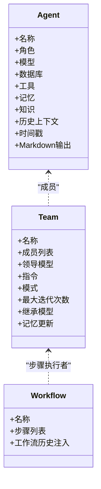
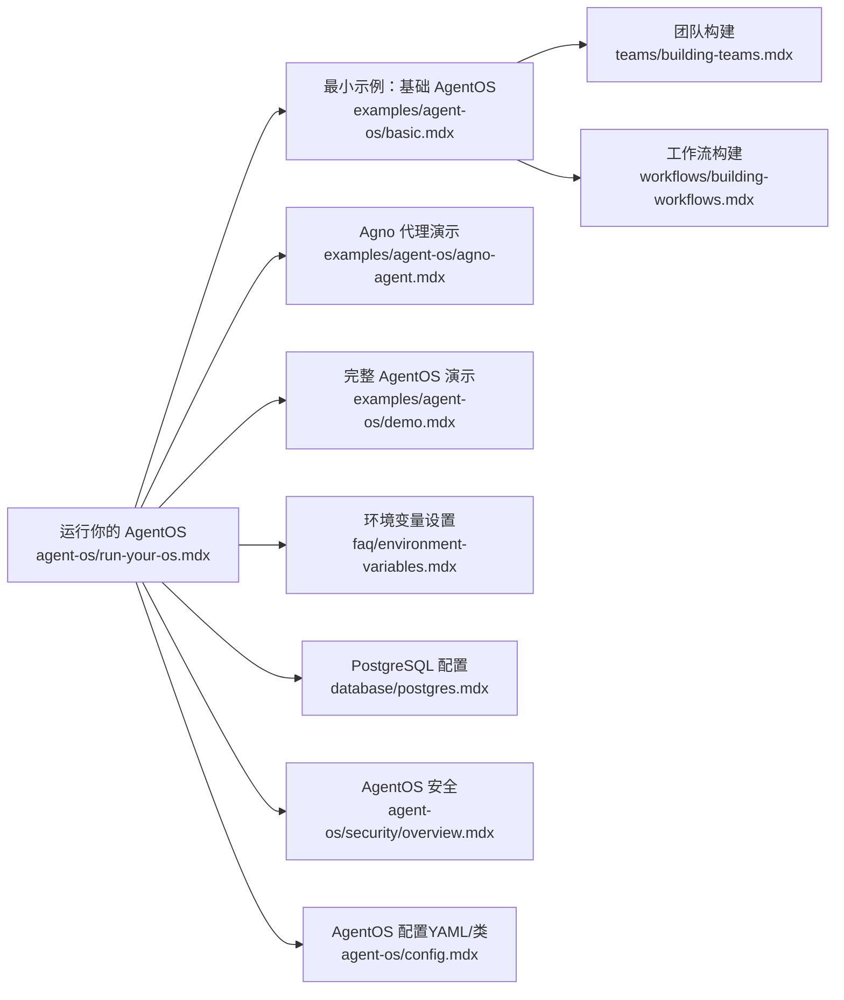

# 基础设置示例

<cite>
**本文引用的文件**
- [examples/agent-os/basic.mdx](file://examples/agent-os/basic.mdx)
- [examples/agent-os/demo.mdx](file://examples/agent-os/demo.mdx)
- [examples/agent-os/agno-agent.mdx](file://examples/agent-os/agno-agent.mdx)
- [agent-os/introduction.mdx](file://agent-os/introduction.mdx)
- [agent-os/run-your-os.mdx](file://agent-os/run-your-os.mdx)
- [agent-os/config.mdx](file://agent-os/config.mdx)
- [agent-os/security/overview.mdx](file://agent-os/security/overview.mdx)
- [faq/environment-variables.mdx](file://faq/environment-variables.mdx)
- [database/postgres.mdx](file://database/postgres.mdx)
- [teams/building-teams.mdx](file://teams/building-teams.mdx)
- [workflows/building-workflows.mdx](file://workflows/building-workflows.mdx)
- [examples/basics/overview.mdx](file://examples/basics/overview.mdx)
</cite>

## 目录
1. [简介](#简介)
2. [项目结构](#项目结构)
3. [核心组件](#核心组件)
4. [架构总览](#架构总览)
5. [详细组件分析](#详细组件分析)
6. [依赖关系分析](#依赖关系分析)
7. [性能考虑](#性能考虑)
8. [故障排查指南](#故障排查指南)
9. [结论](#结论)
10. [附录](#附录)

## 简介
本章节面向首次接触 AgentOS 的开发者，提供从零到一的最小化 AgentOS 环境搭建与运行指南。你将学会：
- 设置最小化的 AgentOS 示例（基础代理、团队与工作流）
- 运行 Agno 代理演示（本地 SQLite + Claude + MCP）
- 运行完整 AgentOS 演示（PostgreSQL + 向量库 + 网络搜索 + 知识库）
- 配置环境变量与安全密钥
- 创建基础代理、团队与工作流
- 通过控制面板查看配置与调试运行

本指南以可直接运行的示例代码为依据，配合分步安装、配置与运行说明，帮助你在最短时间内上手 AgentOS 的核心能力。

## 项目结构
以下图示展示与“基础设置示例”相关的关键文档与示例文件之间的关系。这些文件共同构成从“最小示例”到“完整演示”的学习路径。

**图表来源**
- [agent-os/introduction.mdx](file://agent-os/introduction.mdx)
- [examples/agent-os/basic.mdx](file://examples/agent-os/basic.mdx)
- [examples/agent-os/agno-agent.mdx](file://examples/agent-os/agno-agent.mdx)
- [examples/agent-os/demo.mdx](file://examples/agent-os/demo.mdx)
- [agent-os/run-your-os.mdx](file://agent-os/run-your-os.mdx)
- [faq/environment-variables.mdx](file://faq/environment-variables.mdx)
- [database/postgres.mdx](file://database/postgres.mdx)
- [agent-os/security/overview.mdx](file://agent-os/security/overview.mdx)
- [agent-os/config.mdx](file://agent-os/config.mdx)
- [teams/building-teams.mdx](file://teams/building-teams.mdx)
- [workflows/building-workflows.mdx](file://workflows/building-workflows.mdx)
- [examples/basics/overview.mdx](file://examples/basics/overview.mdx)

**章节来源**
- [agent-os/introduction.mdx](file://agent-os/introduction.mdx)
- [examples/basics/overview.mdx](file://examples/basics/overview.mdx)

## 核心组件
本节聚焦于 AgentOS 的三大核心构件：代理（Agent）、团队（Team）与工作流（Workflow）。它们在最小示例中被组合使用，形成可运行的服务端应用。

- 代理（Agent）
  - 负责执行具体任务，支持工具调用、记忆、状态、知识等特性
  - 在最小示例中启用会话摘要、历史上下文注入、时间戳注入等参数
- 团队（Team）
  - 将多个代理组织为协作单元，由一个领导模型进行协调或路由
  - 在最小示例中，团队成员包含一个基础代理，并开启记忆更新
- 工作流（Workflow）
  - 将多个步骤串联为有序流程，每个步骤可由代理、团队或函数执行
  - 在最小示例中，工作流包含单步，启用步骤级工作流历史

上述组件在最小示例中通过 AgentOS 组合并对外暴露为 FastAPI 应用，可通过控制面板与 API 文档进行访问与调试。

**章节来源**
- [examples/agent-os/basic.mdx](file://examples/agent-os/basic.mdx)
- [teams/building-teams.mdx](file://teams/building-teams.mdx)
- [workflows/building-workflows.mdx](file://workflows/building-workflows.mdx)

## 架构总览
下图展示了 AgentOS 的运行时与控制平面的关系：运行时基于 FastAPI 提供生产就绪的 API；控制平面用于管理、监控与调试系统。

**图表来源**
- [agent-os/introduction.mdx](file://agent-os/introduction.mdx)

**章节来源**
- [agent-os/introduction.mdx](file://agent-os/introduction.mdx)

## 详细组件分析

### 最小化 AgentOS 示例（基础代理、团队与工作流）
该示例展示了如何在 20 行左右代码内完成：
- 数据库连接（PostgreSQL）
- 基础代理、团队与工作流的创建
- AgentOS 实例化与应用启动

关键步骤与要点：
- 数据库初始化：使用 PostgresDb 并传入连接字符串
- 代理配置：启用会话摘要、历史上下文注入、时间戳注入、Markdown 输出等
- 团队配置：指定领导模型、成员列表、启用记忆更新
- 工作流配置：定义步骤列表，启用工作流历史注入到步骤
- AgentOS 实例：注册代理、团队、工作流，生成 FastAPI 应用
- 服务启动：通过 agent_os.serve 暴露服务，默认端口与自动重载

**图表来源**
- [examples/agent-os/basic.mdx](file://examples/agent-os/basic.mdx)

**章节来源**
- [examples/agent-os/basic.mdx](file://examples/agent-os/basic.mdx)

### Agno 代理演示（SQLite + Claude + MCP）
该示例强调“最小可用”的代理形态：使用本地 SQLite 存储、Anthropic Claude 模型、MCP 工具链，并通过 AgentOS 暴露为 FastAPI 应用。

要点：
- 使用 SqliteDb 作为轻量存储
- 使用 Claude 模型与 MCP 工具
- 通过 AgentOS 生成应用并启动服务

**图表来源**
- [examples/agent-os/agno-agent.mdx](file://examples/agent-os/agno-agent.mdx)

**章节来源**
- [examples/agent-os/agno-agent.mdx](file://examples/agent-os/agno-agent.mdx)

### 完整 AgentOS 演示（PostgreSQL + 向量库 + 网络搜索 + 知识库）
该示例展示了更贴近生产的配置：PostgreSQL 内存存储、PgVector 向量库、知识库、网络搜索工具与 MCP 工具链。

要点：
- 数据库与向量库：PostgresDb 与 PgVector
- 知识库：Knowledge（内容库 + 向量库）
- 代理：Agno Agent（MCP 工具）、Research Agent（WebSearch 工具）、Simple Agent
- 团队：Research Team（多成员、领导模型、指令、时间戳注入）
- AgentOS：注册代理与团队，生成应用并启动

**图表来源**
- [examples/agent-os/demo.mdx](file://examples/agent-os/demo.mdx)

**章节来源**
- [examples/agent-os/demo.mdx](file://examples/agent-os/demo.mdx)

### 环境变量与安全密钥配置
- 环境变量设置
  - macOS/Windows 不同平台的临时与永久环境变量设置方法
  - 推荐在虚拟环境中导出模型与数据库相关密钥
- 安全机制
  - 基础认证：通过 OS_SECURITY_KEY 启用，请求需携带 Bearer Token
  - RBAC：通过 authorization=True 启用 JWT 权限校验，需设置 JWT_VERIFICATION_KEY

**图表来源**
- [faq/environment-variables.mdx](file://faq/environment-variables.mdx)
- [agent-os/security/overview.mdx](file://agent-os/security/overview.mdx)

**章节来源**
- [faq/environment-variables.mdx](file://faq/environment-variables.mdx)
- [agent-os/security/overview.mdx](file://agent-os/security/overview.mdx)

### 基础代理、团队与工作流的配置
- 基础代理
  - 建议启用：会话摘要、历史上下文注入、时间戳注入、Markdown 输出
  - 可选：记忆更新、知识接入、工具链
- 团队
  - 成员应具备明确 name 与 role，便于领导模型进行委派
  - 支持模式：协调、路由、广播、任务循环
  - 可继承团队模型，或为个别成员指定独立模型
- 工作流
  - 步骤由代理、团队或自定义函数执行
  - 支持条件、循环、并行与路由等组合模式

**图表来源**
- [teams/building-teams.mdx](file://teams/building-teams.mdx)
- [workflows/building-workflows.mdx](file://workflows/building-workflows.mdx)

**章节来源**
- [teams/building-teams.mdx](file://teams/building-teams.mdx)
- [workflows/building-workflows.mdx](file://workflows/building-workflows.mdx)

## 依赖关系分析
下图展示从“运行你的 AgentOS”到“最小示例”的依赖与前置步骤关系：

**图表来源**
- [agent-os/run-your-os.mdx](file://agent-os/run-your-os.mdx)
- [examples/agent-os/basic.mdx](file://examples/agent-os/basic.mdx)
- [examples/agent-os/agno-agent.mdx](file://examples/agent-os/agno-agent.mdx)
- [examples/agent-os/demo.mdx](file://examples/agent-os/demo.mdx)
- [teams/building-teams.mdx](file://teams/building-teams.mdx)
- [workflows/building-workflows.mdx](file://workflows/building-workflows.mdx)
- [faq/environment-variables.mdx](file://faq/environment-variables.mdx)
- [database/postgres.mdx](file://database/postgres.mdx)
- [agent-os/security/overview.mdx](file://agent-os/security/overview.mdx)
- [agent-os/config.mdx](file://agent-os/config.mdx)

**章节来源**
- [agent-os/run-your-os.mdx](file://agent-os/run-your-os.mdx)
- [examples/agent-os/basic.mdx](file://examples/agent-os/basic.mdx)
- [examples/agent-os/agno-agent.mdx](file://examples/agent-os/agno-agent.mdx)
- [examples/agent-os/demo.mdx](file://examples/agent-os/demo.mdx)
- [teams/building-teams.mdx](file://teams/building-teams.mdx)
- [workflows/building-workflows.mdx](file://workflows/building-workflows.mdx)
- [faq/environment-variables.mdx](file://faq/environment-variables.mdx)
- [database/postgres.mdx](file://database/postgres.mdx)
- [agent-os/security/overview.mdx](file://agent-os/security/overview.mdx)
- [agent-os/config.mdx](file://agent-os/config.mdx)

## 性能考虑
- 数据库选择与部署
  - PostgreSQL 适合生产场景，建议使用 PgVector 扩展以支持向量检索
  - SQLite 适合本地开发与演示，避免并发压力
- 模型与工具
  - 合理选择模型尺寸与数量，避免不必要的大模型调用
  - 工具链（如 MCP/WebSearch）应按需启用，减少额外网络开销
- 会话与历史
  - 历史上下文注入与会话摘要有助于提升效果，但需注意上下文长度限制
- 并发与流式
  - 使用 SSE 流式响应提升用户体验，同时注意后端资源占用

## 故障排查指南
常见问题与解决思路：
- 环境变量未生效
  - 检查平台命令（macOS Shell/Windows PowerShell/Command Prompt）中的临时/永久变量设置
  - 确认虚拟环境已激活后再导出变量
- 数据库连接失败
  - 确认连接字符串正确，PostgreSQL 已启动并监听对应端口
  - 如使用 PgVector，请确认容器已运行且端口映射正确
- 认证失败
  - 基础认证：检查 OS_SECURITY_KEY 是否设置，请求头是否包含正确的 Bearer Token
  - RBAC：检查 JWT_VERIFICATION_KEY 是否正确，Token 是否具有足够权限
- 控制面板无法访问
  - 确认 AgentOS 已成功启动，端口未被占用
  - 通过 /config 端点检查配置是否正确加载

**章节来源**
- [faq/environment-variables.mdx](file://faq/environment-variables.mdx)
- [database/postgres.mdx](file://database/postgres.mdx)
- [agent-os/security/overview.mdx](file://agent-os/security/overview.mdx)

## 结论
通过本指南，你已经完成了：
- 从“运行你的 AgentOS”到“最小示例”的完整路径
- 三种典型示例的运行与理解：最小示例、Agno 代理演示、完整演示
- 环境变量与安全密钥的配置方法
- 基础代理、团队与工作流的配置要点
- 常见问题的排查思路

建议在掌握基础后，继续探索团队与工作流的高级模式、知识库与向量检索、以及控制面板的监控与调试能力。

## 附录
- 快速参考
  - 最小示例：基础代理、团队与工作流
  - Agno 代理演示：SQLite + Claude + MCP
  - 完整演示：PostgreSQL + 向量库 + 网络搜索 + 知识库
- 进一步阅读
  - AgentOS 介绍与架构
  - 团队构建与工作流构建
  - AgentOS 配置（YAML/类）与 /config 端点
  - 安全与认证（基础认证/RBAC）