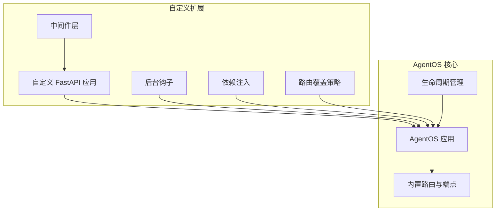
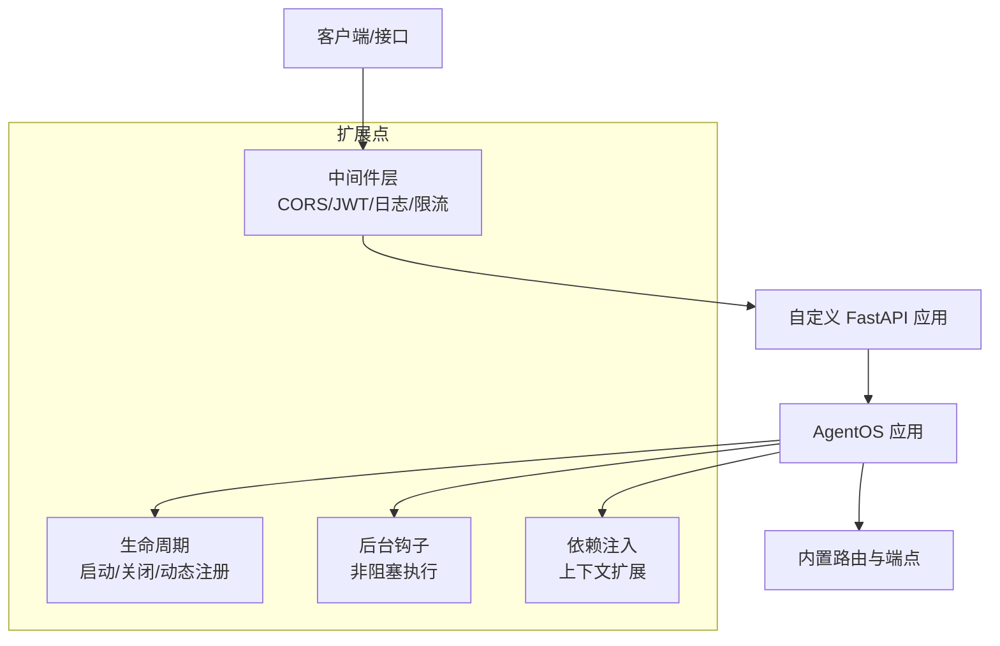
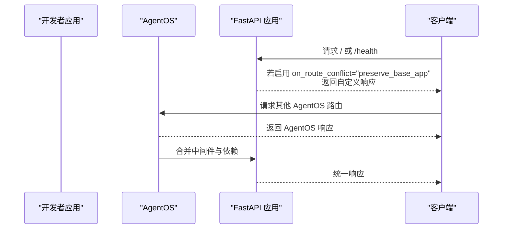
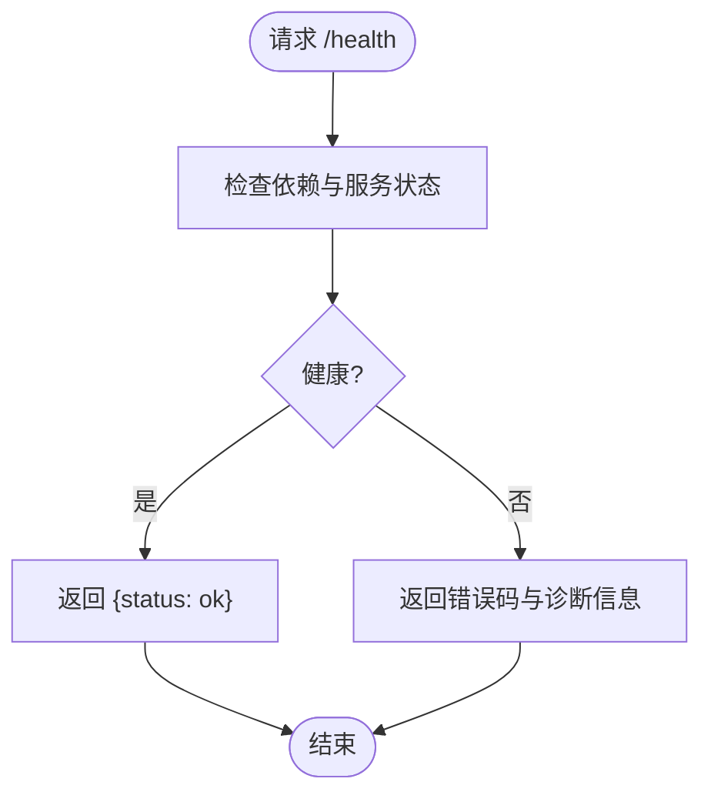
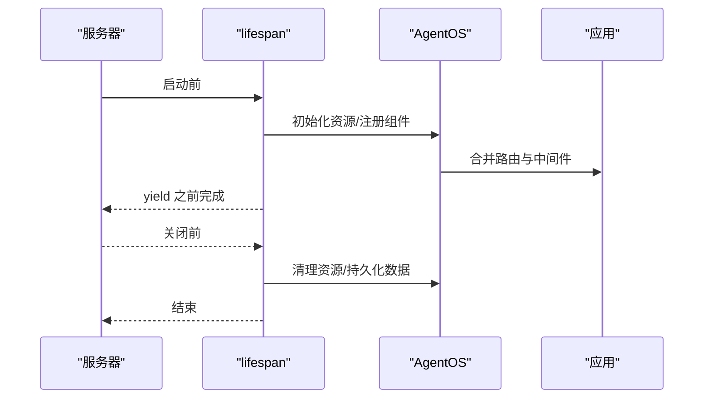
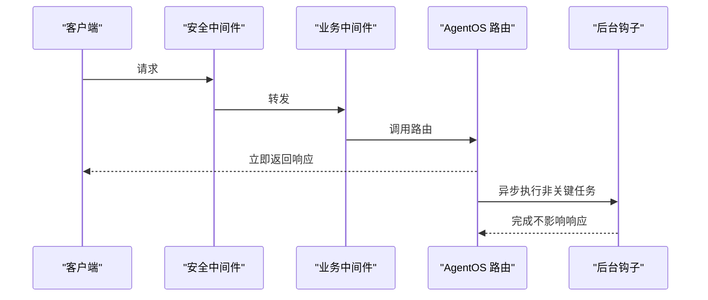
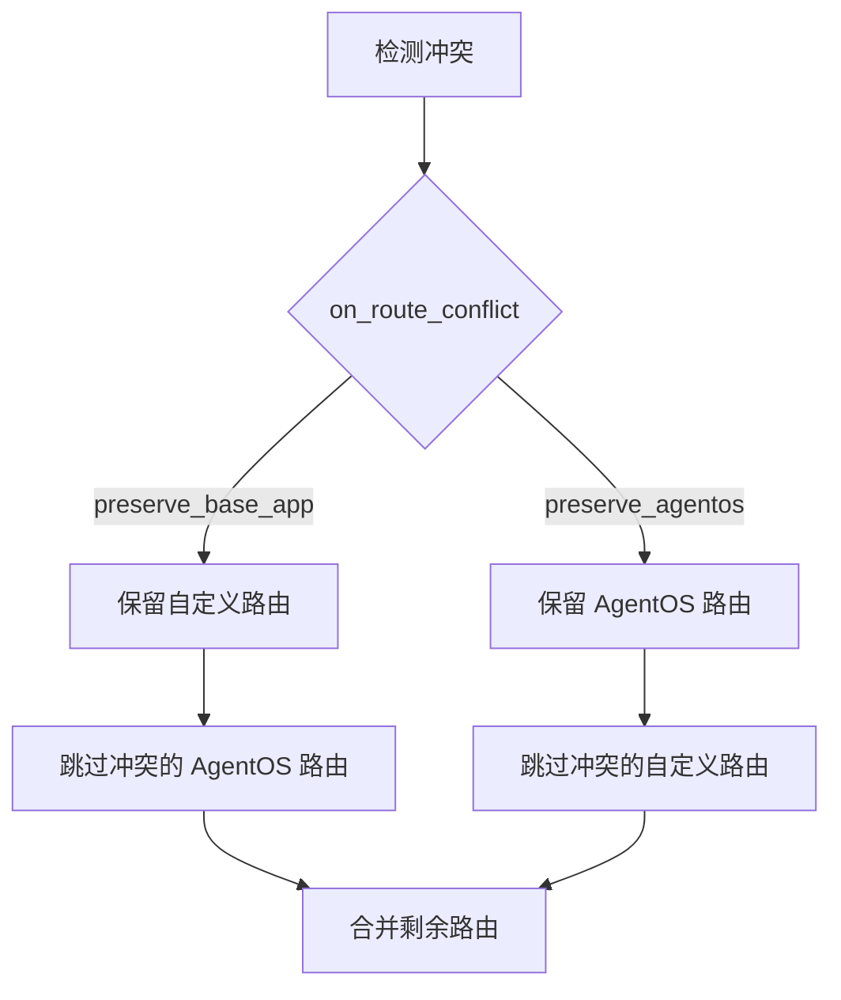
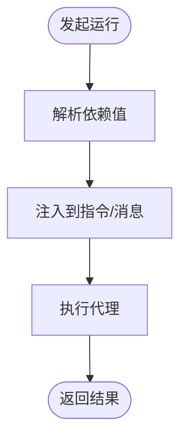
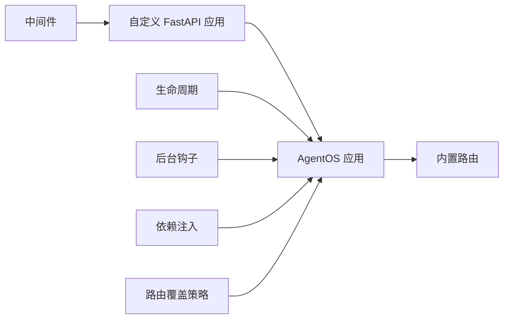

# 定制化示例

<cite>
**本文引用的文件**
- [lifespan.mdx](file://agent-os/lifespan.mdx)
- [custom-lifespan.mdx](file://examples/agent-os/customize/custom-lifespan.mdx)
- [update-from-lifespan.mdx](file://examples/agent-os/customize/update-from-lifespan.mdx)
- [override-routes.mdx](file://examples/agent-os/customize/override-routes.mdx)
- [custom-fastapi 概览.mdx](file://agent-os/custom-fastapi/overview.mdx)
- [中间件概览.mdx](file://agent-os/middleware/overview.mdx)
- [中间件自定义.mdx](file://agent-os/middleware/custom.mdx)
- [背景钩子全局.mdx](file://agent-os/background-tasks/overview.mdx)
- [背景钩子装饰器.mdx](file://agent-os/usage/background-hooks-decorator.mdx)
- [依赖注入概述.mdx](file://dependencies/overview.mdx)
- [依赖注入与代理.mdx](file://dependencies/agent/overview.mdx)
- [传递依赖到代理.mdx](file://examples/agent-os/customize/pass-dependencies-to-agent.mdx)
- [AWS 验证.mdx](file://deploy/templates/aws/go-live/verify.mdx)
- [参考：/health 端点.mdx](file://reference-api/schema/health/health-check.mdx)
</cite>

## 目录
1. [简介](#简介)
2. [项目结构](#项目结构)
3. [核心组件](#核心组件)
4. [架构总览](#架构总览)
5. [详细组件分析](#详细组件分析)
6. [依赖关系分析](#依赖关系分析)
7. [性能考量](#性能考量)
8. [故障排查指南](#故障排查指南)
9. [结论](#结论)
10. [附录](#附录)

## 简介
本技术文档面向需要在保持 AgentOS 核心能力的前提下进行企业级定制的读者。我们将系统讲解如何：
- 自定义 FastAPI 应用并与 AgentOS 融合
- 定义健康检查端点与自定义路由
- 使用生命周期（lifespan）实现启动/关闭逻辑与动态注册
- 通过中间件与依赖注入扩展安全与上下文能力
- 利用后台钩子提升响应性能
- 在不破坏核心功能的前提下添加企业特定需求

## 项目结构
围绕“定制化示例”的相关文档与示例主要分布在以下区域：
- agent-os/custom-fastapi：自定义 FastAPI 应用与路由集成
- agent-os/lifespan：生命周期定制与资源管理
- agent-os/middleware：中间件与安全策略
- agent-os/background-tasks：后台钩子与非阻塞执行
- dependencies：依赖注入与上下文扩展
- examples/agent-os/customize：具体示例（生命周期、路由覆盖、依赖传递）
- deploy/templates/aws/go-live/verify.mdx：生产环境健康检查验证
- reference-api/schema/health：标准健康检查端点参考

图示来源
- [custom-fastapi 概览.mdx:1-239](file://agent-os/custom-fastapi/overview.mdx#L1-L239)
- [lifespan.mdx:1-142](file://agent-os/lifespan.mdx#L1-L142)
- [中间件概览.mdx:143-166](file://agent-os/middleware/overview.mdx#L143-L166)
- [背景钩子全局.mdx:1-106](file://agent-os/background-tasks/overview.mdx#L1-L106)
- [依赖注入概述.mdx:1-67](file://dependencies/overview.mdx#L1-L67)

章节来源
- [custom-fastapi 概览.mdx:1-239](file://agent-os/custom-fastapi/overview.mdx#L1-L239)
- [lifespan.mdx:1-142](file://agent-os/lifespan.mdx#L1-L142)

## 核心组件
- 自定义 FastAPI 应用：通过 base_app 参数将自有应用与 AgentOS 合并，支持自定义路由、中间件与依赖。
- 生命周期（lifespan）：在启动前/关闭后执行初始化与清理逻辑，并可动态更新 AgentOS 注册项。
- 路由覆盖策略：on_route_conflict 提供保留自定义或保留 AgentOS 路由的策略，解决冲突。
- 中间件：统一的安全、日志与请求追踪，遵循“外层到内层”的执行顺序。
- 后台钩子：将非关键任务异步执行，减少响应延迟。
- 依赖注入：在运行时解析静态值或函数，注入到代理/团队上下文。

章节来源
- [custom-fastapi 概览.mdx:14-97](file://agent-os/custom-fastapi/overview.mdx#L14-L97)
- [lifespan.mdx:13-45](file://agent-os/lifespan.mdx#L13-L45)
- [override-routes.mdx:1-113](file://examples/agent-os/customize/override-routes.mdx#L1-L113)
- [中间件概览.mdx:143-166](file://agent-os/middleware/overview.mdx#L143-L166)
- [背景钩子全局.mdx:49-106](file://agent-os/background-tasks/overview.mdx#L49-L106)
- [依赖注入概述.mdx:1-67](file://dependencies/overview.mdx#L1-L67)

## 架构总览
下图展示了自定义 FastAPI 应用与 AgentOS 的融合方式，以及关键扩展点（中间件、生命周期、后台钩子、依赖注入）如何协同工作。

图示来源
- [custom-fastapi 概览.mdx:14-97](file://agent-os/custom-fastapi/overview.mdx#L14-L97)
- [中间件概览.mdx:143-166](file://agent-os/middleware/overview.mdx#L143-L166)
- [lifespan.mdx:13-45](file://agent-os/lifespan.mdx#L13-L45)
- [背景钩子全局.mdx:49-106](file://agent-os/background-tasks/overview.mdx#L49-L106)
- [依赖注入概述.mdx:1-67](file://dependencies/overview.mdx#L1-L67)

## 详细组件分析

### 自定义 FastAPI 应用与路由
- 将自有 FastAPI 应用作为 base_app 传入 AgentOS，即可合并路由与中间件。
- 支持自定义根路径与健康检查端点；若与 AgentOS 冲突，可通过 on_route_conflict 控制优先级。
- 可通过 get_routes() 查看 AgentOS 添加的路由，便于调试与审计。

图示来源
- [custom-fastapi 概览.mdx:14-97](file://agent-os/custom-fastapi/overview.mdx#L14-L97)
- [override-routes.mdx:72-98](file://examples/agent-os/customize/override-routes.mdx#L72-L98)

章节来源
- [custom-fastapi 概览.mdx:14-97](file://agent-os/custom-fastapi/overview.mdx#L14-L97)
- [override-routes.mdx:1-113](file://examples/agent-os/customize/override-routes.mdx#L1-L113)

### 健康检查端点与生产验证
- 标准健康检查端点通常为 /health，返回服务可用性状态。
- 生产部署中，需结合负载均衡与监控确认健康状态与日志输出。

图示来源
- [参考：/health 端点.mdx:1-3](file://reference-api/schema/health/health-check.mdx#L1-L3)
- [AWS 验证.mdx:54-79](file://deploy/templates/aws/go-live/verify.mdx#L54-L79)

章节来源
- [参考：/health 端点.mdx:1-3](file://reference-api/schema/health/health-check.mdx#L1-L3)
- [AWS 验证.mdx:54-79](file://deploy/templates/aws/go-live/verify.mdx#L54-L79)

### 生命周期管理（启动/关闭与动态注册）
- 使用 lifespan 函数在启动前完成资源初始化，在关闭前执行清理。
- 可在 lifespan 中动态向 AgentOS 注册新组件并调用 resync 使变更生效。
- 注意：使用 lifespan 时避免在开发模式下启用自动重载，以防止状态异常。

图示来源
- [lifespan.mdx:13-45](file://agent-os/lifespan.mdx#L13-L45)
- [custom-lifespan.mdx:35-63](file://examples/agent-os/customize/custom-lifespan.mdx#L35-L63)
- [update-from-lifespan.mdx:42-59](file://examples/agent-os/customize/update-from-lifespan.mdx#L42-L59)

章节来源
- [lifespan.mdx:13-45](file://agent-os/lifespan.mdx#L13-L45)
- [custom-lifespan.mdx:1-78](file://examples/agent-os/customize/custom-lifespan.mdx#L1-L78)
- [update-from-lifespan.mdx:1-85](file://examples/agent-os/customize/update-from-lifespan.mdx#L1-L85)

### 自定义事件处理（中间件与后台钩子）
- 中间件按“外层到内层”顺序执行，建议先安全再业务。
- 后台钩子将非关键任务异步执行，显著降低响应延迟。
- 可选择全局启用或针对特定钩子使用装饰器控制。

图示来源
- [中间件概览.mdx:143-166](file://agent-os/middleware/overview.mdx#L143-L166)
- [中间件自定义.mdx:31-169](file://agent-os/middleware/custom.mdx#L31-L169)
- [背景钩子全局.mdx:49-106](file://agent-os/background-tasks/overview.mdx#L49-L106)
- [背景钩子装饰器.mdx:123-142](file://agent-os/usage/background-hooks-decorator.mdx#L123-L142)

章节来源
- [中间件概览.mdx:143-166](file://agent-os/middleware/overview.mdx#L143-L166)
- [中间件自定义.mdx:31-169](file://agent-os/middleware/custom.mdx#L31-L169)
- [背景钩子全局.mdx:1-106](file://agent-os/background-tasks/overview.mdx#L1-L106)
- [背景钩子装饰器.mdx:123-142](file://agent-os/usage/background-hooks-decorator.mdx#L123-L142)

### 路由覆盖策略
- 当自定义应用与 AgentOS 路由冲突时，通过 on_route_conflict 决定保留顺序。
- 推荐在企业环境中自定义根路径与健康检查，以避免与默认界面冲突。

图示来源
- [override-routes.mdx:22-98](file://examples/agent-os/customize/override-routes.mdx#L22-L98)

章节来源
- [override-routes.mdx:1-113](file://examples/agent-os/customize/override-routes.mdx#L1-L113)

### 向代理传递依赖项
- 通过 dependencies 将静态值或动态函数注入到代理上下文。
- 可在运行时动态传入，实现个性化提示词与上下文增强。

图示来源
- [依赖注入概述.mdx:18-42](file://dependencies/overview.mdx#L18-L42)
- [传递依赖到代理.mdx:29-50](file://examples/agent-os/customize/pass-dependencies-to-agent.mdx#L29-L50)

章节来源
- [依赖注入概述.mdx:1-67](file://dependencies/overview.mdx#L1-L67)
- [依赖注入与代理.mdx:1-39](file://dependencies/agent/overview.mdx#L1-L39)
- [传递依赖到代理.mdx:1-65](file://examples/agent-os/customize/pass-dependencies-to-agent.mdx#L1-L65)

## 依赖关系分析
- 自定义 FastAPI 应用与 AgentOS 通过 base_app 合并，共享中间件与依赖。
- 生命周期与后台钩子均作用于 AgentOS 应用，不影响自定义路由。
- 路由覆盖策略仅影响冲突路由，非冲突路由不受影响。
- 依赖注入在运行时解析，不影响路由与中间件的执行顺序。

图示来源
- [custom-fastapi 概览.mdx:14-97](file://agent-os/custom-fastapi/overview.mdx#L14-L97)
- [lifespan.mdx:13-45](file://agent-os/lifespan.mdx#L13-L45)
- [背景钩子全局.mdx:49-106](file://agent-os/background-tasks/overview.mdx#L49-L106)
- [依赖注入概述.mdx:1-67](file://dependencies/overview.mdx#L1-L67)
- [override-routes.mdx:22-98](file://examples/agent-os/customize/override-routes.mdx#L22-L98)

章节来源
- [custom-fastapi 概览.mdx:14-97](file://agent-os/custom-fastapi/overview.mdx#L14-L97)
- [lifespan.mdx:13-45](file://agent-os/lifespan.mdx#L13-L45)
- [背景钩子全局.mdx:49-106](file://agent-os/background-tasks/overview.mdx#L49-L106)
- [依赖注入概述.mdx:1-67](file://dependencies/overview.mdx#L1-L67)
- [override-routes.mdx:1-113](file://examples/agent-os/customize/override-routes.mdx#L1-L113)

## 性能考量
- 使用后台钩子将非关键任务异步化，减少响应时间。
- 合理设置中间件顺序，避免重复处理与额外开销。
- 在生产环境使用合适的 ASGI 服务器与并发参数，确保稳定性与吞吐量。

## 故障排查指南
- 健康检查失败：检查 /health 实现与依赖状态，查看生产日志与负载均衡目标组健康状态。
- 路由冲突：根据 on_route_conflict 设置调整自定义路由或 AgentOS 路由。
- 生命周期问题：避免在 lifespan 中使用自动重载；确保资源正确初始化与释放。
- 中间件异常：检查中间件执行顺序与异常处理逻辑，确保错误响应格式一致。

章节来源
- [AWS 验证.mdx:54-79](file://deploy/templates/aws/go-live/verify.mdx#L54-L79)
- [override-routes.mdx:22-98](file://examples/agent-os/customize/override-routes.mdx#L22-L98)
- [lifespan.mdx:62-63](file://agent-os/lifespan.mdx#L62-L63)
- [中间件自定义.mdx:146-169](file://agent-os/middleware/custom.mdx#L146-L169)

## 结论
通过上述定制化手段，可在不破坏 AgentOS 核心功能的前提下，灵活扩展企业所需的路由、安全、性能与上下文能力。建议优先采用生命周期与后台钩子优化性能，配合中间件与依赖注入完善安全与个性化需求，并通过路由覆盖策略保证企业品牌与合规要求。

## 附录
- 快速参考
  - 自定义 FastAPI 应用：[custom-fastapi 概览.mdx:14-97](file://agent-os/custom-fastapi/overview.mdx#L14-L97)
  - 生命周期：[lifespan.mdx:13-45](file://agent-os/lifespan.mdx#L13-L45)
  - 路由覆盖：[override-routes.mdx:22-98](file://examples/agent-os/customize/override-routes.mdx#L22-L98)
  - 中间件：[中间件概览.mdx:143-166](file://agent-os/middleware/overview.mdx#L143-L166)、[中间件自定义.mdx:31-169](file://agent-os/middleware/custom.mdx#L31-L169)
  - 后台钩子：[背景钩子全局.mdx:49-106](file://agent-os/background-tasks/overview.mdx#L49-L106)、[背景钩子装饰器.mdx:123-142](file://agent-os/usage/background-hooks-decorator.mdx#L123-L142)
  - 依赖注入：[依赖注入概述.mdx:1-67](file://dependencies/overview.mdx#L1-L67)、[传递依赖到代理.mdx:29-50](file://examples/agent-os/customize/pass-dependencies-to-agent.mdx#L29-L50)
  - 健康检查：[参考：/health 端点.mdx:1-3](file://reference-api/schema/health/health-check.mdx#L1-L3)、[AWS 验证.mdx:54-79](file://deploy/templates/aws/go-live/verify.mdx#L54-L79)