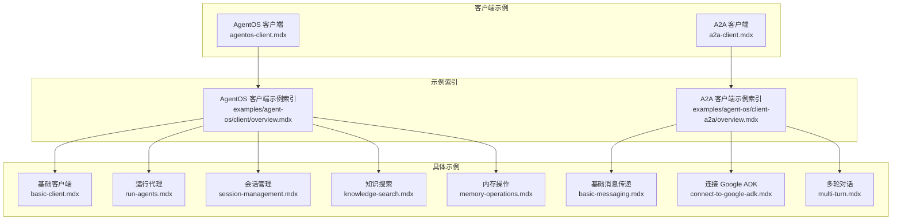
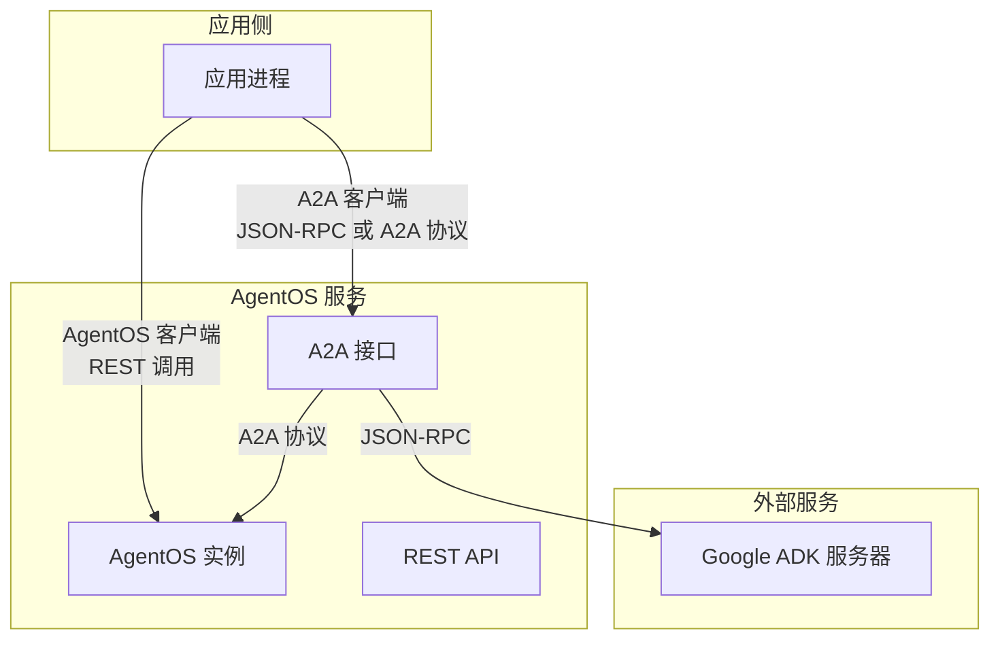
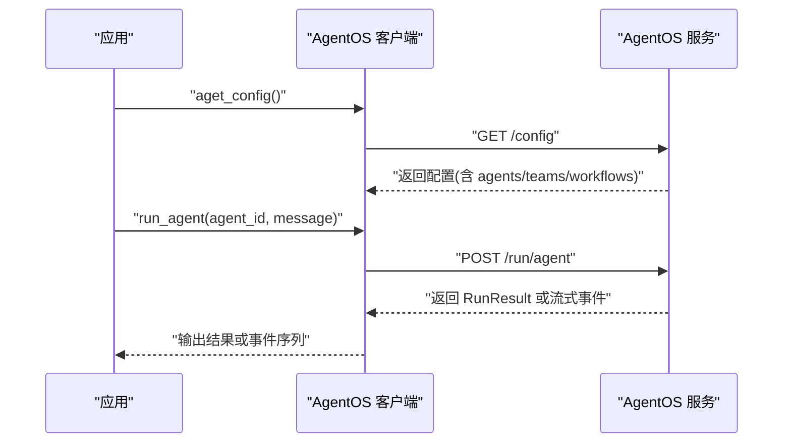
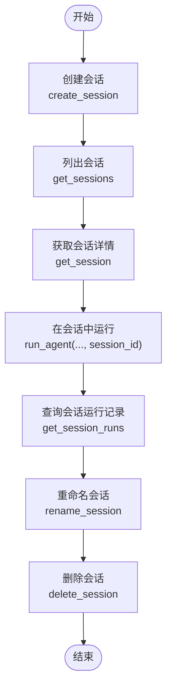
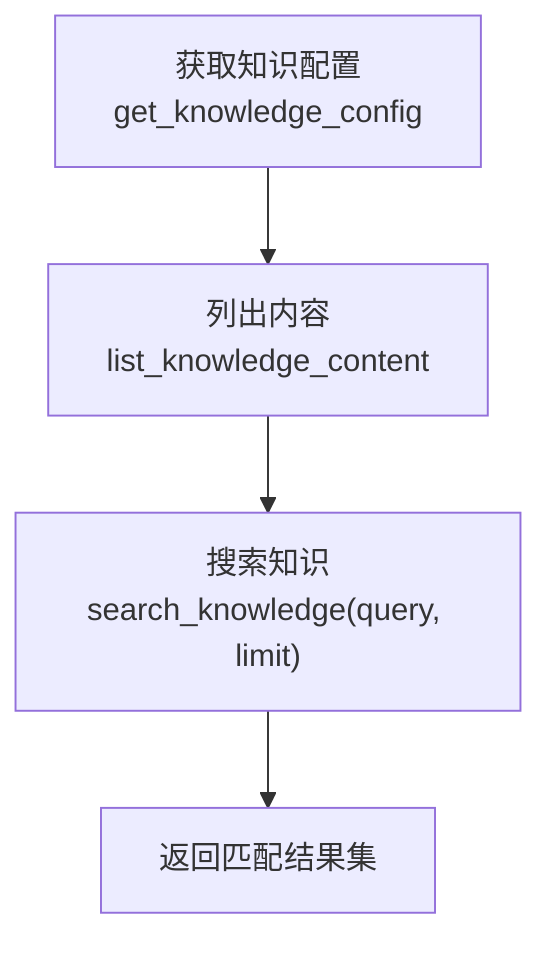
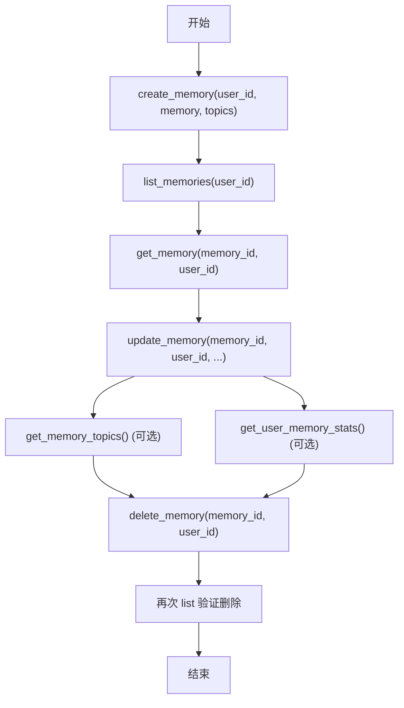
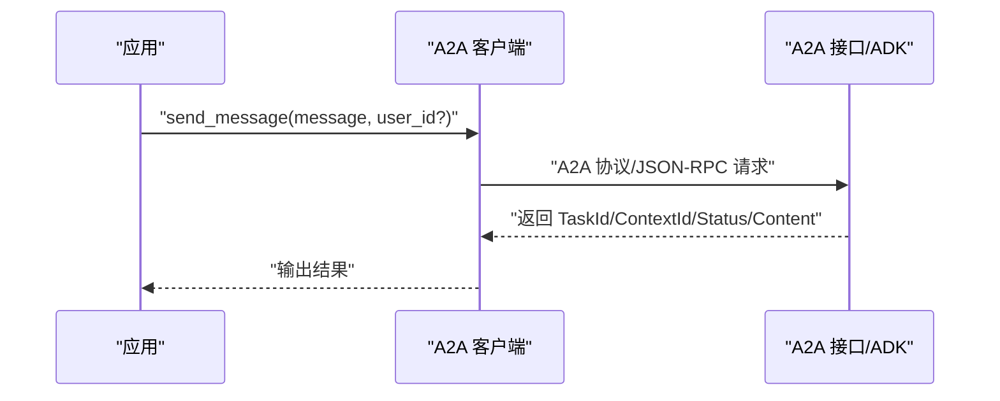
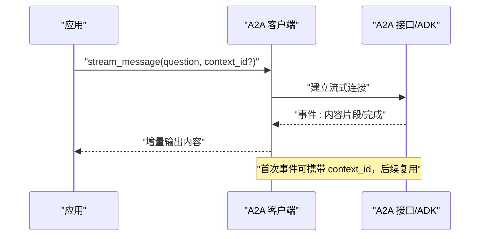
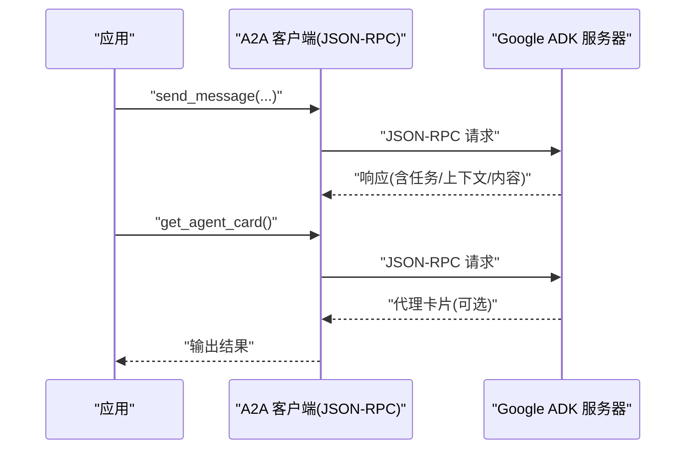
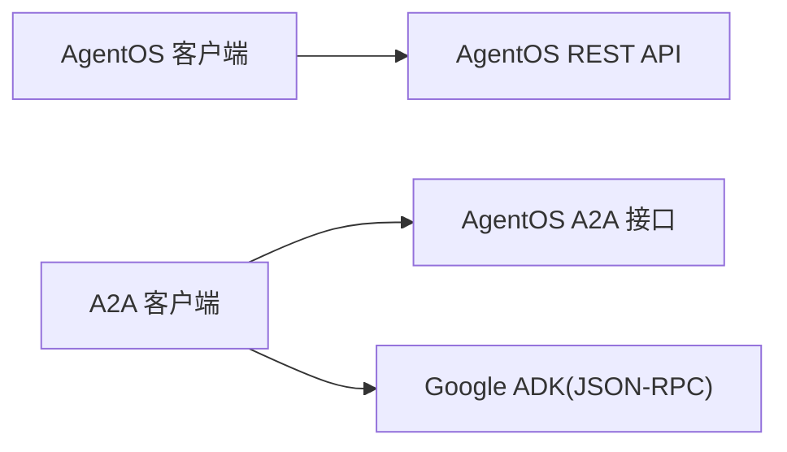

# 客户端集成示例

<cite>
**本文引用的文件**
- [agent-os/client/overview.mdx](file://agent-os/client/overview.mdx)
- [agent-os/client/agentos-client.mdx](file://agent-os/client/agentos-client.mdx)
- [agent-os/client/a2a-client.mdx](file://agent-os/client/a2a-client.mdx)
- [examples/agent-os/client/overview.mdx](file://examples/agent-os/client/overview.mdx)
- [examples/agent-os/client-a2a/overview.mdx](file://examples/agent-os/client-a2a/overview.mdx)
- [examples/agent-os/client/basic-client.mdx](file://examples/agent-os/client/basic-client.mdx)
- [examples/agent-os/client/run-agents.mdx](file://examples/agent-os/client/run-agents.mdx)
- [examples/agent-os/client/session-management.mdx](file://examples/agent-os/client/session-management.mdx)
- [examples/agent-os/client/knowledge-search.mdx](file://examples/agent-os/client/knowledge-search.mdx)
- [examples/agent-os/client/memory-operations.mdx](file://examples/agent-os/client/memory-operations.mdx)
- [examples/agent-os/client-a2a/basic-messaging.mdx](file://examples/agent-os/client-a2a/basic-messaging.mdx)
- [examples/agent-os/client-a2a/connect-to-google-adk.mdx](file://examples/agent-os/client-a2a/connect-to-google-adk.mdx)
- [examples/agent-os/client-a2a/multi-turn.mdx](file://examples/agent-os/client-a2a/multi-turn.mdx)
</cite>

## 目录
1. [简介](#简介)
2. [项目结构](#项目结构)
3. [核心组件](#核心组件)
4. [架构总览](#架构总览)
5. [详细组件分析](#详细组件分析)
6. [依赖关系分析](#依赖关系分析)
7. [性能考虑](#性能考虑)
8. [故障排查指南](#故障排查指南)
9. [结论](#结论)
10. [附录](#附录)

## 简介
本技术文档面向需要在应用中集成 AgentOS 客户端的开发者，系统性介绍如何使用 AgentOS 提供的两类客户端完成常见任务：基础客户端使用、知识搜索、内存操作、代理运行、团队运行、工作流执行、服务器配置、会话管理与内容上传；以及 A2A（Agent-to-Agent）跨框架通信的实现，包括基础消息传递、Google ADK 连接、错误处理、多轮对话与流式传输。文档同时提供完整的客户端集成步骤、最佳实践与排障建议。

## 项目结构
本仓库围绕“客户端”与“A2A 客户端”两大类示例组织内容，分别覆盖：
- AgentOS 客户端：用于连接 AgentOS 实例，执行代理、团队、工作流运行，管理会话、知识与记忆，支持流式响应与鉴权。
- A2A 客户端：用于与任何 A2A 兼容的服务通信，包括 Agno 的 A2A 接口与 Google ADK，支持消息发送、流式响应、多轮对话与能力发现。

图表来源
- [agent-os/client/overview.mdx:1-59](file://agent-os/client/overview.mdx#L1-L59)
- [agent-os/client/agentos-client.mdx:1-120](file://agent-os/client/agentos-client.mdx#L1-L120)
- [agent-os/client/a2a-client.mdx:1-62](file://agent-os/client/a2a-client.mdx#L1-L62)
- [examples/agent-os/client/overview.mdx:1-18](file://examples/agent-os/client/overview.mdx#L1-L18)
- [examples/agent-os/client-a2a/overview.mdx:1-14](file://examples/agent-os/client-a2a/overview.mdx#L1-L14)

章节来源
- [agent-os/client/overview.mdx:1-59](file://agent-os/client/overview.mdx#L1-L59)
- [examples/agent-os/client/overview.mdx:1-18](file://examples/agent-os/client/overview.mdx#L1-L18)
- [examples/agent-os/client-a2a/overview.mdx:1-14](file://examples/agent-os/client-a2a/overview.mdx#L1-L14)

## 核心组件
- AgentOS 客户端：提供连接 AgentOS 实例、运行代理/团队/工作流、管理会话、知识与记忆、流式响应与鉴权等能力。
- A2A 客户端：提供与任意 A2A 兼容服务通信的能力，包括 Agno A2A 接口与 Google ADK，支持消息发送、流式响应、多轮上下文与能力发现。

章节来源
- [agent-os/client/agentos-client.mdx:1-120](file://agent-os/client/agentos-client.mdx#L1-L120)
- [agent-os/client/a2a-client.mdx:1-62](file://agent-os/client/a2a-client.mdx#L1-L62)

## 架构总览
下图展示了客户端与 AgentOS 服务及外部 A2A 服务之间的交互关系，涵盖本地 AgentOS 实例、A2A 接口与 Google ADK。

图表来源
- [agent-os/client/overview.mdx:10-18](file://agent-os/client/overview.mdx#L10-L18)
- [agent-os/client/agentos-client.mdx:7-14](file://agent-os/client/agentos-client.mdx#L7-L14)
- [agent-os/client/a2a-client.mdx:7-12](file://agent-os/client/a2a-client.mdx#L7-L12)
- [examples/agent-os/client-a2a/connect-to-google-adk.mdx:35-47](file://examples/agent-os/client-a2a/connect-to-google-adk.mdx#L35-L47)

## 详细组件分析

### AgentOS 客户端：基础使用与运行
- 连接与配置：通过构造函数传入 base_url 获取实例配置，列举可用代理/团队/工作流。
- 运行代理：支持非流式与流式两种方式，流式事件包含内容事件与完成事件。
- 鉴权：通过请求头携带认证信息访问受保护接口。
- 错误处理：对远端服务不可用等异常进行捕获与处理。

图表来源
- [agent-os/client/agentos-client.mdx:25-39](file://agent-os/client/agentos-client.mdx#L25-L39)
- [examples/agent-os/client/run-agents.mdx:43-84](file://examples/agent-os/client/run-agents.mdx#L43-L84)

章节来源
- [agent-os/client/agentos-client.mdx:15-120](file://agent-os/client/agentos-client.mdx#L15-L120)
- [examples/agent-os/client/basic-client.mdx:40-58](file://examples/agent-os/client/basic-client.mdx#L40-L58)
- [examples/agent-os/client/run-agents.mdx:26-91](file://examples/agent-os/client/run-agents.mdx#L26-L91)

### 会话管理
- 创建会话：指定 agent_id、user_id 与会话名称。
- 列表与详情：列出用户会话、获取会话详情。
- 在会话内运行：后续运行可复用 session_id 维持上下文。
- 重命名与删除：支持会话生命周期管理。

图表来源
- [examples/agent-os/client/session-management.mdx:41-103](file://examples/agent-os/client/session-management.mdx#L41-L103)

章节来源
- [examples/agent-os/client/session-management.mdx:25-104](file://examples/agent-os/client/session-management.mdx#L25-L104)

### 知识搜索与内容上传
- 获取知识配置：读取可用 reader/chunker 等配置。
- 列出内容与搜索：支持分页列出知识库内容并按查询词检索。
- 内容上传：结合知识工具与存储后端完成内容入库（参考示例说明）。

图表来源
- [examples/agent-os/client/knowledge-search.mdx:34-76](file://examples/agent-os/client/knowledge-search.mdx#L34-L76)

章节来源
- [examples/agent-os/client/knowledge-search.mdx:27-76](file://examples/agent-os/client/knowledge-search.mdx#L27-L76)

### 内存操作
- 创建记忆：指定 user_id 与 topics，写入初始记忆内容。
- 列表与查询：按用户维度列出记忆，按记忆 ID 查询详情。
- 更新与删除：支持更新内容与主题，以及删除记忆。
- 可选接口：获取记忆主题与用户记忆统计（若服务端支持）。

图表来源
- [examples/agent-os/client/memory-operations.mdx:34-87](file://examples/agent-os/client/memory-operations.mdx#L34-L87)

章节来源
- [examples/agent-os/client/memory-operations.mdx:26-93](file://examples/agent-os/client/memory-operations.mdx#L26-L93)

### A2A 客户端：基础消息传递
- 连接 Agno A2A：直接指向 A2A 代理端点，发送消息并获取任务状态与上下文 ID。
- 连接 Google ADK：以 JSON-RPC 模式连接，发送消息并解析响应。

图表来源
- [examples/agent-os/client-a2a/basic-messaging.mdx:35-44](file://examples/agent-os/client-a2a/basic-messaging.mdx#L35-L44)
- [examples/agent-os/client-a2a/connect-to-google-adk.mdx:45-57](file://examples/agent-os/client-a2a/connect-to-google-adk.mdx#L45-L57)

章节来源
- [examples/agent-os/client-a2a/basic-messaging.mdx:29-50](file://examples/agent-os/client-a2a/basic-messaging.mdx#L29-L50)
- [examples/agent-os/client-a2a/connect-to-google-adk.mdx:39-77](file://examples/agent-os/client-a2a/connect-to-google-adk.mdx#L39-L77)

### A2A 客户端：多轮对话与流式传输
- 多轮对话：首次响应返回 context_id，后续消息复用该 ID 保持上下文。
- 流式传输：逐段接收内容事件，首条事件可能携带新的 context_id。

图表来源
- [examples/agent-os/client-a2a/multi-turn.mdx:84-95](file://examples/agent-os/client-a2a/multi-turn.mdx#L84-L95)

章节来源
- [examples/agent-os/client-a2a/multi-turn.mdx:29-100](file://examples/agent-os/client-a2a/multi-turn.mdx#L29-L100)

### A2A 客户端：连接 Google ADK
- 使用 JSON-RPC 模式连接 Google ADK 服务器，发送消息并尝试获取代理卡片（能力发现）。
- 支持带 user_id 的消息发送与能力发现失败回退。

图表来源
- [examples/agent-os/client-a2a/connect-to-google-adk.mdx:86-98](file://examples/agent-os/client-a2a/connect-to-google-adk.mdx#L86-L98)

章节来源
- [examples/agent-os/client-a2a/connect-to-google-adk.mdx:39-98](file://examples/agent-os/client-a2a/connect-to-google-adk.mdx#L39-L98)

## 依赖关系分析
- AgentOS 客户端依赖 AgentOS 实例提供的 REST API，支持会话、知识、记忆与运行事件。
- A2A 客户端既可对接 AgentOS 的 A2A 接口，也可通过 JSON-RPC 对接 Google ADK。
- 示例代码展示了从连接、运行到错误处理与流式的完整调用链路。

图表来源
- [agent-os/client/agentos-client.mdx:7-14](file://agent-os/client/agentos-client.mdx#L7-L14)
- [agent-os/client/a2a-client.mdx:7-12](file://agent-os/client/a2a-client.mdx#L7-L12)
- [examples/agent-os/client-a2a/connect-to-google-adk.mdx:35-47](file://examples/agent-os/client-a2a/connect-to-google-adk.mdx#L35-L47)

章节来源
- [agent-os/client/overview.mdx:10-18](file://agent-os/client/overview.mdx#L10-L18)
- [agent-os/client/agentos-client.mdx:7-14](file://agent-os/client/agentos-client.mdx#L7-L14)
- [agent-os/client/a2a-client.mdx:7-12](file://agent-os/client/a2a-client.mdx#L7-L12)

## 性能考虑
- 流式响应：优先使用流式接口以降低首字节延迟，提升用户体验。
- 批量操作：在会话内多次运行时复用 session_id，减少重复上下文初始化开销。
- 网络与超时：合理设置客户端超时与重试策略，避免阻塞主线程。
- 资源释放：在长连接场景下注意及时关闭流式连接与会话句柄。

## 故障排查指南
- 远端服务不可用：捕获对应异常，记录 base_url 与错误信息，检查服务健康状态与网络连通性。
- 认证失败：确认请求头中的鉴权信息正确，必要时刷新令牌。
- A2A 协议差异：Google ADK 使用 JSON-RPC 模式，需在客户端指定协议参数。
- 上下文丢失：多轮对话必须复用 context_id；首次事件可能携带新 context_id，需及时保存。

章节来源
- [agent-os/client/agentos-client.mdx:76-89](file://agent-os/client/agentos-client.mdx#L76-L89)
- [examples/agent-os/client-a2a/connect-to-google-adk.mdx:46-47](file://examples/agent-os/client-a2a/connect-to-google-adk.mdx#L46-L47)
- [examples/agent-os/client-a2a/multi-turn.mdx:44-46](file://examples/agent-os/client-a2a/multi-turn.mdx#L44-L46)

## 结论
通过 AgentOS 客户端与 A2A 客户端，开发者可以快速集成代理运行、团队协作、工作流编排、知识与记忆管理，并实现跨框架的 A2A 通信。建议优先采用流式接口与会话上下文，结合鉴权与错误处理机制，构建稳定可靠的智能体应用。

## 附录
- 快速对比：AgentOS 客户端适合全功能接入，A2A 客户端适合跨框架互操作。
- 示例清单：参考示例索引页面，按需选择基础连接、运行代理、会话管理、知识搜索、内存操作与 A2A 基础消息、多轮对话、Google ADK 连接等示例。

章节来源
- [agent-os/client/overview.mdx:20-26](file://agent-os/client/overview.mdx#L20-L26)
- [examples/agent-os/client/overview.mdx:6-17](file://examples/agent-os/client/overview.mdx#L6-L17)
- [examples/agent-os/client-a2a/overview.mdx:6-13](file://examples/agent-os/client-a2a/overview.mdx#L6-L13)