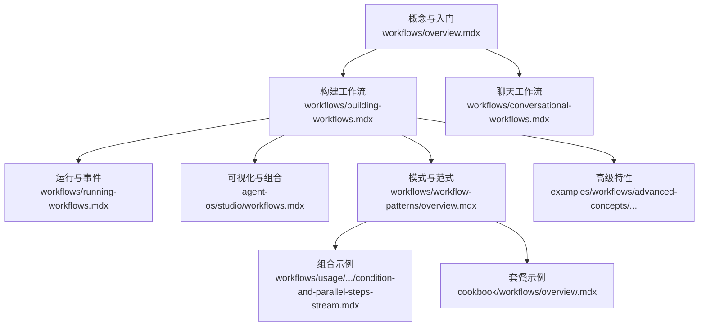
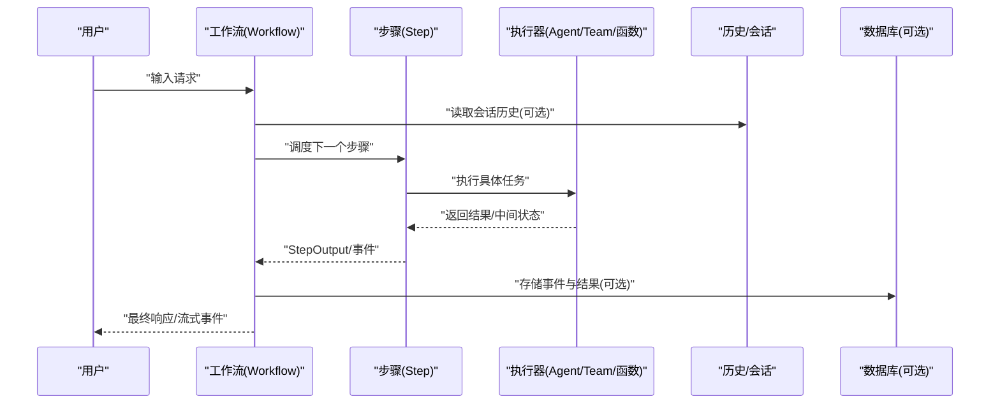
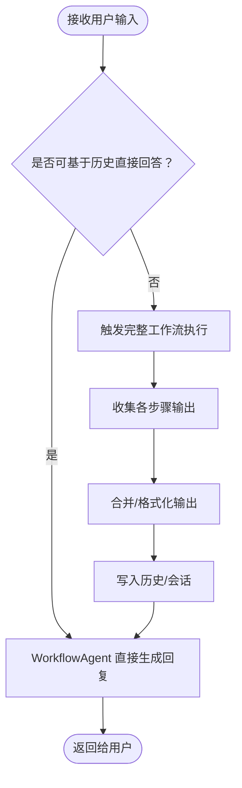
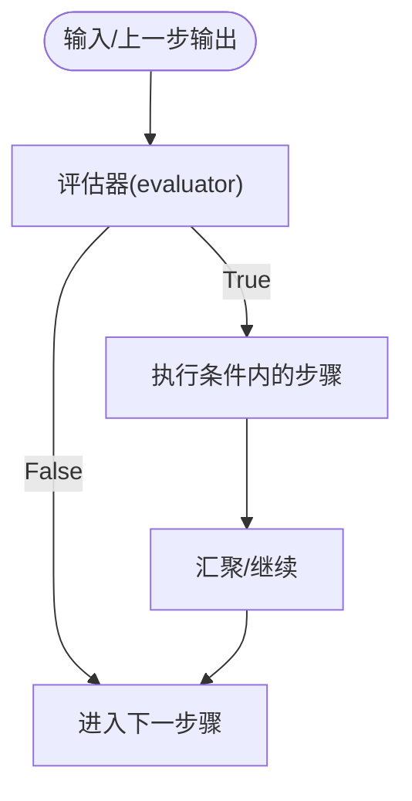
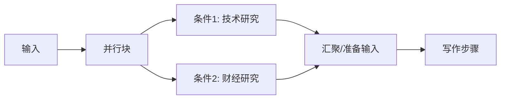
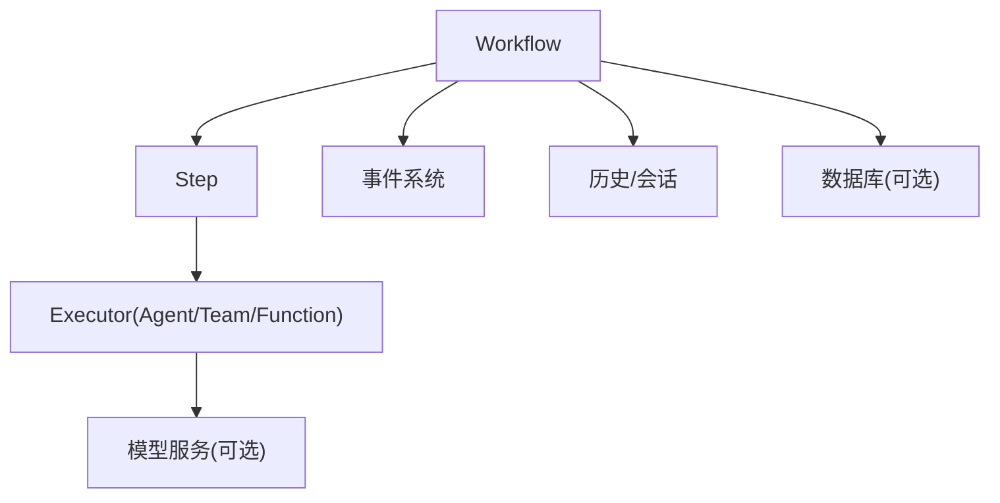

# 工作流集成示例

<cite>
**本文引用的文件**
- [workflows/overview.mdx](file://workflows/overview.mdx)
- [workflows/building-workflows.mdx](file://workflows/building-workflows.mdx)
- [workflows/conversational-workflows.mdx](file://workflows/conversational-workflows.mdx)
- [workflows/running-workflows.mdx](file://workflows/running-workflows.mdx)
- [agent-os/studio/workflows.mdx](file://agent-os/studio/workflows.mdx)
- [workflows/workflow-patterns/overview.mdx](file://workflows/workflow-patterns/overview.mdx)
- [workflows/usage/condition-and-parallel-steps-stream.mdx](file://workflows/usage/condition-and-parallel-steps-stream.mdx)
- [cookbook/workflows/overview.mdx](file://cookbook/workflows/overview.mdx)
- [examples/workflows/advanced-concepts/early-stopping/overview.mdx](file://examples/workflows/advanced-concepts/early-stopping/overview.mdx)
- [examples/workflows/advanced-concepts/history/overview.mdx](file://examples/workflows/advanced-concepts/history/overview.mdx)
</cite>

## 目录
1. [引言](#引言)
2. [项目结构](#项目结构)
3. [核心组件](#核心组件)
4. [架构总览](#架构总览)
5. [详细组件分析](#详细组件分析)
6. [依赖关系分析](#依赖关系分析)
7. [性能考量](#性能考量)
8. [故障排查指南](#故障排查指南)
9. [结论](#结论)
10. [附录](#附录)

## 引言
本技术文档围绕 AgentOS 的工作流（Workflow）能力，系统性介绍如何在实际场景中实现复杂的工作流编排。内容覆盖基础工作流、聊天工作流、团队工作流、条件工作流、并行工作流、循环工作流、路由器工作流以及嵌套步骤工作流等模式；深入解释设计模式、状态管理与执行控制机制；并通过仓库中的示例与参考文档，给出可直接落地的实现路径与最佳实践。

## 项目结构
本仓库以“文档 + 示例 + 参考”三位一体的方式组织工作流相关内容：
- 概念与入门：workflows/overview.mdx、workflows/building-workflows.mdx、workflows/conversational-workflows.mdx
- 执行与事件：workflows/running-workflows.mdx
- 可视化与组合：agent-os/studio/workflows.mdx
- 模式与范式：workflows/workflow-patterns/overview.mdx
- 组合示例：workflows/usage/condition-and-parallel-steps-stream.mdx
- 套餐示例：cookbook/workflows/overview.mdx
- 高级特性：examples/workflows/advanced-concepts/early-stopping/overview.mdx、examples/workflows/advanced-concepts/history/overview.mdx

图表来源
- [workflows/overview.mdx:1-102](file://workflows/overview.mdx#L1-L102)
- [workflows/building-workflows.mdx:1-59](file://workflows/building-workflows.mdx#L1-L59)
- [workflows/running-workflows.mdx:1-619](file://workflows/running-workflows.mdx#L1-L619)
- [agent-os/studio/workflows.mdx:1-80](file://agent-os/studio/workflows.mdx#L1-L80)
- [workflows/workflow-patterns/overview.mdx:1-92](file://workflows/workflow-patterns/overview.mdx#L1-L92)
- [workflows/usage/condition-and-parallel-steps-stream.mdx:1-126](file://workflows/usage/condition-and-parallel-steps-stream.mdx#L1-L126)
- [cookbook/workflows/overview.mdx:1-55](file://cookbook/workflows/overview.mdx#L1-L55)
- [examples/workflows/advanced-concepts/early-stopping/overview.mdx:1-12](file://examples/workflows/advanced-concepts/early-stopping/overview.mdx#L1-L12)
- [examples/workflows/advanced-concepts/history/overview.mdx:1-12](file://examples/workflows/advanced-concepts/history/overview.mdx#L1-L12)

章节来源
- [workflows/overview.mdx:1-102](file://workflows/overview.mdx#L1-L102)
- [workflows/building-workflows.mdx:1-59](file://workflows/building-workflows.mdx#L1-L59)
- [workflows/running-workflows.mdx:1-619](file://workflows/running-workflows.mdx#L1-L619)
- [agent-os/studio/workflows.mdx:1-80](file://agent-os/studio/workflows.mdx#L1-L80)
- [workflows/workflow-patterns/overview.mdx:1-92](file://workflows/workflow-patterns/overview.mdx#L1-L92)
- [workflows/usage/condition-and-parallel-steps-stream.mdx:1-126](file://workflows/usage/condition-and-parallel-steps-stream.mdx#L1-L126)
- [cookbook/workflows/overview.mdx:1-55](file://cookbook/workflows/overview.mdx#L1-L55)
- [examples/workflows/advanced-concepts/early-stopping/overview.mdx:1-12](file://examples/workflows/advanced-concepts/early-stopping/overview.mdx#L1-L12)
- [examples/workflows/advanced-concepts/history/overview.mdx:1-12](file://examples/workflows/advanced-concepts/history/overview.mdx#L1-L12)

## 核心组件
- 工作流（Workflow）：顶层编排器，负责管理执行流程、事件收集与存储、会话历史与审计。
- 步骤（Step）：最小执行单元，封装一个执行器（Agent、Team 或自定义函数），确保职责单一、可维护性强。
- 并行（Parallel）：并发执行多个子步骤，适合独立任务的并行处理。
- 条件（Condition）：基于评估器或表达式进行分支选择，支持函数或 CEL 表达式。
- 循环（Loop）：重复执行一组步骤直至满足结束条件，常用于质量控制与迭代优化。
- 路由器（Router）：动态选择下一步骤集合，实现按输入或上下文的智能路由。
- 步骤输入/输出（StepInput/StepOutput）：标准化数据接口，保证跨步骤的数据一致性与可追踪性。
- 会话与历史（Session/History）：工作流级与步骤级历史记录，支撑聊天工作流与审计需求。
- 事件系统（Events）：运行时事件（如 WorkflowStarted、StepCompleted、ConditionExecutionStarted 等）便于可观测性与调试。

章节来源
- [workflows/building-workflows.mdx:9-32](file://workflows/building-workflows.mdx#L9-L32)
- [workflows/running-workflows.mdx:462-525](file://workflows/running-workflows.mdx#L462-L525)
- [agent-os/studio/workflows.mdx:18-31](file://agent-os/studio/workflows.mdx#L18-L31)

## 架构总览
下图展示了从用户输入到最终输出的端到端执行链路，以及事件驱动的可观测性体系：

图表来源
- [workflows/running-workflows.mdx:73-77](file://workflows/running-workflows.mdx#L73-L77)
- [workflows/running-workflows.mdx:527-536](file://workflows/running-workflows.mdx#L527-L536)

## 详细组件分析

### 基础工作流（线性顺序）
- 设计要点：以 Step 为单位串联执行，上一步输出作为下一步输入；适合明确阶段划分的任务。
- 实现路径：参考“构建工作流”的步骤定义与“运行工作流”的执行方式。
- 关键点：使用 StepInput/StepOutput 标准化数据传递；通过 Workflow.run()/arun() 获取结果或事件流。

章节来源
- [workflows/building-workflows.mdx:34-59](file://workflows/building-workflows.mdx#L34-L59)
- [workflows/running-workflows.mdx:11-71](file://workflows/running-workflows.mdx#L11-L71)

### 聊天工作流（Conversation）
- 设计要点：引入 WorkflowAgent，根据当前输入与历史决定“直接回答”或“重新运行工作流”，提升交互连续性。
- 实现路径：参考“聊天工作流”示例，设置 WorkflowAgent 的模型与历史窗口参数。
- 关键点：num_history_runs 控制上下文长度；默认指令通常足以覆盖多数场景。

图表来源
- [workflows/conversational-workflows.mdx:14-90](file://workflows/conversational-workflows.mdx#L14-L90)

章节来源
- [workflows/conversational-workflows.mdx:24-160](file://workflows/conversational-workflows.mdx#L24-L160)

### 团队工作流（Team）
- 设计要点：将多个 Agent 组织为 Team，在单个步骤中协同完成复杂任务，减少跨步骤协调成本。
- 实现路径：参考“运行工作流”中的团队定义与协作示例。
- 关键点：Team 内部可共享上下文与工具，适合需要多视角或多角色协作的场景。

章节来源
- [workflows/running-workflows.mdx:40-61](file://workflows/running-workflows.mdx#L40-L61)

### 条件工作流（Condition）
- 设计要点：基于评估器（函数或 CEL 表达式）判断是否执行某一分支；适合根据输入特征或中间结果动态选择路径。
- 实现路径：参考“条件与并行组合示例”中的 evaluator 使用与嵌套条件。
- 关键点：评估器可访问 StepInput，支持关键词匹配、数值阈值等策略。

图表来源
- [workflows/usage/condition-and-parallel-steps-stream.mdx:70-91](file://workflows/usage/condition-and-parallel-steps-stream.mdx#L70-L91)

章节来源
- [workflows/usage/condition-and-parallel-steps-stream.mdx:1-126](file://workflows/usage/condition-and-parallel-steps-stream.mdx#L1-L126)

### 并行工作流（Parallel）
- 设计要点：将多个独立步骤并行执行，提高吞吐；适合多源数据采集、多策略对比等场景。
- 实现路径：参考“条件与并行组合示例”中的 Parallel 包裹多个 Condition。
- 关键点：并行块内步骤相互独立，注意资源竞争与结果合并策略。

图表来源
- [workflows/usage/condition-and-parallel-steps-stream.mdx:94-116](file://workflows/usage/condition-and-parallel-steps-stream.mdx#L94-L116)

章节来源
- [workflows/usage/condition-and-parallel-steps-stream.mdx:1-126](file://workflows/usage/condition-and-parallel-steps-stream.mdx#L1-L126)

### 循环工作流（Loop）
- 设计要点：重复执行一组步骤，直到满足结束条件；适合迭代优化、质量检查、重试等场景。
- 实现路径：参考“高级特性/早停”示例，了解如何在循环中安全终止。
- 关键点：循环中应包含退出条件与异常处理，避免无限循环。

章节来源
- [examples/workflows/advanced-concepts/early-stopping/overview.mdx:1-12](file://examples/workflows/advanced-concepts/early-stopping/overview.mdx#L1-L12)

### 路由器工作流（Router）
- 设计要点：根据输入或上下文动态选择下一步骤集合；适合分类、分发、多入口聚合等场景。
- 实现路径：结合“模式与范式”中的路由器说明与“可视化组合”中的配置方式。
- 关键点：选择器可为函数或 CEL 表达式，需覆盖所有可能的路由路径。

章节来源
- [workflows/workflow-patterns/overview.mdx:11-25](file://workflows/workflow-patterns/overview.mdx#L11-L25)
- [agent-os/studio/workflows.mdx:59-63](file://agent-os/studio/workflows.mdx#L59-L63)

### 嵌套步骤工作流（Nested Steps）
- 设计要点：将 Steps、Condition、Parallel、Loop、Router 等复合为更复杂的步骤容器，提升模块化与复用性。
- 实现路径：参考“可视化组合”中的复杂步骤配置与“模式与范式”中的组合卡片。
- 关键点：合理拆分与命名，避免过深嵌套导致可读性下降。

章节来源
- [agent-os/studio/workflows.mdx:18-31](file://agent-os/studio/workflows.mdx#L18-L31)
- [workflows/workflow-patterns/overview.mdx:30-73](file://workflows/workflow-patterns/overview.mdx#L30-L73)

### 函数型步骤（Function-Based Steps）
- 设计要点：使用纯 Python 函数作为步骤执行器，完全掌控逻辑；通过 StepInput/StepOutput 与前后步骤对接。
- 实现路径：参考“构建工作流”中的函数步骤示例。
- 关键点：函数内部可调用 Agent/Team 或外部服务，但需保持幂等与可追踪。

章节来源
- [workflows/building-workflows.mdx:39-59](file://workflows/building-workflows.mdx#L39-L59)

## 依赖关系分析
- 组件耦合：Workflow 对 Step/Executor/History/DB 具备强依赖；Step 对 Executor 单一职责依赖；Condition/Parallel/Loop/Router 对 Step 的组合依赖。
- 外部依赖：模型服务（如 OpenAI）、数据库（SQLite/PostgreSQL）、事件存储（可选）。
- 可能的循环依赖：无直接循环；若在函数步骤中不当引用 Workflow 上下文，可能形成隐式循环。

图表来源
- [workflows/running-workflows.mdx:462-525](file://workflows/running-workflows.mdx#L462-L525)
- [workflows/conversational-workflows.mdx:28-42](file://workflows/conversational-workflows.mdx#L28-L42)

章节来源
- [workflows/running-workflows.mdx:462-525](file://workflows/running-workflows.mdx#L462-L525)
- [workflows/conversational-workflows.mdx:24-42](file://workflows/conversational-workflows.mdx#L24-L42)

## 性能考量
- 并行与资源：并行执行可显著提升吞吐，但需关注并发度与资源上限，避免阻塞与抖动。
- 事件存储：开启事件存储有助于审计与调试，但会增加 I/O 开销；可通过 events_to_skip 进行噪声过滤。
- 历史窗口：聊天工作流的 num_history_runs 影响上下文长度与延迟，需在准确性与性能间权衡。
- 模型调用：合理选择模型与批量化策略，避免不必要的重复调用。

## 故障排查指南
- 事件类型定位：通过 Workflow.run()/arun() 返回的事件类型快速定位问题阶段（如 StepError、WorkflowError）。
- 事件存储：启用 store_events 并配置 events_to_skip，聚焦关键事件，缩小排查范围。
- 早停与中断：在循环、条件、并行中使用早停策略，防止无效执行；参考“早停”示例。
- 历史与会话：确认历史读取与写入是否正确，避免上下文污染或缺失。

章节来源
- [workflows/running-workflows.mdx:527-598](file://workflows/running-workflows.mdx#L527-L598)
- [examples/workflows/advanced-concepts/early-stopping/overview.mdx:1-12](file://examples/workflows/advanced-concepts/early-stopping/overview.mdx#L1-L12)

## 结论
通过将 Step、Condition、Parallel、Loop、Router 等构建块进行组合，AgentOS 工作流能够实现从简单线性到复杂分支与并行的全栈编排。配合事件系统、历史与会话、以及可视化 Studio，开发者可以构建高效、可观测、可维护的自动化工作流系统。建议优先采用模块化与组合策略，结合早停与事件过滤，持续优化性能与稳定性。

## 附录
- 快速开始：参考“构建工作流”与“运行工作流”的示例，快速搭建你的第一个工作流。
- 模式参考：浏览“工作流模式”与“套餐示例”，选择适合的范式与脚手架。
- 高级特性：探索“早停”与“历史”示例，掌握复杂场景下的执行控制与上下文管理。