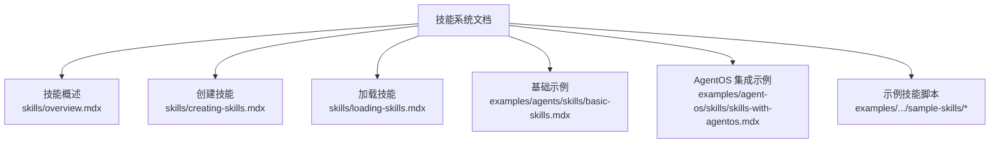
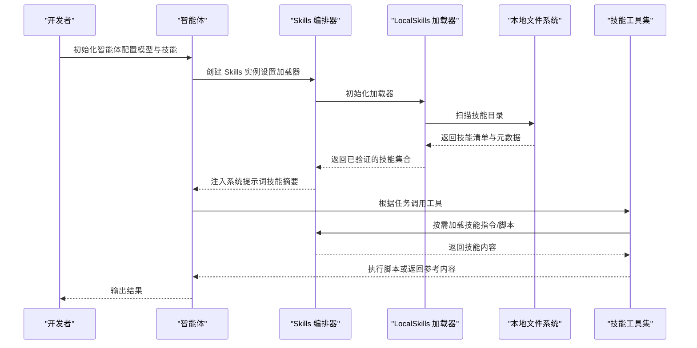
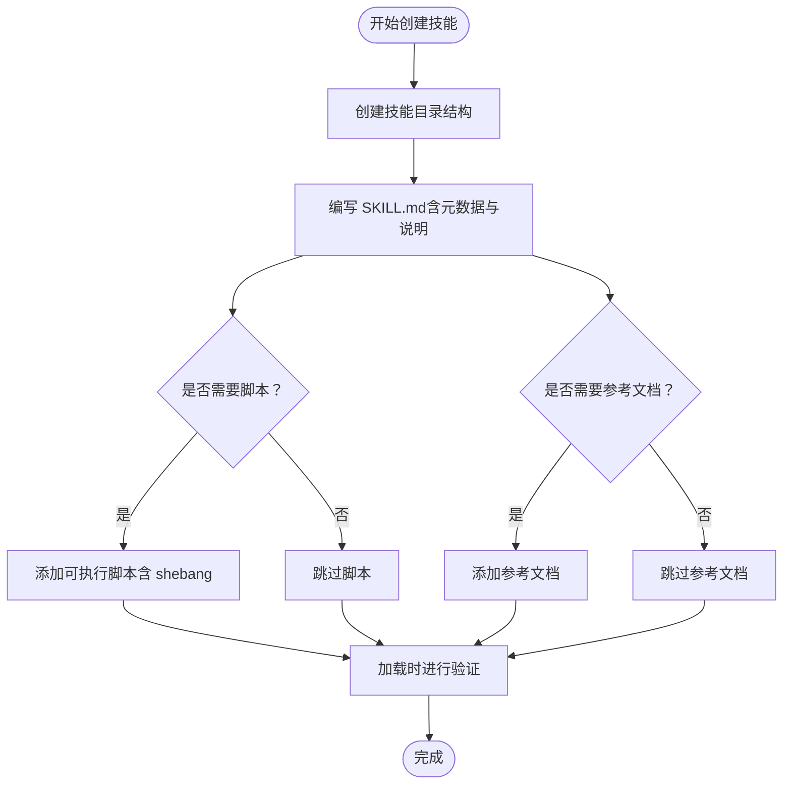
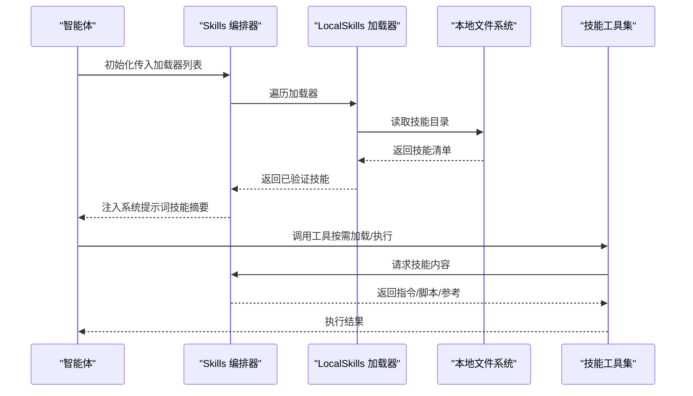
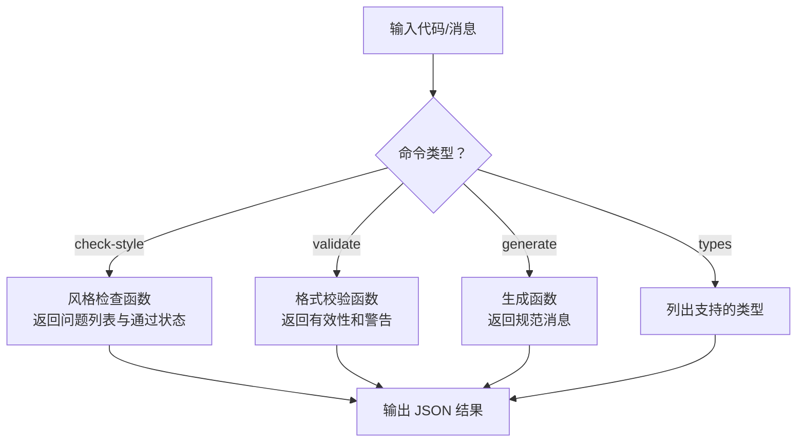
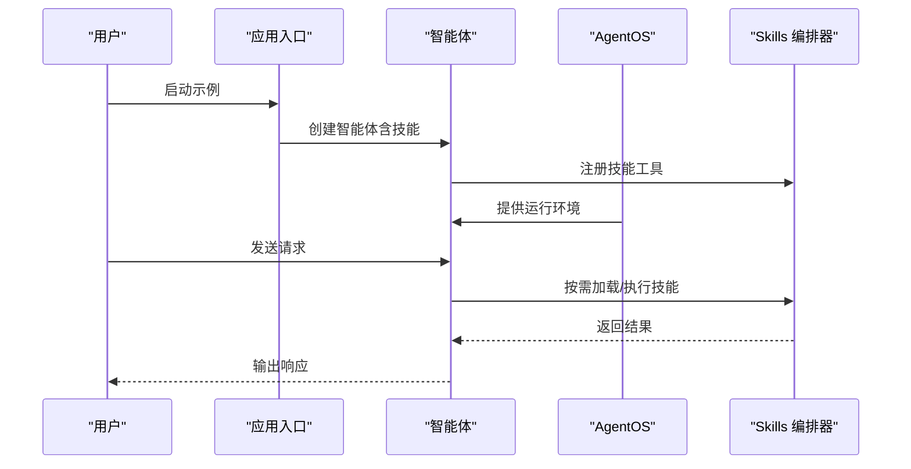
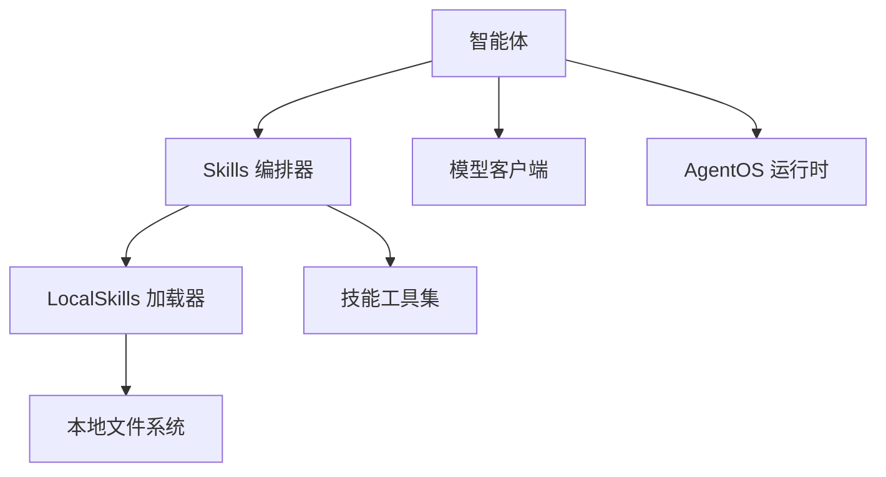

# 技能系统示例

<cite>
**本文档引用的文件**
- [skills/overview.mdx](file://skills/overview.mdx)
- [skills/creating-skills.mdx](file://skills/creating-skills.mdx)
- [skills/loading-skills.mdx](file://skills/loading-skills.mdx)
- [examples/agents/skills/basic-skills.mdx](file://examples/agents/skills/basic-skills.mdx)
- [examples/agent-os/skills/skills-with-agentos.mdx](file://examples/agent-os/skills/skills-with-agentos.mdx)
- [examples/agents/skills/sample-skills/code-review/scripts/check-style.mdx](file://examples/agents/skills/sample-skills/code-review/scripts/check-style.mdx)
- [examples/agents/skills/sample-skills/git-workflow/scripts/commit-message.mdx](file://examples/agents/skills/sample-skills/git-workflow/scripts/commit-message.mdx)
</cite>

## 目录
1. [简介](#简介)
2. [项目结构](#项目结构)
3. [核心组件](#核心组件)
4. [架构总览](#架构总览)
5. [详细组件分析](#详细组件分析)
6. [依赖关系分析](#依赖关系分析)
7. [性能考虑](#性能考虑)
8. [故障排除指南](#故障排除指南)
9. [结论](#结论)
10. [附录](#附录)

## 简介
本技术文档围绕 AgentOS 技能系统示例，系统性介绍如何在 AgentOS 中实现与管理技能系统，包括技能的创建、加载与使用。文档基于 Anthropic 的 Agent Skills 规范进行集成，强调通过“指令、脚本与参考文档”的结构化知识包，为智能体提供可按需发现、获取并使用的领域专长能力。技能系统采用惰性加载策略，仅在任务匹配时加载完整技能内容，从而降低上下文开销与成本。

## 项目结构
技能系统示例主要由三类文档构成：
- 概念与规范：技能概述、创建规范与加载方式
- 示例与用法：基础示例与结合 AgentOS 的示例
- 具体技能脚本：代码审查与 Git 工作流等可复用脚本示例

图表来源
- [skills/overview.mdx:1-83](file://skills/overview.mdx#L1-L83)
- [skills/creating-skills.mdx:1-219](file://skills/creating-skills.mdx#L1-L219)
- [skills/loading-skills.mdx:1-175](file://skills/loading-skills.mdx#L1-L175)
- [examples/agents/skills/basic-skills.mdx:1-65](file://examples/agents/skills/basic-skills.mdx#L1-L65)
- [examples/agent-os/skills/skills-with-agentos.mdx:1-63](file://examples/agent-os/skills/skills-with-agentos.mdx#L1-L63)

章节来源
- [skills/overview.mdx:1-83](file://skills/overview.mdx#L1-L83)
- [skills/creating-skills.mdx:1-219](file://skills/creating-skills.mdx#L1-L219)
- [skills/loading-skills.mdx:1-175](file://skills/loading-skills.mdx#L1-L175)
- [examples/agents/skills/basic-skills.mdx:1-65](file://examples/agents/skills/basic-skills.mdx#L1-L65)
- [examples/agent-os/skills/skills-with-agentos.mdx:1-63](file://examples/agent-os/skills/skills-with-agentos.mdx#L1-L63)

## 核心组件
- 技能定义与结构
  - 每个技能是一个自包含的包，包含指令文件、可选脚本与可选参考文档。
  - 指令文件采用 YAML 前言元数据与 Markdown 内容组合，用于描述技能名称、用途、最佳实践与执行流程。
  - 脚本为可执行模板，支持 Python、Shell 等，通过 shebang 指定解释器；执行时以技能目录为工作目录。
  - 参考文档为按需加载的知识库，如风格指南、操作手册等。
- 加载器与编排器
  - 使用 Skills 编排器与 LocalSkills 加载器从本地文件系统加载技能集合。
  - 支持多加载器组合，后加载的同名技能会覆盖先前加载的同名技能。
- 智能体工具
  - 智能体自动获得以下工具：加载技能指令、加载参考文档、读取或执行脚本。
  - 系统提示词中自动注入技能元信息，便于智能体发现与选择合适的技能。

章节来源
- [skills/overview.mdx:12-71](file://skills/overview.mdx#L12-L71)
- [skills/creating-skills.mdx:9-18](file://skills/creating-skills.mdx#L9-L18)
- [skills/creating-skills.mdx:20-86](file://skills/creating-skills.mdx#L20-L86)
- [skills/loading-skills.mdx:7-87](file://skills/loading-skills.mdx#L7-L87)
- [skills/loading-skills.mdx:108-116](file://skills/loading-skills.mdx#L108-L116)

## 架构总览
下图展示了技能系统在 AgentOS 中的整体交互流程：智能体启动时加载技能编排器与本地加载器，系统提示词中注入技能摘要，当任务触发时按需加载完整指令与脚本，并可执行脚本完成具体动作。

图表来源
- [skills/loading-skills.mdx:11-23](file://skills/loading-skills.mdx#L11-L23)
- [skills/loading-skills.mdx:25-48](file://skills/loading-skills.mdx#L25-L48)
- [skills/loading-skills.mdx:78-106](file://skills/loading-skills.mdx#L78-L106)
- [skills/overview.mdx:36-41](file://skills/overview.mdx#L36-L41)

## 详细组件分析

### 组件一：技能创建与结构
- 目录结构
  - 每个技能目录包含必需的指令文件与可选的 scripts 与 references 子目录。
- 指令文件（SKILL.md）
  - 必填字段：name、description
  - 可选字段：license、metadata.version、metadata.author、metadata.tags 等
  - 内容建议包含使用场景、处理流程与最佳实践
- 脚本（scripts）
  - 需要 shebang 行以声明解释器
  - 执行时以技能目录为工作目录，可接收参数
- 参考文档（references）
  - 按需加载，适合存放风格指南、API 文档等
- 验证规则
  - 名称长度与字符限制、字段长度上限、许可证标识校验等

图表来源
- [skills/creating-skills.mdx:9-18](file://skills/creating-skills.mdx#L9-L18)
- [skills/creating-skills.mdx:20-86](file://skills/creating-skills.mdx#L20-L86)
- [skills/creating-skills.mdx:87-138](file://skills/creating-skills.mdx#L87-L138)
- [skills/creating-skills.mdx:140-168](file://skills/creating-skills.mdx#L140-L168)
- [skills/creating-skills.mdx:170-191](file://skills/creating-skills.mdx#L170-L191)

章节来源
- [skills/creating-skills.mdx:9-18](file://skills/creating-skills.mdx#L9-L18)
- [skills/creating-skills.mdx:20-86](file://skills/creating-skills.mdx#L20-L86)
- [skills/creating-skills.mdx:87-138](file://skills/creating-skills.mdx#L87-L138)
- [skills/creating-skills.mdx:140-168](file://skills/creating-skills.mdx#L140-L168)
- [skills/creating-skills.mdx:170-191](file://skills/creating-skills.mdx#L170-L191)

### 组件二：技能加载与使用
- 基本用法
  - 通过 Skills 编排器与 LocalSkills 加载器从指定路径加载技能
- 多加载器与覆盖规则
  - 支持从多个位置加载技能，后加载的同名技能覆盖先前加载的同名技能
- 智能体工具
  - get_skill_instructions(skill_name)：加载技能完整说明
  - get_skill_reference(skill_name, reference_path)：加载参考文档
  - get_skill_script(skill_name, script_path, execute, args, timeout)：读取或执行脚本
- 系统提示词集成
  - 自动注入技能名称、描述、可用脚本与参考项，帮助智能体发现与选择
- 运行时重载
  - 当技能文件变更时，可通过 reload() 刷新加载
- 错误处理
  - 加载阶段进行验证，失败抛出技能验证异常，包含错误详情

图表来源
- [skills/loading-skills.mdx:11-23](file://skills/loading-skills.mdx#L11-L23)
- [skills/loading-skills.mdx:25-76](file://skills/loading-skills.mdx#L25-L76)
- [skills/loading-skills.mdx:78-106](file://skills/loading-skills.mdx#L78-L106)
- [skills/loading-skills.mdx:118-131](file://skills/loading-skills.mdx#L118-L131)
- [skills/loading-skills.mdx:133-145](file://skills/loading-skills.mdx#L133-L145)

章节来源
- [skills/loading-skills.mdx:11-23](file://skills/loading-skills.mdx#L11-L23)
- [skills/loading-skills.mdx:25-76](file://skills/loading-skills.mdx#L25-L76)
- [skills/loading-skills.mdx:78-106](file://skills/loading-skills.mdx#L78-L106)
- [skills/loading-skills.mdx:108-116](file://skills/loading-skills.mdx#L108-L116)
- [skills/loading-skills.mdx:118-131](file://skills/loading-skills.mdx#L118-L131)
- [skills/loading-skills.mdx:133-145](file://skills/loading-skills.mdx#L133-L145)

### 组件三：示例技能与实现
- 代码审查技能（Python 风格检查）
  - 功能：对输入代码进行风格问题检测，返回问题列表与通过状态
  - 输入输出：支持从命令行参数或标准输入读取代码，输出 JSON 结果
  - 适用场景：代码审查、质量检查、自动化反馈
- Git 提交消息技能（格式校验与生成）
  - 功能：校验或生成符合约定式提交规范的消息
  - 输入输出：支持 validate/generate/types 子命令，输出校验结果或生成消息
  - 适用场景：Git 工作流规范化、自动化提交检查

图表来源
- [examples/agents/skills/sample-skills/code-review/scripts/check-style.mdx:21-67](file://examples/agents/skills/sample-skills/code-review/scripts/check-style.mdx#L21-L67)
- [examples/agents/skills/sample-skills/git-workflow/scripts/commit-message.mdx:34-64](file://examples/agents/skills/sample-skills/git-workflow/scripts/commit-message.mdx#L34-L64)
- [examples/agents/skills/sample-skills/git-workflow/scripts/commit-message.mdx:67-79](file://examples/agents/skills/sample-skills/git-workflow/scripts/commit-message.mdx#L67-L79)
- [examples/agents/skills/sample-skills/git-workflow/scripts/commit-message.mdx:82-84](file://examples/agents/skills/sample-skills/git-workflow/scripts/commit-message.mdx#L82-L84)

章节来源
- [examples/agents/skills/sample-skills/code-review/scripts/check-style.mdx:1-98](file://examples/agents/skills/sample-skills/code-review/scripts/check-style.mdx#L1-L98)
- [examples/agents/skills/sample-skills/git-workflow/scripts/commit-message.mdx:1-141](file://examples/agents/skills/sample-skills/git-workflow/scripts/commit-message.mdx#L1-L141)

### 组件四：示例应用与集成
- 基础示例
  - 展示如何创建智能体并加载技能目录，随后向智能体提问以触发技能使用
- AgentOS 集成示例
  - 在 AgentOS 中创建智能体并启用技能，通过服务接口运行应用，演示脚本执行与技能协作

图表来源
- [examples/agents/skills/basic-skills.mdx:22-34](file://examples/agents/skills/basic-skills.mdx#L22-L34)
- [examples/agent-os/skills/skills-with-agentos.mdx:24-41](file://examples/agent-os/skills/skills-with-agentos.mdx#L24-L41)

章节来源
- [examples/agents/skills/basic-skills.mdx:1-65](file://examples/agents/skills/basic-skills.mdx#L1-L65)
- [examples/agent-os/skills/skills-with-agentos.mdx:1-63](file://examples/agent-os/skills/skills-with-agentos.mdx#L1-L63)

## 依赖关系分析
- 组件耦合
  - 智能体依赖 Skills 编排器提供的工具接口
  - Skills 编排器依赖 LocalSkills 加载器进行文件系统扫描与解析
  - 脚本执行依赖操作系统可执行环境（解释器与外部工具）
- 外部依赖
  - 模型客户端（如 OpenAI Responses/Chat）用于对话与推理
  - AgentOS 提供运行时环境与服务化部署能力
- 潜在循环依赖
  - 技能系统为单向依赖（智能体 -> 编排器 -> 加载器），无循环依赖风险

图表来源
- [skills/loading-skills.mdx:11-23](file://skills/loading-skills.mdx#L11-L23)
- [skills/loading-skills.mdx:25-48](file://skills/loading-skills.mdx#L25-L48)
- [examples/agent-os/skills/skills-with-agentos.mdx:24-41](file://examples/agent-os/skills/skills-with-agentos.mdx#L24-L41)

章节来源
- [skills/loading-skills.mdx:11-23](file://skills/loading-skills.mdx#L11-L23)
- [skills/loading-skills.mdx:25-48](file://skills/loading-skills.mdx#L25-L48)
- [examples/agent-os/skills/skills-with-agentos.mdx:24-41](file://examples/agent-os/skills/skills-with-agentos.mdx#L24-L41)

## 性能考虑
- 惰性加载策略
  - 仅在任务匹配时加载完整技能内容，减少系统提示词与上下文开销
- 脚本执行优化
  - 脚本应尽量短小、幂等，避免长时间阻塞；必要时设置超时参数
- 文件系统访问
  - 合理组织技能目录层级，避免过多嵌套导致扫描开销
- 版本与缓存
  - 对频繁使用的参考文档可做本地缓存；对脚本输出结果可做结果缓存以减少重复计算

## 故障排除指南
- 加载失败
  - 症状：初始化技能时报错
  - 排查：检查技能目录结构、指令文件格式、许可证标识与字段长度限制
- 覆盖冲突
  - 症状：同名技能被覆盖
  - 排查：确认加载器顺序，调整加载路径以控制覆盖优先级
- 脚本执行异常
  - 症状：脚本报错或无输出
  - 排查：确认 shebang 正确、解释器可用、工作目录权限与参数传递正确
- 运行时更新未生效
  - 症状：修改技能后未见变化
  - 排查：调用重载方法刷新加载

章节来源
- [skills/creating-skills.mdx:170-191](file://skills/creating-skills.mdx#L170-L191)
- [skills/loading-skills.mdx:74-76](file://skills/loading-skills.mdx#L74-L76)
- [skills/loading-skills.mdx:133-145](file://skills/loading-skills.mdx#L133-L145)
- [skills/loading-skills.mdx:118-131](file://skills/loading-skills.mdx#L118-L131)

## 结论
AgentOS 技能系统通过结构化的指令、脚本与参考文档，为智能体提供了可按需发现与使用的领域专长能力。结合惰性加载与工具化接口，既能提升上下文效率，又能实现模块化的功能增强。示例技能（代码审查、Git 提交消息）展示了如何将常见任务封装为可复用的技能包，并通过 AgentOS 或基础智能体示例进行集成与演示。

## 附录
- 快速上手步骤
  - 准备技能目录与指令文件
  - 使用 LocalSkills 加载器注册技能
  - 在智能体中启用技能工具
  - 运行示例并观察技能触发与脚本执行
- 扩展建议
  - 将常用技能抽象为共享包，跨团队/项目复用
  - 引入版本号与元数据标签，便于追踪与管理
  - 结合 AgentOS 进行服务化部署与监控