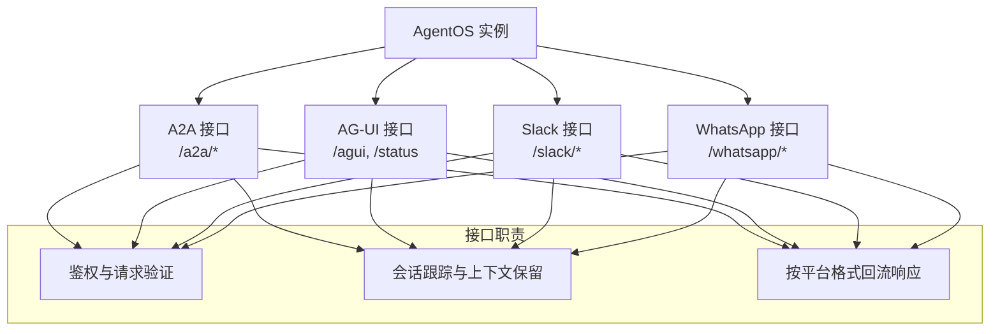
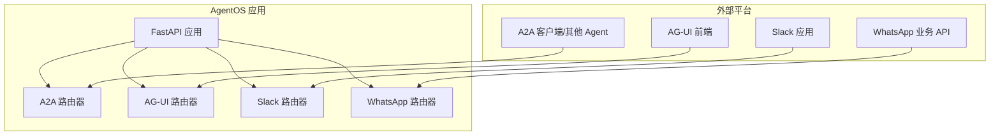
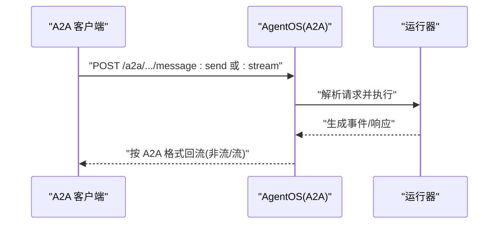
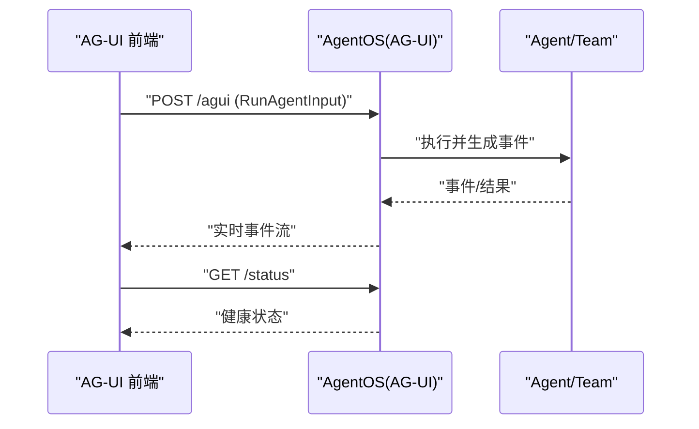
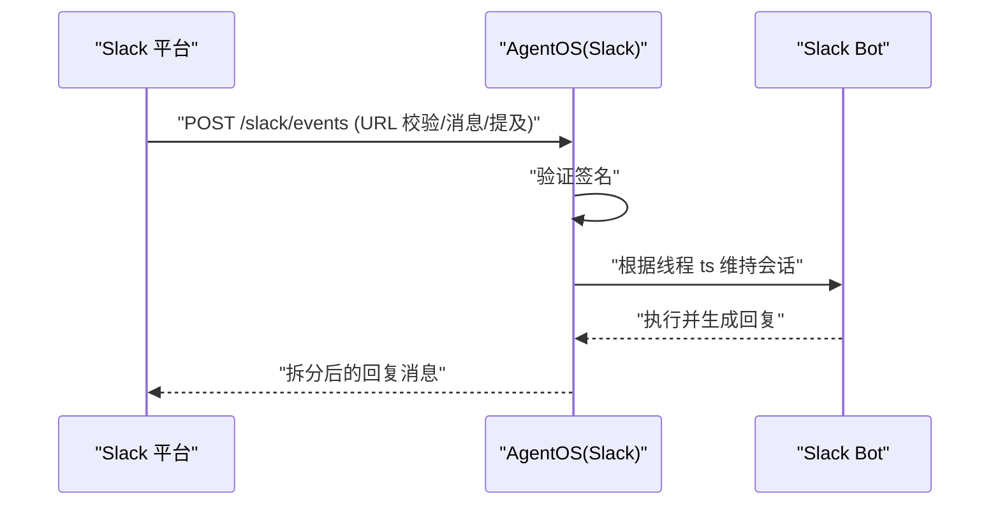
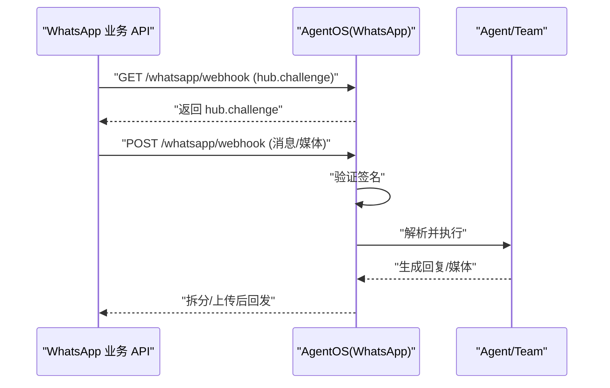
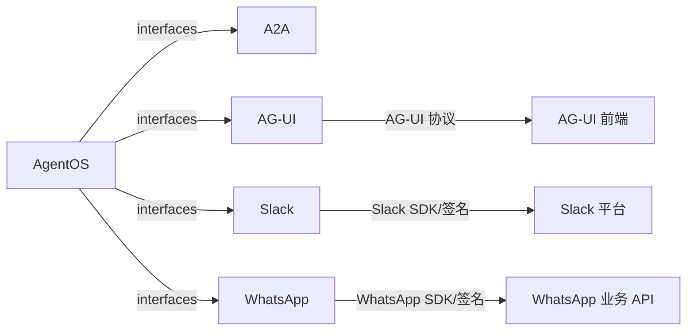

# 接口集成示例

<cite>
**本文引用的文件**
- [agent-os/interfaces/overview.mdx](file://agent-os/interfaces/overview.mdx)
- [agent-os/interfaces/a2a/introduction.mdx](file://agent-os/interfaces/a2a/introduction.mdx)
- [agent-os/interfaces/ag-ui/introduction.mdx](file://agent-os/interfaces/ag-ui/introduction.mdx)
- [agent-os/interfaces/slack/introduction.mdx](file://agent-os/interfaces/slack/introduction.mdx)
- [agent-os/interfaces/whatsapp/introduction.mdx](file://agent-os/interfaces/whatsapp/introduction.mdx)
- [agent-os/usage/interfaces/ag-ui/basic.mdx](file://agent-os/usage/interfaces/ag-ui/basic.mdx)
- [reference-api/schema/slack/slack-events.mdx](file://reference-api/schema/slack/slack-events.mdx)
- [reference-api/schema/whatsapp/verify-webhook.mdx](file://reference-api/schema/whatsapp/verify-webhook.mdx)
- [reference-api/schema/whatsapp/webhook.mdx](file://reference-api/schema/whatsapp/webhook.mdx)
- [examples/agent-os/interfaces/a2a/agent-with-tools.mdx](file://examples/agent-os/interfaces/a2a/agent-with-tools.mdx)
- [examples/agent-os/interfaces/a2a/reasoning-agent.mdx](file://examples/agent-os/interfaces/a2a/reasoning-agent.mdx)
- [examples/agent-os/interfaces/a2a/multi-agent-a2a/airbnb-agent.mdx](file://examples/agent-os/interfaces/a2a/multi-agent-a2a/airbnb-agent.mdx)
- [examples/agent-os/interfaces/a2a/multi-agent-a2a/weather-agent.mdx](file://examples/agent-os/interfaces/a2a/multi-agent-a2a/weather-agent.mdx)
- [examples/agent-os/interfaces/a2a/multi-agent-a2a/trip-planning-a2a-client.mdx](file://examples/agent-os/interfaces/a2a/multi-agent-a2a/trip-planning-a2a-client.mdx)
</cite>

## 目录
1. [简介](#简介)
2. [项目结构](#项目结构)
3. [核心组件](#核心组件)
4. [架构总览](#架构总览)
5. [详细组件分析](#详细组件分析)
6. [依赖关系分析](#依赖关系分析)
7. [性能考量](#性能考量)
8. [故障排查指南](#故障排查指南)
9. [结论](#结论)
10. [附录](#附录)

## 简介
本文件面向希望将 AgentOS 与多种外部接口和平台集成的开发者，系统性讲解如何通过 A2A（Agent-to-Agent）、AG-UI、Slack 与 WhatsApp 四类接口，将 AgentOS 暴露到不同通信平台。内容覆盖配置方法、认证机制、消息格式与集成模式，并提供可直接定位到仓库示例的路径指引，帮助在不同平台上部署与运行 AgentOS。

## 项目结构
AgentOS 的接口能力由“接口层”实现：每个接口都是一个 FastAPI 路由器，挂载在 AgentOS 实例上，负责协议适配、鉴权校验、会话与上下文管理以及响应流式输出。接口支持在同一 AgentOS 中同时启用多个，从而让同一套智能体同时接入多条通道。

图表来源
- [agent-os/interfaces/overview.mdx:43-67](file://agent-os/interfaces/overview.mdx#L43-L67)

章节来源
- [agent-os/interfaces/overview.mdx:1-68](file://agent-os/interfaces/overview.mdx#L1-L68)

## 核心组件
- A2A 接口：提供标准 Agent 卡片发现与消息发送/流式接口，支持单智能体或团队/工作流暴露。
- AG-UI 接口：提供与前端交互的标准协议端点，支持自定义事件推送与健康检查。
- Slack 接口：挂载事件路由，进行签名验证，使用线程时间戳作为会话 ID，向 Slack 线程回流响应。
- WhatsApp 接口：挂载 Webhook 路由，进行签名验证，处理文本/媒体消息并回发，使用用户手机号作为 user_id 与 session_id。

章节来源
- [agent-os/interfaces/a2a/introduction.mdx:1-149](file://agent-os/interfaces/a2a/introduction.mdx#L1-L149)
- [agent-os/interfaces/ag-ui/introduction.mdx:1-146](file://agent-os/interfaces/ag-ui/introduction.mdx#L1-L146)
- [agent-os/interfaces/slack/introduction.mdx:1-100](file://agent-os/interfaces/slack/introduction.mdx#L1-L100)
- [agent-os/interfaces/whatsapp/introduction.mdx:1-98](file://agent-os/interfaces/whatsapp/introduction.mdx#L1-L98)

## 架构总览
下图展示 AgentOS 如何通过接口层对接外部平台，以及各接口的关键端点与职责：

图表来源
- [agent-os/interfaces/overview.mdx:43-67](file://agent-os/interfaces/overview.mdx#L43-L67)
- [agent-os/interfaces/a2a/introduction.mdx:63-107](file://agent-os/interfaces/a2a/introduction.mdx#L63-L107)
- [agent-os/interfaces/ag-ui/introduction.mdx:123-130](file://agent-os/interfaces/ag-ui/introduction.mdx#L123-L130)
- [agent-os/interfaces/slack/introduction.mdx:76-86](file://agent-os/interfaces/slack/introduction.mdx#L76-L86)
- [agent-os/interfaces/whatsapp/introduction.mdx:78-97](file://agent-os/interfaces/whatsapp/introduction.mdx#L78-L97)

## 详细组件分析

### A2A 接口
- 配置方式
  - 在 AgentOS 初始化时开启 a2a_interface 或显式传入 A2A 接口实例，即可将指定 Agent/Team/Workflow 暴露为 A2A 兼容服务。
  - 参考示例路径：[examples/agent-os/interfaces/a2a/agent-with-tools.mdx:45-68](file://examples/agent-os/interfaces/a2a/agent-with-tools.mdx#L45-L68)、[examples/agent-os/interfaces/a2a/reasoning-agent.mdx:48-58](file://examples/agent-os/interfaces/a2a/reasoning-agent.mdx#L48-L58)、[examples/agent-os/interfaces/a2a/multi-agent-a2a/airbnb-agent.mdx:50-63](file://examples/agent-os/interfaces/a2a/multi-agent-a2a/airbnb-agent.mdx#L50-L63)、[examples/agent-os/interfaces/a2a/multi-agent-a2a/weather-agent.mdx:55-64](file://examples/agent-os/interfaces/a2a/multi-agent-a2a/weather-agent.mdx#L55-L64)、[examples/agent-os/interfaces/a2a/multi-agent-a2a/trip-planning-a2a-client.mdx:123-132](file://examples/agent-os/interfaces/a2a/multi-agent-a2a/trip-planning-a2a-client.mdx#L123-L132)
- 认证与消息格式
  - A2A 客户端期望服务器仅暴露单个实体（Agent/Team/Workflow），并以对应基础路径作为入口。
  - 支持两类消息端点：非流式发送与流式发送；同时提供标准 Agent 卡片发现端点。
  - 参考端点与协议映射：[agent-os/interfaces/a2a/introduction.mdx:63-107](file://agent-os/interfaces/a2a/introduction.mdx#L63-L107)
- 连接方式
  - 直连 A2A 协议：使用 A2AClient 发送消息。
  - 使用 RemoteAgent：以更高层抽象调用远程智能体。
  - 参考示例路径：[agent-os/interfaces/a2a/introduction.mdx:109-142](file://agent-os/interfaces/a2a/introduction.mdx#L109-L142)

图表来源
- [agent-os/interfaces/a2a/introduction.mdx:63-107](file://agent-os/interfaces/a2a/introduction.mdx#L63-L107)

章节来源
- [agent-os/interfaces/a2a/introduction.mdx:17-107](file://agent-os/interfaces/a2a/introduction.mdx#L17-L107)
- [examples/agent-os/interfaces/a2a/agent-with-tools.mdx:45-68](file://examples/agent-os/interfaces/a2a/agent-with-tools.mdx#L45-L68)
- [examples/agent-os/interfaces/a2a/reasoning-agent.mdx:48-58](file://examples/agent-os/interfaces/a2a/reasoning-agent.mdx#L48-L58)
- [examples/agent-os/interfaces/a2a/multi-agent-a2a/airbnb-agent.mdx:50-63](file://examples/agent-os/interfaces/a2a/multi-agent-a2a/airbnb-agent.mdx#L50-L63)
- [examples/agent-os/interfaces/a2a/multi-agent-a2a/weather-agent.mdx:55-64](file://examples/agent-os/interfaces/a2a/multi-agent-a2a/weather-agent.mdx#L55-L64)
- [examples/agent-os/interfaces/a2a/multi-agent-a2a/trip-planning-a2a-client.mdx:123-132](file://examples/agent-os/interfaces/a2a/multi-agent-a2a/trip-planning-a2a-client.mdx#L123-L132)

### AG-UI 接口
- 配置与运行
  - 将 AG-UI 接口绑定到 AgentOS，并通过 AgentOS.serve 启动 Uvicorn 服务。
  - 示例路径：[agent-os/usage/interfaces/ag-ui/basic.mdx:1-70](file://agent-os/usage/interfaces/ag-ui/basic.mdx#L1-L70)
- 自定义事件
  - 工具中产生的自定义事件会自动以 AG-UI 自定义事件格式推送到前端。
  - 参考示例路径：[agent-os/interfaces/ag-ui/introduction.mdx:60-96](file://agent-os/interfaces/ag-ui/introduction.mdx#L60-L96)
- 关键端点
  - POST /agui：接收 AG-UI 协议输入并流式返回事件。
  - GET /status：接口健康状态。
  - 参考端点说明：[agent-os/interfaces/ag-ui/introduction.mdx:123-130](file://agent-os/interfaces/ag-ui/introduction.mdx#L123-L130)

图表来源
- [agent-os/interfaces/ag-ui/introduction.mdx:123-130](file://agent-os/interfaces/ag-ui/introduction.mdx#L123-L130)

章节来源
- [agent-os/interfaces/ag-ui/introduction.mdx:1-146](file://agent-os/interfaces/ag-ui/introduction.mdx#L1-L146)
- [agent-os/usage/interfaces/ag-ui/basic.mdx:1-70](file://agent-os/usage/interfaces/ag-ui/basic.mdx#L1-L70)

### Slack 接口
- 配置要点
  - 必需环境变量：SLACK_TOKEN（机器人用户 OAuth 令牌）、SLACK_SIGNING_SECRET（应用签名密钥）。
  - 本地开发建议使用 ngrok 并将事件订阅指向 /slack/events。
  - 示例路径：[agent-os/interfaces/slack/introduction.mdx:12-17](file://agent-os/interfaces/slack/introduction.mdx#L12-L17)
- 关键端点与行为
  - POST /slack/events：处理 URL 校验、消息与提及事件；对每个线程使用 ts 作为会话 ID；长消息拆分回流。
  - 参考端点说明：[agent-os/interfaces/slack/introduction.mdx:76-86](file://agent-os/interfaces/slack/introduction.mdx#L76-L86)
- 请求验证
  - 所有请求均进行 Slack 签名验证。
  - 参考 API Schema：[reference-api/schema/slack/slack-events.mdx:1-3](file://reference-api/schema/slack/slack-events.mdx#L1-L3)
- 示例与运行
  - 示例路径：[agent-os/interfaces/slack/introduction.mdx:18-46](file://agent-os/interfaces/slack/introduction.mdx#L18-L46)

图表来源
- [agent-os/interfaces/slack/introduction.mdx:76-86](file://agent-os/interfaces/slack/introduction.mdx#L76-L86)
- [reference-api/schema/slack/slack-events.mdx:1-3](file://reference-api/schema/slack/slack-events.mdx#L1-L3)

章节来源
- [agent-os/interfaces/slack/introduction.mdx:1-100](file://agent-os/interfaces/slack/introduction.mdx#L1-L100)
- [reference-api/schema/slack/slack-events.mdx:1-3](file://reference-api/schema/slack/slack-events.mdx#L1-L3)

### WhatsApp 接口
- 配置要点
  - 必需环境变量：WHATSAPP_ACCESS_TOKEN、WHATSAPP_PHONE_NUMBER_ID、WHATSAPP_VERIFY_TOKEN。
  - 生产环境可选：WHATSAPP_APP_SECRET 与 APP_ENV=production。
  - 用户手机号自动作为 user_id 与 session_id，确保会话与记忆按用户隔离。
  - 参考配置说明：[agent-os/interfaces/whatsapp/introduction.mdx:8-23](file://agent-os/interfaces/whatsapp/introduction.mdx#L8-L23)
- 关键端点与行为
  - GET /whatsapp/status：接口健康检查。
  - GET /whatsapp/webhook：验证 Webhook（hub.challenge）。
  - POST /whatsapp/webhook：接收消息与事件，进行签名验证；处理文本/图片/视频/音频/文档；长消息拆分、生成图片上传后回发。
  - 参考端点说明：[agent-os/interfaces/whatsapp/introduction.mdx:78-97](file://agent-os/interfaces/whatsapp/introduction.mdx#L78-L97)
- 请求验证
  - 使用 X-Hub-Signature-256 进行签名验证；开发模式下可绕过。
  - 参考 API Schema：[reference-api/schema/whatsapp/verify-webhook.mdx:1-3](file://reference-api/schema/whatsapp/verify-webhook.mdx#L1-L3)、[reference-api/schema/whatsapp/webhook.mdx:1-3](file://reference-api/schema/whatsapp/webhook.mdx#L1-L3)
- 示例与运行
  - 示例路径：[agent-os/interfaces/whatsapp/introduction.mdx:25-52](file://agent-os/interfaces/whatsapp/introduction.mdx#L25-L52)

图表来源
- [agent-os/interfaces/whatsapp/introduction.mdx:78-97](file://agent-os/interfaces/whatsapp/introduction.mdx#L78-L97)
- [reference-api/schema/whatsapp/verify-webhook.mdx:1-3](file://reference-api/schema/whatsapp/verify-webhook.mdx#L1-L3)
- [reference-api/schema/whatsapp/webhook.mdx:1-3](file://reference-api/schema/whatsapp/webhook.mdx#L1-L3)

章节来源
- [agent-os/interfaces/whatsapp/introduction.mdx:1-98](file://agent-os/interfaces/whatsapp/introduction.mdx#L1-L98)
- [reference-api/schema/whatsapp/verify-webhook.mdx:1-3](file://reference-api/schema/whatsapp/verify-webhook.mdx#L1-L3)
- [reference-api/schema/whatsapp/webhook.mdx:1-3](file://reference-api/schema/whatsapp/webhook.mdx#L1-L3)

## 依赖关系分析
- 组件耦合
  - 接口层与 AgentOS 实例强耦合：通过 interfaces 参数注入，统一由 AgentOS.get_app()/serve 管理生命周期。
  - 各接口内部依赖平台 SDK/库完成签名验证与消息回流（如 Slack 的签名、WhatsApp 的签名与媒体上传）。
- 外部依赖
  - Slack：需要 Bot Token 与 Signing Secret；本地开发建议 ngrok。
  - WhatsApp：需要 Access Token、Phone Number ID、Verify Token；生产建议配置 App Secret 与环境变量。
  - AG-UI：需要前端 Dojo 与 ag-ui-protocol 包配合。
- 集成点
  - A2A：通过 A2AClient/RemoteAgent 直连或以更高层抽象访问。
  - AG-UI：前后端通过 AG-UI 协议对接。
  - Slack/WhatsApp：通过各自 Webhook/事件端点接入。

图表来源
- [agent-os/interfaces/overview.mdx:52-67](file://agent-os/interfaces/overview.mdx#L52-L67)
- [agent-os/interfaces/slack/introduction.mdx:12-17](file://agent-os/interfaces/slack/introduction.mdx#L12-L17)
- [agent-os/interfaces/whatsapp/introduction.mdx:12-17](file://agent-os/interfaces/whatsapp/introduction.mdx#L12-L17)
- [agent-os/interfaces/ag-ui/introduction.mdx:12-19](file://agent-os/interfaces/ag-ui/introduction.mdx#L12-L19)

章节来源
- [agent-os/interfaces/overview.mdx:52-67](file://agent-os/interfaces/overview.mdx#L52-L67)
- [agent-os/interfaces/slack/introduction.mdx:12-17](file://agent-os/interfaces/slack/introduction.mdx#L12-L17)
- [agent-os/interfaces/whatsapp/introduction.mdx:12-17](file://agent-os/interfaces/whatsapp/introduction.mdx#L12-L17)
- [agent-os/interfaces/ag-ui/introduction.mdx:12-19](file://agent-os/interfaces/ag-ui/introduction.mdx#L12-L19)

## 性能考量
- 流式输出
  - AG-UI 与 A2A 均支持事件流式回传，减少等待时间，提升用户体验。
- 消息拆分
  - Slack 与 WhatsApp 对长消息进行拆分回发，避免平台限制导致失败。
- 会话与上下文
  - 通过线程 ID/用户 ID/session ID 维持上下文，避免重复加载历史造成延迟。
- 并发与资源
  - 在多接口共存场景下，注意并发执行与资源占用，合理设置模型参数与工具调用频率。

## 故障排查指南
- Slack
  - 确认 SLACK_TOKEN 与 SLACK_SIGNING_SECRET 设置正确。
  - 检查 ngrok URL 与事件订阅路径 /slack/events 是否一致。
  - 查看签名失败或权限错误相关日志。
  - 参考路径：[agent-os/interfaces/slack/introduction.mdx:94-99](file://agent-os/interfaces/slack/introduction.mdx#L94-L99)
- WhatsApp
  - 确认 WHATSAPP_ACCESS_TOKEN、WHATSAPP_PHONE_NUMBER_ID、WHATSAPP_VERIFY_TOKEN 设置。
  - 生产环境配置 WHATSAPP_APP_SECRET 与 APP_ENV=production。
  - 开发模式可绕过签名验证；生产必须启用签名验证。
  - 参考路径：[agent-os/interfaces/whatsapp/introduction.mdx:12-23](file://agent-os/interfaces/whatsapp/introduction.mdx#L12-L23)
- AG-UI
  - 确保前端 Dojo 与后端 AG-UI 协议版本兼容。
  - 使用 /status 检查接口健康状态。
  - 参考路径：[agent-os/interfaces/ag-ui/introduction.mdx:132-146](file://agent-os/interfaces/ag-ui/introduction.mdx#L132-L146)
- A2A
  - 确认 A2A 客户端或 RemoteAgent 的基础 URL 与实体路径正确。
  - 参考路径：[agent-os/interfaces/a2a/introduction.mdx:109-142](file://agent-os/interfaces/a2a/introduction.mdx#L109-L142)

章节来源
- [agent-os/interfaces/slack/introduction.mdx:94-99](file://agent-os/interfaces/slack/introduction.mdx#L94-L99)
- [agent-os/interfaces/whatsapp/introduction.mdx:12-23](file://agent-os/interfaces/whatsapp/introduction.mdx#L12-L23)
- [agent-os/interfaces/ag-ui/introduction.mdx:132-146](file://agent-os/interfaces/ag-ui/introduction.mdx#L132-L146)
- [agent-os/interfaces/a2a/introduction.mdx:109-142](file://agent-os/interfaces/a2a/introduction.mdx#L109-L142)

## 结论
通过 A2A、AG-UI、Slack 与 WhatsApp 四类接口，AgentOS 能够以统一的 AgentOS 实例在多平台间复用同一套智能体能力。接口层遵循 FastAPI 路由规范，内置鉴权与会话管理，结合平台特定的消息格式与验证机制，既保证了安全性，也提升了可扩展性。建议在生产环境中严格配置密钥与签名验证，并结合流式输出与消息拆分策略优化用户体验。

## 附录
- 快速开始示例
  - AG-UI 基础示例：[agent-os/usage/interfaces/ag-ui/basic.mdx:1-70](file://agent-os/usage/interfaces/ag-ui/basic.mdx#L1-L70)
  - A2A 多智能体示例：[examples/agent-os/interfaces/a2a/multi-agent-a2a/airbnb-agent.mdx:50-63](file://examples/agent-os/interfaces/a2a/multi-agent-a2a/airbnb-agent.mdx#L50-L63)、[examples/agent-os/interfaces/a2a/multi-agent-a2a/weather-agent.mdx:55-64](file://examples/agent-os/interfaces/a2a/multi-agent-a2a/weather-agent.mdx#L55-L64)、[examples/agent-os/interfaces/a2a/multi-agent-a2a/trip-planning-a2a-client.mdx:123-132](file://examples/agent-os/interfaces/a2a/multi-agent-a2a/trip-planning-a2a-client.mdx#L123-L132)
- API 参考
  - Slack 事件：[reference-api/schema/slack/slack-events.mdx:1-3](file://reference-api/schema/slack/slack-events.mdx#L1-L3)
  - WhatsApp Webhook 验证：[reference-api/schema/whatsapp/verify-webhook.mdx:1-3](file://reference-api/schema/whatsapp/verify-webhook.mdx#L1-L3)
  - WhatsApp Webhook：[reference-api/schema/whatsapp/webhook.mdx:1-3](file://reference-api/schema/whatsapp/webhook.mdx#L1-L3)