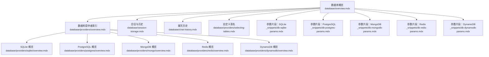
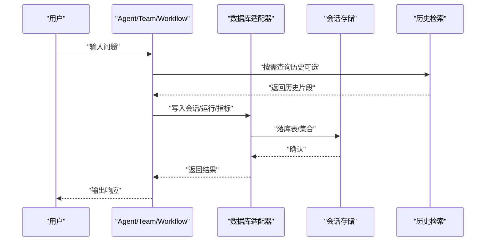
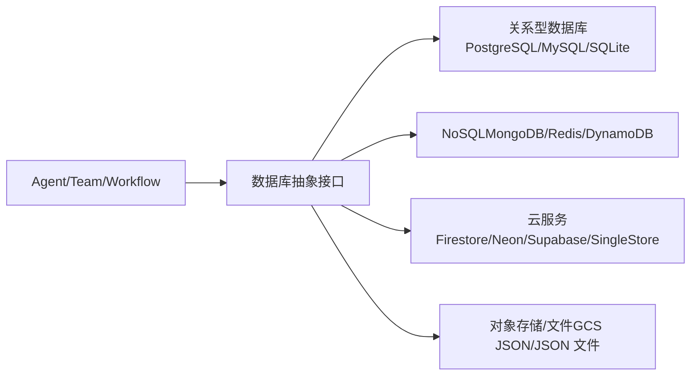

# 数据库集成示例

<cite>
**本文引用的文件**
- [database/overview.mdx](file://database/overview.mdx)
- [database/providers/overview.mdx](file://database/providers/overview.mdx)
- [database/providers/selecting-tables.mdx](file://database/providers/selecting-tables.mdx)
- [database/chat-history.mdx](file://database/chat-history.mdx)
- [database/session-storage.mdx](file://database/session-storage.mdx)
- [database/providers/sqlite/overview.mdx](file://database/providers/sqlite/overview.mdx)
- [database/providers/postgres/overview.mdx](file://database/providers/postgres/overview.mdx)
- [database/providers/mongo/overview.mdx](file://database/providers/mongo/overview.mdx)
- [database/providers/redis/overview.mdx](file://database/providers/redis/overview.mdx)
- [database/providers/dynamodb/overview.mdx](file://database/providers/dynamodb/overview.mdx)
- [_snippets/db-sqlite-params.mdx](file://_snippets/db-sqlite-params.mdx)
- [_snippets/db-postgres-params.mdx](file://_snippets/db-postgres-params.mdx)
- [_snippets/db-mongodb-params.mdx](file://_snippets/db-mongodb-params.mdx)
- [_snippets/db-redis-params.mdx](file://_snippets/db-redis-params.mdx)
- [_snippets/db-dynamodb-params.mdx](file://_snippets/db-dynamodb-params.mdx)
</cite>

## 目录
1. [简介](#简介)
2. [项目结构](#项目结构)
3. [核心组件](#核心组件)
4. [架构总览](#架构总览)
5. [详细组件分析](#详细组件分析)
6. [依赖关系分析](#依赖关系分析)
7. [性能考量](#性能考量)
8. [故障排查指南](#故障排查指南)
9. [结论](#结论)
10. [附录](#附录)

## 简介
本技术文档面向希望在 AgentOS 中集成数据库的工程师与产品团队，系统性介绍如何将 AgentOS 与多种数据库系统对接，覆盖默认数据库（SQLite）、关系型数据库（PostgreSQL、MySQL、SQLite）、云原生数据库（DynamoDB、Firestore、Neon、Supabase、SingleStore）、文档型数据库（MongoDB）、键值/内存数据库（Redis）、对象存储（GCS JSON）以及 JSON 文件数据库等。文档从架构视角出发，结合配置参数、数据模型、使用场景与最佳实践，帮助你快速完成数据库选型与落地。

## 项目结构
围绕数据库能力，仓库提供了“概览”“提供者索引”“会话与历史”“参数说明”等文档与片段，便于按需查阅与复用。

图表来源
- [database/overview.mdx:1-130](file://database/overview.mdx#L1-L130)
- [database/providers/overview.mdx:1-175](file://database/providers/overview.mdx#L1-L175)
- [database/providers/sqlite/overview.mdx:1-24](file://database/providers/sqlite/overview.mdx#L1-L24)
- [database/providers/postgres/overview.mdx:1-42](file://database/providers/postgres/overview.mdx#L1-L42)
- [database/providers/mongo/overview.mdx:1-42](file://database/providers/mongo/overview.mdx#L1-L42)
- [database/providers/redis/overview.mdx:1-35](file://database/providers/redis/overview.mdx#L1-L35)
- [database/providers/dynamodb/overview.mdx:1-29](file://database/providers/dynamodb/overview.mdx#L1-L29)
- [database/session-storage.mdx:1-119](file://database/session-storage.mdx#L1-L119)
- [database/chat-history.mdx:1-159](file://database/chat-history.mdx#L1-L159)
- [database/providers/selecting-tables.mdx:1-37](file://database/providers/selecting-tables.mdx#L1-L37)
- [_snippets/db-sqlite-params.mdx:1-14](file://_snippets/db-sqlite-params.mdx#L1-L14)
- [_snippets/db-postgres-params.mdx:1-14](file://_snippets/db-postgres-params.mdx#L1-L14)
- [_snippets/db-mongodb-params.mdx:1-13](file://_snippets/db-mongodb-params.mdx#L1-L13)
- [_snippets/db-redis-params.mdx:1-14](file://_snippets/db-redis-params.mdx#L1-L14)
- [_snippets/db-dynamodb-params.mdx:1-15](file://_snippets/db-dynamodb-params.mdx#L1-L15)

章节来源
- [database/overview.mdx:1-130](file://database/overview.mdx#L1-L130)
- [database/providers/overview.mdx:1-175](file://database/providers/overview.mdx#L1-L175)

## 核心组件
- 数据库抽象层：通过统一的数据库接口，Agent/Team/Workflow 可透明地使用不同后端（关系型、NoSQL、云服务、对象存储等）。
- 会话与历史：自动持久化会话、运行记录、消息历史；支持跨会话检索与按需加载。
- 表名与集合命名：可自定义会话、记忆、指标、评估、知识、追踪、跨度等表/集合名称，满足多租户或多环境隔离。
- 参数化配置：每类数据库提供参数清单，涵盖连接串、引擎/客户端、模式/库名、表/集合名、前缀与过期策略等。

章节来源
- [database/overview.mdx:20-130](file://database/overview.mdx#L20-L130)
- [database/providers/selecting-tables.mdx:8-37](file://database/providers/selecting-tables.mdx#L8-L37)
- [_snippets/db-sqlite-params.mdx:1-14](file://_snippets/db-sqlite-params.mdx#L1-L14)
- [_snippets/db-postgres-params.mdx:1-14](file://_snippets/db-postgres-params.mdx#L1-L14)
- [_snippets/db-mongodb-params.mdx:1-13](file://_snippets/db-mongodb-params.mdx#L1-L13)
- [_snippets/db-redis-params.mdx:1-14](file://_snippets/db-redis-params.mdx#L1-L14)
- [_snippets/db-dynamodb-params.mdx:1-15](file://_snippets/db-dynamodb-params.mdx#L1-L15)

## 架构总览
AgentOS 将数据库作为“持久化层”，贯穿会话、记忆、指标、评估、知识与追踪等模块。下图展示典型调用链路与数据落盘位置。

图表来源
- [database/overview.mdx:54-104](file://database/overview.mdx#L54-L104)
- [database/session-storage.mdx:30-70](file://database/session-storage.mdx#L30-L70)
- [database/chat-history.mdx:96-111](file://database/chat-history.mdx#L96-L111)

## 详细组件分析

### 通用配置与数据模型
- 会话表字段（关系型）：包含会话标识、类型、关联实体（Agent/Team/Workflow）、用户标识、会话数据、元数据、运行列表、摘要、时间戳等。
- 支持的表/集合：会话、记忆、指标、评估、知识、追踪、跨度。
- 自定义命名：可通过参数指定各表/集合名称，实现多租户或环境隔离。

章节来源
- [database/session-storage.mdx:30-70](file://database/session-storage.mdx#L30-L70)
- [database/providers/selecting-tables.mdx:8-37](file://database/providers/selecting-tables.mdx#L8-L37)
- [_snippets/db-sqlite-params.mdx:7-14](file://_snippets/db-sqlite-params.mdx#L7-L14)
- [_snippets/db-postgres-params.mdx:7-14](file://_snippets/db-postgres-params.mdx#L7-L14)
- [_snippets/db-mongodb-params.mdx:7-13](file://_snippets/db-mongodb-params.mdx#L7-L13)
- [_snippets/db-redis-params.mdx:8-14](file://_snippets/db-redis-params.mdx#L8-L14)
- [_snippets/db-dynamodb-params.mdx:8-15](file://_snippets/db-dynamodb-params.mdx#L8-L15)

### SQLite（开发首选）
- 使用场景：本地开发、轻量级部署、原型验证。
- 连接方式：通过文件路径或连接串初始化数据库实例。
- 关键参数：数据库文件、会话/记忆/指标/评估/知识/追踪/跨度表名。
- 最佳实践：开发环境优先使用 SQLite；生产迁移时注意并发与备份策略。

章节来源
- [database/providers/sqlite/overview.mdx:9-24](file://database/providers/sqlite/overview.mdx#L9-L24)
- [_snippets/db-sqlite-params.mdx:1-14](file://_snippets/db-sqlite-params.mdx#L1-L14)

### PostgreSQL（生产首选）
- 使用场景：高可用、强一致、复杂查询与扩展（如向量扩展）。
- 连接方式：使用标准连接串；可配合向量扩展（如 PgVector）。
- 关键参数：连接串、Schema、会话/记忆/指标/评估/知识/追踪/跨度表名。
- 最佳实践：生产环境建议使用托管服务或容器编排；启用备份与只读副本；合理设计索引与分区。

章节来源
- [database/providers/postgres/overview.mdx:9-42](file://database/providers/postgres/overview.mdx#L9-L42)
- [_snippets/db-postgres-params.mdx:1-14](file://_snippets/db-postgres-params.mdx#L1-L14)

### MongoDB（文档型）
- 使用场景：灵活模式、半结构化数据、快速迭代。
- 连接方式：通过连接串或客户端初始化。
- 关键参数：客户端/连接串、数据库名、会话/记忆/指标/评估/知识/追踪/跨度集合。
- 最佳实践：生产环境开启认证与网络隔离；合理设置集合分片与索引；定期清理与归档。

章节来源
- [database/providers/mongo/overview.mdx:13-42](file://database/providers/mongo/overview.mdx#L13-L42)
- [_snippets/db-mongodb-params.mdx:1-13](file://_snippets/db-mongodb-params.mdx#L1-L13)

### Redis（内存键值）
- 使用场景：缓存、会话短生命周期、高并发读写。
- 连接方式：通过连接串初始化客户端；支持密钥前缀与过期策略。
- 关键参数：连接串、前缀、TTL、会话/记忆/指标/评估/知识/追踪/跨度表名。
- 最佳实践：合理设置过期时间与淘汰策略；区分业务键空间；监控内存与命中率。

章节来源
- [database/providers/redis/overview.mdx:9-35](file://database/providers/redis/overview.mdx#L9-L35)
- [_snippets/db-redis-params.mdx:1-14](file://_snippets/db-redis-params.mdx#L1-L14)

### DynamoDB（云原生 NoSQL）
- 使用场景：无服务器、弹性伸缩、全球分布。
- 连接方式：通过 AWS 凭证初始化客户端；支持区域与凭据配置。
- 关键参数：区域、访问密钥、会话/记忆/指标/评估/知识/追踪/跨度表名。
- 最佳实践：使用 IAM 最小权限；启用加密与备份；合理设计主键与索引。

章节来源
- [database/providers/dynamodb/overview.mdx:9-29](file://database/providers/dynamodb/overview.mdx#L9-L29)
- [_snippets/db-dynamodb-params.mdx:1-15](file://_snippets/db-dynamodb-params.mdx#L1-L15)

### 其他数据库与存储
- Firestore：Google Cloud 文档型数据库，适合与 GCP 生态集成。
- Neon/Supabase/SingleStore：云原生或分布式数据库，适合高并发与弹性需求。
- GCS JSON：对象存储 + JSON 结构，适合日志与离线分析。
- JSON 数据库：文件系统上的 JSON 存储，适合极简场景。
- MySQL/Async MySQL、Async PostgreSQL、Async SQLite：异步版本，适用于高性能/高并发应用。

章节来源
- [database/providers/overview.mdx:10-175](file://database/providers/overview.mdx#L10-L175)

### 聊天历史与会话控制
- 启用历史：在 Agent/Team/Workflow 中开启历史注入，并限制历史轮次与消息数量。
- 按需检索：通过工具函数按需获取历史，避免每次请求携带大量上下文。
- 跨会话检索：限定搜索范围，防止上下文窗口溢出。
- 程序化访问：直接获取会话、消息与上次运行输出，用于 UI 或审计。

章节来源
- [database/chat-history.mdx:9-159](file://database/chat-history.mdx#L9-L159)
- [database/session-storage.mdx:52-119](file://database/session-storage.mdx#L52-L119)

## 依赖关系分析
- 组件耦合：Agent/Team/Workflow 仅依赖数据库抽象接口，不直接感知具体后端。
- 外部依赖：关系型数据库依赖 SQLAlchemy 引擎；MongoDB 依赖 PyMongo 客户端；Redis 依赖 redis 库；DynamoDB 依赖 boto3。
- 配置契约：所有数据库提供者均支持自定义表/集合名与基础参数，降低迁移成本。

图表来源
- [database/overview.mdx:91-107](file://database/overview.mdx#L91-L107)
- [database/providers/overview.mdx:10-175](file://database/providers/overview.mdx#L10-L175)

## 性能考量
- 上下文大小控制：通过限制历史轮次与消息数，平衡上下文长度与延迟。
- 异步数据库：在高并发场景优先选用异步版本，减少阻塞。
- 缓存与索引：Redis 作为热数据缓存；关系型数据库建立必要索引；MongoDB 合理设计集合与索引。
- 扩展与弹性：DynamoDB/Neon/Supabase/SingleStore 提供弹性伸缩能力，适合流量波动场景。
- 数据归档：对历史与追踪进行周期性归档，降低在线库压力。

## 故障排查指南
- 异步/同步不匹配：若使用同步引擎却调用异步数据库类，或反之，将触发异常。请确保引擎与数据库类匹配。
- 权限与凭证：DynamoDB 需要正确的 AWS 区域与凭据；云服务数据库需检查网络与安全组。
- 连接超时与并发：高并发场景建议使用连接池与重试策略；对 Redis 设置合理的超时与过期。

章节来源
- [database/overview.mdx:122-130](file://database/overview.mdx#L122-L130)
- [database/providers/dynamodb/overview.mdx:11-25](file://database/providers/dynamodb/overview.mdx#L11-L25)

## 结论
- 开发阶段：优先使用 SQLite，快速验证功能与数据模型。
- 生产阶段：推荐 PostgreSQL（可选向量扩展），兼顾一致性与扩展性；高并发场景可考虑 Neon/Supabase/SingleStore。
- 云原生：DynamoDB/Cloud Firestore 适合弹性与全球分布；GCS JSON/JSON 文件适合日志与离线分析。
- 最佳实践：统一抽象接口、参数化配置、自定义表/集合名、严格的历史与上下文控制、完善的监控与备份。

## 附录

### 数据库参数对照表（节选）
- SQLite：支持数据库文件/URL、会话/记忆/指标/评估/知识/追踪/跨度表名等。
- PostgreSQL：支持连接串、Schema、会话/记忆/指标/评估/知识/追踪/跨度表名等。
- MongoDB：支持客户端/连接串、库名、会话/记忆/指标/评估/知识/追踪/跨度集合等。
- Redis：支持连接串、前缀、TTL、会话/记忆/指标/评估/知识/追踪/跨度表名等。
- DynamoDB：支持区域、访问密钥、会话/记忆/指标/评估/知识/追踪/跨度表名等。

章节来源
- [_snippets/db-sqlite-params.mdx:1-14](file://_snippets/db-sqlite-params.mdx#L1-L14)
- [_snippets/db-postgres-params.mdx:1-14](file://_snippets/db-postgres-params.mdx#L1-L14)
- [_snippets/db-mongodb-params.mdx:1-13](file://_snippets/db-mongodb-params.mdx#L1-L13)
- [_snippets/db-redis-params.mdx:1-14](file://_snippets/db-redis-params.mdx#L1-L14)
- [_snippets/db-dynamodb-params.mdx:1-15](file://_snippets/db-dynamodb-params.mdx#L1-L15)