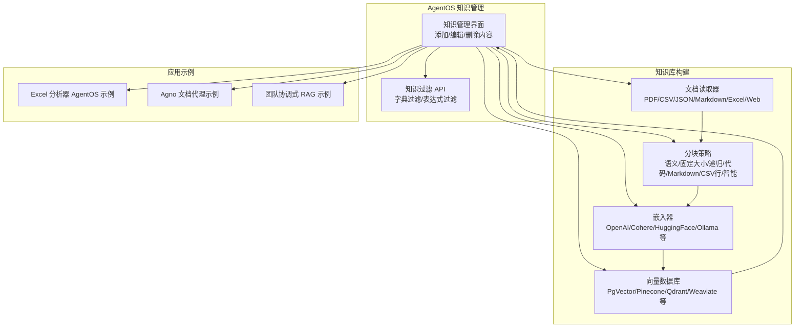
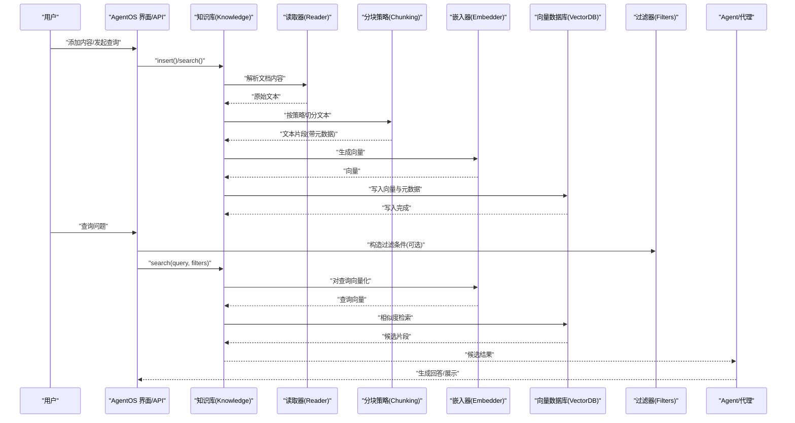
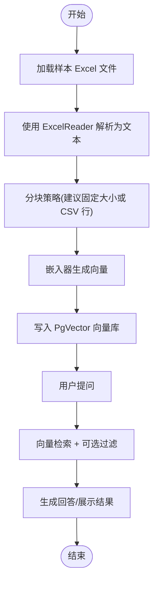
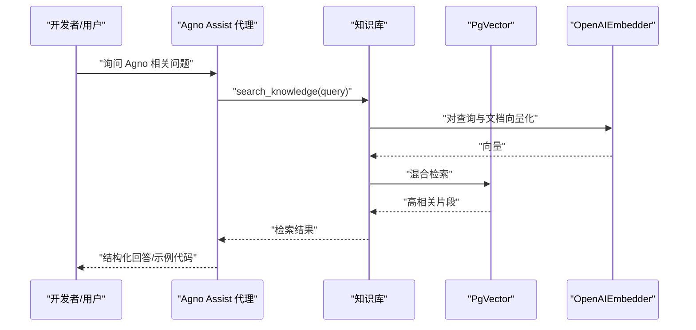
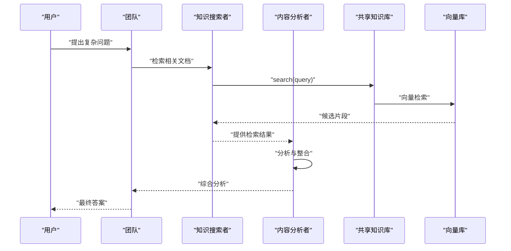
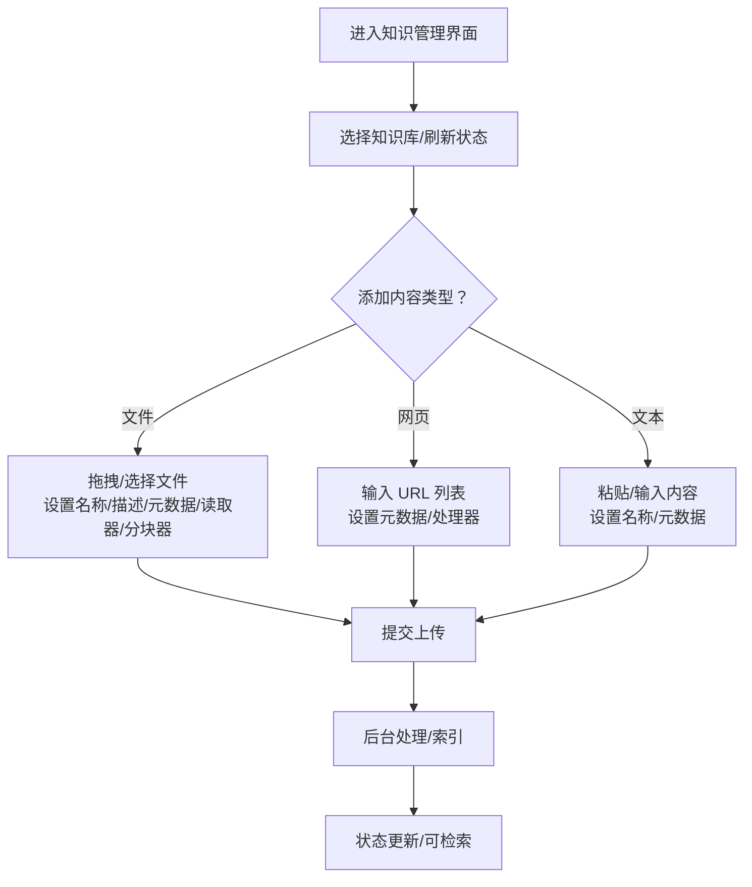
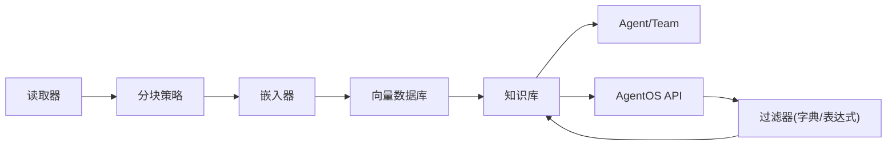

# 知识管理示例

<cite>
**本文引用的文件**
- [agentos/features/knowledge-management.mdx](file://agent-os/features/knowledge-management.mdx)
- [agent-os/knowledge/manage-knowledge.mdx](file://agent-os/knowledge/manage-knowledge.mdx)
- [agent-os/knowledge/filter-knowledge.mdx](file://agent-os/knowledge/filter-knowledge.mdx)
- [cookbook/knowledge/overview.mdx](file://cookbook/knowledge/overview.mdx)
- [cookbook/knowledge/readers.mdx](file://cookbook/knowledge/readers.mdx)
- [cookbook/knowledge/embedders.mdx](file://cookbook/knowledge/embedders.mdx)
- [cookbook/knowledge/vector-databases.mdx](file://cookbook/knowledge/vector-databases.mdx)
- [cookbook/knowledge/chunking.mdx](file://cookbook/knowledge/chunking.mdx)
- [examples/agent-os/knowledge/agentos-excel-analyst.mdx](file://examples/agent-os/knowledge/agentos-excel-analyst.mdx)
- [examples/agent-os/knowledge/agno-docs-agent.mdx](file://examples/agent-os/knowledge/agno-docs-agent.mdx)
- [examples/teams/search-coordination/coordinated-agentic-rag.mdx](file://examples/teams/search-coordination/coordinated-agentic-rag.mdx)
- [knowledge/teams/coordinated-agentic-rag.mdx](file://knowledge/teams/coordinated-agentic-rag.mdx)
</cite>

## 目录
1. [简介](#简介)
2. [项目结构](#项目结构)
3. [核心组件](#核心组件)
4. [架构总览](#架构总览)
5. [详细组件分析](#详细组件分析)
6. [依赖关系分析](#依赖关系分析)
7. [性能考虑](#性能考虑)
8. [故障排查指南](#故障排查指南)
9. [结论](#结论)
10. [附录](#附录)

## 简介
本技术文档围绕 AgentOS 的知识管理示例展开，系统性介绍如何在 AgentOS 中实现知识管理功能，覆盖 Excel 分析器、AgentOS 知识库与 Agno 文档代理三大主题。文档深入解释知识库的构建、维护与检索机制，包括文档解析、分块策略、向量化处理、知识检索与结果重排，并提供可直接参考的实现路径与配置方法，帮助读者快速搭建智能知识问答系统与文档分析工具。

## 项目结构
本仓库以“知识与 RAG”为核心主题，提供了从概念到实践的完整资料：包括知识库基础、文档读取器、嵌入器、向量数据库、分块策略等 Cookbook 示例；以及在 AgentOS 控制平面中进行知识管理与过滤的使用指南；最后通过 Excel 分析器与 Agno 文档代理两个实战示例，展示端到端的知识问答与文档分析能力。

图表来源
- [agentos/features/knowledge-management.mdx:1-78](file://agentos/features/knowledge-management.mdx#L1-L78)
- [agent-os/knowledge/filter-knowledge.mdx:1-310](file://agent-os/knowledge/filter-knowledge.mdx#L1-L310)
- [cookbook/knowledge/readers.mdx:1-219](file://cookbook/knowledge/readers.mdx#L1-L219)
- [cookbook/knowledge/chunking.mdx:1-217](file://cookbook/knowledge/chunking.mdx#L1-L217)
- [cookbook/knowledge/embedders.mdx:1-203](file://cookbook/knowledge/embedders.mdx#L1-L203)
- [cookbook/knowledge/vector-databases.mdx:1-227](file://cookbook/knowledge/vector-databases.mdx#L1-L227)
- [examples/agent-os/knowledge/agentos-excel-analyst.mdx:1-104](file://examples/agent-os/knowledge/agentos-excel-analyst.mdx#L1-L104)
- [examples/agent-os/knowledge/agno-docs-agent.mdx:1-171](file://examples/agent-os/knowledge/agno-docs-agent.mdx#L1-L171)
- [examples/teams/search-coordination/coordinated-agentic-rag.mdx:34-65](file://examples/teams/search-coordination/coordinated-agentic-rag.mdx#L34-L65)
- [knowledge/teams/coordinated-agentic-rag.mdx:34-62](file://knowledge/teams/coordinated-agentic-rag.mdx#L34-L62)

章节来源
- [agentos/features/knowledge-management.mdx:1-78](file://agentos/features/knowledge-management.mdx#L1-L78)
- [cookbook/knowledge/overview.mdx:1-129](file://cookbook/knowledge/overview.mdx#L1-L129)

## 核心组件
- 知识库（Knowledge）：统一的知识存储与检索抽象，负责内容入库、索引与查询。
- 文档读取器（Readers）：支持 PDF、CSV、JSON、Markdown、Excel、网页等多种格式的文本抽取。
- 分块策略（Chunking）：将长文档按语义或规则切分为适合嵌入的小片段。
- 嵌入器（Embedders）：将文本转换为向量，用于相似度检索。
- 向量数据库（VectorDB）：持久化向量并提供高效检索，如 PgVector、Pinecone、Qdrant 等。
- 过滤器（Filters）：通过字典或表达式对检索范围进行精确控制。
- 应用示例：Excel 分析器 AgentOS 示例、Agno 文档代理示例、团队协调式 RAG 示例。

章节来源
- [cookbook/knowledge/readers.mdx:1-219](file://cookbook/knowledge/readers.mdx#L1-L219)
- [cookbook/knowledge/chunking.mdx:1-217](file://cookbook/knowledge/chunking.mdx#L1-L217)
- [cookbook/knowledge/embedders.mdx:1-203](file://cookbook/knowledge/embedders.mdx#L1-L203)
- [cookbook/knowledge/vector-databases.mdx:1-227](file://cookbook/knowledge/vector-databases.mdx#L1-L227)
- [agent-os/knowledge/filter-knowledge.mdx:1-310](file://agent-os/knowledge/filter-knowledge.mdx#L1-L310)

## 架构总览
下图展示了从“内容入库”到“智能问答”的端到端流程：内容经由读取器解析后，按分块策略切分，再由嵌入器生成向量，写入向量数据库；查询时，用户输入被嵌入并与向量库进行相似度匹配，必要时结合过滤条件与重排器进行结果优化，最终返回给 Agent 或前端界面。

图表来源
- [cookbook/knowledge/readers.mdx:1-219](file://cookbook/knowledge/readers.mdx#L1-L219)
- [cookbook/knowledge/chunking.mdx:1-217](file://cookbook/knowledge/chunking.mdx#L1-L217)
- [cookbook/knowledge/embedders.mdx:1-203](file://cookbook/knowledge/embedders.mdx#L1-L203)
- [cookbook/knowledge/vector-databases.mdx:1-227](file://cookbook/knowledge/vector-databases.mdx#L1-L227)
- [agent-os/knowledge/filter-knowledge.mdx:1-310](file://agent-os/knowledge/filter-knowledge.mdx#L1-L310)

## 详细组件分析

### Excel 分析器（AgentOS 示例）
该示例演示如何将 Excel 数据接入知识库，并通过 Agent 实现数据查询与分析。其关键点包括：
- 使用 PostgresDb 作为内容存储，确保 UI 可见与状态同步。
- 使用 PgVector 存储向量，支持混合检索。
- 通过 ExcelReader 将表格数据解析为文本片段，结合分块策略与嵌入器生成向量。
- 创建 Agent 并启用搜索知识库能力，实现基于知识的问答。

图表来源
- [examples/agent-os/knowledge/agentos-excel-analyst.mdx:1-104](file://examples/agent-os/knowledge/agentos-excel-analyst.mdx#L1-L104)
- [cookbook/knowledge/readers.mdx:1-219](file://cookbook/knowledge/readers.mdx#L1-L219)
- [cookbook/knowledge/chunking.mdx:1-217](file://cookbook/knowledge/chunking.mdx#L1-L217)
- [cookbook/knowledge/embedders.mdx:1-203](file://cookbook/knowledge/embedders.mdx#L1-L203)
- [cookbook/knowledge/vector-databases.mdx:1-227](file://cookbook/knowledge/vector-databases.mdx#L1-L227)

章节来源
- [examples/agent-os/knowledge/agentos-excel-analyst.mdx:1-104](file://examples/agent-os/knowledge/agentos-excel-analyst.mdx#L1-L104)

### Agno 文档代理（AgentOS 示例）
该示例构建一个专门解答 Agno 框架问题的智能代理，涵盖：
- 使用 PostgresDb 与 PgVector 组成知识库，开启混合检索。
- 通过 OpenAIEmbedder 生成向量，提升检索质量。
- 在 Agent 中启用知识搜索与上下文增强，结合历史与时间信息，提供更准确的回答。
- 提供运行脚本与本地服务启动方式，便于测试与集成。

图表来源
- [examples/agent-os/knowledge/agno-docs-agent.mdx:1-171](file://examples/agent-os/knowledge/agno-docs-agent.mdx#L1-L171)
- [cookbook/knowledge/embedders.mdx:1-203](file://cookbook/knowledge/embedders.mdx#L1-L203)
- [cookbook/knowledge/vector-databases.mdx:1-227](file://cookbook/knowledge/vector-databases.mdx#L1-L227)

章节来源
- [examples/agent-os/knowledge/agno-docs-agent.mdx:1-171](file://examples/agent-os/knowledge/agno-docs-agent.mdx#L1-L171)

### 团队协调式 RAG（多 Agent 协作）
该示例展示团队内多个 Agent 如何协作完成“检索—分析—合成”的任务链：
- 共享同一知识库，支持混合检索与重排。
- 知识搜索者负责全面检索，内容分析者负责提炼与整合。
- 通过 AgentOS 配置与运行，实现端到端的协同问答。

图表来源
- [examples/teams/search-coordination/coordinated-agentic-rag.mdx:34-65](file://examples/teams/search-coordination/coordinated-agentic-rag.mdx#L34-L65)
- [knowledge/teams/coordinated-agentic-rag.mdx:34-62](file://knowledge/teams/coordinated-agentic-rag.mdx#L34-L62)

章节来源
- [examples/teams/search-coordination/coordinated-agentic-rag.mdx:34-65](file://examples/teams/search-coordination/coordinated-agentic-rag.mdx#L34-L65)
- [knowledge/teams/coordinated-agentic-rag.mdx:34-62](file://knowledge/teams/coordinated-agentic-rag.mdx#L34-L62)

### AgentOS 知识管理界面与 API
- 界面支持上传文件、添加网页与粘贴文本，自动识别处理选项并显示处理状态。
- 支持在 AgentOS 控制平面中管理多个知识库，统一接入不同 Agent 与 Team。
- 通过 API 的字典过滤与表达式过滤，实现灵活的内容筛选与检索控制。

图表来源
- [agentos/features/knowledge-management.mdx:1-78](file://agentos/features/knowledge-management.mdx#L1-L78)

章节来源
- [agentos/features/knowledge-management.mdx:1-78](file://agentos/features/knowledge-management.mdx#L1-L78)
- [agent-os/knowledge/manage-knowledge.mdx:1-129](file://agent-os/knowledge/manage-knowledge.mdx#L1-L129)
- [agent-os/knowledge/filter-knowledge.mdx:1-310](file://agent-os/knowledge/filter-knowledge.mdx#L1-L310)

## 依赖关系分析
- 知识库依赖：读取器负责内容抽取，分块策略决定切分粒度，嵌入器负责向量化，向量数据库负责持久化与检索。
- AgentOS 层：通过统一的 Knowledge 抽象屏蔽底层差异，支持多知识库复用与跨 Agent/Team 共享。
- 过滤层：API 支持字典过滤与表达式过滤，满足复杂查询场景。

图表来源
- [cookbook/knowledge/readers.mdx:1-219](file://cookbook/knowledge/readers.mdx#L1-L219)
- [cookbook/knowledge/chunking.mdx:1-217](file://cookbook/knowledge/chunking.mdx#L1-L217)
- [cookbook/knowledge/embedders.mdx:1-203](file://cookbook/knowledge/embedders.mdx#L1-L203)
- [cookbook/knowledge/vector-databases.mdx:1-227](file://cookbook/knowledge/vector-databases.mdx#L1-L227)
- [agent-os/knowledge/filter-knowledge.mdx:1-310](file://agent-os/knowledge/filter-knowledge.mdx#L1-L310)

章节来源
- [cookbook/knowledge/overview.mdx:1-129](file://cookbook/knowledge/overview.mdx#L1-L129)

## 性能考虑
- 向量维度与检索类型：根据业务规模与延迟要求选择合适的嵌入模型与向量数据库；混合检索通常能提升准确性但可能增加计算开销。
- 批量嵌入：对大批量文本采用批量嵌入可显著降低调用次数与网络开销。
- 分块策略：过小的块会增加向量数量与存储成本，过大则影响检索精度；应结合文档结构与查询模式选择合适策略。
- 过滤与重排：在检索前使用过滤缩小候选集，必要时引入重排器提升排序质量。
- 存储与索引：合理设计表名与索引，避免冲突并提高检索效率。

## 故障排查指南
- 知识库未出现在界面：确认已将知识库实例加入 AgentOS 的知识列表，并正确配置内容数据库。
- 数据库连接错误：检查数据库连接字符串与可达性，确保所需驱动与权限已配置。
- 搜索不到内容：验证向量表中是否已有嵌入记录，确认嵌入器与向量数据库配置一致。
- 过滤无效：检查过滤 JSON 结构与字段类型，确保序列化正确且服务器日志无异常。

章节来源
- [agent-os/knowledge/manage-knowledge.mdx:113-129](file://agent-os/knowledge/manage-knowledge.mdx#L113-L129)
- [agent-os/knowledge/filter-knowledge.mdx:223-246](file://agent-os/knowledge/filter-knowledge.mdx#L223-L246)

## 结论
通过本技术文档，读者可以系统掌握在 AgentOS 中构建与维护知识库的方法，理解从文档解析、分块、向量化到检索与结果优化的完整流程，并能够基于 Excel 分析器与 Agno 文档代理两个示例快速落地智能问答与文档分析应用。配合团队协作与 API 过滤能力，可进一步扩展至复杂场景与多 Agent 协同。

## 附录
- 快速开始：参考知识与 RAG 概览中的示例，快速上手知识库构建与检索。
- 多源内容：支持从本地路径、URL、主题等多种来源添加内容。
- 异步操作：提供异步插入与检索接口，适用于大规模内容处理。
- 运行示例：包含多个可直接运行的脚本与命令，便于本地调试与部署。

章节来源
- [cookbook/knowledge/overview.mdx:1-129](file://cookbook/knowledge/overview.mdx#L1-L129)