# 调度管理示例

<cite>
**本文引用的文件**
- [agent-os/scheduler/overview.mdx](file://agent-os/scheduler/overview.mdx)
- [scheduler/overview.mdx](file://scheduler/overview.mdx)
- [examples/agent-os/scheduler/overview.mdx](file://examples/agent-os/scheduler/overview.mdx)
- [examples/agent-os/scheduler/basic-schedule.mdx](file://examples/agent-os/scheduler/basic-schedule.mdx)
- [examples/agent-os/scheduler/schedule-management.mdx](file://examples/agent-os/scheduler/schedule-management.mdx)
- [examples/agent-os/scheduler/async-schedule.mdx](file://examples/agent-os/scheduler/async-schedule.mdx)
- [examples/agent-os/scheduler/multi-agent-schedules.mdx](file://examples/agent-os/scheduler/multi-agent-schedules.mdx)
- [examples/agent-os/scheduler/rest-api-schedules.mdx](file://examples/agent-os/scheduler/rest-api-schedules.mdx)
- [examples/agent-os/scheduler/run-history.mdx](file://examples/agent-os/scheduler/run-history.mdx)
- [examples/agent-os/scheduler/schedule-validation.mdx](file://examples/agent-os/scheduler/schedule-validation.mdx)
- [examples/agent-os/scheduler/scheduler-with-agentos.mdx](file://examples/agent-os/scheduler/scheduler-with-agentos.mdx)
- [examples/agent-os/scheduler/team-workflow-schedules.mdx](file://examples/agent-os/scheduler/team-workflow-schedules.mdx)
</cite>

## 目录
1. [简介](#简介)
2. [项目结构](#项目结构)
3. [核心组件](#核心组件)
4. [架构总览](#架构总览)
5. [详细组件分析](#详细组件分析)
6. [依赖关系分析](#依赖关系分析)
7. [性能考量](#性能考量)
8. [故障排查指南](#故障排查指南)
9. [结论](#结论)
10. [附录](#附录)

## 简介
本技术文档围绕 AgentOS 的调度管理示例，系统讲解如何在 AgentOS 中实现任务调度与时间管理，覆盖基础调度、异步调度、多代理调度、REST API 调度、调度历史、调度管理与调度验证等主题。文档从概念到实践，结合多个示例文件，帮助读者快速掌握如何在 AgentOS 中创建、管理、执行并监控周期性任务与复杂时间安排。

## 项目结构
与调度相关的内容主要分布在以下位置：
- 概念与安装：agent-os/scheduler/overview.mdx、scheduler/overview.mdx
- 示例索引：examples/agent-os/scheduler/overview.mdx
- 典型示例：basic-schedule、schedule-management、async-schedule、multi-agent-schedules、rest-api-schedules、run-history、schedule-validation、scheduler-with-agentos、team-workflow-schedules

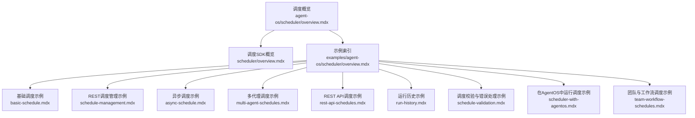

图表来源
- [examples/agent-os/scheduler/overview.mdx:1-18](file://examples/agent-os/scheduler/overview.mdx#L1-L18)

章节来源
- [examples/agent-os/scheduler/overview.mdx:1-18](file://examples/agent-os/scheduler/overview.mdx#L1-L18)

## 核心组件
- ScheduleManager（调度管理器）：提供创建、查询、更新、启用/禁用、删除、触发以及运行历史查询等能力；支持同步与异步接口。
- SchedulePoller（调度轮询器）：按固定间隔轮询数据库，发现到期的计划任务并并发执行。
- ScheduleExecutor（调度执行器）：负责调用目标端点（如 /agents/{id}/runs），处理重试与超时，并记录每次运行的详细状态。
- Scheduler API（调度REST接口）：提供对调度生命周期与手动触发的完整REST操作，便于外部系统集成与UI控制台管理。

章节来源
- [scheduler/overview.mdx:80-88](file://scheduler/overview.mdx#L80-L88)
- [agent-os/scheduler/overview.mdx:83-96](file://agent-os/scheduler/overview.mdx#L83-L96)

## 架构总览
下图展示了 AgentOS 调度子系统的高层交互：应用启动后注册调度REST端点，启动轮询器自动发现到期任务，执行器调用目标端点并写入运行记录，同时提供REST API用于管理与查看。

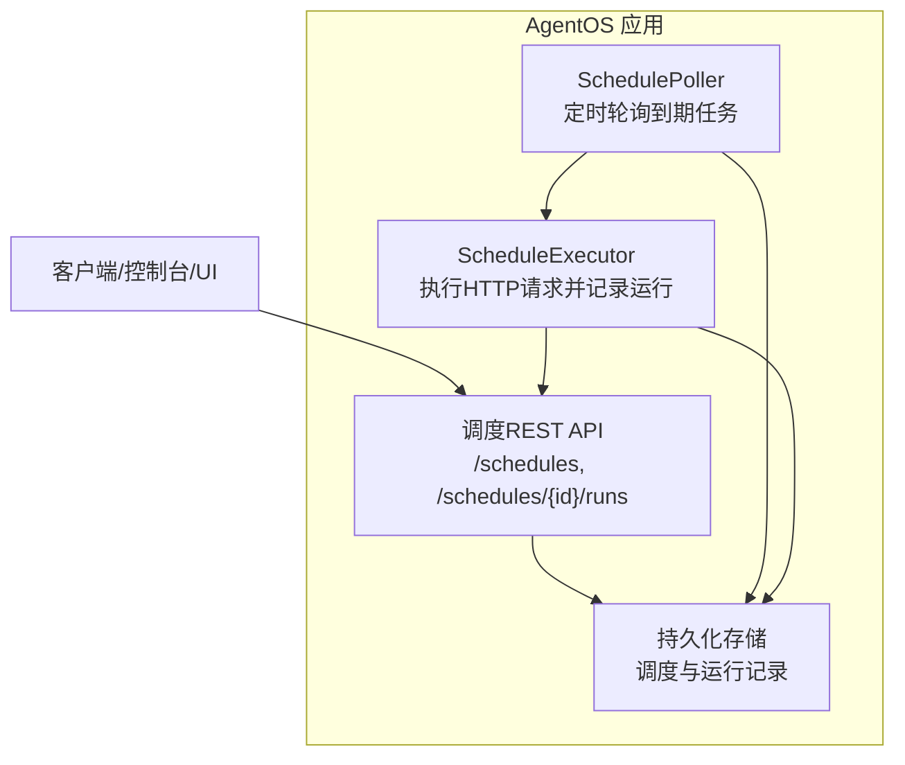

图表来源
- [scheduler/overview.mdx:80-88](file://scheduler/overview.mdx#L80-L88)
- [agent-os/scheduler/overview.mdx:83-96](file://agent-os/scheduler/overview.mdx#L83-L96)

## 详细组件分析

### 基础调度（启动AgentOS并创建周期任务）
- 目标：在 AgentOS 中启用调度器，通过REST API创建周期性任务，定期触发某个代理执行。
- 关键点：
  - 在 AgentOS 初始化时开启调度器与轮询间隔。
  - 使用 REST API 创建调度，指定 cron 表达式、目标端点、负载与时区等。
  - 通过控制面板或API查看运行历史与状态。

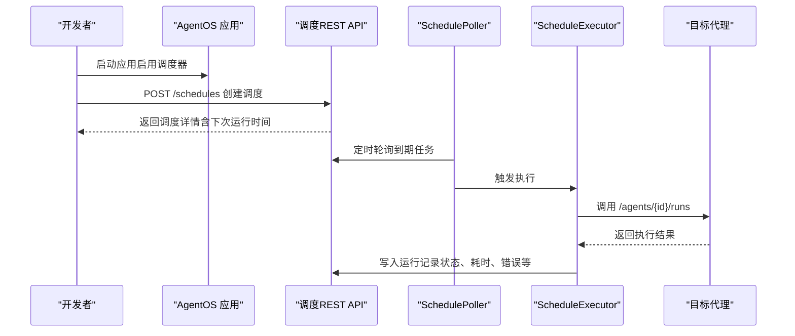

图表来源
- [examples/agent-os/scheduler/basic-schedule.mdx:56-61](file://examples/agent-os/scheduler/basic-schedule.mdx#L56-L61)
- [agent-os/scheduler/overview.mdx:39-52](file://agent-os/scheduler/overview.mdx#L39-L52)

章节来源
- [examples/agent-os/scheduler/basic-schedule.mdx:1-88](file://examples/agent-os/scheduler/basic-schedule.mdx#L1-L88)
- [agent-os/scheduler/overview.mdx:35-52](file://agent-os/scheduler/overview.mdx#L35-L52)

### 异步调度（异步CRUD与控制台展示）
- 目标：演示使用异步 ScheduleManager 接口进行调度的创建、查询、更新、删除、启用/禁用与运行历史查询，并通过 SchedulerConsole 进行富文本展示。
- 关键点：
  - 异步接口：acreate、alist、aget、aupdate、adelete、aenable、adisable、aget_runs。
  - 控制台展示：SchedulerConsole 提供表格化输出，便于运维与调试。

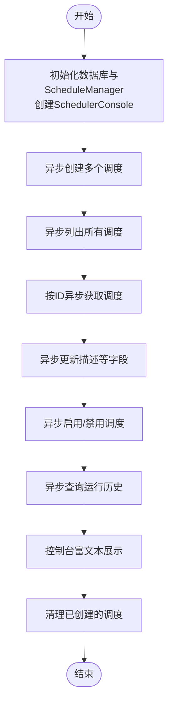

图表来源
- [examples/agent-os/scheduler/async-schedule.mdx:24-85](file://examples/agent-os/scheduler/async-schedule.mdx#L24-L85)

章节来源
- [examples/agent-os/scheduler/async-schedule.mdx:1-100](file://examples/agent-os/scheduler/async-schedule.mdx#L1-L100)

### 多代理调度（不同cron、时区、负载与重试）
- 目标：在同一系统中为多个代理分别配置不同的调度策略，包括时区、负载、重试次数与超时等。
- 关键点：
  - 不同代理可拥有不同的 cron 表达式与时区，以满足业务时间要求。
  - 通过 SchedulerConsole 展示全部、仅启用或仅禁用的视图，便于运维管理。

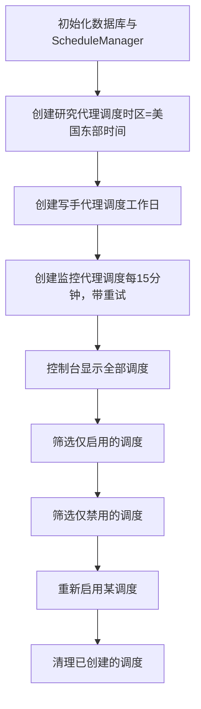

图表来源
- [examples/agent-os/scheduler/multi-agent-schedules.mdx:34-121](file://examples/agent-os/scheduler/multi-agent-schedules.mdx#L34-L121)

章节来源
- [examples/agent-os/scheduler/multi-agent-schedules.mdx:1-135](file://examples/agent-os/scheduler/multi-agent-schedules.mdx#L1-L135)

### REST API 调度（完整的生命周期管理）
- 目标：通过 REST API 完整演示调度的创建、列表、查询、更新、启用/禁用、手动触发、查看运行历史与删除。
- 关键点：
  - 支持 GET/POST/PUT/PATCH/DELETE 方法。
  - 手动触发返回 200 或在执行器未就绪时返回 503。
  - 运行历史支持分页查询。

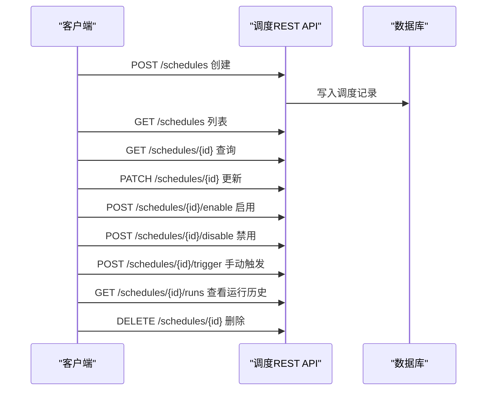

图表来源
- [examples/agent-os/scheduler/rest-api-schedules.mdx:35-167](file://examples/agent-os/scheduler/rest-api-schedules.mdx#L35-L167)
- [agent-os/scheduler/overview.mdx:85-96](file://agent-os/scheduler/overview.mdx#L85-L96)

章节来源
- [examples/agent-os/scheduler/rest-api-schedules.mdx:1-182](file://examples/agent-os/scheduler/rest-api-schedules.mdx#L1-L182)
- [agent-os/scheduler/overview.mdx:83-96](file://agent-os/scheduler/overview.mdx#L83-L96)

### 调度历史（运行记录与分页查询）
- 目标：演示如何创建调度并模拟运行记录，使用 SchedulerConsole 富文本展示运行历史，以及程序化查询与分页。
- 关键点：
  - 运行记录包含状态、尝试次数、触发与完成时间、错误信息等。
  - 支持分页参数 limit/offset 获取历史。

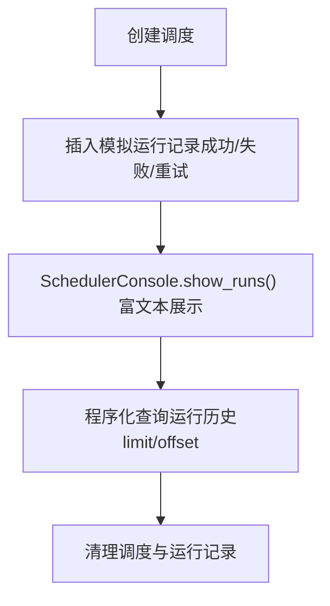

图表来源
- [examples/agent-os/scheduler/run-history.mdx:32-124](file://examples/agent-os/scheduler/run-history.mdx#L32-L124)

章节来源
- [examples/agent-os/scheduler/run-history.mdx:1-138](file://examples/agent-os/scheduler/run-history.mdx#L1-L138)

### 调度验证与错误处理（cron、时区、重复名与方法规范化）
- 目标：演示无效 cron、无效时区、重复名称、复杂 cron 模式与方法大小写规范化等场景下的错误处理。
- 关键点：
  - 非法输入会抛出异常或返回 422。
  - 支持复杂 cron 表达式（范围、步长、列表）。
  - HTTP 方法会被自动转为大写。

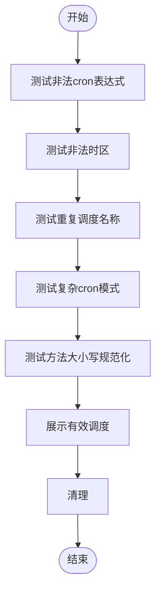

图表来源
- [examples/agent-os/scheduler/schedule-validation.mdx:31-101](file://examples/agent-os/scheduler/schedule-validation.mdx#L31-L101)

章节来源
- [examples/agent-os/scheduler/schedule-validation.mdx:1-116](file://examples/agent-os/scheduler/schedule-validation.mdx#L1-L116)

### 在 AgentOS 中运行调度（自动轮询与服务令牌）
- 目标：在 AgentOS 中启用调度器，自动启动轮询器并在应用关闭时停止；通过 REST API 创建调度，内部使用服务令牌进行调度器与代理之间的认证。
- 关键点：
  - scheduler=True 开启调度与轮询。
  - 默认轮询间隔为 15 秒，可通过 scheduler_poll_interval 调整。
  - 内部服务令牌由 AgentOS 自动生成，用于调度器访问受保护的代理端点。

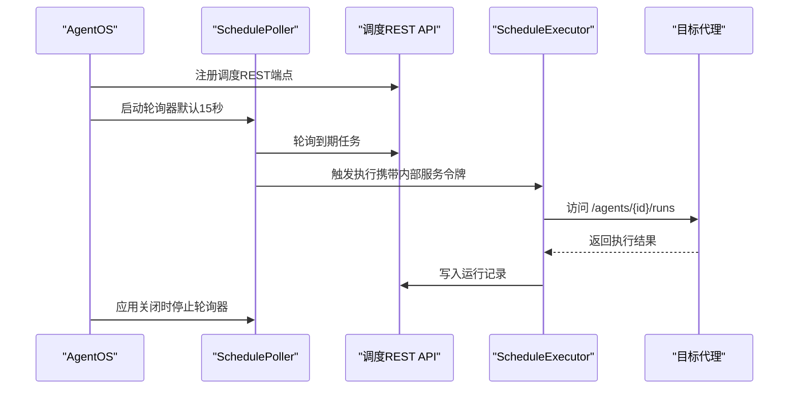

图表来源
- [examples/agent-os/scheduler/scheduler-with-agentos.mdx:48-74](file://examples/agent-os/scheduler/scheduler-with-agentos.mdx#L48-L74)

章节来源
- [examples/agent-os/scheduler/scheduler-with-agentos.mdx:1-89](file://examples/agent-os/scheduler/scheduler-with-agentos.mdx#L1-L89)

### 团队与工作流调度（多实体调度）
- 目标：演示如何为团队与工作流创建调度，支持不同端点（/teams/*/runs、/workflows/*/runs）与不同负载配置；同时展示非运行端点的 GET 请求调度。
- 关键点：
  - 可针对团队与工作流设置不同的 cron、超时与重试。
  - 对于非运行端点（如 /health），可使用 GET 方法进行健康检查等。

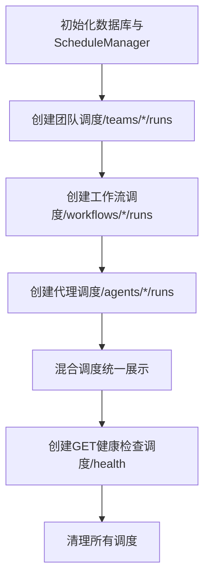

图表来源
- [examples/agent-os/scheduler/team-workflow-schedules.mdx:33-111](file://examples/agent-os/scheduler/team-workflow-schedules.mdx#L33-L111)

章节来源
- [examples/agent-os/scheduler/team-workflow-schedules.mdx:1-125](file://examples/agent-os/scheduler/team-workflow-schedules.mdx#L1-L125)

## 依赖关系分析
- 组件耦合：
  - ScheduleManager 与数据库交互，提供 CRUD 与运行历史查询。
  - SchedulePoller 依赖 ScheduleManager 与调度表，负责到期任务发现与并发执行。
  - ScheduleExecutor 依赖调度配置与目标端点，负责实际HTTP调用与运行记录写入。
  - Scheduler API 作为对外入口，协调 ScheduleManager 与 ScheduleExecutor。
- 外部依赖：
  - 数据库：Sqlite/Postgres 等，用于持久化调度与运行记录。
  - HTTP 客户端：用于向目标端点发起请求。
  - 控制台：SchedulerConsole 提供富文本展示。

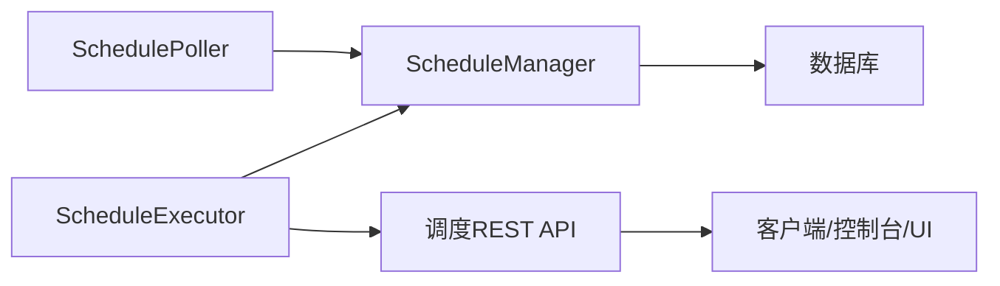

图表来源
- [scheduler/overview.mdx:80-88](file://scheduler/overview.mdx#L80-L88)

章节来源
- [scheduler/overview.mdx:80-88](file://scheduler/overview.mdx#L80-L88)

## 性能考量
- 轮询间隔：通过 scheduler_poll_interval 调整轮询频率，平衡及时性与资源消耗。
- 并发执行：SchedulePoller 并发执行到期任务，建议根据目标端点的吞吐能力与限流策略合理配置。
- 超时与重试：合理设置 timeout_seconds 与 max_retries/retry_delay_seconds，避免长时间阻塞与资源浪费。
- 分页查询：运行历史分页查询可降低单次响应体积，提升可观测性体验。

## 故障排查指南
- 422 错误：常见于 cron 或时区不合法，需检查输入格式与 IANA 时区字符串。
- 503 错误：手动触发返回 503 表示执行器尚未就绪，等待轮询器启动或稍后重试。
- 重复名称：创建时若名称重复，需选择覆盖策略或修改名称。
- 运行历史为空：若尚未被轮询器发现或执行器未运行，可在控制台查看“下次运行时间”与“启用状态”。

章节来源
- [agent-os/scheduler/overview.mdx:105-108](file://agent-os/scheduler/overview.mdx#L105-L108)
- [examples/agent-os/scheduler/rest-api-schedules.mdx:120-132](file://examples/agent-os/scheduler/rest-api-schedules.mdx#L120-L132)

## 结论
通过上述示例与架构说明，可以在 AgentOS 中高效地实现从基础到复杂的调度需求：单代理周期任务、多代理差异化调度、REST 生命周期管理、异步操作、团队与工作流调度、运行历史追踪与验证校验。配合合理的轮询间隔、超时与重试策略，可构建稳定可靠的自动化执行体系。

## 附录
- 快速参考
  - 安装：安装包含调度功能的包。
  - 启动：在 AgentOS 中启用调度器与轮询间隔。
  - 创建：通过 REST API 或 SDK 创建调度，填写名称、cron、端点、负载、时区、重试与超时等。
  - 管理：启用/禁用、更新、删除、手动触发与查看运行历史。
  - 验证：检查 cron 与时区合法性，处理重复名称与方法大小写问题。
  - 扩展：为团队与工作流创建调度，支持不同端点与负载配置。

章节来源
- [agent-os/scheduler/overview.mdx:8-10](file://agent-os/scheduler/overview.mdx#L8-L10)
- [examples/agent-os/scheduler/scheduler-with-agentos.mdx:48-56](file://examples/agent-os/scheduler/scheduler-with-agentos.mdx#L48-L56)
- [examples/agent-os/scheduler/rest-api-schedules.mdx:40-52](file://examples/agent-os/scheduler/rest-api-schedules.mdx#L40-L52)