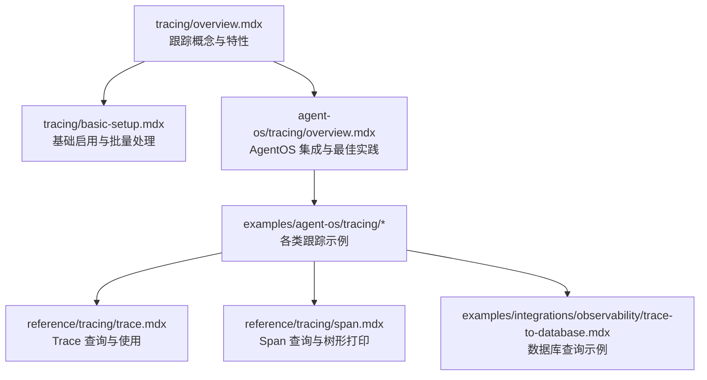
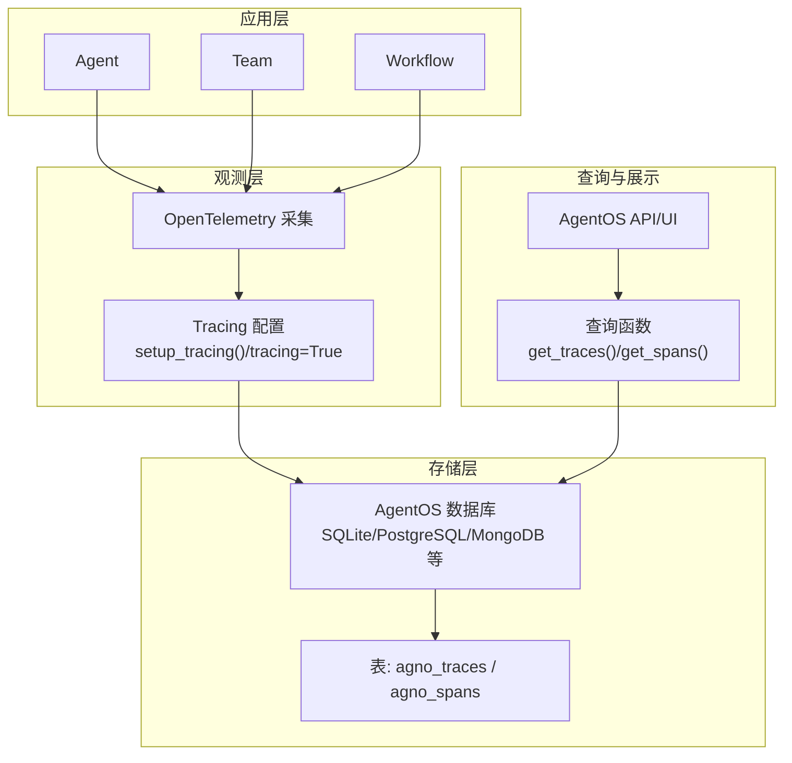
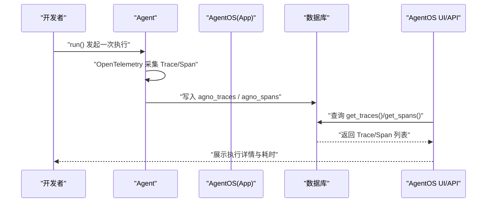
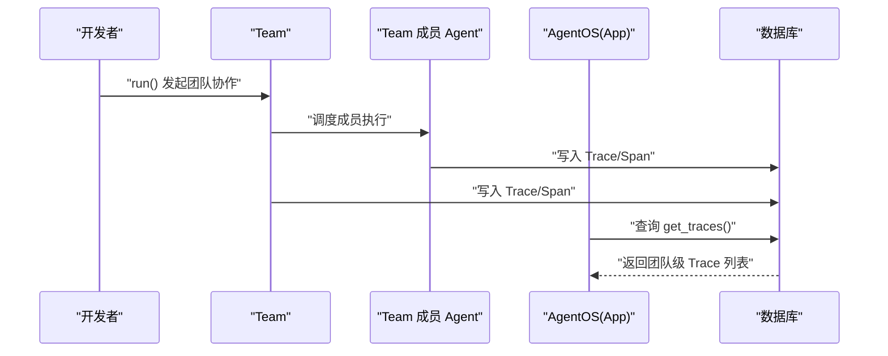
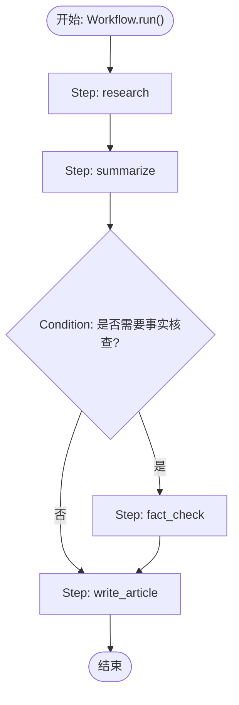
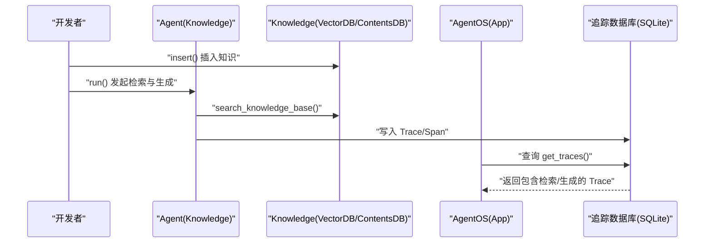
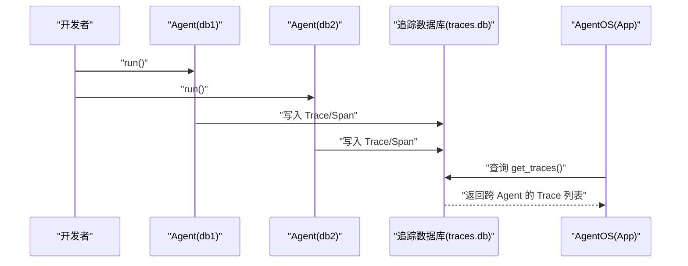
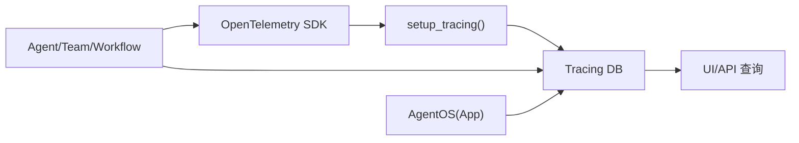

# 跟踪与监控示例

<cite>
**本文引用的文件**
- [tracing/overview.mdx](file://tracing/overview.mdx)
- [tracing/basic-setup.mdx](file://tracing/basic-setup.mdx)
- [reference/tracing/trace.mdx](file://reference/tracing/trace.mdx)
- [reference/tracing/span.mdx](file://reference/tracing/span.mdx)
- [examples/integrations/observability/trace-to-database.mdx](file://examples/integrations/observability/trace-to-database.mdx)
- [agent-os/tracing/overview.mdx](file://agent-os/tracing/overview.mdx)
- [examples/agent-os/tracing/overview.mdx](file://examples/agent-os/tracing/overview.mdx)
- [examples/agent-os/tracing/basic-agent-tracing.mdx](file://examples/agent-os/tracing/basic-agent-tracing.mdx)
- [examples/agent-os/tracing/basic-team-tracing.mdx](file://examples/agent-os/tracing/basic-team-tracing.mdx)
- [examples/agent-os/tracing/basic-workflow-tracing.mdx](file://examples/agent-os/tracing/basic-workflow-tracing.mdx)
- [examples/agent-os/tracing/agent-with-knowledge-tracing.mdx](file://examples/agent-os/tracing/agent-with-knowledge-tracing.mdx)
- [examples/agent-os/tracing/agent-with-reasoning-tools-tracing.mdx](file://examples/agent-os/tracing/agent-with-reasoning-tools-tracing.mdx)
- [examples/agent-os/tracing/tracing-with-multi-db-scenario.mdx](file://examples/agent-os/tracing/tracing-with-multi-db-scenario.mdx)
- [examples/agent-os/tracing/tracing-with-multi-db-and-tracing-flag.mdx](file://examples/agent-os/tracing/tracing-with-multi-db-and-tracing-flag.mdx)
- [examples/agent-os/tracing/dbs/overview.mdx](file://examples/agent-os/tracing/dbs/overview.mdx)
- [examples/agent-os/tracing/dbs/basic-agent-with-sqlite.mdx](file://examples/agent-os/tracing/dbs/basic-agent-with-sqlite.mdx)
- [examples/agent-os/tracing/dbs/basic-agent-with-postgresdb.mdx](file://examples/agent-os/tracing/dbs/basic-agent-with-postgresdb.mdx)
</cite>

## 目录
1. [简介](#简介)
2. [项目结构](#项目结构)
3. [核心组件](#核心组件)
4. [架构总览](#架构总览)
5. [详细组件分析](#详细组件分析)
6. [依赖关系分析](#依赖关系分析)
7. [性能考量](#性能考量)
8. [故障排查指南](#故障排查指南)
9. [结论](#结论)
10. [附录](#附录)

## 简介
本技术文档围绕 AgentOS 的跟踪与监控示例，系统讲解如何在 AgentOS 中实现全面的可观测性，覆盖基础跟踪、代理跟踪、团队跟踪、工作流跟踪、知识跟踪、推理工具跟踪以及多数据库跟踪场景。文档从概念到实践，结合仓库中的官方示例与参考文档，帮助读者理解跟踪数据的采集、存储与查询方法，并提供生产环境的配置建议与调试策略。

## 项目结构
与“跟踪与监控”直接相关的内容主要分布在以下路径：
- tracing 概念与快速入门：tracing/overview.mdx、tracing/basic-setup.mdx
- AgentOS 集成与配置：agent-os/tracing/overview.mdx
- 示例集合（Agent/Team/Workflow/知识/推理工具/多数据库）：examples/agent-os/tracing/*
- 数据库查询与模型参考：reference/tracing/trace.mdx、reference/tracing/span.mdx
- 观测性集成示例：examples/integrations/observability/trace-to-database.mdx

图表来源
- [tracing/overview.mdx:1-158](file://tracing/overview.mdx#L1-L158)
- [tracing/basic-setup.mdx:92-233](file://tracing/basic-setup.mdx#L92-L233)
- [agent-os/tracing/overview.mdx:1-184](file://agent-os/tracing/overview.mdx#L1-L184)
- [examples/agent-os/tracing/overview.mdx:1-16](file://examples/agent-os/tracing/overview.mdx#L1-L16)
- [reference/tracing/trace.mdx:28-75](file://reference/tracing/trace.mdx#L28-L75)
- [reference/tracing/span.mdx:86-122](file://reference/tracing/span.mdx#L86-L122)
- [examples/integrations/observability/trace-to-database.mdx:216-244](file://examples/integrations/observability/trace-to-database.mdx#L216-L244)

章节来源
- [tracing/overview.mdx:1-158](file://tracing/overview.mdx#L1-L158)
- [agent-os/tracing/overview.mdx:1-184](file://agent-os/tracing/overview.mdx#L1-L184)
- [examples/agent-os/tracing/overview.mdx:1-16](file://examples/agent-os/tracing/overview.mdx#L1-L16)

## 核心组件
- 追踪与跨度（Trace/Span）
  - Trace 表示一次完整的执行，Span 是其中的单个操作；两者共同构成可查询的执行树。
  - 参考：[tracing/overview.mdx:39-89](file://tracing/overview.mdx#L39-L89)
- 数据库存储与查询
  - 追踪数据存储于 AgentOS 所用的数据库中，可通过统一接口查询 Trace 与 Span。
  - 参考：[reference/tracing/trace.mdx:28-75](file://reference/tracing/trace.mdx#L28-L75)、[reference/tracing/span.mdx:86-122](file://reference/tracing/span.mdx#L86-L122)
- AgentOS 集成
  - 通过 tracing 标志或显式设置追踪数据库，确保所有 Agent/Team/Workflow 的执行被统一记录与查询。
  - 参考：[agent-os/tracing/overview.mdx:28-182](file://agent-os/tracing/overview.mdx#L28-L182)
- 基础启用与批量处理
  - 提供简单启用方式与批量导出配置，兼顾开发调试与生产性能。
  - 参考：[tracing/basic-setup.mdx:92-233](file://tracing/basic-setup.mdx#L92-L233)

章节来源
- [tracing/overview.mdx:39-89](file://tracing/overview.mdx#L39-L89)
- [reference/tracing/trace.mdx:28-75](file://reference/tracing/trace.mdx#L28-L75)
- [reference/tracing/span.mdx:86-122](file://reference/tracing/span.mdx#L86-L122)
- [agent-os/tracing/overview.mdx:28-182](file://agent-os/tracing/overview.mdx#L28-L182)
- [tracing/basic-setup.mdx:92-233](file://tracing/basic-setup.mdx#L92-L233)

## 架构总览
下图展示了 AgentOS 中的跟踪与监控架构：Agent/Team/Workflow 在运行时生成 Trace 与 Span，由 OpenTelemetry 采集并通过 AgentOS 的数据库进行持久化，最终在 UI 或 API 中统一查询与分析。

图表来源
- [tracing/overview.mdx:17-131](file://tracing/overview.mdx#L17-L131)
- [agent-os/tracing/overview.mdx:28-182](file://agent-os/tracing/overview.mdx#L28-L182)
- [reference/tracing/trace.mdx:28-75](file://reference/tracing/trace.mdx#L28-L75)
- [reference/tracing/span.mdx:86-122](file://reference/tracing/span.mdx#L86-L122)

## 详细组件分析

### 基础跟踪（Agent）
- 场景要点
  - 使用 AgentOS 的 tracing 标志即可启用对 Agent 的完整跟踪。
  - 示例演示了最小化的 Agent 创建、工具注入与服务启动流程。
- 关键步骤
  - 创建数据库实例（示例采用 SQLite）。
  - 定义 Agent 并注入工具。
  - 启动 AgentOS 并开启 tracing。
- 参考示例
  - [examples/agent-os/tracing/basic-agent-tracing.mdx:7-64](file://examples/agent-os/tracing/basic-agent-tracing.mdx#L7-L64)

图表来源
- [examples/agent-os/tracing/basic-agent-tracing.mdx:24-42](file://examples/agent-os/tracing/basic-agent-tracing.mdx#L24-L42)
- [reference/tracing/trace.mdx:53-75](file://reference/tracing/trace.mdx#L53-L75)
- [reference/tracing/span.mdx:86-122](file://reference/tracing/span.mdx#L86-L122)

章节来源
- [examples/agent-os/tracing/basic-agent-tracing.mdx:7-64](file://examples/agent-os/tracing/basic-agent-tracing.mdx#L7-L64)
- [reference/tracing/trace.mdx:53-75](file://reference/tracing/trace.mdx#L53-L75)
- [reference/tracing/span.mdx:86-122](file://reference/tracing/span.mdx#L86-L122)

### 团队跟踪（Team）
- 场景要点
  - Team 的成员执行会被自动纳入统一的 Trace；只需在 AgentOS 上开启 tracing 即可。
  - 示例展示了 Team 的创建、成员注入与服务启动。
- 参考示例
  - [examples/agent-os/tracing/basic-team-tracing.mdx:5-73](file://examples/agent-os/tracing/basic-team-tracing.mdx#L5-L73)

图表来源
- [examples/agent-os/tracing/basic-team-tracing.mdx:24-51](file://examples/agent-os/tracing/basic-team-tracing.mdx#L24-L51)

章节来源
- [examples/agent-os/tracing/basic-team-tracing.mdx:5-73](file://examples/agent-os/tracing/basic-team-tracing.mdx#L5-L73)

### 工作流跟踪（Workflow）
- 场景要点
  - Workflow 的步骤执行（如研究、总结、条件判断、写作）均被记录为 Span；条件分支也会形成独立的执行路径。
  - 示例展示了线性与条件型工作流的构建与服务启动。
- 参考示例
  - [examples/agent-os/tracing/basic-workflow-tracing.mdx:7-133](file://examples/agent-os/tracing/basic-workflow-tracing.mdx#L7-L133)

图表来源
- [examples/agent-os/tracing/basic-workflow-tracing.mdx:87-103](file://examples/agent-os/tracing/basic-workflow-tracing.mdx#L87-L103)

章节来源
- [examples/agent-os/tracing/basic-workflow-tracing.mdx:7-133](file://examples/agent-os/tracing/basic-workflow-tracing.mdx#L7-L133)

### 知识跟踪（Agent + Knowledge）
- 场景要点
  - Agent 结合知识库（向量库 + 内容库）时，检索与生成过程均被记录；示例使用 PostgreSQL 作为内容库、SQLite 作为追踪库。
  - 示例包含知识插入与服务启动流程。
- 参考示例
  - [examples/agent-os/tracing/agent-with-knowledge-tracing.mdx:4-174](file://examples/agent-os/tracing/agent-with-knowledge-tracing.mdx#L4-L174)

图表来源
- [examples/agent-os/tracing/agent-with-knowledge-tracing.mdx:108-138](file://examples/agent-os/tracing/agent-with-knowledge-tracing.mdx#L108-L138)

章节来源
- [examples/agent-os/tracing/agent-with-knowledge-tracing.mdx:4-174](file://examples/agent-os/tracing/agent-with-knowledge-tracing.mdx#L4-L174)

### 推理工具跟踪（Agent + Reasoning Tools）
- 场景要点
  - 启用推理工具后，Agent 的逐步推理过程被记录为多个 Span；示例展示了带时间戳与流事件的推理 Agent。
- 参考示例
  - [examples/agent-os/tracing/agent-with-reasoning-tools-tracing.mdx:5-103](file://examples/agent-os/tracing/agent-with-reasoning-tools-tracing.mdx#L5-L103)

章节来源
- [examples/agent-os/tracing/agent-with-reasoning-tools-tracing.mdx:5-103](file://examples/agent-os/tracing/agent-with-reasoning-tools-tracing.mdx#L5-L103)

### 多数据库跟踪场景
- 场景要点
  - 当 Agent/Team 分别使用不同数据库时，必须指定一个专用的追踪数据库，确保所有 Trace/Span 集中存储与查询。
  - 支持两种方式：显式调用 setup_tracing() 或在 AgentOS 上开启 tracing 并传入 db。
- 参考示例
  - [examples/agent-os/tracing/tracing-with-multi-db-scenario.mdx:7-84](file://examples/agent-os/tracing/tracing-with-multi-db-scenario.mdx#L7-L84)
  - [examples/agent-os/tracing/tracing-with-multi-db-and-tracing-flag.mdx:7-80](file://examples/agent-os/tracing/tracing-with-multi-db-and-tracing-flag.mdx#L7-L80)

图表来源
- [examples/agent-os/tracing/tracing-with-multi-db-scenario.mdx:26-62](file://examples/agent-os/tracing/tracing-with-multi-db-scenario.mdx#L26-L62)
- [examples/agent-os/tracing/tracing-with-multi-db-and-tracing-flag.mdx:25-58](file://examples/agent-os/tracing/tracing-with-multi-db-and-tracing-flag.mdx#L25-L58)

章节来源
- [examples/agent-os/tracing/tracing-with-multi-db-scenario.mdx:7-84](file://examples/agent-os/tracing/tracing-with-multi-db-scenario.mdx#L7-L84)
- [examples/agent-os/tracing/tracing-with-multi-db-and-tracing-flag.mdx:7-80](file://examples/agent-os/tracing/tracing-with-multi-db-and-tracing-flag.mdx#L7-L80)

### 不同数据库提供商的跟踪示例
- 场景要点
  - 示例覆盖 SQLite 与 PostgreSQL 两种数据库提供商，验证在不同存储后端上均可启用并查询跟踪数据。
- 参考示例
  - [examples/agent-os/tracing/dbs/basic-agent-with-sqlite.mdx:7-65](file://examples/agent-os/tracing/dbs/basic-agent-with-sqlite.mdx#L7-L65)
  - [examples/agent-os/tracing/dbs/basic-agent-with-postgresdb.mdx:7-64](file://examples/agent-os/tracing/dbs/basic-agent-with-postgresdb.mdx#L7-L64)

章节来源
- [examples/agent-os/tracing/dbs/overview.mdx:1-11](file://examples/agent-os/tracing/dbs/overview.mdx#L1-L11)
- [examples/agent-os/tracing/dbs/basic-agent-with-sqlite.mdx:7-65](file://examples/agent-os/tracing/dbs/basic-agent-with-sqlite.mdx#L7-L65)
- [examples/agent-os/tracing/dbs/basic-agent-with-postgresdb.mdx:7-64](file://examples/agent-os/tracing/dbs/basic-agent-with-postgresdb.mdx#L7-L64)

## 依赖关系分析
- 组件耦合
  - Agent/Team/Workflow 与 OpenTelemetry 采集器解耦，仅需在启动阶段配置追踪数据库。
  - AgentOS 通过 db 参数统一暴露 Trace/Span 查询能力。
- 外部依赖
  - OpenTelemetry SDK 与 Agno 的 Instrumentation 包用于采集与导出。
- 参考
  - [tracing/overview.mdx:17-131](file://tracing/overview.mdx#L17-L131)
  - [agent-os/tracing/overview.mdx:28-182](file://agent-os/tracing/overview.mdx#L28-L182)

图表来源
- [tracing/overview.mdx:92-131](file://tracing/overview.mdx#L92-L131)
- [agent-os/tracing/overview.mdx:137-182](file://agent-os/tracing/overview.mdx#L137-L182)

章节来源
- [tracing/overview.mdx:92-131](file://tracing/overview.mdx#L92-L131)
- [agent-os/tracing/overview.mdx:137-182](file://agent-os/tracing/overview.mdx#L137-L182)

## 性能考量
- 批量处理与队列
  - 生产环境推荐启用批量处理与合适的队列大小，减少频繁写入带来的开销。
  - 参考：[tracing/basic-setup.mdx:211-221](file://tracing/basic-setup.mdx#L211-L221)
- 数据库选择与隔离
  - 将追踪数据与业务数据分离，避免追踪增长影响业务库性能与容量规划。
  - 参考：[agent-os/tracing/overview.mdx:122-136](file://agent-os/tracing/overview.mdx#L122-L136)
- 非阻塞设计
  - 追踪系统不会阻塞 Agent 执行，保证业务吞吐不受影响。
  - 参考：[tracing/overview.mdx:84-89](file://tracing/overview.mdx#L84-L89)

## 故障排查指南
- 常见问题定位
  - 未看到 Trace：确认是否正确传入 db 或开启 tracing 标志；检查数据库连接与表是否存在。
  - 跨数据库查询不到：确认是否使用了同一追踪数据库；检查 AgentOS 初始化时的 db 参数。
- 查询与可视化
  - 使用 get_traces()/get_spans() 获取 Trace/Span 列表；支持按 Agent、会话、运行 ID、时间范围过滤。
  - 参考：[reference/tracing/trace.mdx:53-75](file://reference/tracing/trace.mdx#L53-L75)、[reference/tracing/span.mdx:86-122](file://reference/tracing/span.mdx#L86-L122)
- 示例脚本
  - 参考观测性示例中的查询与错误处理逻辑，便于在生产中复用。
  - 参考：[examples/integrations/observability/trace-to-database.mdx:216-244](file://examples/integrations/observability/trace-to-database.mdx#L216-L244)

章节来源
- [reference/tracing/trace.mdx:53-75](file://reference/tracing/trace.mdx#L53-L75)
- [reference/tracing/span.mdx:86-122](file://reference/tracing/span.mdx#L86-L122)
- [examples/integrations/observability/trace-to-database.mdx:216-244](file://examples/integrations/observability/trace-to-database.mdx#L216-L244)

## 结论
通过上述示例与参考文档，可以在 AgentOS 中轻松实现从基础代理到复杂工作流的全链路跟踪与监控。关键在于：
- 明确追踪目标（Agent/Team/Workflow/知识/推理工具）
- 正确配置追踪数据库（推荐专用数据库）
- 使用统一的查询接口进行分析与可视化
- 在生产中启用批量处理与合理的队列参数

## 附录
- 快速开始
  - 安装依赖：OpenTelemetry SDK 与 Agno Instrumentation
  - 启用追踪：setup_tracing() 或 AgentOS.tracing=True
  - 查询数据：get_traces()/get_spans()
- 参考路径
  - [tracing/overview.mdx:92-131](file://tracing/overview.mdx#L92-L131)
  - [agent-os/tracing/overview.mdx:137-182](file://agent-os/tracing/overview.mdx#L137-L182)
  - [examples/agent-os/tracing/overview.mdx:6-16](file://examples/agent-os/tracing/overview.mdx#L6-L16)