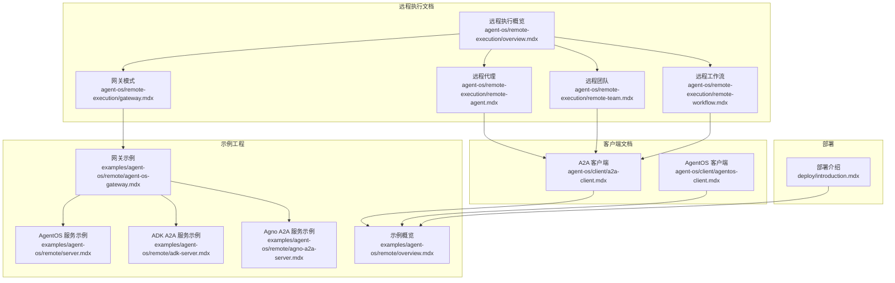
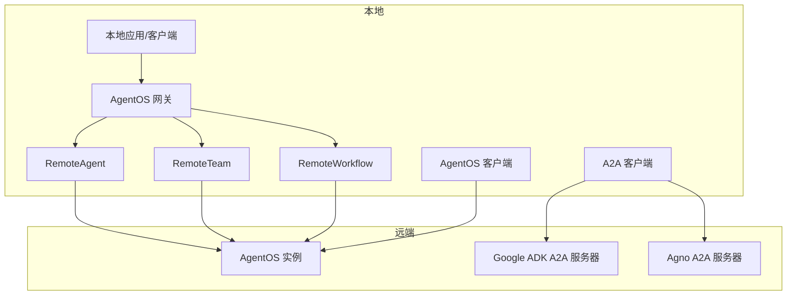
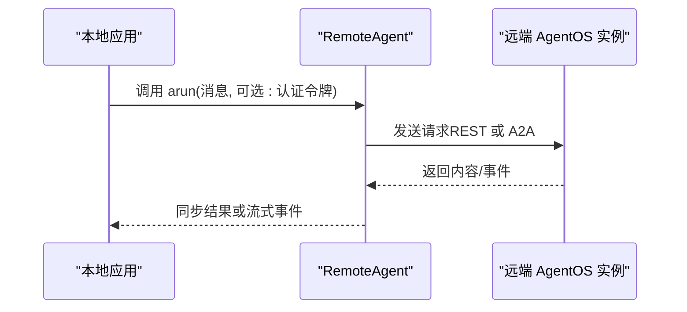
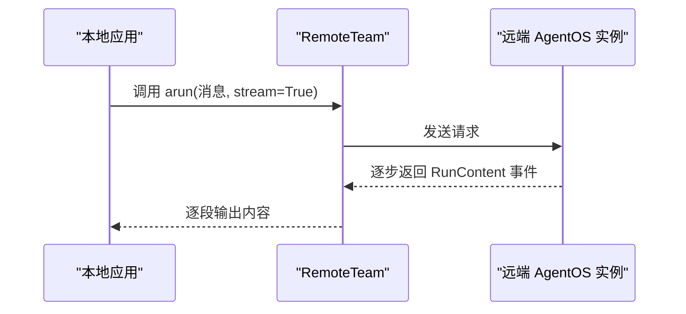
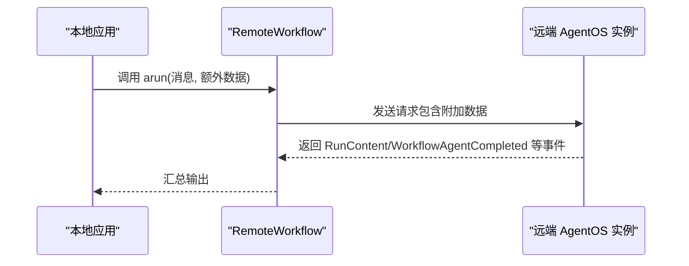
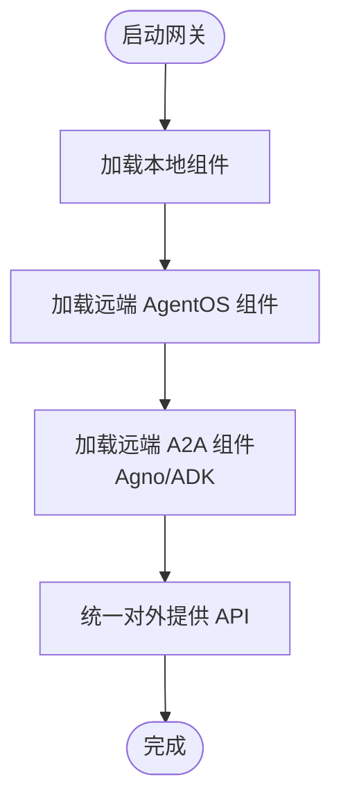
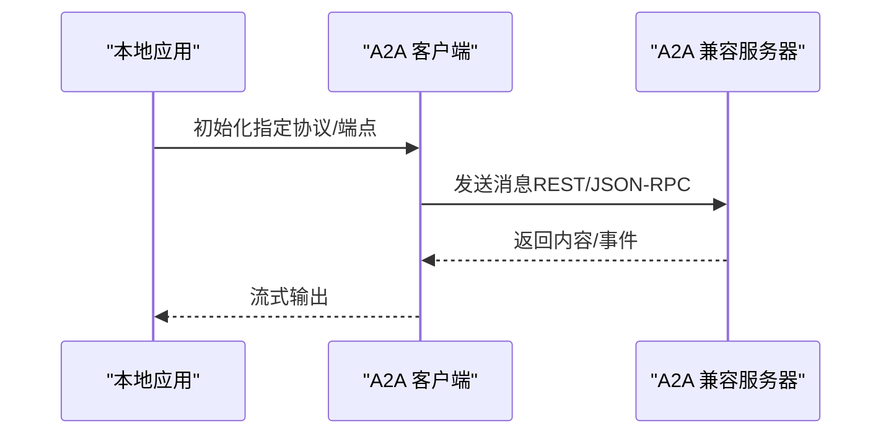
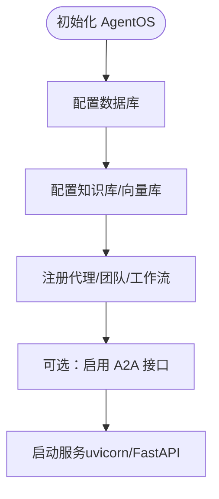
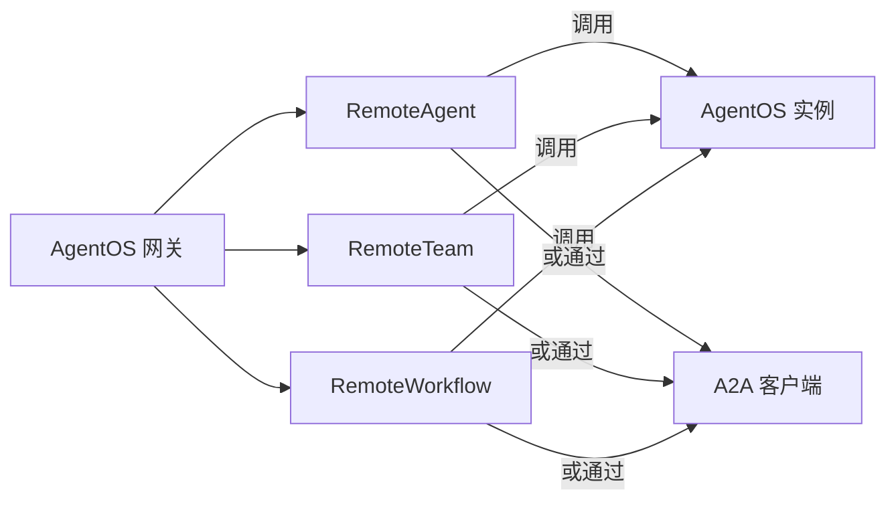

# 远程执行示例

<cite>
**本文引用的文件**
- [agent-os/remote-execution/overview.mdx](file://agent-os/remote-execution/overview.mdx)
- [agent-os/remote-execution/gateway.mdx](file://agent-os/remote-execution/gateway.mdx)
- [agent-os/remote-execution/remote-agent.mdx](file://agent-os/remote-execution/remote-agent.mdx)
- [agent-os/remote-execution/remote-team.mdx](file://agent-os/remote-execution/remote-team.mdx)
- [agent-os/remote-execution/remote-workflow.mdx](file://agent-os/remote-execution/remote-workflow.mdx)
- [agent-os/client/a2a-client.mdx](file://agent-os/client/a2a-client.mdx)
- [agent-os/client/agentos-client.mdx](file://agent-os/client/agentos-client.mdx)
- [examples/agent-os/remote/agent-os-gateway.mdx](file://examples/agent-os/remote/agent-os-gateway.mdx)
- [examples/agent-os/remote/server.mdx](file://examples/agent-os/remote/server.mdx)
- [examples/agent-os/remote/adk-server.mdx](file://examples/agent-os/remote/adk-server.mdx)
- [examples/agent-os/remote/agno-a2a-server.mdx](file://examples/agent-os/remote/agno-a2a-server.mdx)
- [examples/agent-os/remote/overview.mdx](file://examples/agent-os/remote/overview.mdx)
- [deploy/introduction.mdx](file://deploy/introduction.mdx)
</cite>

## 目录
1. [简介](#简介)
2. [项目结构](#项目结构)
3. [核心组件](#核心组件)
4. [架构总览](#架构总览)
5. [详细组件分析](#详细组件分析)
6. [依赖关系分析](#依赖关系分析)
7. [性能考量](#性能考量)
8. [故障排查指南](#故障排查指南)
9. [结论](#结论)
10. [附录](#附录)

## 简介
本技术文档围绕 AgentOS 的远程执行示例，系统性阐述如何在分布式环境中通过“远程代理（RemoteAgent）”“远程团队（RemoteTeam）”“远程工作流（RemoteWorkflow）”以及“网关模式（Gateway）”实现跨实例的统一调用。文档同时覆盖与 A2A 协议兼容的服务器（如 Google ADK A2A 与 Agno A2A 服务器）的对接方式，并给出通用服务器配置要点与部署建议，帮助读者在生产环境中构建高可用、可扩展的分布式智能体基础设施。

## 项目结构
与远程执行示例直接相关的文档主要分布在以下位置：
- agent-os/remote-execution：远程执行概览与三大远程实体使用说明
- agent-os/client：A2A 客户端与 AgentOS 客户端使用说明
- examples/agent-os/remote：远程执行与多协议服务器示例工程
- deploy/introduction：部署模板与步骤指引

**图表来源**
- [agent-os/remote-execution/overview.mdx:1-163](file://agent-os/remote-execution/overview.mdx#L1-L163)
- [agent-os/remote-execution/gateway.mdx:1-174](file://agent-os/remote-execution/gateway.mdx#L1-L174)
- [agent-os/remote-execution/remote-agent.mdx:1-156](file://agent-os/remote-execution/remote-agent.mdx#L1-L156)
- [agent-os/remote-execution/remote-team.mdx:1-163](file://agent-os/remote-execution/remote-team.mdx#L1-L163)
- [agent-os/remote-execution/remote-workflow.mdx:1-185](file://agent-os/remote-execution/remote-workflow.mdx#L1-L185)
- [agent-os/client/a2a-client.mdx:1-62](file://agent-os/client/a2a-client.mdx#L1-L62)
- [agent-os/client/agentos-client.mdx:1-120](file://agent-os/client/agentos-client.mdx#L1-L120)
- [examples/agent-os/remote/agent-os-gateway.mdx:1-199](file://examples/agent-os/remote/agent-os-gateway.mdx#L1-L199)
- [examples/agent-os/remote/server.mdx:1-161](file://examples/agent-os/remote/server.mdx#L1-L161)
- [examples/agent-os/remote/adk-server.mdx:1-82](file://examples/agent-os/remote/adk-server.mdx#L1-L82)
- [examples/agent-os/remote/agno-a2a-server.mdx:1-127](file://examples/agent-os/remote/agno-a2a-server.mdx#L1-L127)
- [examples/agent-os/remote/overview.mdx:1-15](file://examples/agent-os/remote/overview.mdx#L1-L15)
- [deploy/introduction.mdx:1-102](file://deploy/introduction.mdx#L1-L102)

**章节来源**
- [agent-os/remote-execution/overview.mdx:1-163](file://agent-os/remote-execution/overview.mdx#L1-L163)
- [examples/agent-os/remote/overview.mdx:1-15](file://examples/agent-os/remote/overview.mdx#L1-L15)

## 核心组件
- 远程代理（RemoteAgent）
  - 在本地以“远程代理”的形式调用远端 AgentOS 实例中的代理，支持同步与流式响应、认证令牌传递、A2A 协议对接等。
  - 参考路径：[远程代理:1-156](file://agent-os/remote-execution/remote-agent.mdx#L1-L156)，[示例：远程代理](file://examples/agent-os/remote/remote-agent.mdx)
- 远程团队（RemoteTeam）
  - 在本地以“远程团队”的形式调用远端 AgentOS 实例中的团队，支持成员协调、流式事件、A2A 协议对接等。
  - 参考路径：[远程团队:1-163](file://agent-os/remote-execution/remote-team.mdx#L1-L163)，[示例：远程团队](file://examples/agent-os/remote/remote-team.mdx)
- 远程工作流（RemoteWorkflow）
  - 在本地以“远程工作流”的形式调用远端 AgentOS 实例中的工作流，支持步骤级内容事件、附加数据传递、A2A 协议对接等。
  - 参考路径：[远程工作流:1-185](file://agent-os/remote-execution/remote-workflow.mdx#L1-L185)
- 网关模式（AgentOS Gateway）
  - 将多个远端 AgentOS 实例聚合为单一入口，统一暴露代理、团队与工作流；可混合本地与远程组件。
  - 参考路径：[网关模式:1-174](file://agent-os/remote-execution/gateway.mdx#L1-L174)，[完整网关示例:1-199](file://examples/agent-os/remote/agent-os-gateway.mdx#L1-L199)
- A2A 客户端（A2AClient）
  - 直接对接任意 A2A 兼容服务器（含 Google ADK 与 Agno A2A），支持消息发送与流式事件。
  - 参考路径：[A2A 客户端:1-62](file://agent-os/client/a2a-client.mdx#L1-L62)
- AgentOS 客户端（AgentOSClient）
  - 直连 AgentOS 实例进行配置查询、运行代理/团队/工作流、会话管理、知识检索与内存操作等。
  - 参考路径：[AgentOS 客户端:1-120](file://agent-os/client/agentos-client.mdx#L1-L120)

**章节来源**
- [agent-os/remote-execution/remote-agent.mdx:1-156](file://agent-os/remote-execution/remote-agent.mdx#L1-L156)
- [agent-os/remote-execution/remote-team.mdx:1-163](file://agent-os/remote-execution/remote-team.mdx#L1-L163)
- [agent-os/remote-execution/remote-workflow.mdx:1-185](file://agent-os/remote-execution/remote-workflow.mdx#L1-L185)
- [agent-os/remote-execution/gateway.mdx:1-174](file://agent-os/remote-execution/gateway.mdx#L1-L174)
- [agent-os/client/a2a-client.mdx:1-62](file://agent-os/client/a2a-client.mdx#L1-L62)
- [agent-os/client/agentos-client.mdx:1-120](file://agent-os/client/agentos-client.mdx#L1-L120)

## 架构总览
下图展示了“远程执行示例”的整体架构：本地客户端通过 RemoteAgent/RemoteTeam/RemoteWorkflow 或 A2A 客户端连接到远端 AgentOS 实例或 A2A 兼容服务器（如 Google ADK 或 Agno A2A），并通过网关模式统一对外提供 API。

**图表来源**
- [agent-os/remote-execution/overview.mdx:1-163](file://agent-os/remote-execution/overview.mdx#L1-L163)
- [agent-os/remote-execution/gateway.mdx:1-174](file://agent-os/remote-execution/gateway.mdx#L1-L174)
- [agent-os/client/a2a-client.mdx:1-62](file://agent-os/client/a2a-client.mdx#L1-L62)
- [agent-os/client/agentos-client.mdx:1-120](file://agent-os/client/agentos-client.mdx#L1-L120)
- [examples/agent-os/remote/agent-os-gateway.mdx:1-199](file://examples/agent-os/remote/agent-os-gateway.mdx#L1-L199)
- [examples/agent-os/remote/adk-server.mdx:1-82](file://examples/agent-os/remote/adk-server.mdx#L1-L82)
- [examples/agent-os/remote/agno-a2a-server.mdx:1-127](file://examples/agent-os/remote/agno-a2a-server.mdx#L1-L127)

## 详细组件分析

### 远程代理（RemoteAgent）
- 功能要点
  - 以本地对象的形式调用远端代理，支持同步与流式响应、认证令牌传递、强制刷新配置缓存。
  - 支持通过 A2A 协议对接不同框架（REST/JSON-RPC），并可直接访问远端配置。
- 关键流程（同步调用）

**图表来源**
- [agent-os/remote-execution/remote-agent.mdx:15-31](file://agent-os/remote-execution/remote-agent.mdx#L15-L31)
- [agent-os/client/a2a-client.mdx:15-31](file://agent-os/client/a2a-client.mdx#L15-L31)

**章节来源**
- [agent-os/remote-execution/remote-agent.mdx:1-156](file://agent-os/remote-execution/remote-agent.mdx#L1-L156)

### 远程团队（RemoteTeam）
- 功能要点
  - 以本地对象的形式调用远端团队，支持成员协调、流式事件处理、配置缓存与强制刷新。
  - 可注册到网关中统一暴露。
- 关键流程（流式事件）

**图表来源**
- [agent-os/remote-execution/remote-team.mdx:35-53](file://agent-os/remote-execution/remote-team.mdx#L35-L53)

**章节来源**
- [agent-os/remote-execution/remote-team.mdx:1-163](file://agent-os/remote-execution/remote-team.mdx#L1-L163)

### 远程工作流（RemoteWorkflow）
- 功能要点
  - 以本地对象的形式调用远端工作流，支持步骤级内容事件、附加数据传递、配置缓存与强制刷新。
  - 可注册到网关中统一暴露。
- 关键流程（附加数据与事件）

**图表来源**
- [agent-os/remote-execution/remote-workflow.mdx:59-78](file://agent-os/remote-execution/remote-workflow.mdx#L59-L78)

**章节来源**
- [agent-os/remote-execution/remote-workflow.mdx:1-185](file://agent-os/remote-execution/remote-workflow.mdx#L1-L185)

### 网关模式（AgentOS Gateway）
- 功能要点
  - 将多个远端 AgentOS 实例与本地组件聚合为单一入口，统一暴露代理、团队与工作流。
  - 网关示例同时演示了 AgentOS 协议与 A2A 协议（含 Google ADK 与 Agno A2A）的混用。
- 关键流程（多源聚合）

**图表来源**
- [agent-os/remote-execution/gateway.mdx:16-45](file://agent-os/remote-execution/gateway.mdx#L16-L45)
- [examples/agent-os/remote/agent-os-gateway.mdx:124-161](file://examples/agent-os/remote/agent-os-gateway.mdx#L124-L161)

**章节来源**
- [agent-os/remote-execution/gateway.mdx:1-174](file://agent-os/remote-execution/gateway.mdx#L1-L174)
- [examples/agent-os/remote/agent-os-gateway.mdx:1-199](file://examples/agent-os/remote/agent-os-gateway.mdx#L1-L199)

### A2A 协议与兼容服务器
- A2A 客户端
  - 支持直连任意 A2A 兼容服务器，包括 REST 与 JSON-RPC 模式。
  - 示例：连接 Agno AgentOS A2A 接口与 Google ADK。
- 兼容服务器示例
  - Agno A2A 服务器：启用 A2A 接口后，可被 A2A 客户端或 RemoteAgent 以 A2A 协议访问。
  - Google ADK A2A 服务器：通过工具适配器将 ADK Agent 暴露为 A2A 兼容接口。
- 关键流程（A2A 客户端）

**图表来源**
- [agent-os/client/a2a-client.mdx:15-41](file://agent-os/client/a2a-client.mdx#L15-L41)
- [examples/agent-os/remote/adk-server.mdx:33-55](file://examples/agent-os/remote/adk-server.mdx#L33-L55)
- [examples/agent-os/remote/agno-a2a-server.mdx:92-98](file://examples/agent-os/remote/agno-a2a-server.mdx#L92-L98)

**章节来源**
- [agent-os/client/a2a-client.mdx:1-62](file://agent-os/client/a2a-client.mdx#L1-L62)
- [examples/agent-os/remote/adk-server.mdx:1-82](file://examples/agent-os/remote/adk-server.mdx#L1-L82)
- [examples/agent-os/remote/agno-a2a-server.mdx:1-127](file://examples/agent-os/remote/agno-a2a-server.mdx#L1-L127)

### 通用服务器配置与部署
- 通用配置要点
  - 端口与访问控制：示例中使用不同端口区分 AgentOS、Agno A2A、ADK A2A 与网关服务。
  - 认证与授权：当远端实例启用保护时，网关需放行特定端点（如 /config、/agents、/teams、/workflows）以保证网关功能正常。
  - 数据库与知识库：示例服务器配置了数据库与向量数据库，用于会话、记忆与知识检索。
- 部署模板
  - 提供 Docker、Railway、AWS 等模板，便于快速部署 AgentOS 到云平台。
- 关键流程（示例服务器）

**图表来源**
- [examples/agent-os/remote/server.mdx:27-132](file://examples/agent-os/remote/server.mdx#L27-L132)
- [examples/agent-os/remote/agno-a2a-server.mdx:92-98](file://examples/agent-os/remote/agno-a2a-server.mdx#L92-L98)
- [examples/agent-os/remote/adk-server.mdx:33-55](file://examples/agent-os/remote/adk-server.mdx#L33-L55)
- [deploy/introduction.mdx:11-47](file://deploy/introduction.mdx#L11-L47)

**章节来源**
- [examples/agent-os/remote/server.mdx:1-161](file://examples/agent-os/remote/server.mdx#L1-L161)
- [examples/agent-os/remote/agno-a2a-server.mdx:1-127](file://examples/agent-os/remote/agno-a2a-server.mdx#L1-L127)
- [examples/agent-os/remote/adk-server.mdx:1-82](file://examples/agent-os/remote/adk-server.mdx#L1-L82)
- [agent-os/remote-execution/gateway.mdx:161-173](file://agent-os/remote-execution/gateway.mdx#L161-L173)
- [deploy/introduction.mdx:1-102](file://deploy/introduction.mdx#L1-L102)

## 依赖关系分析
- 组件耦合
  - RemoteAgent/RemoteTeam/RemoteWorkflow 依赖于 AgentOS 客户端或 A2A 客户端进行远端通信。
  - 网关模式将本地与远端组件解耦，统一暴露 API，降低上层调用复杂度。
- 外部依赖
  - A2A 兼容服务器（Google ADK、Agno A2A）作为远端执行节点，与本地客户端通过标准协议交互。
- 潜在循环依赖
  - 文档示例未见循环导入；网关通过组合远端组件，避免直接相互引用。

**图表来源**
- [agent-os/remote-execution/remote-agent.mdx:1-156](file://agent-os/remote-execution/remote-agent.mdx#L1-L156)
- [agent-os/remote-execution/remote-team.mdx:1-163](file://agent-os/remote-execution/remote-team.mdx#L1-L163)
- [agent-os/remote-execution/remote-workflow.mdx:1-185](file://agent-os/remote-execution/remote-workflow.mdx#L1-L185)
- [agent-os/client/a2a-client.mdx:1-62](file://agent-os/client/a2a-client.mdx#L1-L62)
- [agent-os/remote-execution/gateway.mdx:1-174](file://agent-os/remote-execution/gateway.mdx#L1-L174)

**章节来源**
- [agent-os/remote-execution/overview.mdx:1-163](file://agent-os/remote-execution/overview.mdx#L1-L163)
- [agent-os/remote-execution/gateway.mdx:1-174](file://agent-os/remote-execution/gateway.mdx#L1-L174)

## 性能考量
- 延迟与吞吐
  - 远程调用引入网络往返时间，建议对长耗时任务采用流式输出与分步事件，提升用户体验。
  - 对于高并发场景，建议在网关层引入限流与熔断策略（结合部署模板的反向代理与容器编排能力）。
- 缓存与一致性
  - 远端配置可通过缓存减少重复拉取，必要时强制刷新以确保一致性。
- 资源隔离
  - 不同业务域的代理/团队/工作流应部署在独立实例或命名空间内，避免资源争抢。

## 故障排查指南
- 连接失败
  - 使用 AgentOS 客户端或 A2A 客户端捕获“远端服务器不可达”异常，记录基础 URL 与错误信息，实现降级或重试。
- 权限问题
  - 当远端实例启用全量保护时，网关无法枚举远端资源。请确保 /config、/agents、/teams、/workflows 等端点可被网关访问。
- A2A 协议差异
  - Agno A2A 默认使用 REST，Google ADK 使用 JSON-RPC。请根据目标服务器选择正确协议参数。
- 日志与可观测性
  - 结合 AgentOS 的追踪与日志能力，定位跨实例调用链路中的瓶颈与异常。

**章节来源**
- [agent-os/client/agentos-client.mdx:76-89](file://agent-os/client/agentos-client.mdx#L76-L89)
- [agent-os/remote-execution/gateway.mdx:161-173](file://agent-os/remote-execution/gateway.mdx#L161-L173)
- [agent-os/client/a2a-client.mdx:32-41](file://agent-os/client/a2a-client.mdx#L32-L41)

## 结论
通过 RemoteAgent/RemoteTeam/RemoteWorkflow 与网关模式，AgentOS 能够在分布式环境中实现跨实例的统一调度与执行。配合 A2A 协议，系统可无缝对接多种第三方智能体框架（如 Google ADK）。结合示例工程与部署模板，可在本地与云端快速搭建高可用、可扩展的远程执行基础设施。

## 附录
- 快速开始
  - 启动远端 AgentOS 服务（示例：server.py）
  - 启动 A2A 兼容服务（示例：Agno A2A 服务器、Google ADK 服务器）
  - 启动网关（示例：agent-os-gateway.py）
  - 通过本地客户端调用远程代理/团队/工作流
- 参考路径
  - [远程执行概览:1-163](file://agent-os/remote-execution/overview.mdx#L1-L163)
  - [网关模式:1-174](file://agent-os/remote-execution/gateway.mdx#L1-L174)
  - [远程代理:1-156](file://agent-os/remote-execution/remote-agent.mdx#L1-L156)
  - [远程团队:1-163](file://agent-os/remote-execution/remote-team.mdx#L1-L163)
  - [远程工作流:1-185](file://agent-os/remote-execution/remote-workflow.mdx#L1-L185)
  - [A2A 客户端:1-62](file://agent-os/client/a2a-client.mdx#L1-L62)
  - [AgentOS 客户端:1-120](file://agent-os/client/agentos-client.mdx#L1-L120)
  - [示例：网关:1-199](file://examples/agent-os/remote/agent-os-gateway.mdx#L1-L199)
  - [示例：AgentOS 服务:1-161](file://examples/agent-os/remote/server.mdx#L1-L161)
  - [示例：ADK A2A 服务:1-82](file://examples/agent-os/remote/adk-server.mdx#L1-L82)
  - [示例：Agno A2A 服务:1-127](file://examples/agent-os/remote/agno-a2a-server.mdx#L1-L127)
  - [部署介绍:1-102](file://deploy/introduction.mdx#L1-L102)