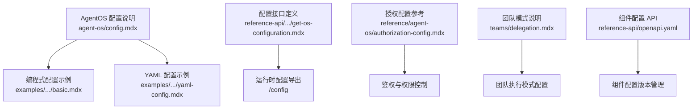
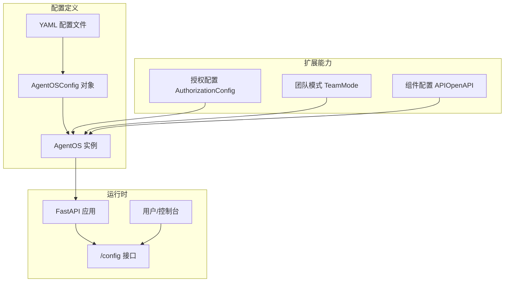
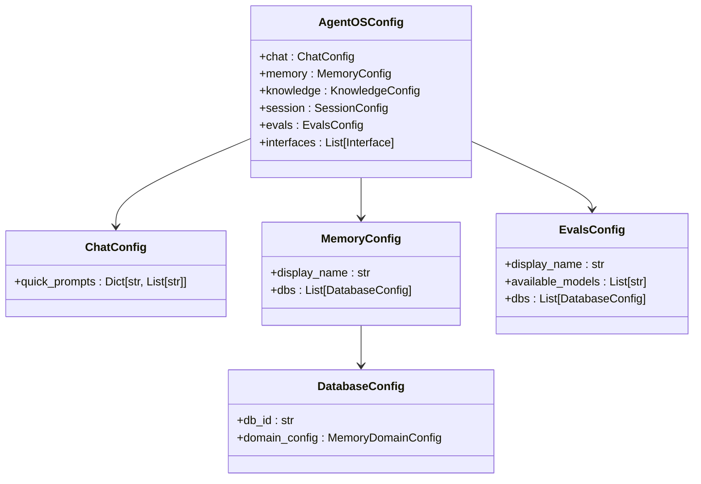
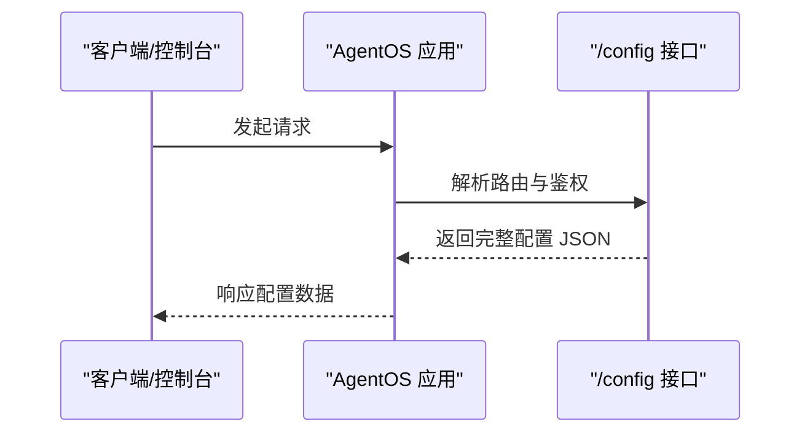
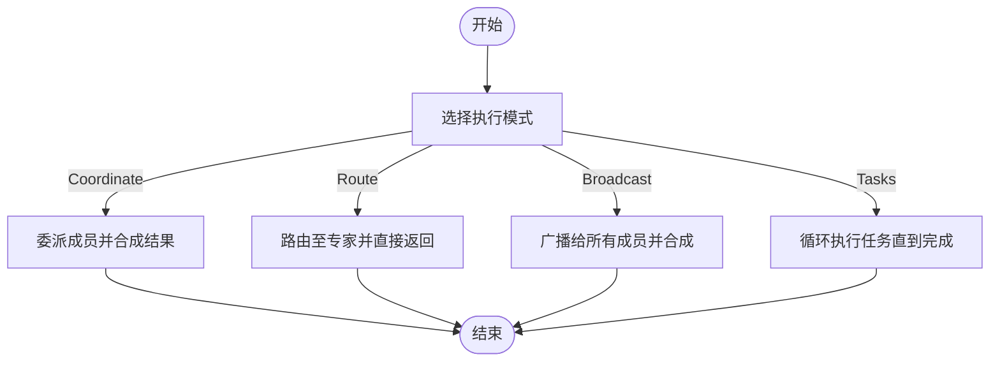
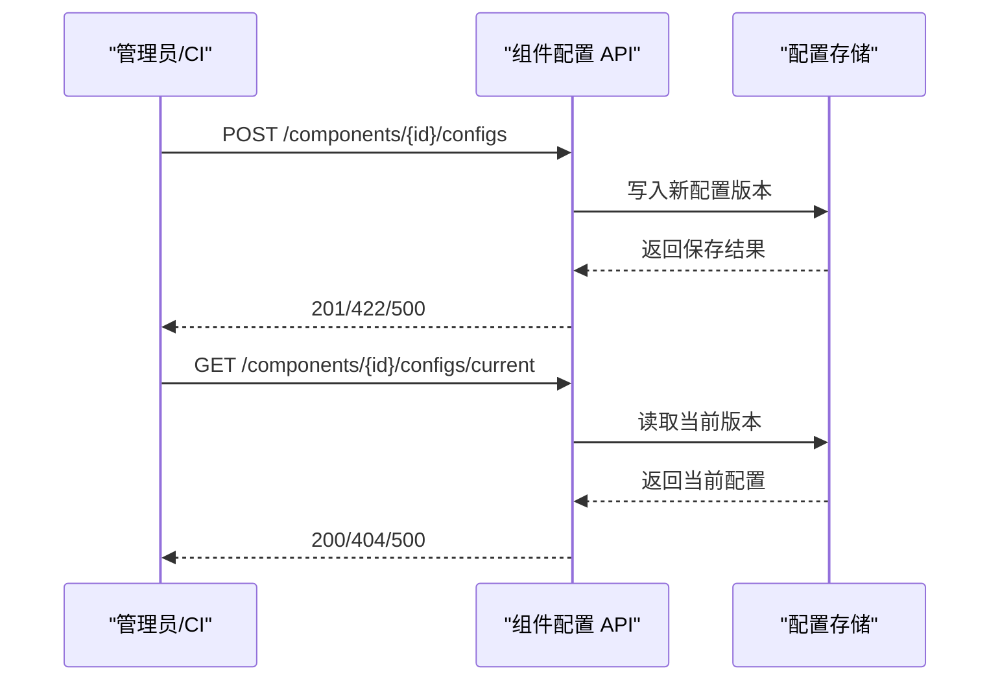
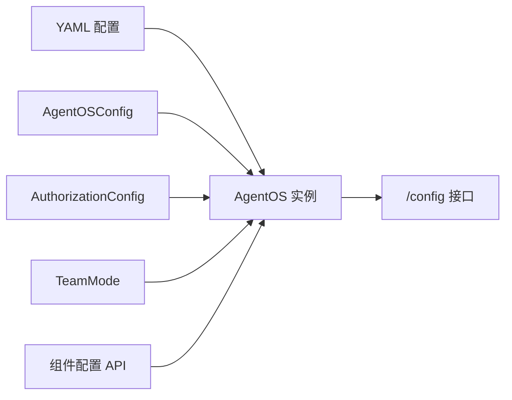

# 配置管理示例

<cite>
**本文引用的文件**
- [agent-os/config.mdx](file://agent-os/config.mdx)
- [examples/agent-os/os-config/basic.mdx](file://examples/agent-os/os-config/basic.mdx)
- [examples/agent-os/os-config/yaml-config.mdx](file://examples/agent-os/os-config/yaml-config.mdx)
- [reference-api/schema/core/get-os-configuration.mdx](file://reference-api/schema/core/get-os-configuration.mdx)
- [reference/agent-os/authorization-config.mdx](file://reference/agent-os/authorization-config.mdx)
- [teams/delegation.mdx](file://teams/delegation.mdx)
- [examples/teams/modes/overview.mdx](file://examples/teams/modes/overview.mdx)
- [_snippets/team-snippet.mdx](file://_snippets/team-snippet.mdx)
- [reference-api/openapi.yaml](file://reference-api/openapi.yaml)
</cite>

## 目录
1. [简介](#简介)
2. [项目结构](#项目结构)
3. [核心组件](#核心组件)
4. [架构总览](#架构总览)
5. [详细组件分析](#详细组件分析)
6. [依赖关系分析](#依赖关系分析)
7. [性能考量](#性能考量)
8. [故障排查指南](#故障排查指南)
9. [结论](#结论)
10. [附录](#附录)

## 简介
本技术文档围绕 AgentOS 的配置管理示例进行系统化说明，重点涵盖以下方面：
- 基本配置与 YAML 配置文件的编写与使用
- 模式配置：代理模式、团队模式与自定义模式的配置方法
- 配置选项、参数设置与验证规则
- 在不同环境（开发、预发布、生产）中的配置策略与最佳实践
- 通过 /config 接口获取配置并进行验证与调试

AgentOS 支持两种主要配置方式：使用 YAML 文件或通过 AgentOSConfig 类进行编程式配置；同时提供 /config 接口用于导出完整配置，便于前端控制台与外部系统集成。

## 项目结构
与配置管理相关的核心文件与示例分布如下：
- 基础配置说明与示例：agent-os/config.mdx
- 编程式配置示例：examples/agent-os/os-config/basic.mdx
- YAML 配置示例：examples/agent-os/os-config/yaml-config.mdx
- 配置接口定义：reference-api/schema/core/get-os-configuration.mdx
- 授权与鉴权配置参考：reference/agent-os/authorization-config.mdx
- 团队执行模式与路由说明：teams/delegation.mdx、examples/teams/modes/overview.mdx、_snippets/team-snippet.mdx
- 组件配置 API 定义：reference-api/openapi.yaml

**图表来源**
- [agent-os/config.mdx:1-213](file://agent-os/config.mdx#L1-L213)
- [examples/agent-os/os-config/basic.mdx:1-125](file://examples/agent-os/os-config/basic.mdx#L1-L125)
- [examples/agent-os/os-config/yaml-config.mdx:1-108](file://examples/agent-os/os-config/yaml-config.mdx#L1-L108)
- [reference-api/schema/core/get-os-configuration.mdx:1-3](file://reference-api/schema/core/get-os-configuration.mdx#L1-L3)
- [reference/agent-os/authorization-config.mdx:1-78](file://reference/agent-os/authorization-config.mdx#L1-L78)
- [teams/delegation.mdx:92-136](file://teams/delegation.mdx#L92-L136)
- [reference-api/openapi.yaml:7292-9524](file://reference-api/openapi.yaml#L7292-L9524)

**章节来源**
- [agent-os/config.mdx:18-213](file://agent-os/config.mdx#L18-L213)
- [examples/agent-os/os-config/basic.mdx:13-98](file://examples/agent-os/os-config/basic.mdx#L13-L98)
- [examples/agent-os/os-config/yaml-config.mdx:13-80](file://examples/agent-os/os-config/yaml-config.mdx#L13-L80)
- [reference-api/schema/core/get-os-configuration.mdx:1-3](file://reference-api/schema/core/get-os-configuration.mdx#L1-L3)
- [reference/agent-os/authorization-config.mdx:14-78](file://reference/agent-os/authorization-config.mdx#L14-L78)
- [teams/delegation.mdx:92-136](file://teams/delegation.mdx#L92-L136)
- [examples/teams/modes/overview.mdx:1-11](file://examples/teams/modes/overview.mdx#L1-L11)
- [_snippets/team-snippet.mdx:1-6](file://_snippets/team-snippet.mdx#L1-L6)
- [reference-api/openapi.yaml:9420-9524](file://reference-api/openapi.yaml#L9420-L9524)

## 核心组件
- 配置入口与方式
  - YAML 文件：通过 config 参数传入 YAML 路径，适合多环境与多租户场景。
  - AgentOSConfig 类：通过编程方式构建配置对象，适合动态生成与复杂逻辑。
- 页面与功能配置域
  - chat：快速提示（quick prompts），按角色/实体分组。
  - memory/knowledge/session：页面显示名与数据库域配置（domain_config）。
  - evals：全局可用模型列表与按数据库域覆盖。
  - interfaces：如 Slack、WhatsApp 等接口配置。
- 运行时配置导出
  - /config 接口返回完整配置，包含 OS ID、描述、数据库列表、组件清单与各页面配置。

**章节来源**
- [agent-os/config.mdx:26-213](file://agent-os/config.mdx#L26-L213)
- [examples/agent-os/os-config/basic.mdx:75-96](file://examples/agent-os/os-config/basic.mdx#L75-L96)
- [examples/agent-os/os-config/yaml-config.mdx:70-80](file://examples/agent-os/os-config/yaml-config.mdx#L70-L80)
- [reference-api/schema/core/get-os-configuration.mdx:1-3](file://reference-api/schema/core/get-os-configuration.mdx#L1-L3)

## 架构总览
下图展示了 AgentOS 配置从定义到运行时导出的整体流程，以及与授权、团队模式等模块的关系。

**图表来源**
- [agent-os/config.mdx:26-213](file://agent-os/config.mdx#L26-L213)
- [examples/agent-os/os-config/basic.mdx:75-98](file://examples/agent-os/os-config/basic.mdx#L75-L98)
- [examples/agent-os/os-config/yaml-config.mdx:70-81](file://examples/agent-os/os-config/yaml-config.mdx#L70-L81)
- [reference/agent-os/authorization-config.mdx:25-38](file://reference/agent-os/authorization-config.mdx#L25-L38)
- [teams/delegation.mdx:98-111](file://teams/delegation.mdx#L98-L111)
- [reference-api/openapi.yaml:7292-9524](file://reference-api/openapi.yaml#L7292-L9524)

## 详细组件分析

### 配置文件与 AgentOSConfig 类
- YAML 配置要点
  - chat.quick_prompts：按角色（如 marketing-agent）提供快速提示列表。
  - memory/knowledge/session.dbs：指定数据库 ID，并可为每个数据库设置 domain_config 显示名。
  - evals：支持全局 available_models 与按数据库域覆盖。
- AgentOSConfig 类
  - 使用 ChatConfig、MemoryConfig、DatabaseConfig 等子配置类组合。
  - 可直接将对象传给 AgentOS 的 config 参数，实现强类型与可维护性。

**图表来源**
- [agent-os/config.mdx:93-144](file://agent-os/config.mdx#L93-L144)
- [examples/agent-os/os-config/basic.mdx:17-27](file://examples/agent-os/os-config/basic.mdx#L17-L27)

**章节来源**
- [agent-os/config.mdx:26-144](file://agent-os/config.mdx#L26-L144)
- [examples/agent-os/os-config/basic.mdx:13-98](file://examples/agent-os/os-config/basic.mdx#L13-L98)

### /config 接口与配置导出
- 接口定义：GET /config
- 返回内容要点
  - os_id、name、description、available_models
  - databases 列表
  - agents、teams、workflows、interfaces 清单
  - 各页面配置：chat、memory、knowledge、session、evals 等
- 使用场景
  - 控制台与前端展示
  - 外部系统集成与校验
  - 配置审计与变更追踪

**图表来源**
- [reference-api/schema/core/get-os-configuration.mdx:1-3](file://reference-api/schema/core/get-os-configuration.mdx#L1-L3)
- [agent-os/config.mdx:146-213](file://agent-os/config.mdx#L146-L213)

**章节来源**
- [agent-os/config.mdx:146-213](file://agent-os/config.mdx#L146-L213)
- [reference-api/schema/core/get-os-configuration.mdx:1-3](file://reference-api/schema/core/get-os-configuration.mdx#L1-L3)

### 模式配置：代理模式、团队模式与自定义模式
- 代理模式（Agent）
  - 通过 Agent 的上下文与工具调用完成任务，适合单点智能与状态管理。
- 团队模式（Team）
  - TeamMode 提供多种协调策略：
    - Coordinate：分解工作、委派成员、合成结果（默认）
    - Route：路由至单一专家，直接返回响应
    - Broadcast：向所有成员委派并合成
    - Tasks：循环执行任务列表直至目标完成
  - 兼容历史标志位：respond_directly、determine_input_for_members 等，新配置以 mode 为准。
- 自定义模式
  - 通过组合 Agent、Team 与 Workflow，结合数据库、接口与配置，实现业务定制化编排。

**图表来源**
- [teams/delegation.mdx:98-111](file://teams/delegation.mdx#L98-L111)
- [_snippets/team-snippet.mdx:1-6](file://_snippets/team-snippet.mdx#L1-L6)
- [examples/teams/modes/overview.mdx:1-11](file://examples/teams/modes/overview.mdx#L1-L11)

**章节来源**
- [teams/delegation.mdx:92-136](file://teams/delegation.mdx#L92-L136)
- [_snippets/team-snippet.mdx:1-6](file://_snippets/team-snippet.mdx#L1-L6)
- [examples/teams/modes/overview.mdx:1-11](file://examples/teams/modes/overview.mdx#L1-L11)

### 授权与鉴权配置
- AuthorizationConfig 参数
  - verification_keys：用于签名验证的密钥列表（对称算法使用共享密钥，非对称算法使用公钥）
  - jwks_file：静态 JWKS 文件路径（可选）
  - algorithm：JWT 算法（如 RS256、HS256 等）
  - verify_audience：是否验证 aud 声明（建议在控制平面流量关闭）
- 使用建议
  - 生产环境优先使用非对称算法与 JWKS 管理
  - 严格校验 aud 与 sub 等关键声明
  - 为不同角色配置最小权限范围

**章节来源**
- [reference/agent-os/authorization-config.mdx:14-78](file://reference/agent-os/authorization-config.mdx#L14-L78)

### 组件配置 API（OpenAPI）
- 关键端点
  - 创建配置版本：POST /components/{component_id}/configs
  - 获取当前配置版本：GET /components/{component_id}/configs/current
- 请求体与响应
  - ConfigCreate：包含 config 数据、版本号、标签、阶段、备注、链接、是否设为当前版本等字段
  - ComponentConfigResponse：组件配置响应结构
- 验证与错误
  - 422：验证错误
  - 500：服务器内部错误

**图表来源**
- [reference-api/openapi.yaml:7307-7582](file://reference-api/openapi.yaml#L7307-L7582)
- [reference-api/openapi.yaml:9469-9516](file://reference-api/openapi.yaml#L9469-L9516)

**章节来源**
- [reference-api/openapi.yaml:7292-9524](file://reference-api/openapi.yaml#L7292-L9524)

## 依赖关系分析
- 配置来源与耦合
  - YAML 与 AgentOSConfig 两种方式互斥但等价，最终都注入到 AgentOS 实例
  - /config 接口依赖运行时应用状态与已注册组件
- 扩展能力耦合
  - 授权配置与鉴权中间件耦合
  - 团队模式与调度、接口模块存在交互
  - 组件配置 API 与后端存储耦合

**图表来源**
- [agent-os/config.mdx:26-213](file://agent-os/config.mdx#L26-L213)
- [reference/agent-os/authorization-config.mdx:25-38](file://reference/agent-os/authorization-config.mdx#L25-L38)
- [teams/delegation.mdx:98-111](file://teams/delegation.mdx#L98-L111)
- [reference-api/openapi.yaml:7292-9524](file://reference-api/openapi.yaml#L7292-L9524)

**章节来源**
- [agent-os/config.mdx:26-213](file://agent-os/config.mdx#L26-L213)
- [reference/agent-os/authorization-config.mdx:25-38](file://reference/agent-os/authorization-config.mdx#L25-L38)
- [teams/delegation.mdx:92-136](file://teams/delegation.mdx#L92-L136)
- [reference-api/openapi.yaml:7292-9524](file://reference-api/openapi.yaml#L7292-L9524)

## 性能考量
- 配置加载
  - YAML 解析与对象序列化开销较小，适合静态配置
  - AgentOSConfig 动态构建时注意避免重复实例化与深层嵌套
- /config 接口
  - 返回全量配置，建议仅在必要时调用或缓存结果
  - 大型系统中可考虑分页或按需查询
- 团队模式
  - Broadcast 与 Tasks 模式可能增加并发与合成成本，需评估资源与延迟
  - Route 模式可降低合成开销，提升响应速度

## 故障排查指南
- /config 接口异常
  - 404：组件不存在或未注册
  - 422：请求体格式或字段不合法
  - 500：服务内部错误，检查日志与存储状态
- 配置不生效
  - 确认 YAML 路径正确且可读
  - 确认 AgentOS 实例已正确注入 config
  - 检查 /config 输出是否包含预期字段
- 授权失败
  - 校验 verification_keys 与算法匹配
  - 确认 token 的 aud 与 sub 声明符合预期
  - 如启用 JWKS，确认文件路径与权限

**章节来源**
- [reference-api/openapi.yaml:7292-7582](file://reference-api/openapi.yaml#L7292-L7582)
- [reference/agent-os/authorization-config.mdx:14-78](file://reference/agent-os/authorization-config.mdx#L14-L78)
- [agent-os/config.mdx:146-213](file://agent-os/config.mdx#L146-L213)

## 结论
- AgentOS 的配置管理提供了灵活的 YAML 与编程式两种方式，适用于多环境与多租户部署
- 通过 /config 接口可统一导出运行时配置，便于前端与外部系统集成
- 团队模式与授权配置是实现复杂编排与安全控制的关键
- 建议在生产环境采用非对称算法与 JWKS 管理密钥，严格控制权限范围，并结合组件配置 API 实现配置版本化与审计

## 附录
- 最佳实践
  - 将环境变量与机密信息置于外部配置源，YAML 中仅保留非敏感参数
  - 使用 AgentOSConfig 进行集中式校验与类型约束
  - 对大型系统启用组件配置 API 并规范版本标签与注释
  - 在团队模式中根据业务特性选择合适的协调策略，平衡吞吐与延迟
- 参考示例
  - 编程式配置示例：[examples/agent-os/os-config/basic.mdx:1-125](file://examples/agent-os/os-config/basic.mdx#L1-L125)
  - YAML 配置示例：[examples/agent-os/os-config/yaml-config.mdx:1-108](file://examples/agent-os/os-config/yaml-config.mdx#L1-L108)
  - 授权配置参考：[reference/agent-os/authorization-config.mdx:1-78](file://reference/agent-os/authorization-config.mdx#L1-L78)
  - 团队模式说明：[teams/delegation.mdx:92-136](file://teams/delegation.mdx#L92-L136)