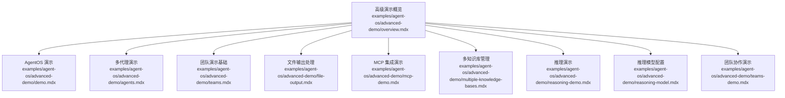
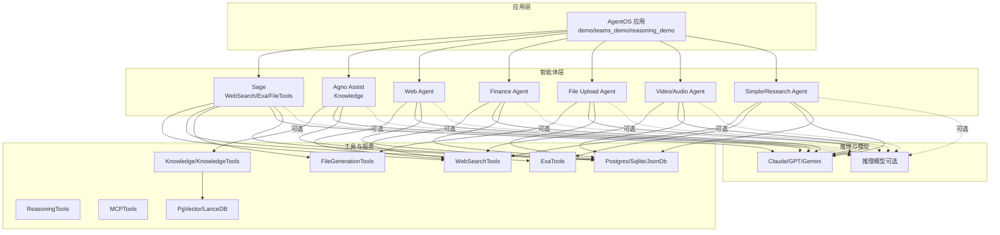
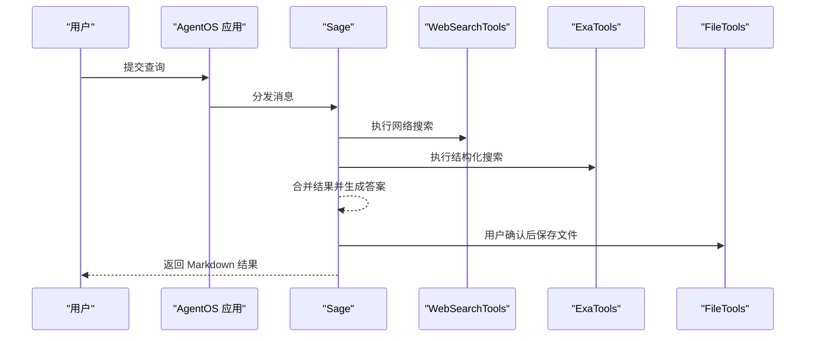
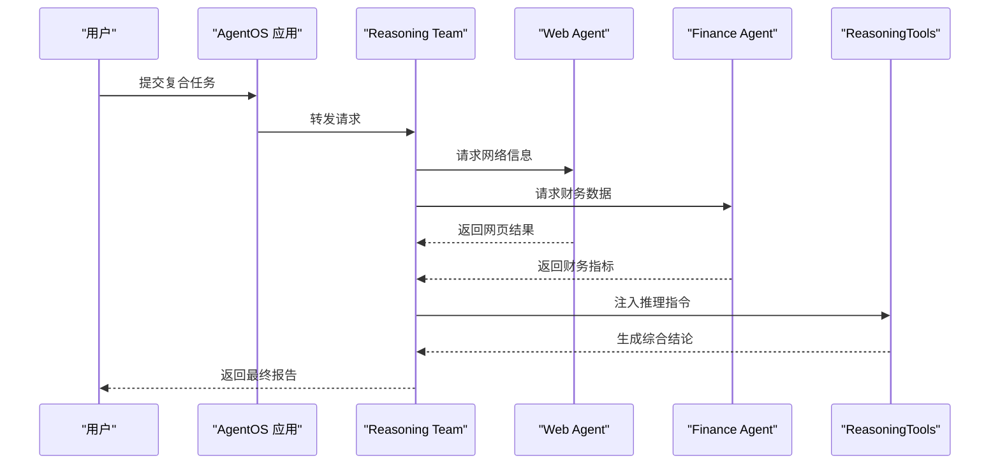
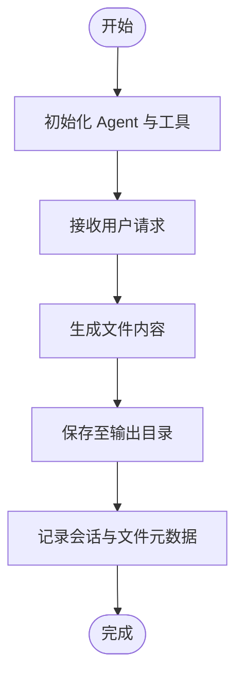
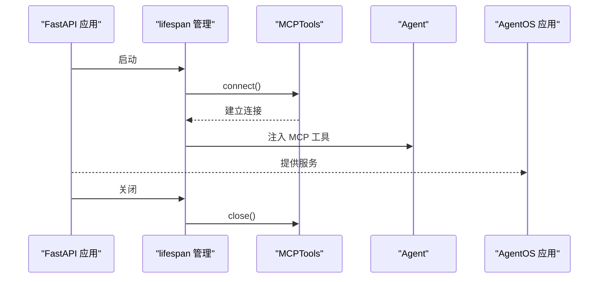
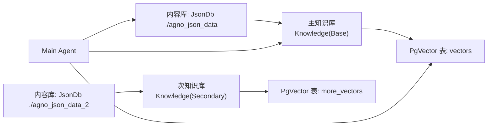
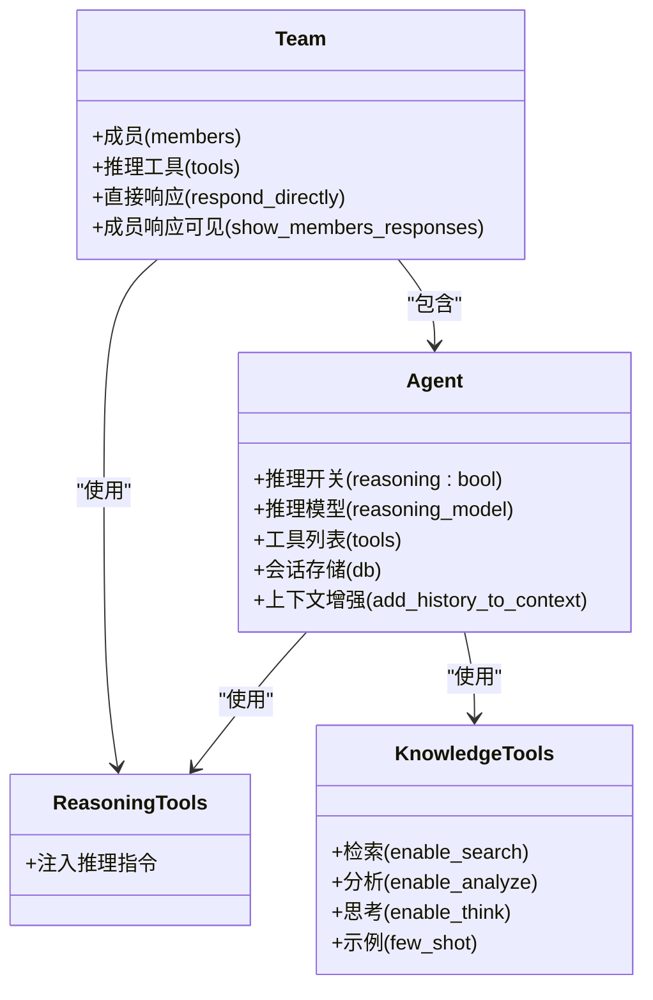
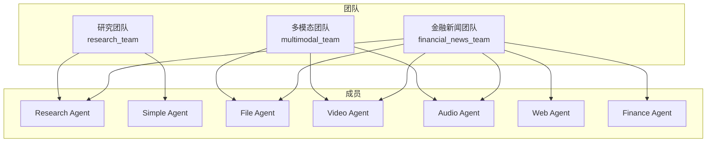
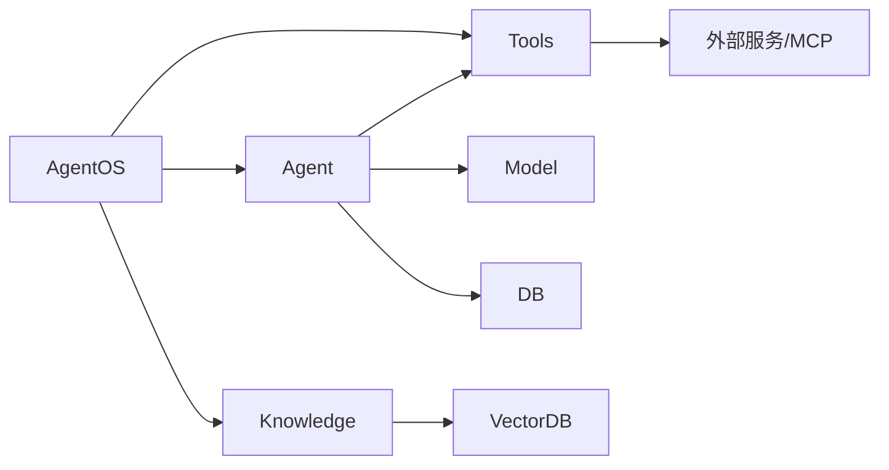

# 高级演示示例

<cite>
**本文引用的文件**
- [examples/agent-os/advanced-demo/overview.mdx](file://examples/agent-os/advanced-demo/overview.mdx)
- [examples/agent-os/advanced-demo/demo.mdx](file://examples/agent-os/advanced-demo/demo.mdx)
- [examples/agent-os/advanced-demo/agents.mdx](file://examples/agent-os/advanced-demo/agents.mdx)
- [examples/agent-os/advanced-demo/teams.mdx](file://examples/agent-os/advanced-demo/teams.mdx)
- [examples/agent-os/advanced-demo/file-output.mdx](file://examples/agent-os/advanced-demo/file-output.mdx)
- [examples/agent-os/advanced-demo/mcp-demo.mdx](file://examples/agent-os/advanced-demo/mcp-demo.mdx)
- [examples/agent-os/advanced-demo/multiple-knowledge-bases.mdx](file://examples/agent-os/advanced-demo/multiple-knowledge-bases.mdx)
- [examples/agent-os/advanced-demo/reasoning-demo.mdx](file://examples/agent-os/advanced-demo/reasoning-demo.mdx)
- [examples/agent-os/advanced-demo/reasoning-model.mdx](file://examples/agent-os/advanced-demo/reasoning-model.mdx)
- [examples/agent-os/advanced-demo/teams-demo.mdx](file://examples/agent-os/advanced-demo/teams-demo.mdx)
</cite>

## 目录
1. [简介](#简介)
2. [项目结构](#项目结构)
3. [核心组件](#核心组件)
4. [架构总览](#架构总览)
5. [详细组件分析](#详细组件分析)
6. [依赖关系分析](#依赖关系分析)
7. [性能考虑](#性能考虑)
8. [故障排查指南](#故障排查指南)
9. [结论](#结论)
10. [附录](#附录)

## 简介
本技术文档聚焦于 AgentOS 的高级演示示例，系统性地解析多代理演示、文件输出处理、MCP 集成演示、多知识库管理、推理能力演示与推理模型配置、团队协作演示等复杂使用场景。文档从架构设计、数据流、处理逻辑、集成点、错误处理到性能优化与监控策略进行深入说明，并提供可直接落地的配置方法与最佳实践，帮助读者在生产环境中稳定高效地应用这些高级特性。

## 项目结构
高级演示示例位于 examples/agent-os/advanced-demo 目录下，包含多个独立示例模块，每个模块对应一个典型场景，便于按需学习与复用。整体以“示例概览”为入口，通过各子示例文件展示不同能力的组合与扩展。

图表来源
- [examples/agent-os/advanced-demo/overview.mdx:1-18](file://examples/agent-os/advanced-demo/overview.mdx#L1-L18)

章节来源
- [examples/agent-os/advanced-demo/overview.mdx:1-18](file://examples/agent-os/advanced-demo/overview.mdx#L1-L18)

## 核心组件
- AgentOS 应用容器：统一注册与托管 Agent、Team、工具与数据库连接，提供服务化入口。
- Agent：具备模型、工具、知识库、会话存储、上下文增强与记忆更新等能力。
- Team：多 Agent 协作编排，支持成员响应可见性、指令注入、直接响应等模式。
- 工具链：Web 搜索、Exa、文件生成、Reasoning、MCP 等工具，支撑多样化任务。
- 知识库与向量库：支持多种内容存储与向量存储后端，实现检索增强生成（RAG）。
- 推理能力：内置推理开关与推理模型配置，支持链式思考与思维预算控制。
- 文件输出：通过文件生成工具与会话存储，实现结构化结果落盘与访问。

章节来源
- [examples/agent-os/advanced-demo/demo.mdx:23-61](file://examples/agent-os/advanced-demo/demo.mdx#L23-L61)
- [examples/agent-os/advanced-demo/agents.mdx:126-177](file://examples/agent-os/advanced-demo/agents.mdx#L126-L177)
- [examples/agent-os/advanced-demo/teams.mdx:47-58](file://examples/agent-os/advanced-demo/teams.mdx#L47-L58)
- [examples/agent-os/advanced-demo/file-output.mdx:23-45](file://examples/agent-os/advanced-demo/file-output.mdx#L23-L45)
- [examples/agent-os/advanced-demo/mcp-demo.mdx:67-98](file://examples/agent-os/advanced-demo/mcp-demo.mdx#L67-L98)
- [examples/agent-os/advanced-demo/multiple-knowledge-bases.mdx:34-56](file://examples/agent-os/advanced-demo/multiple-knowledge-bases.mdx#L34-L56)
- [examples/agent-os/advanced-demo/reasoning-demo.mdx:27-154](file://examples/agent-os/advanced-demo/reasoning-demo.mdx#L27-L154)
- [examples/agent-os/advanced-demo/reasoning-model.mdx:25-54](file://examples/agent-os/advanced-demo/reasoning-model.mdx#L25-L54)
- [examples/agent-os/advanced-demo/teams-demo.mdx:123-180](file://examples/agent-os/advanced-demo/teams-demo.mdx#L123-L180)

## 架构总览
下图展示了高级演示中各组件的交互关系与数据流向，体现从请求进入、Agent/Team 处理、工具调用、知识检索、推理计算到结果输出的整体流程。

图表来源
- [examples/agent-os/advanced-demo/agents.mdx:126-177](file://examples/agent-os/advanced-demo/agents.mdx#L126-L177)
- [examples/agent-os/advanced-demo/teams.mdx:27-58](file://examples/agent-os/advanced-demo/teams.mdx#L27-L58)
- [examples/agent-os/advanced-demo/teams-demo.mdx:123-180](file://examples/agent-os/advanced-demo/teams-demo.mdx#L123-L180)
- [examples/agent-os/advanced-demo/reasoning-demo.mdx:27-154](file://examples/agent-os/advanced-demo/reasoning-demo.mdx#L27-L154)
- [examples/agent-os/advanced-demo/reasoning-model.mdx:25-54](file://examples/agent-os/advanced-demo/reasoning-model.mdx#L25-L54)
- [examples/agent-os/advanced-demo/mcp-demo.mdx:67-98](file://examples/agent-os/advanced-demo/mcp-demo.mdx#L67-L98)
- [examples/agent-os/advanced-demo/file-output.mdx:23-45](file://examples/agent-os/advanced-demo/file-output.mdx#L23-L45)
- [examples/agent-os/advanced-demo/multiple-knowledge-bases.mdx:34-56](file://examples/agent-os/advanced-demo/multiple-knowledge-bases.mdx#L34-L56)

## 详细组件分析

### 多代理演示（Agents）
该示例构建了两个 Agent：Sage 与 Agno Assist，分别用于综合搜索与问答、以及基于知识库的检索增强回答。Sage 配置了历史上下文增强、时间与名称注入、Markdown 输出与文件保存工具；Agno Assist 则通过 Knowledge 绑定内容与向量数据库，实现 RAG 能力。

图表来源
- [examples/agent-os/advanced-demo/agents.mdx:126-177](file://examples/agent-os/advanced-demo/agents.mdx#L126-L177)

章节来源
- [examples/agent-os/advanced-demo/agents.mdx:126-177](file://examples/agent-os/advanced-demo/agents.mdx#L126-L177)

### 团队演示（基础）
该示例定义了 Web Agent 与 Finance Agent，并由 Reasoning Team 进行协调，启用推理工具与成员响应可见性，适合需要跨领域协作的任务编排。

图表来源
- [examples/agent-os/advanced-demo/teams.mdx:27-58](file://examples/agent-os/advanced-demo/teams.mdx#L27-L58)

章节来源
- [examples/agent-os/advanced-demo/teams.mdx:27-58](file://examples/agent-os/advanced-demo/teams.mdx#L27-L58)

### 文件输出处理
该示例通过文件生成工具与 SQLite 存储，实现结构化输出的自动生成与访问，适用于报告导出、日志归档等场景。

图表来源
- [examples/agent-os/advanced-demo/file-output.mdx:23-45](file://examples/agent-os/advanced-demo/file-output.mdx#L23-L45)

章节来源
- [examples/agent-os/advanced-demo/file-output.mdx:23-45](file://examples/agent-os/advanced-demo/file-output.mdx#L23-L45)

### MCP 集成演示
该示例通过 FastAPI 生命周期管理 MCP 连接，动态注入 MCP 工具到 Agent，实现与外部 MCP 服务器（如 GitHub）的交互，适合需要扩展工具生态的场景。

图表来源
- [examples/agent-os/advanced-demo/mcp-demo.mdx:49-64](file://examples/agent-os/advanced-demo/mcp-demo.mdx#L49-L64)
- [examples/agent-os/advanced-demo/mcp-demo.mdx:67-98](file://examples/agent-os/advanced-demo/mcp-demo.mdx#L67-L98)

章节来源
- [examples/agent-os/advanced-demo/mcp-demo.mdx:34-64](file://examples/agent-os/advanced-demo/mcp-demo.mdx#L34-L64)
- [examples/agent-os/advanced-demo/mcp-demo.mdx:67-98](file://examples/agent-os/advanced-demo/mcp-demo.mdx#L67-L98)

### 多知识库管理
该示例在同一 AgentOS 中配置多个知识库与向量库，支持不同来源的内容与向量表，满足多源异构知识的统一检索与问答。

图表来源
- [examples/agent-os/advanced-demo/multiple-knowledge-bases.mdx:34-56](file://examples/agent-os/advanced-demo/multiple-knowledge-bases.mdx#L34-L56)

章节来源
- [examples/agent-os/advanced-demo/multiple-knowledge-bases.mdx:34-56](file://examples/agent-os/advanced-demo/multiple-knowledge-bases.mdx#L34-L56)

### 推理演示与推理模型配置
该示例展示了多种推理方式：链式思考（COT）、推理模型（独立推理引擎）、推理工具（注入指令）、知识工具（结合检索与思考），并演示了团队层面的推理协作。

图表来源
- [examples/agent-os/advanced-demo/reasoning-demo.mdx:27-154](file://examples/agent-os/advanced-demo/reasoning-demo.mdx#L27-L154)
- [examples/agent-os/advanced-demo/reasoning-model.mdx:25-54](file://examples/agent-os/advanced-demo/reasoning-model.mdx#L25-L54)

章节来源
- [examples/agent-os/advanced-demo/reasoning-demo.mdx:27-154](file://examples/agent-os/advanced-demo/reasoning-demo.mdx#L27-L154)
- [examples/agent-os/advanced-demo/reasoning-model.mdx:25-54](file://examples/agent-os/advanced-demo/reasoning-model.mdx#L25-L54)

### 团队协作演示（多模态与新闻）
该示例构建了研究团队、多模态团队与金融新闻团队，覆盖文件理解、音视频理解、网络研究、财务分析等多场景，支持直接响应与成员转发、日期时间上下文注入与预期输出约束。

图表来源
- [examples/agent-os/advanced-demo/teams-demo.mdx:123-180](file://examples/agent-os/advanced-demo/teams-demo.mdx#L123-L180)

章节来源
- [examples/agent-os/advanced-demo/teams-demo.mdx:123-180](file://examples/agent-os/advanced-demo/teams-demo.mdx#L123-L180)

## 依赖关系分析
- 组件内聚：每个示例文件聚焦单一主题，内部组件职责清晰，耦合度低，便于独立运行与调试。
- 组件耦合：AgentOS 作为统一容器，向上提供服务入口，向下依赖模型、工具、数据库与知识库。
- 外部依赖：MCP 示例依赖外部 MCP 服务器；推理示例依赖不同模型；知识库示例依赖向量数据库与内容存储。
- 循环依赖：未见循环导入或运行时循环调用；生命周期管理（FastAPI lifespan）确保资源正确释放。

图表来源
- [examples/agent-os/advanced-demo/demo.mdx:23-61](file://examples/agent-os/advanced-demo/demo.mdx#L23-L61)
- [examples/agent-os/advanced-demo/mcp-demo.mdx:49-64](file://examples/agent-os/advanced-demo/mcp-demo.mdx#L49-L64)

章节来源
- [examples/agent-os/advanced-demo/demo.mdx:23-61](file://examples/agent-os/advanced-demo/demo.mdx#L23-L61)
- [examples/agent-os/advanced-demo/mcp-demo.mdx:49-64](file://examples/agent-os/advanced-demo/mcp-demo.mdx#L49-L64)

## 性能考虑
- 上下文压缩与历史长度：合理设置历史轮次与上下文注入项，避免 Token 消耗过高。
- 工具调用并发：对网络类工具（WebSearch、Exa）进行超时与重试策略配置，避免阻塞。
- 向量检索优化：选择合适的向量库与检索参数（如 hybrid 混合检索），平衡召回与速度。
- 推理成本控制：推理模型与思维预算需与业务 SLA 对齐，必要时开启流式输出与中断机制。
- 数据库存取：批量写入与索引优化，减少高频查询带来的延迟。
- 缓存与预热：对常用知识片段与工具结果进行缓存，缩短响应时间。

## 故障排查指南
- MCP 连接失败：检查环境变量与命令路径，确认 MCP 服务器可用；在 FastAPI 生命周期中正确建立与关闭连接。
- 知识库检索异常：验证向量表存在与嵌入维度一致，检查内容库路径与权限。
- 推理输出为空：确认推理开关与推理模型配置正确，检查思维预算是否过小。
- 文件输出路径错误：核对输出目录权限与相对路径，确保会话存储可写。
- 团队成员无响应：检查成员角色与转发规则，确认直接响应与成员可见性配置。

章节来源
- [examples/agent-os/advanced-demo/mcp-demo.mdx:38-45](file://examples/agent-os/advanced-demo/mcp-demo.mdx#L38-L45)
- [examples/agent-os/advanced-demo/reasoning-model.mdx:25-54](file://examples/agent-os/advanced-demo/reasoning-model.mdx#L25-L54)
- [examples/agent-os/advanced-demo/file-output.mdx:23-45](file://examples/agent-os/advanced-demo/file-output.mdx#L23-L45)
- [examples/agent-os/advanced-demo/teams-demo.mdx:166-173](file://examples/agent-os/advanced-demo/teams-demo.mdx#L166-L173)

## 结论
高级演示示例系统性地覆盖了 AgentOS 在复杂场景下的关键能力：多代理协作、文件输出、MCP 扩展、多知识库、推理增强与团队编排。通过合理的架构设计、工具与模型配置、上下文与记忆管理，以及性能与稳定性保障，可在生产环境中实现高可靠、可扩展的智能体系统。

## 附录
- 快速启动：参考各示例文件中的运行步骤，准备虚拟环境与依赖安装脚本。
- 配置清单：根据场景选择合适的模型、工具、数据库与向量库，明确推理与上下文策略。
- 监控建议：接入可观测性平台，关注请求延迟、Token 使用、工具调用成功率与错误率。