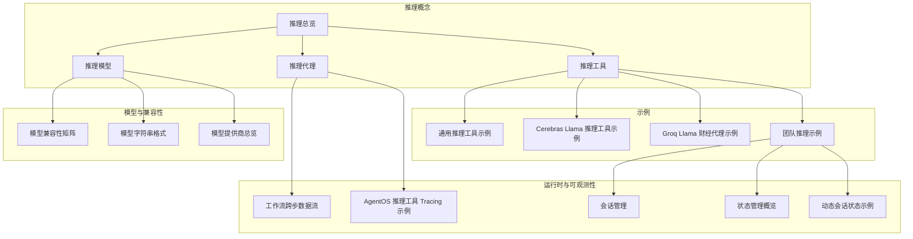
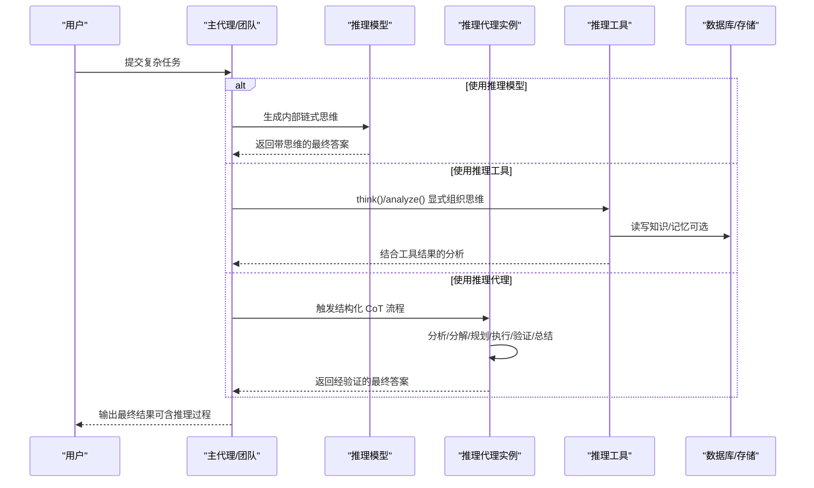
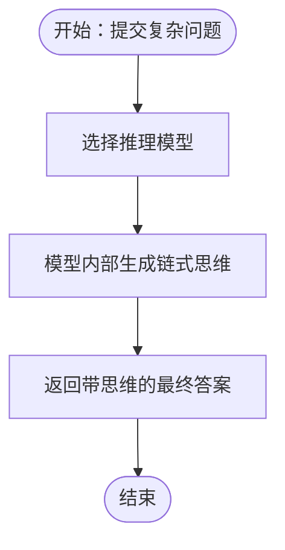
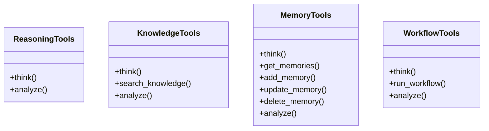
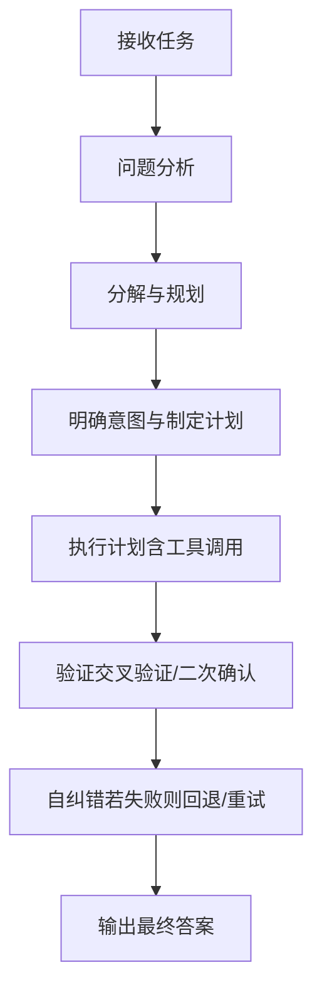
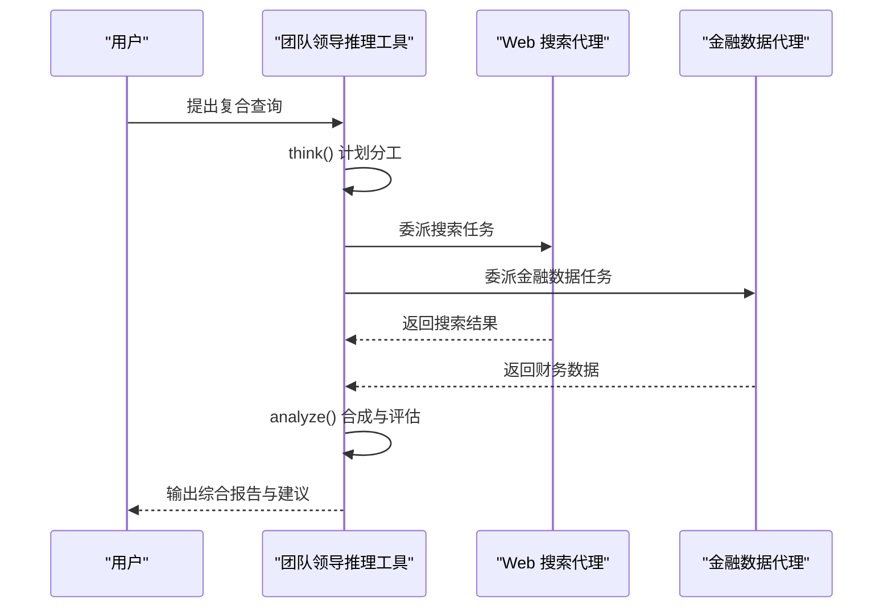
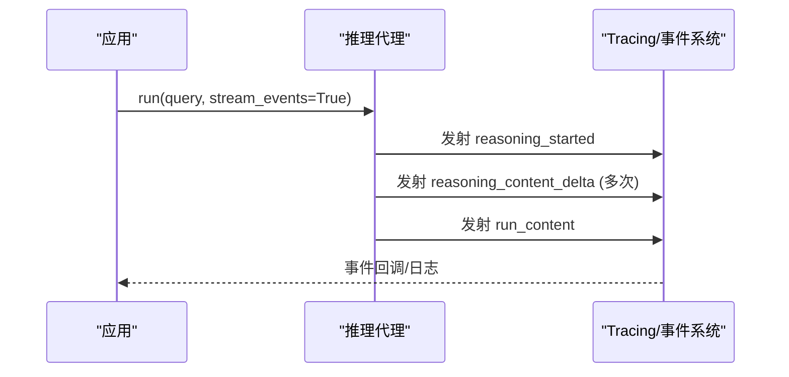
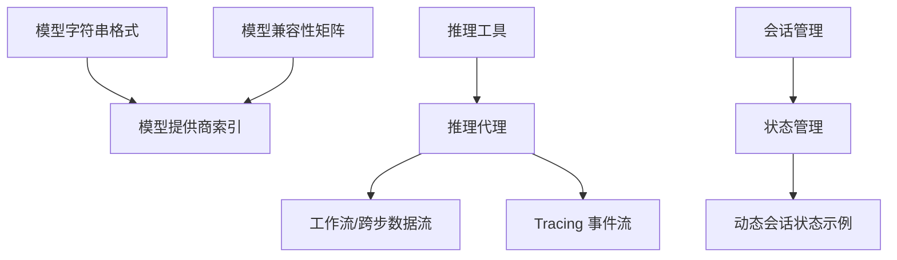

# 推理代理示例

<cite>
**本文引用的文件**
- [推理总览](file://reasoning/overview.mdx)
- [推理模型](file://reasoning/reasoning-models.mdx)
- [推理代理](file://reasoning/reasoning-agents.mdx)
- [推理工具](file://reasoning/reasoning-tools.mdx)
- [推理工具示例：通用](file://examples/reasoning/tools/reasoning-tools.mdx)
- [推理工具示例：Cerebras Llama](file://examples/reasoning/tools/cerebras-llama-reasoning-tools.mdx)
- [推理工具示例：Groq Llama 财经代理](file://examples/reasoning/tools/groq-llama-finance-agent.mdx)
- [团队推理示例](file://cookbook/teams/reasoning_team.mdx)
- [会话管理](file://sessions/session-management.mdx)
- [状态管理概览](file://state/overview.mdx)
- [动态会话状态示例](file://examples/agents/state-and-session/dynamic-session-state.mdx)
- [模型兼容性矩阵](file://models/compatibility.mdx)
- [模型字符串格式](file://models/model-as-string.mdx)
- [模型提供商总览](file://cookbook/models/overview.mdx)
- [工作流访问前一步输出](file://workflows/usage/access-multiple-previous-steps-output.mdx)
- [Tracing：推理工具示例（AgentOS）](file://examples/agent-os/tracing/agent-with-reasoning-tools-tracing.mdx)
- [Tracing：推理工具示例（AgentOS 使用指南）](file://agent-os/tracing/usage/agent-with-reasoning-tools-tracing.mdx)
</cite>

## 目录
1. [简介](#简介)
2. [项目结构](#项目结构)
3. [核心组件](#核心组件)
4. [架构总览](#架构总览)
5. [详细组件分析](#详细组件分析)
6. [依赖关系分析](#依赖关系分析)
7. [性能考量](#性能考量)
8. [故障排查指南](#故障排查指南)
9. [结论](#结论)
10. [附录](#附录)

## 简介
本文件面向“推理代理示例”的完整落地文档，系统讲解如何在多模型与多场景下构建与配置推理代理，涵盖默认链式思维（Chain-of-Thought, CoT）、推理过程捕获、数学问题求解、逻辑推理、科学分析、金融与市场研究等典型应用，并对多种推理模型（Cerebras Llama、DeepSeek、Gemini、Groq、Mistral、Ollama、OpenAI 等）进行能力对比与选型建议。同时提供状态管理与结果优化策略，帮助读者实现从基础到高级的复杂推理任务。

## 项目结构
围绕“推理”主题，相关知识与示例分布在以下模块：
- 推理概念与三种路径：模型原生推理、显式推理工具、推理代理（结构化 CoT）
- 具体示例：通用推理工具、Cerebras Llama 推理工具、Groq Llama 财经代理、团队推理协作
- 模型层：模型兼容性、模型字符串格式、模型提供商索引
- 工作流与会话：跨步骤数据流、会话命名与缓存、状态持久化
- 可观测性：推理事件流与 Tracing 集成

**图表来源**
- [推理总览](file://reasoning/overview.mdx)
- [推理模型](file://reasoning/reasoning-models.mdx)
- [推理代理](file://reasoning/reasoning-agents.mdx)
- [推理工具](file://reasoning/reasoning-tools.mdx)
- [通用推理工具示例](file://examples/reasoning/tools/reasoning-tools.mdx)
- [Cerebras Llama 推理工具示例](file://examples/reasoning/tools/cerebras-llama-reasoning-tools.mdx)
- [Groq Llama 财经代理示例](file://examples/reasoning/tools/groq-llama-finance-agent.mdx)
- [团队推理示例](file://cookbook/teams/reasoning_team.mdx)
- [模型兼容性矩阵](file://models/compatibility.mdx)
- [模型字符串格式](file://models/model-as-string.mdx)
- [模型提供商总览](file://cookbook/models/overview.mdx)
- [工作流跨步数据流](file://workflows/usage/access-multiple-previous-steps-output.mdx)
- [会话管理](file://sessions/session-management.mdx)
- [状态管理概览](file://state/overview.mdx)
- [动态会话状态示例](file://examples/agents/state-and-session/dynamic-session-state.mdx)
- [AgentOS 推理工具 Tracing 示例](file://examples/agent-os/tracing/agent-with-reasoning-tools-tracing.mdx)

**章节来源**
- [推理总览](file://reasoning/overview.mdx)
- [模型兼容性矩阵](file://models/compatibility.mdx)
- [模型字符串格式](file://models/model-as-string.mdx)
- [模型提供商总览](file://cookbook/models/overview.mdx)

## 核心组件
- 推理模型（Reasoning Models）
  - 特点：模型内部生成长链式思维再输出，适合单次复杂任务（数学、编码、物理）。
  - 优势：无需额外工具，直接调用即可；可与响应模型分离以获得更好的自然语言输出。
  - 示例：OpenAI gpt-5、Claude 扩展思考模式、Gemini Thinking、DeepSeek-R1 等。
- 推理工具（Reasoning Tools）
  - 特点：为任意模型注入显式的“思考/分析”工具，按需决定何时思考、何时行动。
  - 适用：非推理模型、需要透明推理过程、结构化研究与分析。
  - 工具集：通用 ReasoningTools、知识库检索 KnowledgeTools、记忆 MemoryTools、工作流 WorkflowTools。
- 推理代理（Reasoning Agents）
  - 特点：通过结构化 CoT 强制任何模型进行系统化思考、工具调用与自校验。
  - 适用：多步骤工具调用、需要自动链式思维与迭代修正的任务。
  - 关键参数：最小/最大推理步数、是否显示完整推理过程、事件流捕获。

**章节来源**
- [推理模型](file://reasoning/reasoning-models.mdx)
- [推理工具](file://reasoning/reasoning-tools.mdx)
- [推理代理](file://reasoning/reasoning-agents.mdx)

## 架构总览
推理代理在不同路径下的交互流程如下：

**图表来源**
- [推理模型](file://reasoning/reasoning-models.mdx)
- [推理工具](file://reasoning/reasoning-tools.mdx)
- [推理代理](file://reasoning/reasoning-agents.mdx)

## 详细组件分析

### 组件A：推理模型（Reasoning Models）
- 适用场景
  - 单次复杂问题（数学、编码、物理）
  - 不需要频繁工具调用的场景
  - 对模型内置推理能力有信任度的场景
- 实践要点
  - 可与响应模型分离：推理模型专注解题，响应模型负责自然语言输出
  - 支持推理内容流式输出与事件捕获，便于前端可视化与调试
- 示例参考
  - [推理模型示例（gpt-5、DeepSeek-R1、Claude 思考模式）](file://reasoning/reasoning-models.mdx)

**图表来源**
- [推理模型](file://reasoning/reasoning-models.mdx)

**章节来源**
- [推理模型](file://reasoning/reasoning-models.mdx)

### 组件B：推理工具（Reasoning Tools）
- 四大工具包
  - ReasoningTools：通用思考与分析
  - KnowledgeTools：结合知识库检索
  - MemoryTools：用户记忆 CRUD
  - WorkflowTools：工作流执行与分析
- 核心循环：Think → Act（域特定动作）→ Analyze → Repeat
- 适用场景
  - 需要透明推理过程
  - 研究、分析、探索性任务
  - 多轮迭代与外部信息验证
- 示例参考
  - [通用推理工具示例](file://examples/reasoning/tools/reasoning-tools.mdx)
  - [Cerebras Llama 推理工具示例](file://examples/reasoning/tools/cerebras-llama-reasoning-tools.mdx)
  - [Groq Llama 财经代理示例](file://examples/reasoning/tools/groq-llama-finance-agent.mdx)

**图表来源**
- [推理工具](file://reasoning/reasoning-tools.mdx)

**章节来源**
- [推理工具](file://reasoning/reasoning-tools.mdx)
- [通用推理工具示例](file://examples/reasoning/tools/reasoning-tools.mdx)
- [Cerebras Llama 推理工具示例](file://examples/reasoning/tools/cerebras-llama-reasoning-tools.mdx)
- [Groq Llama 财经代理示例](file://examples/reasoning/tools/groq-llama-finance-agent.mdx)

### 组件C：推理代理（Reasoning Agents）
- 核心框架（6步）
  - 问题分析 → 分解与规划 → 明确意图 → 执行计划 → 验证（强制）→ 最终答案
- 运行机制
  - 为任意模型创建独立推理实例，使用专门提示词驱动系统化思考
  - 可迭代（默认最多10步），支持工具调用、自纠错与置信度评分
- 配置与监控
  - 显示完整推理过程、事件流捕获、最小/最大推理步数控制
  - 适用于多步骤工具调用与需要自动化链式思维的任务
- 示例参考
  - [推理代理概览与示例](file://reasoning/reasoning-agents.mdx)

**图表来源**
- [推理代理](file://reasoning/reasoning-agents.mdx)

**章节来源**
- [推理代理](file://reasoning/reasoning-agents.mdx)

### 组件D：团队推理（Reasoning Team）
- 场景：组合多个专用代理（如网络搜索、金融数据），由团队领导使用推理工具进行协调与合成
- 关键点：可见的思考过程、成员响应展示、多源信息整合
- 示例参考
  - [团队推理示例](file://cookbook/teams/reasoning_team.mdx)

**图表来源**
- [团队推理示例](file://cookbook/teams/reasoning_team.mdx)

**章节来源**
- [团队推理示例](file://cookbook/teams/reasoning_team.mdx)

### 组件E：工作流与跨步数据流
- 在工作流中，后一步可访问前一步的输出，形成“多源信息融合 + 推理聚合”的闭环
- 示例参考
  - [工作流访问前一步输出](file://workflows/usage/access-multiple-previous-steps-output.mdx)

**图表来源**
- [工作流访问前一步输出](file://workflows/usage/access-multiple-previous-steps-output.mdx)

**章节来源**
- [工作流访问前一步输出](file://workflows/usage/access-multiple-previous-steps-output.mdx)

### 组件F：可观测性与推理事件流（Tracing）
- 支持推理事件流（reasoning_started、reasoning_content_delta、run_content 等），便于前端实时展示与后端日志记录
- 示例参考
  - [AgentOS 推理工具 Tracing 示例](file://examples/agent-os/tracing/agent-with-reasoning-tools-tracing.mdx)
  - [AgentOS Tracing 使用指南](file://agent-os/tracing/usage/agent-with-reasoning-tools-tracing.mdx)

**图表来源**
- [AgentOS 推理工具 Tracing 示例](file://examples/agent-os/tracing/agent-with-reasoning-tools-tracing.mdx)
- [AgentOS Tracing 使用指南](file://agent-os/tracing/usage/agent-with-reasoning-tools-tracing.mdx)

**章节来源**
- [AgentOS 推理工具 Tracing 示例](file://examples/agent-os/tracing/agent-with-reasoning-tools-tracing.mdx)
- [AgentOS Tracing 使用指南](file://agent-os/tracing/usage/agent-with-reasoning-tools-tracing.mdx)

## 依赖关系分析
- 模型层
  - 模型字符串格式统一了提供商与模型标识，便于切换与迁移
  - 兼容性矩阵明确了各提供商对推理能力的支持情况
- 工具与代理
  - ReasoningTools 作为通用“思考/分析”基座，可与其他工具包组合使用
  - 推理代理与推理工具互为补充：前者强调自动化结构化思维，后者强调显式控制与透明度
- 会话与状态
  - 会话管理提供 session_id、命名与缓存策略
  - 状态管理支持 session_state 的初始化、访问、更新与持久化，配合工具钩子实现动态状态

**图表来源**
- [模型字符串格式](file://models/model-as-string.mdx)
- [模型兼容性矩阵](file://models/compatibility.mdx)
- [模型提供商总览](file://cookbook/models/overview.mdx)
- [推理工具](file://reasoning/reasoning-tools.mdx)
- [推理代理](file://reasoning/reasoning-agents.mdx)
- [工作流访问前一步输出](file://workflows/usage/access-multiple-previous-steps-output.mdx)
- [AgentOS 推理工具 Tracing 示例](file://examples/agent-os/tracing/agent-with-reasoning-tools-tracing.mdx)
- [会话管理](file://sessions/session-management.mdx)
- [状态管理概览](file://state/overview.mdx)
- [动态会话状态示例](file://examples/agents/state-and-session/dynamic-session-state.mdx)

**章节来源**
- [模型字符串格式](file://models/model-as-string.mdx)
- [模型兼容性矩阵](file://models/compatibility.mdx)
- [模型提供商总览](file://cookbook/models/overview.mdx)
- [推理工具](file://reasoning/reasoning-tools.mdx)
- [推理代理](file://reasoning/reasoning-agents.mdx)
- [工作流访问前一步输出](file://workflows/usage/access-multiple-previous-steps-output.mdx)
- [AgentOS 推理工具 Tracing 示例](file://examples/agent-os/tracing/agent-with-reasoning-tools-tracing.mdx)
- [会话管理](file://sessions/session-management.mdx)
- [状态管理概览](file://state/overview.mdx)
- [动态会话状态示例](file://examples/agents/state-and-session/dynamic-session-state.mdx)

## 性能考量
- 会话缓存
  - 在同一会话内多次运行时启用缓存可减少数据库往返，提升延迟敏感场景的体验
  - 注意：仅用于开发测试，不推荐生产使用
- 推理步数控制
  - 通过最小/最大推理步数平衡准确性与成本
  - 对简单问题可降低最大步数，复杂任务逐步增加
- 推理事件流
  - 启用事件流有助于前端实时反馈，但会带来额外的事件处理开销
- 模型选择
  - 推理模型与响应模型分离可兼顾准确性和自然语言质量
  - 对于本地或低资源环境，优先考虑 Ollama/Mistral/Groq 等轻量方案

[本节为通用指导，不直接分析具体文件]

## 故障排查指南
- 无法看到推理过程
  - 检查是否开启显示完整推理过程与事件流
  - 参考：推理代理显示选项与事件捕获
- 推理过深或过浅
  - 调整最小/最大推理步数，观察实际使用步数并优化
- 会话状态未生效
  - 确认 session_id、user_id 设置正确，检查状态更新钩子与持久化配置
- 事件流无输出
  - 确认 stream_events=True 且 Tracing 已启用
- 多工具包冲突
  - 同名 think/analyze 函数会被覆盖，需禁用重复项或自定义函数名

**章节来源**
- [推理代理](file://reasoning/reasoning-agents.mdx)
- [会话管理](file://sessions/session-management.mdx)
- [状态管理概览](file://state/overview.mdx)
- [动态会话状态示例](file://examples/agents/state-and-session/dynamic-session-state.mdx)
- [AgentOS 推理工具 Tracing 示例](file://examples/agent-os/tracing/agent-with-reasoning-tools-tracing.mdx)

## 结论
通过“推理模型 + 推理工具 + 推理代理”的组合，可以在不同场景下灵活地实现从单次复杂问题到多步骤工具调用与团队协作的全栈推理能力。配合会话与状态管理、工作流跨步数据流以及 Tracing 事件流，可以构建具备透明度、可控性与可扩展性的推理系统。针对不同提供商（OpenAI、Gemini、Groq、Mistral、Ollama、Cerebras、DeepSeek 等），应依据任务特性与资源约束选择合适的模型与配置策略。

[本节为总结性内容，不直接分析具体文件]

## 附录

### A. 不同推理模型能力对比与选型建议
- OpenAI（gpt-5、o1 系列）
  - 优势：强大的单次推理能力、思维链质量高
  - 适用：数学、编码、物理等复杂单次任务
  - 建议：与响应模型分离，获得更自然的输出
- Google（Gemini Thinking）
  - 优势：多模态与思考模式结合
  - 适用：需要视觉/文本混合分析的任务
- Groq（Llama Scout 等）
  - 优势：推理速度极快
  - 适用：实时财经分析、快速迭代
- Mistral（Mistral Large 等）
  - 优势：性价比高、推理稳健
  - 适用：中小规模推理任务与本地部署
- Ollama（本地 LLM）
  - 优势：隐私可控、离线可用
  - 适用：本地化与合规要求高的场景
- Cerebras（Llama 系列）
  - 优势：推理能力强、适合复杂逻辑
  - 适用：逻辑谜题、深度分析
- DeepSeek（DeepSeek-R1）
  - 优势：强推理能力
  - 适用：复杂问题求解；建议与自然语言响应模型搭配

**章节来源**
- [模型兼容性矩阵](file://models/compatibility.mdx)
- [模型字符串格式](file://models/model-as-string.mdx)
- [模型提供商总览](file://cookbook/models/overview.mdx)
- [推理模型](file://reasoning/reasoning-models.mdx)

### B. 应用场景与最佳实践清单
- 数学与逻辑推理
  - 使用推理代理或推理模型，开启完整推理过程展示
  - 示例参考：[推理代理](file://reasoning/reasoning-agents.mdx)
- 科学研究与论文评估
  - 使用推理工具 + 知识库检索，确保证据链与来源标注
  - 示例参考：[推理工具](file://reasoning/reasoning-tools.mdx)
- 金融分析与投资决策
  - 使用团队推理 + 外部数据源（Exa、DuckDuckGo），表格化呈现
  - 示例参考：[团队推理示例](file://cookbook/teams/reasoning_team.mdx)
- 哲学思辨与伦理评估
  - 使用推理工具的 think/analyze 循环，明确假设与权衡
  - 示例参考：[通用推理工具示例](file://examples/reasoning/tools/reasoning-tools.mdx)
- 学术研究与文献综述
  - 使用 KnowledgeTools + 推理工具，迭代搜索与评估
  - 示例参考：[推理工具](file://reasoning/reasoning-tools.mdx)

**章节来源**
- [推理代理](file://reasoning/reasoning-agents.mdx)
- [推理工具](file://reasoning/reasoning-tools.mdx)
- [团队推理示例](file://cookbook/teams/reasoning_team.mdx)
- [通用推理工具示例](file://examples/reasoning/tools/reasoning-tools.mdx)

### C. 状态管理与结果优化策略
- 会话管理
  - session_id 唯一标识，支持手动命名与自动生成
  - 缓存开关用于开发测试阶段的性能优化
- 状态管理
  - 初始化 session_state，工具中读写并持久化
  - 动态状态更新通过工具钩子实现，避免硬编码在提示词中
- 结果优化
  - 控制推理步数、启用事件流、使用 Markdown 表格化输出
  - 将推理模型与响应模型分离，提升可读性与专业度

**章节来源**
- [会话管理](file://sessions/session-management.mdx)
- [状态管理概览](file://state/overview.mdx)
- [动态会话状态示例](file://examples/agents/state-and-session/dynamic-session-state.mdx)
- [推理代理](file://reasoning/reasoning-agents.mdx)
- [推理工具](file://reasoning/reasoning-tools.mdx)