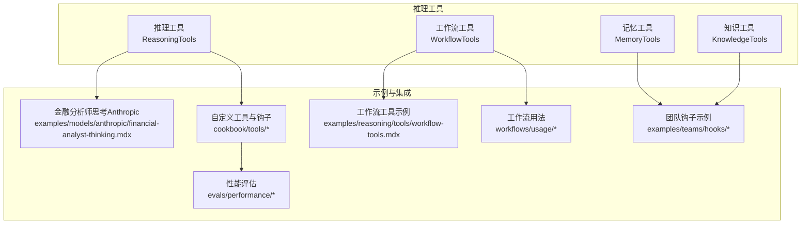
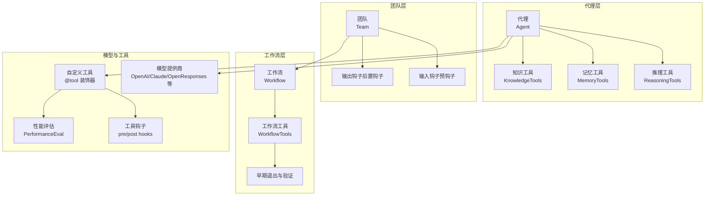
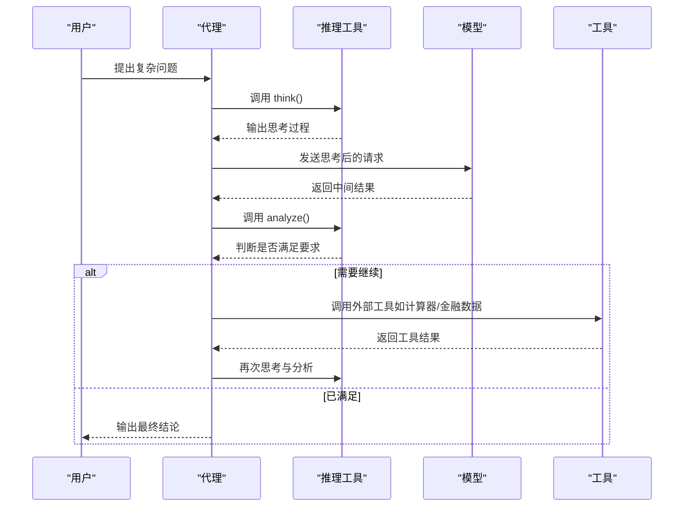
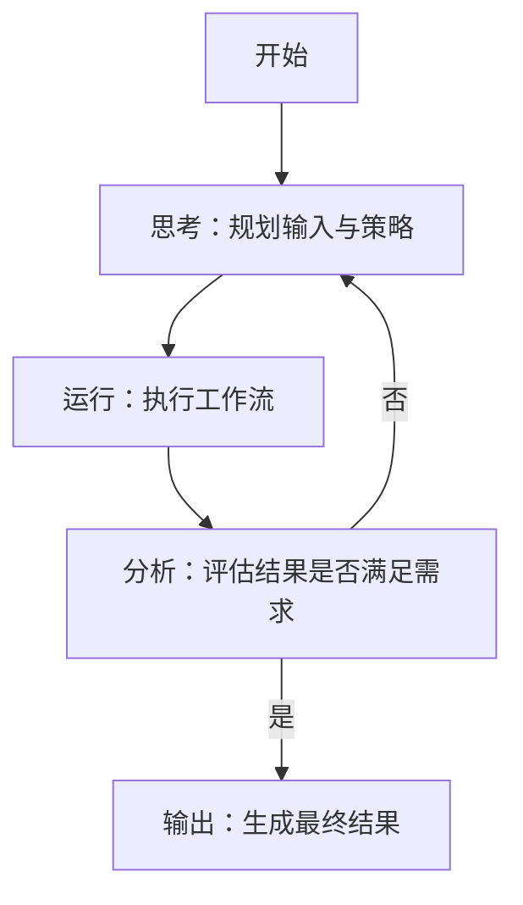
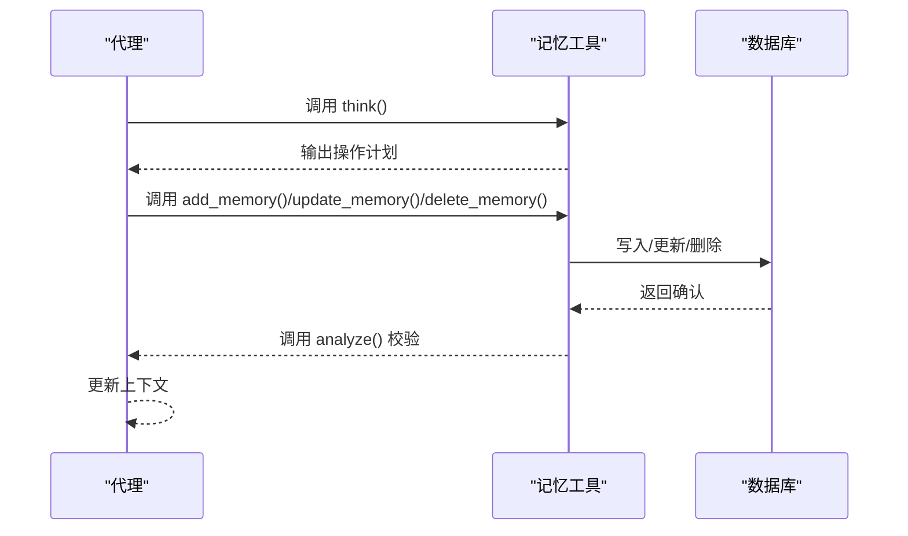
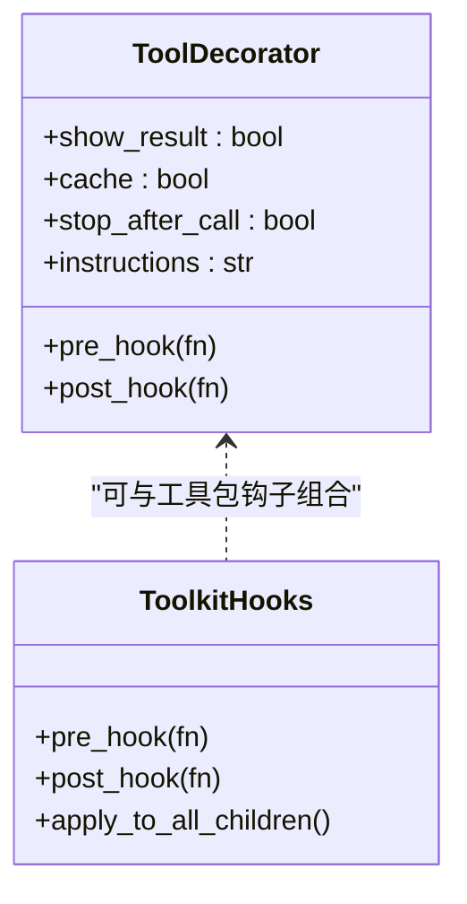
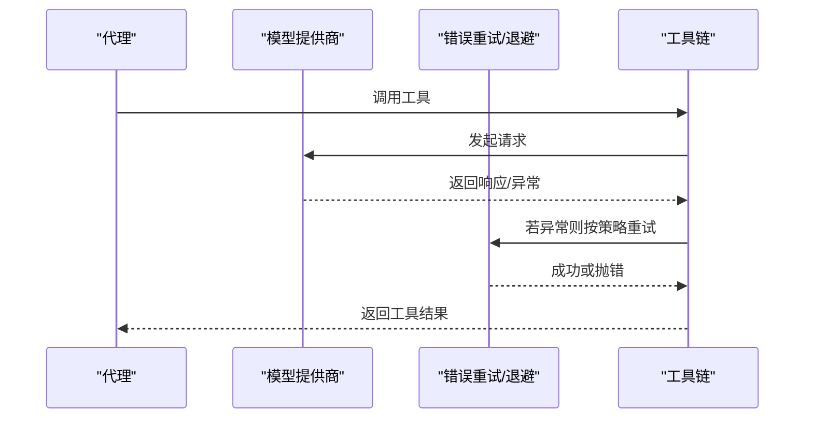
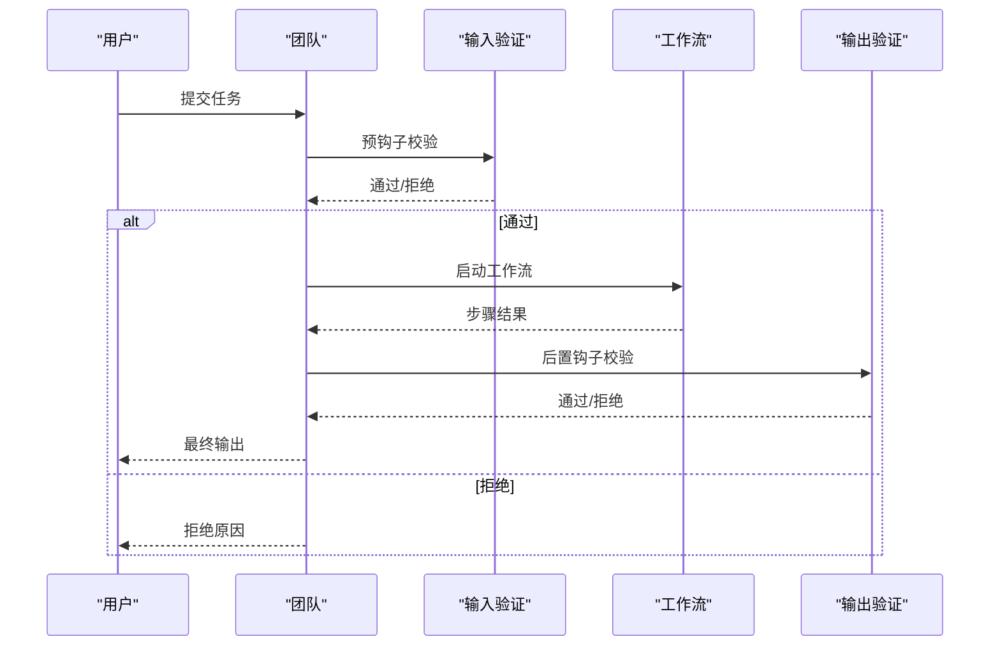
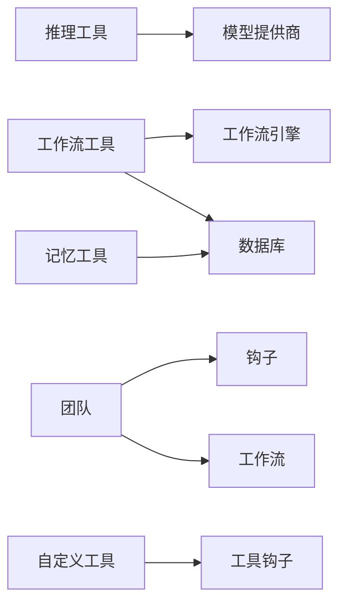

# 推理工具示例

<cite>
**本文引用的文件**
- [推理工具：推理工具](file://tools/reasoning_tools/reasoning-tools.mdx)
- [推理工具：工作流工具](file://tools/reasoning_tools/workflow-tools.mdx)
- [推理示例：工作流工具](file://examples/reasoning/tools/workflow-tools.mdx)
- [模型：Anthropic 金融分析师思考](file://examples/models/anthropic/financial-analyst-thinking.mdx)
- [工具：自定义工具](file://cookbook/tools/custom-tools.mdx)
- [工具钩子：工具钩子概览](file://cookbook/tools/tool-hooks.mdx)
- [工具钩子：工具包中的工具钩子](file://examples/tools/tool-hooks/tool-hook-in-toolkit.mdx)
- [性能评估：性能总览](file://evals/performance/overview.mdx)
- [性能评估：实例化带工具的性能](file://evals/performance/usage/performance-instantiation-with-tool.mdx)
- [模型：Open 响应](file://reference/models/open-responses.mdx)
- [模型：概览](file://models/overview.mdx)
- [工作流：提前停止工作流](file://workflows/usage/early-stop-workflow.mdx)
- [团队：输入钩子（预钩子）](file://examples/teams/hooks/pre-hook-input.mdx)
- [团队：输出钩子（后置钩子）](file://examples/teams/hooks/post-hook-output.mdx)
</cite>

## 目录
1. [引言](#引言)
2. [项目结构](#项目结构)
3. [核心组件](#核心组件)
4. [架构总览](#架构总览)
5. [详细组件分析](#详细组件分析)
6. [依赖关系分析](#依赖关系分析)
7. [性能考量](#性能考量)
8. [故障排查指南](#故障排查指南)
9. [结论](#结论)
10. [附录](#附录)

## 引言
本文件围绕“推理工具示例”主题，系统化梳理并实证说明如何在代理（Agent）、团队（Team）与工作流（Workflow）中构建与集成推理能力。重点覆盖以下方面：
- 推理工具：支持“思考-执行-分析”的循环，贯穿代理执行全过程，提升复杂问题求解成功率
- 知识工具：面向知识检索与管理的工具化能力
- 记忆工具：面向用户记忆的持久化与上下文管理
- 工作流工具：以“思考-运行-分析”闭环驱动工作流的执行与迭代
- 自定义推理工具：基于装饰器与钩子扩展领域能力（如金融分析、科学计算、逻辑推断）
- 模型提供商集成：统一接口适配多模型供应商，支持函数调用与思维令牌预算
- 工具调用优化：缓存、异步、钩子、早期退出与结果验证
- 使用模式：工具链组合、结果验证与错误处理

## 项目结构
本仓库提供了丰富的推理工具示例与最佳实践，主要分布在如下路径：
- tools/reasoning_tools：推理工具与工作流工具的官方说明与使用要点
- examples/reasoning/tools：工作流工具的实际示例工程
- examples/models/anthropic：结合模型“思考”能力的金融分析示例
- cookbook/tools：自定义工具与工具钩子的实战教程
- evals/performance：性能评估与基准测试
- workflows/usage：工作流的高级用法（含早期退出）
- examples/teams/hooks：团队输入/输出的验证与拦截示例

**图表来源**
- [推理工具：推理工具](file://tools/reasoning_tools/reasoning-tools.mdx)
- [推理工具：工作流工具](file://tools/reasoning_tools/workflow-tools.mdx)
- [推理工具：记忆工具](file://tools/reasoning_tools/memory-tools.mdx)
- [推理示例：工作流工具](file://examples/reasoning/tools/workflow-tools.mdx)
- [模型：Anthropic 金融分析师思考](file://examples/models/anthropic/financial-analyst-thinking.mdx)
- [工具：自定义工具](file://cookbook/tools/custom-tools.mdx)
- [性能评估：性能总览](file://evals/performance/overview.mdx)
- [工作流：提前停止工作流](file://workflows/usage/early-stop-workflow.mdx)
- [团队：输入钩子（预钩子）](file://examples/teams/hooks/pre-hook-input.mdx)
- [团队：输出钩子（后置钩子）](file://examples/teams/hooks/post-hook-output.mdx)

**章节来源**
- [推理工具：推理工具](file://tools/reasoning_tools/reasoning-tools.mdx)
- [推理工具：工作流工具](file://tools/reasoning_tools/workflow-tools.mdx)
- [推理工具：记忆工具](file://tools/reasoning_tools/memory-tools.mdx)
- [推理示例：工作流工具](file://examples/reasoning/tools/workflow-tools.mdx)
- [模型：Anthropic 金融分析师思考](file://examples/models/anthropic/financial-analyst-thinking.mdx)
- [工具：自定义工具](file://cookbook/tools/custom-tools.mdx)
- [性能评估：性能总览](file://evals/performance/overview.mdx)
- [工作流：提前停止工作流](file://workflows/usage/early-stop-workflow.mdx)
- [团队：输入钩子（预钩子）](file://examples/teams/hooks/pre-hook-input.mdx)
- [团队：输出钩子（后置钩子）](file://examples/teams/hooks/post-hook-output.mdx)

## 核心组件
- 推理工具（ReasoningTools）
  - 提供“思考（think）”与“分析（analyze）”两个核心工具，允许代理在执行过程中持续反思与调整
  - 可与任意支持函数调用的模型提供商配合使用
  - 示例路径：[推理工具：推理工具](file://tools/reasoning_tools/reasoning-tools.mdx)，[模型：Anthropic 金融分析师思考](file://examples/models/anthropic/financial-analyst-thinking.mdx)
- 工作流工具（WorkflowTools）
  - 面向工作流的“思考-运行-分析”闭环，支持同步与异步执行
  - 示例路径：[推理工具：工作流工具](file://tools/reasoning_tools/workflow-tools.mdx)，[推理示例：工作流工具](file://examples/reasoning/tools/workflow-tools.mdx)
- 记忆工具（MemoryTools）
  - 支持记忆的增删改查与“思考-操作-分析”闭环，用于跨对话持久化上下文
  - 示例路径：[推理工具：记忆工具](file://tools/reasoning_tools/memory-tools.mdx)
- 知识工具（KnowledgeTools）
  - 面向知识检索与过滤的工具化能力，常与团队协作或工作流结合
  - 示例路径：[知识工具示例索引](file://knowledge/teams/team-with-knowledge.mdx)

**章节来源**
- [推理工具：推理工具](file://tools/reasoning_tools/reasoning-tools.mdx)
- [推理工具：工作流工具](file://tools/reasoning_tools/workflow-tools.mdx)
- [推理工具：记忆工具](file://tools/reasoning_tools/memory-tools.mdx)
- [模型：Anthropic 金融分析师思考](file://examples/models/anthropic/financial-analyst-thinking.mdx)
- [推理示例：工作流工具](file://examples/reasoning/tools/workflow-tools.mdx)

## 架构总览
下图展示了“推理工具在代理-团队-工作流中的协同架构”，强调“思考-执行-分析”的循环如何贯穿系统。

**图表来源**
- [推理工具：推理工具](file://tools/reasoning_tools/reasoning-tools.mdx)
- [推理工具：工作流工具](file://tools/reasoning_tools/workflow-tools.mdx)
- [推理工具：记忆工具](file://tools/reasoning_tools/memory-tools.mdx)
- [模型：Anthropic 金融分析师思考](file://examples/models/anthropic/financial-analyst-thinking.mdx)
- [模型：Open 响应](file://reference/models/open-responses.mdx)
- [工具：自定义工具](file://cookbook/tools/custom-tools.mdx)
- [工具钩子：工具钩子概览](file://cookbook/tools/tool-hooks.mdx)
- [工作流：提前停止工作流](file://workflows/usage/early-stop-workflow.mdx)
- [团队：输入钩子（预钩子）](file://examples/teams/hooks/pre-hook-input.mdx)
- [团队：输出钩子（后置钩子）](file://examples/teams/hooks/post-hook-output.mdx)
- [性能评估：性能总览](file://evals/performance/overview.mdx)

## 详细组件分析

### 组件一：推理工具（ReasoningTools）
- 设计理念
  - 将“推理”作为可随时调用的工具，而非一次性规划；每一步执行后进行反思与调整
  - 适合复杂问题求解、多步骤计算、逻辑推断与跨领域整合
- 关键工具
  - think：内部思考草稿，拆解问题、追踪思路
  - analyze：对上一步推理结果进行评估，决定是否需要继续或调整
- 模型集成
  - 支持 Anthropic 的“思考”能力（如启用思维预算与 beta 特性）
  - 支持 OpenAI 等通用函数调用模型
- 使用要点
  - 可通过添加默认指令与少量示例，引导模型正确使用推理工具
  - 适用于金融分析、逻辑推理、方案对比等场景

**图表来源**
- [推理工具：推理工具](file://tools/reasoning_tools/reasoning-tools.mdx)
- [模型：Anthropic 金融分析师思考](file://examples/models/anthropic/financial-analyst-thinking.mdx)

**章节来源**
- [推理工具：推理工具](file://tools/reasoning_tools/reasoning-tools.mdx)
- [模型：Anthropic 金融分析师思考](file://examples/models/anthropic/financial-analyst-thinking.mdx)

### 组件二：工作流工具（WorkflowTools）
- 设计理念
  - 将工作流执行纳入“思考-运行-分析”的闭环，支持同步与异步执行
  - 通过 few-shot 示例与可选指令，帮助代理理解如何正确传参与评估结果
- 关键工具
  - think：规划输入准备、参数设计与迭代策略
  - run_workflow：执行工作流（可配置异步模式）
  - analyze：评估结果质量与完整性，决定是否需要再次运行
- 典型流程
  - 输入准备 → 执行工作流 → 结果分析 → 决策迭代 → 最终输出

**图表来源**
- [推理工具：工作流工具](file://tools/reasoning_tools/workflow-tools.mdx)
- [推理示例：工作流工具](file://examples/reasoning/tools/workflow-tools.mdx)

**章节来源**
- [推理工具：工作流工具](file://tools/reasoning_tools/workflow-tools.mdx)
- [推理示例：工作流工具](file://examples/reasoning/tools/workflow-tools.mdx)

### 组件三：记忆工具（MemoryTools）
- 设计理念
  - 以“思考-操作-分析”闭环管理用户记忆，确保跨轮次上下文一致与可靠
- 关键工具
  - think：规划记忆操作（新增、更新、删除）
  - get_memories / add_memory / update_memory / delete_memory
  - analyze：校验操作成功与预期一致性
- 应用场景
  - 用户画像、偏好记录、历史交互摘要等

**图表来源**
- [推理工具：记忆工具](file://tools/reasoning_tools/memory-tools.mdx)

**章节来源**
- [推理工具：记忆工具](file://tools/reasoning_tools/memory-tools.mdx)

### 组件四：知识工具（KnowledgeTools）
- 设计理念
  - 将知识检索、过滤与整合工具化，便于在代理/团队/工作流中按需调用
- 典型用法
  - 团队协作时，成员共享知识源，统一检索口径
  - 工作流中作为前置步骤，为后续写作/分析提供素材

**章节来源**
- [知识工具示例索引](file://knowledge/teams/team-with-knowledge.mdx)

### 组件五：自定义推理工具与工具钩子
- 自定义工具
  - 使用 @tool 装饰器快速声明工具，自动提取签名与文档字符串
  - 支持同步/异步、缓存、调用后停止、附加指令、前后钩子等选项
- 工具钩子
  - 在工具调用前/后注入日志、校验、限流、审计、错误处理等横切逻辑
  - 可作用于单个工具或整个工具包

**图表来源**
- [工具：自定义工具](file://cookbook/tools/custom-tools.mdx)
- [工具钩子：工具钩子概览](file://cookbook/tools/tool-hooks.mdx)
- [工具钩子：工具包中的工具钩子](file://examples/tools/tool-hooks/tool-hook-in-toolkit.mdx)

**章节来源**
- [工具：自定义工具](file://cookbook/tools/custom-tools.mdx)
- [工具钩子：工具钩子概览](file://cookbook/tools/tool-hooks.mdx)
- [工具钩子：工具包中的工具钩子](file://examples/tools/tool-hooks/tool-hook-in-toolkit.mdx)

### 组件六：模型提供商集成与工具调用优化
- 多模型统一接口
  - OpenResponses 规范提供跨供应商的统一交互（如 Ollama、OpenRouter），支持可配置 base_url、无状态存储等特性
- 错误重试与退避
  - 模型请求可配置重试次数、延迟与指数退避策略，降低外部波动影响
- 工具调用优化
  - 缓存工具调用结果、异步工具、工具钩子（日志/校验/审计/限流/错误处理）

**图表来源**
- [模型：Open 响应](file://reference/models/open-responses.mdx)
- [模型：概览](file://models/overview.mdx)
- [工具：自定义工具](file://cookbook/tools/custom-tools.mdx)

**章节来源**
- [模型：Open 响应](file://reference/models/open-responses.mdx)
- [模型：概览](file://models/overview.mdx)
- [工具：自定义工具](file://cookbook/tools/custom-tools.mdx)

### 组件七：团队与工作流中的使用模式
- 团队输入/输出验证
  - 通过预钩子与后置钩子对团队输入进行安全/相关性/价值度评估，对输出进行综合性/一致性/专业性校验
- 工作流早期退出
  - 在工作流步骤间加入验证函数，若数据质量不达标则提前终止，避免无效执行

**图表来源**
- [团队：输入钩子（预钩子）](file://examples/teams/hooks/pre-hook-input.mdx)
- [团队：输出钩子（后置钩子）](file://examples/teams/hooks/post-hook-output.mdx)
- [工作流：提前停止工作流](file://workflows/usage/early-stop-workflow.mdx)

**章节来源**
- [团队：输入钩子（预钩子）](file://examples/teams/hooks/pre-hook-input.mdx)
- [团队：输出钩子（后置钩子）](file://examples/teams/hooks/post-hook-output.mdx)
- [工作流：提前停止工作流](file://workflows/usage/early-stop-workflow.mdx)

## 依赖关系分析
- 组件耦合
  - 推理工具与模型提供商强耦合（函数调用能力），弱耦合于具体工具
  - 工作流工具依赖工作流引擎与数据库（会话存储）
  - 记忆工具依赖外部数据库或内存存储
  - 团队与工作流通过钩子实现输入/输出的横切控制
- 外部依赖
  - 模型提供商（OpenAI、Anthropic、OpenRouter、Ollama 等）
  - 数据库/存储（SQLite、Redis、PostgreSQL 等）
  - 第三方 API（金融数据、搜索引擎、新闻源等）

**图表来源**
- [推理工具：推理工具](file://tools/reasoning_tools/reasoning-tools.mdx)
- [推理工具：工作流工具](file://tools/reasoning_tools/workflow-tools.mdx)
- [推理工具：记忆工具](file://tools/reasoning_tools/memory-tools.mdx)
- [工具：自定义工具](file://cookbook/tools/custom-tools.mdx)
- [工具钩子：工具钩子概览](file://cookbook/tools/tool-hooks.mdx)

**章节来源**
- [推理工具：推理工具](file://tools/reasoning_tools/reasoning-tools.mdx)
- [推理工具：工作流工具](file://tools/reasoning_tools/workflow-tools.mdx)
- [推理工具：记忆工具](file://tools/reasoning_tools/memory-tools.mdx)
- [工具：自定义工具](file://cookbook/tools/custom-tools.mdx)
- [工具钩子：工具钩子概览](file://cookbook/tools/tool-hooks.mdx)

## 性能考量
- 实例化与工具开销
  - 使用性能评估工具测量代理与工具实例化的延迟与内存占用
  - 对比“无工具”与“有工具”的实例化成本，指导工具批量加载策略
- 异步工具与并发
  - 对高延迟外部 API 使用异步工具，减少阻塞
- 缓存与去重
  - 对昂贵工具调用启用缓存，避免重复请求
- 早停与短路
  - 在工作流中加入验证步骤，失败即早停，节省资源

**章节来源**
- [性能评估：性能总览](file://evals/performance/overview.mdx)
- [性能评估：实例化带工具的性能](file://evals/performance/usage/performance-instantiation-with-tool.mdx)
- [工具：自定义工具](file://cookbook/tools/custom-tools.mdx)
- [工作流：提前停止工作流](file://workflows/usage/early-stop-workflow.mdx)

## 故障排查指南
- 输入/输出验证失败
  - 团队输入验证：检查安全、相关性、团队收益与置信度阈值
  - 团队输出验证：检查全面性、协作性、一致性与专业性
- 工作流结果不满足预期
  - 使用工作流工具的 think/analyze 进行迭代
  - 检查步骤间的数据传递与格式
- 工具调用异常
  - 启用工具钩子进行日志与审计
  - 对外部 API 添加重试与退避策略
- 模型调用失败
  - 配置模型重试参数，启用指数退避
  - 检查 API Key 与网络连通性

**章节来源**
- [团队：输入钩子（预钩子）](file://examples/teams/hooks/pre-hook-input.mdx)
- [团队：输出钩子（后置钩子）](file://examples/teams/hooks/post-hook-output.mdx)
- [推理工具：工作流工具](file://tools/reasoning_tools/workflow-tools.mdx)
- [工具钩子：工具钩子概览](file://cookbook/tools/tool-hooks.mdx)
- [模型：概览](file://models/overview.mdx)

## 结论
通过“推理工具 + 知识工具 + 记忆工具 + 工作流工具”的组合，可以在代理、团队与工作流中实现从“思考-执行-分析”的闭环推理。借助统一的模型接口、工具钩子与性能评估体系，可以稳定地扩展到金融分析、科学计算、逻辑推断等复杂领域，并在保证质量的同时优化资源消耗与响应时间。

## 附录
- 快速参考
  - 推理工具：[推理工具：推理工具](file://tools/reasoning_tools/reasoning-tools.mdx)
  - 工作流工具：[推理工具：工作流工具](file://tools/reasoning_tools/workflow-tools.mdx)
  - 记忆工具：[推理工具：记忆工具](file://tools/reasoning_tools/memory-tools.mdx)
  - 自定义工具与钩子：[工具：自定义工具](file://cookbook/tools/custom-tools.mdx)，[工具钩子：工具钩子概览](file://cookbook/tools/tool-hooks.mdx)
  - 模型与重试：[模型：Open 响应](file://reference/models/open-responses.mdx)，[模型：概览](file://models/overview.mdx)
  - 团队与工作流验证：[团队：输入钩子（预钩子）](file://examples/teams/hooks/pre-hook-input.mdx)，[团队：输出钩子（后置钩子）](file://examples/teams/hooks/post-hook-output.mdx)，[工作流：提前停止工作流](file://workflows/usage/early-stop-workflow.mdx)
  - 性能评估：[性能评估：性能总览](file://evals/performance/overview.mdx)，[性能评估：实例化带工具的性能](file://evals/performance/usage/performance-instantiation-with-tool.mdx)