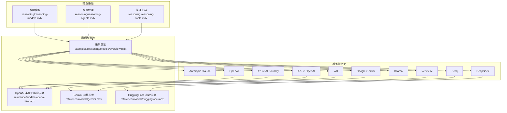
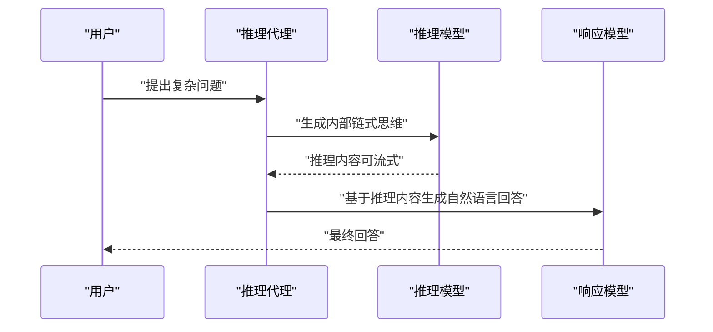
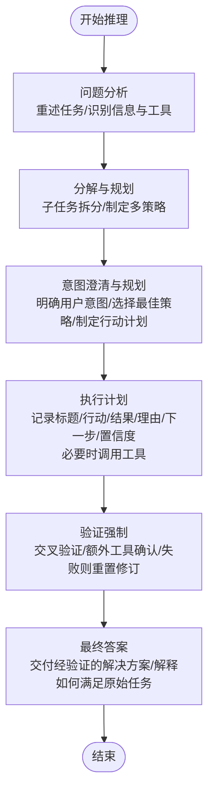
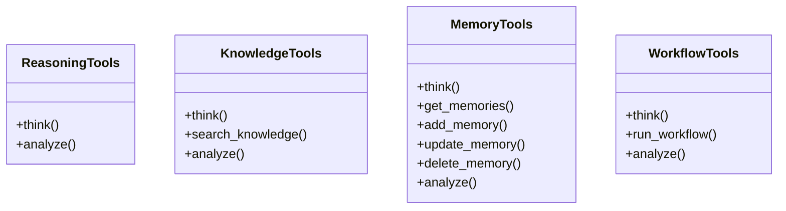
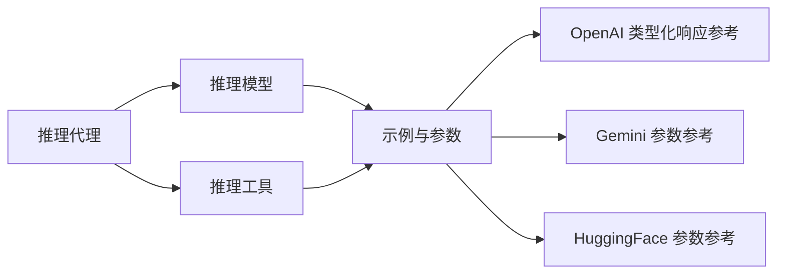

# 推理模型示例

<cite>
**本文引用的文件**
- [推理总览](file://reasoning/overview.mdx)
- [推理模型](file://reasoning/reasoning-models.mdx)
- [推理代理](file://reasoning/reasoning-agents.mdx)
- [推理工具](file://reasoning/reasoning-tools.mdx)
- [模型示例总览](file://examples/reasoning/models/overview.mdx)
- [Anthropic 示例总览](file://examples/models/anthropic/overview.mdx)
- [OpenAI 示例总览](file://examples/models/openai/overview.mdx)
- [Google 示例总览](file://examples/models/google/overview.mdx)
- [Azure 示例总览](file://examples/models/azure/overview.mdx)
- [DeepSeek 示例总览](file://examples/models/deepseek/overview.mdx)
- [Groq 示例总览](file://examples/models/groq/overview.mdx)
- [Ollama 示例总览](file://examples/models/ollama/overview.mdx)
- [Vertex AI 示例总览](file://examples/models/vertexai/overview.mdx)
- [xAI 示例总览](file://examples/models/xai/overview.mdx)
- [模型兼容性](file://models/compatibility.mdx)
- [模型提供方索引](file://cookbook/models/overview.mdx)
- [AI/ML API 网关概览](file://models/providers/gateways/aimlapi/overview.mdx)
- [OpenAI 类型化响应参考](file://reference/models/openai-like.mdx)
- [Gemini 参数参考](file://reference/models/gemini.mdx)
- [HuggingFace 参数参考](file://reference/models/huggingface.mdx)
- [评估总览](file://evals/overview.mdx)
- [性能评估数据库日志示例](file://examples/evals/performance/db-logging.mdx)
</cite>

## 目录
1. [简介](#简介)
2. [项目结构](#项目结构)
3. [核心组件](#核心组件)
4. [架构总览](#架构总览)
5. [详细组件分析](#详细组件分析)
6. [依赖分析](#依赖分析)
7. [性能考虑](#性能考虑)
8. [故障排查指南](#故障排查指南)
9. [结论](#结论)
10. [附录](#附录)

## 简介
本技术文档面向“推理模型示例”，系统梳理并实证说明在多模型提供商（Anthropic Claude、Azure AI Foundry、Azure OpenAI、DeepSeek、Google Gemini、Groq、Ollama、OpenAI、Vertex AI、xAI 等）上进行推理的能力配置、参数调优与优化策略，并结合链式思维提示工程、推理过程监控与结果验证方法，帮助读者在不同推理场景中做出模型选择与性能对比分析。

## 项目结构
围绕推理主题，仓库提供了三类关键资源：
- 推理概念与方法：涵盖推理模型、推理代理、推理工具三种路径，以及三者之间的权衡与适用场景。
- 模型示例与用法：按提供商组织的示例索引，覆盖基础调用、流式输出、工具调用、思考模式、缓存与重试等。
- 参考与评估：模型参数参考、兼容性矩阵、性能/可靠性评估实践，支撑工程落地与质量保障。

```mermaid
graph TB
A["推理总览<br/>reasoning/overview.mdx"] --> B["推理模型<br/>reasoning/reasoning-models.mdx"]
A --> C["推理代理<br/>reasoning/reasoning-agents.mdx"]
A --> D["推理工具<br/>reasoning/reasoning-tools.mdx"]
E["模型示例总览<br/>examples/reasoning/models/overview.mdx"] --> F["Anthropic 示例<br/>examples/models/anthropic/overview.mdx"]
E --> G["OpenAI 示例<br/>examples/models/openai/overview.mdx"]
E --> H["Google 示例<br/>examples/models/google/overview.mdx"]
E --> I["Azure 示例<br/>examples/models/azure/overview.mdx"]
E --> J["DeepSeek 示例<br/>examples/models/deepseek/overview.mdx"]
E --> K["Groq 示例<br/>examples/models/groq/overview.mdx"]
E --> L["Ollama 示例<br/>examples/models/ollama/overview.mdx"]
E --> M["Vertex AI 示例<br/>examples/models/vertexai/overview.mdx"]
E --> N["xAI 示例<br/>examples/models/xai/overview.mdx"]
O["模型兼容性<br/>models/compatibility.mdx"] --> P["模型提供方索引<br/>cookbook/models/overview.mdx"]
Q["AI/ML API 网关概览<br/>models/providers/gateways/aimlapi/overview.mdx"] --> O
```

**图表来源**
- [推理总览:23-184](file://reasoning/overview.mdx#L23-L184)
- [推理模型:1-193](file://reasoning/reasoning-models.mdx#L1-L193)
- [推理代理:1-345](file://reasoning/reasoning-agents.mdx#L1-L345)
- [推理工具:1-420](file://reasoning/reasoning-tools.mdx#L1-L420)
- [模型示例总览:1-17](file://examples/reasoning/models/overview.mdx#L1-L17)
- [Anthropic 示例总览:1-37](file://examples/models/anthropic/overview.mdx#L1-L37)
- [OpenAI 示例总览:1-10](file://examples/models/openai/overview.mdx#L1-L10)
- [Google 示例总览:1-9](file://examples/models/google/overview.mdx#L1-L9)
- [Azure 示例总览:1-11](file://examples/models/azure/overview.mdx#L1-L11)
- [DeepSeek 示例总览:1-14](file://examples/models/deepseek/overview.mdx#L1-L14)
- [Groq 示例总览:1-25](file://examples/models/groq/overview.mdx#L1-L25)
- [Ollama 示例总览:1-10](file://examples/models/ollama/overview.mdx#L1-L10)
- [Vertex AI 示例总览:1-10](file://examples/models/vertexai/overview.mdx#L1-L10)
- [xAI 示例总览:1-19](file://examples/models/xai/overview.mdx#L1-L19)
- [模型兼容性:80-91](file://models/compatibility.mdx#L80-L91)
- [模型提供方索引:46-72](file://cookbook/models/overview.mdx#L46-L72)
- [AI/ML API 网关概览:56-68](file://models/providers/gateways/aimlapi/overview.mdx#L56-L68)

**章节来源**
- [推理总览:23-184](file://reasoning/overview.mdx#L23-L184)
- [模型示例总览:1-17](file://examples/reasoning/models/overview.mdx#L1-L17)

## 核心组件
- 推理模型：强调“先思考后回答”的单次推理范式，适合无需工具调用或少轮对话的复杂问题；可与响应模型分离以兼顾推理能力与自然语言表达。
- 推理代理：对任意模型启用结构化链式思维，自动执行“问题分析→分解与规划→意图澄清→执行计划→验证→最终答案”六步循环，支持最小/最大步数控制、事件流与可视化。
- 推理工具：提供显式的 think()/analyze() 工具集，按领域拆分（通用、知识库、记忆、工作流），让代理在需要时才进入思考状态，透明可控。
- 示例与参数：按提供商整理示例清单与参数参考，辅以重试、流式、缓存、思考模式等工程化能力，便于快速集成与优化。

**章节来源**
- [推理模型:1-193](file://reasoning/reasoning-models.mdx#L1-L193)
- [推理代理:1-345](file://reasoning/reasoning-agents.mdx#L1-L345)
- [推理工具:1-420](file://reasoning/reasoning-tools.mdx#L1-L420)
- [模型兼容性:80-91](file://models/compatibility.mdx#L80-L91)

## 架构总览
下图展示了三种推理路径在工程中的组合方式与典型交互流程：

**图表来源**
- [推理模型:1-193](file://reasoning/reasoning-models.mdx#L1-L193)
- [推理代理:1-345](file://reasoning/reasoning-agents.mdx#L1-L345)
- [推理工具:1-420](file://reasoning/reasoning-tools.mdx#L1-L420)
- [模型示例总览:1-17](file://examples/reasoning/models/overview.mdx#L1-L17)
- [OpenAI 类型化响应参考:24-29](file://reference/models/openai-like.mdx#L24-L29)
- [Gemini 参数参考:24-27](file://reference/models/gemini.mdx#L24-L27)
- [HuggingFace 参数参考:18-25](file://reference/models/huggingface.mdx#L18-L25)

## 详细组件分析

### 推理模型（Reasoning Models）
- 特点：在生成最终答案前产生内部链式思维，适合单次解决复杂问题（如数学、物理、编码）。
- 典型模型：OpenAI o1-pro/gpt-5-mini、Claude 3.7 sonnet 扩展思考模式、Gemini 2.0 Thinking、DeepSeek-R1。
- 工程化建议：
  - 对于“解题能力强但语言表达一般”的推理模型，可与更擅长自然语言的响应模型组合使用。
  - 支持流式推理内容，便于实时观察思维过程并捕获事件。
- 示例与参数要点：
  - 使用单独推理模型与响应模型的组合，平衡“解题”和“表达”。
  - 启用流式推理并捕获事件，用于监控与调试。

**图表来源**
- [推理模型:95-112](file://reasoning/reasoning-models.mdx#L95-L112)
- [推理代理:15-27](file://reasoning/reasoning-agents.mdx#L15-L27)

**章节来源**
- [推理模型:1-193](file://reasoning/reasoning-models.mdx#L1-L193)

### 推理代理（Reasoning Agents）
- 特点：对任意模型启用结构化链式思维，自动执行六步框架，支持最小/最大步数、显示完整推理过程、事件流。
- 适用场景：需要系统性思考、工具迭代、自验证与错误修正的多步骤任务。
- 配置要点：
  - 显示选项：是否展示完整推理过程。
  - 迭代控制：最小/最大推理步数，避免无限循环。
  - 自定义推理代理：针对特定任务定制指令与行为。
- 示例与参数要点：
  - 基础示例与工具结合示例，展示从逻辑谜题到科学评估的多种用例。
  - 通过事件流捕获推理开始、推理增量内容与最终回答。

**图表来源**
- [推理代理:29-65](file://reasoning/reasoning-agents.mdx#L29-L65)

**章节来源**
- [推理代理:1-345](file://reasoning/reasoning-agents.mdx#L1-L345)

### 推理工具（Reasoning Tools）
- 特点：提供显式的 think()/analyze() 工具集，按领域拆分（通用、知识库、记忆、工作流），让代理在需要时才进入思考状态。
- 四大工具包：
  - ReasoningTools：通用思考与分析。
  - KnowledgeTools：知识库检索与分析。
  - MemoryTools：用户记忆的增删改查与分析。
  - WorkflowTools：工作流执行与分析。
- 适用场景：需要明确控制“何时思考、何时行动”的研究、分析与探索型任务。
- 配置要点：
  - 启用/禁用具体工具（think/analyze）。
  - 自动注入内置指导与少量示例，提升一致性。
  - 可组合多个工具包，注意函数名唯一性与冲突处理。

**图表来源**
- [推理工具:13-18](file://reasoning/reasoning-tools.mdx#L13-L18)

**章节来源**
- [推理工具:1-420](file://reasoning/reasoning-tools.mdx#L1-L420)

### 模型提供商与示例集成

#### Anthropic Claude
- 能力与特性：支持思考模式、工具调用、图像/PDF输入、结构化输出、提示缓存、重试机制、MCP 连接器、技能体系等。
- 推荐用法：
  - 在复杂推理任务中启用思考模式，结合工具调用与外部数据源。
  - 利用提示缓存降低重复成本与延迟。
  - 使用重试与超时策略提升稳定性。
- 示例清单（节选）：基础、带超时、代码执行、上下文管理、CSV/图像/PDF 输入、提示缓存、重试、结构化输出、思维、工具、网络抓取/搜索、技能等。

**章节来源**
- [Anthropic 示例总览:1-37](file://examples/models/anthropic/overview.mdx#L1-L37)

#### Azure OpenAI / Azure AI Foundry
- 能力与特性：支持重试、流式输出、工具调用、与 OpenAI 生态兼容的参数。
- 推荐用法：
  - 在企业环境中利用重试与稳定的服务 SLA。
  - 结合本地缓存与流式事件监控推理过程。
- 示例清单（节选）：重试、AI Foundry、OpenAI。

**章节来源**
- [Azure 示例总览:1-11](file://examples/models/azure/overview.mdx#L1-L11)

#### DeepSeek
- 能力与特性：原生推理模型（如 DeepSeek-R1）、思维工具调用、结构化输出、重试机制。
- 推荐用法：
  - 将强推理模型与更擅长自然语言表达的模型组合使用。
  - 在需要链式思维与工具验证的任务中优先考虑。
- 示例清单（节选）：基础、推理代理、重试、结构化输出、思维工具调用、工具使用。

**章节来源**
- [DeepSeek 示例总览:1-14](file://examples/models/deepseek/overview.mdx#L1-L14)

#### Google Gemini
- 能力与特性：支持思考模式开关、流式输出、工具调用、与 OpenAI 生态兼容的参数。
- 推荐用法：
  - 在多模态与跨语言场景中启用思考模式，提升推理质量。
  - 结合向量数据库与知识检索，构建 RAG 推理流程。
- 示例清单（节选）：Gemini。

**章节来源**
- [Google 示例总览:1-9](file://examples/models/google/overview.mdx#L1-L9)

#### Groq
- 能力与特性：高吞吐低延迟、支持多模态、浏览器搜索、知识检索、图像/翻译/转录代理、推理代理、指标采集、重试机制。
- 推荐用法：
  - 在需要快速响应与多工具组合的场景中优先选择。
  - 使用流式事件监控推理过程，便于前端展示与调试。
- 示例清单（节选）：代理团队、基础、浏览器搜索、知识、指标、推理代理、研究代理、图像代理、转录/翻译代理、推理等。

**章节来源**
- [Groq 示例总览:1-25](file://examples/models/groq/overview.mdx#L1-L25)

#### Ollama
- 能力与特性：本地推理、聊天与响应示例。
- 推荐用法：
  - 在隐私敏感或离线环境下部署本地推理代理。
  - 结合缓存与工具调用，提升本地推理的实用性。
- 示例清单（节选）：聊天、响应。

**章节来源**
- [Ollama 示例总览:1-10](file://examples/models/ollama/overview.mdx#L1-L10)

#### Vertex AI
- 能力与特性：支持重试、与 Claude/Gemini 等模型集成。
- 推荐用法：
  - 在云端托管与弹性扩展场景中使用 Vertex AI。
  - 结合流式事件与监控，确保推理过程可观测。
- 示例清单（节选）：重试、Claude。

**章节来源**
- [Vertex AI 示例总览:1-10](file://examples/models/vertexai/overview.mdx#L1-L10)

#### xAI
- 能力与特性：支持基础调用、金融代理、图像代理、实时搜索代理、推理代理、结构化输出、重试机制。
- 推荐用法：
  - 在需要强搜索与实时信息的场景中使用。
  - 通过推理代理与工具调用实现端到端的智能体。
- 示例清单（节选）：基础、金融代理、图像代理、实时搜索代理、推理代理、重试、结构化输出、工具使用。

**章节来源**
- [xAI 示例总览:1-19](file://examples/models/xai/overview.mdx#L1-L19)

### 参数配置与优化策略
- 通用参数（OpenAI 类风格）：
  - top_p、request_params、client_params、retries、delay_between_retries、exponential_backoff。
- Gemini 参数：
  - thinking_enabled、retries、delay_between_retries、exponential_backoff。
- HuggingFace 参数：
  - use_cache、max_tokens、temperature、top_p、repetition_penalty、retries、delay_between_retries、exponential_backoff。
- 优化建议：
  - 合理设置温度与采样参数，平衡创造性与确定性。
  - 使用重试与指数退避，增强对外部服务的鲁棒性。
  - 启用提示缓存（如 Anthropic）与本地缓存（如 Ollama），降低重复成本。
  - 在工具密集型任务中，结合流式事件监控推理过程，便于前端展示与调试。

**章节来源**
- [OpenAI 类型化响应参考:24-29](file://reference/models/openai-like.mdx#L24-L29)
- [Gemini 参数参考:24-27](file://reference/models/gemini.mdx#L24-L27)
- [HuggingFace 参数参考:18-25](file://reference/models/huggingface.mdx#L18-L25)

### 性能特点与模型选择
- 选择标准：
  - 任务类型：单次复杂推理 vs 多步工具协作 vs 多模态与实时检索。
  - 成本与延迟：云侧高吞吐（Groq/Vertex AI）与本地低延迟（Ollama）的权衡。
  - 可靠性：重试策略、超时与降级方案。
  - 可观测性：事件流、日志与指标采集。
- 兼容性矩阵（部分）：
  - 包含 AIML API、Vertex AI Claude、xAI 等在兼容性表中被标注为可用。
- 实践建议：
  - 先用轻量模型与少量测试用例验证效果，再逐步扩展到生产环境。
  - 结合评估维度（准确性、性能、可靠性）持续迭代。

**章节来源**
- [模型兼容性:80-91](file://models/compatibility.mdx#L80-L91)
- [AI/ML API 网关概览:56-68](file://models/providers/gateways/aimlapi/overview.mdx#L56-L68)

## 依赖分析
- 组件耦合：
  - 推理代理与推理模型/工具之间存在松耦合关系，可通过配置切换与组合。
  - 示例与参数参考相互独立，便于按需查阅与复用。
- 外部依赖与集成点：
  - 各模型提供商的 SDK/HTTP 客户端与参数差异，需通过统一接口适配。
  - 流式事件与数据库日志用于性能与可靠性评估。

**图表来源**
- [推理代理:1-345](file://reasoning/reasoning-agents.mdx#L1-L345)
- [推理模型:1-193](file://reasoning/reasoning-models.mdx#L1-L193)
- [推理工具:1-420](file://reasoning/reasoning-tools.mdx#L1-L420)
- [OpenAI 类型化响应参考:24-29](file://reference/models/openai-like.mdx#L24-L29)
- [Gemini 参数参考:24-27](file://reference/models/gemini.mdx#L24-L27)
- [HuggingFace 参数参考:18-25](file://reference/models/huggingface.mdx#L18-L25)

**章节来源**
- [推理代理:1-345](file://reasoning/reasoning-agents.mdx#L1-L345)
- [推理模型:1-193](file://reasoning/reasoning-models.mdx#L1-L193)
- [推理工具:1-420](file://reasoning/reasoning-tools.mdx#L1-L420)

## 性能考虑
- 吞吐与延迟：
  - 云侧高吞吐模型（如 Groq）适合快速响应与多工具并发。
  - 本地模型（如 Ollama）适合低延迟与隐私保护场景。
- 缓存与重试：
  - 提示缓存与本地缓存显著降低重复成本。
  - 合理设置重试次数与退避策略，提升整体成功率。
- 监控与可观测性：
  - 使用流式事件与数据库日志记录推理过程，便于定位瓶颈与异常。
- 评估与回归：
  - 建立准确性、性能与可靠性三位一体的评估体系，持续跟踪模型表现。

**章节来源**
- [性能评估数据库日志示例:38-67](file://examples/evals/performance/db-logging.mdx#L38-L67)
- [评估总览:27-60](file://evals/overview.mdx#L27-L60)

## 故障排查指南
- 常见问题与对策：
  - 超时与不稳定：启用重试与超时配置，结合指数退避。
  - 输出不一致：固定随机种子、限制采样参数、增加 few-shot 示例。
  - 推理过程不可见：开启流式事件与完整推理展示，捕获推理事件进行诊断。
  - 工具调用失败：检查工具权限与网络连通性，增加重试与降级策略。
- 参考参数：
  - OpenAI 类风格：retries、delay_between_retries、exponential_backoff。
  - Gemini：thinking_enabled、retries、delay_between_retries、exponential_backoff。
  - HuggingFace：use_cache、max_tokens、temperature、top_p、repetition_penalty、retries、delay_between_retries、exponential_backoff。

**章节来源**
- [OpenAI 类型化响应参考:24-29](file://reference/models/openai-like.mdx#L24-L29)
- [Gemini 参数参考:24-27](file://reference/models/gemini.mdx#L24-L27)
- [HuggingFace 参数参考:18-25](file://reference/models/huggingface.mdx#L18-L25)

## 结论
通过“推理模型、推理代理、推理工具”三种路径，结合各模型提供商的示例与参数参考，可以在不同推理场景中实现从“强推理”到“强表达”的能力互补。工程实践中应重视缓存、重试、流式事件与评估体系的建设，以获得稳定、可观测且可优化的推理系统。

## 附录
- 快速对照表（示例与参数参考）：
  - OpenAI 类型化响应参考：retries、delay_between_retries、exponential_backoff、top_p、request_params、client_params。
  - Gemini 参数参考：thinking_enabled、retries、delay_between_retries、exponential_backoff。
  - HuggingFace 参数参考：use_cache、max_tokens、temperature、top_p、repetition_penalty、retries、delay_between_retries、exponential_backoff。
- 评估实践：
  - 使用评估总览中的示例与数据库日志示例，建立持续的质量保障流程。

**章节来源**
- [OpenAI 类型化响应参考:24-29](file://reference/models/openai-like.mdx#L24-L29)
- [Gemini 参数参考:24-27](file://reference/models/gemini.mdx#L24-L27)
- [HuggingFace 参数参考:18-25](file://reference/models/huggingface.mdx#L18-L25)
- [评估总览:27-60](file://evals/overview.mdx#L27-L60)
- [性能评估数据库日志示例:38-67](file://examples/evals/performance/db-logging.mdx#L38-L67)