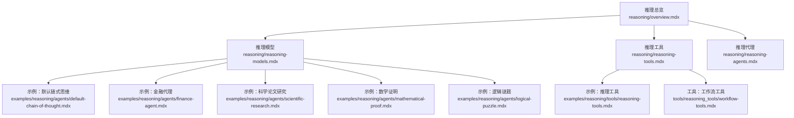
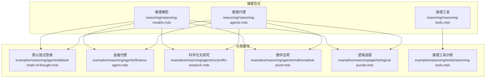
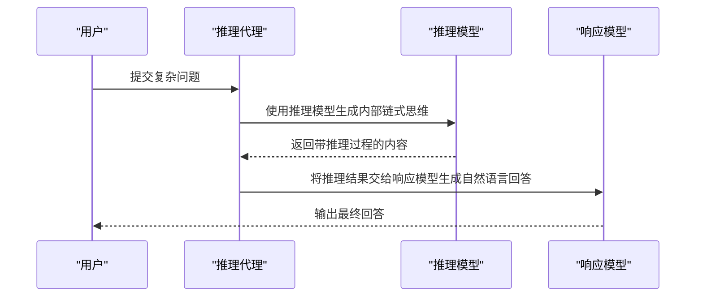
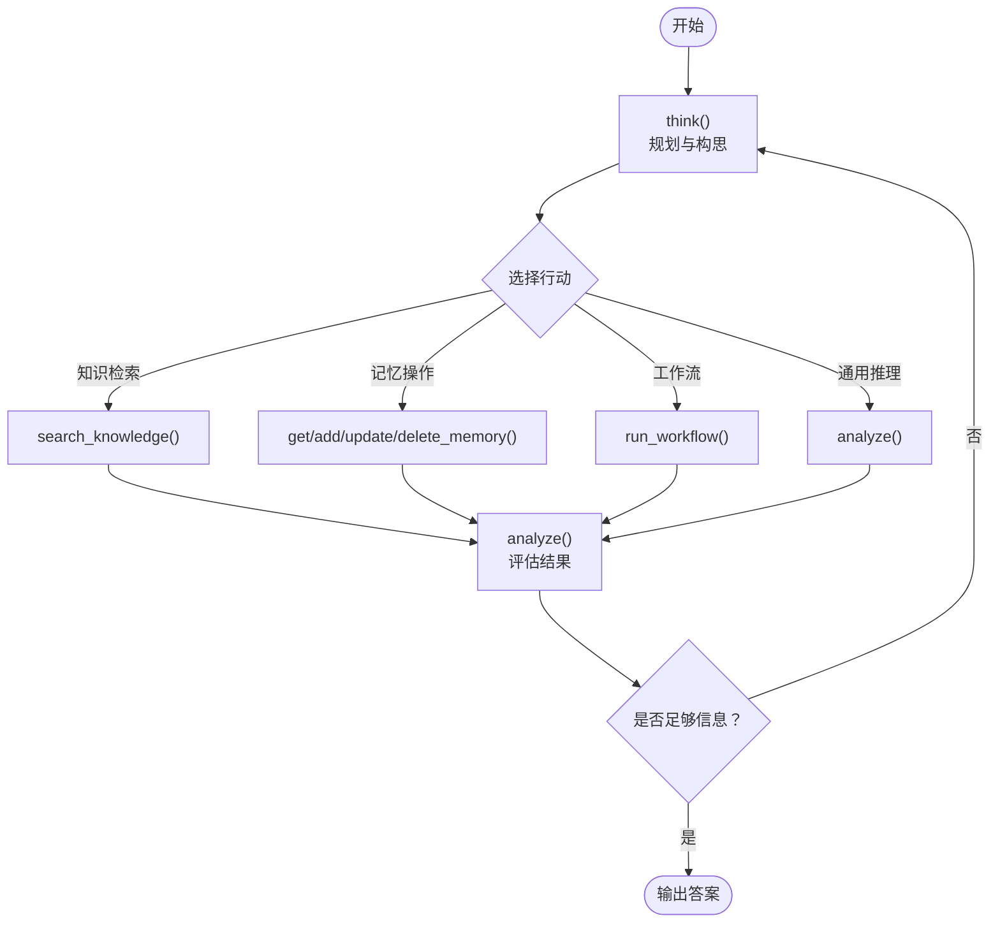
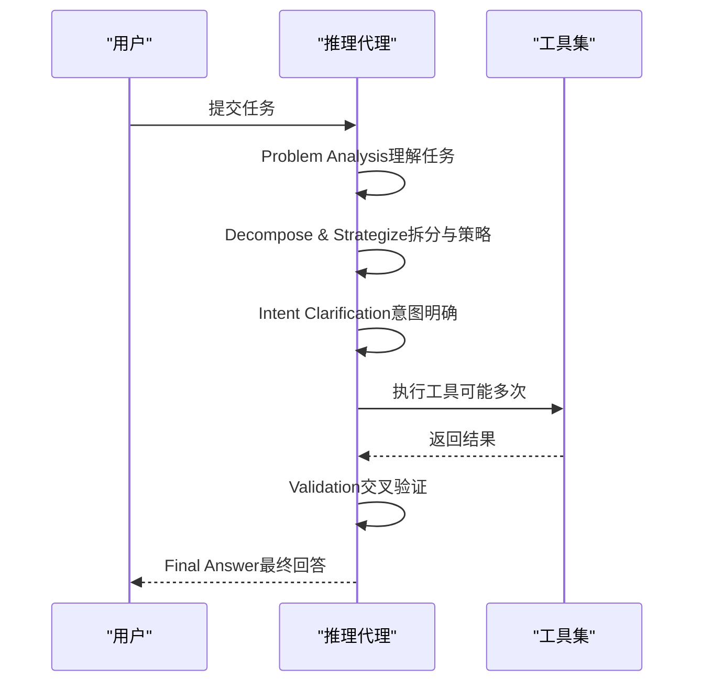
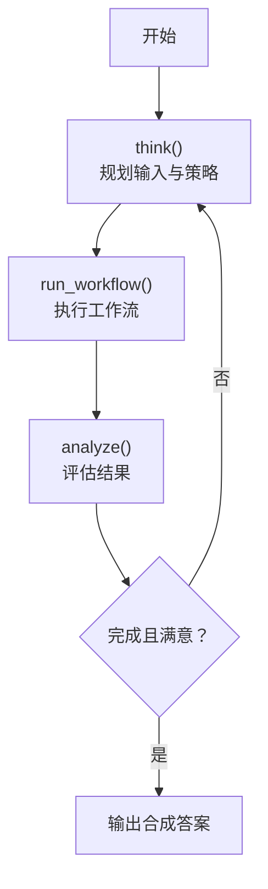
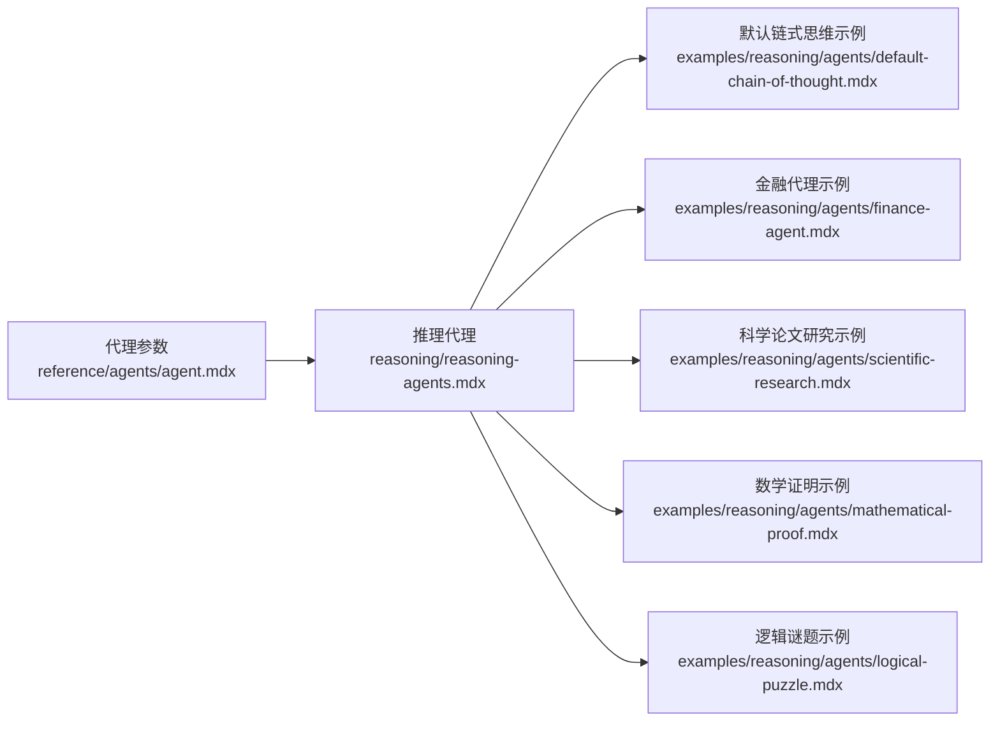

# 推理示例

<cite>
**本文引用的文件**
- [推理总览](file://reasoning/overview.mdx)
- [推理模型](file://reasoning/reasoning-models.mdx)
- [推理工具](file://reasoning/reasoning-tools.mdx)
- [推理代理](file://reasoning/reasoning-agents.mdx)
- [示例：推理工具](file://examples/reasoning/tools/reasoning-tools.mdx)
- [示例：默认链式思维](file://examples/reasoning/agents/default-chain-of-thought.mdx)
- [示例：金融代理](file://examples/reasoning/agents/finance-agent.mdx)
- [示例：科学论文研究](file://examples/reasoning/agents/scientific-research.mdx)
- [示例：数学证明](file://examples/reasoning/agents/mathematical-proof.mdx)
- [示例：逻辑谜题](file://examples/reasoning/agents/logical-puzzle.mdx)
- [工具：工作流工具](file://tools/reasoning_tools/workflow-tools.mdx)
- [参考：代理参数](file://reference/agents/agent.mdx)
</cite>

## 目录
1. [简介](#简介)
2. [项目结构](#项目结构)
3. [核心组件](#核心组件)
4. [架构总览](#架构总览)
5. [详细组件分析](#详细组件分析)
6. [依赖关系分析](#依赖关系分析)
7. [性能考虑](#性能考虑)
8. [故障排查指南](#故障排查指南)
9. [结论](#结论)
10. [附录](#附录)

## 简介
本章节聚焦“推理示例”，系统化介绍如何在实际应用中构建与使用推理代理，覆盖以下主题：
- 三种推理范式：推理模型、推理工具、推理代理（链式思维）
- 场景化应用：数学问题求解、科学论文批判性分析、金融报告生成、逻辑谜题求解
- 推理模型配置与优化：多模型组合、推理效率控制、事件流式输出
- 推理工具开发与集成：知识工具、记忆工具、推理工具、工作流工具
- 最佳实践与代码示例路径，帮助开发者快速落地

## 项目结构
围绕“推理示例”的相关文档主要分布在如下位置：
- reasoning 子目录：推理总览、推理模型、推理工具、推理代理
- examples/reasoning：面向具体场景的示例脚本与说明
- tools/reasoning_tools：推理工具细分（如工作流工具）的使用说明
- reference：推理相关参数与事件类型参考

**图表来源**
- [推理总览:1-187](file://reasoning/overview.mdx#L1-L187)
- [推理模型:1-193](file://reasoning/reasoning-models.mdx#L1-L193)
- [推理工具:1-420](file://reasoning/reasoning-tools.mdx#L1-L420)
- [推理代理:1-345](file://reasoning/reasoning-agents.mdx#L1-L345)
- [示例：推理工具:1-108](file://examples/reasoning/tools/reasoning-tools.mdx#L1-L108)
- [示例：默认链式思维:1-67](file://examples/reasoning/agents/default-chain-of-thought.mdx#L1-L67)
- [示例：金融代理:1-63](file://examples/reasoning/agents/finance-agent.mdx#L1-L63)
- [示例：科学论文研究:1-64](file://examples/reasoning/agents/scientific-research.mdx#L1-L64)
- [示例：数学证明:1-57](file://examples/reasoning/agents/mathematical-proof.mdx#L1-L57)
- [示例：逻辑谜题:1-62](file://examples/reasoning/agents/logical-puzzle.mdx#L1-L62)
- [工具：工作流工具:1-29](file://tools/reasoning_tools/workflow-tools.mdx#L1-L29)

**章节来源**
- [推理总览:1-187](file://reasoning/overview.mdx#L1-L187)
- [推理模型:1-193](file://reasoning/reasoning-models.mdx#L1-L193)
- [推理工具:1-420](file://reasoning/reasoning-tools.mdx#L1-L420)
- [推理代理:1-345](file://reasoning/reasoning-agents.mdx#L1-L345)
- [示例：推理工具:1-108](file://examples/reasoning/tools/reasoning-tools.mdx#L1-L108)
- [示例：默认链式思维:1-67](file://examples/reasoning/agents/default-chain-of-thought.mdx#L1-L67)
- [示例：金融代理:1-63](file://examples/reasoning/agents/finance-agent.mdx#L1-L63)
- [示例：科学论文研究:1-64](file://examples/reasoning/agents/scientific-research.mdx#L1-L64)
- [示例：数学证明:1-57](file://examples/reasoning/agents/mathematical-proof.mdx#L1-L57)
- [示例：逻辑谜题:1-62](file://examples/reasoning/agents/logical-puzzle.mdx#L1-L62)
- [工具：工作流工具:1-29](file://tools/reasoning_tools/workflow-tools.mdx#L1-L29)

## 核心组件
- 推理模型：原生具备内部链式思维的模型，适合单次复杂任务；可与响应模型分离以兼顾“推理质量”和“表达自然度”
- 推理工具：为任意模型注入显式的“思考/分析”工具，按需启用，透明可控
- 推理代理：通过结构化的链式思维框架，自动进行问题拆解、策略制定、执行、验证与最终回答
- 工作流工具：在推理过程中编排与评估工作流执行，支持上下文驱动的输入选择与结果验证

**章节来源**
- [推理模型:1-193](file://reasoning/reasoning-models.mdx#L1-L193)
- [推理工具:1-420](file://reasoning/reasoning-tools.mdx#L1-L420)
- [推理代理:1-345](file://reasoning/reasoning-agents.mdx#L1-L345)
- [工具：工作流工具:1-29](file://tools/reasoning_tools/workflow-tools.mdx#L1-L29)

## 架构总览
下图展示三种推理范式在系统中的定位与交互方式，以及与示例脚本的关系。

**图表来源**
- [推理模型:1-193](file://reasoning/reasoning-models.mdx#L1-L193)
- [推理工具:1-420](file://reasoning/reasoning-tools.mdx#L1-L420)
- [推理代理:1-345](file://reasoning/reasoning-agents.mdx#L1-L345)
- [示例：默认链式思维:1-67](file://examples/reasoning/agents/default-chain-of-thought.mdx#L1-L67)
- [示例：金融代理:1-63](file://examples/reasoning/agents/finance-agent.mdx#L1-L63)
- [示例：科学论文研究:1-64](file://examples/reasoning/agents/scientific-research.mdx#L1-L64)
- [示例：数学证明:1-57](file://examples/reasoning/agents/mathematical-proof.mdx#L1-L57)
- [示例：逻辑谜题:1-62](file://examples/reasoning/agents/logical-puzzle.mdx#L1-L62)
- [示例：推理工具:1-108](file://examples/reasoning/tools/reasoning-tools.mdx#L1-L108)

## 详细组件分析

### 组件一：推理模型（链式思维与ReAct）
- 特点
  - 内置链式思维（CoT），适合一次性复杂任务（数学、编码、物理）
  - 可与响应模型分离，实现“强推理 + 自然语言输出”的组合
  - 支持流式推理内容与事件捕获，便于可观测性与调试
- 配置要点
  - 指定推理模型与响应模型（如 DeepSeek-R1 + Claude）
  - 控制推理强度（如 reasoning_effort）
  - 启用流式事件（stream_events）以实时观察推理过程
- 应用场景
  - 数学证明、科学论文方法论批判、金融比较分析、逻辑谜题求解

**图表来源**
- [推理模型:1-193](file://reasoning/reasoning-models.mdx#L1-L193)
- [示例：默认链式思维:1-67](file://examples/reasoning/agents/default-chain-of-thought.mdx#L1-L67)
- [示例：金融代理:1-63](file://examples/reasoning/agents/finance-agent.mdx#L1-L63)
- [示例：科学论文研究:1-64](file://examples/reasoning/agents/scientific-research.mdx#L1-L64)
- [示例：数学证明:1-57](file://examples/reasoning/agents/mathematical-proof.mdx#L1-L57)
- [示例：逻辑谜题:1-62](file://examples/reasoning/agents/logical-puzzle.mdx#L1-L62)

**章节来源**
- [推理模型:1-193](file://reasoning/reasoning-models.mdx#L1-L193)
- [示例：默认链式思维:1-67](file://examples/reasoning/agents/default-chain-of-thought.mdx#L1-L67)
- [示例：金融代理:1-63](file://examples/reasoning/agents/finance-agent.mdx#L1-L63)
- [示例：科学论文研究:1-64](file://examples/reasoning/agents/scientific-research.mdx#L1-L64)
- [示例：数学证明:1-57](file://examples/reasoning/agents/mathematical-proof.mdx#L1-L57)
- [示例：逻辑谜题:1-62](file://examples/reasoning/agents/logical-puzzle.mdx#L1-L62)

### 组件二：推理工具（Think → Act → Analyze）
- 特点
  - 为任意模型注入显式的 think()/analyze() 工具，按需启用
  - 四类专用工具包：通用推理、知识检索、记忆管理、工作流编排
  - 支持禁用重复函数名或自定义重命名，避免冲突
- 工作流
  - THINK：规划与构思
  - ACT：调用领域特定动作（如 search_knowledge、run_workflow、get/add/update/delete_memory）
  - ANALYZE：评估结果并决定下一步
  - REPEAT：循环直至满足条件或得出答案
- 应用场景
  - 文档检索与分析、个性化记忆维护、跨步骤工作流编排

**图表来源**
- [推理工具:1-420](file://reasoning/reasoning-tools.mdx#L1-L420)
- [工具：工作流工具:1-29](file://tools/reasoning_tools/workflow-tools.mdx#L1-L29)

**章节来源**
- [推理工具:1-420](file://reasoning/reasoning-tools.mdx#L1-L420)
- [工具：工作流工具:1-29](file://tools/reasoning_tools/workflow-tools.mdx#L1-L29)

### 组件三：推理代理（结构化链式思维）
- 特点
  - 对任何模型启用结构化链式思维（Problem Analysis → Decompose → Intent → Execute → Validation → Final Answer）
  - 可配置最小/最大推理步数，支持捕获推理事件用于可视化与监控
  - 与工具结合时，可迭代调用工具并自我修正
- 应用场景
  - 多步骤工具调用、复杂计划与行程安排、创意写作等需要系统化思考的任务

**图表来源**
- [推理代理:1-345](file://reasoning/reasoning-agents.mdx#L1-L345)

**章节来源**
- [推理代理:1-345](file://reasoning/reasoning-agents.mdx#L1-L345)

### 组件四：工作流工具（WorkflowTools）
- 能力
  - 在推理过程中运行与评估工作流，支持输入策略与结果验证
  - 与 Workflow/Step 协同，实现端到端的自动化编排
- 典型流程
  - THINK：规划输入与策略
  - RUN：执行工作流
  - ANALYZE：评估结果并决定是否需要再次运行

**图表来源**
- [工具：工作流工具:1-29](file://tools/reasoning_tools/workflow-tools.mdx#L1-L29)

**章节来源**
- [工具：工作流工具:1-29](file://tools/reasoning_tools/workflow-tools.mdx#L1-L29)

## 依赖关系分析
- 代理参数
  - 推理代理可通过配置项控制推理行为：reasoning_model、reasoning_agent、reasoning_min_steps、reasoning_max_steps
- 示例脚本与推理范式的映射
  - 默认链式思维示例：演示 reasoning=True 的内置链式思维与 reasoning_model 的显式回退
  - 金融代理示例：结合 YFinance 工具与推理代理进行财务比较分析
  - 科学研究示例：对论文摘要进行方法论与结论的批判性评估
  - 数学证明示例：要求严格推导与验证
  - 逻辑谜题示例：多约束下的步骤化解题

**图表来源**
- [参考：代理参数:53-56](file://reference/agents/agent.mdx#L53-L56)
- [推理代理:1-345](file://reasoning/reasoning-agents.mdx#L1-L345)
- [示例：默认链式思维:1-67](file://examples/reasoning/agents/default-chain-of-thought.mdx#L1-L67)
- [示例：金融代理:1-63](file://examples/reasoning/agents/finance-agent.mdx#L1-L63)
- [示例：科学论文研究:1-64](file://examples/reasoning/agents/scientific-research.mdx#L1-L64)
- [示例：数学证明:1-57](file://examples/reasoning/agents/mathematical-proof.mdx#L1-L57)
- [示例：逻辑谜题:1-62](file://examples/reasoning/agents/logical-puzzle.mdx#L1-L62)

**章节来源**
- [参考：代理参数:53-56](file://reference/agents/agent.mdx#L53-L56)
- [推理代理:1-345](file://reasoning/reasoning-agents.mdx#L1-L345)
- [示例：默认链式思维:1-67](file://examples/reasoning/agents/default-chain-of-thought.mdx#L1-L67)
- [示例：金融代理:1-63](file://examples/reasoning/agents/finance-agent.mdx#L1-L63)
- [示例：科学论文研究:1-64](file://examples/reasoning/agents/scientific-research.mdx#L1-L64)
- [示例：数学证明:1-57](file://examples/reasoning/agents/mathematical-proof.mdx#L1-L57)
- [示例：逻辑谜题:1-62](file://examples/reasoning/agents/logical-puzzle.mdx#L1-L62)

## 性能考虑
- 迭代步数控制
  - 通过 reasoning_min_steps 与 reasoning_max_steps 平衡推理深度与延迟
- 流式事件与可观测性
  - 启用 stream_events 以实时获取推理事件，便于前端展示与日志追踪
- 模型分离策略
  - 将推理模型与响应模型分离，可在保证推理质量的同时提升输出自然度
- 工具调用成本
  - 在推理工具中合理规划 think/act/analyze 的次数，避免不必要的外部调用

[本节为通用指导，不直接分析具体文件]

## 故障排查指南
- 未显示完整推理过程
  - 确认已设置 show_full_reasoning=True，并检查 stream_events 是否开启
- 推理步数过多导致超时
  - 调整 reasoning_max_steps，或针对简单问题降低至 5
- 工具冲突或函数名重复
  - 合并多个推理工具包时，禁用后续工具包中的 enable_think/enable_analyze，或自定义函数名
- 事件监听无效
  - 检查事件类型与监听逻辑，参考推理事件类型与捕获方式

**章节来源**
- [推理代理:150-181](file://reasoning/reasoning-agents.mdx#L150-L181)
- [推理工具:263-302](file://reasoning/reasoning-tools.mdx#L263-L302)

## 结论
- 推理模型适合一次性复杂任务与高推理强度需求
- 推理工具提供按需、透明、可控的思维过程，适用于研究、分析与多域协作
- 推理代理通过结构化链式思维，确保多步骤任务的系统性与可验证性
- 结合工作流工具，可在推理过程中实现端到端的自动化编排与结果验证
- 建议根据任务复杂度与模型能力选择合适的推理范式，并通过参数与事件机制进行可观测性与性能优化

[本节为总结性内容，不直接分析具体文件]

## 附录

### A. 代码示例路径索引
- 推理模型
  - [默认链式思维示例:1-67](file://examples/reasoning/agents/default-chain-of-thought.mdx#L1-L67)
  - [金融代理示例:1-63](file://examples/reasoning/agents/finance-agent.mdx#L1-L63)
  - [科学论文研究示例:1-64](file://examples/reasoning/agents/scientific-research.mdx#L1-L64)
  - [数学证明示例:1-57](file://examples/reasoning/agents/mathematical-proof.mdx#L1-L57)
  - [逻辑谜题示例:1-62](file://examples/reasoning/agents/logical-puzzle.mdx#L1-L62)
- 推理工具
  - [推理工具示例:1-108](file://examples/reasoning/tools/reasoning-tools.mdx#L1-L108)

**章节来源**
- [示例：默认链式思维:1-67](file://examples/reasoning/agents/default-chain-of-thought.mdx#L1-L67)
- [示例：金融代理:1-63](file://examples/reasoning/agents/finance-agent.mdx#L1-L63)
- [示例：科学论文研究:1-64](file://examples/reasoning/agents/scientific-research.mdx#L1-L64)
- [示例：数学证明:1-57](file://examples/reasoning/agents/mathematical-proof.mdx#L1-L57)
- [示例：逻辑谜题:1-62](file://examples/reasoning/agents/logical-puzzle.mdx#L1-L62)
- [示例：推理工具:1-108](file://examples/reasoning/tools/reasoning-tools.mdx#L1-L108)

### B. 关键参数与事件参考
- 代理关键参数
  - reasoning_model、reasoning_agent、reasoning_min_steps、reasoning_max_steps
- 推理事件（示例）
  - reasoning_started、reasoning_content_delta、run_content、run_completed

**章节来源**
- [参考：代理参数:53-56](file://reference/agents/agent.mdx#L53-L56)
- [推理模型:142-178](file://reasoning/reasoning-models.mdx#L142-L178)