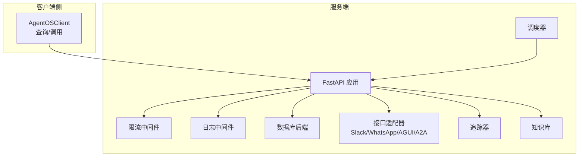
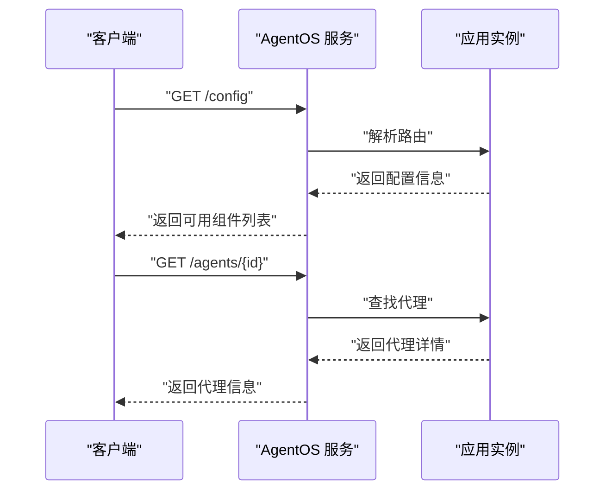
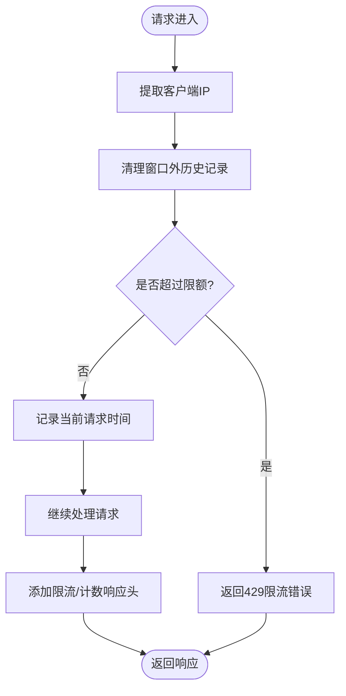
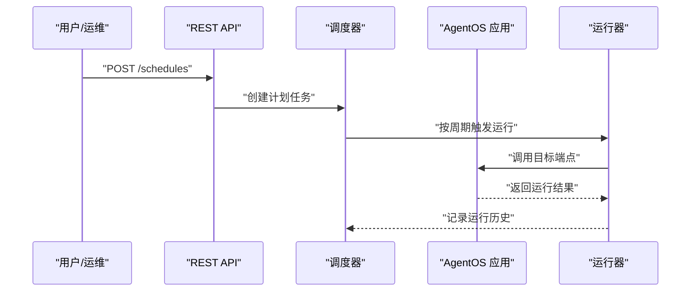
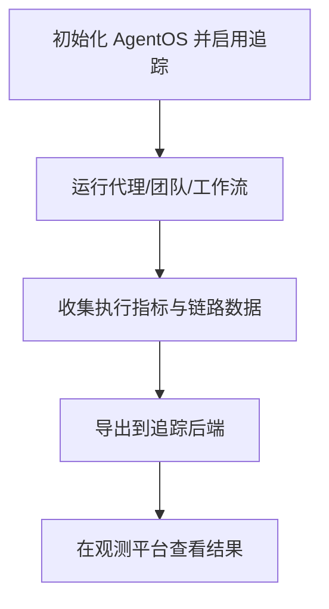
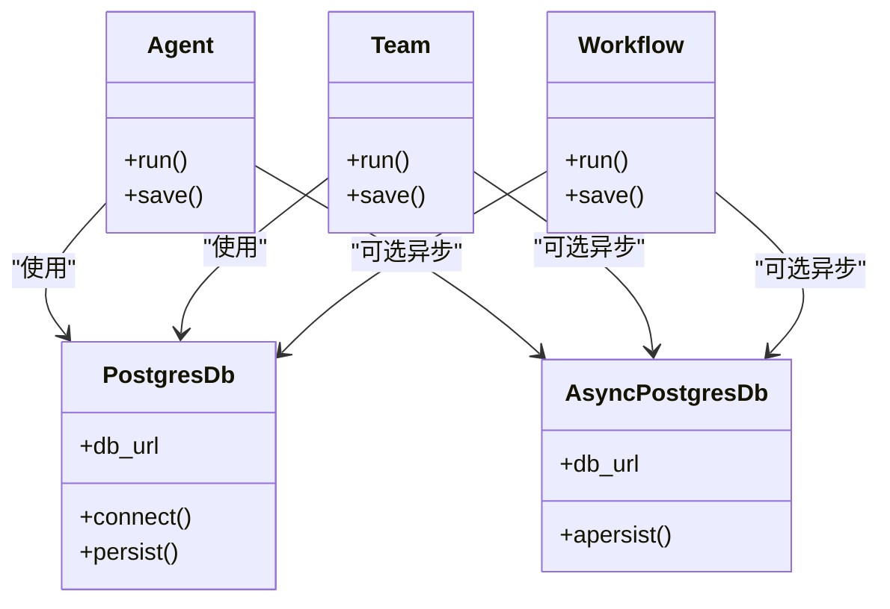
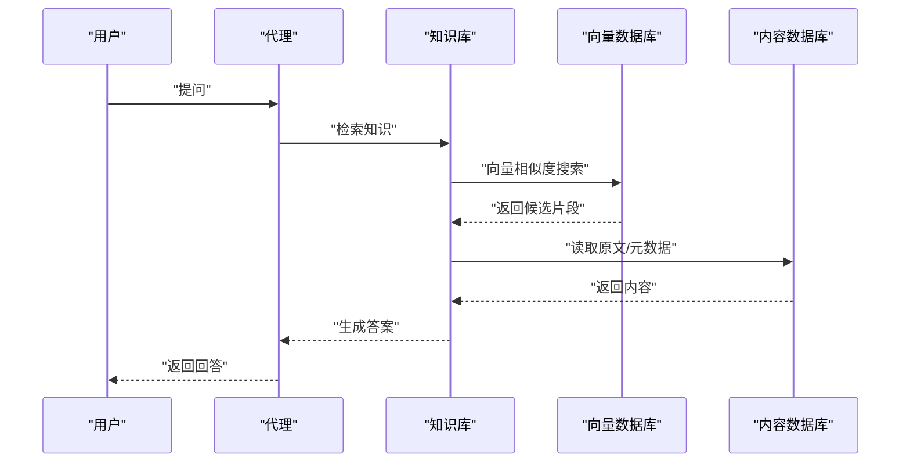
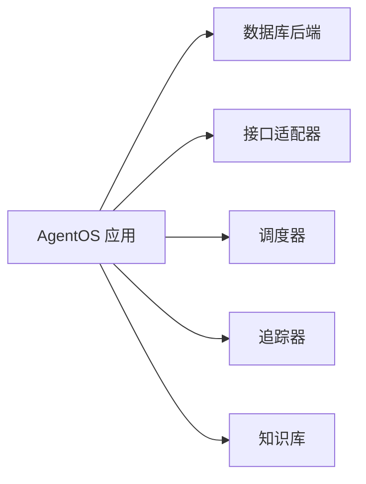

# 更多示例

<cite>
**本文引用的文件**
- [examples/agent-os/overview.mdx](file://examples/agent-os/overview.mdx)
- [examples/agent-os/basic.mdx](file://examples/agent-os/basic.mdx)
- [examples/agent-os/demo.mdx](file://examples/agent-os/demo.mdx)
- [examples/reasoning/overview.mdx](file://examples/reasoning/overview.mdx)
- [examples/evals/overview.mdx](file://examples/evals/overview.mdx)
- [examples/integrations/overview.mdx](file://examples/integrations/overview.mdx)
- [examples/components/overview.mdx](file://examples/components/overview.mdx)
- [examples/agent-os/client/overview.mdx](file://examples/agent-os/client/overview.mdx)
- [examples/agent-os/client/basic-client.mdx](file://examples/agent-os/client/basic-client.mdx)
- [examples/agent-os/middleware/overview.mdx](file://examples/agent-os/middleware/overview.mdx)
- [examples/agent-os/middleware/agent-os-with-custom-middleware.mdx](file://examples/agent-os/middleware/agent-os-with-custom-middleware.mdx)
- [examples/agent-os/scheduler/overview.mdx](file://examples/agent-os/scheduler/overview.mdx)
- [examples/agent-os/scheduler/basic-schedule.mdx](file://examples/agent-os/scheduler/basic-schedule.mdx)
- [examples/agent-os/tracing/overview.mdx](file://examples/agent-os/tracing/overview.mdx)
- [examples/agent-os/tracing/basic-agent-tracing.mdx](file://examples/agent-os/tracing/basic-agent-tracing.mdx)
- [examples/agent-os/dbs/overview.mdx](file://examples/agent-os/dbs/overview.mdx)
- [examples/agent-os/dbs/postgres.mdx](file://examples/agent-os/dbs/postgres.mdx)
- [examples/agent-os/interfaces/overview.mdx](file://examples/agent-os/interfaces/overview.mdx)
- [examples/agent-os/interfaces/all-interfaces.mdx](file://examples/agent-os/interfaces/all-interfaces.mdx)
- [examples/agent-os/knowledge/overview.mdx](file://examples/agent-os/knowledge/overview.mdx)
- [examples/agent-os/knowledge/agentos-knowledge.mdx](file://examples/agent-os/knowledge/agentos-knowledge.mdx)
</cite>

## 目录
1. [简介](#简介)
2. [项目结构](#项目结构)
3. [核心组件](#核心组件)
4. [架构总览](#架构总览)
5. [详细组件分析](#详细组件分析)
6. [依赖分析](#依赖分析)
7. [性能考虑](#性能考虑)
8. [故障排查指南](#故障排查指南)
9. [结论](#结论)
10. [附录](#附录)

## 简介
本文件面向“更多示例”主题，系统化梳理 AgentOS 示例体系，覆盖客户端使用、接口集成、数据库配置、中间件设置、调度管理与跟踪功能，并扩展至推理示例（链式思维、推理代理、推理模型与工具）、评估示例（准确性、代理作为评判者、性能与可靠性）以及集成示例（外部平台、观察性系统与 RAG）。同时，文档化组件示例中如何将代理、团队与工作流保存与加载到数据库，形成可版本化的配置即代码实践。

## 项目结构
AgentOS 示例以“示例目录 + 子示例”的方式组织，顶层概览文件提供导航与说明；各子目录包含具体示例与运行说明。下图给出与本文相关的核心示例路径关系：

```mermaid
graph TB
A["examples/agent-os/overview.mdx"] --> A1["examples/agent-os/basic.mdx"]
A --> A2["examples/agent-os/demo.mdx"]
A --> A3["examples/agent-os/client/overview.mdx"]
A --> A4["examples/agent-os/middleware/overview.mdx"]
A --> A5["examples/agent-os/scheduler/overview.mdx"]
A --> A6["examples/agent-os/tracing/overview.mdx"]
A --> A7["examples/agent-os/dbs/overview.mdx"]
A --> A8["examples/agent-os/interfaces/overview.mdx"]
A --> A9["examples/agent-os/knowledge/overview.mdx"]
R["examples/reasoning/overview.mdx"] --> E["examples/evals/overview.mdx"]
I["examples/integrations/overview.mdx"] --> C["examples/components/overview.mdx"]
```

图表来源
- [examples/agent-os/overview.mdx:1-30](file://examples/agent-os/overview.mdx#L1-L30)
- [examples/reasoning/overview.mdx:1-12](file://examples/reasoning/overview.mdx#L1-L12)
- [examples/evals/overview.mdx:1-12](file://examples/evals/overview.mdx#L1-L12)
- [examples/integrations/overview.mdx:1-14](file://examples/integrations/overview.mdx#L1-L14)
- [examples/components/overview.mdx:1-18](file://examples/components/overview.mdx#L1-L18)

章节来源
- [examples/agent-os/overview.mdx:1-30](file://examples/agent-os/overview.mdx#L1-L30)

## 核心组件
- 客户端：通过 AgentOSClient 连接远程 AgentOS 实例，查询配置、获取组件详情等。
- 中间件：在 FastAPI 应用层添加自定义中间件，如限流与请求/响应日志记录。
- 调度器：启用调度器后可通过 REST API 创建定时任务，周期性触发代理/团队/工作流运行。
- 跟踪：启用追踪后，对代理、团队与工作流执行进行可观测性采集。
- 数据库：支持多种数据库后端（PostgreSQL 同步/异步、Mongo、MySQL、Redis、SQLite 等），用于持久化状态、会话与知识。
- 接口：提供 Slack、WhatsApp、AGUI、A2A 等多种接入方式，统一由 AgentOS 组织与暴露。
- 知识：基于向量数据库与嵌入器构建知识库，支持同步与异步写入与检索。
- 组件持久化：将代理、团队与工作流保存到数据库，实现配置即代码与版本化管理。

章节来源
- [examples/agent-os/client/overview.mdx:1-18](file://examples/agent-os/client/overview.mdx#L1-L18)
- [examples/agent-os/middleware/overview.mdx:1-14](file://examples/agent-os/middleware/overview.mdx#L1-L14)
- [examples/agent-os/scheduler/overview.mdx:1-18](file://examples/agent-os/scheduler/overview.mdx#L1-L18)
- [examples/agent-os/tracing/overview.mdx:1-16](file://examples/agent-os/tracing/overview.mdx#L1-L16)
- [examples/agent-os/dbs/overview.mdx:1-23](file://examples/agent-os/dbs/overview.mdx#L1-L23)
- [examples/agent-os/interfaces/overview.mdx:1-13](file://examples/agent-os/interfaces/overview.mdx#L1-L13)
- [examples/agent-os/knowledge/overview.mdx:1-11](file://examples/agent-os/knowledge/overview.mdx#L1-L11)

## 架构总览
下图展示 AgentOS 示例在典型场景下的组件交互：客户端连接、中间件处理、调度触发、数据库持久化、接口接入与知识检索、以及跟踪输出。

图表来源
- [examples/agent-os/client/basic-client.mdx:1-80](file://examples/agent-os/client/basic-client.mdx#L1-L80)
- [examples/agent-os/middleware/agent-os-with-custom-middleware.mdx:1-213](file://examples/agent-os/middleware/agent-os-with-custom-middleware.mdx#L1-L213)
- [examples/agent-os/scheduler/basic-schedule.mdx:1-88](file://examples/agent-os/scheduler/basic-schedule.mdx#L1-L88)
- [examples/agent-os/tracing/basic-agent-tracing.mdx:1-64](file://examples/agent-os/tracing/basic-agent-tracing.mdx#L1-L64)
- [examples/agent-os/dbs/postgres.mdx:1-130](file://examples/agent-os/dbs/postgres.mdx#L1-L130)
- [examples/agent-os/interfaces/all-interfaces.mdx:1-125](file://examples/agent-os/interfaces/all-interfaces.mdx#L1-L125)
- [examples/agent-os/knowledge/agentos-knowledge.mdx:1-203](file://examples/agent-os/knowledge/agentos-knowledge.mdx#L1-L203)

## 详细组件分析

### 客户端使用与接口集成
- 客户端示例演示了连接远程 AgentOS、获取配置、列举可用组件并查询指定组件详情的流程。
- 接口示例展示了如何在 AgentOS 中注册多种接口（Slack、WhatsApp、AGUI、A2A），统一对外提供交互入口。

图表来源
- [examples/agent-os/client/basic-client.mdx:1-80](file://examples/agent-os/client/basic-client.mdx#L1-L80)

章节来源
- [examples/agent-os/client/overview.mdx:1-18](file://examples/agent-os/client/overview.mdx#L1-L18)
- [examples/agent-os/client/basic-client.mdx:1-80](file://examples/agent-os/client/basic-client.mdx#L1-L80)
- [examples/agent-os/interfaces/overview.mdx:1-13](file://examples/agent-os/interfaces/overview.mdx#L1-L13)
- [examples/agent-os/interfaces/all-interfaces.mdx:1-125](file://examples/agent-os/interfaces/all-interfaces.mdx#L1-L125)

### 中间件设置（限流与日志）
- 自定义中间件在 FastAPI 应用中注入，实现每 IP 的请求速率限制与请求/响应日志记录。
- 支持通过响应头返回限流状态信息，便于监控与调试。

图表来源
- [examples/agent-os/middleware/agent-os-with-custom-middleware.mdx:1-213](file://examples/agent-os/middleware/agent-os-with-custom-middleware.mdx#L1-L213)

章节来源
- [examples/agent-os/middleware/overview.mdx:1-14](file://examples/agent-os/middleware/overview.mdx#L1-L14)
- [examples/agent-os/middleware/agent-os-with-custom-middleware.mdx:1-213](file://examples/agent-os/middleware/agent-os-with-custom-middleware.mdx#L1-L213)

### 调度管理
- 在 AgentOS 中启用调度器后，可通过 REST API 创建定时任务，按 cron 表达式周期性触发代理/团队/工作流的运行。
- 示例展示了如何启动带调度器的服务端并在另一终端创建定时任务。

图表来源
- [examples/agent-os/scheduler/basic-schedule.mdx:1-88](file://examples/agent-os/scheduler/basic-schedule.mdx#L1-L88)

章节来源
- [examples/agent-os/scheduler/overview.mdx:1-18](file://examples/agent-os/scheduler/overview.mdx#L1-L18)
- [examples/agent-os/scheduler/basic-schedule.mdx:1-88](file://examples/agent-os/scheduler/basic-schedule.mdx#L1-L88)

### 跟踪功能
- 启用追踪后，AgentOS 将对代理、团队与工作流的执行过程进行可观测性采集，便于问题定位与性能分析。
- 示例展示了在 SQLite 数据库上启用追踪并运行服务的基本流程。

图表来源
- [examples/agent-os/tracing/basic-agent-tracing.mdx:1-64](file://examples/agent-os/tracing/basic-agent-tracing.mdx#L1-L64)

章节来源
- [examples/agent-os/tracing/overview.mdx:1-16](file://examples/agent-os/tracing/overview.mdx#L1-L16)
- [examples/agent-os/tracing/basic-agent-tracing.mdx:1-64](file://examples/agent-os/tracing/basic-agent-tracing.mdx#L1-L64)

### 数据库配置
- AgentOS 支持多种数据库后端，示例展示了 PostgreSQL 的同步与异步配置方式，涵盖代理、团队与工作流的持久化。
- 异步数据库示例强调在高并发场景下的性能优势与资源利用。

图表来源
- [examples/agent-os/dbs/postgres.mdx:1-130](file://examples/agent-os/dbs/postgres.mdx#L1-L130)

章节来源
- [examples/agent-os/dbs/overview.mdx:1-23](file://examples/agent-os/dbs/overview.mdx#L1-L23)
- [examples/agent-os/dbs/postgres.mdx:1-130](file://examples/agent-os/dbs/postgres.mdx#L1-L130)

### 知识与 RAG 集成
- 知识示例展示了如何在 AgentOS 中集成知识库，支持同步与异步写入、混合检索策略与嵌入器配置。
- 示例包含文档与 FAQ 两类知识库的构建与检索流程。

图表来源
- [examples/agent-os/knowledge/agentos-knowledge.mdx:1-203](file://examples/agent-os/knowledge/agentos-knowledge.mdx#L1-L203)

章节来源
- [examples/agent-os/knowledge/overview.mdx:1-11](file://examples/agent-os/knowledge/overview.mdx#L1-L11)
- [examples/agent-os/knowledge/agentos-knowledge.mdx:1-203](file://examples/agent-os/knowledge/agentos-knowledge.mdx#L1-L203)

### 推理示例
- 推理示例涵盖推理模型、推理工具与推理代理的使用，支持链式思维（Chain-of-Thought）等能力，提升复杂问题求解质量。
- 团队层面亦可进行推理导向的编排与协作。

章节来源
- [examples/reasoning/overview.mdx:1-12](file://examples/reasoning/overview.mdx#L1-L12)

### 评估示例
- 准确性评估：衡量响应与期望输出的匹配程度。
- 代理作为评判者：使用模型对输出质量进行评分。
- 性能评估：基准测试运行时与内存占用。
- 可靠性评估：验证预期工具调用是否正确执行。

章节来源
- [examples/evals/overview.mdx:1-12](file://examples/evals/overview.mdx#L1-L12)

### 集成示例
- 外部平台集成：通过接口适配器对接 Slack、WhatsApp、AGUI、A2A 等。
- 观察性系统集成：结合追踪与可观测性平台，实现全链路监控。
- RAG 集成：与第三方检索增强栈集成，扩展知识来源与检索能力。

章节来源
- [examples/integrations/overview.mdx:1-14](file://examples/integrations/overview.mdx#L1-L14)

### 组件示例（保存与加载）
- 将代理、团队与工作流保存到数据库，实现配置即代码与版本化管理。
- 支持注册表（Registry）恢复工具、模型与模式，确保组件可序列化与可复用。

章节来源
- [examples/components/overview.mdx:1-18](file://examples/components/overview.mdx#L1-L18)

## 依赖分析
- 组件耦合：AgentOS 将数据库、接口、调度器与追踪模块松耦合地组合，通过统一的应用实例对外提供能力。
- 外部依赖：数据库驱动、向量数据库、嵌入器、追踪 SDK 等均作为可插拔依赖存在。
- 循环依赖：示例中未见直接循环导入，但需注意在实际工程中避免跨模块循环引用。

图表来源
- [examples/agent-os/dbs/postgres.mdx:1-130](file://examples/agent-os/dbs/postgres.mdx#L1-L130)
- [examples/agent-os/interfaces/all-interfaces.mdx:1-125](file://examples/agent-os/interfaces/all-interfaces.mdx#L1-L125)
- [examples/agent-os/scheduler/basic-schedule.mdx:1-88](file://examples/agent-os/scheduler/basic-schedule.mdx#L1-L88)
- [examples/agent-os/tracing/basic-agent-tracing.mdx:1-64](file://examples/agent-os/tracing/basic-agent-tracing.mdx#L1-L64)
- [examples/agent-os/knowledge/agentos-knowledge.mdx:1-203](file://examples/agent-os/knowledge/agentos-knowledge.mdx#L1-L203)

## 性能考虑
- 数据库选择：在高并发场景优先考虑异步数据库后端，减少阻塞。
- 调度频率：合理设置调度轮询间隔与 cron 表达式，避免过度触发。
- 追踪开销：在生产环境按需开启追踪，避免对吞吐造成显著影响。
- 知识检索：采用混合检索与分页策略，平衡召回率与延迟。

## 故障排查指南
- 客户端无法连接：检查服务端地址与端口、网络连通性与鉴权配置。
- 中间件限流：关注响应头中的限流状态，调整阈值或增加配额。
- 调度任务异常：确认计划表达式语法、目标端点是否存在、数据库连接是否正常。
- 追踪无数据：检查追踪 SDK 初始化与导出配置，确保后端可达。
- 知识检索失败：核对向量表名、嵌入器 ID 与内容数据库连接参数。

章节来源
- [examples/agent-os/client/basic-client.mdx:1-80](file://examples/agent-os/client/basic-client.mdx#L1-L80)
- [examples/agent-os/middleware/agent-os-with-custom-middleware.mdx:1-213](file://examples/agent-os/middleware/agent-os-with-custom-middleware.mdx#L1-L213)
- [examples/agent-os/scheduler/basic-schedule.mdx:1-88](file://examples/agent-os/scheduler/basic-schedule.mdx#L1-L88)
- [examples/agent-os/tracing/basic-agent-tracing.mdx:1-64](file://examples/agent-os/tracing/basic-agent-tracing.mdx#L1-L64)
- [examples/agent-os/knowledge/agentos-knowledge.mdx:1-203](file://examples/agent-os/knowledge/agentos-knowledge.mdx#L1-L203)

## 结论
通过本技术文档，读者可以系统掌握 AgentOS 示例在客户端、接口、数据库、中间件、调度与跟踪等方面的实现要点，并在此基础上扩展推理、评估与集成场景。配合组件持久化与注册表机制，可实现可维护、可演进的多智能体系统。

## 附录
- 快速开始：参考最小示例与演示示例，快速搭建本地开发环境并运行服务。
- 运行命令：示例文件中提供了克隆仓库、创建虚拟环境与运行脚本的标准步骤。

章节来源
- [examples/agent-os/basic.mdx:1-93](file://examples/agent-os/basic.mdx#L1-L93)
- [examples/agent-os/demo.mdx:1-126](file://examples/agent-os/demo.mdx#L1-L126)