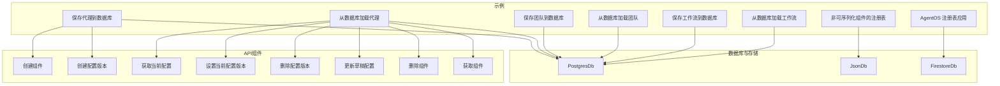
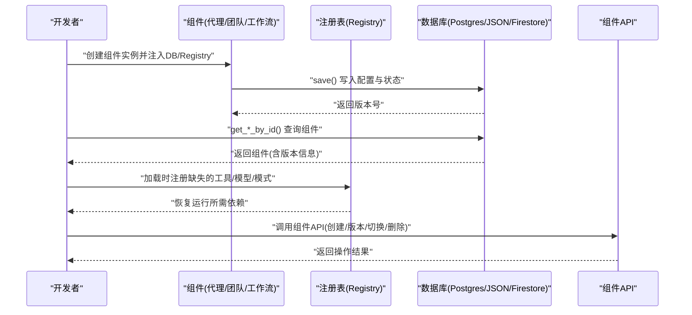
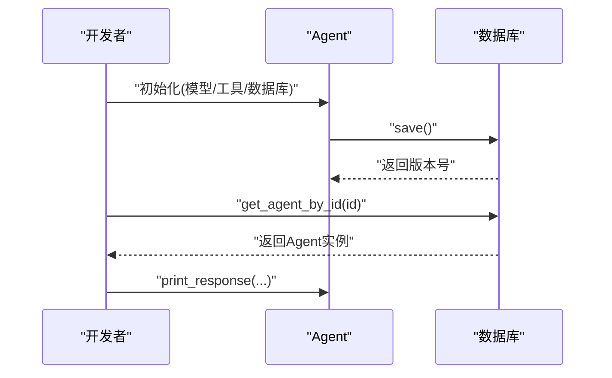
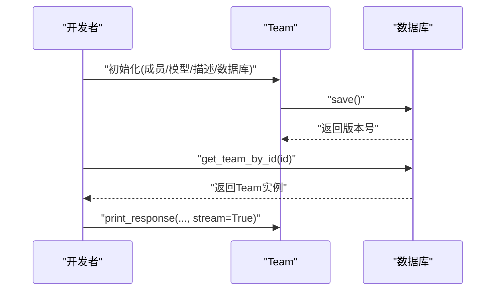
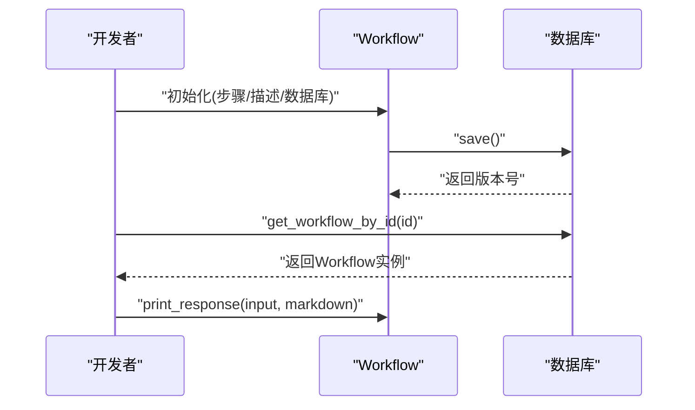
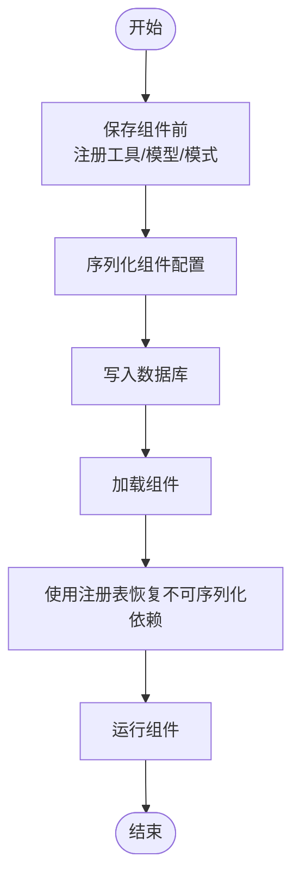
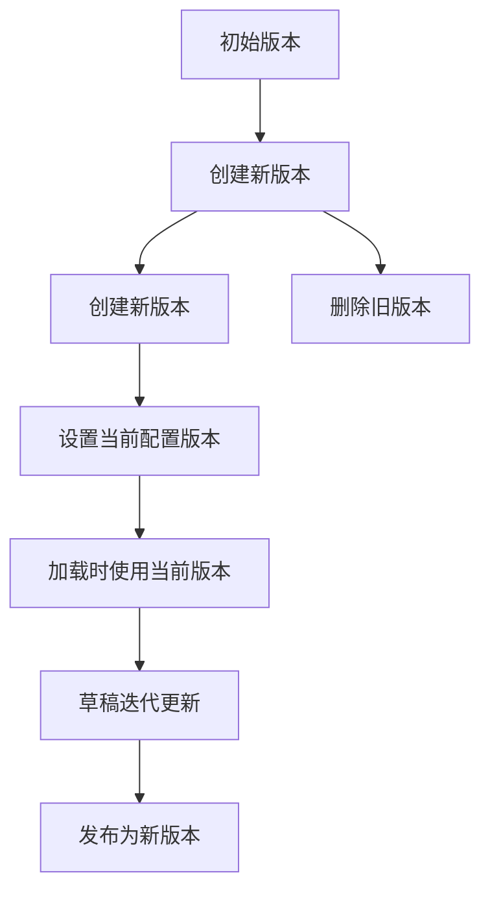
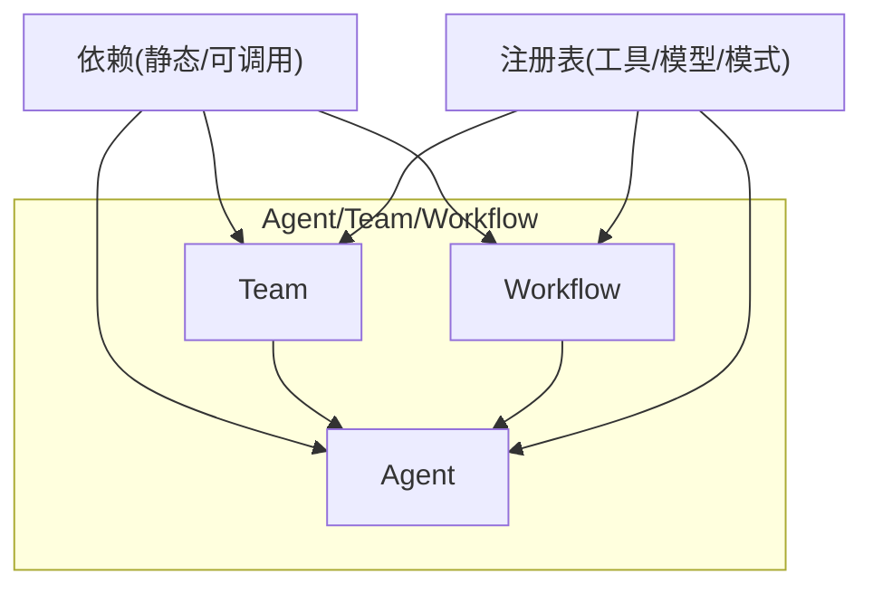
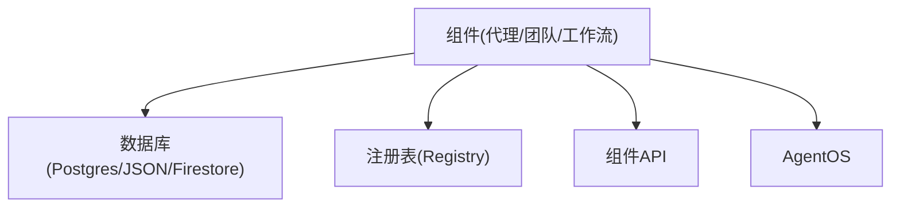

# 组件示例

<cite>
**本文引用的文件**
- [组件示例总览](file://examples/components/overview.mdx)
- [保存代理到数据库](file://examples/components/save-agent.mdx)
- [从数据库加载代理](file://examples/components/get-agent.mdx)
- [保存团队到数据库](file://examples/components/save-team.mdx)
- [从数据库加载团队](file://examples/components/get-team.mdx)
- [保存工作流到数据库](file://examples/components/save-workflow.mdx)
- [从数据库加载工作流](file://examples/components/get-workflow.mdx)
- [非可序列化组件的注册表](file://examples/components/registry.mdx)
- [AgentOS 注册表应用](file://examples/components/agent-os-registry.mdx)
- [Postgres 数据库参考](file://reference/storage/postgres.mdx)
- [JSON 文件数据库参考](file://reference/storage/json.mdx)
- [Firestore 数据库参考](file://reference/storage/firestore.mdx)
- [会话持久化概览](file://sessions/persisting-sessions/overview.mdx)
- [组件 API：创建组件](file://reference-api/schema/components/create-component.mdx)
- [组件 API：创建配置版本](file://reference-api/schema/components/create-config-version.mdx)
- [组件 API：获取当前配置](file://reference-api/schema/components/get-current-config.mdx)
- [组件 API：设置当前配置版本](file://reference-api/schema/components/set-current-config-version.mdx)
- [组件 API：删除配置版本](file://reference-api/schema/components/delete-config-version.mdx)
- [组件 API：更新草稿配置](file://reference-api/schema/components/update-draft-config.mdx)
- [组件 API：删除组件](file://reference-api/schema/components/delete-component.mdx)
- [组件 API：获取组件](file://reference-api/schema/components/get-component.mdx)
- [依赖注入概览](file://dependencies/overview.mdx)
- [团队依赖参考](file://dependencies/team/overview.mdx)
</cite>

## 目录
1. [简介](#简介)
2. [项目结构](#项目结构)
3. [核心组件](#核心组件)
4. [架构总览](#架构总览)
5. [详细组件分析](#详细组件分析)
6. [依赖分析](#依赖分析)
7. [性能考虑](#性能考虑)
8. [故障排查指南](#故障排查指南)
9. [结论](#结论)
10. [附录](#附录)

## 简介
本章节聚焦于“组件示例”主题，系统性讲解代理（Agent）、团队（Team）与工作流（Workflow）在数据库中的保存与加载机制，覆盖以下关键点：
- 使用注册表（Registry）恢复不可直接序列化的组件（如工具、模型、模式）
- 组件状态的持久化策略：数据库存储、文件存储、内存存储
- 版本管理与迁移：配置版本的创建、切换、删除与草稿更新
- 组件间依赖关系与通信机制：依赖注入、上下文传递、运行时解析
- 可维护与可扩展的组件系统设计建议

## 项目结构
该示例位于 examples/components 目录下，围绕三大组件（代理、团队、工作流）提供保存与加载的最小可运行示例，并配套注册表与 AgentOS 集成示例，以及数据库与 API 的参考文档。



图示来源
- [保存代理到数据库:1-63](file://examples/components/save-agent.mdx#L1-L63)
- [从数据库加载代理:1-50](file://examples/components/get-agent.mdx#L1-L50)
- [保存团队到数据库:1-83](file://examples/components/save-team.mdx#L1-L83)
- [从数据库加载团队:1-50](file://examples/components/get-team.mdx#L1-L50)
- [保存工作流到数据库:1-97](file://examples/components/save-workflow.mdx#L1-L97)
- [从数据库加载工作流:1-50](file://examples/components/get-workflow.mdx#L1-L50)
- [非可序列化组件的注册表:1-89](file://examples/components/registry.mdx#L1-L89)
- [AgentOS 注册表应用:1-83](file://examples/components/agent-os-registry.mdx#L1-L83)
- [Postgres 数据库参考:1-9](file://reference/storage/postgres.mdx#L1-L9)
- [JSON 文件数据库参考:1-8](file://reference/storage/json.mdx#L1-L8)
- [Firestore 数据库参考:1-8](file://reference/storage/firestore.mdx#L1-L8)
- [组件 API：创建组件:1-3](file://reference-api/schema/components/create-component.mdx#L1-L3)
- [组件 API：创建配置版本:1-3](file://reference-api/schema/components/create-config-version.mdx#L1-L3)
- [组件 API：获取当前配置:1-3](file://reference-api/schema/components/get-current-config.mdx#L1-L3)
- [组件 API：设置当前配置版本:1-3](file://reference-api/schema/components/set-current-config-version.mdx#L1-L3)
- [组件 API：删除配置版本:1-3](file://reference-api/schema/components/delete-config-version.mdx#L1-L3)
- [组件 API：更新草稿配置:1-3](file://reference-api/schema/components/update-draft-config.mdx#L1-L3)
- [组件 API：删除组件:1-3](file://reference-api/schema/components/delete-component.mdx#L1-L3)
- [组件 API：获取组件:1-3](file://reference-api/schema/components/get-component.mdx#L1-L3)

章节来源
- [组件示例总览:1-18](file://examples/components/overview.mdx#L1-L18)

## 核心组件
- 代理（Agent）：支持通过 save()/delete() 持久化自身配置与状态；通过 get_agent_by_id() 从数据库加载并运行。
- 团队（Team）：支持成员代理集合的保存与加载，提供打印响应等运行接口。
- 工作流（Workflow）：支持多步骤工作流的保存与加载，包含步骤（Step）与代理的组合。
- 注册表（Registry）：用于在加载阶段恢复不可直接序列化的组件（工具、模型、模式），确保运行时上下文完整。
- AgentOS：将组件与注册表集成，提供服务化入口，便于在生产环境部署。

章节来源
- [保存代理到数据库:1-63](file://examples/components/save-agent.mdx#L1-L63)
- [从数据库加载代理:1-50](file://examples/components/get-agent.mdx#L1-L50)
- [保存团队到数据库:1-83](file://examples/components/save-team.mdx#L1-L83)
- [从数据库加载团队:1-50](file://examples/components/get-team.mdx#L1-L50)
- [保存工作流到数据库:1-97](file://examples/components/save-workflow.mdx#L1-L97)
- [从数据库加载工作流:1-50](file://examples/components/get-workflow.mdx#L1-L50)
- [非可序列化组件的注册表:1-89](file://examples/components/registry.mdx#L1-L89)
- [AgentOS 注册表应用:1-83](file://examples/components/agent-os-registry.mdx#L1-L83)

## 架构总览
组件持久化与加载的整体流程如下：
- 初始化数据库客户端（Postgres/JSON/Firestore 等）
- 创建组件实例（Agent/Team/Workflow），注入数据库与可选注册表
- 调用 save() 生成新版本并写入数据库
- 通过 get_*_by_id() 或 API 获取指定版本并运行
- 使用注册表在加载时恢复不可序列化依赖，确保功能一致



图示来源
- [保存代理到数据库:1-63](file://examples/components/save-agent.mdx#L1-L63)
- [从数据库加载代理:1-50](file://examples/components/get-agent.mdx#L1-L50)
- [保存团队到数据库:1-83](file://examples/components/save-team.mdx#L1-L83)
- [从数据库加载团队:1-50](file://examples/components/get-team.mdx#L1-L50)
- [保存工作流到数据库:1-97](file://examples/components/save-workflow.mdx#L1-L97)
- [从数据库加载工作流:1-50](file://examples/components/get-workflow.mdx#L1-L50)
- [非可序列化组件的注册表:1-89](file://examples/components/registry.mdx#L1-L89)
- [AgentOS 注册表应用:1-83](file://examples/components/agent-os-registry.mdx#L1-L83)
- [组件 API：创建组件:1-3](file://reference-api/schema/components/create-component.mdx#L1-L3)
- [组件 API：创建配置版本:1-3](file://reference-api/schema/components/create-config-version.mdx#L1-L3)
- [组件 API：获取当前配置:1-3](file://reference-api/schema/components/get-current-config.mdx#L1-L3)
- [组件 API：设置当前配置版本:1-3](file://reference-api/schema/components/set-current-config-version.mdx#L1-L3)
- [组件 API：删除配置版本:1-3](file://reference-api/schema/components/delete-config-version.mdx#L1-L3)
- [组件 API：更新草稿配置:1-3](file://reference-api/schema/components/update-draft-config.mdx#L1-L3)
- [组件 API：删除组件:1-3](file://reference-api/schema/components/delete-component.mdx#L1-L3)
- [组件 API：获取组件:1-3](file://reference-api/schema/components/get-component.mdx#L1-L3)

## 详细组件分析

### 代理（Agent）保存与加载
- 保存：创建 Agent 实例并调用 save()，默认生成新版本并写入数据库。
- 加载：通过 get_agent_by_id(db, id) 获取组件；可选列出所有代理。
- 删除：支持软删除与硬删除（硬删除永久移除记录）。



图示来源
- [保存代理到数据库:1-63](file://examples/components/save-agent.mdx#L1-L63)
- [从数据库加载代理:1-50](file://examples/components/get-agent.mdx#L1-L50)

章节来源
- [保存代理到数据库:1-63](file://examples/components/save-agent.mdx#L1-L63)
- [从数据库加载代理:1-50](file://examples/components/get-agent.mdx#L1-L50)

### 团队（Team）保存与加载
- 成员代理：先创建成员代理，再将成员列表注入 Team。
- 保存与加载：与代理类似，调用 save() 与 get_team_by_id()。
- 运行：支持打印响应并开启流式输出。



图示来源
- [保存团队到数据库:1-83](file://examples/components/save-team.mdx#L1-L83)
- [从数据库加载团队:1-50](file://examples/components/get-team.mdx#L1-L50)

章节来源
- [保存团队到数据库:1-83](file://examples/components/save-team.mdx#L1-L83)
- [从数据库加载团队:1-50](file://examples/components/get-team.mdx#L1-L50)

### 工作流（Workflow）保存与加载
- 步骤（Step）：每个步骤绑定一个代理，形成串行或并行的工作流。
- 保存与加载：创建 Workflow 并调用 save()，通过 get_workflow_by_id() 获取。
- 运行：支持 Markdown 输出与输入参数传递。



图示来源
- [保存工作流到数据库:1-97](file://examples/components/save-workflow.mdx#L1-L97)
- [从数据库加载工作流:1-50](file://examples/components/get-workflow.mdx#L1-L50)

章节来源
- [保存工作流到数据库:1-97](file://examples/components/save-workflow.mdx#L1-L97)
- [从数据库加载工作流:1-50](file://examples/components/get-workflow.mdx#L1-L50)

### 注册表（Registry）与组件序列化
- 场景：当组件中包含不可直接序列化的对象（如函数、外部工具类、模式定义）时，需要在加载阶段通过注册表恢复。
- 用法：在保存前注册工具、模型、数据库与模式；加载时传入同一注册表以重建上下文。



图示来源
- [非可序列化组件的注册表:1-89](file://examples/components/registry.mdx#L1-L89)
- [AgentOS 注册表应用:1-83](file://examples/components/agent-os-registry.mdx#L1-L83)

章节来源
- [非可序列化组件的注册表:1-89](file://examples/components/registry.mdx#L1-L89)
- [AgentOS 注册表应用:1-83](file://examples/components/agent-os-registry.mdx#L1-L83)

### 组件状态持久化策略
- 数据库存储（推荐）：PostgreSQL 提供关系型存储、JSONB 支持、版本化与高效查询能力。
- 文件存储：JSON 文件适合本地开发与小规模场景，按会话拆分文件。
- 内存存储：适合临时测试与快速原型，不适用于生产。

```mermaid
graph LR
A["组件状态"] --> B["PostgresDb"]
A --> C["JsonDb"]
A --> D["内存存储"]
B --> E["关系型数据/版本化"]
C --> F["文件系统/易用性]
D --> G["临时/无持久化"]
```

图示来源
- [Postgres 数据库参考:1-9](file://reference/storage/postgres.mdx#L1-L9)
- [JSON 文件数据库参考:1-8](file://reference/storage/json.mdx#L1-L8)
- [会话持久化概览:1-30](file://sessions/persisting-sessions/overview.mdx#L1-L30)

章节来源
- [Postgres 数据库参考:1-9](file://reference/storage/postgres.mdx#L1-L9)
- [JSON 文件数据库参考:1-8](file://reference/storage/json.mdx#L1-L8)
- [会话持久化概览:1-30](file://sessions/persisting-sessions/overview.mdx#L1-L30)

### 组件版本管理与迁移
- 版本创建：每次 save() 默认创建新版本。
- 版本切换：通过设置当前配置版本，使后续加载使用最新稳定版本。
- 版本删除：支持删除特定版本或清理草稿。
- 草稿更新：允许对未发布的配置进行迭代更新。
- API 支持：组件 API 提供创建、获取、设置当前版本、删除版本与更新草稿等端点。



图示来源
- [组件 API：创建配置版本:1-3](file://reference-api/schema/components/create-config-version.mdx#L1-L3)
- [组件 API：获取当前配置:1-3](file://reference-api/schema/components/get-current-config.mdx#L1-L3)
- [组件 API：设置当前配置版本:1-3](file://reference-api/schema/components/set-current-config-version.mdx#L1-L3)
- [组件 API：删除配置版本:1-3](file://reference-api/schema/components/delete-config-version.mdx#L1-L3)
- [组件 API：更新草稿配置:1-3](file://reference-api/schema/components/update-draft-config.mdx#L1-L3)
- [组件 API：创建组件:1-3](file://reference-api/schema/components/create-component.mdx#L1-L3)
- [组件 API：删除组件:1-3](file://reference-api/schema/components/delete-component.mdx#L1-L3)
- [组件 API：获取组件:1-3](file://reference-api/schema/components/get-component.mdx#L1-L3)

章节来源
- [组件 API：创建配置版本:1-3](file://reference-api/schema/components/create-config-version.mdx#L1-L3)
- [组件 API：获取当前配置:1-3](file://reference-api/schema/components/get-current-config.mdx#L1-L3)
- [组件 API：设置当前配置版本:1-3](file://reference-api/schema/components/set-current-config-version.mdx#L1-L3)
- [组件 API：删除配置版本:1-3](file://reference-api/schema/components/delete-config-version.mdx#L1-L3)
- [组件 API：更新草稿配置:1-3](file://reference-api/schema/components/update-draft-config.mdx#L1-L3)
- [组件 API：创建组件:1-3](file://reference-api/schema/components/create-component.mdx#L1-L3)
- [组件 API：删除组件:1-3](file://reference-api/schema/components/delete-component.mdx#L1-L3)
- [组件 API：获取组件:1-3](file://reference-api/schema/components/get-component.mdx#L1-L3)

### 组件间依赖关系与通信机制
- 依赖注入：通过 dependencies 参数注入静态值或可调用函数，运行前自动解析并替换占位符。
- 上下文注入：可选择将依赖自动加入用户消息上下文中，便于指令模板使用。
- 团队协作：团队内部成员通过共享数据库与注册表实现状态与依赖的一致性。
- AgentOS 集成：将组件与注册表打包为应用并通过 serve() 提供服务。



图示来源
- [依赖注入概览:1-67](file://dependencies/overview.mdx#L1-L67)
- [团队依赖参考:1-104](file://dependencies/team/overview.mdx#L1-L104)
- [AgentOS 注册表应用:1-83](file://examples/components/agent-os-registry.mdx#L1-L83)

章节来源
- [依赖注入概览:1-67](file://dependencies/overview.mdx#L1-L67)
- [团队依赖参考:1-104](file://dependencies/team/overview.mdx#L1-L104)
- [AgentOS 注册表应用:1-83](file://examples/components/agent-os-registry.mdx#L1-L83)

## 依赖分析
- 组件与数据库：所有组件示例均通过 db 参数注入数据库客户端，实现状态持久化。
- 组件与注册表：在加载阶段恢复不可序列化依赖，避免运行时缺失。
- 组件与 API：通过组件 API 对组件与配置版本进行统一管理。
- 组件与 AgentOS：将组件与注册表集成，提供服务化部署能力。



图示来源
- [保存代理到数据库:1-63](file://examples/components/save-agent.mdx#L1-L63)
- [保存团队到数据库:1-83](file://examples/components/save-team.mdx#L1-L83)
- [保存工作流到数据库:1-97](file://examples/components/save-workflow.mdx#L1-L97)
- [非可序列化组件的注册表:1-89](file://examples/components/registry.mdx#L1-L89)
- [AgentOS 注册表应用:1-83](file://examples/components/agent-os-registry.mdx#L1-L83)
- [组件 API：创建组件:1-3](file://reference-api/schema/components/create-component.mdx#L1-L3)

章节来源
- [保存代理到数据库:1-63](file://examples/components/save-agent.mdx#L1-L63)
- [保存团队到数据库:1-83](file://examples/components/save-team.mdx#L1-L83)
- [保存工作流到数据库:1-97](file://examples/components/save-workflow.mdx#L1-L97)
- [非可序列化组件的注册表:1-89](file://examples/components/registry.mdx#L1-L89)
- [AgentOS 注册表应用:1-83](file://examples/components/agent-os-registry.mdx#L1-L83)
- [组件 API：创建组件:1-3](file://reference-api/schema/components/create-component.mdx#L1-L3)

## 性能考虑
- 数据库选择：生产环境优先选用关系型数据库（如 PostgreSQL）以获得更好的事务一致性与查询性能。
- 序列化开销：尽量减少不可序列化对象的数量，必要时通过注册表集中管理。
- 版本控制：合理使用版本与草稿机制，避免频繁创建过多历史版本导致查询复杂度上升。
- 会话持久化：启用数据库后，会话状态与运行元数据自动落盘，提升中断恢复能力。

## 故障排查指南
- 组件加载失败：检查是否正确传入注册表以恢复工具/模型/模式。
- 数据库连接问题：确认连接字符串、凭据与网络可达性。
- 版本不生效：确认已通过设置当前配置版本使目标版本成为默认。
- 删除误操作：区分软删除与硬删除，谨慎执行硬删除以防数据不可恢复。

章节来源
- [非可序列化组件的注册表:1-89](file://examples/components/registry.mdx#L1-L89)
- [会话持久化概览:1-30](file://sessions/persisting-sessions/overview.mdx#L1-L30)
- [组件 API：设置当前配置版本:1-3](file://reference-api/schema/components/set-current-config-version.mdx#L1-L3)
- [组件 API：删除配置版本:1-3](file://reference-api/schema/components/delete-config-version.mdx#L1-L3)

## 结论
通过数据库持久化、注册表恢复与版本管理，代理、团队与工作流可在不同环境中保持一致的行为与状态。结合依赖注入与 AgentOS 集成，可以构建可维护、可扩展且具备生产级鲁棒性的组件系统。

## 附录
- 示例清单与用途速览见“组件示例总览”。

章节来源
- [组件示例总览:1-18](file://examples/components/overview.mdx#L1-L18)