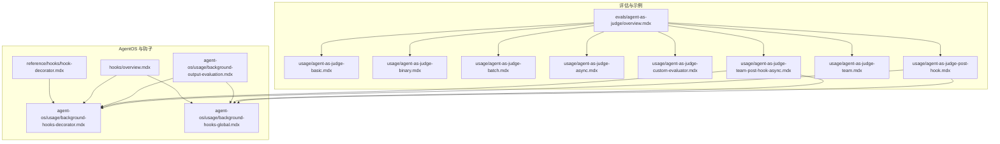
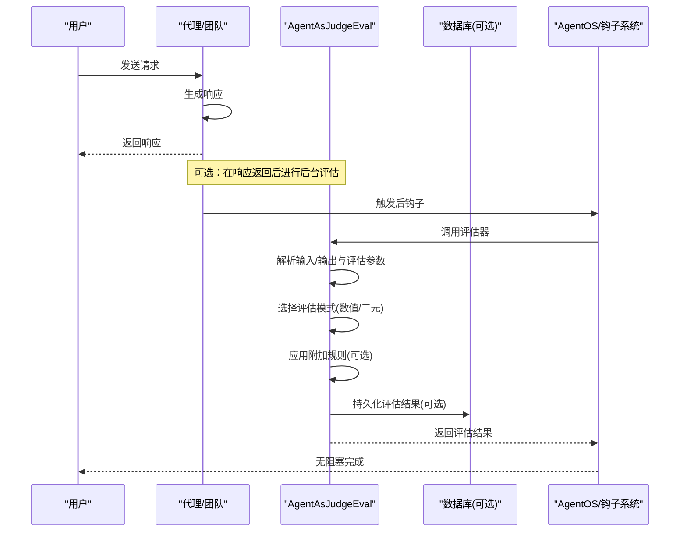
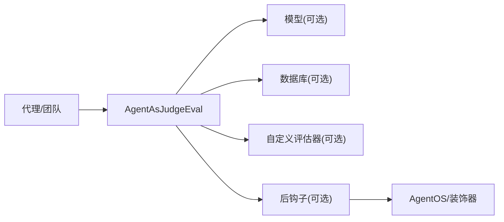

# 代理作为评判者示例

<cite>
**本文引用的文件**
- [evals/agent-as-judge/overview.mdx](file://evals/agent-as-judge/overview.mdx)
- [evals/agent-as-judge/usage/agent-as-judge-basic.mdx](file://evals/agent-as-judge/usage/agent-as-judge-basic.mdx)
- [evals/agent-as-judge/usage/agent-as-judge-binary.mdx](file://evals/agent-as-judge/usage/agent-as-judge-binary.mdx)
- [evals/agent-as-judge/usage/agent-as-judge-batch.mdx](file://evals/agent-as-judge/usage/agent-as-judge-batch.mdx)
- [evals/agent-as-judge/usage/agent-as-judge-async.mdx](file://evals/agent-as-judge/usage/agent-as-judge-async.mdx)
- [evals/agent-as-judge/usage/agent-as-judge-custom-evaluator.mdx](file://evals/agent-as-judge/usage/agent-as-judge-custom-evaluator.mdx)
- [evals/agent-as-judge/usage/agent-as-judge-post-hook.mdx](file://evals/agent-as-judge/usage/agent-as-judge-post-hook.mdx)
- [evals/agent-as-judge/usage/agent-as-judge-team.mdx](file://evals/agent-as-judge/usage/agent-as-judge-team.mdx)
- [evals/agent-as-judge/usage/agent-as-judge-team-post-hook-async.mdx](file://evals/agent-as-judge/usage/agent-as-judge-team-post-hook-async.mdx)
- [agent-os/usage/background-hooks-decorator.mdx](file://agent-os/usage/background-hooks-decorator.mdx)
- [agent-os/usage/background-hooks-global.mdx](file://agent-os/usage/background-hooks-global.mdx)
- [agent-os/usage/background-output-evaluation.mdx](file://agent-os/usage/background-output-evaluation.mdx)
- [hooks/overview.mdx](file://hooks/overview.mdx)
- [reference/hooks/hook-decorator.mdx](file://reference/hooks/hook-decorator.mdx)
</cite>

## 目录
1. [简介](#简介)
2. [项目结构](#项目结构)
3. [核心组件](#核心组件)
4. [架构总览](#架构总览)
5. [详细组件分析](#详细组件分析)
6. [依赖关系分析](#依赖关系分析)
7. [性能考量](#性能考量)
8. [故障排查指南](#故障排查指南)
9. [结论](#结论)
10. [附录](#附录)

## 简介
本技术文档围绕“代理作为评判者”示例，系统讲解如何基于模型驱动的评分体系对代理与团队的输出进行质量评估。文档覆盖以下关键主题：
- 基本代理评判：单次输入/输出对的评分与通过判定
- 二元判断：仅 PASS/FAIL 的快速评估模式
- 批量评估：一次运行中对多组输入/输出进行并行或顺序评估
- 团队评估：针对团队协作产物的质量打分
- 判决指南与附加规则：在标准准则之外引入额外指导原则
- 自定义评估器：使用具备特定指令的专用代理充当评估者
- 后钩子与异步团队评估：在不阻塞响应的前提下自动评估团队输出
- 配置项与最佳实践：参数说明、回调与存储策略、生产扩展建议

## 项目结构
本示例位于仓库的评估与示例目录中，主要涉及“代理作为评判者”的使用文档与示例代码，以及 AgentOS 的后钩子与后台任务机制。

图表来源
- [evals/agent-as-judge/overview.mdx](file://evals/agent-as-judge/overview.mdx)
- [evals/agent-as-judge/usage/agent-as-judge-basic.mdx](file://evals/agent-as-judge/usage/agent-as-judge-basic.mdx)
- [evals/agent-as-judge/usage/agent-as-judge-batch.mdx](file://evals/agent-as-judge/usage/agent-as-judge-batch.mdx)
- [evals/agent-as-judge/usage/agent-as-judge-async.mdx](file://evals/agent-as-judge/usage/agent-as-judge-async.mdx)
- [evals/agent-as-judge/usage/agent-as-judge-custom-evaluator.mdx](file://evals/agent-as-judge/usage/agent-as-judge-custom-evaluator.mdx)
- [evals/agent-as-judge/usage/agent-as-judge-post-hook.mdx](file://evals/agent-as-judge/usage/agent-as-judge-post-hook.mdx)
- [evals/agent-as-judge/usage/agent-as-judge-team.mdx](file://evals/agent-as-judge/usage/agent-as-judge-team.mdx)
- [evals/agent-as-judge/usage/agent-as-judge-team-post-hook-async.mdx](file://evals/agent-as-judge/usage/agent-as-judge-team-post-hook-async.mdx)
- [agent-os/usage/background-hooks-decorator.mdx](file://agent-os/usage/background-hooks-decorator.mdx)
- [agent-os/usage/background-hooks-global.mdx](file://agent-os/usage/background-hooks-global.mdx)
- [agent-os/usage/background-output-evaluation.mdx](file://agent-os/usage/background-output-evaluation.mdx)
- [hooks/overview.mdx](file://hooks/overview.mdx)
- [reference/hooks/hook-decorator.mdx](file://reference/hooks/hook-decorator.mdx)

章节来源
- [evals/agent-as-judge/overview.mdx](file://evals/agent-as-judge/overview.mdx)
- [evals/agent-as-judge/usage/agent-as-judge-basic.mdx](file://evals/agent-as-judge/usage/agent-as-judge-basic.mdx)
- [evals/agent-as-judge/usage/agent-as-judge-batch.mdx](file://evals/agent-as-judge/usage/agent-as-judge-batch.mdx)
- [evals/agent-as-judge/usage/agent-as-judge-async.mdx](file://evals/agent-as-judge/usage/agent-as-judge-async.mdx)
- [evals/agent-as-judge/usage/agent-as-judge-custom-evaluator.mdx](file://evals/agent-as-judge/usage/agent-as-judge-custom-evaluator.mdx)
- [evals/agent-as-judge/usage/agent-as-judge-post-hook.mdx](file://evals/agent-as-judge/usage/agent-as-judge-post-hook.mdx)
- [evals/agent-as-judge/usage/agent-as-judge-team.mdx](file://evals/agent-as-judge/usage/agent-as-judge-team.mdx)
- [evals/agent-as-judge/usage/agent-as-judge-team-post-hook-async.mdx](file://evals/agent-as-judge/usage/agent-as-judge-team-post-hook-async.mdx)
- [agent-os/usage/background-hooks-decorator.mdx](file://agent-os/usage/background-hooks-decorator.mdx)
- [agent-os/usage/background-hooks-global.mdx](file://agent-os/usage/background-hooks-global.mdx)
- [agent-os/usage/background-output-evaluation.mdx](file://agent-os/usage/background-output-evaluation.mdx)
- [hooks/overview.mdx](file://hooks/overview.mdx)
- [reference/hooks/hook-decorator.mdx](file://reference/hooks/hook-decorator.mdx)

## 核心组件
- 评估器组件：AgentAsJudgeEval 提供统一的评估入口，支持同步/异步运行、批量评估、阈值判定、失败回调、数据库持久化、调试与遥测开关、后台运行等能力。
- 评估模式：
  - 数值评分（numeric）：1-10 分，配合阈值 threshold 判定通过与否
  - 二元判断（binary）：仅 PASS/FAIL，无需阈值
- 评估数据源：单次输入/输出对或批量输入/输出对列表
- 存储与输出：可选数据库（同步/异步）持久化评估结果；可打印摘要与明细
- 自定义评估器：允许注入一个具备特定指令的 Agent 实例作为评估者，以提升评估一致性与专业性
- 判决指南：除核心 criteria 外，可传入 additional_guidelines 作为补充规则
- 后台运行：run_in_background 控制是否非阻塞执行评估

章节来源
- [evals/agent-as-judge/overview.mdx](file://evals/agent-as-judge/overview.mdx)

## 架构总览
下图展示了从用户请求到评估结果落地的关键流程，涵盖同步与异步两种路径，并体现后钩子与 AgentOS 的集成方式。

图表来源
- [evals/agent-as-judge/usage/agent-as-judge-post-hook.mdx](file://evals/agent-as-judge/usage/agent-as-judge-post-hook.mdx)
- [evals/agent-as-judge/usage/agent-as-judge-team-post-hook-async.mdx](file://evals/agent-as-judge/usage/agent-as-judge-team-post-hook-async.mdx)
- [agent-os/usage/background-output-evaluation.mdx](file://agent-os/usage/background-output-evaluation.mdx)
- [agent-os/usage/background-hooks-decorator.mdx](file://agent-os/usage/background-hooks-decorator.mdx)
- [agent-os/usage/background-hooks-global.mdx](file://agent-os/usage/background-hooks-global.mdx)

## 详细组件分析

### 组件一：基础代理评判（数值评分）
- 场景：对单个输入/输出对进行 1-10 分评分，并按阈值判定通过与否
- 关键点：
  - 使用 criteria 描述评估标准
  - 设置 scoring_strategy="numeric" 与 threshold
  - 可选 db 进行结果持久化
  - 支持 print_results/print_summary 输出
- 示例参考路径：
  - [evals/agent-as-judge/usage/agent-as-judge-basic.mdx](file://evals/agent-as-judge/usage/agent-as-judge-basic.mdx)

章节来源
- [evals/agent-as-judge/usage/agent-as-judge-basic.mdx](file://evals/agent-as-judge/usage/agent-as-judge-basic.mdx)

### 组件二：二元判断（PASS/FAIL）
- 场景：不需要数值评分，仅需快速判定是否符合要求
- 关键点：
  - scoring_strategy="binary"
  - 不需要 threshold
  - 适合高吞吐、低复杂度的合规检查
- 示例参考路径：
  - [evals/agent-as-judge/usage/agent-as-judge-binary.mdx](file://evals/agent-as-judge/usage/agent-as-judge-binary.mdx)

章节来源
- [evals/agent-as-judge/usage/agent-as-judge-binary.mdx](file://evals/agent-as-judge/usage/agent-as-judge-binary.mdx)

### 组件三：批量评估
- 场景：一次性评估多个输入/输出对，统计整体通过率与明细
- 关键点：
  - 传入 cases 列表进行批量评估
  - 支持 print_summary 输出整体统计
  - 可选 db 持久化每条记录
- 示例参考路径：
  - [evals/agent-as-judge/usage/agent-as-judge-batch.mdx](file://evals/agent-as-judge/usage/agent-as-judge-batch.mdx)

章节来源
- [evals/agent-as-judge/usage/agent-as-judge-batch.mdx](file://evals/agent-as-judge/usage/agent-as-judge-batch.mdx)

### 组件四：团队评估
- 场景：对团队协作后的综合输出进行质量评估
- 关键点：
  - 将 AgentAsJudgeEval 作为 Team 的评估步骤
  - criteria 针对团队协作产物的完整性、逻辑性与表达质量
- 示例参考路径：
  - [evals/agent-as-judge/usage/agent-as-judge-team.mdx](file://evals/agent-as-judge/usage/agent-as-judge-team.mdx)

章节来源
- [evals/agent-as-judge/usage/agent-as-judge-team.mdx](file://evals/agent-as-judge/usage/agent-as-judge-team.mdx)

### 组件五：异步评估（数值评分）
- 场景：在不阻塞主流程的情况下进行异步评估
- 关键点：
  - 使用 arun 异步运行评估
  - 适用于高并发、低延迟要求的生产环境
- 示例参考路径：
  - [evals/agent-as-judge/usage/agent-as-judge-async.mdx](file://evals/agent-as-judge/usage/agent-as-judge-async.mdx)

章节来源
- [evals/agent-as-judge/usage/agent-as-judge-async.mdx](file://evals/agent-as-judge/usage/agent-as-judge-async.mdx)

### 组件六：自定义评估器
- 场景：使用具备特定指令的专用代理作为评估者，提升评估一致性与专业性
- 关键点：
  - 通过 evaluator_agent 参数注入自定义评估代理
  - 适合对技术细节、行业规范有更高要求的场景
- 示例参考路径：
  - [evals/agent-as-judge/usage/agent-as-judge-custom-evaluator.mdx](file://evals/agent-as-judge/usage/agent-as-judge-custom-evaluator.mdx)

章节来源
- [evals/agent-as-judge/usage/agent-as-judge-custom-evaluator.mdx](file://evals/agent-as-judge/usage/agent-as-judge-custom-evaluator.mdx)

### 组件七：后钩子与异步团队评估
- 场景：在团队执行完成后自动触发异步评估，不阻塞响应
- 关键点：
  - 将 AgentAsJudgeEval 注册为 Team 的 post_hooks
  - 使用异步数据库（AsyncSqliteDb）保存结果
  - 结合 AgentOS 的全局后台钩子或 @hook 装饰器实现非阻塞评估
- 示例参考路径：
  - [evals/agent-as-judge/usage/agent-as-judge-team-post-hook-async.mdx](file://evals/agent-as-judge/usage/agent-as-judge-team-post-hook-async.mdx)
  - [agent-os/usage/background-hooks-decorator.mdx](file://agent-os/usage/background-hooks-decorator.mdx)
  - [agent-os/usage/background-hooks-global.mdx](file://agent-os/usage/background-hooks-global.mdx)

章节来源
- [evals/agent-as-judge/usage/agent-as-judge-team-post-hook-async.mdx](file://evals/agent-as-judge/usage/agent-as-judge-team-post-hook-async.mdx)
- [agent-os/usage/background-hooks-decorator.mdx](file://agent-os/usage/background-hooks-decorator.mdx)
- [agent-os/usage/background-hooks-global.mdx](file://agent-os/usage/background-hooks-global.mdx)

### 组件八：判决指南与附加规则
- 场景：在核心 criteria 之外，增加额外的结构化指导原则，确保评估更贴近业务细节
- 关键点：
  - 通过 additional_guidelines 传入字符串或字符串列表
  - 适合对格式、单位、变体说明等有强制要求的领域
- 示例参考路径：
  - [evals/agent-as-judge/usage/agent-as-judge-with-guidelines.mdx](file://examples/evals/agent-as-judge/agent-as-judge-with-guidelines.mdx)

章节来源
- [evals/agent-as-judge/usage/agent-as-judge-with-guidelines.mdx](file://examples/evals/agent-as-judge/agent-as-judge-with-guidelines.mdx)

### 组件九：后钩子中的同步/异步评估
- 场景：在代理层面对输出进行后钩子评估，支持同步与异步两种模式
- 关键点：
  - 同步模式：评估完成后才返回响应，适合必须拦截的严格校验
  - 异步模式：使用 @hook(run_in_background=True) 或 AgentOS 全局后台模式，不阻塞响应
- 示例参考路径：
  - [evals/agent-as-judge/usage/agent-as-judge-post-hook.mdx](file://evals/agent-as-judge/usage/agent-as-judge-post-hook.mdx)
  - [reference/hooks/hook-decorator.mdx](file://reference/hooks/hook-decorator.mdx)
  - [hooks/overview.mdx](file://hooks/overview.mdx)

章节来源
- [evals/agent-as-judge/usage/agent-as-judge-post-hook.mdx](file://evals/agent-as-judge/usage/agent-as-judge-post-hook.mdx)
- [reference/hooks/hook-decorator.mdx](file://reference/hooks/hook-decorator.mdx)
- [hooks/overview.mdx](file://hooks/overview.mdx)

## 依赖关系分析
- 评估器依赖：
  - 代理/团队：提供输入与输出
  - 数据库：可选，用于持久化评估结果
  - 模型：默认使用 gpt-5-mini，也可指定具体模型
  - 自定义评估器：可选，替换默认评估逻辑
- 后台运行依赖：
  - AgentOS：全局启用后台钩子或 @hook 装饰器
  - 异步数据库：在异步场景下使用 AsyncSqliteDb 等

图表来源
- [evals/agent-as-judge/overview.mdx](file://evals/agent-as-judge/overview.mdx)
- [agent-os/usage/background-hooks-decorator.mdx](file://agent-os/usage/background-hooks-decorator.mdx)
- [agent-os/usage/background-hooks-global.mdx](file://agent-os/usage/background-hooks-global.mdx)

章节来源
- [evals/agent-as-judge/overview.mdx](file://evals/agent-as-judge/overview.mdx)
- [agent-os/usage/background-hooks-decorator.mdx](file://agent-os/usage/background-hooks-decorator.mdx)
- [agent-os/usage/background-hooks-global.mdx](file://agent-os/usage/background-hooks-global.mdx)

## 性能考量
- 异步评估优先：在高并发场景下使用 arun 与异步数据库，避免阻塞响应
- 后台钩子：通过 AgentOS 全局后台或 @hook(run_in_background=True) 将非关键评估移至后台
- 二元判断：在对速度敏感且规则明确的场景下采用 binary 模式，减少计算开销
- 批量评估：合并多次评估为一次调用，降低网络与模型调用次数
- 评估器复用：通过自定义评估器统一评估口径，减少重复提示工程成本

## 故障排查指南
- 评估未返回分数或通过状态
  - 检查是否正确传入 input 与 output 或 cases
  - 确认 db 初始化与连接正常
- 评估结果未入库
  - 确认 db 参数已传入且类型匹配（同步/异步）
  - 检查异步场景下是否使用 AsyncSqliteDb
- 后台评估未生效
  - 确认 AgentOS 是否开启 run_hooks_in_background 或 @hook 装饰器是否正确标注
  - 检查后钩子注册位置与顺序
- 评估器未按预期执行
  - 确认 evaluator_agent 是否正确注入
  - 检查 additional_guidelines 是否与 criteria 协同

章节来源
- [evals/agent-as-judge/usage/agent-as-judge-post-hook.mdx](file://evals/agent-as-judge/usage/agent-as-judge-post-hook.mdx)
- [agent-os/usage/background-output-evaluation.mdx](file://agent-os/usage/background-output-evaluation.mdx)
- [hooks/overview.mdx](file://hooks/overview.mdx)

## 结论
通过“代理作为评判者”示例，开发者可以灵活地在不同场景下构建智能化的输出质量评估系统：
- 在保证用户体验的前提下，使用异步与后台钩子进行非阻塞评估
- 通过二元判断与数值评分满足不同严苛度需求
- 通过批量评估与自定义评估器提升规模化与一致性
- 通过附加规则与团队评估覆盖更复杂的业务质量目标

## 附录
- 参数速查（来自概述文档）
  - criteria：评估标准描述（必填）
  - scoring_strategy：数值/二元
  - threshold：数值评分阈值（仅数值模式）
  - on_fail：失败回调
  - additional_guidelines：附加规则
  - name/model/evaluator_agent：命名与模型、自定义评估器
  - print_summary/print_results：输出控制
  - file_path_to_save_results：结果落盘路径
  - debug_mode：调试日志
  - db：数据库实例（同步/异步）
  - telemetry：遥测开关
  - run_in_background：后台运行开关

章节来源
- [evals/agent-as-judge/overview.mdx](file://evals/agent-as-judge/overview.mdx)