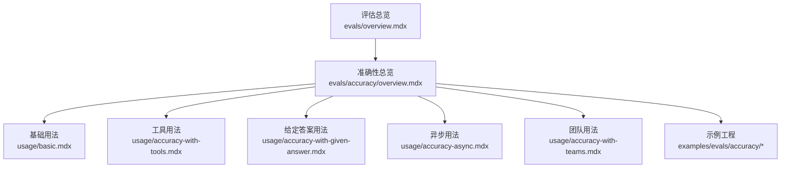
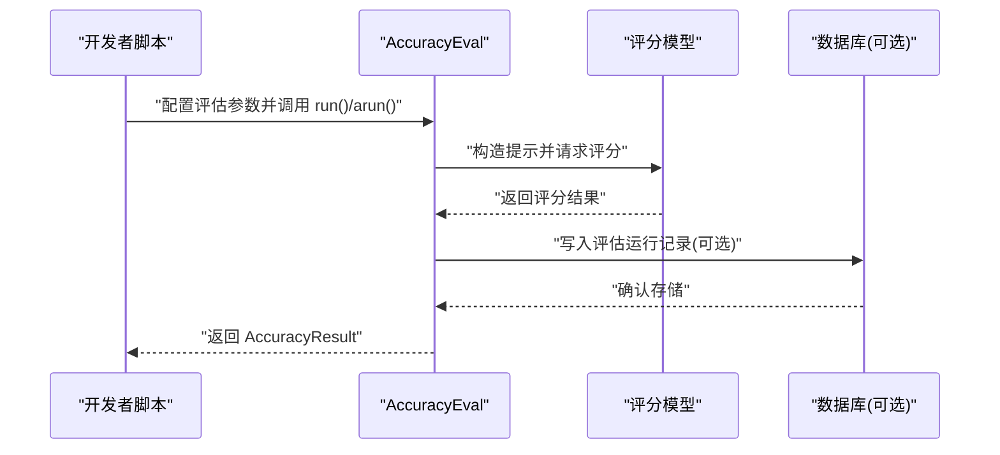
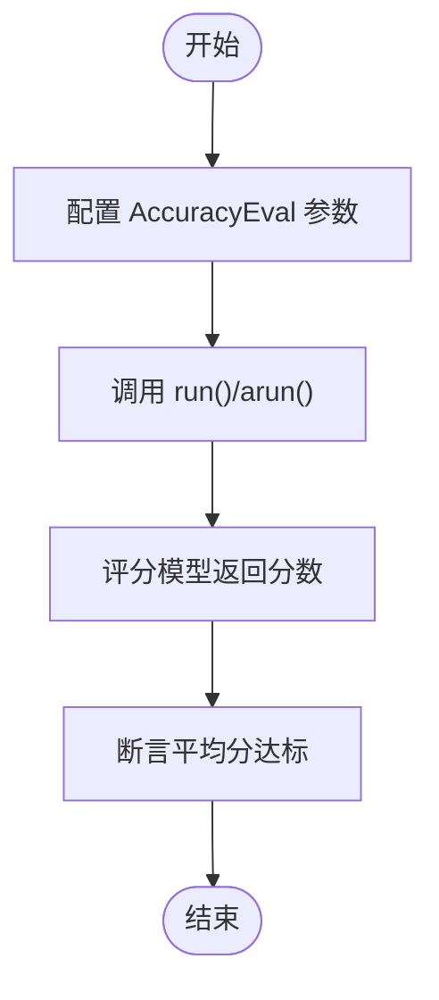
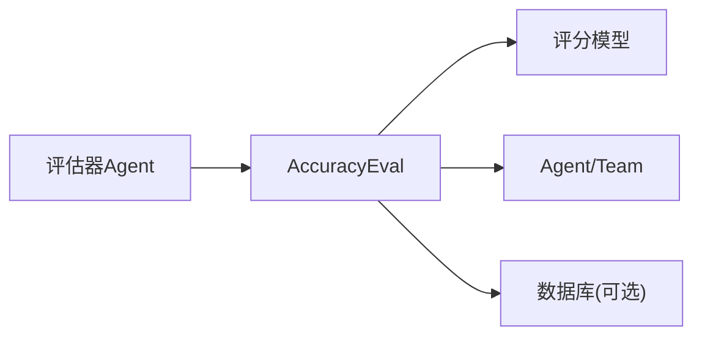

# 准确性评估示例

<cite>
**本文引用的文件**
- [evals/overview.mdx](file://evals/overview.mdx)
- [evals/accuracy/overview.mdx](file://evals/accuracy/overview.mdx)
- [evals/accuracy/usage/basic.mdx](file://evals/accuracy/usage/basic.mdx)
- [evals/accuracy/usage/accuracy-with-tools.mdx](file://evals/accuracy/usage/accuracy-with-tools.mdx)
- [evals/accuracy/usage/accuracy-with-given-answer.mdx](file://evals/accuracy/usage/accuracy-with-given-answer.mdx)
- [evals/accuracy/usage/accuracy-async.mdx](file://evals/accuracy/usage/accuracy-async.mdx)
- [evals/accuracy/usage/accuracy-with-teams.mdx](file://evals/accuracy/usage/accuracy-with-teams.mdx)
- [examples/evals/accuracy/accuracy-basic.mdx](file://examples/evals/accuracy/accuracy-basic.mdx)
- [examples/evals/accuracy/accuracy-with-given-answer.mdx](file://examples/evals/accuracy/accuracy-with-given-answer.mdx)
- [examples/evals/accuracy/evaluator-agent.mdx](file://examples/evals/accuracy/evaluator-agent.mdx)
- [examples/evals/accuracy/db-logging.mdx](file://examples/evals/accuracy/db-logging.mdx)
</cite>

## 目录
1. [简介](#简介)
2. [项目结构](#项目结构)
3. [核心组件](#核心组件)
4. [架构总览](#架构总览)
5. [详细组件分析](#详细组件分析)
6. [依赖关系分析](#依赖关系分析)
7. [性能考量](#性能考量)
8. [故障排查指南](#故障排查指南)
9. [结论](#结论)
10. [附录](#附录)

## 简介
本技术文档围绕 Agno 框架的“准确性评估”能力，系统讲解如何在不同场景下衡量代理（Agent）与团队（Team）的输出质量。内容覆盖基础准确性评估、给定答案比较、工具使用评估、团队评估、异步评估以及数据库日志记录等主题，并给出可直接参考的示例路径与最佳实践，帮助开发者快速构建稳定可靠的评估体系。

## 项目结构
准确性评估示例分布在以下位置：
- 根评估概览：evals/overview.mdx
- 准确性评估总览与多场景示例：evals/accuracy/overview.mdx
- 各类用法示例（基础、工具、给定答案、异步、团队）：evals/accuracy/usage/*.mdx
- 示例工程（更完整的运行示例）：examples/evals/accuracy/*.mdx

图表来源
- [evals/overview.mdx:1-66](file://evals/overview.mdx#L1-L66)
- [evals/accuracy/overview.mdx:1-359](file://evals/accuracy/overview.mdx#L1-L359)

章节来源
- [evals/overview.mdx:1-66](file://evals/overview.mdx#L1-L66)
- [evals/accuracy/overview.mdx:1-359](file://evals/accuracy/overview.mdx#L1-L359)

## 核心组件
- AccuracyEval：用于执行准确性评估的核心类，支持传入 Agent 或 Team、输入、期望输出、额外指导语、迭代次数等参数；提供同步 run 与异步 arun 方法。
- AccuracyResult：评估结果对象，包含平均分等指标，便于断言与后续处理。
- AccuracyAgentResponse：可选的评估器 Agent 输出模式，用于以结构化方式返回评估结果。
- 数据库集成：通过传入数据库实例，将评估运行记录持久化到数据库，便于平台化追踪与查询。

章节来源
- [evals/accuracy/overview.mdx:16-76](file://evals/accuracy/overview.mdx#L16-L76)
- [evals/accuracy/overview.mdx:117-133](file://evals/accuracy/overview.mdx#L117-L133)
- [evals/accuracy/overview.mdx:139-166](file://evals/accuracy/overview.mdx#L139-L166)
- [evals/accuracy/overview.mdx:171-218](file://evals/accuracy/overview.mdx#L171-L218)
- [evals/accuracy/overview.mdx:282-347](file://evals/accuracy/overview.mdx#L282-L347)

## 架构总览
下图展示了从调用 AccuracyEval 到得到评估结果的整体流程，包括可选的评估器 Agent 与数据库日志记录：

图表来源
- [evals/accuracy/overview.mdx:16-76](file://evals/accuracy/overview.mdx#L16-L76)
- [evals/accuracy/overview.mdx:282-347](file://evals/accuracy/overview.mdx#L282-L347)

## 详细组件分析

### 基础准确性评估
- 场景说明：对单个 Agent 的回答与期望输出进行对比评分，适合快速验证核心逻辑。
- 关键点：
  - 使用 AccuracyEval 配置 model、agent、input、expected_output、additional_guidelines、num_iterations 等。
  - 通过 run() 执行评估，或通过 arun() 异步执行。
  - 断言 avg_score 达到阈值，确保输出质量。
- 示例路径：
  - [evals/accuracy/usage/basic.mdx](file://evals/accuracy/usage/basic.mdx)
  - [examples/evals/accuracy/accuracy-basic.mdx](file://examples/evals/accuracy/accuracy-basic.mdx)

图表来源
- [evals/accuracy/usage/basic.mdx:18-32](file://evals/accuracy/usage/basic.mdx#L18-L32)
- [examples/evals/accuracy/accuracy-basic.mdx:37-62](file://examples/evals/accuracy/accuracy-basic.mdx#L37-L62)

章节来源
- [evals/accuracy/usage/basic.mdx:1-65](file://evals/accuracy/usage/basic.mdx#L1-L65)
- [examples/evals/accuracy/accuracy-basic.mdx:1-76](file://examples/evals/accuracy/accuracy-basic.mdx#L1-L76)

### 给定答案比较
- 场景说明：当已有明确答案时，无需运行 Agent，直接对给定答案进行评分，适合离线测试与回归验证。
- 关键点：
  - 使用 AccuracyEval(input, expected_output) 创建评估。
  - 调用 run_with_output(output=...) 对指定答案进行评分。
  - 断言结果满足阈值。
- 示例路径：
  - [evals/accuracy/usage/accuracy-with-given-answer.mdx](file://evals/accuracy/usage/accuracy-with-given-answer.mdx)
  - [examples/evals/accuracy/accuracy-with-given-answer.mdx](file://examples/evals/accuracy/accuracy-with-given-answer.mdx)

章节来源
- [evals/accuracy/usage/accuracy-with-given-answer.mdx:1-58](file://evals/accuracy/usage/accuracy-with-given-answer.mdx#L1-L58)
- [examples/evals/accuracy/accuracy-with-given-answer.mdx:1-51](file://examples/evals/accuracy/accuracy-with-given-answer.mdx#L1-L51)

### 工具使用评估
- 场景说明：结合工具（如计算器）完成复杂任务，评估 Agent 是否正确使用工具并得出正确答案。
- 关键点：
  - 在 Agent 中注入所需工具。
  - 通过 AccuracyEval 对工具链路进行端到端评估。
  - 可配合 additional_guidelines 强化评分维度。
- 示例路径：
  - [evals/accuracy/usage/accuracy-with-tools.mdx](file://evals/accuracy/usage/accuracy-with-tools.mdx)
  - [evals/accuracy/overview.mdx:90-111](file://evals/accuracy/overview.mdx#L90-L111)

章节来源
- [evals/accuracy/usage/accuracy-with-tools.mdx:1-63](file://evals/accuracy/usage/accuracy-with-tools.mdx#L1-L63)
- [evals/accuracy/overview.mdx:86-111](file://evals/accuracy/overview.mdx#L86-L111)

### 团队评估
- 场景说明：对多成员协作的 Team 进行准确性评估，验证路由、语言切换、Markdown 输出等行为。
- 关键点：
  - 定义多 Agent Team 并设置 respond_directly、markdown、instructions 等。
  - 使用 AccuracyEval 对 Team 的响应进行评分。
- 示例路径：
  - [evals/accuracy/usage/accuracy-with-teams.mdx](file://evals/accuracy/usage/accuracy-with-teams.mdx)
  - [evals/accuracy/overview.mdx:171-218](file://evals/accuracy/overview.mdx#L171-L218)

章节来源
- [evals/accuracy/usage/accuracy-with-teams.mdx:1-88](file://evals/accuracy/usage/accuracy-with-teams.mdx#L1-L88)
- [evals/accuracy/overview.mdx:168-218](file://evals/accuracy/overview.mdx#L168-L218)

### 异步评估
- 场景说明：在高并发或长耗时场景中，使用异步评估提升吞吐与资源利用率。
- 关键点：
  - 使用 arun() 替代 run() 执行异步评估。
  - 结合 asyncio.run(...) 获取结果。
- 示例路径：
  - [evals/accuracy/usage/accuracy-async.mdx](file://evals/accuracy/usage/accuracy-async.mdx)
  - [evals/accuracy/overview.mdx:135-166](file://evals/accuracy/overview.mdx#L135-L166)

章节来源
- [evals/accuracy/usage/accuracy-async.mdx:1-68](file://evals/accuracy/usage/accuracy-async.mdx#L1-L68)
- [evals/accuracy/overview.mdx:135-166](file://evals/accuracy/overview.mdx#L135-L166)

### 评估器 Agent 与自定义评分
- 场景说明：使用另一个 Agent 作为“评估器”，对目标 Agent 的回答进行结构化评分，提升评估一致性与可解释性。
- 关键点：
  - 为评估器 Agent 指定输出模式（如 AccuracyAgentResponse）。
  - 将评估器 Agent 传入 AccuracyEval，替代默认评分策略。
- 示例路径：
  - [evals/accuracy/overview.mdx:47-76](file://evals/accuracy/overview.mdx#L47-L76)
  - [examples/evals/accuracy/evaluator-agent.mdx](file://examples/evals/accuracy/evaluator-agent.mdx)

章节来源
- [evals/accuracy/overview.mdx:41-76](file://evals/accuracy/overview.mdx#L41-L76)
- [examples/evals/accuracy/evaluator-agent.mdx:1-59](file://examples/evals/accuracy/evaluator-agent.mdx#L1-L59)

### 数据库日志记录与平台化追踪
- 场景说明：将评估运行记录持久化到数据库，结合 AgentOS 平台进行可视化与历史对比。
- 关键点：
  - 在 AccuracyEval 中传入数据库实例，启用自动落库。
  - 通过 AgentOS 提供的 API 查看评估运行列表与详情。
- 示例路径：
  - [evals/accuracy/overview.mdx:282-347](file://evals/accuracy/overview.mdx#L282-L347)
  - [examples/evals/accuracy/db-logging.mdx](file://examples/evals/accuracy/db-logging.mdx)

章节来源
- [evals/accuracy/overview.mdx:270-347](file://evals/accuracy/overview.mdx#L270-L347)
- [examples/evals/accuracy/db-logging.mdx:1-63](file://examples/evals/accuracy/db-logging.mdx#L1-L63)

## 依赖关系分析
- 组件耦合：
  - AccuracyEval 依赖模型服务（评分模型）、Agent/Team 执行环境、可选数据库。
  - 评估器 Agent 与被评估 Agent 解耦，通过统一的评分接口交互。
- 外部依赖：
  - OpenAI 等模型服务（示例中使用 OpenAIResponses/OpenAIChat）。
  - 数据库驱动（示例中使用 PostgresDb）。
- 可能的循环依赖：
  - 评估流程为单向调用，未见循环依赖迹象。

图表来源
- [evals/accuracy/overview.mdx:16-76](file://evals/accuracy/overview.mdx#L16-L76)
- [evals/accuracy/overview.mdx:282-347](file://evals/accuracy/overview.mdx#L282-L347)

章节来源
- [evals/accuracy/overview.mdx:16-76](file://evals/accuracy/overview.mdx#L16-L76)
- [evals/accuracy/overview.mdx:282-347](file://evals/accuracy/overview.mdx#L282-L347)

## 性能考量
- 异步评估：在需要高吞吐时优先使用 arun()，减少阻塞等待。
- 迭代次数控制：num_iterations 应根据任务复杂度与成本权衡，避免过度迭代导致资源浪费。
- 评分模型选择：评估使用的评分模型应与主模型一致或具备更强稳定性，以保证评分一致性。
- 数据库写入：批量评估时建议合并写入或降低写入频率，避免数据库成为瓶颈。

## 故障排查指南
- 评分过低：
  - 检查 additional_guidelines 是否清晰，必要时细化评分维度。
  - 确认 expected_output 与输入是否匹配，避免歧义。
- 异步执行异常：
  - 确保事件循环正确初始化，使用 asyncio.run() 包裹 arun()。
- 数据库写入失败：
  - 校验数据库连接字符串与权限，确认表结构与字段类型匹配。
- 评估器 Agent 不稳定：
  - 为评估器 Agent 设置稳定的输出模式与指令，避免随机性影响评分。

章节来源
- [evals/accuracy/usage/accuracy-async.mdx:33-35](file://evals/accuracy/usage/accuracy-async.mdx#L33-L35)
- [evals/accuracy/overview.mdx:282-347](file://evals/accuracy/overview.mdx#L282-L347)

## 结论
通过上述多种评估场景与实现方式，开发者可以系统地衡量代理与团队在不同任务上的准确性表现。建议从基础用法起步，逐步引入工具链路、团队协作、异步评估与数据库日志记录，最终形成可复用、可观测、可追溯的评估流水线。

## 附录
- 快速开始示例路径：
  - [evals/overview.mdx:29-49](file://evals/overview.mdx#L29-L49)
- 更多用法与最佳实践：
  - [evals/accuracy/overview.mdx:51-57](file://evals/accuracy/overview.mdx#L51-L57)