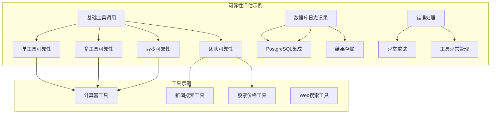
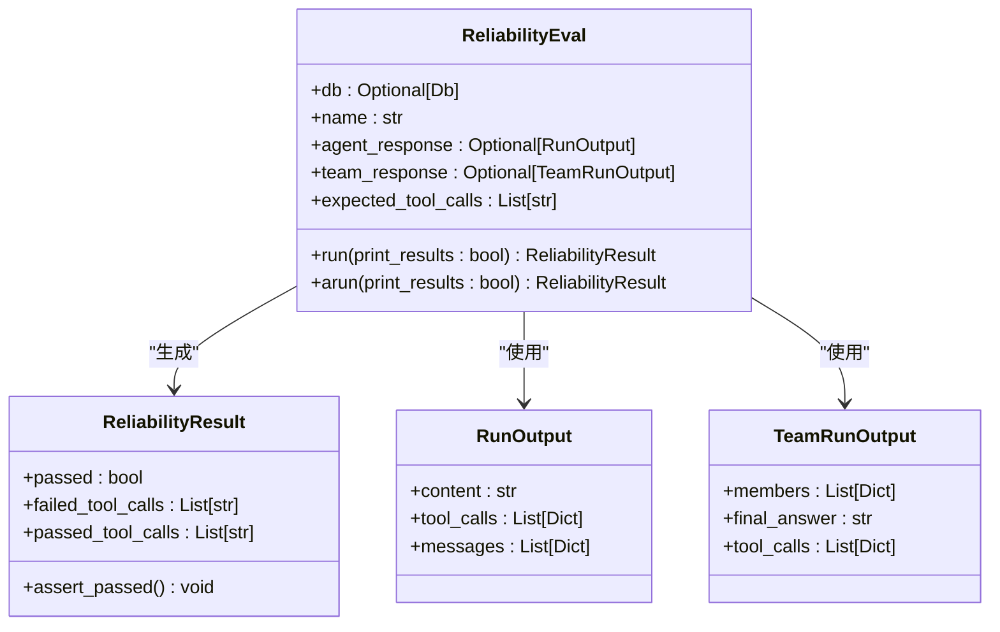
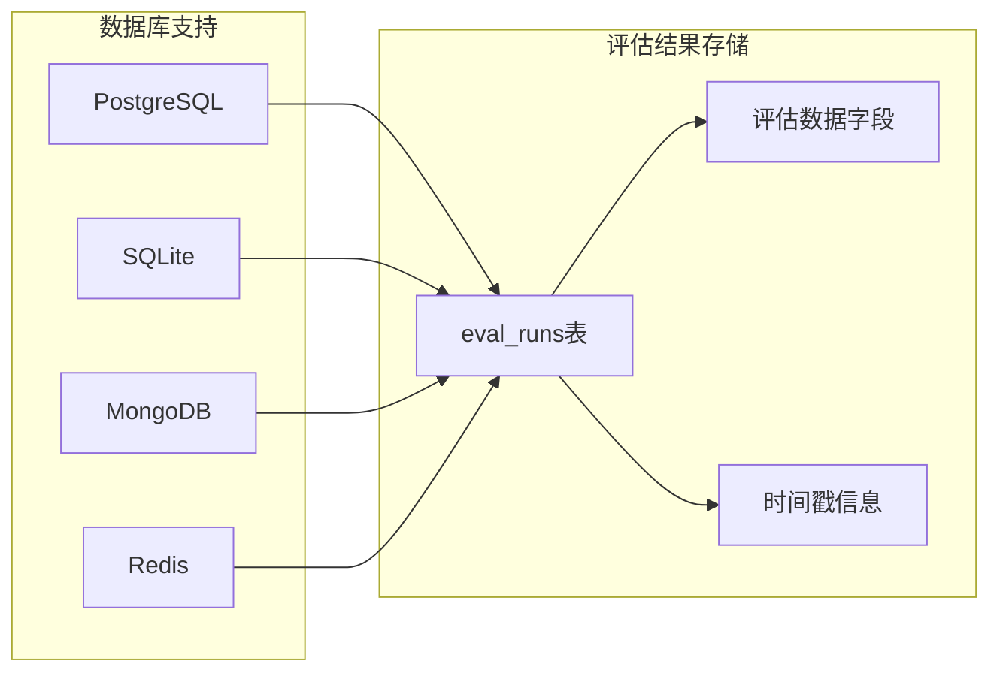
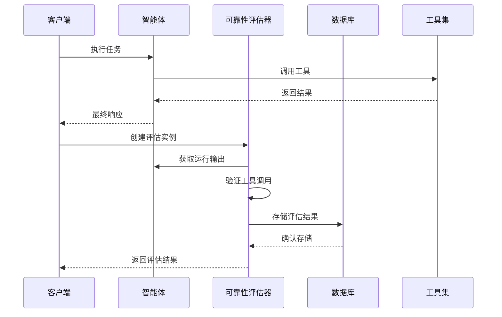
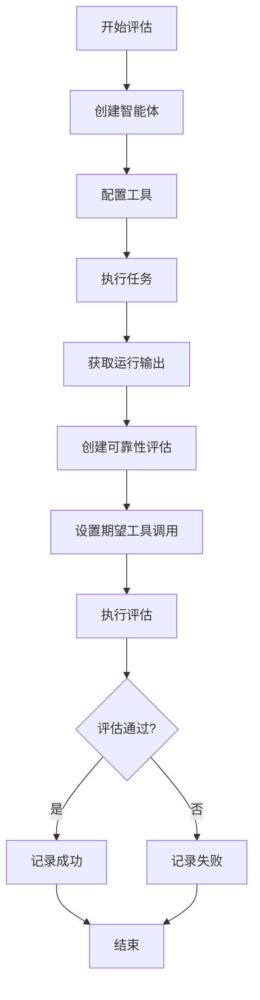
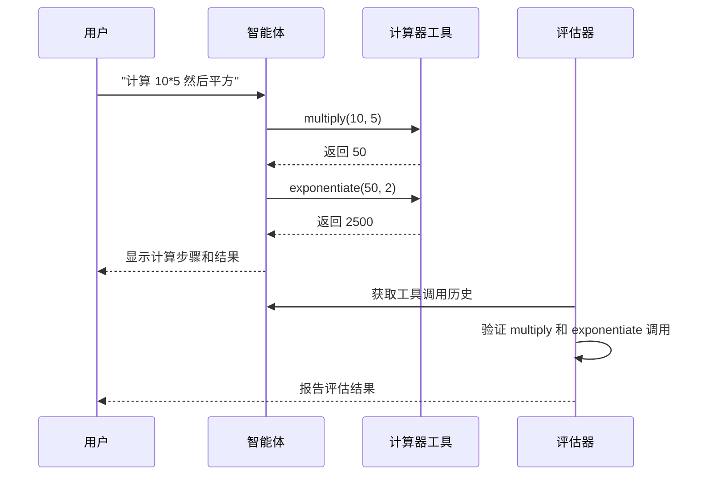
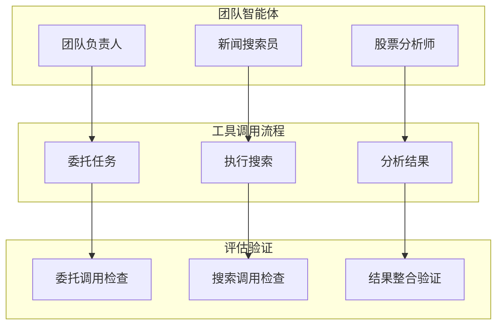
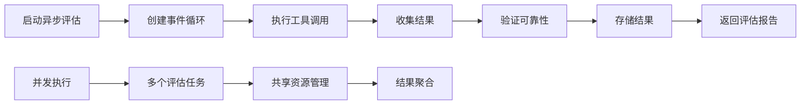
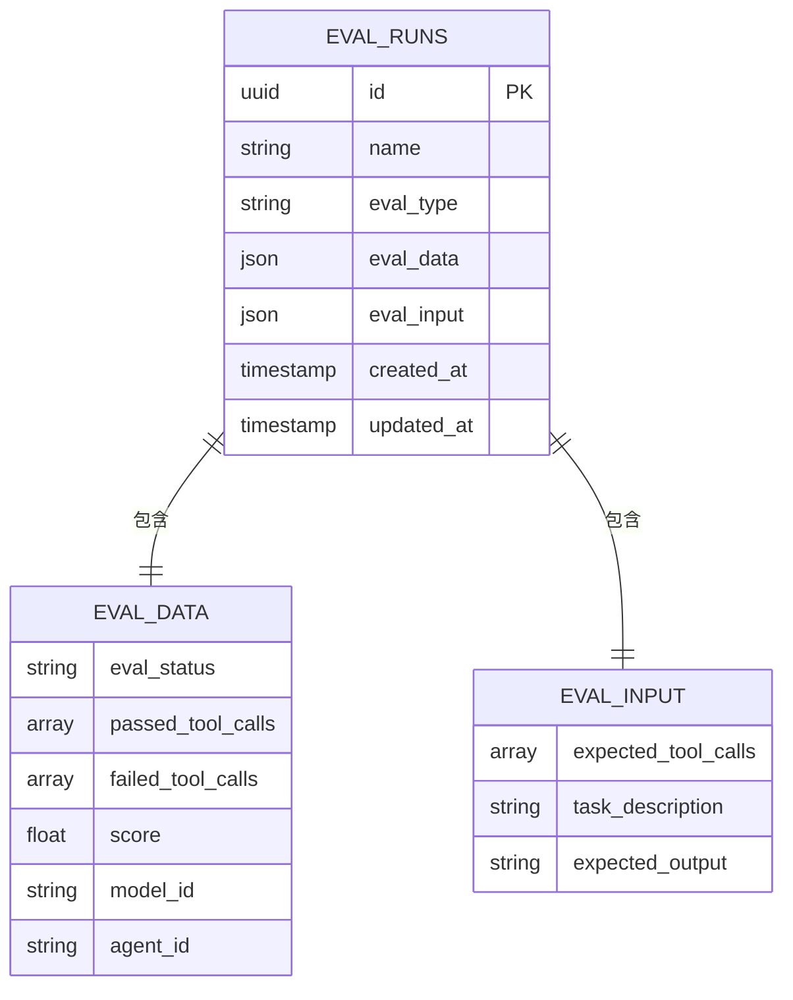
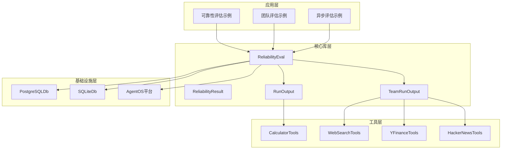

# 可靠性评估示例

<cite>
**本文档引用的文件**
- [可靠性评估概览](file://evals/reliability/overview.mdx)
- [单工具可靠性示例](file://evals/reliability/usage/reliability-single-tool.mdx)
- [多工具可靠性示例](file://evals/reliability/usage/reliability-with-multiple-tools.mdx)
- [团队可靠性高级示例](file://evals/reliability/usage/reliability-team-advanced.mdx)
- [异步可靠性评估示例](file://examples/evals/reliability/reliability-async.mdx)
- [数据库日志记录示例](file://examples/evals/reliability/db-logging.mdx)
- [团队新闻搜索可靠性示例](file://examples/evals/reliability/team/ai-news.mdx)
- [工具异常与重试示例](file://examples/tools/exceptions/retry-tool-call.mdx)
- [工具异常与重试（后置钩子）示例](file://examples/tools/exceptions/retry-tool-call-from-post-hook.mdx)
- [工具异常参考文档](file://tools/exceptions.mdx)
- [性能评估数据库日志记录示例](file://examples/evals/performance/db-logging.mdx)
- [准确性评估数据库日志记录示例](file://examples/evals/accuracy/db-logging.mdx)
- [OpenAPI 评估接口定义](file://reference-api/openapi.yaml)
</cite>

## 目录
1. [简介](#简介)
2. [项目结构](#项目结构)
3. [核心组件](#核心组件)
4. [架构概览](#架构概览)
5. [详细组件分析](#详细组件分析)
6. [依赖关系分析](#依赖关系分析)
7. [性能考虑](#性能考虑)
8. [故障排除指南](#故障排除指南)
9. [结论](#结论)

## 简介

可靠性评估是衡量智能体（Agent）和团队（Team）在工具调用和错误场景中表现能力的重要指标。本项目提供了完整的可靠性评估示例，涵盖了从基础工具调用到复杂团队协作的各种评估场景。

可靠性评估主要关注以下三个方面：
- 是否执行了预期的工具调用
- 是否能够优雅地处理错误
- 是否遵守模型API的速率限制

## 项目结构

该项目采用模块化设计，将不同类型的可靠性评估示例组织在相应的目录中：

**图表来源**
- [可靠性评估概览:1-248](file://evals/reliability/overview.mdx#L1-L248)
- [数据库日志记录示例:1-68](file://examples/evals/reliability/db-logging.mdx#L1-L68)

**章节来源**
- [可靠性评估概览:1-248](file://evals/reliability/overview.mdx#L1-L248)
- [单工具可靠性示例:1-70](file://evals/reliability/usage/reliability-single-tool.mdx#L1-L70)

## 核心组件

### ReliabilityEval 类

ReliabilityEval 是可靠性评估的核心类，负责验证工具调用的正确性和完整性。

**图表来源**
- [可靠性评估概览:20-47](file://evals/reliability/overview.mdx#L20-L47)
- [异步可靠性评估示例:26-43](file://examples/evals/reliability/reliability-async.mdx#L26-L43)

### 数据库集成组件

系统支持多种数据库后端进行评估结果存储：

**图表来源**
- [数据库日志记录示例:25-26](file://examples/evals/reliability/db-logging.mdx#L25-L26)
- [性能评估数据库日志记录示例:35-36](file://examples/evals/performance/db-logging.mdx#L35-L36)

**章节来源**
- [可靠性评估概览:171-236](file://evals/reliability/overview.mdx#L171-L236)
- [数据库日志记录示例:22-53](file://examples/evals/reliability/db-logging.mdx#L22-L53)

## 架构概览

可靠性评估系统采用分层架构设计，确保评估过程的可扩展性和可维护性：

**图表来源**
- [可靠性评估概览:30-47](file://evals/reliability/overview.mdx#L30-L47)
- [异步可靠性评估示例:26-43](file://examples/evals/reliability/reliability-async.mdx#L26-L43)

## 详细组件分析

### 基础工具调用可靠性

基础工具调用可靠性是最简单的评估场景，主要用于验证智能体是否执行了预期的单一工具调用。

**图表来源**
- [单工具可靠性示例:21-37](file://evals/reliability/usage/reliability-single-tool.mdx#L21-L37)
- [可靠性评估概览:30-47](file://evals/reliability/overview.mdx#L30-L47)

**章节来源**
- [可靠性评估概览:16-51](file://evals/reliability/overview.mdx#L16-L51)
- [单工具可靠性示例:1-70](file://evals/reliability/usage/reliability-single-tool.mdx#L1-L70)

### 多工具调用可靠性

多工具调用可靠性评估用于验证智能体能否正确执行一系列相关的工具调用，通常涉及复杂的业务逻辑。

**图表来源**
- [多工具可靠性示例:20-39](file://evals/reliability/usage/reliability-with-multiple-tools.mdx#L20-L39)
- [可靠性评估概览:53-87](file://evals/reliability/overview.mdx#L53-L87)

**章节来源**
- [可靠性评估概览:53-87](file://evals/reliability/overview.mdx#L53-L87)
- [多工具可靠性示例:1-72](file://evals/reliability/usage/reliability-with-multiple-tools.mdx#L1-L72)

### 团队可靠性评估

团队可靠性评估关注多个智能体成员之间的协作和工具调用协调。

**图表来源**
- [团队可靠性高级示例:13-58](file://evals/reliability/usage/reliability-team-advanced.mdx#L13-L58)
- [团队新闻搜索可靠性示例:25-41](file://examples/evals/reliability/team/ai-news.mdx#L25-L41)

**章节来源**
- [可靠性评估概览:89-139](file://evals/reliability/overview.mdx#L89-L139)
- [团队可靠性高级示例:1-90](file://evals/reliability/usage/reliability-team-advanced.mdx#L1-L90)

### 异步可靠性评估

异步评估允许在非阻塞环境中执行可靠性测试，提高系统的响应性和吞吐量。

**图表来源**
- [异步可靠性评估示例:26-49](file://examples/evals/reliability/reliability-async.mdx#L26-L49)
- [异步可靠性评估示例:38-42](file://examples/evals/reliability/reliability-async.mdx#L38-L42)

**章节来源**
- [异步可靠性评估示例:1-64](file://examples/evals/reliability/reliability-async.mdx#L1-L64)

### 数据库日志记录实现

系统支持将评估结果持久化存储到数据库中，便于后续分析和审计。

**图表来源**
- [OpenAPI 评估接口定义:4519-4562](file://reference-api/openapi.yaml#L4519-L4562)
- [数据库日志记录示例:25-26](file://examples/evals/reliability/db-logging.mdx#L25-L26)

**章节来源**
- [数据库日志记录示例:1-68](file://examples/evals/reliability/db-logging.mdx#L1-L68)
- [OpenAPI 评估接口定义:4519-4562](file://reference-api/openapi.yaml#L4519-L4562)

## 依赖关系分析

可靠性评估系统具有清晰的依赖层次结构：

**图表来源**
- [可靠性评估概览:20-47](file://evals/reliability/overview.mdx#L20-L47)
- [团队可靠性高级示例:13-58](file://evals/reliability/usage/reliability-team-advanced.mdx#L13-L58)

**章节来源**
- [可靠性评估概览:1-248](file://evals/reliability/overview.mdx#L1-L248)

## 性能考虑

可靠性评估系统在设计时充分考虑了性能优化：

### 并发执行策略
- 异步评估支持多任务并发执行
- 数据库操作采用连接池管理
- 工具调用结果缓存机制

### 资源管理
- 事件循环的合理使用避免阻塞
- 数据库连接的生命周期管理
- 内存使用的优化策略

### 监控指标
- 评估执行时间统计
- 工具调用成功率监控
- 错误处理效率分析

## 故障排除指南

### 常见问题及解决方案

#### 工具调用失败
**问题描述**: 智能体无法正确执行预期的工具调用

**诊断步骤**:
1. 检查工具配置是否正确
2. 验证API密钥和权限设置
3. 确认网络连接状态

**解决方案**:
- 更新工具参数配置
- 重新配置认证信息
- 检查防火墙设置

#### 数据库连接问题
**问题描述**: 评估结果无法存储到数据库

**诊断步骤**:
1. 验证数据库URL格式
2. 检查数据库服务状态
3. 确认表结构存在

**解决方案**:
- 修正数据库连接字符串
- 启动数据库服务
- 创建必要的数据表

#### 异步执行超时
**问题描述**: 异步评估任务执行超时

**诊断步骤**:
1. 检查事件循环状态
2. 验证异步函数实现
3. 确认资源可用性

**解决方案**:
- 调整超时参数设置
- 优化异步函数实现
- 增加系统资源

**章节来源**
- [工具异常与重试示例:41-82](file://examples/tools/exceptions/retry-tool-call.mdx#L41-L82)
- [工具异常与重试（后置钩子）示例:80-102](file://examples/tools/exceptions/retry-tool-call-from-post-hook.mdx#L80-L102)
- [工具异常参考文档:90-111](file://tools/exceptions.mdx#L90-L111)

## 结论

可靠性评估示例提供了全面的工具调用验证框架，涵盖了从基础到高级的各种评估场景。通过这些示例，开发者可以：

1. **建立可靠的评估体系**: 使用标准化的评估流程确保工具调用的正确性
2. **实现错误处理机制**: 通过异常管理和重试策略提高系统稳定性
3. **集成数据库存储**: 将评估结果持久化便于追踪和分析
4. **支持异步执行**: 提高评估系统的响应性和吞吐量

这些实践不仅适用于当前的示例代码，也为构建生产级的可靠性评估系统奠定了坚实的基础。通过持续的评估和改进，可以显著提升智能体和团队系统的整体可靠性和用户体验。