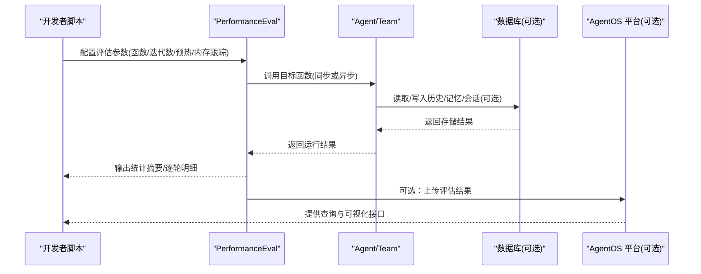
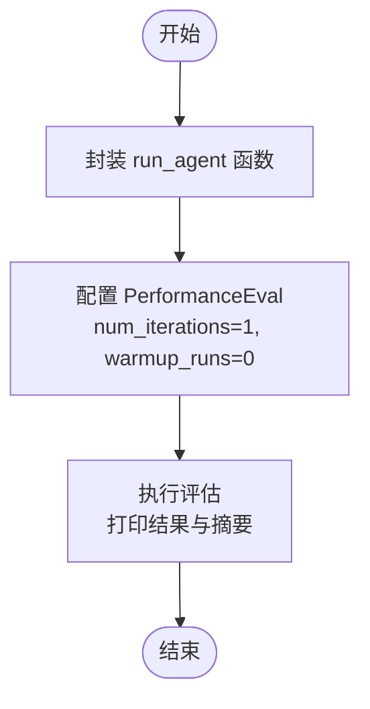
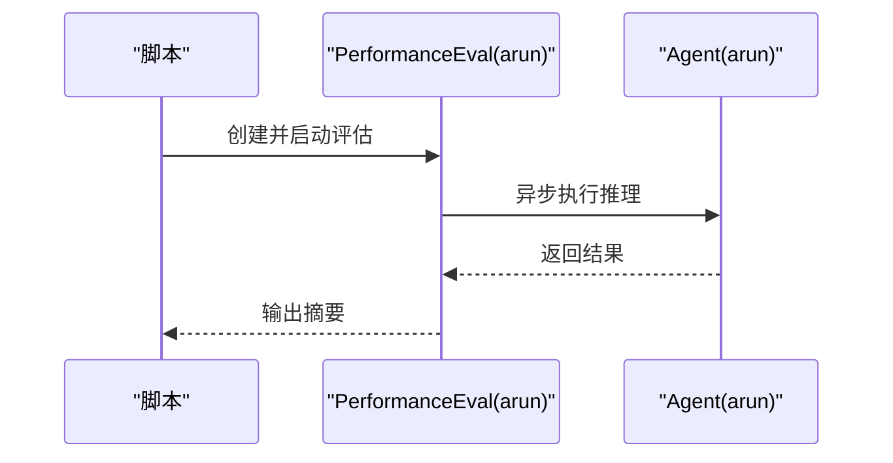
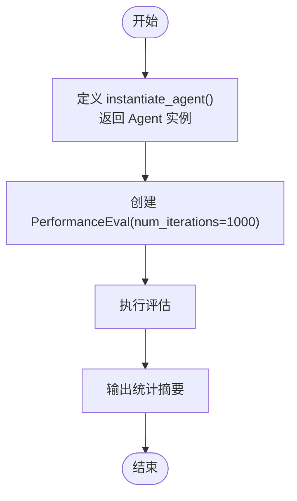
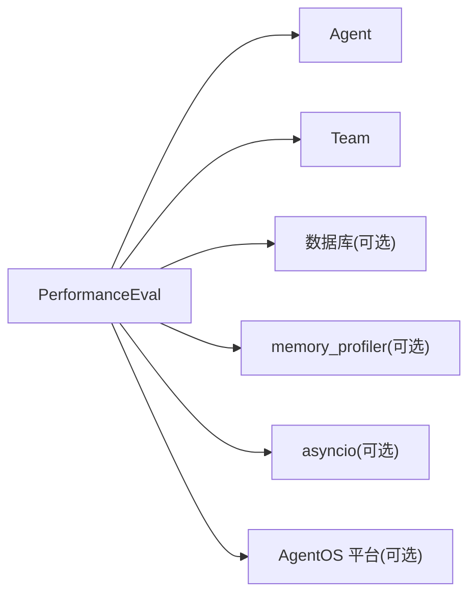

# 性能评估示例

<cite>
**本文引用的文件**
- [性能评估总览](file://evals/performance/overview.mdx)
- [性能评估：简单响应](file://evals/performance/usage/performance-simple-response.mdx)
- [性能评估：异步性能](file://evals/performance/usage/performance-async.mdx)
- [性能评估：代理实例化](file://evals/performance/usage/performance-agent-instantiation.mdx)
- [性能评估：团队实例化](file://evals/performance/usage/performance-team-instantiation.mdx)
- [性能评估：内存更新](file://evals/performance/usage/performance-with-memory.mdx)
- [性能评估：团队与内存](file://evals/performance/usage/performance-team-with-memory.mdx)
- [性能评估：存储性能](file://evals/performance/usage/performance-with-storage.mdx)
- [性能评估：数据库日志记录](file://evals/performance/usage/performance-db-logging.mdx)
- [性能基准与内存测量](file://performance.mdx)
- [性能提示与优化](file://knowledge/concepts/performance-tips.mdx)
- [AgentOS 客户端运行评估示例](file://examples/agent-os/client/run-evals.mdx)
</cite>

## 目录
1. [简介](#简介)
2. [项目结构](#项目结构)
3. [核心组件](#核心组件)
4. [架构概览](#架构概览)
5. [详细组件分析](#详细组件分析)
6. [依赖关系分析](#依赖关系分析)
7. [性能考量](#性能考量)
8. [故障排查指南](#故障排查指南)
9. [结论](#结论)
10. [附录](#附录)

## 简介
本文件面向性能评估示例，系统性介绍如何在代理（Agent）与团队（Team）场景下进行运行时间与内存影响的基准测试，覆盖以下评估维度：
- 简单响应性能：测量一次推理调用的延迟与内存占用
- 异步性能：评估异步执行路径下的吞吐与资源使用
- 实例化性能：评估代理与团队对象创建的开销
- 内存性能：评估启用记忆（Memory）时的增量内存增长
- 存储性能：评估启用历史/会话持久化时的读写开销
- 数据库日志记录：将评估结果持久化到数据库以便追踪与对比

同时，文档解释了性能指标的测量方法、数据库日志记录的实现方式，并提供优化建议与最佳实践，帮助开发者识别与解决性能瓶颈。

## 项目结构
性能评估示例主要分布在“evals/performance”目录下，包含总览与多个子示例页面；另有“performance.mdx”提供整体性能基准与内存测量说明；“knowledge/concepts/performance-tips.mdx”提供知识库层面的性能优化建议；“examples/agent-os/client/run-evals.mdx”展示通过 AgentOS 客户端运行性能评估的流程。

```mermaid
graph TB
A["性能评估总览<br/>evals/performance/overview.mdx"]
B["简单响应性能<br/>evals/performance/usage/performance-simple-response.mdx"]
C["异步性能评估<br/>evals/performance/usage/performance-async.mdx"]
D["代理实例化性能<br/>evals/performance/usage/performance-agent-instantiation.mdx"]
E["团队实例化性能<br/>evals/performance/usage/performance-team-instantiation.mdx"]
F["内存更新性能<br/>evals/performance/usage/performance-with-memory.mdx"]
G["团队与内存性能<br/>evals/performance/usage/performance-team-with-memory.mdx"]
H["存储性能<br/>evals/performance/usage/performance-with-storage.mdx"]
I["数据库日志记录<br/>evals/performance/usage/performance-db-logging.mdx"]
J["性能基准与内存测量<br/>performance.mdx"]
K["性能提示与优化<br/>knowledge/concepts/performance-tips.mdx"]
L["AgentOS 客户端运行评估示例<br/>examples/agent-os/client/run-evals.mdx"]
A --> B
A --> C
A --> D
A --> E
A --> F
A --> G
A --> H
A --> I
A --> J
A --> K
A --> L
```

**图表来源**
- [性能评估总览](file://evals/performance/overview.mdx)
- [性能评估：简单响应](file://evals/performance/usage/performance-simple-response.mdx)
- [性能评估：异步性能](file://evals/performance/usage/performance-async.mdx)
- [性能评估：代理实例化](file://evals/performance/usage/performance-agent-instantiation.mdx)
- [性能评估：团队实例化](file://evals/performance/usage/performance-team-instantiation.mdx)
- [性能评估：内存更新](file://evals/performance/usage/performance-with-memory.mdx)
- [性能评估：团队与内存](file://evals/performance/usage/performance-team-with-memory.mdx)
- [性能评估：存储性能](file://evals/performance/usage/performance-with-storage.mdx)
- [性能评估：数据库日志记录](file://evals/performance/usage/performance-db-logging.mdx)
- [性能基准与内存测量](file://performance.mdx)
- [性能提示与优化](file://knowledge/concepts/performance-tips.mdx)
- [AgentOS 客户端运行评估示例](file://examples/agent-os/client/run-evals.mdx)

**章节来源**
- [性能评估总览](file://evals/performance/overview.mdx)
- [性能基准与内存测量](file://performance.mdx)

## 核心组件
- 性能评估框架：通过 PerformanceEval 封装评估流程，支持同步与异步函数、迭代次数与预热轮次配置、内存增长跟踪、调试模式等。
- 代理与团队：示例中分别对 Agent 和 Team 的实例化与运行进行性能测量。
- 数据库集成：通过传入数据库实例（如 SqliteDb、PostgresDb）实现历史/记忆/会话的持久化，用于评估存储与内存影响。
- AgentOS 平台：提供 API 与客户端示例，可将评估结果上传至平台并进行可视化与追踪。

**章节来源**
- [性能评估总览](file://evals/performance/overview.mdx)
- [AgentOS 客户端运行评估示例](file://examples/agent-os/client/run-evals.mdx)

## 架构概览
下图展示了从“评估入口”到“结果输出”的典型流程，包括同步与异步两种路径，以及数据库日志记录与平台集成。

**图表来源**
- [性能评估总览](file://evals/performance/overview.mdx)
- [AgentOS 客户端运行评估示例](file://examples/agent-os/client/run-evals.mdx)

## 详细组件分析

### 组件A：简单响应性能
- 目标：测量一次推理调用的运行时间与内存占用。
- 关键点：
  - 使用 PerformanceEval 包裹一个简单的 Agent.run 调用
  - 可结合 memory_profiler 进行内存采样
  - 适合快速验证模型与工具链的端到端延迟
- 示例路径：
  - [性能评估：简单响应](file://evals/performance/usage/performance-simple-response.mdx)
  - [性能评估总览](file://evals/performance/overview.mdx)

**图表来源**
- [性能评估：简单响应](file://evals/performance/usage/performance-simple-response.mdx)

**章节来源**
- [性能评估：简单响应](file://evals/performance/usage/performance-simple-response.mdx)
- [性能评估总览](file://evals/performance/overview.mdx)

### 组件B：异步性能评估
- 目标：评估异步执行路径下的吞吐与资源使用。
- 关键点：
  - 使用 async def 包裹 Agent.arun
  - 通过 asyncio.run 执行 PerformanceEval.arun
  - 适合高并发场景下的评估
- 示例路径：
  - [性能评估：异步性能](file://evals/performance/usage/performance-async.mdx)
  - [性能评估总览](file://evals/performance/overview.mdx)

**图表来源**
- [性能评估：异步性能](file://evals/performance/usage/performance-async.mdx)

**章节来源**
- [性能评估：异步性能](file://evals/performance/usage/performance-async.mdx)
- [性能评估总览](file://evals/performance/overview.mdx)

### 组件C：代理实例化性能
- 目标：评估 Agent 对象创建的开销。
- 关键点：
  - 仅创建 Agent 实例，不触发推理
  - 通过大量迭代（如 1000 次）统计平均耗时与内存
- 示例路径：
  - [性能评估：代理实例化](file://evals/performance/usage/performance-agent-instantiation.mdx)
  - [性能评估总览](file://evals/performance/overview.mdx)

**图表来源**
- [性能评估：代理实例化](file://evals/performance/usage/performance-agent-instantiation.mdx)

**章节来源**
- [性能评估：代理实例化](file://evals/performance/usage/performance-agent-instantiation.mdx)
- [性能评估总览](file://evals/performance/overview.mdx)

### 组件D：团队实例化性能
- 目标：评估 Team 对象创建的开销。
- 关键点：
  - 以已存在的 Agent 作为成员创建 Team
  - 同样通过大量迭代统计实例化成本
- 示例路径：
  - [性能评估：团队实例化](file://evals/performance/usage/performance-team-instantiation.mdx)
  - [性能评估总览](file://evals/performance/overview.mdx)

**章节来源**
- [性能评估：团队实例化](file://evals/performance/usage/performance-team-instantiation.mdx)
- [性能评估总览](file://evals/performance/overview.mdx)

### 组件E：内存更新性能
- 目标：评估启用记忆更新时的运行时间与内存增长。
- 关键点：
  - 通过 db 参数启用记忆/历史持久化
  - 在 run 中触发多次上下文交互，观察内存变化
- 示例路径：
  - [性能评估：内存更新](file://evals/performance/usage/performance-with-memory.mdx)
  - [性能评估总览](file://evals/performance/overview.mdx)

**章节来源**
- [性能评估：内存更新](file://evals/performance/usage/performance-with-memory.mdx)
- [性能评估总览](file://evals/performance/overview.mdx)

### 组件F：团队与内存性能
- 目标：评估多用户/多轮次下团队的记忆影响与内存增长。
- 关键点：
  - 支持并发运行多个用户任务
  - 开启 memory_growth_tracking 与 debug_mode
  - 可设置 top_n_memory_allocations 输出热点分配
- 示例路径：
  - [性能评估：团队与内存](file://evals/performance/usage/performance-team-with-memory.mdx)
  - [性能评估总览](file://evals/performance/overview.mdx)

**章节来源**
- [性能评估：团队与内存](file://evals/performance/usage/performance-team-with-memory.mdx)
- [性能评估总览](file://evals/performance/overview.mdx)

### 组件G：存储性能
- 目标：评估启用历史/会话持久化的存储读写开销。
- 关键点：
  - 通过 add_history_to_context 启用上下文历史
  - 多次 run 触发数据库写入/读取
- 示例路径：
  - [性能评估：存储性能](file://evals/performance/usage/performance-with-storage.mdx)
  - [性能评估总览](file://evals/performance/overview.mdx)

**章节来源**
- [性能评估：存储性能](file://evals/performance/usage/performance-with-storage.mdx)
- [性能评估总览](file://evals/performance/overview.mdx)

### 组件H：数据库日志记录
- 目标：将评估结果持久化到数据库，便于后续查询与对比。
- 关键点：
  - 通过传入 db 实例并在 PerformanceEval 中指定
  - 结果表名可自定义
- 示例路径：
  - [性能评估：数据库日志记录](file://evals/performance/usage/performance-db-logging.mdx)
  - [性能评估总览](file://evals/performance/overview.mdx)

**章节来源**
- [性能评估：数据库日志记录](file://evals/performance/usage/performance-db-logging.mdx)
- [性能评估总览](file://evals/performance/overview.mdx)

## 依赖关系分析
- 评估框架依赖：
  - agno.eval.performance：PerformanceEval
  - agno.agent / agno.team：被测对象
  - agno.db.*：SqliteDb/PostgresDb 等存储后端
  - memory_profiler（可选）：内存采样
  - asyncio：异步评估
- 平台集成：
  - AgentOS 客户端：通过 API 运行与查询评估
- 基准参考：
  - performance.mdx 提供整体性能基准与内存测量方法

**图表来源**
- [性能评估总览](file://evals/performance/overview.mdx)
- [AgentOS 客户端运行评估示例](file://examples/agent-os/client/run-evals.mdx)

**章节来源**
- [性能评估总览](file://evals/performance/overview.mdx)
- [AgentOS 客户端运行评估示例](file://examples/agent-os/client/run-evals.mdx)

## 性能考量
- 测量方法
  - 运行时间：通过 PerformanceEval 的内置计时统计每轮耗时与聚合摘要
  - 内存占用：通过 memory_profiler 或 tracemalloc 计算基线与迭代差异
  - 基准参考：performance.mdx 展示了实例化时间与内存占用的对比数据与测量细节
- 影响因素
  - 推理延迟：受模型服务与网络影响，难以精确基准
  - 工具调用：工具数量与复杂度显著影响总耗时
  - 记忆与历史：频繁读写数据库会增加 I/O 成本
  - 并发与异步：合理利用异步可提升吞吐
- 优化建议
  - 选择合适的向量数据库与分块策略（知识库层面）
  - 使用元数据过滤与跳过已处理文件减少重复工作
  - 批量操作与异步加载提升吞吐
  - 控制嵌入维度与检索策略平衡质量与速度
  - 参考性能提示与优化文档进行针对性调整

**章节来源**
- [性能基准与内存测量](file://performance.mdx)
- [性能提示与优化](file://knowledge/concepts/performance-tips.mdx)

## 故障排查指南
- 无法连接数据库
  - 确认连接字符串与权限
  - 检查数据库服务状态与网络连通性
- 评估结果为空
  - 检查评估函数是否正确返回结果
  - 确认 num_iterations 与 warmup_runs 设置
- 内存增长异常
  - 开启 memory_growth_tracking 与 debug_mode 获取详细信息
  - 检查是否存在未释放的缓存或长生命周期对象
- 平台查询无结果
  - 确认 AgentOS 服务已启动并可访问
  - 检查评估类型与筛选条件

**章节来源**
- [AgentOS 客户端运行评估示例](file://examples/agent-os/client/run-evals.mdx)

## 结论
通过本性能评估示例，开发者可以系统地衡量代理与团队在不同场景下的运行时间与内存影响，并借助数据库日志与平台能力进行持续追踪与对比。结合性能提示与优化建议，可在保证准确性的前提下，逐步定位并解决性能瓶颈，实现更高效、稳定的智能体系统。

## 附录
- 快速开始
  - 安装依赖：uv pip install -U agno memory_profiler
  - 导出 API Key：根据示例导出对应环境变量
  - 运行示例：按需选择对应脚本执行
- 相关文档
  - 性能评估总览与示例：evals/performance
  - 性能基准与内存测量：performance.mdx
  - 性能提示与优化：knowledge/concepts/performance-tips.mdx
  - AgentOS 客户端运行评估：examples/agent-os/client/run-evals.mdx