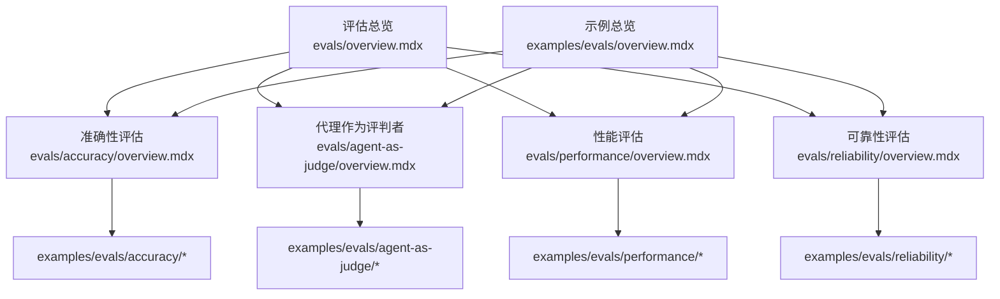
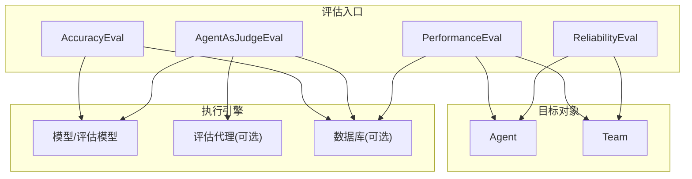
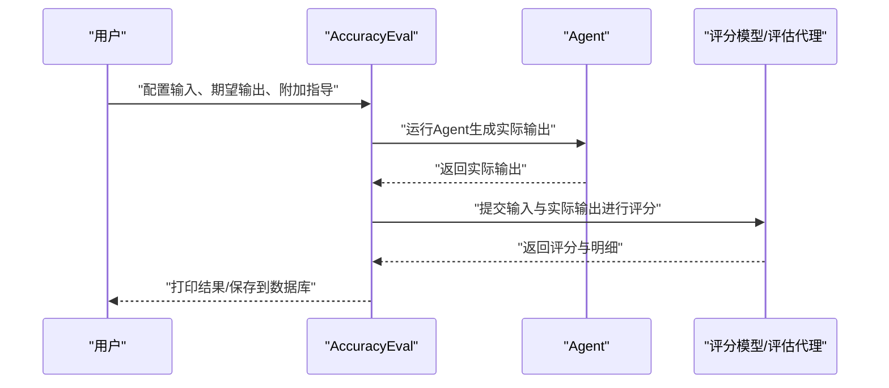
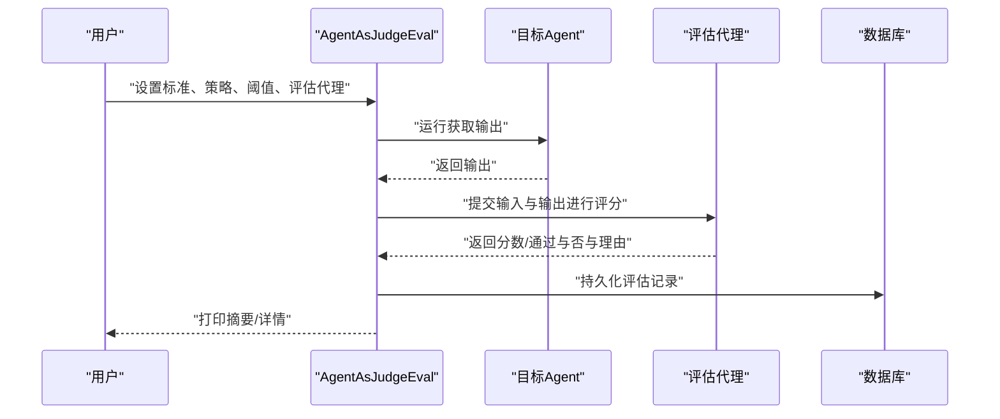
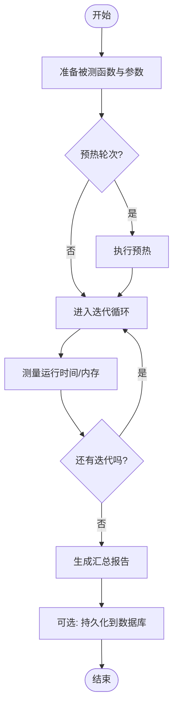
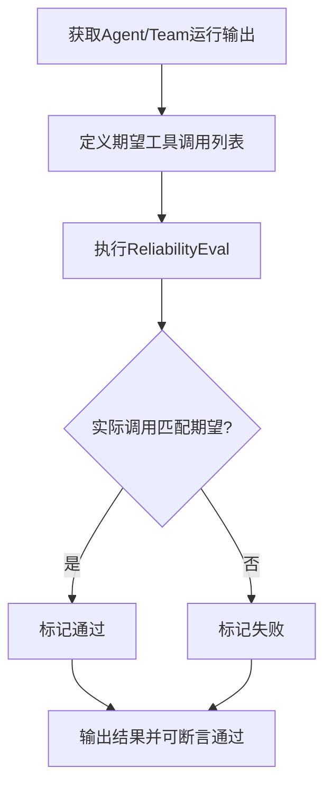
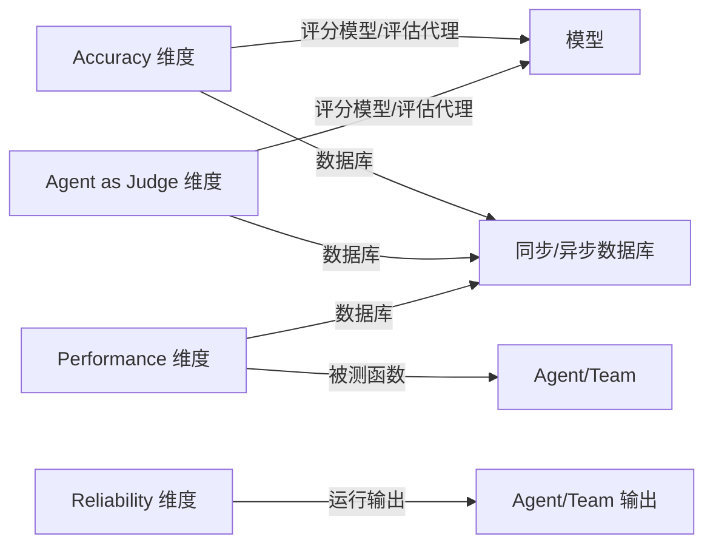

# 评估示例

<cite>
**本文引用的文件**
- [evals/overview.mdx](file://evals/overview.mdx)
- [examples/evals/overview.mdx](file://examples/evals/overview.mdx)
- [evals/accuracy/overview.mdx](file://evals/accuracy/overview.mdx)
- [evals/agent-as-judge/overview.mdx](file://evals/agent-as-judge/overview.mdx)
- [evals/performance/overview.mdx](file://evals/performance/overview.mdx)
- [evals/reliability/overview.mdx](file://evals/reliability/overview.mdx)
- [examples/evals/accuracy/accuracy-basic.mdx](file://examples/evals/accuracy/accuracy-basic.mdx)
- [examples/evals/agent-as-judge/agent-as-judge-basic.mdx](file://examples/evals/agent-as-judge/agent-as-judge-basic.mdx)
- [examples/evals/performance/simple-response.mdx](file://examples/evals/performance/simple-response.mdx)
- [examples/evals/reliability/single-tool-calls/calculator.mdx](file://examples/evals/reliability/single-tool-calls/calculator.mdx)
- [examples/evals/agent-as-judge/agent-as-judge-batch.mdx](file://examples/evals/agent-as-judge/agent-as-judge-batch.mdx)
- [examples/evals/performance/team-response-with-memory-simple.mdx](file://examples/evals/performance/team-response-with-memory-simple.mdx)
</cite>

## 目录
1. [简介](#简介)
2. [项目结构](#项目结构)
3. [核心组件](#核心组件)
4. [架构总览](#架构总览)
5. [详细组件分析](#详细组件分析)
6. [依赖关系分析](#依赖关系分析)
7. [性能考量](#性能考量)
8. [故障排查指南](#故障排查指南)
9. [结论](#结论)
10. [附录](#附录)

## 简介
本章节面向“评估示例”主题，系统性梳理评估系统的使用场景与实现要点，覆盖以下四个维度：
- 准确性评估：基于 LLM-as-a-Judge 的评分，验证输出与期望答案的一致性。
- 代理作为评判者（Agent as Judge）：自定义质量标准，使用模型或自定义代理进行打分与二元判断。
- 性能评估：测量延迟与内存占用，支持同步与异步函数、工具调用、内存更新与存储影响等场景。
- 可靠性评估：验证代理或团队是否执行了预期的工具调用，以及错误处理与限流行为。

同时，文档说明批量评估、异步评估与团队评估的运行模式，并给出评估数据准备、答案比较、二元判断与自定义评估器的实现思路；最后提供评估结果分析与优化策略，帮助构建可追踪、可复现、可持续改进的评估体系。

## 项目结构
评估示例相关的内容分布在两个区域：
- evals/*：官方维度概览与使用说明，包含各评估维度的背景、参数、方法与示例入口。
- examples/evals/*：可直接运行的示例代码，覆盖同步/异步、批量、工具、内存、存储、团队等典型场景。

下图展示评估示例在仓库中的组织关系与导航路径：

图表来源
- [evals/overview.mdx](file://evals/overview.mdx)
- [examples/evals/overview.mdx](file://examples/evals/overview.mdx)

章节来源
- [evals/overview.mdx](file://evals/overview.mdx)
- [examples/evals/overview.mdx](file://examples/evals/overview.mdx)

## 核心组件
- 评估维度与职责
  - 准确性评估：以期望输出为基准，通过评分模型或代理对响应进行一致性打分，适合数值计算、步骤推理等场景。
  - 代理作为评判者：允许用户自定义质量标准（如“专业语气”、“事实准确”、“用户友好”），支持数值与二元评分策略。
  - 性能评估：聚焦运行时延迟与内存增长，支持同步/异步函数、工具初始化、内存更新、存储交互等多维对比。
  - 可靠性评估：验证工具调用链路是否符合预期，覆盖单工具与多工具、团队任务委派与成员协作等。

- 运行模式
  - 同步/异步：所有评估均支持同步 run() 与异步 arun()，便于集成到现有工作流。
  - 批量评估：Agent as Judge 支持一次性输入多个案例，统一评分并统计通过率。
  - 团队评估：在团队场景下，验证任务委派、成员响应与工具调用的正确性。

- 数据准备与处理
  - 答案比较：Accuracy 维度提供与期望输出的比较策略，支持带工具的数值比较与复杂推理。
  - 二元判断：Agent as Judge 提供 binary 策略，快速判定是否达标。
  - 自定义评估器：可注入自定义代理作为评估者，或通过附加指导原则细化评分逻辑。

章节来源
- [evals/accuracy/overview.mdx](file://evals/accuracy/overview.mdx)
- [evals/agent-as-judge/overview.mdx](file://evals/agent-as-judge/overview.mdx)
- [evals/performance/overview.mdx](file://evals/performance/overview.mdx)
- [evals/reliability/overview.mdx](file://evals/reliability/overview.mdx)

## 架构总览
下图展示评估系统在不同维度下的通用流程：创建评估对象 → 配置模型/代理/数据库 → 执行评估 → 输出结果与持久化。

图表来源
- [evals/accuracy/overview.mdx](file://evals/accuracy/overview.mdx)
- [evals/agent-as-judge/overview.mdx](file://evals/agent-as-judge/overview.mdx)
- [evals/performance/overview.mdx](file://evals/performance/overview.mdx)
- [evals/reliability/overview.mdx](file://evals/reliability/overview.mdx)

## 详细组件分析

### 准确性评估（Accuracy）
- 使用场景
  - 数值计算与步骤推理：要求输出包含中间步骤与最终答案。
  - 工具辅助推理：通过工具完成复杂计算后再由评分模型校验。
  - 多语言路由团队：验证团队按语言规则正确路由与回复。
  - 数字大小比较：针对浮点数比较的挑战性场景设计指导原则。

- 关键参数与能力
  - 输入与期望输出：用于评分模型或评估代理进行比较。
  - 附加指导原则：细化评分维度（如步骤完整性、格式要求）。
  - 评估代理：可替换默认评分模型，使用自定义代理输出结构化评分。
  - 迭代次数：多次运行取平均分，提升稳定性。

- 示例要点
  - 基础与异步：同步与异步两种执行方式均可获得稳定分数。
  - 工具参与：在工具辅助下完成阶乘等复杂运算。
  - 给定输出：无需真实运行，直接对给定输出进行评分。
  - 团队评估：验证多语言团队的路由与回复质量。

图表来源
- [evals/accuracy/overview.mdx](file://evals/accuracy/overview.mdx)
- [examples/evals/accuracy/accuracy-basic.mdx](file://examples/evals/accuracy/accuracy-basic.mdx)

章节来源
- [evals/accuracy/overview.mdx](file://evals/accuracy/overview.mdx)
- [examples/evals/accuracy/accuracy-basic.mdx](file://examples/evals/accuracy/accuracy-basic.mdx)

### 代理作为评判者（Agent as Judge）
- 使用场景
  - 质量标准定制：如“清晰易懂”、“技术准确”、“用户友好”等。
  - 数值与二元评分：支持 1–10 分量化评分与通过/不通过二元判断。
  - 失败回调：当分数低于阈值时触发回调，便于记录与告警。
  - 批量评估：一次评估多个案例，输出整体通过率与明细。

- 关键参数与能力
  - criteria：评估标准文本，描述“什么是好输出”。
  - scoring_strategy：数值或二元策略。
  - threshold：数值策略下的及格线。
  - evaluator_agent：自定义评估代理，可注入更严格的指令。
  - on_fail：失败回调，便于记录原因与采取措施。
  - cases：批量评估输入输出对列表。

- 示例要点
  - 基础与异步：同步与异步均可运行，异步适合长耗时评估。
  - 批量评估：传入多个案例，自动统计通过率与计数。
  - 数据库持久化：结果可写入同步/异步数据库，便于查询与可视化。

图表来源
- [evals/agent-as-judge/overview.mdx](file://evals/agent-as-judge/overview.mdx)
- [examples/evals/agent-as-judge/agent-as-judge-basic.mdx](file://examples/evals/agent-as-judge/agent-as-judge-basic.mdx)
- [examples/evals/agent-as-judge/agent-as-judge-batch.mdx](file://examples/evals/agent-as-judge/agent-as-judge-batch.mdx)

章节来源
- [evals/agent-as-judge/overview.mdx](file://evals/agent-as-judge/overview.mdx)
- [examples/evals/agent-as-judge/agent-as-judge-basic.mdx](file://examples/evals/agent-as-judge/agent-as-judge-basic.mdx)
- [examples/evals/agent-as-judge/agent-as-judge-batch.mdx](file://examples/evals/agent-as-judge/agent-as-judge-batch.mdx)

### 性能评估（Performance）
- 使用场景
  - 基线响应时间：单轮提示的最小成本评估。
  - 工具调用开销：对比启用工具前后的性能差异。
  - 内存增长：开启内存增长跟踪，观察运行期内存变化。
  - 存储与历史：开启历史上下文与存储交互对性能的影响。
  - 团队性能：评估团队初始化与成员交互的性能表现。

- 关键参数与能力
  - func：被测函数（可同步或异步）。
  - num_iterations：重复次数，用于统计分布与稳定性。
  - warmup_runs：预热轮次，减少首次调用偏差。
  - measure_runtime：是否测量运行时间。
  - memory_growth_tracking：是否跟踪内存增长。
  - 异步支持：对异步函数使用 arun() 执行。

- 示例要点
  - 基础响应：最简评估，验证单轮响应性能。
  - 工具调用：对比工具初始化与调用的成本。
  - 内存更新：开启记忆更新后对性能的影响。
  - 存储交互：历史上下文与存储带来的额外开销。
  - 团队内存：团队成员共享状态与历史上下文的内存影响。

图表来源
- [evals/performance/overview.mdx](file://evals/performance/overview.mdx)
- [examples/evals/performance/simple-response.mdx](file://examples/evals/performance/simple-response.mdx)
- [examples/evals/performance/team-response-with-memory-simple.mdx](file://examples/evals/performance/team-response-with-memory-simple.mdx)

章节来源
- [evals/performance/overview.mdx](file://evals/performance/overview.mdx)
- [examples/evals/performance/simple-response.mdx](file://examples/evals/performance/simple-response.mdx)
- [examples/evals/performance/team-response-with-memory-simple.mdx](file://examples/evals/performance/team-response-with-memory-simple.mdx)

### 可靠性评估（Reliability）
- 使用场景
  - 单工具调用：验证代理是否调用了预期工具（如阶乘）。
  - 多工具调用：验证顺序与组合调用（乘法、指数等）。
  - 团队协作：验证任务委派与成员工具调用的正确性。

- 关键参数与能力
  - agent_response/team_response：来自 Agent/Team 的运行输出。
  - expected_tool_calls：期望的工具名称列表。
  - 断言通过：结果对象提供断言方法，便于在测试中直接验证。

- 示例要点
  - 单工具：对阶乘工具的调用进行验证。
  - 多工具：对复合计算的工具序列进行验证。
  - 团队：验证团队委派与成员工具调用的协同。

图表来源
- [evals/reliability/overview.mdx](file://evals/reliability/overview.mdx)
- [examples/evals/reliability/single-tool-calls/calculator.mdx](file://examples/evals/reliability/single-tool-calls/calculator.mdx)

章节来源
- [evals/reliability/overview.mdx](file://evals/reliability/overview.mdx)
- [examples/evals/reliability/single-tool-calls/calculator.mdx](file://examples/evals/reliability/single-tool-calls/calculator.mdx)

## 依赖关系分析
- 评估维度之间的耦合
  - 准确性与代理作为评判者：两者均依赖评分模型或评估代理，可互换使用。
  - 性能与可靠性：二者独立于评分模型，分别关注运行时资源与工具调用链路。
  - 团队场景：可靠性与性能均可扩展至团队，验证成员协作与任务委派。

- 与外部组件的关系
  - 数据库：支持同步/异步数据库，用于持久化评估结果，便于后续查询与可视化。
  - 模型：默认使用高性能模型进行评分或评估，也可自定义模型或评估代理。
  - 工具与存储：性能与可靠性评估常与工具调用、内存更新、历史上下文、存储交互耦合。

图表来源
- [evals/accuracy/overview.mdx](file://evals/accuracy/overview.mdx)
- [evals/agent-as-judge/overview.mdx](file://evals/agent-as-judge/overview.mdx)
- [evals/performance/overview.mdx](file://evals/performance/overview.mdx)
- [evals/reliability/overview.mdx](file://evals/reliability/overview.mdx)

章节来源
- [evals/accuracy/overview.mdx](file://evals/accuracy/overview.mdx)
- [evals/agent-as-judge/overview.mdx](file://evals/agent-as-judge/overview.mdx)
- [evals/performance/overview.mdx](file://evals/performance/overview.mdx)
- [evals/reliability/overview.mdx](file://evals/reliability/overview.mdx)

## 性能考量
- 评估稳定性
  - 多次迭代取平均：准确性与代理作为评判者支持多次运行取平均，降低随机性波动。
  - 预热轮次：性能评估建议设置预热轮次，避免冷启动对结果的影响。
- 资源控制
  - 内存增长跟踪：在涉及内存更新与存储的历史场景中，开启内存增长跟踪以识别潜在泄漏或膨胀。
  - 异步执行：对长耗时评估采用异步模式，避免阻塞主线程。
- 结果持久化
  - 数据库：将评估结果持久化到同步/异步数据库，便于趋势分析与回归检测。
- 场景覆盖
  - 工具调用：对比启用工具前后性能差异，识别工具初始化与调用的开销。
  - 团队协作：评估团队成员间的通信与任务委派对性能的影响。

## 故障排查指南
- 评分不稳定
  - 现象：同一输入多次评估分数波动较大。
  - 排查：增加迭代次数，确保预热轮次充足；检查评分模型的随机性参数。
- 评估代理未按预期打分
  - 现象：二元策略频繁误判或数值策略分数异常。
  - 排查：调整评估标准文本与附加指导原则；必要时注入更严格的评估代理。
- 性能评估异常
  - 现象：运行时间过长或内存持续增长。
  - 排查：确认是否开启内存增长跟踪；检查是否启用了不必要的历史上下文或存储交互；对比工具调用前后差异。
- 可靠性评估失败
  - 现象：工具调用未发生或顺序错误。
  - 排查：核对期望工具名称列表；检查代理/团队的工具注册与权限；查看运行输出中的工具调用日志。

章节来源
- [evals/accuracy/overview.mdx](file://evals/accuracy/overview.mdx)
- [evals/agent-as-judge/overview.mdx](file://evals/agent-as-judge/overview.mdx)
- [evals/performance/overview.mdx](file://evals/performance/overview.mdx)
- [evals/reliability/overview.mdx](file://evals/reliability/overview.mdx)

## 结论
通过准确性、代理作为评判者、性能与可靠性四个维度的系统化评估，可以全面衡量代理与团队的质量与鲁棒性。结合批量评估、异步执行与数据库持久化，能够形成可追踪、可复现且可持续优化的评估体系。建议从基础准确性入手，逐步引入代理作为评判者的定制化标准、性能基线与可靠性验证，最终实现跨维度的综合评估与持续改进。

## 附录
- 快速开始
  - 安装依赖：根据示例脚本安装所需包（如 memory_profiler、数据库驱动等）。
  - 运行示例：参考示例文件中的命令片段，创建虚拟环境并运行对应脚本。
- 最佳实践
  - 先简单后复杂：从单一测试用例起步，逐步扩展到批量与异步。
  - 多维度并行：同时关注准确性、质量标准、性能与可靠性，避免单一指标偏科。
  - 持续追踪：将评估结果写入数据库，定期回顾趋势，定位回归问题。