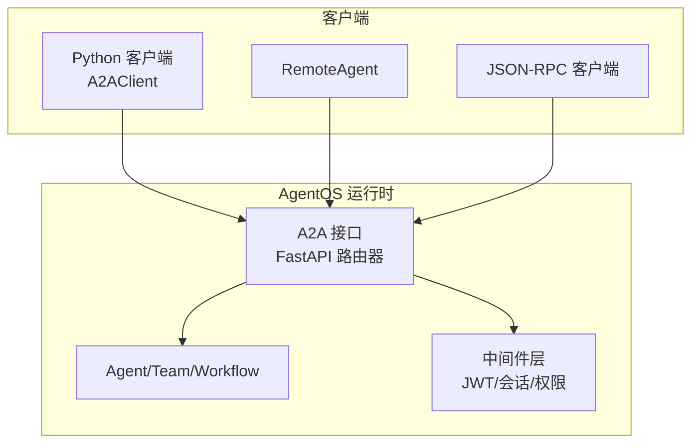
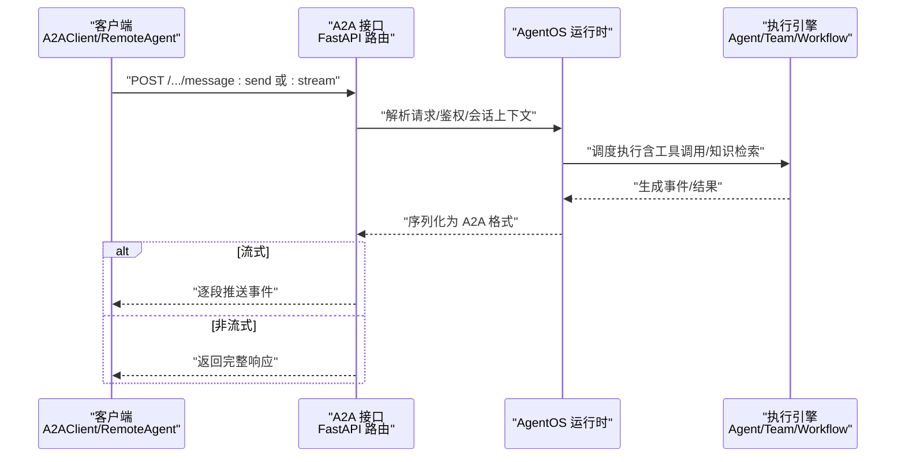
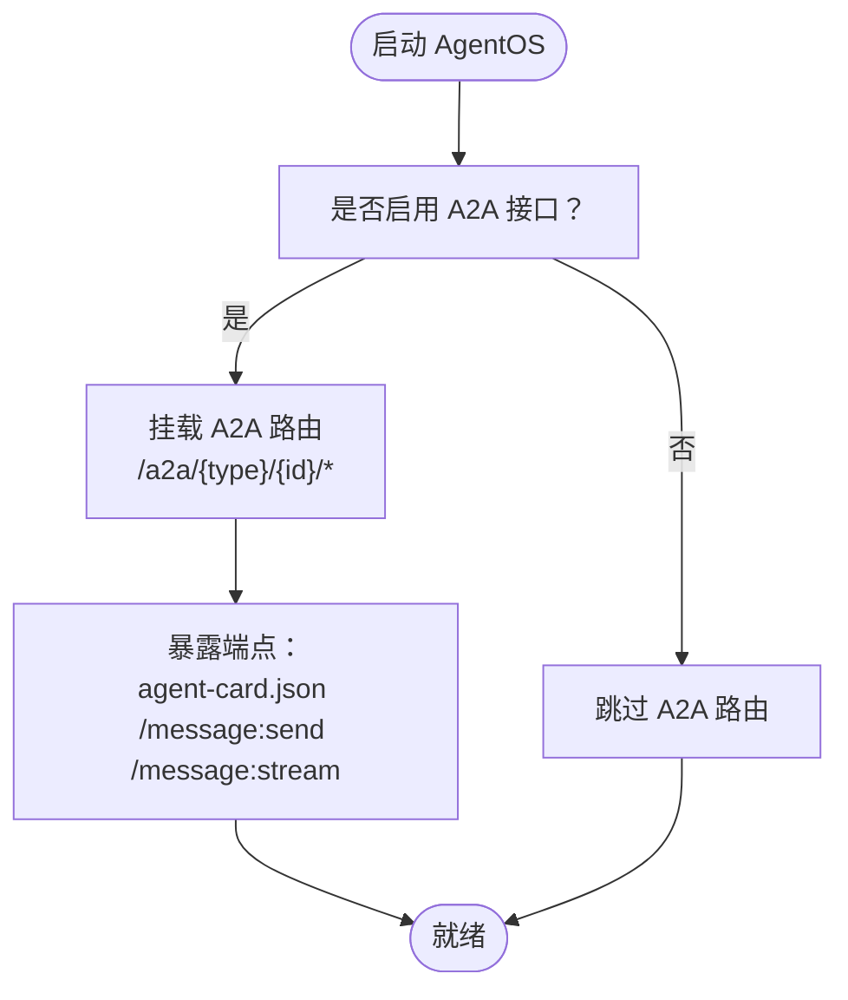
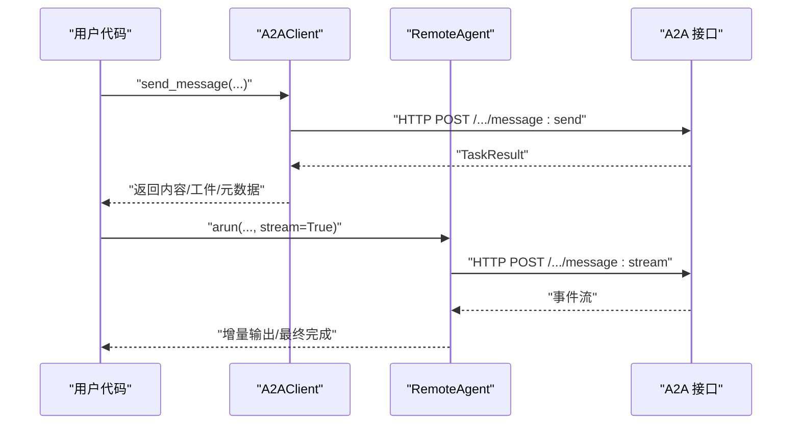
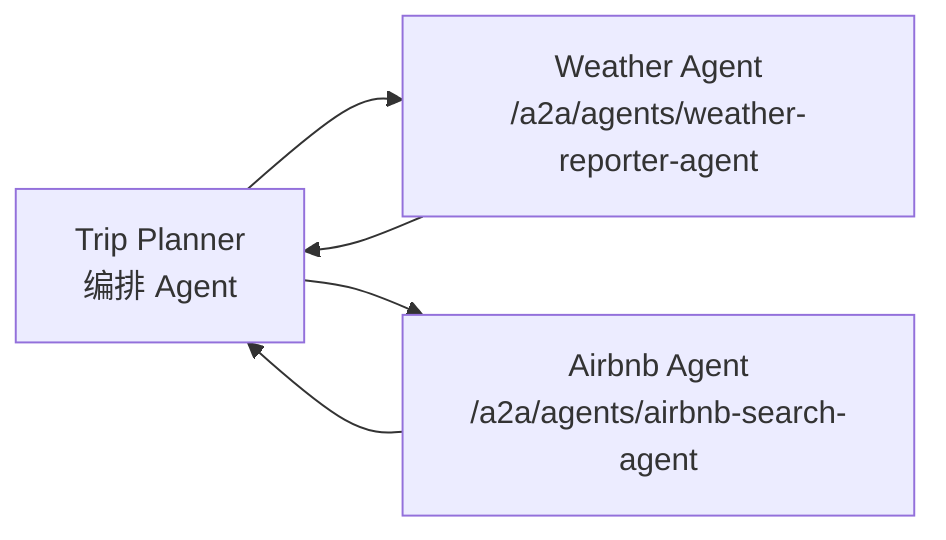
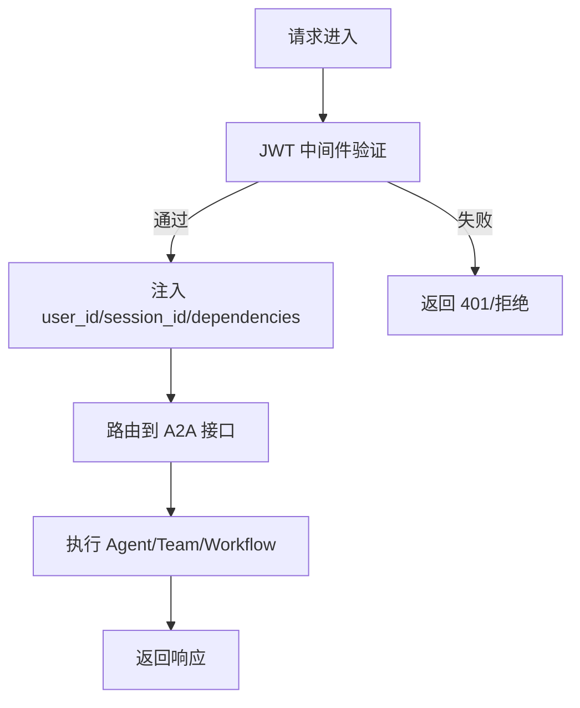
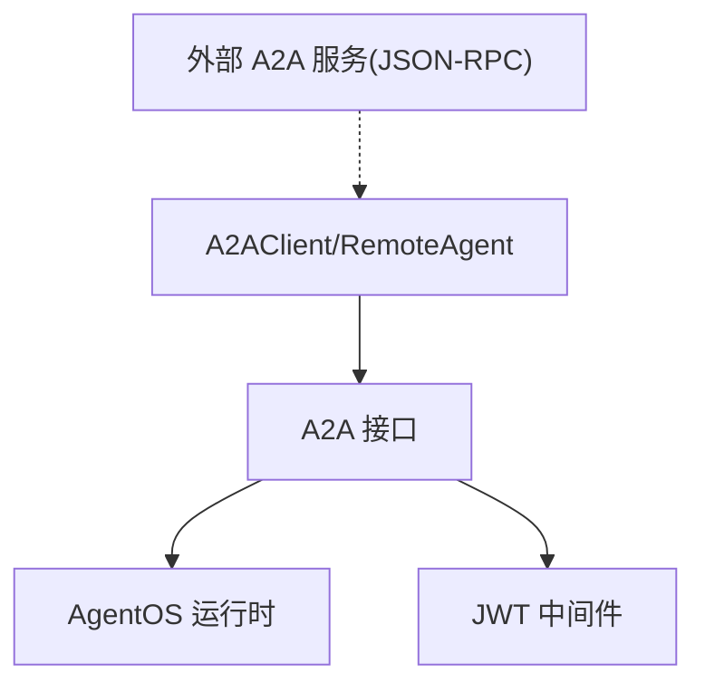

# A2A 通信协议集成

<cite>
**本文档引用的文件**
- [agent-os/interfaces/a2a/introduction.mdx](file://agent-os/interfaces/a2a/introduction.mdx)
- [agent-os/client/a2a-client.mdx](file://agent-os/client/a2a-client.mdx)
- [reference/clients/a2a-client.mdx](file://reference/clients/a2a-client.mdx)
- [examples/agent-os/interfaces/a2a/basic.mdx](file://examples/agent-os/interfaces/a2a/basic.mdx)
- [examples/agent-os/remote/agno-a2a-server.mdx](file://examples/agent-os/remote/agno-a2a-server.mdx)
- [examples/agent-os/remote/remote-agno-a2a-agent.mdx](file://examples/agent-os/remote/remote-agno-a2a-agent.mdx)
- [examples/agent-os/interfaces/a2a/multi-agent-a2a/trip-planning-a2a-client.mdx](file://examples/agent-os/interfaces/a2a/multi-agent-a2a/trip-planning-a2a-client.mdx)
- [examples/agent-os/interfaces/a2a/multi-agent-a2a/weather-agent.mdx](file://examples/agent-os/interfaces/a2a/multi-agent-a2a/weather-agent.mdx)
- [examples/agent-os/interfaces/a2a/multi-agent-a2a/airbnb-agent.mdx](file://examples/agent-os/interfaces/a2a/multi-agent-a2a/airbnb-agent.mdx)
- [agent-os/interfaces/overview.mdx](file://agent-os/interfaces/overview.mdx)
- [agent-os/middleware/overview.mdx](file://agent-os/middleware/overview.mdx)
- [agent-os/middleware/jwt.mdx](file://agent-os/middleware/jwt.mdx)
</cite>

## 目录
1. [简介](#简介)
2. [项目结构](#项目结构)
3. [核心组件](#核心组件)
4. [架构总览](#架构总览)
5. [详细组件分析](#详细组件分析)
6. [依赖关系分析](#依赖关系分析)
7. [性能考量](#性能考量)
8. [故障排查指南](#故障排查指南)
9. [结论](#结论)
10. [附录](#附录)

## 简介
本文件面向需要在系统中集成 A2A（Agent-to-Agent）通信协议的开发者，系统性阐述 Agno AgentOS 的 A2A 接口工作原理与实现方式，覆盖服务器端配置、客户端连接、消息传递与事件处理、多智能体编排、认证与安全、性能优化等关键主题。通过仓库中的官方文档与示例，我们将给出可直接落地的实施步骤与参考路径。

## 项目结构
围绕 A2A 集成的关键位置如下：
- 接口文档与使用说明：agent-os/interfaces/a2a/introduction.mdx
- 客户端 SDK 使用指南：agent-os/client/a2a-client.mdx、reference/clients/a2a-client.mdx
- 示例：基础 Agent、远程 A2A 服务、多 Agent 编排（Trip Planner、Weather、Airbnb）
- 接口机制说明：agent-os/interfaces/overview.mdx
- 认证与中间件：agent-os/middleware/overview.mdx、agent-os/middleware/jwt.mdx

图表来源
- [agent-os/interfaces/a2a/introduction.mdx:63-107](file://agent-os/interfaces/a2a/introduction.mdx#L63-L107)
- [agent-os/interfaces/overview.mdx:43-67](file://agent-os/interfaces/overview.mdx#L43-L67)

章节来源
- [agent-os/interfaces/a2a/introduction.mdx:17-107](file://agent-os/interfaces/a2a/introduction.mdx#L17-L107)
- [agent-os/interfaces/overview.mdx:43-67](file://agent-os/interfaces/overview.mdx#L43-L67)

## 核心组件
- A2A 接口（AgentOS 层）
  - 将 Agent、Team、Workflow 暴露为 A2A 兼容端点，支持发现卡片、消息发送与流式响应。
  - 可全局启用或按需指定暴露对象。
- 客户端 SDK
  - A2AClient：异步发送消息、流式事件消费、获取 Agent Card。
  - RemoteAgent：更高层封装，支持 REST/JSON-RPC 模式与流式事件。
- 中间件与安全
  - 基于 JWT 的认证与参数注入，支持会话隔离与 RBAC。

章节来源
- [agent-os/interfaces/a2a/introduction.mdx:19-60](file://agent-os/interfaces/a2a/introduction.mdx#L19-L60)
- [agent-os/client/a2a-client.mdx:13-61](file://agent-os/client/a2a-client.mdx#L13-L61)
- [reference/clients/a2a-client.mdx:30-147](file://reference/clients/a2a-client.mdx#L30-L147)
- [agent-os/middleware/overview.mdx:43-67](file://agent-os/middleware/overview.mdx#L43-L67)
- [agent-os/middleware/jwt.mdx:20-176](file://agent-os/middleware/jwt.mdx#L20-L176)

## 架构总览
下图展示了从客户端到 AgentOS 内部运行时的消息流转与事件分发：

图表来源
- [agent-os/interfaces/a2a/introduction.mdx:63-107](file://agent-os/interfaces/a2a/introduction.mdx#L63-L107)
- [agent-os/interfaces/overview.mdx:43-67](file://agent-os/interfaces/overview.mdx#L43-L67)

## 详细组件分析

### A2A 服务器端配置与端点
- 启用方式
  - 在 AgentOS 实例中设置 a2a_interface=True，或显式初始化 A2A 接口并传入目标对象列表。
- 暴露端点
  - 发现卡片：/.well-known/agent-card.json
  - 消息发送：/v1/message:send
  - 流式消息：/v1/message:stream
  - 支持 Agent/Team/Workflow 三类资源。

图表来源
- [agent-os/interfaces/a2a/introduction.mdx:19-60](file://agent-os/interfaces/a2a/introduction.mdx#L19-L60)
- [agent-os/interfaces/a2a/introduction.mdx:63-107](file://agent-os/interfaces/a2a/introduction.mdx#L63-L107)

章节来源
- [agent-os/interfaces/a2a/introduction.mdx:19-107](file://agent-os/interfaces/a2a/introduction.mdx#L19-L107)

### 客户端连接与消息传递
- A2AClient
  - 支持 REST 与 JSON-RPC 两种模式；REST 用于 Agno A2A 服务器，JSON-RPC 用于兼容服务（如 Google ADK）。
  - 提供 send_message 与 stream_message，支持多轮对话上下文。
- RemoteAgent
  - 以更高层抽象封装 A2A 协议访问，支持流式事件与元数据获取。

图表来源
- [reference/clients/a2a-client.mdx:60-147](file://reference/clients/a2a-client.mdx#L60-L147)
- [agent-os/client/a2a-client.mdx:13-61](file://agent-os/client/a2a-client.mdx#L13-L61)
- [examples/agent-os/remote/remote-agno-a2a-agent.mdx:30-114](file://examples/agent-os/remote/remote-agno-a2a-agent.mdx#L30-L114)

章节来源
- [reference/clients/a2a-client.mdx:30-147](file://reference/clients/a2a-client.mdx#L30-L147)
- [agent-os/client/a2a-client.mdx:13-61](file://agent-os/client/a2a-client.mdx#L13-L61)
- [examples/agent-os/remote/remote-agno-a2a-agent.mdx:30-114](file://examples/agent-os/remote/remote-agno-a2a-agent.mdx#L30-L114)

### 多 Agent 编排与消息路由
- Trip Planner 作为编排者，协调 Weather 与 Airbnb 两个专用 Agent。
- 编排逻辑通过工具函数调用远端 A2A 端点，再汇总结果。
- 该模式体现了 A2A 的“服务发现 + 调用”的典型用法。

图表来源
- [examples/agent-os/interfaces/a2a/multi-agent-a2a/trip-planning-a2a-client.mdx:67-132](file://examples/agent-os/interfaces/a2a/multi-agent-a2a/trip-planning-a2a-client.mdx#L67-L132)
- [examples/agent-os/interfaces/a2a/multi-agent-a2a/weather-agent.mdx:55-78](file://examples/agent-os/interfaces/a2a/multi-agent-a2a/weather-agent.mdx#L55-L78)
- [examples/agent-os/interfaces/a2a/multi-agent-a2a/airbnb-agent.mdx:50-77](file://examples/agent-os/interfaces/a2a/multi-agent-a2a/airbnb-agent.mdx#L50-L77)

章节来源
- [examples/agent-os/interfaces/a2a/multi-agent-a2a/trip-planning-a2a-client.mdx:67-132](file://examples/agent-os/interfaces/a2a/multi-agent-a2a/trip-planning-a2a-client.mdx#L67-L132)

### 认证机制与安全考虑
- 中间件层
  - 可通过 JWTMiddleware 对请求进行鉴权、会话注入与 RBAC 校验。
  - 支持从 Header/Cookie 提取令牌，并自动注入 user_id、session_id 等参数。
- 安全建议
  - 生产环境启用签名验证与受众校验，使用强密钥与 HTTPS。
  - Cookie 场景建议 httponly/secure/samesite 等安全属性。

图表来源
- [agent-os/middleware/overview.mdx:43-67](file://agent-os/middleware/overview.mdx#L43-L67)
- [agent-os/middleware/jwt.mdx:20-176](file://agent-os/middleware/jwt.mdx#L20-L176)

章节来源
- [agent-os/middleware/overview.mdx:43-67](file://agent-os/middleware/overview.mdx#L43-L67)
- [agent-os/middleware/jwt.mdx:20-176](file://agent-os/middleware/jwt.mdx#L20-L176)

### 错误处理与连接管理
- 客户端侧
  - 对 HTTP 错误与连接不可达进行分类捕获与处理。
  - 支持超时控制与重试策略（建议在应用层结合业务需求实现）。
- 服务端侧
  - 接口层负责请求校验与异常转换，确保返回符合 A2A 规范的事件/结果。

章节来源
- [reference/clients/a2a-client.mdx:238-255](file://reference/clients/a2a-client.mdx#L238-L255)

## 依赖关系分析
- 组件耦合
  - A2A 接口作为 FastAPI 路由器，与 AgentOS 运行时紧密耦合；与中间件形成横切关注点。
  - 客户端 SDK 与服务端协议版本保持一致，避免字段不匹配。
- 外部依赖
  - JSON-RPC 模式依赖外部服务的协议实现；REST 模式依赖 Agno A2A 端点规范。

图表来源
- [agent-os/interfaces/overview.mdx:43-67](file://agent-os/interfaces/overview.mdx#L43-L67)
- [reference/clients/a2a-client.mdx:30-58](file://reference/clients/a2a-client.mdx#L30-L58)

章节来源
- [agent-os/interfaces/overview.mdx:43-67](file://agent-os/interfaces/overview.mdx#L43-L67)
- [reference/clients/a2a-client.mdx:30-58](file://reference/clients/a2a-client.mdx#L30-L58)

## 性能考量
- 流式传输优先：在长文本/工具调用场景下，优先使用流式接口以降低首字节延迟。
- 上下文复用：通过 context_id 维持多轮对话状态，减少重复上下文注入开销。
- 并发与限流：在高并发场景下，结合服务端限流与客户端重试退避策略。
- 网络与序列化：尽量使用二进制/压缩传输（如适用），减少大工件传输成本。

## 故障排查指南
- 无法连接/超时
  - 检查服务端端口与路由是否正确暴露。
  - 确认客户端超时配置与网络连通性。
- HTTP 错误码
  - 401/403：检查 JWT 签名、过期时间与受众校验。
  - 404：确认 A2A 资源 ID 与端点路径。
- 流式事件缺失
  - 确认使用正确的流式端点与事件消费逻辑。
- 多轮对话上下文错乱
  - 确保每次请求携带正确的 context_id，并在客户端缓存与回放。

章节来源
- [reference/clients/a2a-client.mdx:238-255](file://reference/clients/a2a-client.mdx#L238-L255)
- [agent-os/middleware/jwt.mdx:152-176](file://agent-os/middleware/jwt.mdx#L152-L176)

## 结论
通过在 AgentOS 中启用 A2A 接口，可以快速将本地 Agent/Team/Workflow 暴露为标准 A2A 服务，配合 A2AClient/RemoteAgent 实现跨进程、跨语言的双向通信与事件驱动交互。结合 JWT 中间件，可在生产环境中实现安全可控的认证与授权。多 Agent 编排示例展示了 A2A 在复杂协作场景下的实用价值。

## 附录

### 快速开始：搭建 A2A 服务器
- 创建 Agent 与 AgentOS，启用 a2a_interface=True。
- 挂载应用并通过 serve 启动服务。
- 使用 A2AClient/RemoteAgent 进行连接与消息发送。

章节来源
- [examples/agent-os/interfaces/a2a/basic.mdx:31-54](file://examples/agent-os/interfaces/a2a/basic.mdx#L31-L54)
- [examples/agent-os/remote/agno-a2a-server.mdx:92-113](file://examples/agent-os/remote/agno-a2a-server.mdx#L92-L113)

### 远程 A2A Agent 示例
- 使用 RemoteAgent 指定 base_url 与 protocol=a2a，支持 REST/JSON-RPC 模式。
- 支持流式事件消费与元数据查询。

章节来源
- [examples/agent-os/remote/remote-agno-a2a-agent.mdx:30-114](file://examples/agent-os/remote/remote-agno-a2a-agent.mdx#L30-L114)

### 多 Agent 编排示例
- Trip Planner 作为编排者，分别调用 Weather 与 Airbnb Agent 获取信息并汇总。
- 展示了 A2A 在分布式协作中的典型用法。

章节来源
- [examples/agent-os/interfaces/a2a/multi-agent-a2a/trip-planning-a2a-client.mdx:67-132](file://examples/agent-os/interfaces/a2a/multi-agent-a2a/trip-planning-a2a-client.mdx#L67-L132)
- [examples/agent-os/interfaces/a2a/multi-agent-a2a/weather-agent.mdx:55-78](file://examples/agent-os/interfaces/a2a/multi-agent-a2a/weather-agent.mdx#L55-L78)
- [examples/agent-os/interfaces/a2a/multi-agent-a2a/airbnb-agent.mdx:50-77](file://examples/agent-os/interfaces/a2a/multi-agent-a2a/airbnb-agent.mdx#L50-L77)