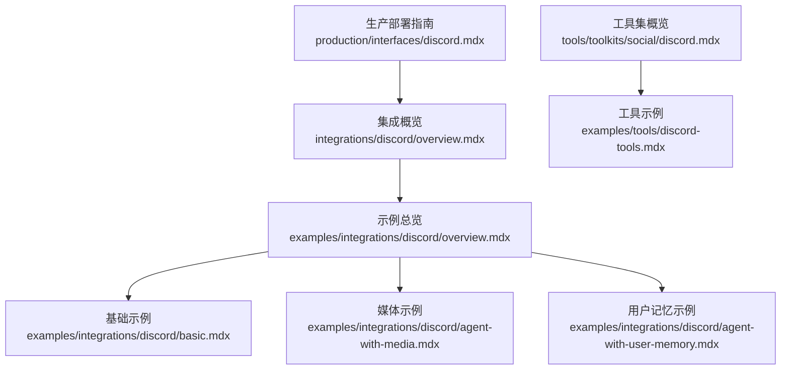
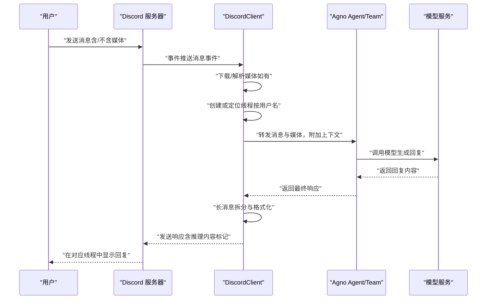
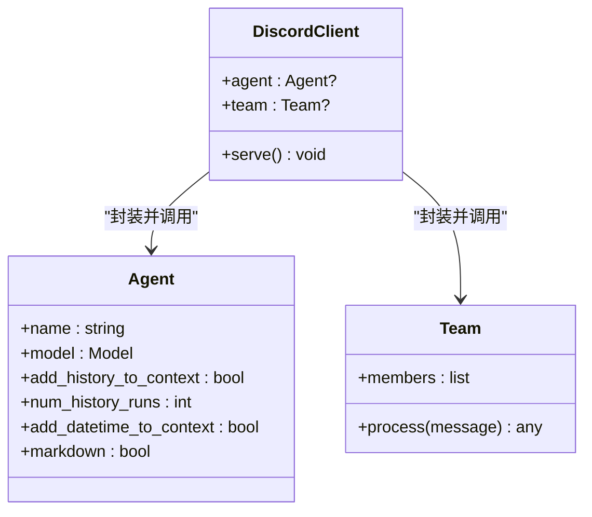
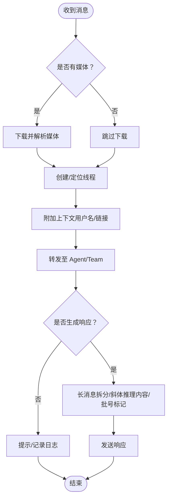
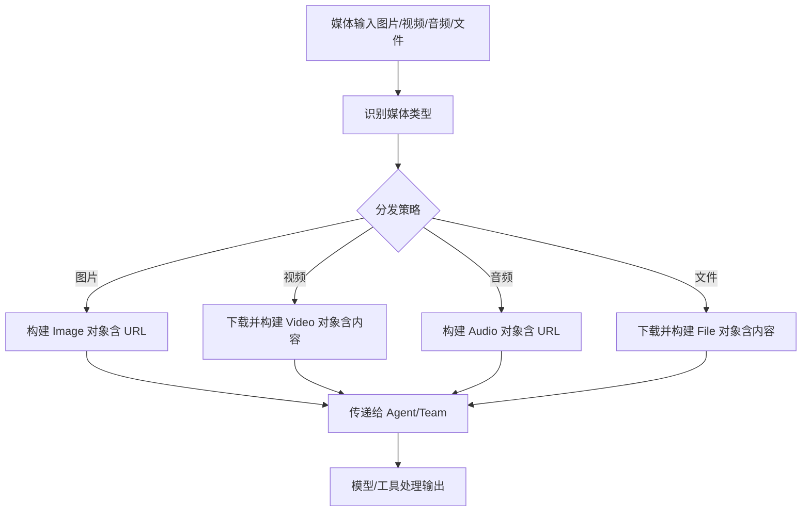
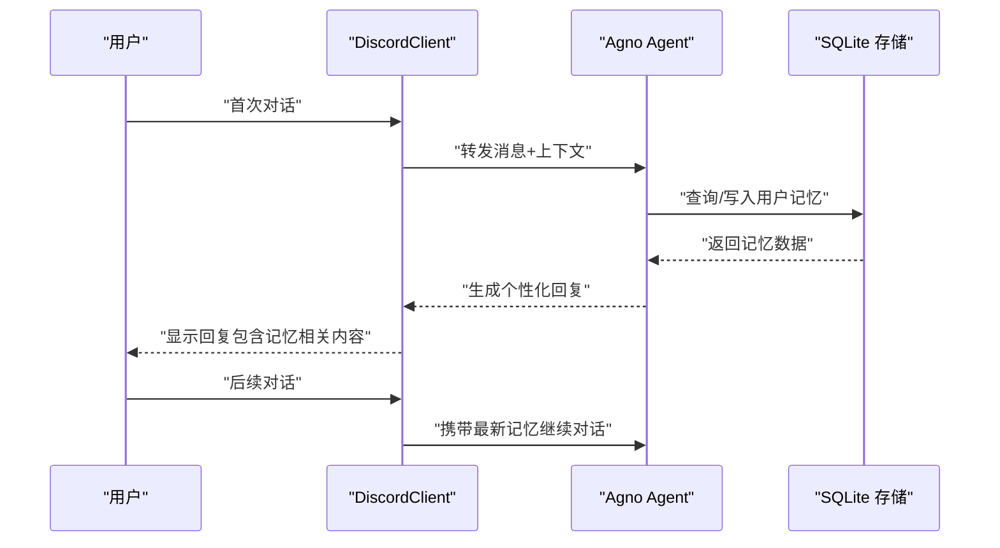
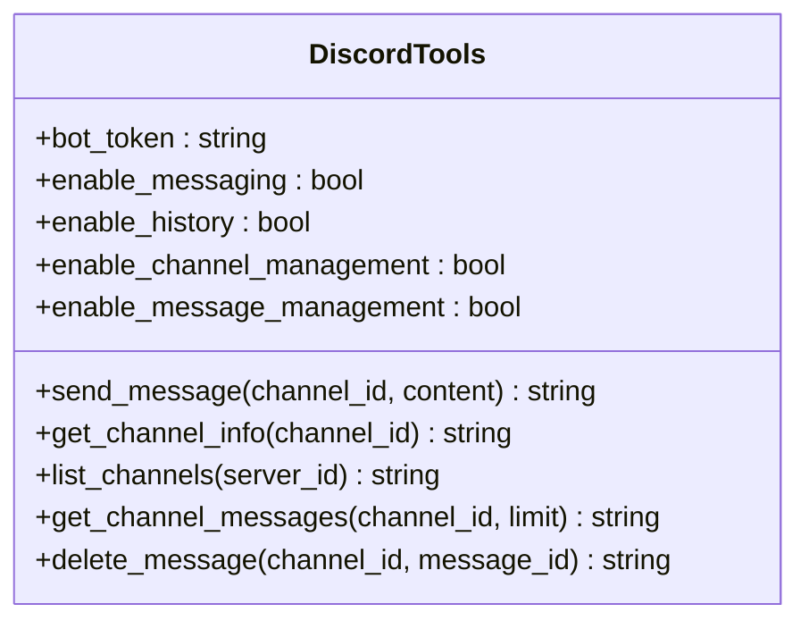
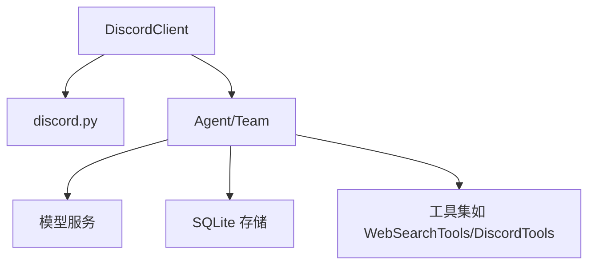

# Discord 机器人集成

<cite>
**本文引用的文件**
- [integrations/discord/overview.mdx](file://integrations/discord/overview.mdx)
- [examples/integrations/discord/overview.mdx](file://examples/integrations/discord/overview.mdx)
- [examples/integrations/discord/basic.mdx](file://examples/integrations/discord/basic.mdx)
- [examples/integrations/discord/agent-with-media.mdx](file://examples/integrations/discord/agent-with-media.mdx)
- [examples/integrations/discord/agent-with-user-memory.mdx](file://examples/integrations/discord/agent-with-user-memory.mdx)
- [production/interfaces/discord.mdx](file://production/interfaces/discord.mdx)
- [tools/toolkits/social/discord.mdx](file://tools/toolkits/social/discord.mdx)
- [examples/tools/discord-tools.mdx](file://examples/tools/discord-tools.mdx)
</cite>

## 目录
1. [简介](#简介)
2. [项目结构](#项目结构)
3. [核心组件](#核心组件)
4. [架构总览](#架构总览)
5. [详细组件分析](#详细组件分析)
6. [依赖关系分析](#依赖关系分析)
7. [性能考量](#性能考量)
8. [故障排查指南](#故障排查指南)
9. [结论](#结论)
10. [附录](#附录)

## 简介
本技术文档面向希望在 Discord 平台上部署 AI 驱动机器人的开发者，基于 Agno 框架提供的 Discord 集成能力，系统讲解从环境准备、机器人配置、事件监听、消息处理与响应机制，到媒体处理与用户记忆管理的完整流程。文档同时覆盖权限配置、错误处理与最佳实践，帮助你在生产环境中稳定运行机器人。

## 项目结构
围绕 Discord 机器人的相关文档分布在以下模块：
- 集成概览：介绍如何通过 Agno 的 DiscordClient 将 Agent 或 Team 托管为 Discord Bot，并说明其核心特性（自动建线程、媒体支持、长消息拆分等）。
- 示例集合：包含基础机器人、带媒体分析能力的机器人、结合用户记忆的个人助理型机器人等三类示例。
- 生产部署：提供从应用创建、权限配置、环境变量设置到邀请与测试的完整步骤。
- 工具集：介绍可让 Agent 直接操作 Discord 的 DiscordTools 工具包及其参数与函数。

图表来源
- [integrations/discord/overview.mdx:1-119](file://integrations/discord/overview.mdx#L1-L119)
- [examples/integrations/discord/overview.mdx:1-11](file://examples/integrations/discord/overview.mdx#L1-L11)
- [examples/integrations/discord/basic.mdx:1-50](file://examples/integrations/discord/basic.mdx#L1-L50)
- [examples/integrations/discord/agent-with-media.mdx:1-53](file://examples/integrations/discord/agent-with-media.mdx#L1-L53)
- [examples/integrations/discord/agent-with-user-memory.mdx:1-70](file://examples/integrations/discord/agent-with-user-memory.mdx#L1-L70)
- [production/interfaces/discord.mdx:1-116](file://production/interfaces/discord.mdx#L1-L116)
- [tools/toolkits/social/discord.mdx:1-51](file://tools/toolkits/social/discord.mdx#L1-L51)
- [examples/tools/discord-tools.mdx:1-148](file://examples/tools/discord-tools.mdx#L1-L148)

章节来源
- [integrations/discord/overview.mdx:1-119](file://integrations/discord/overview.mdx#L1-L119)
- [examples/integrations/discord/overview.mdx:1-11](file://examples/integrations/discord/overview.mdx#L1-L11)

## 核心组件
- DiscordClient：封装 Agno 的 Agent 或 Team，使其可通过 discord.py 监听并处理 Discord 事件，负责消息接收、媒体下载与转发、线程管理、响应发送与格式化等。
- 事件处理：自动处理消息事件，支持图片、视频、音频与文档等媒体类型；自动为每个用户的首次消息创建线程以保持上下文；对超过阈值的长消息进行拆分；支持显示推理内容（斜体）。
- 环境变量：需要设置 DISCORD_BOT_TOKEN，用于鉴权连接 Discord Gateway。
- 示例应用：提供基础机器人、媒体分析机器人、结合用户记忆的个人助理三种典型用法，便于快速上手与扩展。

章节来源
- [integrations/discord/overview.mdx:35-119](file://integrations/discord/overview.mdx#L35-L119)
- [examples/integrations/discord/basic.mdx:13-36](file://examples/integrations/discord/basic.mdx#L13-L36)
- [examples/integrations/discord/agent-with-media.mdx:13-39](file://examples/integrations/discord/agent-with-media.mdx#L13-L39)
- [examples/integrations/discord/agent-with-user-memory.mdx:13-56](file://examples/integrations/discord/agent-with-user-memory.mdx#L13-L56)

## 架构总览
下图展示了从用户消息到响应返回的端到端流程，以及与 Agno Agent/Team 的交互关系。

图表来源
- [integrations/discord/overview.mdx:53-92](file://integrations/discord/overview.mdx#L53-L92)

## 详细组件分析

### 组件一：DiscordClient 类与初始化
- 职责：作为 Agno 与 Discord 的桥接层，负责启动客户端、监听事件、处理消息与媒体、维护线程与上下文、格式化并发送响应。
- 初始化参数：
  - agent：可选，传入一个 Agno Agent 实例
  - team：可选，传入一个 Agno Team 实例
  - 二选一，不可同时提供
- 运行入口：serve() 启动客户端，内部使用 discord.py 连接 Discord Gateway 并注册事件回调。

图表来源
- [integrations/discord/overview.mdx:40-52](file://integrations/discord/overview.mdx#L40-L52)

章节来源
- [integrations/discord/overview.mdx:40-52](file://integrations/discord/overview.mdx#L40-L52)

### 组件二：消息处理与响应机制
- 接收与预处理：接收来自频道的消息，自动下载媒体（图片/视频/音频/文件），并解析为对象传递给 Agent/Team。
- 线程管理：为每个用户的首次消息创建线程，线程名采用“用户名的线程”格式，确保对话上下文隔离与持久。
- 上下文增强：在消息中附加用户名与消息链接，便于 Agent/Team 更好地理解背景信息。
- 响应处理：对超过字符阈值的长消息进行拆分；推理内容以斜体显示；对拆分后的消息添加批号标记（如 [1/3]）。
- 错误与回退：若媒体下载失败或 Agent/Team 返回异常，DiscordClient 应进行降级提示并记录日志。

图表来源
- [integrations/discord/overview.mdx:82-92](file://integrations/discord/overview.mdx#L82-L92)

章节来源
- [integrations/discord/overview.mdx:53-92](file://integrations/discord/overview.mdx#L53-L92)

### 组件三：媒体处理能力
- 支持类型：图片（URL 直链）、视频（下载后内容）、音频（URL 直链）、文件（下载后内容）。
- 处理方式：将媒体转换为对应的对象（如 Image/Video/Audio/File），并随消息一起传递给 Agent/Team，由模型或工具完成分析与生成。
- 典型场景：视觉问答、语音转文字、文档摘要、多模态分析等。

图表来源
- [integrations/discord/overview.mdx:68-104](file://integrations/discord/overview.mdx#L68-L104)

章节来源
- [integrations/discord/overview.mdx:68-104](file://integrations/discord/overview.mdx#L68-L104)

### 组件四：用户记忆管理
- 数据存储：示例中使用 SQLite 作为持久化存储，Agent 可启用“代理式记忆”以在会话间保留用户偏好与历史。
- 场景价值：在个人助理型机器人中，可实现“记住用户姓名、兴趣、最近话题”，提升对话连贯性与个性化体验。
- 配置要点：数据库实例需在 Agent 创建前初始化；开启 enable_agentic_memory；在指令中明确记忆目标与交互风格。

图表来源
- [examples/integrations/discord/agent-with-user-memory.mdx:24-46](file://examples/integrations/discord/agent-with-user-memory.mdx#L24-L46)

章节来源
- [examples/integrations/discord/agent-with-user-memory.mdx:24-46](file://examples/integrations/discord/agent-with-user-memory.mdx#L24-L46)

### 组件五：Agent/Team 与 Discord 的协作模式
- 单 Agent：适合简单问答、知识检索、任务执行等场景。
- 多 Agent 团队：适合复杂编排、多角色协作、跨工具联动等场景。
- 选择原则：根据业务复杂度与资源开销评估，优先从单 Agent 开始，逐步引入团队与工具。

章节来源
- [integrations/discord/overview.mdx:40-52](file://integrations/discord/overview.mdx#L40-L52)

### 组件六：Agent 直接操作 Discord 的工具集（可选）
- 工具名称：DiscordTools
- 功能范围：发送消息、获取频道信息、列出频道、获取消息历史、删除消息等。
- 参数控制：可按需启用/禁用各项能力，降低风险面。
- 使用场景：当需要 Agent 主动在 Discord 中执行管理动作时（如公告发布、清理无效消息、统计频道活跃度等）。

图表来源
- [tools/toolkits/social/discord.mdx:28-47](file://tools/toolkits/social/discord.mdx#L28-L47)

章节来源
- [tools/toolkits/social/discord.mdx:28-47](file://tools/toolkits/social/discord.mdx#L28-L47)
- [examples/tools/discord-tools.mdx:13-88](file://examples/tools/discord-tools.mdx#L13-L88)

## 依赖关系分析
- 外部库：discord.py（事件驱动与 Gateway 连接）
- 模型服务：OpenAI/Gemini 等（由 Agent/Team 的 model 字段指定）
- 存储：SQLite（示例中用于用户记忆）
- 工具：WebSearchTools（示例中用于网络检索）

图表来源
- [integrations/discord/overview.mdx:74-81](file://integrations/discord/overview.mdx#L74-L81)
- [examples/integrations/discord/agent-with-user-memory.mdx:16-19](file://examples/integrations/discord/agent-with-user-memory.mdx#L16-L19)
- [tools/toolkits/social/discord.mdx:17-26](file://tools/toolkits/social/discord.mdx#L17-L26)

章节来源
- [integrations/discord/overview.mdx:74-81](file://integrations/discord/overview.mdx#L74-L81)
- [examples/integrations/discord/agent-with-user-memory.mdx:16-19](file://examples/integrations/discord/agent-with-user-memory.mdx#L16-L19)
- [tools/toolkits/social/discord.mdx:17-26](file://tools/toolkits/social/discord.mdx#L17-L26)

## 性能考量
- 媒体下载与解析：建议在 Agent/Team 层对大体积媒体进行压缩或裁剪，避免阻塞响应链路。
- 线程并发：同一服务器内多用户并发时，注意线程命名唯一性与上下文隔离，避免交叉污染。
- 长消息拆分：合理设置阈值，避免过度拆分导致阅读成本上升；可考虑分步回复与引导用户查看后续部分。
- 缓存与重试：对频繁请求的外部接口（如模型服务）实施缓存与指数退避重试，提升稳定性。
- 日志与监控：记录关键事件（消息接收、媒体下载、Agent/Team 执行耗时、错误码），便于定位瓶颈与异常。

## 故障排查指南
- 环境变量未设置：确认已导出 DISCORD_BOT_TOKEN，且值与开发者门户中 Bot Token 一致。
- 权限不足：检查 Bot 的 Gateway Intents（消息内容意图、成员意图）与服务器权限（发送消息、读取历史、创建公开线程、附件、嵌入链接）。
- 媒体下载失败：检查媒体 URL 是否可访问、网络是否可达、磁盘空间是否充足。
- 响应超长：确认长消息拆分逻辑生效；若仍异常，检查消息格式化与批号标记是否正确。
- Agent/Team 异常：查看日志中模型调用错误、工具调用异常或存储访问失败等信息，逐项修复。
- 线程错乱：核对线程命名规则与上下文注入逻辑，确保每个用户独立线程。

章节来源
- [production/interfaces/discord.mdx:34-105](file://production/interfaces/discord.mdx#L34-L105)
- [integrations/discord/overview.mdx:74-81](file://integrations/discord/overview.mdx#L74-L81)

## 结论
通过 Agno 的 Discord 集成，你可以快速将 AI Agent 或 Team 托管为功能完备的 Discord 机器人。从基础问答到媒体分析，再到结合用户记忆的个性化交互，均可在统一框架下实现。配合完善的权限配置、健壮的错误处理与性能优化策略，可在生产环境中稳定运行并持续演进。

## 附录

### 快速开始清单
- 准备阶段：Python 环境、Discord 开发者账号、安装 discord.py
- 创建应用与 Bot：在开发者门户创建应用、添加 Bot、复制 Token
- 配置权限与意图：启用消息内容意图与必要权限
- 设置环境变量：导出 DISCORD_BOT_TOKEN
- 邀请 Bot 至服务器：使用 OAuth2 URL 生成器配置权限并邀请
- 运行示例：参考基础/媒体/用户记忆示例，验证自动建线程与响应

章节来源
- [production/interfaces/discord.mdx:34-105](file://production/interfaces/discord.mdx#L34-L105)

### 示例索引
- 基础机器人：[basic.mdx:1-50](file://examples/integrations/discord/basic.mdx#L1-L50)
- 媒体分析机器人：[agent-with-media.mdx:1-53](file://examples/integrations/discord/agent-with-media.mdx#L1-L53)
- 用户记忆机器人：[agent-with-user-memory.mdx:1-70](file://examples/integrations/discord/agent-with-user-memory.mdx#L1-L70)

章节来源
- [examples/integrations/discord/overview.mdx:6-11](file://examples/integrations/discord/overview.mdx#L6-L11)