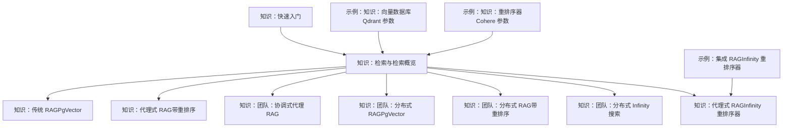
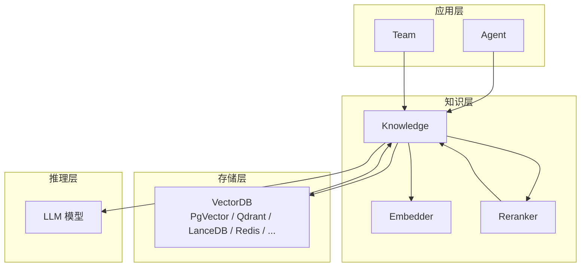
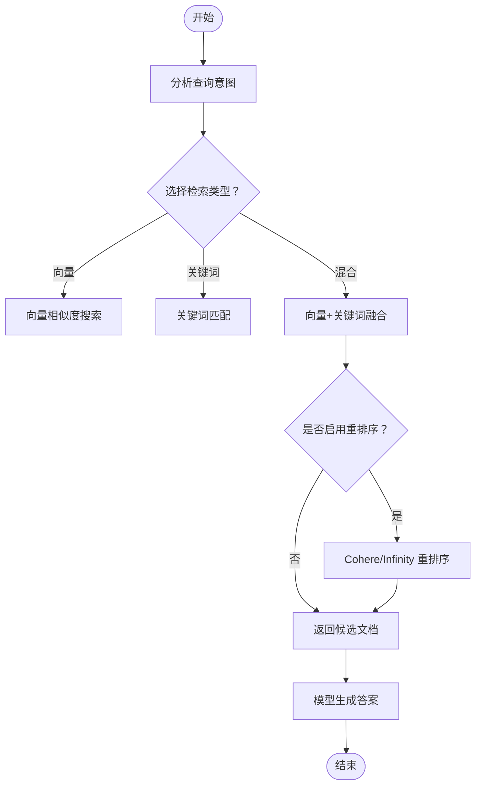
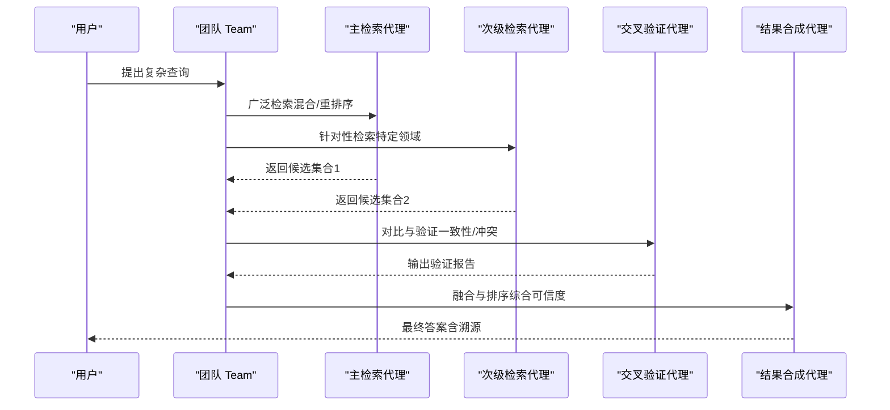
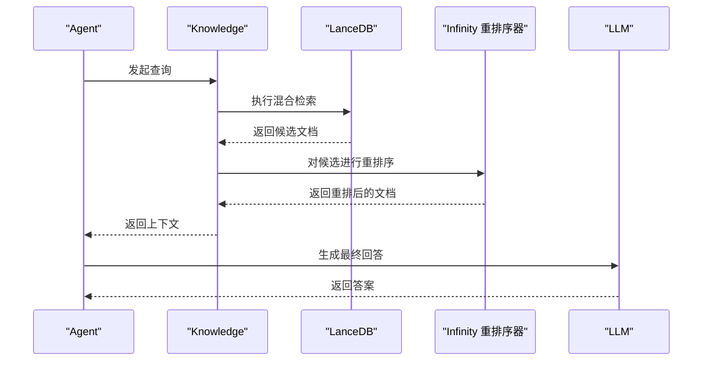
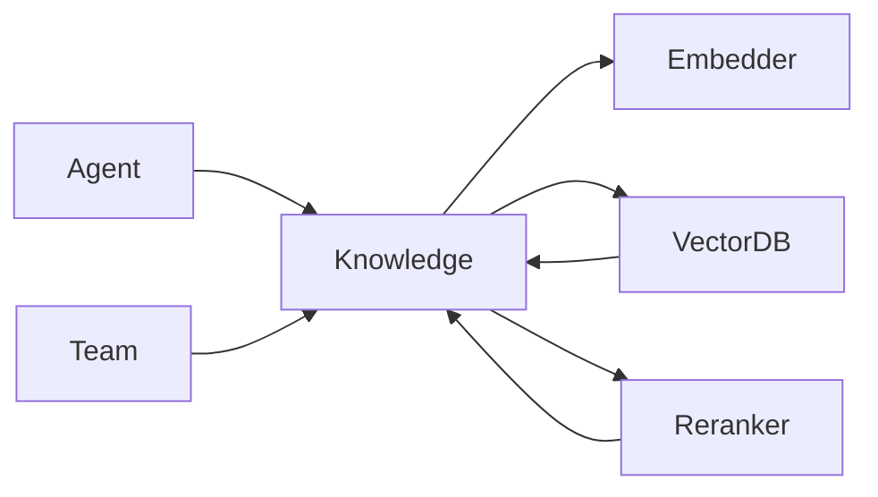

# RAG 系统集成

<cite>
**本文引用的文件**   
- [知识：快速入门](file://knowledge/quickstart.mdx)
- [知识：向量存储索引](file://knowledge/vector-stores/index.mdx)
- [知识：检索与检索概览](file://knowledge/concepts/search-and-retrieval/overview.mdx)
- [知识：传统 RAG（PgVector）](file://knowledge/agents/traditional-rag-pgvector.mdx)
- [知识：代理式 RAG（带重排序）](file://knowledge/agents/agentic-rag-with-reranking.mdx)
- [知识：团队：协调式代理 RAG](file://knowledge/teams/coordinated-agentic-rag.mdx)
- [知识：团队：分布式 RAG（PgVector）](file://knowledge/teams/distributed-rag-pgvector.mdx)
- [知识：团队：分布式 RAG（带重排序）](file://knowledge/teams/distributed-rag-with-reranking.mdx)
- [知识：团队：分布式 Infinity 搜索](file://knowledge/teams/distributed-infinity-search.mdx)
- [知识：代理式 RAG（Infinity 重排序器）](file://knowledge/concepts/search-and-retrieval/agentic-rag-infinity-reranker.mdx)
- [示例：集成 RAG（Infinity 重排序器）](file://examples/integrations/rag/agentic-rag-infinity-reranker.mdx)
- [示例：知识：向量数据库（Qdrant 参数）](file://_snippets/vectordb_qdrant_params.mdx)
- [示例：知识：重排序器（Cohere 参数）](file://_snippets/reranker-cohere-params.mdx)
</cite>

## 目录
1. [简介](#简介)
2. [项目结构](#项目结构)
3. [核心组件](#核心组件)
4. [架构总览](#架构总览)
5. [详细组件分析](#详细组件分析)
6. [依赖关系分析](#依赖关系分析)
7. [性能考量](#性能考量)
8. [故障排查指南](#故障排查指南)
9. [结论](#结论)
10. [附录](#附录)

## 简介
本技术指南面向在 Agno 框架中集成 RAG（检索增强生成）系统的工程师与架构师，系统讲解如何将 Agno 的知识库、嵌入器、向量数据库与重排序器组合，构建从本地到分布式、从单模态到多模态的可扩展 RAG 解决方案。文档覆盖以下关键主题：
- 向量数据库选择与配置：SQL 基础、专用向量库、NoSQL、本地与云服务
- 检索策略优化：向量、关键词与混合检索
- 重排序算法应用：Cohere、Infinity 本地重排序器
- 典型集成示例：传统 RAG、代理式 RAG、分布式 RAG、Infinity 协作检索
- 性能调优、索引管理与查询优化

## 项目结构
Agno 文档仓库以“知识”“示例”“参考片段”三大板块组织 RAG 相关内容：
- 知识（knowledge）：概念、最佳实践与端到端示例
- 示例（examples）：可运行的集成脚本与工作流
- 参考片段（_snippets）：参数表与配置要点

**图表来源**
- [知识：快速入门:1-129](file://knowledge/quickstart.mdx#L1-L129)
- [知识：检索与检索概览:1-255](file://knowledge/concepts/search-and-retrieval/overview.mdx#L1-L255)
- [知识：传统 RAG（PgVector）:1-74](file://knowledge/agents/traditional-rag-pgvector.mdx#L1-L74)
- [知识：代理式 RAG（带重排序）:1-80](file://knowledge/agents/agentic-rag-with-reranking.mdx#L1-L80)
- [知识：团队：协调式代理 RAG:1-152](file://knowledge/teams/coordinated-agentic-rag.mdx#L1-L152)
- [知识：团队：分布式 RAG（PgVector）:1-145](file://knowledge/teams/distributed-rag-pgvector.mdx#L1-L145)
- [知识：团队：分布式 RAG（带重排序）:1-241](file://knowledge/teams/distributed-rag-with-reranking.mdx#L1-L241)
- [知识：团队：分布式 Infinity 搜索:1-236](file://knowledge/teams/distributed-infinity-search.mdx#L1-L236)
- [知识：代理式 RAG（Infinity 重排序器）:1-176](file://knowledge/concepts/search-and-retrieval/agentic-rag-infinity-reranker.mdx#L1-L176)
- [示例：集成 RAG（Infinity 重排序器）:1-41](file://examples/integrations/rag/agentic-rag-infinity-reranker.mdx#L1-L41)
- [示例：知识：向量数据库（Qdrant 参数）:1-17](file://_snippets/vectordb_qdrant_params.mdx#L1-L17)
- [示例：知识：重排序器（Cohere 参数）:1-7](file://_snippets/reranker-cohere-params.mdx#L1-L7)

**章节来源**
- [知识：快速入门:1-129](file://knowledge/quickstart.mdx#L1-L129)
- [知识：向量存储索引:1-175](file://knowledge/vector-stores/index.mdx#L1-L175)

## 核心组件
- 知识库（Knowledge）：封装向量数据库、嵌入器与可选重排序器，统一检索入口
- 向量数据库（VectorDB）：支持 SQL（PgVector）、专用向量库（如 Qdrant）、NoSQL（如 Redis/Mongo）、本地（LanceDB）与云服务（Upstash）
- 嵌入器（Embedder）：文本向量化模型，如 OpenAI、Gemini、Cohere、SentenceTransformer 等
- 重排序器（Reranker）：对候选结果进行语义重排，如 Cohere、Infinity（本地）
- 检索策略（SearchType）：向量、关键词、混合检索；可结合过滤与自定义检索逻辑
- 团队协作（Team）：将检索、验证、合成等职责拆分给多个代理，提升复杂查询处理能力

**章节来源**
- [知识：检索与检索概览:1-255](file://knowledge/concepts/search-and-retrieval/overview.mdx#L1-L255)
- [知识：向量存储索引:1-175](file://knowledge/vector-stores/index.mdx#L1-L175)

## 架构总览
下图展示了 Agno 中 RAG 的通用数据流与组件交互：查询经由嵌入器编码，向量数据库执行检索，重排序器优化排序，最终由模型生成答案并返回。

**图表来源**
- [知识：检索与检索概览:1-255](file://knowledge/concepts/search-and-retrieval/overview.mdx#L1-L255)
- [知识：向量存储索引:1-175](file://knowledge/vector-stores/index.mdx#L1-L175)

## 详细组件分析

### 组件一：向量数据库选择与配置
- SQL 基础（PgVector）：适合已有 PostgreSQL 基础设施的企业环境，具备高扩展性与事务一致性
- 专用向量库（Qdrant、Weaviate、Pinecone）：提供成熟的向量索引与查询能力，适合云原生部署
- NoSQL（Redis、MongoDB Atlas）：便于与现有 NoSQL 生态融合，适合低延迟场景
- 本地（LanceDB）：轻量、易部署，适合开发测试与边缘场景
- 云服务（Upstash）：按需弹性、免运维，适合快速上线

参数要点（以 Qdrant 为例）：
- 集合名、距离度量、gRPC/HTTP 优先级、鉴权与超时设置
- 可通过参数表快速核对关键字段与默认值

**章节来源**
- [知识：向量存储索引:1-175](file://knowledge/vector-stores/index.mdx#L1-L175)
- [示例：知识：向量数据库（Qdrant 参数）:1-17](file://_snippets/vectordb_qdrant_params.mdx#L1-L17)

### 组件二：检索策略与重排序
- 检索类型
  - 向量检索：基于语义相似度，适合概念性问题
  - 关键词检索：精确匹配术语、编号等，适合技术标识
  - 混合检索：兼顾语义与精确匹配，生产推荐
- 重排序
  - Cohere 重排序器：云端 API，支持多语言与多模型
  - Infinity 本地重排序器：本地部署，低延迟、无外部依赖
- 过滤与自定义检索
  - 基于元数据过滤，缩小搜索空间
  - 自定义检索器可实现查询改写、多轮检索与结果融合

**图表来源**
- [知识：检索与检索概览:1-255](file://knowledge/concepts/search-and-retrieval/overview.mdx#L1-L255)

**章节来源**
- [知识：检索与检索概览:1-255](file://knowledge/concepts/search-and-retrieval/overview.mdx#L1-L255)
- [示例：知识：重排序器（Cohere 参数）:1-7](file://_snippets/reranker-cohere-params.mdx#L1-L7)

### 组件三：传统 RAG（PgVector）
- 特点：直接将知识上下文注入提示，无需显式搜索工具
- 适用：简单问答、固定知识库、对搜索控制要求不高的场景
- 配置要点：连接字符串、表名、嵌入器与检索类型

**章节来源**
- [知识：传统 RAG（PgVector）:1-74](file://knowledge/agents/traditional-rag-pgvector.mdx#L1-L74)

### 组件四：代理式 RAG（带重排序）
- 特点：代理自主决定何时搜索、如何改写查询、是否二次检索
- 集成：在知识库中配置嵌入器与重排序器，Agent 自动使用
- 示例：使用 LanceDB + Cohere 重排序器，提升相关性

**章节来源**
- [知识：代理式 RAG（带重排序）:1-80](file://knowledge/agents/agentic-rag-with-reranking.mdx#L1-L80)

### 组件五：团队协作 RAG（协调式与分布式）
- 协调式：将“检索—分析—合成”拆分为不同角色代理，提升复杂问题处理质量
- 分布式：多代理并行检索、交叉验证与结果合成，适合大规模知识库与高并发场景
- Infinity 协作：利用本地 Infinity 重排序器，实现高性能分布式重排

**图表来源**
- [知识：团队：协调式代理 RAG:1-152](file://knowledge/teams/coordinated-agentic-rag.mdx#L1-L152)
- [知识：团队：分布式 RAG（带重排序）:1-241](file://knowledge/teams/distributed-rag-with-reranking.mdx#L1-L241)
- [知识：团队：分布式 Infinity 搜索:1-236](file://knowledge/teams/distributed-infinity-search.mdx#L1-L236)

**章节来源**
- [知识：团队：协调式代理 RAG:1-152](file://knowledge/teams/coordinated-agentic-rag.mdx#L1-L152)
- [知识：团队：分布式 RAG（PgVector）:1-145](file://knowledge/teams/distributed-rag-pgvector.mdx#L1-L145)
- [知识：团队：分布式 RAG（带重排序）:1-241](file://knowledge/teams/distributed-rag-with-reranking.mdx#L1-L241)
- [知识：团队：分布式 Infinity 搜索:1-236](file://knowledge/teams/distributed-infinity-search.mdx#L1-L236)

### 组件六：Infinity 重排序器集成
- 本地部署：安装 Infinity 服务，启动重排序模型，Agent 通过 HTTP 客户端访问
- 集成方式：在知识库中配置 InfinityReranker，指定模型、主机与端口
- 优势：低延迟、可私有化、支持多种模型

**图表来源**
- [知识：代理式 RAG（Infinity 重排序器）:1-176](file://knowledge/concepts/search-and-retrieval/agentic-rag-infinity-reranker.mdx#L1-L176)
- [示例：集成 RAG（Infinity 重排序器）:1-41](file://examples/integrations/rag/agentic-rag-infinity-reranker.mdx#L1-L41)

**章节来源**
- [知识：代理式 RAG（Infinity 重排序器）:1-176](file://knowledge/concepts/search-and-retrieval/agentic-rag-infinity-reranker.mdx#L1-L176)
- [示例：集成 RAG（Infinity 重排序器）:1-41](file://examples/integrations/rag/agentic-rag-infinity-reranker.mdx#L1-L41)

## 依赖关系分析
- 组件耦合
  - Knowledge 是核心聚合点，向上对接 Agent/Team，向下依赖 Embedder、VectorDB、Reranker
  - VectorDB 与 Embedder 之间为强耦合（嵌入维度一致），与 Reranker 为弱耦合（可插拔）
- 外部依赖
  - 云端重排序器（Cohere）需要 API 密钥与网络连通
  - Infinity 本地重排序器需要独立服务与资源调度
- 可能的循环依赖
  - 通过抽象接口避免循环导入；检索流程单向：Agent → Knowledge → VectorDB/Reranker → LLM

**图表来源**
- [知识：检索与检索概览:1-255](file://knowledge/concepts/search-and-retrieval/overview.mdx#L1-L255)

**章节来源**
- [知识：检索与检索概览:1-255](file://knowledge/concepts/search-and-retrieval/overview.mdx#L1-L255)

## 性能考量
- 检索类型选择
  - 混合检索通常优于单一模式；在高精度需求场景优先考虑重排序
- 嵌入器与索引
  - 嵌入器应与业务域匹配；索引参数（如倒排/IVFFlat/HNSW）影响吞吐与延迟
- 查询优化
  - 使用元数据过滤缩小候选集；合理设置 top_k 与阈值
  - 对长查询进行改写，提升召回与重排效果
- 重排序策略
  - 本地 Infinity 重排序器适合低延迟与高并发；云端重排序器适合多语言与更强语义理解
- 团队协作
  - 并行检索与交叉验证可显著提升准确性，但需注意资源与延迟平衡

[本节为通用指导，不直接分析具体文件]

## 故障排查指南
- Infinity 重排序器未启动
  - 现象：重排序失败或超时
  - 排查：确认本地服务已启动、端口与模型配置正确
  - 参考：分布式 Infinity 搜索示例中的启动与报错提示
- Cohere 重排序器密钥缺失
  - 现象：API 调用失败
  - 排查：检查环境变量或客户端初始化参数
- PgVector 连接失败
  - 现象：无法写入/查询向量
  - 排查：确认连接串、扩展加载与权限
- 混合检索效果差
  - 现象：相关性不足
  - 排查：调整嵌入器、增加重排序、优化元数据过滤与查询改写

**章节来源**
- [知识：团队：分布式 Infinity 搜索:191-203](file://knowledge/teams/distributed-infinity-search.mdx#L191-L203)
- [示例：知识：重排序器（Cohere 参数）:1-7](file://_snippets/reranker-cohere-params.mdx#L1-L7)
- [知识：传统 RAG（PgVector）:57-64](file://knowledge/agents/traditional-rag-pgvector.mdx#L57-L64)

## 结论
通过将 Knowledge 作为统一入口，配合灵活的向量数据库与重排序器，Agno 能够支撑从本地到云端、从单体到分布式、从传统到代理式 RAG 的多样化场景。建议在生产环境中采用混合检索 + 重排序的组合策略，并根据业务特性选择合适的向量数据库与重排序方案（云端或本地）。团队协作模式进一步提升了复杂问题的处理能力与可维护性。

[本节为总结性内容，不直接分析具体文件]

## 附录

### 快速开始：创建一个知识驱动的代理
- 步骤概览
  - 创建知识库（选择向量数据库与嵌入器）
  - 插入内容（文件/URL/文本）
  - 创建代理并开启知识搜索
- 参考路径
  - [知识：快速入门:1-129](file://knowledge/quickstart.mdx#L1-L129)

**章节来源**
- [知识：快速入门:1-129](file://knowledge/quickstart.mdx#L1-L129)