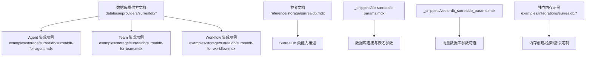
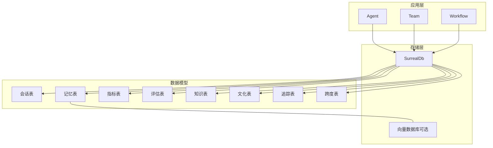
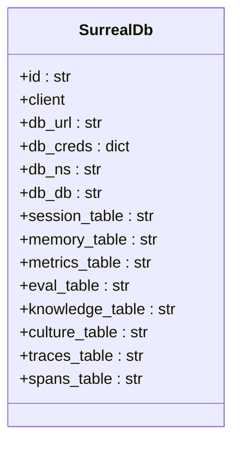
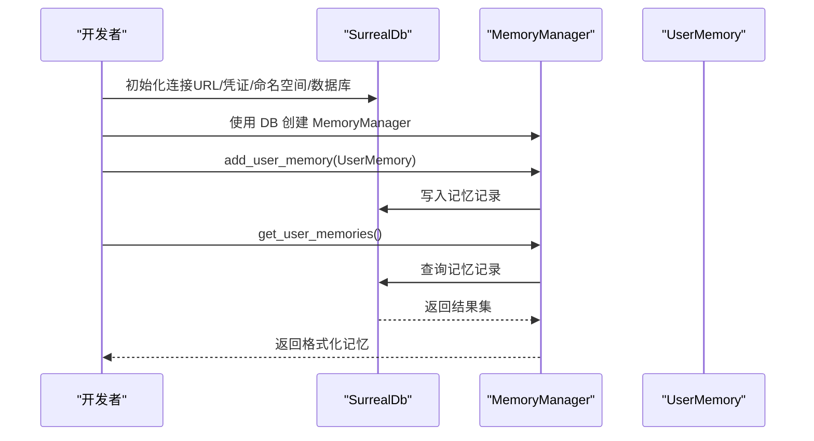
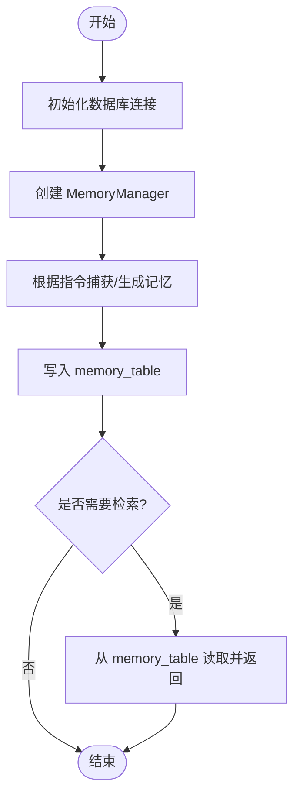
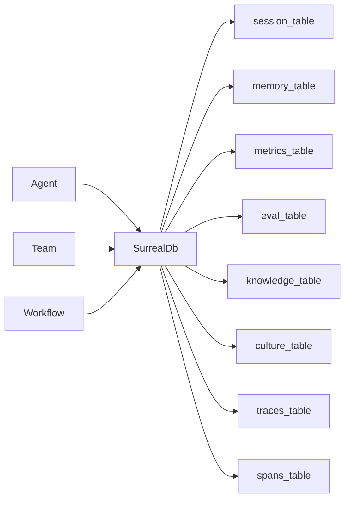

# SurrealDB 内存管理集成

<cite>
**本文引用的文件**
- [database/providers/surrealdb/overview.mdx](file://database/providers/surrealdb/overview.mdx)
- [database/providers/surrealdb/usage/surrealdb-for-agent.mdx](file://database/providers/surrealdb/usage/surrealdb-for-agent.mdx)
- [database/providers/surrealdb/usage/surrealdb-for-team.mdx](file://database/providers/surrealdb/usage/surrealdb-for-team.mdx)
- [database/providers/surrealdb/usage/surrealdb-for-workflow.mdx](file://database/providers/surrealdb/usage/surrealdb-for-workflow.mdx)
- [_snippets/db-surrealdb-params.mdx](file://_snippets/db-surrealdb-params.mdx)
- [_snippets/vectordb_surrealdb_params.mdx](file://_snippets/vectordb_surrealdb_params.mdx)
- [reference/storage/surrealdb.mdx](file://reference/storage/surrealdb.mdx)
- [examples/storage/surrealdb/surrealdb-for-agent.mdx](file://examples/storage/surrealdb/surrealdb-for-agent.mdx)
- [examples/storage/surrealdb/surrealdb-for-team.mdx](file://examples/storage/surrealdb/surrealdb-for-team.mdx)
- [examples/storage/surrealdb/surrealdb-for-workflow.mdx](file://examples/storage/surrealdb/surrealdb-for-workflow.mdx)
- [examples/integrations/surrealdb/standalone-memory-surreal.mdx](file://examples/integrations/surrealdb/standalone-memory-surreal.mdx)
- [examples/integrations/surrealdb/memory-creation.mdx](file://examples/integrations/surrealdb/memory-creation.mdx)
- [examples/integrations/surrealdb/custom-memory-instructions.mdx](file://examples/integrations/surrealdb/custom-memory-instructions.mdx)
</cite>

## 目录
1. [简介](#简介)
2. [项目结构](#项目结构)
3. [核心组件](#核心组件)
4. [架构总览](#架构总览)
5. [详细组件分析](#详细组件分析)
6. [依赖关系分析](#依赖关系分析)
7. [性能考量](#性能考量)
8. [故障排查指南](#故障排查指南)
9. [结论](#结论)
10. [附录](#附录)

## 简介
本文件面向在 Agno 框架中集成 SurrealDB 作为内存管理后端的工程师与架构师，系统性阐述如何基于 SurrealDB 实现独立内存管理、会话存储、知识与文化记忆、指标与追踪等多模态数据持久化，并覆盖查询优化、分布式扩展、事务与并发控制等高级主题。文档同时提供可直接落地的配置参数说明、表结构建议与调用序列图，帮助读者快速完成从开发到生产的部署。

## 项目结构
围绕 SurrealDB 的内存管理集成，仓库提供了以下关键资源：
- 数据库提供方文档：包含基础使用、Agent/Team/Workflow 的集成示例与参数说明
- 参考文档：对 SurrealDb 类的职责与能力进行概述
- 示例与片段：本地运行命令、连接参数、内存管理示例与向量数据库参数

**图表来源**
- [database/providers/surrealdb/overview.mdx:1-38](file://database/providers/surrealdb/overview.mdx#L1-L38)
- [reference/storage/surrealdb.mdx:1-9](file://reference/storage/surrealdb.mdx#L1-L9)
- [_snippets/db-surrealdb-params.mdx:1-18](file://_snippets/db-surrealdb-params.mdx#L1-L18)
- [_snippets/vectordb_surrealdb_params.mdx:1-10](file://_snippets/vectordb_surrealdb_params.mdx#L1-L10)
- [examples/storage/surrealdb/surrealdb-for-agent.mdx:1-73](file://examples/storage/surrealdb/surrealdb-for-agent.mdx#L1-L73)
- [examples/storage/surrealdb/surrealdb-for-team.mdx:1-107](file://examples/storage/surrealdb/surrealdb-for-team.mdx#L1-L107)
- [examples/storage/surrealdb/surrealdb-for-workflow.mdx:1-118](file://examples/storage/surrealdb/surrealdb-for-workflow.mdx#L1-L118)
- [examples/integrations/surrealdb/standalone-memory-surreal.mdx:1-42](file://examples/integrations/surrealdb/standalone-memory-surreal.mdx#L1-L42)
- [examples/integrations/surrealdb/memory-creation.mdx:1-34](file://examples/integrations/surrealdb/memory-creation.mdx#L1-L34)
- [examples/integrations/surrealdb/custom-memory-instructions.mdx:1-44](file://examples/integrations/surrealdb/custom-memory-instructions.mdx#L1-L44)

**章节来源**
- [database/providers/surrealdb/overview.mdx:1-38](file://database/providers/surrealdb/overview.mdx#L1-L38)
- [reference/storage/surrealdb.mdx:1-9](file://reference/storage/surrealdb.mdx#L1-L9)

## 核心组件
- SurrealDb 类：实现数据库接口，作为多模态会话与状态的后端存储，支持 JSON 数据类型与模式版本化
- 内存管理器（MemoryManager）：封装用户记忆的采集、存储、检索与指令定制，可与 SurrealDb 结合使用
- 表结构与命名约定：通过参数指定会话、记忆、指标、评估、知识、文化、追踪等表名，便于统一治理
- 向量数据库参数（可选）：当需要向量检索时，可配置集合名、距离度量、HNSW 参数与嵌入器

关键参数概览（节选）
- 连接与认证：db_url、db_creds（username/password）、db_ns、db_db
- 表名参数：session_table、memory_table、metrics_table、eval_table、knowledge_table、culture_table、traces_table、spans_table
- 向量数据库参数：client/async_client、collection、distance、efc、m、search_ef、embedder

**章节来源**
- [_snippets/db-surrealdb-params.mdx:1-18](file://_snippets/db-surrealdb-params.mdx#L1-L18)
- [_snippets/vectordb_surrealdb_params.mdx:1-10](file://_snippets/vectordb_surrealdb_params.mdx#L1-L10)
- [reference/storage/surrealdb.mdx:1-9](file://reference/storage/surrealdb.mdx#L1-L9)

## 架构总览
下图展示了在不同运行单元（Agent/Team/Workflow）中，如何通过 SurrealDb 统一承载会话、记忆与上下文数据；同时给出可选的向量检索路径。

**图表来源**
- [database/providers/surrealdb/usage/surrealdb-for-agent.mdx:16-38](file://database/providers/surrealdb/usage/surrealdb-for-agent.mdx#L16-L38)
- [database/providers/surrealdb/usage/surrealdb-for-team.mdx:16-73](file://database/providers/surrealdb/usage/surrealdb-for-team.mdx#L16-L73)
- [database/providers/surrealdb/usage/surrealdb-for-workflow.mdx:16-91](file://database/providers/surrealdb/usage/surrealdb-for-workflow.mdx#L16-L91)
- [_snippets/db-surrealdb-params.mdx:9-17](file://_snippets/db-surrealdb-params.mdx#L9-L17)
- [_snippets/vectordb_surrealdb_params.mdx:3-10](file://_snippets/vectordb_surrealdb_params.mdx#L3-L10)

## 详细组件分析

### 组件一：SurrealDb 类与数据库配置
- 职责：实现数据库接口，提供多模态会话与状态存储，支持 JSON 与模式版本化
- 关键点：
  - 支持阻塞式 WebSocket/HTTP 连接或异步连接（取决于具体实现）
  - 通过命名空间与数据库名隔离环境
  - 通过表名参数将会话、记忆、指标、评估、知识、文化、追踪、跨度等数据分表管理

**图表来源**
- [_snippets/db-surrealdb-params.mdx:1-18](file://_snippets/db-surrealdb-params.mdx#L1-L18)
- [reference/storage/surrealdb.mdx:5-5](file://reference/storage/surrealdb.mdx#L5-L5)

**章节来源**
- [reference/storage/surrealdb.mdx:1-9](file://reference/storage/surrealdb.mdx#L1-L9)
- [_snippets/db-surrealdb-params.mdx:1-18](file://_snippets/db-surrealdb-params.mdx#L1-L18)

### 组件二：独立内存管理与自定义指令
- 独立内存管理：通过 MemoryManager 与 SurrealDb 结合，实现用户记忆的增删改查与检索
- 自定义记忆指令：可为不同用户或场景定制记忆采集规则，确保只保留与业务目标相关的记忆内容
- 典型流程：初始化数据库连接 → 创建 MemoryManager → 添加/查询用户记忆 → 可选：按指令过滤与精炼

**图表来源**
- [examples/integrations/surrealdb/standalone-memory-surreal.mdx:10-42](file://examples/integrations/surrealdb/standalone-memory-surreal.mdx#L10-L42)
- [examples/integrations/surrealdb/memory-creation.mdx:10-34](file://examples/integrations/surrealdb/memory-creation.mdx#L10-L34)
- [examples/integrations/surrealdb/custom-memory-instructions.mdx:10-44](file://examples/integrations/surrealdb/custom-memory-instructions.mdx#L10-L44)

**章节来源**
- [examples/integrations/surrealdb/standalone-memory-surreal.mdx:1-42](file://examples/integrations/surrealdb/standalone-memory-surreal.mdx#L1-L42)
- [examples/integrations/surrealdb/memory-creation.mdx:1-34](file://examples/integrations/surrealdb/memory-creation.mdx#L1-L34)
- [examples/integrations/surrealdb/custom-memory-instructions.mdx:1-44](file://examples/integrations/surrealdb/custom-memory-instructions.mdx#L1-L44)

### 组件三：数据库工具控制与内存创建机制
- 工具控制：在 Agent/Team/Workflow 中注入数据库实例，使会话历史、成员交互、步骤输出等自动落库
- 内存创建机制：MemoryManager 基于模型与指令生成记忆摘要，写入指定表并支持后续检索
- 会话与历史：通过 session_table 保存对话上下文，结合 add_history_to_context 等选项实现上下文注入

**图表来源**
- [database/providers/surrealdb/usage/surrealdb-for-agent.mdx:16-38](file://database/providers/surrealdb/usage/surrealdb-for-agent.mdx#L16-L38)
- [database/providers/surrealdb/usage/surrealdb-for-team.mdx:16-73](file://database/providers/surrealdb/usage/surrealdb-for-team.mdx#L16-L73)
- [database/providers/surrealdb/usage/surrealdb-for-workflow.mdx:16-91](file://database/providers/surrealdb/usage/surrealdb-for-workflow.mdx#L16-L91)
- [_snippets/db-surrealdb-params.mdx:9-17](file://_snippets/db-surrealdb-params.mdx#L9-L17)

**章节来源**
- [database/providers/surrealdb/usage/surrealdb-for-agent.mdx:1-44](file://database/providers/surrealdb/usage/surrealdb-for-agent.mdx#L1-L44)
- [database/providers/surrealdb/usage/surrealdb-for-team.mdx:1-77](file://database/providers/surrealdb/usage/surrealdb-for-team.mdx#L1-L77)
- [database/providers/surrealdb/usage/surrealdb-for-workflow.mdx:1-95](file://database/providers/surrealdb/usage/surrealdb-for-workflow.mdx#L1-L95)

### 组件四：查询优化与数据迁移策略
- 查询优化建议：
  - 为常用查询字段建立索引（如用户标识、时间戳、主题标签）
  - 使用分页与投影减少网络与解析开销
  - 对大文本字段采用压缩或外部存储配合元数据索引
- 数据迁移策略：
  - 采用版本化的表结构与模式标记，保证向后兼容
  - 迁移前先备份，再增量迁移，最后切换流量
  - 对历史数据进行归档与冷热分离，降低在线查询压力

[本节为通用实践建议，不直接分析具体文件]

### 组件五：分布式内存管理、事务与并发控制
- 分布式内存管理：通过命名空间与数据库隔离不同集群或租户，结合表名参数实现跨节点一致性
- 事务处理：在需要强一致性的写入（如多表联动）时，优先使用数据库事务封装
- 并发控制：对高并发写入场景，建议引入幂等键与乐观锁；对读多写少场景，可采用缓存与只读副本

[本节为通用实践建议，不直接分析具体文件]

## 依赖关系分析
- 应用层依赖：Agent/Team/Workflow 通过 db 参数注入数据库实例
- 存储层依赖：SurrealDb 依赖连接客户端（WebSocket/HTTP 或异步），并通过表名参数映射到具体表
- 可选依赖：向量数据库参数用于增强检索能力，与记忆表形成互补

**图表来源**
- [_snippets/db-surrealdb-params.mdx:9-17](file://_snippets/db-surrealdb-params.mdx#L9-L17)
- [database/providers/surrealdb/usage/surrealdb-for-agent.mdx:30-30](file://database/providers/surrealdb/usage/surrealdb-for-agent.mdx#L30-L30)
- [database/providers/surrealdb/usage/surrealdb-for-team.mdx:35-35](file://database/providers/surrealdb/usage/surrealdb-for-team.mdx#L35-L35)
- [database/providers/surrealdb/usage/surrealdb-for-workflow.mdx:35-35](file://database/providers/surrealdb/usage/surrealdb-for-workflow.mdx#L35-L35)

**章节来源**
- [_snippets/db-surrealdb-params.mdx:1-18](file://_snippets/db-surrealdb-params.mdx#L1-L18)
- [database/providers/surrealdb/usage/surrealdb-for-agent.mdx:16-38](file://database/providers/surrealdb/usage/surrealdb-for-agent.mdx#L16-L38)
- [database/providers/surrealdb/usage/surrealdb-for-team.mdx:16-73](file://database/providers/surrealdb/usage/surrealdb-for-team.mdx#L16-L73)
- [database/providers/surrealdb/usage/surrealdb-for-workflow.mdx:16-91](file://database/providers/surrealdb/usage/surrealdb-for-workflow.mdx#L16-L91)

## 性能考量
- 连接与协议：优先使用 WebSocket 以降低握手开销；在高吞吐场景考虑异步客户端
- 索引与分区：为高频查询字段建立索引；必要时按时间或用户维度分区
- 缓存与批处理：对读多写少的数据采用缓存；批量写入减少往返次数
- 查询投影：仅选择所需字段，避免全量 JSON 解析
- 向量检索：合理设置 HNSW 参数（efc/m/search_ef）以平衡精度与性能

[本节提供通用指导，不直接分析具体文件]

## 故障排查指南
- 连接失败
  - 检查 db_url 是否正确（本地默认 ws://localhost:8000）
  - 核对 db_creds 的用户名与密码
  - 确认 db_ns 与 db_db 已存在且具备权限
- 表不存在或字段缺失
  - 使用表名参数确保各表被正确创建
  - 在升级模式时注意字段兼容性与迁移脚本
- 查询异常
  - 检查索引是否存在，必要时补充
  - 使用投影与分页减少单次响应大小
- 记忆未命中
  - 确认 MemoryManager 的指令是否正确
  - 检查 memory_table 的写入与查询逻辑

**章节来源**
- [database/providers/surrealdb/overview.mdx:11-15](file://database/providers/surrealdb/overview.mdx#L11-L15)
- [_snippets/db-surrealdb-params.mdx:1-18](file://_snippets/db-surrealdb-params.mdx#L1-L18)

## 结论
通过将 SurrealDB 作为 Agno 的内存管理后端，可以在 Agent/Team/Workflow 场景中实现统一的多模态数据存储与检索。结合表名参数与可选的向量数据库能力，既能满足结构化会话与状态管理，也能支撑向量检索与知识增强。建议在生产环境中重视索引、分区与事务一致性，并制定完善的数据迁移与故障恢复策略，以获得稳定、可扩展的内存管理能力。

## 附录
- 快速启动
  - 本地运行 SurrealDB：docker run --rm --pull always -p 8000:8000 surrealdb/surrealdb:latest start --user root --pass root
  - 在示例脚本中替换连接参数并运行对应示例
- 推荐实践
  - 为每个运行单元（Agent/Team/Workflow）单独配置数据库与命名空间
  - 使用表名参数集中管理各模块数据表
  - 对高并发场景启用异步客户端与缓存

**章节来源**
- [database/providers/surrealdb/overview.mdx:11-15](file://database/providers/surrealdb/overview.mdx#L11-L15)
- [examples/storage/surrealdb/surrealdb-for-agent.mdx:10-23](file://examples/storage/surrealdb/surrealdb-for-agent.mdx#L10-L23)
- [examples/storage/surrealdb/surrealdb-for-team.mdx:10-14](file://examples/storage/surrealdb/surrealdb-for-team.mdx#L10-L14)
- [examples/storage/surrealdb/surrealdb-for-workflow.mdx:10-14](file://examples/storage/surrealdb/surrealdb-for-workflow.mdx#L10-L14)