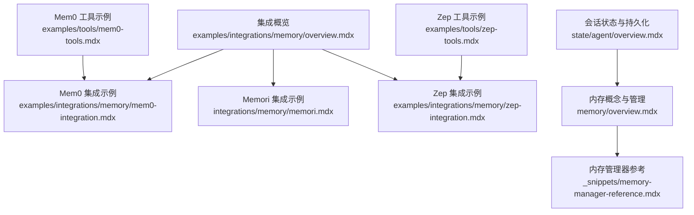
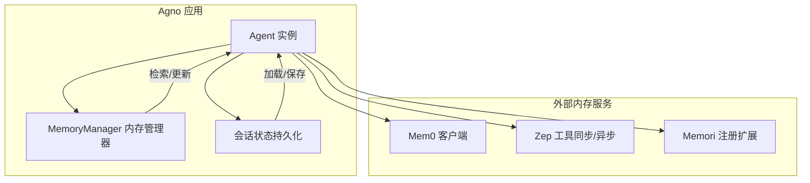
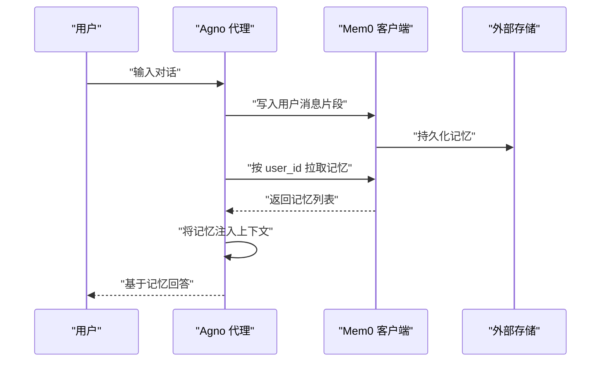
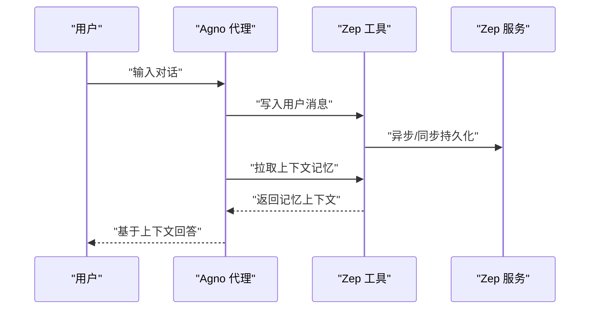
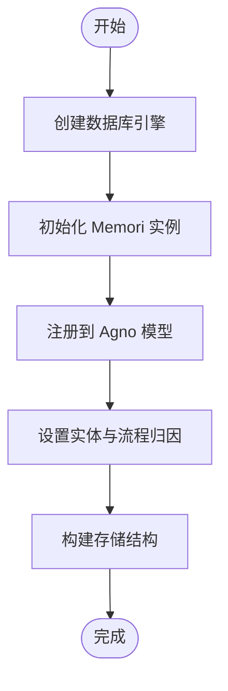
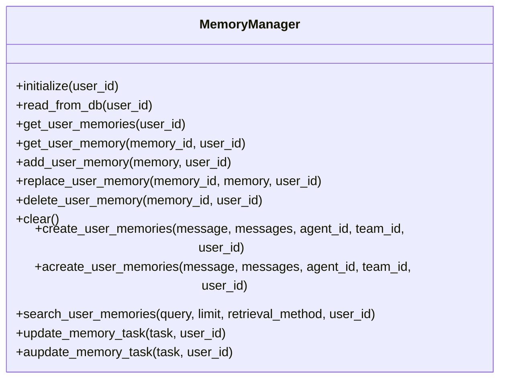
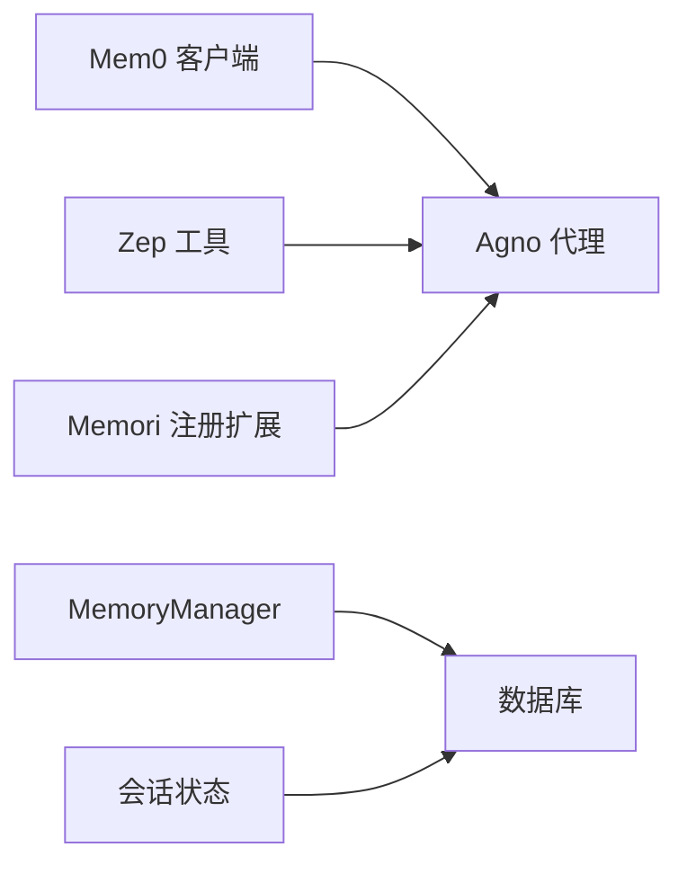

# 内存系统集成

<cite>
**本文引用的文件**
- [examples/integrations/memory/overview.mdx](file://examples/integrations/memory/overview.mdx)
- [integrations/memory/memori.mdx](file://integrations/memory/memori.mdx)
- [examples/integrations/memory/mem0-integration.mdx](file://examples/integrations/memory/mem0-integration.mdx)
- [examples/tools/mem0-tools.mdx](file://examples/tools/mem0-tools.mdx)
- [examples/integrations/memory/zep-integration.mdx](file://examples/integrations/memory/zep-integration.mdx)
- [examples/tools/zep-tools.mdx](file://examples/tools/zep-tools.mdx)
- [memory/overview.mdx](file://memory/overview.mdx)
- [_snippets/memory-manager-reference.mdx](file://_snippets/memory-manager-reference.mdx)
- [reference/memory/memory.mdx](file://reference/memory/memory.mdx)
- [state/agent/overview.mdx](file://state/agent/overview.mdx)
</cite>

## 目录
1. [简介](#简介)
2. [项目结构](#项目结构)
3. [核心组件](#核心组件)
4. [架构总览](#架构总览)
5. [详细组件分析](#详细组件分析)
6. [依赖关系分析](#依赖关系分析)
7. [性能考量](#性能考量)
8. [故障排查指南](#故障排查指南)
9. [结论](#结论)
10. [附录](#附录)

## 简介
本指南面向希望在 Agno 中集成外部内存服务（如 Mem0、Memori、Zep）的开发者，系统讲解如何将这些服务与 Agno 的代理运行时结合，实现用户记忆、会话状态管理与长期记忆存储，并覆盖数据同步、持久化策略、访问控制、迁移与备份恢复以及性能优化等关键主题。

## 项目结构
围绕“内存系统集成”的文档主要分布在以下区域：
- 集成概览与示例：examples/integrations/memory
- 工具与工具包：examples/tools（含 mem0、zep）
- 核心概念与参考：memory/overview、_snippets/memory-manager-reference、reference/memory
- 会话状态与持久化：state/agent/overview

**图表来源**
- [examples/integrations/memory/overview.mdx:1-11](file://examples/integrations/memory/overview.mdx#L1-L11)
- [examples/integrations/memory/mem0-integration.mdx:1-74](file://examples/integrations/memory/mem0-integration.mdx#L1-L74)
- [integrations/memory/memori.mdx:1-85](file://integrations/memory/memori.mdx#L1-L85)
- [examples/integrations/memory/zep-integration.mdx:1-64](file://examples/integrations/memory/zep-integration.mdx#L1-L64)
- [examples/tools/mem0-tools.mdx:1-150](file://examples/tools/mem0-tools.mdx#L1-L150)
- [examples/tools/zep-tools.mdx:1-118](file://examples/tools/zep-tools.mdx#L1-L118)
- [memory/overview.mdx:1-202](file://memory/overview.mdx#L1-L202)
- [_snippets/memory-manager-reference.mdx:1-58](file://_snippets/memory-manager-reference.mdx#L1-L58)
- [state/agent/overview.mdx:1-25](file://state/agent/overview.mdx#L1-L25)

**章节来源**
- [examples/integrations/memory/overview.mdx:1-11](file://examples/integrations/memory/overview.mdx#L1-L11)

## 核心组件
- 外部内存服务客户端
  - Mem0 客户端：通过 MemoryClient 进行记忆写入与检索，支持将外部记忆注入到代理上下文。
  - Zep 工具：提供同步与异步工具类，用于向 Zep 写入消息并拉取上下文记忆。
  - Memori：通过注册扩展，将对话记忆持久化至数据库（如 SQLite），并支持实体与流程归因。
- 内存管理器（MemoryManager）
  - 提供用户记忆的增删改查、检索与任务驱动更新能力；支持按最近/最早/语义相似三种方式检索。
- 会话状态（Agent Session State）
  - 在数据库可用时，会话状态自动持久化并在继续会话时加载，确保跨运行的数据一致性。

**章节来源**
- [examples/integrations/memory/mem0-integration.mdx:17-60](file://examples/integrations/memory/mem0-integration.mdx#L17-L60)
- [examples/tools/mem0-tools.mdx:24-104](file://examples/tools/mem0-tools.mdx#L24-L104)
- [examples/integrations/memory/zep-integration.mdx:13-50](file://examples/integrations/memory/zep-integration.mdx#L13-L50)
- [examples/tools/zep-tools.mdx:27-94](file://examples/tools/zep-tools.mdx#L27-L94)
- [integrations/memory/memori.mdx:18-64](file://integrations/memory/memori.mdx#L18-L64)
- [_snippets/memory-manager-reference.mdx:16-58](file://_snippets/memory-manager-reference.mdx#L16-L58)
- [memory/overview.mdx:10-98](file://memory/overview.mdx#L10-L98)
- [state/agent/overview.mdx:14-25](file://state/agent/overview.mdx#L14-L25)

## 架构总览
下图展示了 Agno 代理与外部内存服务（Mem0、Zep、Memori）的交互路径，以及内部记忆管理器与会话状态的关系。

**图表来源**
- [examples/integrations/memory/mem0-integration.mdx:44-48](file://examples/integrations/memory/mem0-integration.mdx#L44-L48)
- [examples/tools/mem0-tools.mdx:39-56](file://examples/tools/mem0-tools.mdx#L39-L56)
- [examples/integrations/memory/zep-integration.mdx:36-41](file://examples/integrations/memory/zep-integration.mdx#L36-L41)
- [examples/tools/zep-tools.mdx:34-39](file://examples/tools/zep-tools.mdx#L34-L39)
- [integrations/memory/memori.mdx:37-48](file://integrations/memory/memori.mdx#L37-L48)
- [memory/overview.mdx:10-98](file://memory/overview.mdx#L10-L98)
- [state/agent/overview.mdx:14-25](file://state/agent/overview.mdx#L14-L25)

## 详细组件分析

### 组件一：Mem0 集成
- 目标：将 Mem0 作为外部记忆源，为 Agno 代理提供可检索的记忆上下文。
- 关键点
  - 使用 MemoryClient 写入用户消息片段，随后通过 client.get_all(user_id=...) 获取记忆列表。
  - 将获取的记忆以 dependencies 的形式注入到代理上下文中，并开启 add_dependencies_to_context。
  - 支持在运行后再次写入最新对话，保持记忆与上下文同步。
- 典型流程（序列图）

**图表来源**
- [examples/integrations/memory/mem0-integration.mdx:28-60](file://examples/integrations/memory/mem0-integration.mdx#L28-L60)

**章节来源**
- [examples/integrations/memory/mem0-integration.mdx:17-60](file://examples/integrations/memory/mem0-integration.mdx#L17-L60)
- [examples/tools/mem0-tools.mdx:13-104](file://examples/tools/mem0-tools.mdx#L13-L104)

### 组件二：Zep 集成
- 目标：利用 Zep 的长期记忆与知识图谱能力，增强跨时间的记忆检索。
- 关键点
  - 使用 ZepTools/ZepAsyncTools 写入消息，等待后台同步完成。
  - 通过 get_zep_memory(memory_type="context") 获取上下文记忆，并注入到代理依赖中。
  - 支持同步与异步两种变体，满足不同并发模型需求。
- 典型流程（序列图）

**图表来源**
- [examples/integrations/memory/zep-integration.mdx:23-50](file://examples/integrations/memory/zep-integration.mdx#L23-L50)
- [examples/tools/zep-tools.mdx:29-94](file://examples/tools/zep-tools.mdx#L29-L94)

**章节来源**
- [examples/integrations/memory/zep-integration.mdx:13-50](file://examples/integrations/memory/zep-integration.mdx#L13-L50)
- [examples/tools/zep-tools.mdx:27-94](file://examples/tools/zep-tools.mdx#L27-L94)

### 组件三：Memori 集成
- 目标：将对话记忆持久化到本地或云端数据库（如 SQLite），并支持实体与流程归因。
- 关键点
  - 使用 SQLAlchemy 创建数据库引擎，初始化 Memori 并注册到 Agno 模型。
  - 通过 attribution(entity_id, process_id) 对记忆进行归因，便于后续检索与治理。
  - 调用 config.storage.build() 初始化存储结构。
- 典型流程（流程图）

**图表来源**
- [integrations/memory/memori.mdx:31-48](file://integrations/memory/memori.mdx#L31-L48)

**章节来源**
- [integrations/memory/memori.mdx:18-64](file://integrations/memory/memori.mdx#L18-L64)

### 组件四：内存管理器（MemoryManager）
- 职责：统一管理用户记忆的创建、检索、更新与删除；支持多种检索策略。
- 方法概览
  - 用户记忆管理：get_user_memories、get_user_memory、add_user_memory、replace_user_memory、delete_user_memory、clear
  - 记忆创建与搜索：create_user_memories/acreate_user_memories、search_user_memories（last_n/first_n/agentic）
  - 任务驱动更新：update_memory_task/aupdate_memory_task
  - 工具方法：initialize、read_from_db
- 检索策略
  - last_n：最近 N 条记忆
  - first_n：最早 N 条记忆
  - agentic：基于语义相似度的 AI 搜索

**图表来源**
- [_snippets/memory-manager-reference.mdx:16-58](file://_snippets/memory-manager-reference.mdx#L16-L58)

**章节来源**
- [_snippets/memory-manager-reference.mdx:16-58](file://_snippets/memory-manager-reference.mdx#L16-L58)
- [reference/memory/memory.mdx:1-8](file://reference/memory/memory.mdx#L1-L8)

### 组件五：会话状态与持久化
- 会话状态在数据库可用时自动持久化，并在继续会话时自动加载。
- 适用于跨运行保留临时数据（如待办事项、用户画像等）。

**章节来源**
- [state/agent/overview.mdx:14-25](file://state/agent/overview.mdx#L14-L25)

## 依赖关系分析
- 外部依赖
  - Mem0：需要安装 mem0ai 并配置 API Key。
  - Zep：需要安装 agno 的 zep 工具并配置 API Key。
  - Memori：需要安装 memori 及其依赖（如 SQLAlchemy）。
- 内部依赖
  - MemoryManager 与数据库（Postgres/SQLite 等）耦合，负责记忆表的读写。
  - 会话状态与数据库耦合，确保状态跨运行一致。

**图表来源**
- [examples/integrations/memory/mem0-integration.mdx:17-22](file://examples/integrations/memory/mem0-integration.mdx#L17-L22)
- [examples/tools/zep-tools.mdx:20](file://examples/tools/zep-tools.mdx#L20)
- [integrations/memory/memori.mdx:27-33](file://integrations/memory/memori.mdx#L27-L33)
- [memory/overview.mdx:94-98](file://memory/overview.mdx#L94-L98)
- [state/agent/overview.mdx:14](file://state/agent/overview.mdx#L14)

**章节来源**
- [examples/integrations/memory/mem0-integration.mdx:17-22](file://examples/integrations/memory/mem0-integration.mdx#L17-L22)
- [examples/tools/zep-tools.mdx:8-11](file://examples/tools/zep-tools.mdx#L8-L11)
- [integrations/memory/memori.mdx:8-12](file://integrations/memory/memori.mdx#L8-L12)
- [memory/overview.mdx:94-98](file://memory/overview.mdx#L94-L98)
- [state/agent/overview.mdx:14-25](file://state/agent/overview.mdx#L14-L25)

## 性能考量
- 同步与异步
  - Zep 提供同步与异步工具，异步版本适合高并发场景，减少主线程阻塞。
- 检索策略选择
  - last_n/first_n 适合快速定位；agentic 适合语义召回，但需权衡延迟与准确性。
- 数据库与索引
  - 为记忆表建立合适索引（如 user_id、updated_at），提升查询性能。
- 缓存与批处理
  - 对频繁读取的记忆进行缓存；批量写入减少网络往返。
- 会话状态持久化
  - 将热点状态写入数据库，避免重复计算与丢失。

[本节为通用建议，无需特定文件引用]

## 故障排查指南
- 环境变量未配置
  - Mem0：确认已导出 API Key 与组织/项目 ID。
  - Zep：确认已导出 API Key。
- 依赖安装问题
  - Mem0：确保安装 mem0ai。
  - Zep：确保安装 agno 的 zep 工具。
  - Memori：确保安装 memori 与 SQLAlchemy。
- 上下文未刷新
  - Zep：写入后需等待同步完成再拉取上下文，示例中包含延时等待。
- 访问控制与隐私
  - 所有记忆均与 user_id 关联，仅限当前 OS 实例内的代理访问；生产环境建议启用鉴权与最小权限策略。

**章节来源**
- [examples/tools/mem0-tools.mdx:13-22](file://examples/tools/mem0-tools.mdx#L13-L22)
- [examples/tools/zep-tools.mdx:8-11](file://examples/tools/zep-tools.mdx#L8-L11)
- [integrations/memory/memori.mdx:8-12](file://integrations/memory/memori.mdx#L8-L12)
- [examples/integrations/memory/zep-integration.mdx:29-30](file://examples/integrations/memory/zep-integration.mdx#L29-L30)

## 结论
通过将 Mem0、Zep、Memori 与 Agno 的内存管理器、会话状态持久化相结合，可以实现从短期对话记忆到长期用户知识图谱的全链路记忆体系。建议根据业务场景选择合适的检索策略与异步模式，并在生产环境中完善访问控制、索引优化与备份恢复策略。

[本节为总结性内容，无需特定文件引用]

## 附录

### A. 集成步骤速查
- Mem0
  - 安装依赖 → 初始化客户端 → 写入用户消息 → 拉取记忆并注入上下文 → 运行后可追加新记忆
- Zep
  - 安装依赖 → 初始化工具 → 写入消息 → 等待同步 → 拉取上下文 → 注入依赖
- Memori
  - 安装依赖 → 创建数据库引擎 → 初始化 Memori → 注册到模型 → 设置归因 → 构建存储

**章节来源**
- [examples/integrations/memory/mem0-integration.mdx:28-60](file://examples/integrations/memory/mem0-integration.mdx#L28-L60)
- [examples/integrations/memory/zep-integration.mdx:23-50](file://examples/integrations/memory/zep-integration.mdx#L23-L50)
- [integrations/memory/memori.mdx:31-48](file://integrations/memory/memori.mdx#L31-L48)

### B. 数据模型与字段
- memory_id、memory、topics、input、user_id、agent_id、team_id、updated_at
- 建议在数据库层对 user_id、updated_at 建立索引以提升查询效率

**章节来源**
- [memory/overview.mdx:148-165](file://memory/overview.mdx#L148-L165)