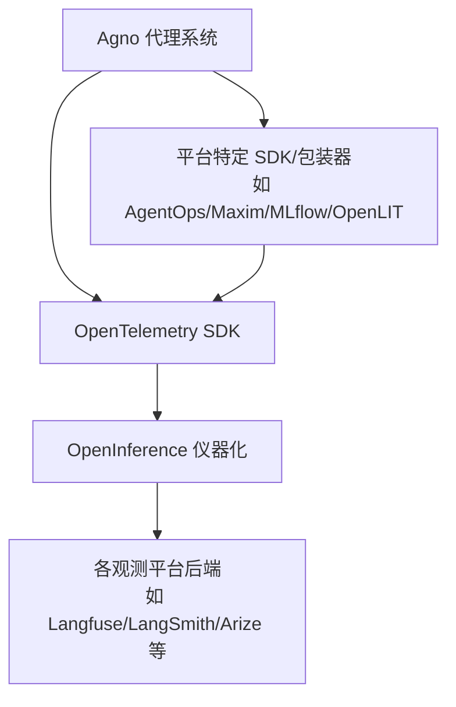
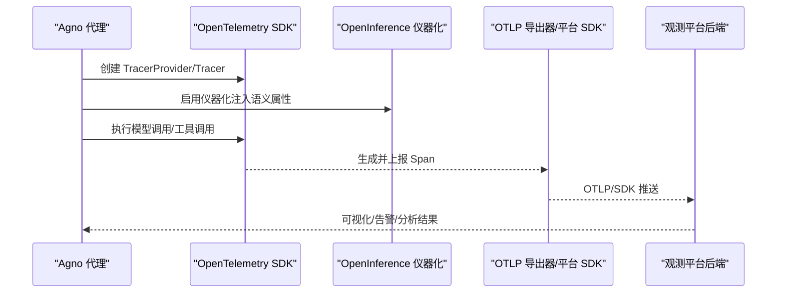
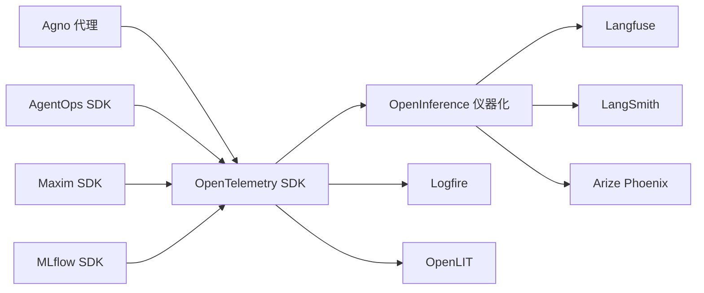

# 观察性系统集成

<cite>
**本文引用的文件**
- [observability/overview.mdx](file://observability/overview.mdx)
- [observability/agentops.mdx](file://observability/agentops.mdx)
- [observability/arize.mdx](file://observability/arize.mdx)
- [observability/langfuse.mdx](file://observability/langfuse.mdx)
- [observability/langsmith.mdx](file://observability/langsmith.mdx)
- [observability/langtrace.mdx](file://observability/langtrace.mdx)
- [observability/logfire.mdx](file://observability/logfire.mdx)
- [observability/maxim.mdx](file://observability/maxim.mdx)
- [observability/mlflow.mdx](file://observability/mlflow.mdx)
- [observability/openlit.mdx](file://observability/openlit.mdx)
- [examples/integrations/observability/agent-ops.mdx](file://examples/integrations/observability/agent-ops.mdx)
- [examples/integrations/observability/arize-phoenix-via-openinference.mdx](file://examples/integrations/observability/arize-phoenix-via-openinference.mdx)
- [examples/integrations/observability/langfuse-via-openinference.mdx](file://examples/integrations/observability/langfuse-via-openinference.mdx)
- [examples/integrations/observability/langsmith-via-openinference.mdx](file://examples/integrations/observability/langsmith-via-openinference.mdx)
- [examples/integrations/observability/maxim-ops.mdx](file://examples/integrations/observability/maxim-ops.mdx)
- [examples/integrations/observability/mlflow-integration.mdx](file://examples/integrations/observability/mlflow-integration.mdx)
- [examples/integrations/observability/openlit-via-cli.mdx](file://examples/integrations/observability/openlit-via-cli.mdx)
</cite>

## 目录
1. [简介](#简介)
2. [项目结构](#项目结构)
3. [核心组件](#核心组件)
4. [架构总览](#架构总览)
5. [详细组件分析](#详细组件分析)
6. [依赖关系分析](#依赖关系分析)
7. [性能考量](#性能考量)
8. [故障排查指南](#故障排查指南)
9. [结论](#结论)
10. [附录](#附录)

## 简介
本技术文档面向在 Agno 代理系统中集成主流观察性平台（AgentOps、Arize Phoenix、Langfuse、LangSmith、Langtrace、Logfire、Maxim、MLflow、OpenLIT 等）的工程实践，系统阐述如何通过 OpenTelemetry 与 OpenInference 协议实现对代理、团队与工作流的全链路追踪、性能指标采集、错误追踪与用户体验分析，并覆盖数据导出、可视化配置与告警设置的关键步骤。

## 项目结构
观察性相关文档集中在 observability 目录下，每个平台提供独立的集成说明与示例；examples/integrations/observability 下包含对应的示例应用与演示用例，便于快速上手。

图表来源
- [observability/overview.mdx:14-23](file://observability/overview.mdx#L14-L23)
- [observability/langfuse.mdx:36-67](file://observability/langfuse.mdx#L36-L67)
- [observability/langsmith.mdx:36-67](file://observability/langsmith.mdx#L36-L67)
- [observability/arize.mdx:35-56](file://observability/arize.mdx#L35-L56)
- [observability/maxim.mdx:42-62](file://observability/maxim.mdx#L42-L62)
- [observability/mlflow.mdx:54-65](file://observability/mlflow.mdx#L54-L65)
- [observability/openlit.mdx:52-67](file://observability/openlit.mdx#L52-L67)

章节来源
- [observability/overview.mdx:1-25](file://observability/overview.mdx#L1-L25)

## 核心组件
- OpenTelemetry：分布式追踪与指标采集的标准框架，Agno 通过其 SDK 与导出器实现跨平台兼容。
- OpenInference：用于自动标注 LLM 调用、工具调用与代理执行的语义标签规范，提升可观测性数据的结构化程度。
- 平台适配层：各观测平台提供的 SDK 或注册器（如 Phoenix.register、AgentOps.init、Maxim.instrument_agno 等），负责将 OpenTelemetry 数据发送到对应平台。
- 示例与模板：examples/integrations/observability 下提供了多平台的最小可运行示例，便于快速验证集成效果。

章节来源
- [observability/overview.mdx:14-23](file://observability/overview.mdx#L14-L23)
- [observability/langfuse.mdx:36-67](file://observability/langfuse.mdx#L36-L67)
- [observability/langsmith.mdx:36-67](file://observability/langsmith.mdx#L36-L67)
- [observability/arize.mdx:35-56](file://observability/arize.mdx#L35-L56)
- [observability/maxim.mdx:42-62](file://observability/maxim.mdx#L42-L62)
- [observability/mlflow.mdx:54-65](file://observability/mlflow.mdx#L54-L65)
- [observability/openlit.mdx:52-67](file://observability/openlit.mdx#L52-L67)

## 架构总览
下图展示了从 Agno 代理到观测平台的整体数据流：代理执行触发 OpenTelemetry Span，经由 OpenInference 注入语义属性，再通过 OTLP 导出器或平台 SDK 发送到目标观测平台。

图表来源
- [observability/langfuse.mdx:36-67](file://observability/langfuse.mdx#L36-L67)
- [observability/langsmith.mdx:36-67](file://observability/langsmith.mdx#L36-L67)
- [observability/arize.mdx:35-56](file://observability/arize.mdx#L35-L56)
- [observability/maxim.mdx:42-62](file://observability/maxim.mdx#L42-L62)
- [observability/mlflow.mdx:54-65](file://observability/mlflow.mdx#L54-L65)
- [observability/openlit.mdx:52-67](file://observability/openlit.mdx#L52-L67)

## 详细组件分析

### AgentOps 集成
- 关键点
  - 使用 AgentOps 的初始化函数启用自动追踪。
  - 通过环境变量配置 API Key。
  - 支持记录模型调用、工具调用与代理交互。
- 典型流程
  - 初始化 AgentOps
  - 创建并运行 Agent
  - 在 Agent 执行期间自动捕获调用链路
- 示例参考
  - [observability/agentops.mdx:26-44](file://observability/agentops.mdx#L26-L44)
  - [examples/integrations/observability/agent-ops.mdx](file://examples/integrations/observability/agent-ops.mdx)

章节来源
- [observability/agentops.mdx:1-53](file://observability/agentops.mdx#L1-L53)

### Arize Phoenix 集成（OpenInference/Phoenix 注册器）
- 关键点
  - 通过 Phoenix 的 register 自动启用 OpenInference 仪器化。
  - 设置 Collector Endpoint 与 API Key。
  - 支持本地与云端部署。
- 典型流程
  - 配置 PHOENIX_* 环境变量
  - 调用 register 注册 TracerProvider
  - 运行 Agent，查看 Phoenix 仪表板
- 示例参考
  - [observability/arize.mdx:35-69](file://observability/arize.mdx#L35-L69)
  - [observability/arize.mdx:80-115](file://observability/arize.mdx#L80-L115)
  - [examples/integrations/observability/arize-phoenix-via-openinference.mdx](file://examples/integrations/observability/arize-phoenix-via-openinference.mdx)

章节来源
- [observability/arize.mdx:1-122](file://observability/arize.mdx#L1-L122)

### Langfuse 集成（OpenInference 与 OpenLIT）
- 关键点
  - 通过 OpenInference 仪器化或 OpenLIT SDK 将 Span 发送到 Langfuse。
  - 配置 OTLP Endpoint 与 Basic 认证头。
  - 支持多区域与本地部署。
- 典型流程
  - 设置 Langfuse 公钥/密钥与 OTLP 端点
  - 配置 TracerProvider 与 SpanProcessor
  - 启用 Agno 仪器化
  - 运行 Agent 查看 Langfuse 仪表板
- 示例参考
  - [observability/langfuse.mdx:36-79](file://observability/langfuse.mdx#L36-L79)
  - [observability/langfuse.mdx:81-123](file://observability/langfuse.mdx#L81-L123)
  - [examples/integrations/observability/langfuse-via-openinference.mdx](file://examples/integrations/observability/langfuse-via-openinference.mdx)

章节来源
- [observability/langfuse.mdx:1-133](file://observability/langfuse.mdx#L1-L133)

### LangSmith 集成（OpenInference）
- 关键点
  - 通过 OpenInference 仪器化将数据发送至 LangSmith。
  - 配置 API Key、Endpoint 与 Project 名称。
  - 支持多区域 Endpoint。
- 典型流程
  - 设置 LANGSMITH_* 环境变量
  - 配置 OTLP 导出器与 TracerProvider
  - 启用 Agno 仪器化
  - 运行 Agent 查看 LangSmith 仪表板
- 示例参考
  - [observability/langsmith.mdx:36-80](file://observability/langsmith.mdx#L36-L80)
  - [examples/integrations/observability/langsmith-via-openinference.mdx](file://examples/integrations/observability/langsmith-via-openinference.mdx)

章节来源
- [observability/langsmith.mdx:1-87](file://observability/langsmith.mdx#L1-L87)

### Langtrace 集成
- 关键点
  - 使用 Langtrace SDK 初始化，自动追踪代理执行。
  - 通过环境变量配置 API Key。
- 典型流程
  - 初始化 Langtrace
  - 创建并运行 Agent
  - 在 Langtrace 仪表板查看追踪
- 示例参考
  - [observability/langtrace.mdx:33-58](file://observability/langtrace.mdx#L33-L58)

章节来源
- [observability/langtrace.mdx:1-65](file://observability/langtrace.mdx#L1-L65)

### Logfire 集成（OpenInference）
- 关键点
  - 通过 OpenInference 仪器化将数据发送至 Logfire。
  - 配置 OTLP Endpoint 与 Authorization 头。
  - 支持多区域 Endpoint。
- 典型流程
  - 设置 LOGFIRE_WRITE_TOKEN 与 OTLP 端点
  - 配置 TracerProvider 与 Agno 仪器化
  - 运行 Agent 查看 Logfire 仪表板
- 示例参考
  - [observability/logfire.mdx:33-70](file://observability/logfire.mdx#L33-L70)

章节来源
- [observability/logfire.mdx:1-82](file://observability/logfire.mdx#L1-L82)

### Maxim 集成
- 关键点
  - 通过 Maxim 的 instrument_agno 对 Agno 进行自动追踪与日志记录。
  - 需要配置 API Key、仓库 ID 与模型提供商密钥。
  - 支持单代理与多代理团队的完整追踪。
- 典型流程
  - 安装 Maxim 包并配置环境变量
  - 调用 instrument_agno 初始化
  - 创建 Agent/Team 并运行
  - 在 Maxim 仪表板查看追踪、评估与告警
- 示例参考
  - [observability/maxim.mdx:42-77](file://observability/maxim.mdx#L42-L77)
  - [observability/maxim.mdx:79-167](file://observability/maxim.mdx#L79-L167)
  - [examples/integrations/observability/maxim-ops.mdx](file://examples/integrations/observability/maxim-ops.mdx)

章节来源
- [observability/maxim.mdx:1-205](file://observability/maxim.mdx#L1-L205)

### MLflow 集成（自动追踪）
- 关键点
  - 通过 mlflow.agno.autolog() 实现一键自动追踪。
  - 需要启动 MLflow Tracking Server 并设置实验名。
  - 支持 AgentOS 应用的统一追踪。
- 典型流程
  - 启动 MLflow Server
  - 设置 MLFLOW_* 环境变量或在代码中配置
  - 调用 mlflow.agno.autolog()
  - 运行 Agent/AgentOS 应用
- 示例参考
  - [observability/mlflow.mdx:54-75](file://observability/mlflow.mdx#L54-L75)
  - [observability/mlflow.mdx:89-128](file://observability/mlflow.mdx#L89-L128)
  - [examples/integrations/observability/mlflow-integration.mdx](file://examples/integrations/observability/mlflow-integration.mdx)

章节来源
- [observability/mlflow.mdx:1-135](file://observability/mlflow.mdx#L1-L135)

### OpenLIT 集成（OpenTelemetry 原生）
- 关键点
  - 通过 openlit.init() 自动仪器化，支持本地/自托管与 CLI 零代码注入。
  - 支持多代理团队复杂工作流的自动追踪。
  - 可配置自定义 TracerProvider 与 OTLP 端点。
- 典型流程
  - 部署 OpenLIT（Docker/Kubernetes）
  - 配置 OTEL_EXPORTER_OTLP_ENDPOINT 或直接使用 openlit.init()
  - 初始化 OpenLIT 并运行 Agent/Team
  - 在 OpenLIT 仪表板查看追踪详情
- 示例参考
  - [observability/openlit.mdx:52-80](file://observability/openlit.mdx#L52-L80)
  - [observability/openlit.mdx:82-106](file://observability/openlit.mdx#L82-L106)
  - [observability/openlit.mdx:108-152](file://observability/openlit.mdx#L108-L152)
  - [observability/openlit.mdx:154-192](file://observability/openlit.mdx#L154-L192)
  - [examples/integrations/observability/openlit-via-cli.mdx](file://examples/integrations/observability/openlit-via-cli.mdx)

章节来源
- [observability/openlit.mdx:1-257](file://observability/openlit.mdx#L1-L257)

## 依赖关系分析
- 组件耦合
  - Agno 与 OpenTelemetry：通过 TracerProvider 与 SpanProcessor 解耦，便于替换导出器或平台 SDK。
  - OpenInference 与平台 SDK：OpenInference 提供统一的语义属性，平台 SDK/导出器负责最终传输。
  - 平台特定包：AgentOps、Maxim、MLflow、OpenLIT 等作为适配层，降低平台差异带来的侵入。
- 外部依赖
  - OTLP 导出器：通用传输协议，支持多种后端。
  - 环境变量：API Key、Endpoint、Project 等参数集中管理，便于切换环境与区域。
- 潜在循环依赖
  - 无直接循环依赖；若在应用中重复初始化仪器化，可能导致重复采样，应确保仅初始化一次。

图表来源
- [observability/langfuse.mdx:36-67](file://observability/langfuse.mdx#L36-L67)
- [observability/langsmith.mdx:36-67](file://observability/langsmith.mdx#L36-L67)
- [observability/arize.mdx:35-56](file://observability/arize.mdx#L35-L56)
- [observability/logfire.mdx:33-57](file://observability/logfire.mdx#L33-L57)
- [observability/openlit.mdx:52-67](file://observability/openlit.mdx#L52-L67)
- [observability/agentops.mdx:26-44](file://observability/agentops.mdx#L26-L44)
- [observability/maxim.mdx:42-62](file://observability/maxim.mdx#L42-L62)
- [observability/mlflow.mdx:54-65](file://observability/mlflow.mdx#L54-L65)

## 性能考量
- 导出器批处理与背压
  - 使用 SimpleSpanProcessor 时注意高并发下的延迟与内存占用；生产建议结合批量处理器与重试策略。
- OTLP 端点选择
  - 不同区域的 Endpoint 延迟不同，优先就近部署或使用 CDN/反向代理优化网络路径。
- 仪器化开销
  - OpenInference 与平台 SDK 的注入会带来少量 CPU/内存开销，建议在调试阶段开启，生产按需采样。
- 数据量控制
  - 对高频工具调用与长上下文进行采样或降维，避免追踪数据膨胀影响查询性能。

## 故障排查指南
- 环境变量未生效
  - 确认 API Key、Endpoint、Project 等变量已正确设置且在进程启动前加载。
- OTLP 认证失败
  - 核对 Basic Token、Bearer Token 或自定义 Header 是否匹配平台要求。
- 仪器化未生效
  - 确保在创建 Agent 之前完成初始化（如 instrument_agno、register、init），避免遗漏。
- 平台不可达
  - 检查网络连通性、防火墙与代理设置；必要时使用本地/自托管替代云服务。
- 数据缺失或不完整
  - 检查是否启用了正确的 OpenInference 仪器化；确认导出器已添加到 TracerProvider。

章节来源
- [observability/langfuse.mdx:125-133](file://observability/langfuse.mdx#L125-L133)
- [observability/langsmith.mdx:82-87](file://observability/langsmith.mdx#L82-L87)
- [observability/arize.mdx:117-122](file://observability/arize.mdx#L117-L122)
- [observability/logfire.mdx:72-82](file://observability/logfire.mdx#L72-L82)
- [observability/maxim.mdx:194-205](file://observability/maxim.mdx#L194-L205)
- [observability/mlflow.mdx:131-135](file://observability/mlflow.mdx#L131-L135)
- [observability/openlit.mdx:246-257](file://observability/openlit.mdx#L246-L257)

## 结论
通过 OpenTelemetry 与 OpenInference 的标准化能力，Agno 能够与多家主流观测平台实现一致的集成体验。选择合适的平台取决于团队的隐私、部署与预算需求：开源自托管（OpenLIT）、云原生（Langfuse/LangSmith/Arize）、企业级（Maxim/MLflow）等各有侧重。建议先以最小可行方案（如 OpenLIT 或 AgentOps）验证链路，再根据业务需要扩展到多平台并配置告警与可视化。

## 附录
- 快速对照表（平台特性）
  - AgentOps：自动追踪模型/工具调用，适合入门与轻量场景。
  - Arize Phoenix：与 OpenInference 深度集成，支持本地/云端部署。
  - Langfuse：支持 OpenInference 与 OpenLIT，多区域 Endpoint。
  - LangSmith：OpenInference 原生，多区域 Endpoint。
  - Langtrace：SDK 初始化简单，适合快速落地。
  - Logfire：OpenInference 原生，多区域 Endpoint。
  - Maxim：自动评估、可视化与告警，适合团队协作与质量治理。
  - MLflow：自动追踪，适合已有 MLflow 生态的企业。
  - OpenLIT：开源自托管，零代码注入与 CLI 工具丰富。