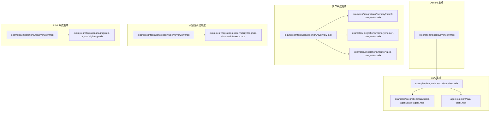
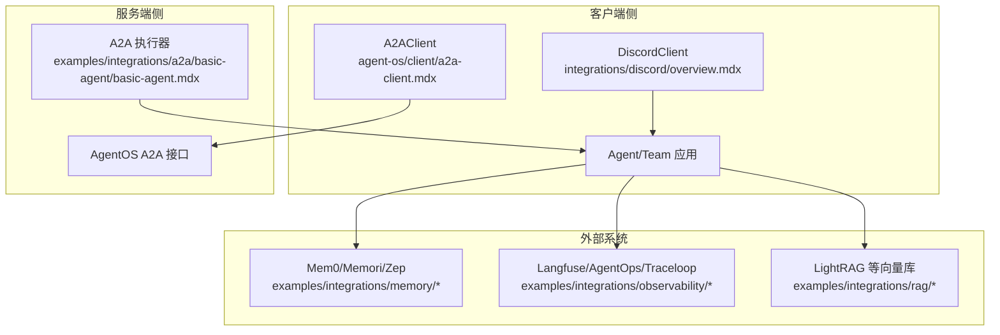
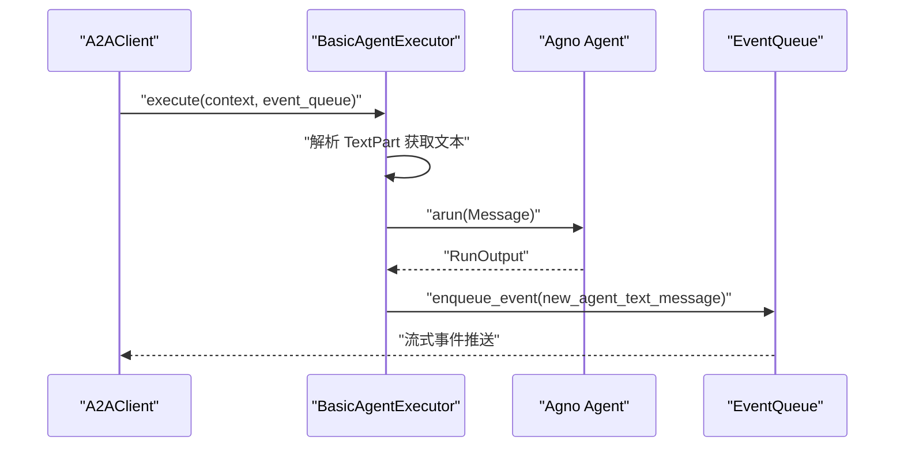
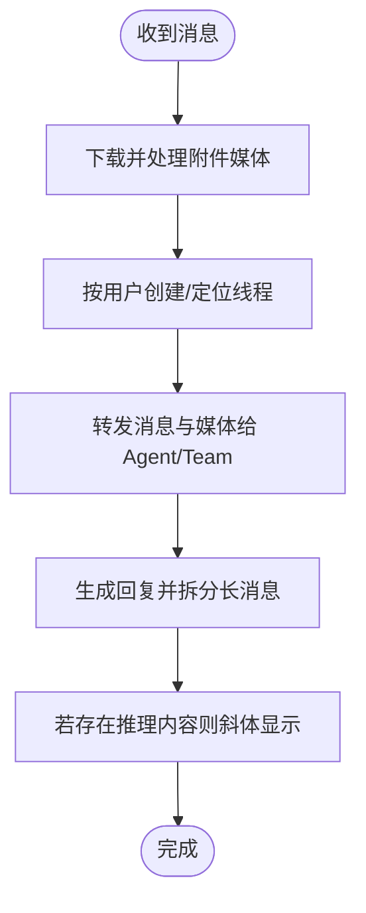
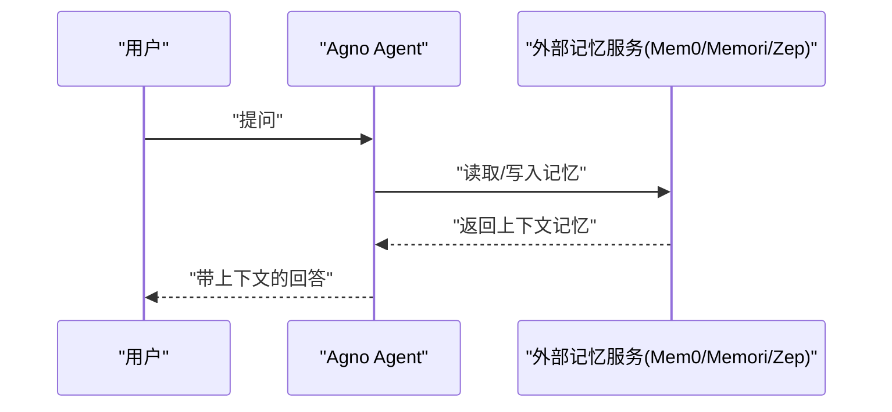
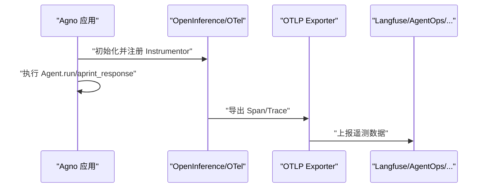
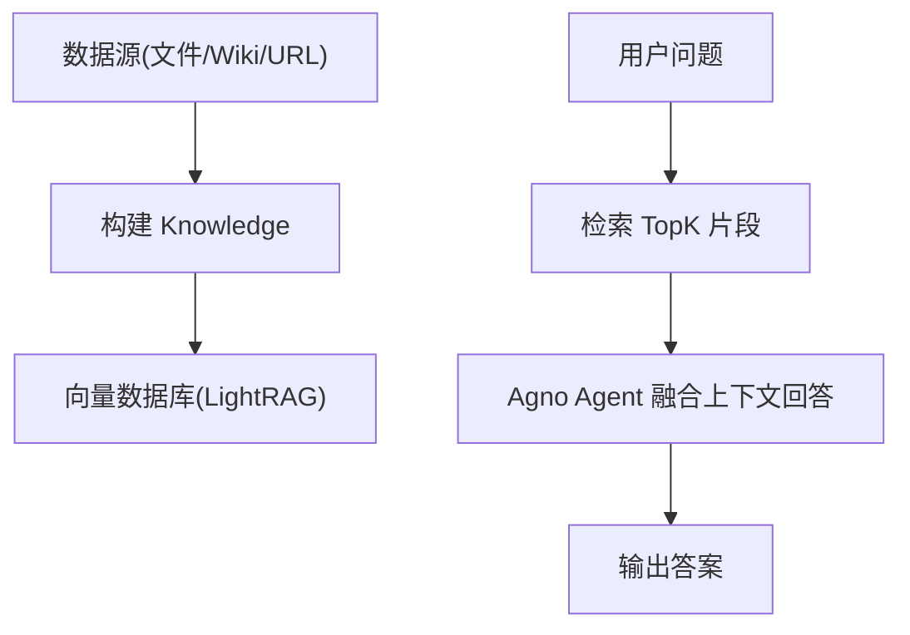
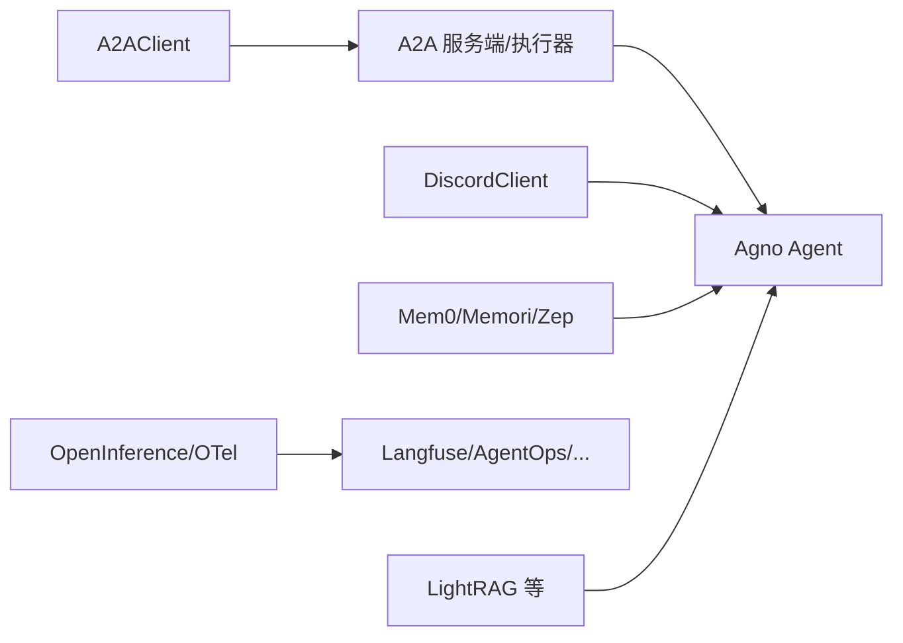

# 集成示例

<cite>
**本文引用的文件**
- [integrations/discord/overview.mdx](file://integrations/discord/overview.mdx)
- [examples/integrations/a2a/overview.mdx](file://examples/integrations/a2a/overview.mdx)
- [examples/integrations/a2a/basic-agent/basic-agent.mdx](file://examples/integrations/a2a/basic-agent/basic-agent.mdx)
- [agent-os/client/a2a-client.mdx](file://agent-os/client/a2a-client.mdx)
- [examples/integrations/memory/overview.mdx](file://examples/integrations/memory/overview.mdx)
- [examples/integrations/memory/mem0-integration.mdx](file://examples/integrations/memory/mem0-integration.mdx)
- [examples/integrations/memory/memori-integration.mdx](file://examples/integrations/memory/memori-integration.mdx)
- [examples/integrations/memory/zep-integration.mdx](file://examples/integrations/memory/zep-integration.mdx)
- [examples/integrations/observability/overview.mdx](file://examples/integrations/observability/overview.mdx)
- [examples/integrations/observability/langfuse-via-openinference.mdx](file://examples/integrations/observability/langfuse-via-openinference.mdx)
- [examples/integrations/rag/overview.mdx](file://examples/integrations/rag/overview.mdx)
- [examples/integrations/rag/agentic-rag-with-lightrag.mdx](file://examples/integrations/rag/agentic-rag-with-lightrag.mdx)
</cite>

## 目录
1. [简介](#简介)
2. [项目结构](#项目结构)
3. [核心组件](#核心组件)
4. [架构总览](#架构总览)
5. [详细组件分析](#详细组件分析)
6. [依赖关系分析](#依赖关系分析)
7. [性能考虑](#性能考虑)
8. [故障排查指南](#故障排查指南)
9. [结论](#结论)
10. [附录](#附录)

## 简介
本章节面向需要将 Agno 框架与外部系统或平台进行集成的开发者，系统化介绍以下五类集成场景：A2A 通信协议、Discord 机器人、内存系统（Mem0/Memori/Zep）、观察性系统（Langfuse/OpenInference 等）以及 RAG 系统（LightRAG）。内容覆盖认证设置、数据同步、事件处理、错误恢复等关键环节，并提供可直接参考的示例路径与最佳实践，帮助在企业系统与第三方服务中实现稳定、可观测且可扩展的集成。

## 项目结构
围绕“集成示例”的相关文档主要分布在如下位置：
- 集成概览与使用说明：examples/integrations/*
- 平台接口与客户端：agent-os/client/*、integrations/discord/*
- 观察性与追踪：examples/integrations/observability/*
- 记忆与知识库：examples/integrations/memory/*、examples/integrations/rag/*

下图给出与“集成示例”相关的文档与示例文件的关系概览：

图表来源
- [examples/integrations/a2a/overview.mdx:1-9](file://examples/integrations/a2a/overview.mdx#L1-L9)
- [examples/integrations/a2a/basic-agent/basic-agent.mdx:1-80](file://examples/integrations/a2a/basic-agent/basic-agent.mdx#L1-L80)
- [agent-os/client/a2a-client.mdx:1-62](file://agent-os/client/a2a-client.mdx#L1-L62)
- [integrations/discord/overview.mdx:1-119](file://integrations/discord/overview.mdx#L1-L119)
- [examples/integrations/memory/overview.mdx:1-11](file://examples/integrations/memory/overview.mdx#L1-L11)
- [examples/integrations/memory/mem0-integration.mdx:1-74](file://examples/integrations/memory/mem0-integration.mdx#L1-L74)
- [examples/integrations/memory/memori-integration.mdx:1-88](file://examples/integrations/memory/memori-integration.mdx#L1-L88)
- [examples/integrations/memory/zep-integration.mdx:1-64](file://examples/integrations/memory/zep-integration.mdx#L1-L64)
- [examples/integrations/observability/overview.mdx:1-27](file://examples/integrations/observability/overview.mdx#L1-L27)
- [examples/integrations/observability/langfuse-via-openinference.mdx:1-91](file://examples/integrations/observability/langfuse-via-openinference.mdx#L1-L91)
- [examples/integrations/rag/overview.mdx:1-11](file://examples/integrations/rag/overview.mdx#L1-L11)
- [examples/integrations/rag/agentic-rag-with-lightrag.mdx:1-94](file://examples/integrations/rag/agentic-rag-with-lightrag.mdx#L1-L94)

章节来源
- [examples/integrations/a2a/overview.mdx:1-9](file://examples/integrations/a2a/overview.mdx#L1-L9)
- [examples/integrations/memory/overview.mdx:1-11](file://examples/integrations/memory/overview.mdx#L1-L11)
- [examples/integrations/observability/overview.mdx:1-27](file://examples/integrations/observability/overview.mdx#L1-L27)
- [examples/integrations/rag/overview.mdx:1-11](file://examples/integrations/rag/overview.mdx#L1-L11)

## 核心组件
- A2A 客户端与执行器：通过 A2A 协议连接到兼容的服务端，支持消息发送、流式响应与取消控制；示例展示了自定义 AgentExecutor 的实现方式。
- Discord 客户端：基于 discord.py 封装，自动处理消息、媒体、线程与长文本拆分等事件。
- 内存系统：支持 Mem0、Memori、Zep 等外部记忆服务，实现对话历史与上下文持久化。
- 观察性系统：通过 OpenInference/OpenTelemetry 将模型调用与代理行为注入到 Langfuse、AgentOps、Traceloop 等平台。
- RAG 系统：以 LightRAG 为例，展示知识入库、检索与问答流程。

章节来源
- [agent-os/client/a2a-client.mdx:1-62](file://agent-os/client/a2a-client.mdx#L1-L62)
- [examples/integrations/a2a/basic-agent/basic-agent.mdx:32-57](file://examples/integrations/a2a/basic-agent/basic-agent.mdx#L32-L57)
- [integrations/discord/overview.mdx:35-119](file://integrations/discord/overview.mdx#L35-L119)
- [examples/integrations/memory/mem0-integration.mdx:13-60](file://examples/integrations/memory/mem0-integration.mdx#L13-L60)
- [examples/integrations/memory/memori-integration.mdx:13-71](file://examples/integrations/memory/memori-integration.mdx#L13-L71)
- [examples/integrations/memory/zep-integration.mdx:13-50](file://examples/integrations/memory/zep-integration.mdx#L13-L50)
- [examples/integrations/observability/langfuse-via-openinference.mdx:13-71](file://examples/integrations/observability/langfuse-via-openinference.mdx#L13-L71)
- [examples/integrations/rag/agentic-rag-with-lightrag.mdx:13-77](file://examples/integrations/rag/agentic-rag-with-lightrag.mdx#L13-L77)

## 架构总览
下图展示从客户端到服务端、再到第三方平台的整体链路，涵盖 A2A、Discord、内存与观察性系统以及 RAG 管线。

图表来源
- [agent-os/client/a2a-client.mdx:17-30](file://agent-os/client/a2a-client.mdx#L17-L30)
- [examples/integrations/a2a/basic-agent/basic-agent.mdx:32-57](file://examples/integrations/a2a/basic-agent/basic-agent.mdx#L32-L57)
- [integrations/discord/overview.mdx:15-33](file://integrations/discord/overview.mdx#L15-L33)
- [examples/integrations/memory/overview.mdx:6-11](file://examples/integrations/memory/overview.mdx#L6-L11)
- [examples/integrations/observability/overview.mdx:6-27](file://examples/integrations/observability/overview.mdx#L6-L27)
- [examples/integrations/rag/overview.mdx:6-11](file://examples/integrations/rag/overview.mdx#L6-L11)

## 详细组件分析

### A2A 通信协议集成
- 连接与消息发送：A2AClient 提供统一接口连接任意 A2A 兼容服务端，支持 JSON-RPC 与二进制模式；可发送消息并接收流式事件。
- 自定义执行器：示例展示了如何实现 AgentExecutor，解析传入消息的文本部分，调用 Agno Agent 执行，并通过 EventQueue 回传结果。
- 取消与错误处理：示例中取消逻辑抛出异常，建议在生产环境实现优雅取消与重试策略。

图表来源
- [agent-os/client/a2a-client.mdx:17-30](file://agent-os/client/a2a-client.mdx#L17-L30)
- [examples/integrations/a2a/basic-agent/basic-agent.mdx:32-57](file://examples/integrations/a2a/basic-agent/basic-agent.mdx#L32-L57)

章节来源
- [agent-os/client/a2a-client.mdx:1-62](file://agent-os/client/a2a-client.mdx#L1-L62)
- [examples/integrations/a2a/basic-agent/basic-agent.mdx:1-80](file://examples/integrations/a2a/basic-agent/basic-agent.mdx#L1-L80)
- [examples/integrations/a2a/overview.mdx:1-9](file://examples/integrations/a2a/overview.mdx#L1-L9)

最佳实践
- 使用流式事件处理长响应，避免阻塞。
- 在执行器中对不可识别的 Part 类型进行降级处理，保证健壮性。
- 对取消操作实现幂等与资源回收。

### Discord 机器人集成
- 功能特性：自动线程创建、媒体下载与转发、长消息拆分、推理内容斜体显示、批量编号提示。
- 事件处理：自动处理消息事件，支持图片、视频、音频与文件类型；将用户名与消息链接加入上下文。
- 配置要求：设置 DISCORD_BOT_TOKEN 环境变量；邀请机器人至服务器后，在其有权限的频道中发送消息即可触发。

图表来源
- [integrations/discord/overview.mdx:82-92](file://integrations/discord/overview.mdx#L82-L92)

章节来源
- [integrations/discord/overview.mdx:1-119](file://integrations/discord/overview.mdx#L1-L119)

最佳实践
- 对超长消息采用分片编号提示，提升阅读体验。
- 在线程中维护上下文，避免重复信息。
- 对媒体类型进行白名单校验，防止恶意附件。

### 内存系统集成
- Mem0：通过 MemoryClient 注入依赖，将用户历史写入外部存储并在上下文中使用。
- Memori：结合 SQLAlchemy 会话与 LLM 客户端注册，实现会话级记忆持久化与溯源。
- Zep：通过 ZepTools 写入与检索记忆，支持上下文类型的记忆依赖注入。

图表来源
- [examples/integrations/memory/mem0-integration.mdx:28-60](file://examples/integrations/memory/mem0-integration.mdx#L28-L60)
- [examples/integrations/memory/memori-integration.mdx:34-71](file://examples/integrations/memory/memori-integration.mdx#L34-L71)
- [examples/integrations/memory/zep-integration.mdx:23-50](file://examples/integrations/memory/zep-integration.mdx#L23-L50)

章节来源
- [examples/integrations/memory/overview.mdx:1-11](file://examples/integrations/memory/overview.mdx#L1-L11)
- [examples/integrations/memory/mem0-integration.mdx:1-74](file://examples/integrations/memory/mem0-integration.mdx#L1-L74)
- [examples/integrations/memory/memori-integration.mdx:1-88](file://examples/integrations/memory/memori-integration.mdx#L1-L88)
- [examples/integrations/memory/zep-integration.mdx:1-64](file://examples/integrations/memory/zep-integration.mdx#L1-L64)

最佳实践
- 写入记忆后进行去重与敏感信息过滤。
- 对多轮对话使用会话 ID 组织记忆，避免跨会话污染。
- 定期清理过期记忆，控制存储成本。

### 观察性系统集成
- 通过 OpenInference/OpenTelemetry 将模型调用与代理行为注入到 Langfuse、AgentOps、Traceloop 等平台。
- 示例展示了如何配置 OTLP 导出器、认证头与区域端点，启动 Instrumentor 后即可采集追踪数据。

图表来源
- [examples/integrations/observability/langfuse-via-openinference.mdx:28-46](file://examples/integrations/observability/langfuse-via-openinference.mdx#L28-L46)

章节来源
- [examples/integrations/observability/overview.mdx:1-27](file://examples/integrations/observability/overview.mdx#L1-L27)
- [examples/integrations/observability/langfuse-via-openinference.mdx:1-91](file://examples/integrations/observability/langfuse-via-openinference.mdx#L1-L91)

最佳实践
- 明确区分公共/私有密钥与区域端点，避免泄露。
- 为不同 Agent/Team 设置独立的项目或资源标识，便于聚合分析。
- 在生产环境启用采样率与批处理，平衡性能与可观测性。

### RAG 系统集成
- 以 LightRAG 为例，展示知识库构建、向量化与检索问答的完整流程。
- 支持多种数据源（本地文件、Wikipedia、URL），并可与 Agno Agent 结合实现“代理式 RAG”。

图表来源
- [examples/integrations/rag/agentic-rag-with-lightrag.mdx:24-77](file://examples/integrations/rag/agentic-rag-with-lightrag.mdx#L24-L77)

章节来源
- [examples/integrations/rag/overview.mdx:1-11](file://examples/integrations/rag/overview.mdx#L1-L11)
- [examples/integrations/rag/agentic-rag-with-lightrag.mdx:1-94](file://examples/integrations/rag/agentic-rag-with-lightrag.mdx#L1-L94)

最佳实践
- 对大文档进行分块与元数据标注，提升检索质量。
- 在检索前进行查询改写与重排，优化命中率。
- 对检索结果进行去重与上下文裁剪，减少噪声。

## 依赖关系分析
- A2A 客户端依赖 A2A 协议与服务端实现；示例执行器依赖 Agno Agent 的异步运行接口。
- Discord 集成依赖 discord.py 与 Agno Agent/Team 的消息处理能力。
- 内存系统依赖第三方 SDK（如 mem0ai、memori、zep），并与 Agno 的依赖注入机制配合。
- 观察性系统依赖 OpenInference/OpenTelemetry 与第三方平台的 OTLP 端点。
- RAG 系统依赖向量数据库 SDK（如 LightRAG）与 Agno 的知识模块。

图表来源
- [agent-os/client/a2a-client.mdx:17-30](file://agent-os/client/a2a-client.mdx#L17-L30)
- [examples/integrations/a2a/basic-agent/basic-agent.mdx:32-57](file://examples/integrations/a2a/basic-agent/basic-agent.mdx#L32-L57)
- [integrations/discord/overview.mdx:15-33](file://integrations/discord/overview.mdx#L15-L33)
- [examples/integrations/memory/overview.mdx:6-11](file://examples/integrations/memory/overview.mdx#L6-L11)
- [examples/integrations/observability/overview.mdx:6-27](file://examples/integrations/observability/overview.mdx#L6-L27)
- [examples/integrations/rag/overview.mdx:6-11](file://examples/integrations/rag/overview.mdx#L6-L11)

章节来源
- [examples/integrations/a2a/overview.mdx:1-9](file://examples/integrations/a2a/overview.mdx#L1-L9)
- [examples/integrations/memory/overview.mdx:1-11](file://examples/integrations/memory/overview.mdx#L1-L11)
- [examples/integrations/observability/overview.mdx:1-27](file://examples/integrations/observability/overview.mdx#L1-L27)
- [examples/integrations/rag/overview.mdx:1-11](file://examples/integrations/rag/overview.mdx#L1-L11)

## 性能考虑
- 流式传输：A2A 与 Discord 均支持流式事件/消息，降低首字节延迟。
- 媒体处理：对视频/音频先下载再处理，建议限制大小与格式白名单，避免资源耗尽。
- 记忆同步：外部记忆服务写入后需等待同步窗口，示例中使用了短暂休眠；生产环境应引入重试与幂等写入。
- 观测开销：在高并发场景下合理设置采样率与批处理大小，避免观测系统成为瓶颈。
- RAG 检索：TopK 与维度选择影响延迟与准确率，建议结合业务场景调优。

## 故障排查指南
- A2A 连接失败
  - 检查服务端地址与协议（JSON-RPC 或二进制）是否一致。
  - 确认网络连通性与鉴权头配置。
  - 参考：[agent-os/client/a2a-client.mdx:17-41](file://agent-os/client/a2a-client.mdx#L17-L41)
- Discord 无响应
  - 确认机器人已加入服务器且具备相应频道权限。
  - 检查 DISCORD_BOT_TOKEN 是否正确。
  - 参考：[integrations/discord/overview.mdx:74-81](file://integrations/discord/overview.mdx#L74-L81)
- 外部记忆未生效
  - 确认写入成功后再读取；检查用户 ID/会话 ID 是否一致。
  - 参考：[examples/integrations/memory/mem0-integration.mdx:37-60](file://examples/integrations/memory/mem0-integration.mdx#L37-L60)
- 观测数据缺失
  - 检查 OTLP 端点、认证头与网络策略。
  - 参考：[examples/integrations/observability/langfuse-via-openinference.mdx:28-46](file://examples/integrations/observability/langfuse-via-openinference.mdx#L28-L46)
- RAG 检索效果差
  - 调整分块策略、查询改写与重排算法。
  - 参考：[examples/integrations/rag/agentic-rag-with-lightrag.mdx:24-77](file://examples/integrations/rag/agentic-rag-with-lightrag.mdx#L24-L77)

章节来源
- [agent-os/client/a2a-client.mdx:1-62](file://agent-os/client/a2a-client.mdx#L1-L62)
- [integrations/discord/overview.mdx:74-119](file://integrations/discord/overview.mdx#L74-L119)
- [examples/integrations/memory/mem0-integration.mdx:1-74](file://examples/integrations/memory/mem0-integration.mdx#L1-L74)
- [examples/integrations/observability/langfuse-via-openinference.mdx:1-91](file://examples/integrations/observability/langfuse-via-openinference.mdx#L1-L91)
- [examples/integrations/rag/agentic-rag-with-lightrag.mdx:1-94](file://examples/integrations/rag/agentic-rag-with-lightrag.mdx#L1-L94)

## 结论
通过上述五类集成示例，Agno 可以与企业内部系统及外部平台实现稳定、可观测与可扩展的连接。建议在生产环境中遵循本文的最佳实践，关注认证安全、数据一致性、性能与可观测性，并针对具体场景进行参数与策略调优。

## 附录
- 快速开始示例路径
  - A2A：[examples/integrations/a2a/basic-agent/basic-agent.mdx:62-79](file://examples/integrations/a2a/basic-agent/basic-agent.mdx#L62-L79)
  - Discord：[integrations/discord/overview.mdx:13-33](file://integrations/discord/overview.mdx#L13-L33)
  - 内存：Mem0/Memori/Zep 示例分别见对应文件
  - 观察性：Langfuse 示例见 [examples/integrations/observability/langfuse-via-openinference.mdx:69-90](file://examples/integrations/observability/langfuse-via-openinference.mdx#L69-L90)
  - RAG：LightRAG 示例见 [examples/integrations/rag/agentic-rag-with-lightrag.mdx:79-93](file://examples/integrations/rag/agentic-rag-with-lightrag.mdx#L79-L93)