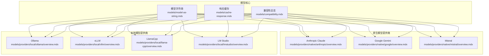
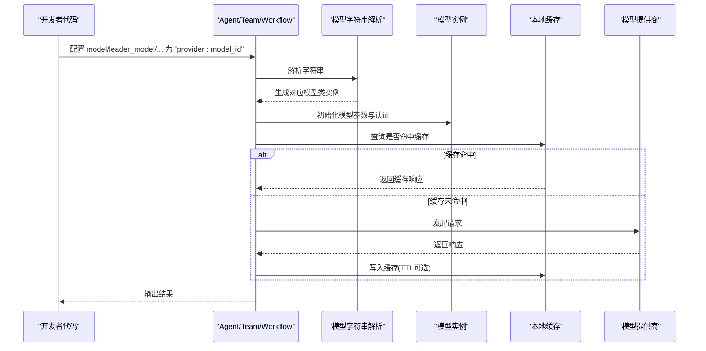
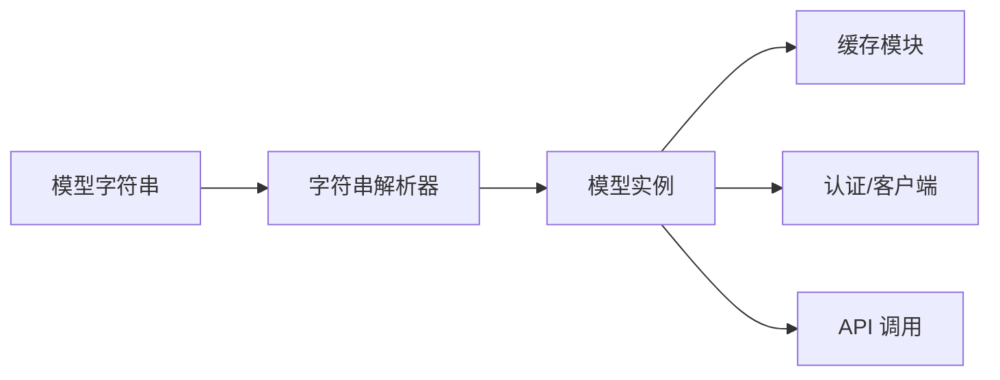

# 模型示例

<cite>
**本文引用的文件**
- [模型字符串](file://models/model-as-string.mdx)
- [响应缓存](file://models/cache-response.mdx)
- [兼容性总览](file://models/compatibility.mdx)
- [Anthropic Claude 总览](file://models/providers/native/anthropic/overview.mdx)
- [Google Gemini 总览](file://models/providers/native/google/overview.mdx)
- [Mistral 总览](file://models/providers/native/mistral/overview.mdx)
- [Ollama 总览](file://models/providers/local/ollama/overview.mdx)
- [vLLM 总览](file://models/providers/local/vllm/overview.mdx)
- [LlamaCpp 总览](file://models/providers/local/llama-cpp/overview.mdx)
- [LM Studio 总览](file://models/providers/local/lmstudio/overview.mdx)
</cite>

## 目录
1. [简介](#简介)
2. [项目结构](#项目结构)
3. [核心组件](#核心组件)
4. [架构总览](#架构总览)
5. [详细组件分析](#详细组件分析)
6. [依赖关系分析](#依赖关系分析)
7. [性能考量](#性能考量)
8. [故障排查指南](#故障排查指南)
9. [结论](#结论)
10. [附录](#附录)

## 简介
本章节面向需要在代理、团队与工作流中集成与使用多种模型提供商的用户，系统化介绍 40+ 模型提供商的接入方式与最佳实践，覆盖原生云厂商模型（如 OpenAI、Anthropic、Google、Groq、Mistral 等）以及本地推理模型（如 Ollama、LlamaCpp、LM Studio、VLLM）。内容包括：
- 模型字符串配置与多模型角色分工
- 认证配置、调用示例与错误处理策略
- 响应缓存机制与成本优化
- 兼容性矩阵与功能对比
- 在代理、团队与工作流中的集成模式

## 项目结构
围绕“模型”主题，相关文档主要分布在以下路径：
- 核心概念：模型字符串、响应缓存、兼容性总览
- 提供商分类：native（原生）、local（本地）、cloud（云托管）
- 各提供商总览与用法示例：Anthropic、Google、Mistral、Ollama、vLLM、LlamaCpp、LM Studio

图表来源
- [模型字符串:1-122](file://models/model-as-string.mdx#L1-L122)
- [响应缓存:1-183](file://models/cache-response.mdx#L1-L183)
- [兼容性总览:1-92](file://models/compatibility.mdx#L1-L92)
- [Anthropic Claude 总览:1-150](file://models/providers/native/anthropic/overview.mdx#L1-L150)
- [Google Gemini 总览:1-469](file://models/providers/native/google/overview.mdx#L1-L469)
- [Mistral 总览:1-77](file://models/providers/native/mistral/overview.mdx#L1-L77)
- [Ollama 总览:1-153](file://models/providers/local/ollama/overview.mdx#L1-L153)
- [vLLM 总览:1-87](file://models/providers/local/vllm/overview.mdx#L1-L87)
- [LlamaCpp 总览:1-198](file://models/providers/local/llama-cpp/overview.mdx#L1-L198)
- [LM Studio 总览:1-58](file://models/providers/local/lmstudio/overview.mdx#L1-L58)

章节来源
- [模型字符串:1-122](file://models/model-as-string.mdx#L1-L122)
- [响应缓存:1-183](file://models/cache-response.mdx#L1-L183)
- [兼容性总览:1-92](file://models/compatibility.mdx#L1-L92)

## 核心组件
- 模型字符串语法：通过“provider:model_id”的便捷字符串指定模型，无需导入具体类，即可在 Agent/Team 中直接使用。
- 多模型角色分工：支持为通用回复、推理、结构化解析、最终输出分别配置不同模型，提升任务适配性与稳定性。
- 响应缓存：在开发与测试阶段缓存模型响应，减少重复调用与成本；可配置 TTL 与缓存目录，支持流式与非流式场景。
- 兼容性矩阵：统一列出各提供商对流式、工具调用、结构化输出、异步执行等能力的支持情况。

章节来源
- [模型字符串:16-122](file://models/model-as-string.mdx#L16-L122)
- [响应缓存:35-183](file://models/cache-response.mdx#L35-L183)
- [兼容性总览:10-92](file://models/compatibility.mdx#L10-L92)

## 架构总览
下图展示了“模型字符串 → 模型实例 → Agent/Team/Workflow”的典型调用链路，以及缓存与认证的关键节点。

图表来源
- [模型字符串:35-98](file://models/model-as-string.mdx#L35-L98)
- [响应缓存:35-101](file://models/cache-response.mdx#L35-L101)

## 详细组件分析

### 模型字符串与多模型角色
- 字符串格式与示例：支持 openai、anthropic、google、groq、ollama、mistral、litellm、openrouter、together 等常见提供商。
- 在 Agent/Team 中使用：既可作为主模型，也可为推理、解析、输出分别指定不同模型，确保复杂任务的稳定与高效。
- 与对象语法等价：字符串与显式类实例在功能上完全一致，便于按需切换。

章节来源
- [模型字符串:16-122](file://models/model-as-string.mdx#L16-L122)

### 响应缓存机制
- 工作原理：基于请求参数生成唯一键，命中则返回缓存，未命中则调用 API 并写入缓存；默认持久化到磁盘，支持 TTL 过期。
- 使用方式：在模型初始化时开启缓存并设置 TTL 与缓存目录；适用于 Agent/Team 成员与团队领导模型。
- 流式与非流式：均支持缓存，命中时以一次性完整块返回流式结果。

章节来源
- [响应缓存:35-183](file://models/cache-response.mdx#L35-L183)

### 兼容性总览
- 统一能力：所有模型普遍支持流式、工具调用、结构化输出、异步执行。
- 多模态支持：列举各提供商对图像/视频/音频输入与文件上传的支持情况。
- 特殊说明：部分提供商在特定能力上存在限制或差异，例如 HuggingFace 的工具调用不支持流式、Perplexity 的工具调用可靠性较低、Vercel V0 不支持原生结构化输出但支持 JSON 模式。

章节来源
- [兼容性总览:10-92](file://models/compatibility.mdx#L10-L92)

### 原生模型提供商

#### Anthropic Claude
- 推荐模型与用途：根据任务选择不同代次与能力的 Claude 模型；注意请求需携带 max_tokens 参数。
- 认证：通过环境变量配置 API Key。
- 能力要点：支持提示词缓存、结构化输出（新模型）、Beta 功能开关、思考参数等。
- 参数概览：包含 id、max_tokens、thinking、温度/采样参数、系统提示缓存、客户端与自定义请求参数等。

章节来源
- [Anthropic Claude 总览:10-150](file://models/providers/native/anthropic/overview.mdx#L10-L150)

#### Google Gemini
- 推荐模型与用途：提供多款模型的适用场景与能力对比。
- 认证方式：支持 Google AI Studio（API Key）与 Vertex AI（服务账号/凭证）两种方式。
- 能力亮点：多模态输入/输出、实时搜索/知识检索、文件搜索、语音合成、思维模型、上下文缓存、URL 上下文等。
- 参数概览：包含 id、vertexai、项目与区域、温度/采样、最大输出 token、搜索/接地开关、响应模态、语音配置、思维预算/级别、缓存内容、安全设置、函数声明、生成配置等。

章节来源
- [Google Gemini 总览:10-469](file://models/providers/native/google/overview.mdx#L10-L469)

#### Mistral
- 推荐模型与用途：针对代码生成、通用任务、免费模型与视觉任务给出推荐。
- 认证：通过环境变量配置 API Key。
- 示例与参数：提供基础示例与常用参数说明，便于快速集成。

章节来源
- [Mistral 总览:10-77](file://models/providers/native/mistral/overview.mdx#L10-L77)

### 本地模型提供商

#### Ollama
- 使用方式：支持本地与 Ollama Cloud 两种部署形态；Cloud 需要 API Key，本地无需 Key。
- 认证：Cloud 场景配置 API Key；本地无需 Key。
- 参数概览：包含 id、host、超时、返回格式、模型选项、保活时间、模板、系统消息、原始返回、流式等。
- Responses API：支持 OpenAI 兼容的 Responses 接口，适合无状态对话场景。

章节来源
- [Ollama 总览:10-153](file://models/providers/local/ollama/overview.mdx#L10-L153)

#### vLLM
- 前置条件：安装 vLLM 并启动 OpenAI 兼容的服务端；默认服务地址为本地端口。
- 示例：Agent 直接使用 vLLM 模型 ID 与 base_url 即可发起调用。
- 工具集成：与 Agno 工具无缝协作，支持自动工具选择与解析器。

章节来源
- [vLLM 总览:8-87](file://models/providers/local/vllm/overview.mdx#L8-L87)

#### LlamaCpp
- 前置条件：编译并启动 llama-server，提供 OpenAI 兼容接口；默认监听本地端口。
- 示例：Agent 使用 LlamaCpp 类并指定模型 ID 与 base_url。
- 参数与服务器配置：涵盖模型 ID、服务器地址、采样参数、上下文窗口等；服务器支持多类加速后端与量化模型。

章节来源
- [LlamaCpp 总览:37-198](file://models/providers/local/llama-cpp/overview.mdx#L37-L198)

#### LM Studio
- 前置条件：在本地安装并运行 LM Studio，加载目标模型。
- 示例：Agent 使用 LM Studio 类并指定模型 ID 与 base_url。
- 参数：包含 id、provider、base_url 等。

章节来源
- [LM Studio 总览:20-58](file://models/providers/local/lmstudio/overview.mdx#L20-L58)

### 模型选择指南与成本优化
- 模型选择建议
  - 通用任务：优先选择具备多模态与较强推理能力的模型；如 Gemini 的 2.0 Flash/Flash-Lite 或 Claude 的 Sonnet。
  - 代码任务：Mistral 的 Codestral 或 Gemini 的代码理解能力更强。
  - 本地推理：Ollama、vLLM、LlamaCpp、LM Studio 可满足离线与低延迟需求，结合硬件选择合适的量化与加速方案。
- 成本优化
  - 开发测试阶段启用响应缓存，显著降低重复调用成本。
  - 对高频查询使用合理的 TTL，避免过期缓存影响时效性。
  - 选择合适模型：在满足质量的前提下，优先选择更小/更快的模型以降低成本。
- 错误处理策略
  - 对于速率限制与网络波动，建议在应用层增加重试与退避策略，并区分幂等与非幂等操作。
  - 对于工具调用失败，记录调用上下文与返回信息，便于定位问题。

（本节为通用指导，不直接分析具体文件）

## 依赖关系分析
- 字符串到实例映射：模型字符串解析模块负责将“provider:model_id”映射为具体模型类实例，贯穿 Agent/Team/Workflow 生命周期。
- 缓存依赖：模型实例在调用前检查缓存命中，缓存模块与模型实例解耦，便于跨提供商复用。
- 认证与客户端：各提供商独立管理认证与客户端实例，Agent/Team 仅需传入必要的密钥与参数。

图表来源
- [模型字符串:35-98](file://models/model-as-string.mdx#L35-L98)
- [响应缓存:35-101](file://models/cache-response.mdx#L35-L101)

章节来源
- [模型字符串:35-98](file://models/model-as-string.mdx#L35-L98)
- [响应缓存:35-101](file://models/cache-response.mdx#L35-L101)

## 性能考量
- 本地推理
  - 选择合适的量化与加速后端（如 CUDA/Metal/OpenCL），平衡速度与质量。
  - 合理设置上下文长度与批大小，避免内存不足导致的性能下降。
- 云端模型
  - 关注提供商的速率限制与配额，必要时进行限流与排队。
  - 利用结构化输出与提示词缓存减少无效调用。
- 缓存策略
  - 针对开发与测试场景启用缓存；生产环境谨慎使用，避免返回陈旧信息。

（本节为通用指导，不直接分析具体文件）

## 故障排查指南
- 认证失败
  - 检查环境变量是否正确设置；确认 API Key 有效且具有相应权限。
- 请求超时/连接失败
  - 校验本地服务地址与端口；确认防火墙与网络策略允许访问。
- 工具调用异常
  - 查看工具声明与模型支持能力；对不支持工具调用的提供商采用替代方案。
- 缓存问题
  - 检查缓存目录权限与磁盘空间；调整 TTL 以避免过期或命中率过低。

章节来源
- [Anthropic Claude 总览:24-38](file://models/providers/native/anthropic/overview.mdx#L24-L38)
- [Google Gemini 总览:29-87](file://models/providers/native/google/overview.mdx#L29-L87)
- [Mistral 总览:19-33](file://models/providers/native/mistral/overview.mdx#L19-L33)
- [Ollama 总览:25-41](file://models/providers/local/ollama/overview.mdx#L25-L41)
- [vLLM 总览:29-51](file://models/providers/local/vllm/overview.mdx#L29-L51)
- [LlamaCpp 总览:177-198](file://models/providers/local/llama-cpp/overview.mdx#L177-L198)
- [LM Studio 总览:20-45](file://models/providers/local/lmstudio/overview.mdx#L20-L45)

## 结论
通过模型字符串与统一的模型抽象，Agno 支持在代理、团队与工作流中灵活接入 40+ 模型提供商。结合响应缓存、认证配置与兼容性矩阵，可在保证功能一致性的同时优化成本与性能。建议在开发阶段充分利用缓存，在生产阶段依据任务特性选择合适模型并建立完善的错误处理与监控体系。

（本节为总结性内容，不直接分析具体文件）

## 附录

### 快速对照表
- 原生模型提供商（示例）：OpenAI、Anthropic、Google、Groq、Mistral、Cohere、Perplexity、Vercel 等
- 本地模型提供商（示例）：Ollama、LlamaCpp、LM Studio、VLLM
- 模型字符串示例：openai:gpt-4o、anthropic:claude-sonnet-4-20250514、google:gemini-2.0-flash-exp、groq:llama-3.3-70b-versatile、ollama:llama3.2、mistral:mistral-large-latest、litellm:gpt-4o、openrouter:anthropic/claude-3.5-sonnet、together:meta-llama/Llama-3-70b-chat-hf

章节来源
- [模型字符串:101-117](file://models/model-as-string.mdx#L101-L117)