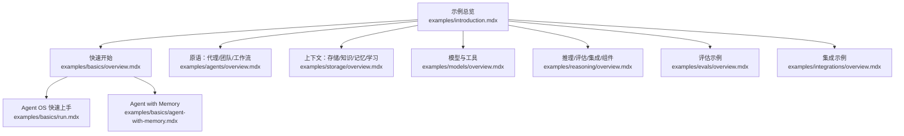
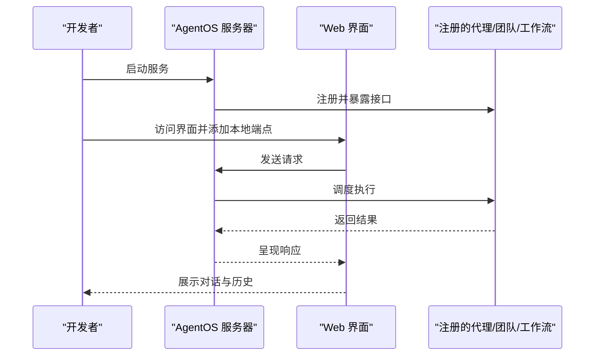
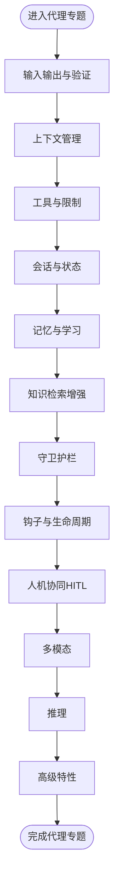
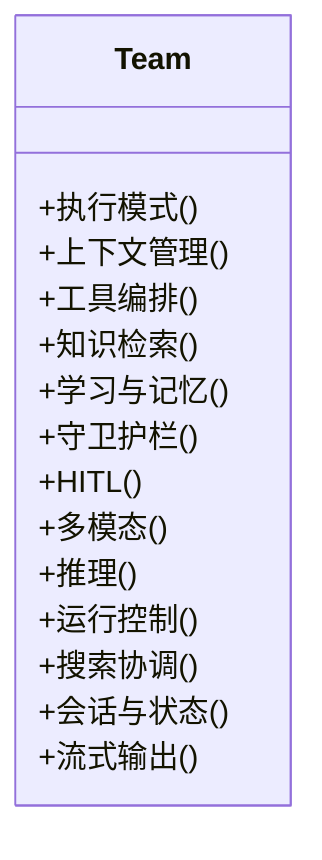
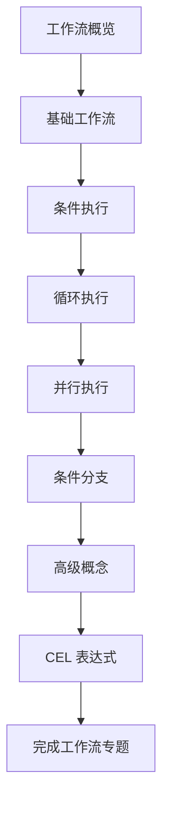
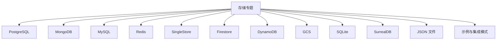
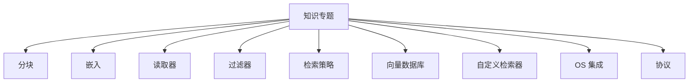
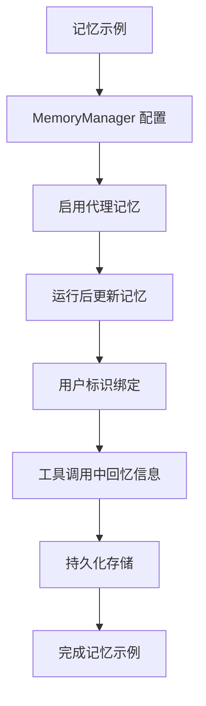
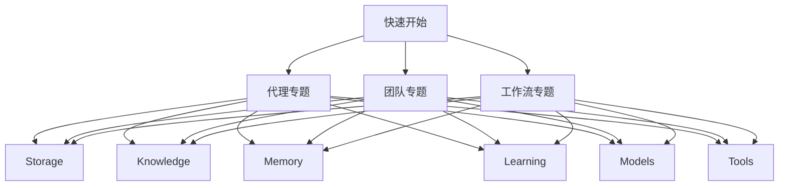

# 示例代码库

<cite>
**本文引用的文件**
- [README.md](file://README.md)
- [examples/introduction.mdx](file://examples/introduction.mdx)
- [examples/basics/overview.mdx](file://examples/basics/overview.mdx)
- [examples/basics/run.mdx](file://examples/basics/run.mdx)
- [examples/basics/agent-with-memory.mdx](file://examples/basics/agent-with-memory.mdx)
- [examples/agents/overview.mdx](file://examples/agents/overview.mdx)
- [examples/teams/overview.mdx](file://examples/teams/overview.mdx)
- [examples/workflows/overview.mdx](file://examples/workflows/overview.mdx)
- [examples/storage/overview.mdx](file://examples/storage/overview.mdx)
- [examples/knowledge/overview.mdx](file://examples/knowledge/overview.mdx)
- [examples/models/overview.mdx](file://examples/models/overview.mdx)
- [examples/tools/overview.mdx](file://examples/tools/overview.mdx)
- [examples/reasoning/overview.mdx](file://examples/reasoning/overview.mdx)
- [examples/evals/overview.mdx](file://examples/evals/overview.mdx)
- [examples/integrations/overview.mdx](file://examples/integrations/overview.mdx)
</cite>

## 目录
1. [简介](#简介)
2. [项目结构](#项目结构)
3. [核心组件](#核心组件)
4. [架构总览](#架构总览)
5. [详细组件分析](#详细组件分析)
6. [依赖关系分析](#依赖关系分析)
7. [性能考量](#性能考量)
8. [故障排查指南](#故障排查指南)
9. [结论](#结论)
10. [附录](#附录)

## 简介
本文件面向示例代码库，系统化梳理 Agno 示例的组织方式与使用路径，覆盖示例分类、难度与应用场景，并重点文档化以下主题：
- 快速开始：从零到一构建基础智能体（Agent）、团队（Team）与工作流（Workflow），并体验 Agent OS 提供的 Web 界面。
- 原语示例：代理、团队、工作流的实现与配置要点。
- 上下文示例：存储、知识、记忆、学习的实际应用与组合使用。
- 模型示例：主流与本地模型提供商的集成与切换。
- 工具示例：内置工具与 MCP 工具集成，以及自定义工具开发。
- 更多示例类别：Agent OS、推理、评估、集成与组件示例。

## 项目结构
示例代码库以“示例总览页 + 多级分类目录”的方式组织，每个分类下包含若干子示例页面，便于按主题检索与学习。示例入口位于 examples/introduction.mdx，快速开始示例位于 examples/basics/overview.mdx；随后是原语（Agents/Teams/Workflows）、上下文（Storage/Knowledge/Memory/Learning）、模型与工具等专题。

图表来源
- [examples/introduction.mdx:1-65](file://examples/introduction.mdx#L1-L65)
- [examples/basics/overview.mdx:1-24](file://examples/basics/overview.mdx#L1-L24)
- [examples/basics/run.mdx:1-109](file://examples/basics/run.mdx#L1-L109)
- [examples/basics/agent-with-memory.mdx:1-180](file://examples/basics/agent-with-memory.mdx#L1-L180)
- [examples/agents/overview.mdx:1-25](file://examples/agents/overview.mdx#L1-L25)
- [examples/storage/overview.mdx:1-24](file://examples/storage/overview.mdx#L1-L24)
- [examples/models/overview.mdx:1-52](file://examples/models/overview.mdx#L1-L52)
- [examples/reasoning/overview.mdx:1-12](file://examples/reasoning/overview.mdx#L1-L12)
- [examples/evals/overview.mdx:1-12](file://examples/evals/overview.mdx#L1-L12)
- [examples/integrations/overview.mdx:1-14](file://examples/integrations/overview.mdx#L1-L14)

章节来源
- [examples/introduction.mdx:1-65](file://examples/introduction.mdx#L1-L65)
- [examples/basics/overview.mdx:1-24](file://examples/basics/overview.mdx#L1-L24)

## 核心组件
- 快速开始示例：从“工具代理”“结构化输出”“类型化输入输出”“存储会话”“记忆偏好”“状态管理”“知识检索”“自学习工具”“守卫护栏”“人机协同（HITL）”“多智能体团队”“顺序工作流”到“Agent OS Web 界面”，循序渐进掌握 Agno 的核心能力。
- 原语示例：代理、团队、工作流三大原语分别覆盖工具调用、多智能体编排、流程编排与条件/并发/循环/CEL 表达式等高级特性。
- 上下文示例：存储支持 PostgreSQL、MongoDB、MySQL、Redis、DynamoDB、GCS、SQLite、SurrealDB 等；知识涵盖分块、嵌入、读取器、过滤器、向量数据库与检索策略；记忆与学习强调跨会话持久化与自适应改进。
- 模型示例：覆盖 40+ 提供商，包括 OpenAI、Anthropic、Google、Groq、Mistral、本地推理（Ollama、vLLM、LMStudio、Llama.cpp）等。
- 工具示例：内置工具覆盖搜索、数据、通信、AI/媒体、开发工具等；MCP 工具集成标准化外部系统交互；自定义工具可结合事件与钩子扩展行为。
- 更多示例类别：Agent OS 运行时与客户端、推理（链式思维）、评估（准确率、性能、可靠性、代理即评判者）、集成（可观测性、RAG、Discord 等平台）、组件（保存/加载代理/团队/工作流）。

章节来源
- [examples/basics/overview.mdx:9-24](file://examples/basics/overview.mdx#L9-L24)
- [examples/agents/overview.mdx:7-25](file://examples/agents/overview.mdx#L7-L25)
- [examples/teams/overview.mdx:7-33](file://examples/teams/overview.mdx#L7-L33)
- [examples/workflows/overview.mdx:6-15](file://examples/workflows/overview.mdx#L6-L15)
- [examples/storage/overview.mdx:6-24](file://examples/storage/overview.mdx#L6-L24)
- [examples/knowledge/overview.mdx:6-21](file://examples/knowledge/overview.mdx#L6-L21)
- [examples/models/overview.mdx:6-52](file://examples/models/overview.mdx#L6-L52)
- [examples/tools/overview.mdx:8-131](file://examples/tools/overview.mdx#L8-L131)
- [examples/reasoning/overview.mdx:6-12](file://examples/reasoning/overview.mdx#L6-L12)
- [examples/evals/overview.mdx:6-12](file://examples/evals/overview.mdx#L6-L12)
- [examples/integrations/overview.mdx:6-14](file://examples/integrations/overview.mdx#L6-L14)

## 架构总览
示例体系以“示例总览页”为中心，向下辐射至各专题目录与具体示例页。示例页通常包含：
- 示例标题与描述
- 所需前置条件与运行步骤
- 关键概念与最佳实践
- 代码片段路径（以源码定位代替直接粘贴）

```mermaid
graph TB
Root["示例总览<br/>examples/introduction.mdx"] --> Basics["快速开始<br/>examples/basics/overview.mdx"]
Root --> Agents["代理专题<br/>examples/agents/overview.mdx"]
Root --> Teams["团队专题<br/>examples/teams/overview.mdx"]
Root --> Workflows["工作流专题<br/>examples/workflows/overview.mdx"]
Root --> Storage["存储专题<br/>examples/storage/overview.mdx"]
Root --> Knowledge["知识专题<br/>examples/knowledge/overview.mdx"]
Root --> Models["模型专题<br/>examples/models/overview.mdx"]
Root --> Tools["工具专题<br/>examples/tools/overview.mdx"]
Root --> Reasoning["推理专题<br/>examples/reasoning/overview.mdx"]
Root --> Evals["评估专题<br/>examples/evals/overview.mdx"]
Root --> Integrations["集成专题<br/>examples/integrations/overview.mdx"]
```

图表来源
- [examples/introduction.mdx:1-65](file://examples/introduction.mdx#L1-L65)
- [examples/basics/overview.mdx:1-24](file://examples/basics/overview.mdx#L1-L24)
- [examples/agents/overview.mdx:1-25](file://examples/agents/overview.mdx#L1-L25)
- [examples/teams/overview.mdx:1-33](file://examples/teams/overview.mdx#L1-L33)
- [examples/workflows/overview.mdx:1-15](file://examples/workflows/overview.mdx#L1-L15)
- [examples/storage/overview.mdx:1-24](file://examples/storage/overview.mdx#L1-L24)
- [examples/knowledge/overview.mdx:1-21](file://examples/knowledge/overview.mdx#L1-L21)
- [examples/models/overview.mdx:1-52](file://examples/models/overview.mdx#L1-L52)
- [examples/tools/overview.mdx:1-131](file://examples/tools/overview.mdx#L1-L131)
- [examples/reasoning/overview.mdx:1-12](file://examples/reasoning/overview.mdx#L1-L12)
- [examples/evals/overview.mdx:1-12](file://examples/evals/overview.mdx#L1-L12)
- [examples/integrations/overview.mdx:1-14](file://examples/integrations/overview.mdx#L1-L14)

## 详细组件分析

### 快速开始：从示例到 Agent OS
- Agent OS Web 界面：通过集中注册多个代理、团队与工作流，提供统一的 Web 交互入口，便于调试、查看会话历史、追踪与管理知识库与记忆。
- 运行步骤：在示例根目录准备环境并启动服务，访问指定地址后添加本地端点即可开始聊天与调试。
- 示例清单：从“工具代理”到“顺序工作流”，逐步引入存储、记忆、状态、知识检索、自学习工具、守卫护栏与人机协同（HITL）。

图表来源
- [examples/basics/run.mdx:69-94](file://examples/basics/run.mdx#L69-L94)

章节来源
- [examples/basics/run.mdx:1-109](file://examples/basics/run.mdx#L1-L109)
- [examples/basics/overview.mdx:9-24](file://examples/basics/overview.mdx#L9-L24)

### 原语示例：代理（Agents）
- 覆盖范围：输入输出格式与验证、上下文管理、工具选择与限制、会话与状态管理、记忆与学习、知识检索增强、守卫护栏、钩子、人机协同（HITL）、多模态、推理、高级特性（缓存、压缩、并发、事件、重试、调试、文化、序列化）与动态依赖注入。
- 学习路径：从基础“工具代理”“结构化输出”“类型化输入输出”“存储会话”“记忆偏好”“状态管理”“知识检索”“自学习工具”“守卫护栏”“HITL”“多智能体团队”“顺序工作流”逐步深入。

图表来源
- [examples/agents/overview.mdx:7-25](file://examples/agents/overview.mdx#L7-L25)

章节来源
- [examples/agents/overview.mdx:1-25](file://examples/agents/overview.mdx#L1-L25)

### 原语示例：团队（Teams）
- 覆盖范围：上下文压缩与管理、依赖、分布式 RAG、守卫护栏、钩子、HITL、知识、学习、记忆、指标、模式（四种执行模式）、多模态、其他模式、推理、运行控制、搜索协调、会话、状态、流式、结构化输入输出、任务模式、工具等。
- 执行模式：团队领导如何协调成员代理，支持任务驱动的自主执行。

图表来源
- [examples/teams/overview.mdx:7-33](file://examples/teams/overview.mdx#L7-L33)

章节来源
- [examples/teams/overview.mdx:1-33](file://examples/teams/overview.mdx#L1-L33)

### 原语示例：工作流（Workflows）
- 覆盖范围：基础工作流、条件执行、循环执行、并行执行、条件分支、高级概念、CEL 表达式。
- 典型场景：将代理、团队与函数按顺序、条件或并行方式编排，实现复杂业务流程。

图表来源
- [examples/workflows/overview.mdx:6-15](file://examples/workflows/overview.mdx#L6-L15)

章节来源
- [examples/workflows/overview.mdx:1-15](file://examples/workflows/overview.mdx#L1-L15)

### 上下文示例：存储（Storage）
- 支持数据库与云存储：PostgreSQL、MongoDB、MySQL、Redis、SingleStore、Firestore、DynamoDB、GCS、SQLite、SurrealDB、JSON 文件等。
- 应用场景：会话持久化、聊天历史、会话摘要、示例模式与数据库集成。

图表来源
- [examples/storage/overview.mdx:6-24](file://examples/storage/overview.mdx#L6-L24)

章节来源
- [examples/storage/overview.mdx:1-24](file://examples/storage/overview.mdx#L1-L24)

### 上下文示例：知识（Knowledge）
- 组成要素：分块（Chunking）、嵌入（Embedders）、读取器（Readers）、过滤器（Filters）、检索策略（Search Type）、向量数据库（Vector DB）、自定义检索器、OS 集成、协议等。
- 实践建议：根据文档类型与规模选择合适的分块策略与嵌入模型，结合过滤器与检索策略提升召回质量。

图表来源
- [examples/knowledge/overview.mdx:6-21](file://examples/knowledge/overview.mdx#L6-L21)

章节来源
- [examples/knowledge/overview.mdx:1-21](file://examples/knowledge/overview.mdx#L1-L21)

### 上下文示例：记忆（Memory）
- 场景：跨会话记住用户偏好、投资目标、风险偏好等，用于个性化推荐与上下文增强。
- 实现要点：MemoryManager、启用代理记忆（按需存储/召回）与运行后更新（保证捕获但成本更高）。

图表来源
- [examples/basics/agent-with-memory.mdx:45-108](file://examples/basics/agent-with-memory.mdx#L45-L108)

章节来源
- [examples/basics/agent-with-memory.mdx:1-180](file://examples/basics/agent-with-memory.mdx#L1-L180)

### 上下文示例：学习（Learning）
- 能力：实体记忆、会话上下文、已学知识、决策日志、用户画像等，支持代理自适应改进。
- 应用：在与用户的持续交互中积累经验，优化回答质量与个性化程度。

章节来源
- [examples/introduction.mdx:42](file://examples/introduction.mdx#L42)

### 模型示例：多提供商集成
- 覆盖范围：OpenAI、Anthropic、Google、Groq、Mistral、本地推理（Ollama、vLLM、LMStudio、Llama.cpp）等。
- 使用建议：根据延迟、成本与合规要求选择合适提供商；本地推理适合隐私敏感场景。

章节来源
- [examples/models/overview.mdx:1-52](file://examples/models/overview.mdx#L1-L52)

### 工具示例：内置工具与 MCP 集成
- 内置工具：搜索、数据、通信、AI/媒体、开发工具等，覆盖广泛业务场景。
- MCP 工具：通过标准化接口与外部系统交互，提升可移植性与生态集成能力。
- 自定义工具：结合事件与钩子，实现实时反馈与行为扩展。

章节来源
- [examples/tools/overview.mdx:8-131](file://examples/tools/overview.mdx#L8-L131)

### 更多示例类别
- Agent OS：客户端、接口、数据库、中间件、调度与追踪等。
- 推理：链式思维（CoT）与多模型比较，结合代理、模型与工具。
- 评估：准确率、代理即评判者、性能与可靠性评测。
- 集成：可观测性（Langfuse、Traceloop 等）、第三方 RAG、Discord 等平台对接。
- 组件：保存与加载代理、团队与工作流，便于工程化复用。

章节来源
- [examples/reasoning/overview.mdx:1-12](file://examples/reasoning/overview.mdx#L1-L12)
- [examples/evals/overview.mdx:1-12](file://examples/evals/overview.mdx#L1-L12)
- [examples/integrations/overview.mdx:1-14](file://examples/integrations/overview.mdx#L1-L14)

## 依赖关系分析
示例之间的依赖主要体现在“先基础后高级”的学习路径与“上下文-原语-工具-模型”的组合关系：
- 快速开始依赖基础示例（工具、结构化输出、类型化 I/O、存储、记忆、状态、知识检索、自学习工具、守卫护栏、HITL、多智能体团队、顺序工作流）。
- 原语示例（代理/团队/工作流）依赖存储、知识、记忆、学习、模型与工具。
- 模型与工具示例为原语与上下文提供能力支撑。

图表来源
- [examples/basics/overview.mdx:9-24](file://examples/basics/overview.mdx#L9-L24)
- [examples/agents/overview.mdx:7-25](file://examples/agents/overview.mdx#L7-L25)
- [examples/teams/overview.mdx:7-33](file://examples/teams/overview.mdx#L7-L33)
- [examples/workflows/overview.mdx:6-15](file://examples/workflows/overview.mdx#L6-L15)
- [examples/storage/overview.mdx:6-24](file://examples/storage/overview.mdx#L6-L24)
- [examples/knowledge/overview.mdx:6-21](file://examples/knowledge/overview.mdx#L6-L21)
- [examples/models/overview.mdx:6-52](file://examples/models/overview.mdx#L6-L52)
- [examples/tools/overview.mdx:8-131](file://examples/tools/overview.mdx#L8-L131)

## 性能考量
- 记忆策略：按需存储（enable_agentic_memory）更高效，运行后更新（update_memory_on_run）保证捕获但增加延迟与成本。
- 检索优化：合理选择分块策略与嵌入模型，结合过滤器与检索策略降低无关召回。
- 并行与条件：工作流中的并行与条件执行可显著缩短端到端时间，但需注意资源竞争与一致性。
- 本地推理：在边缘设备上运行模型可降低网络延迟，但需权衡算力与能耗。
- 可观测性：通过追踪与日志监控执行路径与瓶颈，指导优化。

## 故障排查指南
- 文档站点无法启动：确认在包含 docs.json 的根目录运行命令，必要时更新依赖。
- 页面 404：确保在正确的文档根目录内运行。
- Agent OS 无法连接：检查本地端点是否正确添加，确保服务已启动且可访问。

章节来源
- [README.md:65-69](file://README.md#L65-L69)

## 结论
示例代码库以清晰的分类与递进的学习路径，覆盖了 Agno 的核心能力与典型应用场景。从快速开始到原语、上下文、模型与工具，再到推理、评估、集成与组件，形成完整的学习闭环。建议初学者从“快速开始”入手，逐步深入专题示例，并结合 Agent OS 进行可视化调试与演示。

## 附录
- 快速开始清单与运行说明可参考示例总览与快速开始页。
- 各专题页均提供示例清单、前置条件与运行步骤，便于按需检索与实践。