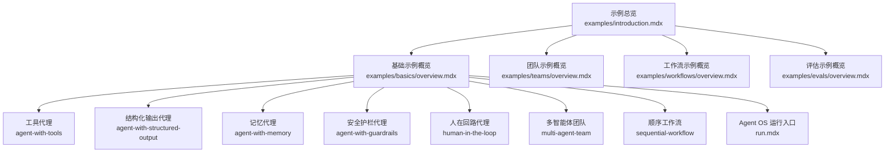
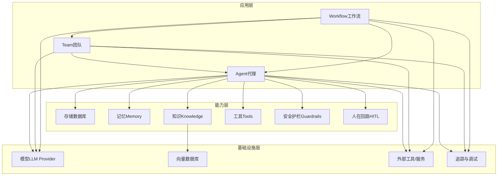
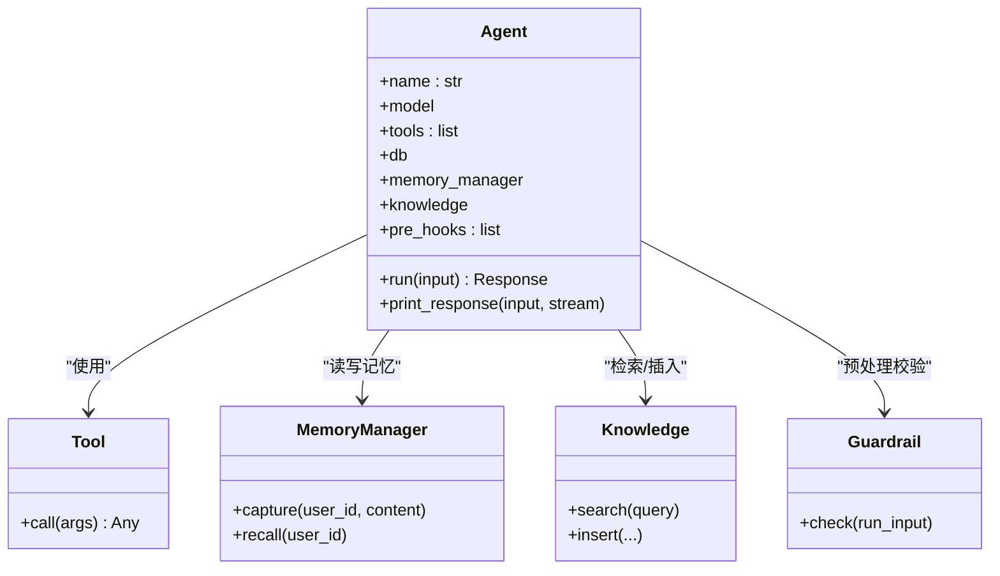
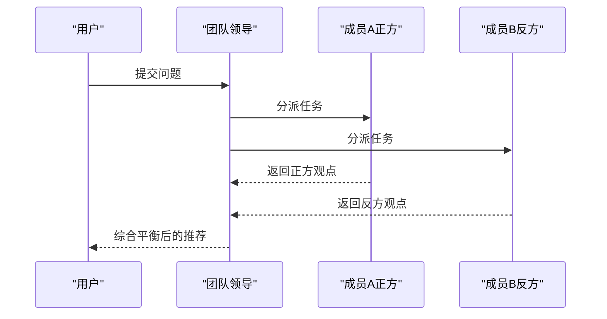
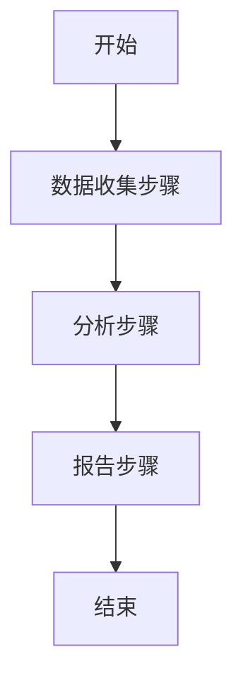
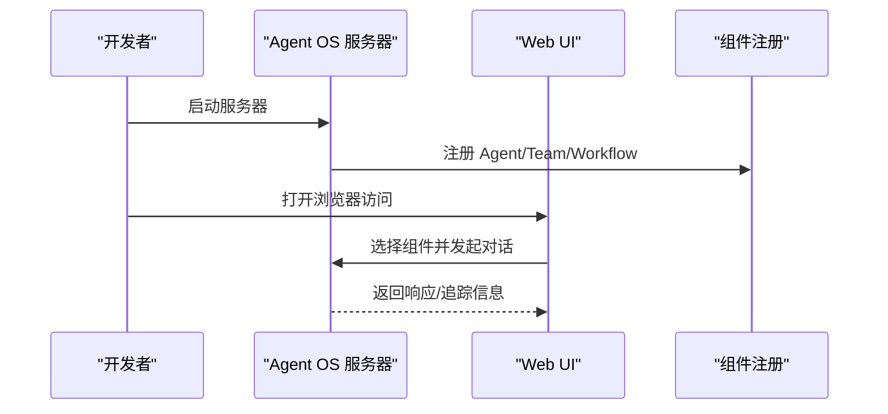
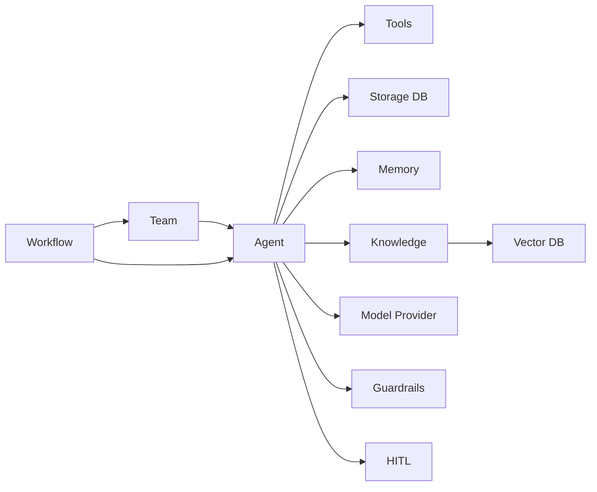

# 示例基础

<cite>
**本文引用的文件**
- [示例总览](file://examples/introduction.mdx)
- [示例基础概览](file://examples/basics/overview.mdx)
- [示例基础：运行入口](file://examples/basics/run.mdx)
- [示例基础：顺序工作流](file://examples/basics/sequential-workflow.mdx)
- [示例基础：多智能体团队](file://examples/basics/multi-agent-team.mdx)
- [示例基础：工具代理](file://examples/basics/agent-with-tools.mdx)
- [示例基础：结构化输出代理](file://examples/basics/agent-with-structured-output.mdx)
- [示例基础：记忆代理](file://examples/basics/agent-with-memory.mdx)
- [示例基础：安全护栏代理](file://examples/basics/agent-with-guardrails.mdx)
- [示例基础：人在回路代理](file://examples/basics/human-in-the-loop.mdx)
- [示例：团队总览](file://examples/teams/overview.mdx)
- [示例：评估总览](file://examples/evals/overview.mdx)
- [DIATAXIS 快速分类](file://DIATAXIS.md)
- [FAQ：环境变量](file://faq/environment-variables.mdx)
</cite>

## 目录
1. [简介](#简介)
2. [项目结构](#项目结构)
3. [核心组件](#核心组件)
4. [架构总览](#架构总览)
5. [详细组件分析](#详细组件分析)
6. [依赖关系分析](#依赖关系分析)
7. [性能考量](#性能考量)
8. [故障排查指南](#故障排查指南)
9. [结论](#结论)
10. [附录](#附录)

## 简介
本章节面向“示例基础”部分，系统性说明示例代码库的整体架构与组织方式，涵盖示例的分类体系、难度层级与应用场景；重点介绍“快速开始”示例，帮助新用户快速掌握 Agno 的核心能力与使用路径；并给出运行环境要求、依赖管理与配置要点，提供示例导航指南与通用模式、最佳实践，以及从简单示例逐步进阶到复杂应用的路径建议。

## 项目结构
示例基础位于 examples 目录下，采用“按主题分层 + 按功能分节”的组织方式：
- examples/introduction.mdx：示例总览与概览导航
- examples/basics：快速开始示例（从工具代理到多智能体团队与顺序工作流）
- examples/teams：团队相关示例（含上下文压缩、推理、任务模式等）
- examples/workflows：工作流相关示例（顺序、条件、并行、循环、CEL 表达式等）
- examples/evals：评估相关示例（准确率、模型评分、性能、可靠性）

图表来源
- [示例总览:1-65](file://examples/introduction.mdx#L1-L65)
- [示例基础概览:1-24](file://examples/basics/overview.mdx#L1-L24)
- [示例：团队总览:1-33](file://examples/teams/overview.mdx#L1-L33)
- [示例：评估总览:1-11](file://examples/evals/overview.mdx#L1-L11)

章节来源
- [示例总览:1-65](file://examples/introduction.mdx#L1-L65)
- [示例基础概览:1-24](file://examples/basics/overview.mdx#L1-L24)

## 核心组件
- 基础示例（Basics）：以“工具代理 → 结构化输出 → 记忆 → 安全护栏 → 人在回路 → 多智能体团队 → 顺序工作流 → Agent OS”为主线，层层递进，覆盖存储、内存、知识、学习、推理、评估等关键能力。
- 团队示例（Teams）：围绕多智能体协作，提供上下文管理、推理、任务模式、搜索协调、分布式 RAG 等场景。
- 工作流示例（Workflows）：强调顺序、条件、并行、循环、路由等执行控制与数据流编排。
- 评估示例（Evals）：提供准确率、模型评分、性能、可靠性等评估范式。

章节来源
- [示例基础概览:1-24](file://examples/basics/overview.mdx#L1-L24)
- [示例：团队总览:1-33](file://examples/teams/overview.mdx#L1-L33)
- [示例：评估总览:1-11](file://examples/evals/overview.mdx#L1-L11)

## 架构总览
示例基础的“运行时架构”可抽象为三层：
- 应用层：Agent、Team、Workflow 等运行单元
- 能力层：存储、记忆、知识、工具、安全护栏、人在回路等能力模块
- 基础设施层：模型、向量数据库、外部工具、会话追踪与调试

## 详细组件分析

### 组件一：Agent（代理）
- 功能要点：工具调用、结构化输出、类型化输入输出、存储、记忆、知识检索、安全护栏、人在回路、多模态、推理、学习、钩子等。
- 典型示例：
  - 工具代理：通过外部工具（如金融数据工具）获取实时数据并生成洞察。
  - 结构化输出代理：返回强类型的 Pydantic 模型，便于后续解析与集成。
  - 记忆代理：持久化用户偏好与上下文，跨会话保持个性化。
  - 安全护栏代理：在请求进入处理前进行 PII 检测、注入攻击防护与自定义规则拦截。
  - 人在回路代理：对敏感或不可逆操作进行用户确认后再执行。

图表来源
- [示例基础：工具代理:1-118](file://examples/basics/agent-with-tools.mdx#L1-L118)
- [示例基础：结构化输出代理:1-177](file://examples/basics/agent-with-structured-output.mdx#L1-L177)
- [示例基础：记忆代理:1-180](file://examples/basics/agent-with-memory.mdx#L1-L180)
- [示例基础：安全护栏代理:1-196](file://examples/basics/agent-with-guardrails.mdx#L1-L196)
- [示例基础：人在回路代理:1-262](file://examples/basics/human-in-the-loop.mdx#L1-L262)

章节来源
- [示例基础：工具代理:1-118](file://examples/basics/agent-with-tools.mdx#L1-L118)
- [示例基础：结构化输出代理:1-177](file://examples/basics/agent-with-structured-output.mdx#L1-L177)
- [示例基础：记忆代理:1-180](file://examples/basics/agent-with-memory.mdx#L1-L180)
- [示例基础：安全护栏代理:1-196](file://examples/basics/agent-with-guardrails.mdx#L1-L196)
- [示例基础：人在回路代理:1-262](file://examples/basics/human-in-the-loop.mdx#L1-L262)

### 组件二：Team（团队）
- 功能要点：多智能体协作、角色分工、领导者合成、上下文压缩、任务模式、搜索协调、分布式 RAG、学习与记忆共享等。
- 典型示例：多智能体团队（正反方分析师协同，领导者综合输出）。

图表来源
- [示例基础：多智能体团队:1-189](file://examples/basics/multi-agent-team.mdx#L1-L189)

章节来源
- [示例基础：多智能体团队:1-189](file://examples/basics/multi-agent-team.mdx#L1-L189)
- [示例：团队总览:1-33](file://examples/teams/overview.mdx#L1-L33)

### 组件三：Workflow（工作流）
- 功能要点：顺序执行、条件分支、并行执行、循环、路由、CEL 表达式等，强调明确的数据流与执行顺序。
- 典型示例：顺序工作流（数据收集 → 分析 → 报告），展示步骤间的数据传递与职责分离。

图表来源
- [示例基础：顺序工作流:1-193](file://examples/basics/sequential-workflow.mdx#L1-L193)

章节来源
- [示例基础：顺序工作流:1-193](file://examples/basics/sequential-workflow.mdx#L1-L193)
- [示例：团队总览:1-33](file://examples/teams/overview.mdx#L1-L33)

### 组件四：Agent OS（Web 界面）
- 功能要点：提供 Web 界面统一管理与交互所有示例中的 Agent、Team、Workflow；支持会话历史、追踪调试、知识库与内存管理。
- 典型示例：运行入口脚本启动 Agent OS，并注册多个示例组件。

图表来源
- [示例基础：运行入口:1-109](file://examples/basics/run.mdx#L1-L109)

章节来源
- [示例基础：运行入口:1-109](file://examples/basics/run.mdx#L1-L109)

## 依赖关系分析
- 示例基础内部依赖：Agent/Team/Workflow 之间存在组合与协作关系；知识与向量数据库耦合；工具与外部服务耦合；安全护栏与输入校验耦合；人在回路与工具执行耦合。
- 外部依赖：模型提供商（如 Google Gemini）、数据库（SQLite、PostgreSQL 等）、向量数据库（PgVector、Chroma 等）、外部工具（如 YFinance）。

图表来源
- [示例基础：工具代理:1-118](file://examples/basics/agent-with-tools.mdx#L1-L118)
- [示例基础：结构化输出代理:1-177](file://examples/basics/agent-with-structured-output.mdx#L1-L177)
- [示例基础：顺序工作流:1-193](file://examples/basics/sequential-workflow.mdx#L1-L193)
- [示例基础：多智能体团队:1-189](file://examples/basics/multi-agent-team.mdx#L1-L189)

## 性能考量
- 存储与数据库：合理设置连接池、索引与查询缓存；避免在高频路径中执行昂贵查询。
- 记忆与知识：对记忆与知识检索进行分页与结果限制，减少上下文长度。
- 工具调用：对外部工具调用进行批量与异步处理，必要时引入重试与熔断。
- 安全护栏：在预处理阶段尽早拦截无效或高风险输入，降低后端成本。
- 人在回路：尽量缩短等待时间，提供默认选项与自动续跑策略。

## 故障排查指南
- 环境变量缺失：确保模型密钥、数据库连接字符串、外部服务凭据等已正确设置。
- 权限与网络：检查本地/容器网络连通性与代理设置；验证向量数据库与外部工具可达性。
- 日志与追踪：开启追踪与调试输出，定位 Agent/Team/Workflow 的执行瓶颈与异常。
- 输入校验：若触发安全护栏，请检查输入内容是否包含敏感信息或注入模式。

章节来源
- [FAQ：环境变量:1-63](file://faq/environment-variables.mdx#L1-L63)

## 结论
示例基础以“从工具到团队再到工作流”的渐进路径，系统展示了 Agno 的核心能力与工程化实践。通过 Agent OS 可快速体验与管理示例；通过团队与工作流示例可构建更复杂的协作与编排场景；通过评估示例可建立质量保障闭环。建议新用户先完成“快速开始”，再按需深入团队与工作流示例，最后结合评估与生产部署指南完成落地。

## 附录

### 快速开始示例清单与学习路径
- 第一步：工具代理 → 掌握工具调用与外部数据获取
- 第二步：结构化输出代理 → 掌握类型化输出与数据解析
- 第三步：记忆代理 → 掌握用户偏好与上下文持久化
- 第四步：安全护栏代理 → 掌握输入校验与风险控制
- 第五步：人在回路代理 → 掌握敏感操作的用户确认流程
- 第六步：多智能体团队 → 掌握协作与合成输出
- 第七步：顺序工作流 → 掌握数据流编排与职责分离
- 第八步：Agent OS → 统一管理与可视化交互

章节来源
- [示例基础概览:1-24](file://examples/basics/overview.mdx#L1-L24)

### 示例分类与难度层级
- 分类维度：按“行动/认知 × 获取/应用”进行快速归类（参考 Diataxis 快速分类）。
- 难度层级：基础（工具、结构化输出、记忆、护栏、HITL）→ 中级（团队、工作流）→ 高级（分布式 RAG、任务模式、CEL 表达式、评估）。

章节来源
- [DIATAXIS 快速分类:171-191](file://DIATAXIS.md#L171-L191)

### 运行环境与依赖管理
- 环境变量：参考 FAQ 文档设置模型密钥与外部服务凭据。
- 依赖安装：示例通常依赖模型提供商 SDK、数据库驱动、向量数据库客户端与外部工具包；建议使用虚拟环境隔离依赖。
- Agent OS：示例提供一键启动脚本，注册多个示例组件并通过 Web UI 进行交互。

章节来源
- [示例基础：运行入口:1-109](file://examples/basics/run.mdx#L1-L109)
- [FAQ：环境变量:1-63](file://faq/environment-variables.mdx#L1-L63)