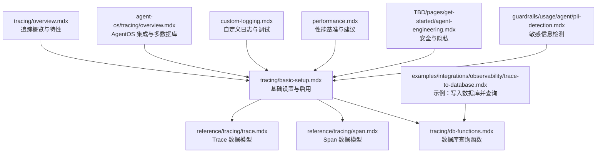
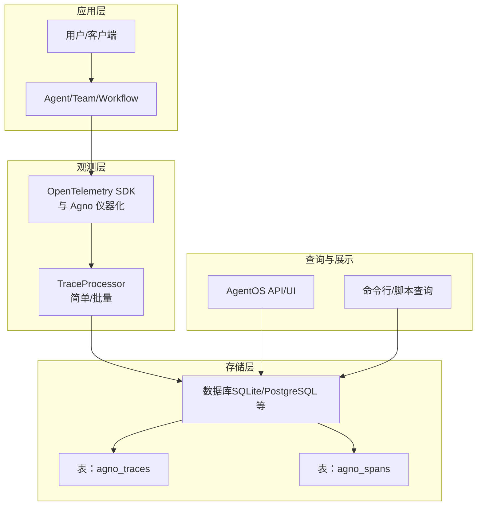
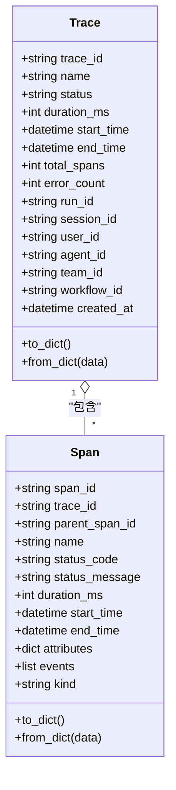
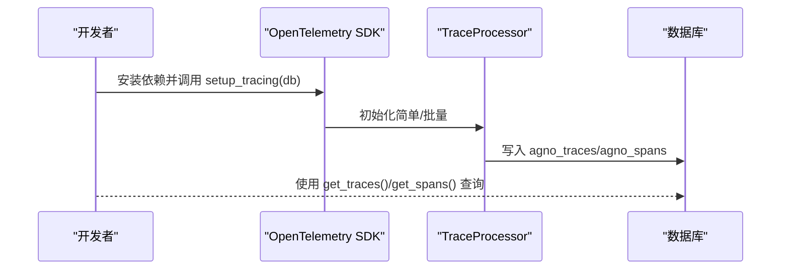
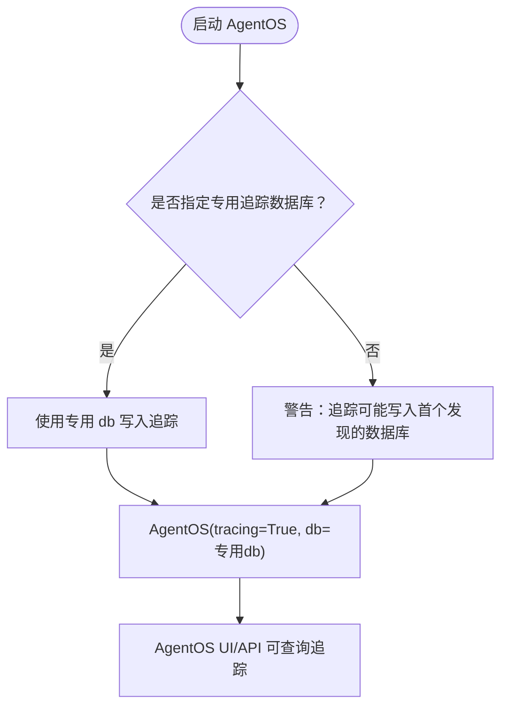
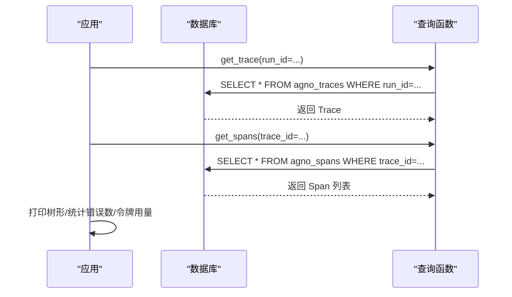
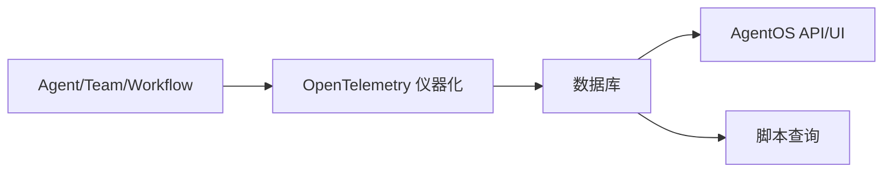

# 分布式追踪

<cite>
**本文引用的文件**
- [tracing/overview.mdx](file://tracing/overview.mdx)
- [tracing/basic-setup.mdx](file://tracing/basic-setup.mdx)
- [tracing/db-functions.mdx](file://tracing/db-functions.mdx)
- [reference/tracing/trace.mdx](file://reference/tracing/trace.mdx)
- [reference/tracing/span.mdx](file://reference/tracing/span.mdx)
- [agent-os/tracing/overview.mdx](file://agent-os/tracing/overview.mdx)
- [examples/integrations/observability/trace-to-database.mdx](file://examples/integrations/observability/trace-to-database.mdx)
- [custom-logging.mdx](file://custom-logging.mdx)
- [performance.mdx](file://performance.mdx)
- [TBD/pages/get-started/agent-engineering.mdx](file://TBD/pages/get-started/agent-engineering.mdx)
- [guardrails/usage/agent/pii-detection.mdx](file://guardrails/usage/agent/pii-detection.mdx)
</cite>

## 目录
1. [简介](#简介)
2. [项目结构](#项目结构)
3. [核心组件](#核心组件)
4. [架构总览](#架构总览)
5. [详细组件分析](#详细组件分析)
6. [依赖关系分析](#依赖关系分析)
7. [性能考量](#性能考量)
8. [故障排查指南](#故障排查指南)
9. [结论](#结论)
10. [附录](#附录)

## 简介
本技术文档围绕分布式追踪在复杂 AI 应用中的重要性展开，系统阐述如何基于 OpenTelemetry 实现跨服务调用链路追踪与性能瓶颈识别；重点覆盖以下方面：
- 跨服务调用链路追踪：以 Trace（一次完整执行）与 Span（单个操作）为核心，构建父子层级的调用树，定位慢点与失败点。
- OpenTelemetry 追踪机制：Span 创建、上下文传播与 Trace ID 管理，以及与数据库存储的集成。
- 多代理、多工具、多服务环境下的完整链路：通过统一的追踪数据库与查询接口，实现跨组件观测。
- 追踪数据的采集、存储与查询：两表设计（agno_traces 与 agno_spans），提供便捷的查询函数。
- 实际配置示例与调试技巧：安装依赖、启用追踪、批量处理模式、查询与可视化。
- 性能分析与优化建议：批处理策略、延迟与内存权衡、对 Agent 执行的影响评估。
- 隐私保护与安全考虑：本地存储、最小化数据暴露、敏感信息防护。

## 项目结构
与分布式追踪直接相关的文档主要分布在如下位置：
- tracing 基础与快速上手：tracing/overview.mdx、tracing/basic-setup.mdx
- 数据模型与查询接口：reference/tracing/trace.mdx、reference/tracing/span.mdx、tracing/db-functions.mdx
- AgentOS 集成与多数据库场景：agent-os/tracing/overview.mdx
- 示例演示：examples/integrations/observability/trace-to-database.mdx
- 日志与调试：custom-logging.mdx
- 性能基准：performance.mdx
- 安全与隐私：TBD/pages/get-started/agent-engineering.mdx、guardrails/usage/agent/pii-detection.mdx

**图表来源**
- [tracing/overview.mdx:1-158](file://tracing/overview.mdx#L1-L158)
- [tracing/basic-setup.mdx:1-233](file://tracing/basic-setup.mdx#L1-L233)
- [reference/tracing/trace.mdx:1-77](file://reference/tracing/trace.mdx#L1-L77)
- [reference/tracing/span.mdx:1-124](file://reference/tracing/span.mdx#L1-L124)
- [tracing/db-functions.mdx:1-149](file://tracing/db-functions.mdx#L1-L149)
- [agent-os/tracing/overview.mdx:1-184](file://agent-os/tracing/overview.mdx#L1-L184)
- [examples/integrations/observability/trace-to-database.mdx:1-245](file://examples/integrations/observability/trace-to-database.mdx#L1-L245)
- [custom-logging.mdx:1-193](file://custom-logging.mdx#L1-L193)
- [performance.mdx:1-67](file://performance.mdx#L1-L67)
- [TBD/pages/get-started/agent-engineering.mdx:105-115](file://TBD/pages/get-started/agent-engineering.mdx#L105-L115)
- [guardrails/usage/agent/pii-detection.mdx:32-62](file://guardrails/usage/agent/pii-detection.mdx#L32-L62)

**章节来源**
- [tracing/overview.mdx:1-158](file://tracing/overview.mdx#L1-L158)
- [tracing/basic-setup.mdx:1-233](file://tracing/basic-setup.mdx#L1-L233)
- [agent-os/tracing/overview.mdx:1-184](file://agent-os/tracing/overview.mdx#L1-L184)

## 核心组件
- Trace（追踪）：代表一次完整的执行，具有唯一 trace_id，并聚合所有相关 Span。
- Span（跨度）：代表一个具体的操作，具备父-子层级关系，记录开始/结束时间、状态、属性与事件等。
- 数据库模型：两表设计，agno_traces 存放 Trace 概要，agno_spans 存放具体 Span 细节。
- 查询接口：db.get_trace()/db.get_traces() 获取 Trace；db.get_span()/db.get_spans() 获取 Span 及其树形结构。
- 批处理与简单处理：通过配置批量导出、队列大小与调度延迟，平衡实时性与性能。

**章节来源**
- [reference/tracing/trace.mdx:1-77](file://reference/tracing/trace.mdx#L1-L77)
- [reference/tracing/span.mdx:1-124](file://reference/tracing/span.mdx#L1-L124)
- [tracing/db-functions.mdx:1-149](file://tracing/db-functions.mdx#L1-L149)
- [tracing/basic-setup.mdx:173-221](file://tracing/basic-setup.mdx#L173-L221)

## 架构总览
下图展示了从 Agent/Team/Workflow 到 OpenTelemetry 仪器化、再到数据库存储与查询的整体流程。

**图表来源**
- [tracing/overview.mdx:17-88](file://tracing/overview.mdx#L17-L88)
- [tracing/basic-setup.mdx:173-179](file://tracing/basic-setup.mdx#L173-L179)
- [agent-os/tracing/overview.mdx:28-40](file://agent-os/tracing/overview.mdx#L28-L40)

## 详细组件分析

### 组件一：Trace 与 Span 数据模型
- Trace：包含 trace_id、名称、状态、总时长、起止时间、错误数、关联的 run_id/session_id/user_id/agent_id/team_id/workflow_id 等。
- Span：包含 span_id、trace_id、parent_span_id、名称、状态码/消息、时长、起止时间、OpenTelemetry 属性（如 LLM token 数、工具参数）、事件与种类等。
- 典型属性举例：
  - LLM：输入/输出 token 数、模型名、提供商等
  - 工具：工具名、参数（JSON）、输出
  - 通用：会话 ID、用户 ID、Agent/Run ID 等

**图表来源**
- [reference/tracing/trace.mdx:8-27](file://reference/tracing/trace.mdx#L8-L27)
- [reference/tracing/span.mdx:8-24](file://reference/tracing/span.mdx#L8-L24)

**章节来源**
- [reference/tracing/trace.mdx:1-77](file://reference/tracing/trace.mdx#L1-L77)
- [reference/tracing/span.mdx:1-124](file://reference/tracing/span.mdx#L1-L124)

### 组件二：启用与配置（基础设置）
- 安装依赖：OpenTelemetry API/SDK 与 Agno 仪器化包。
- 启用方式：
  - 独立应用：调用 setup_tracing(db=...)，一次性初始化。
  - AgentOS：在 AgentOS 构造时传入 tracing=True，并提供专用数据库实例。
- 批量处理模式：可配置队列大小、批量大小与调度延迟，降低数据库写入压力，适合生产环境。
- 简单处理模式：逐条落库，适合开发调试即时可见。

**图表来源**
- [tracing/basic-setup.mdx:9-27](file://tracing/basic-setup.mdx#L9-L27)
- [tracing/basic-setup.mdx:173-221](file://tracing/basic-setup.mdx#L173-L221)

**章节来源**
- [tracing/basic-setup.mdx:1-233](file://tracing/basic-setup.mdx#L1-L233)

### 组件三：AgentOS 集成与多数据库场景
- 单共享数据库：AgentOS 中 tracing=True 即可，追踪写入共享数据库。
- 多数据库场景：强烈建议使用独立的追踪数据库，避免追踪分散到不同数据库导致查询困难。
- 使用 setup_tracing()：可在 AgentOS 中更精细地控制批处理参数，并确保追踪数据库对 AgentOS API 可见。

**图表来源**
- [agent-os/tracing/overview.mdx:28-40](file://agent-os/tracing/overview.mdx#L28-L40)
- [agent-os/tracing/overview.mdx:122-136](file://agent-os/tracing/overview.mdx#L122-L136)
- [agent-os/tracing/overview.mdx:137-182](file://agent-os/tracing/overview.mdx#L137-L182)

**章节来源**
- [agent-os/tracing/overview.mdx:1-184](file://agent-os/tracing/overview.mdx#L1-L184)

### 组件四：数据采集、存储与查询
- 两表设计：agno_traces（Trace 概要）、agno_spans（Span 细节）。
- 查询函数：
  - 获取单个 Trace 或按条件分页获取多个 Trace。
  - 获取单个 Span 或根据 trace_id/parent_span_id 获取一组 Span。
- 示例：遍历 Span 并打印树形结构，按 kind 输出 LLM/工具/Agent 的关键属性。

**图表来源**
- [tracing/db-functions.mdx:10-117](file://tracing/db-functions.mdx#L10-L117)
- [examples/integrations/observability/trace-to-database.mdx:64-105](file://examples/integrations/observability/trace-to-database.mdx#L64-L105)

**章节来源**
- [tracing/db-functions.mdx:1-149](file://tracing/db-functions.mdx#L1-L149)
- [examples/integrations/observability/trace-to-database.mdx:1-245](file://examples/integrations/observability/trace-to-database.mdx#L1-L245)

### 组件五：OpenTelemetry 上下文传播与 Trace ID 管理
- 上下文传播：通过 OpenTelemetry 的上下文传递，保证跨服务调用链路中的 Trace ID 一致。
- Trace ID 管理：每个 Trace 有唯一标识，Span 通过 trace_id 关联，parent_span_id 表达父子关系，形成调用树。
- 属性标准化：使用 OpenTelemetry 语义属性键（如 llm.*、tool.*、session.id 等）统一结构化数据，便于查询与分析。

**章节来源**
- [tracing/overview.mdx:39-67](file://tracing/overview.mdx#L39-L67)
- [reference/tracing/span.mdx:36-55](file://reference/tracing/span.mdx#L36-L55)

## 依赖关系分析
- 组件耦合：
  - Agent/Team/Workflow 与 OpenTelemetry 仪器化解耦，通过 setup_tracing() 一次性注入。
  - 数据库作为统一存储，Trace 与 Span 通过外键/索引字段关联。
- 外部依赖：
  - OpenTelemetry API/SDK 与 Agno 仪器化包。
  - 支持多种数据库后端（SQLite/PostgreSQL 等）。
- 潜在循环依赖：
  - 追踪查询不依赖业务逻辑，避免循环依赖风险。

**图表来源**
- [tracing/basic-setup.mdx:21-27](file://tracing/basic-setup.mdx#L21-L27)
- [tracing/db-functions.mdx:8-14](file://tracing/db-functions.mdx#L8-L14)

**章节来源**
- [tracing/basic-setup.mdx:1-233](file://tracing/basic-setup.mdx#L1-L233)
- [tracing/db-functions.mdx:1-149](file://tracing/db-functions.mdx#L1-L149)

## 性能考量
- 批处理模式优势：减少数据库写入次数，降低 IO 压力，提升吞吐；默认存在少量延迟与内存缓冲。
- 简单处理模式：立即落库，无缓冲，适合开发调试；但写入更频繁，对 IO 更敏感。
- 对 Agent 执行的影响：追踪系统非阻塞，默认最小化对执行时延的影响；生产建议开启批处理并合理设置队列与批量大小。
- 基准参考：仓库提供了与其他框架的实例化时间与内存占用对比，强调最小化开销与并行化工具调用。

**章节来源**
- [tracing/basic-setup.mdx:173-221](file://tracing/basic-setup.mdx#L173-L221)
- [performance.mdx:13-28](file://performance.mdx#L13-L28)

## 故障排查指南
- 无法查询到 Trace：
  - 确认已安装 openinference-instrumentation-agno。
  - 若使用批量处理器，需等待刷新周期或显式等待。
  - 检查 db 是否正确传入 AgentOS，以便 UI/API 访问。
- 查询结果为空：
  - 核对过滤条件（agent_id、时间范围、run_id 等）。
  - 确认数据库连接与表结构存在。
- 调试与日志：
  - 使用自定义日志器，将 Agent/Team/Workflow 的日志输出到不同文件或通道，辅助定位问题。
- 错误定位：
  - 优先查看 Span 的 status_code/status_message，结合 LLM 的 token 使用与工具参数，快速定位异常环节。

**章节来源**
- [examples/integrations/observability/trace-to-database.mdx:68-72](file://examples/integrations/observability/trace-to-database.mdx#L68-L72)
- [custom-logging.mdx:14-193](file://custom-logging.mdx#L14-L193)

## 结论
- 分布式追踪在复杂 AI 应用中至关重要，能够帮助我们理解执行流程、定位性能瓶颈与失败点。
- 基于 OpenTelemetry 的 Span/Trace 体系与两表存储设计，配合便捷的查询接口，实现了从采集到可视化的闭环。
- 在多代理、多工具、多服务环境下，推荐使用专用追踪数据库与批量处理模式，兼顾可观测性与性能。
- 结合隐私与安全实践（本地存储、敏感信息检测），可在保障数据主权的同时获得全面的运行洞察。

## 附录
- 快速开始步骤（摘自官方文档）：
  - 安装依赖：opentelemetry-api、opentelemetry-sdk、openinference-instrumentation-agno。
  - 设置追踪数据库并调用 setup_tracing(db=...)。
  - 运行 Agent/Team/Workflow，自动捕获 Trace 与 Span。
  - 使用 db.get_traces()/db.get_spans() 查询与分析。
- 示例参考：
  - 观测性示例：将 Trace 写入数据库并解析输出，包含 Span 树形打印与关键属性展示。
  - AgentOS 集成：在多数据库场景下统一追踪存储与查询。

**章节来源**
- [tracing/overview.mdx:90-131](file://tracing/overview.mdx#L90-L131)
- [examples/integrations/observability/trace-to-database.mdx:1-245](file://examples/integrations/observability/trace-to-database.mdx#L1-L245)