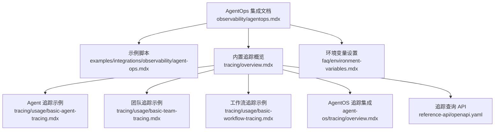
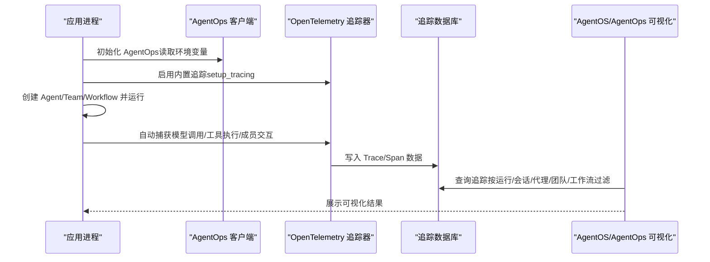
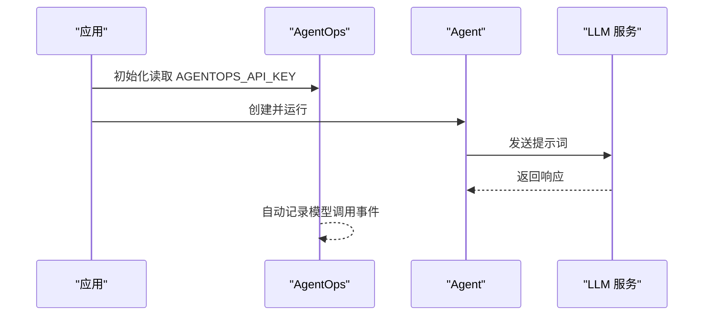
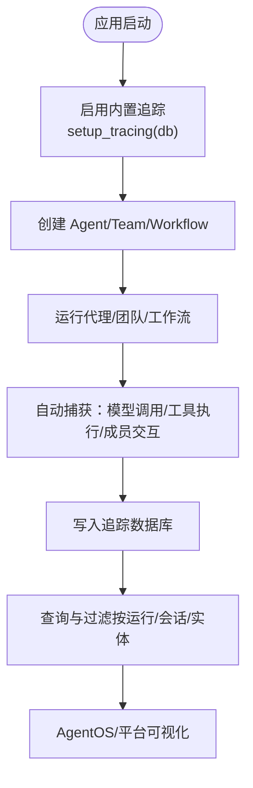
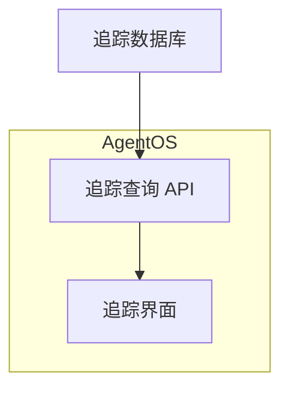
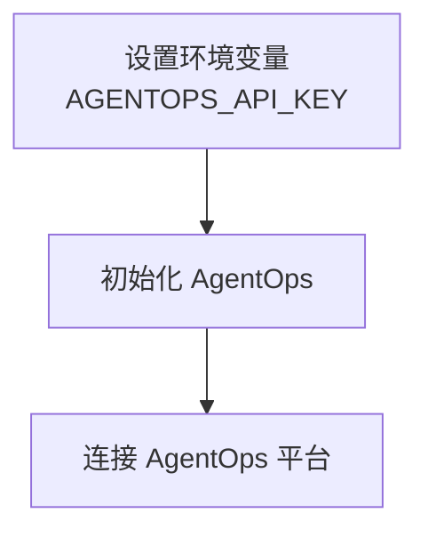
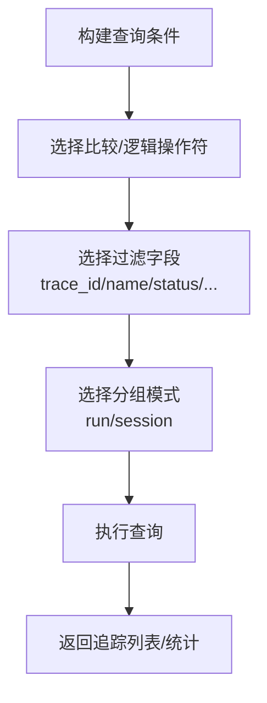
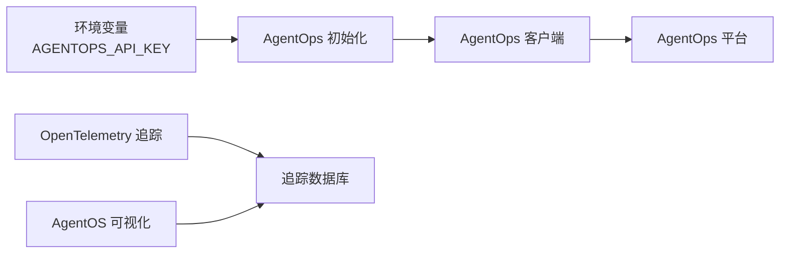

# AgentOps 集成

<cite>
**本文引用的文件**
- [observability/agentops.mdx](file://observability/agentops.mdx)
- [examples/integrations/observability/agent-ops.mdx](file://examples/integrations/observability/agent-ops.mdx)
- [tracing/overview.mdx](file://tracing/overview.mdx)
- [tracing/usage/basic-agent-tracing.mdx](file://tracing/usage/basic-agent-tracing.mdx)
- [tracing/usage/basic-team-tracing.mdx](file://tracing/usage/basic-team-tracing.mdx)
- [tracing/usage/basic-workflow-tracing.mdx](file://tracing/usage/basic-workflow-tracing.mdx)
- [agent-os/tracing/overview.mdx](file://agent-os/tracing/overview.mdx)
- [faq/environment-variables.mdx](file://faq/environment-variables.mdx)
- [reference-api/openapi.yaml](file://reference-api/openapi.yaml)
</cite>

## 目录
1. [简介](#简介)
2. [项目结构](#项目结构)
3. [核心组件](#核心组件)
4. [架构总览](#架构总览)
5. [详细组件分析](#详细组件分析)
6. [依赖关系分析](#依赖关系分析)
7. [性能考虑](#性能考虑)
8. [故障排除指南](#故障排除指南)
9. [结论](#结论)
10. [附录](#附录)

## 简介
本文件面向希望在 Agno 中集成 AgentOps 观测性平台的用户，系统讲解如何通过自动仪器化（无需修改业务代码）记录模型调用、跟踪代理交互、团队协调与工具使用，并将观测数据发送到 AgentOps 平台进行集中式可视化与分析。文档同时覆盖初始化流程、API 密钥配置、环境变量设置、查询与过滤接口、常见问题排查以及性能优化建议。

## 项目结构
与 AgentOps 集成相关的知识分布在以下位置：
- 观测性与集成：observability/agentops.mdx 提供基础集成说明与示例；examples/integrations/observability/agent-ops.mdx 提供可运行示例脚本。
- 通用追踪能力：tracing/overview.mdx、tracing/usage/* 提供 Agno 内置 OpenTelemetry 追踪能力、自动捕获范围与数据库存储、查询接口等。
- AgentOS 集成：agent-os/tracing/overview.mdx 展示如何在 AgentOS 中启用并查看追踪。
- 环境变量：faq/environment-variables.mdx 提供跨平台设置环境变量的方法。
- API 参考：reference-api/openapi.yaml 提供追踪查询的过滤字段与分组模式。

**图表来源**
- [observability/agentops.mdx:1-53](file://observability/agentops.mdx#L1-L53)
- [examples/integrations/observability/agent-ops.mdx:1-50](file://examples/integrations/observability/agent-ops.mdx#L1-L50)
- [tracing/overview.mdx:1-158](file://tracing/overview.mdx#L1-L158)
- [tracing/usage/basic-agent-tracing.mdx:1-78](file://tracing/usage/basic-agent-tracing.mdx#L1-L78)
- [tracing/usage/basic-team-tracing.mdx:1-89](file://tracing/usage/basic-team-tracing.mdx#L1-L89)
- [tracing/usage/basic-workflow-tracing.mdx:1-145](file://tracing/usage/basic-workflow-tracing.mdx#L1-L145)
- [agent-os/tracing/overview.mdx:1-182](file://agent-os/tracing/overview.mdx#L1-L182)
- [faq/environment-variables.mdx:1-120](file://faq/environment-variables.mdx#L1-L120)
- [reference-api/openapi.yaml:6735-6756](file://reference-api/openapi.yaml#L6735-L6756)

**章节来源**
- [observability/agentops.mdx:1-53](file://observability/agentops.mdx#L1-L53)
- [examples/integrations/observability/agent-ops.mdx:1-50](file://examples/integrations/observability/agent-ops.mdx#L1-L50)
- [tracing/overview.mdx:1-158](file://tracing/overview.mdx#L1-L158)
- [tracing/usage/basic-agent-tracing.mdx:1-78](file://tracing/usage/basic-agent-tracing.mdx#L1-L78)
- [tracing/usage/basic-team-tracing.mdx:1-89](file://tracing/usage/basic-team-tracing.mdx#L1-L89)
- [tracing/usage/basic-workflow-tracing.mdx:1-145](file://tracing/usage/basic-workflow-tracing.mdx#L1-L145)
- [agent-os/tracing/overview.mdx:1-182](file://agent-os/tracing/overview.mdx#L1-L182)
- [faq/environment-variables.mdx:1-120](file://faq/environment-variables.mdx#L1-L120)
- [reference-api/openapi.yaml:6735-6756](file://reference-api/openapi.yaml#L6735-L6756)

## 核心组件
- AgentOps 自动仪器化：通过在应用启动时初始化 AgentOps，即可自动捕获模型调用、代理交互、团队协调与工具使用等事件，并发送至 AgentOps 平台。
- 环境变量与密钥：通过环境变量配置 AgentOps API Key，确保初始化阶段能正确连接平台。
- 跟踪与日志：结合内置追踪（OpenTelemetry），可同时获得细粒度的执行树（Trace/Span）与平台侧的可视化面板。
- 查询与过滤：通过 AgentOS 或自定义数据库查询接口，按运行、会话、代理、团队、工作流等维度筛选与聚合追踪数据。

**章节来源**
- [observability/agentops.mdx:10-52](file://observability/agentops.mdx#L10-L52)
- [examples/integrations/observability/agent-ops.mdx:13-36](file://examples/integrations/observability/agent-ops.mdx#L13-L36)
- [faq/environment-variables.mdx:1-120](file://faq/environment-variables.mdx#L1-L120)
- [tracing/overview.mdx:68-89](file://tracing/overview.mdx#L68-L89)

## 架构总览
下图展示了从应用启动到观测数据可视化的整体流程，强调 AgentOps 初始化与内置追踪的协同作用。

**图表来源**
- [examples/integrations/observability/agent-ops.mdx:20-21](file://examples/integrations/observability/agent-ops.mdx#L20-L21)
- [tracing/overview.mdx:90-131](file://tracing/overview.mdx#L90-L131)
- [agent-os/tracing/overview.mdx:18-26](file://agent-os/tracing/overview.mdx#L18-L26)

## 详细组件分析

### 组件一：AgentOps 初始化与模型调用记录
- 初始化步骤：在应用启动时调用初始化函数，确保 AgentOps 客户端可用。
- 模型调用记录：Agent 在运行过程中触发的模型请求与响应会被自动记录，无需手动埋点。
- 示例路径：[示例脚本:13-36](file://examples/integrations/observability/agent-ops.mdx#L13-L36)，[集成说明:26-44](file://observability/agentops.mdx#L26-L44)

**图表来源**
- [examples/integrations/observability/agent-ops.mdx:20-35](file://examples/integrations/observability/agent-ops.mdx#L20-L35)
- [observability/agentops.mdx:30-44](file://observability/agentops.mdx#L30-L44)

**章节来源**
- [examples/integrations/observability/agent-ops.mdx:1-50](file://examples/integrations/observability/agent-ops.mdx#L1-L50)
- [observability/agentops.mdx:1-53](file://observability/agentops.mdx#L1-L53)

### 组件二：内置追踪（OpenTelemetry）与 Agent/Team/Workflow 覆盖
- 自动仪器化：无需修改业务代码，即可捕获 agent.run、模型调用、工具执行、团队协作、工作流步骤等。
- 数据库存储：追踪数据写入本地或外部数据库，支持查询与聚合。
- 示例路径：[Agent 追踪示例:14-45](file://tracing/usage/basic-agent-tracing.mdx#L14-L45)，[团队追踪示例:14-54](file://tracing/usage/basic-team-tracing.mdx#L14-L54)，[工作流追踪示例:14-110](file://tracing/usage/basic-workflow-tracing.mdx#L14-L110)

**图表来源**
- [tracing/overview.mdx:90-131](file://tracing/overview.mdx#L90-L131)
- [tracing/usage/basic-agent-tracing.mdx:14-45](file://tracing/usage/basic-agent-tracing.mdx#L14-L45)
- [tracing/usage/basic-team-tracing.mdx:14-54](file://tracing/usage/basic-team-tracing.mdx#L14-L54)
- [tracing/usage/basic-workflow-tracing.mdx:14-110](file://tracing/usage/basic-workflow-tracing.mdx#L14-L110)

**章节来源**
- [tracing/overview.mdx:1-158](file://tracing/overview.mdx#L1-L158)
- [tracing/usage/basic-agent-tracing.mdx:1-78](file://tracing/usage/basic-agent-tracing.mdx#L1-L78)
- [tracing/usage/basic-team-tracing.mdx:1-89](file://tracing/usage/basic-team-tracing.mdx#L1-L89)
- [tracing/usage/basic-workflow-tracing.mdx:1-145](file://tracing/usage/basic-workflow-tracing.mdx#L1-L145)

### 组件三：AgentOS 集成与可视化
- 在 AgentOS 中启用追踪后，可在 UI 中直接查看追踪详情、会话统计与跨实体对比。
- 建议使用专用追踪数据库，避免追踪数据分散在多个数据库中。
- 示例路径：[AgentOS 追踪概览:18-182](file://agent-os/tracing/overview.mdx#L18-L182)

**图表来源**
- [agent-os/tracing/overview.mdx:18-182](file://agent-os/tracing/overview.mdx#L18-L182)

**章节来源**
- [agent-os/tracing/overview.mdx:1-182](file://agent-os/tracing/overview.mdx#L1-L182)

### 组件四：环境变量与 API 密钥配置
- AgentOps API Key：通过环境变量注入，初始化时自动读取。
- 跨平台设置：macOS、Windows（PowerShell/命令提示符）均提供临时与永久设置方法。
- 示例路径：[AgentOps 集成说明:20-24](file://observability/agentops.mdx#L20-L24)，[环境变量设置:1-120](file://faq/environment-variables.mdx#L1-L120)

**图表来源**
- [observability/agentops.mdx:20-24](file://observability/agentops.mdx#L20-L24)
- [faq/environment-variables.mdx:1-120](file://faq/environment-variables.mdx#L1-L120)

**章节来源**
- [observability/agentops.mdx:1-53](file://observability/agentops.mdx#L1-L53)
- [faq/environment-variables.mdx:1-120](file://faq/environment-variables.mdx#L1-L120)

### 组件五：追踪查询与过滤（API）
- 支持按运行、会话、代理、团队、工作流等维度过滤与分组。
- 典型过滤操作：等于、不等于、大于、小于、包含、前缀匹配、逻辑组合。
- 示例路径：[追踪查询 API 字段与示例:6735-6756](file://reference-api/openapi.yaml#L6735-L6756)

**图表来源**
- [reference-api/openapi.yaml:6735-6756](file://reference-api/openapi.yaml#L6735-L6756)

**章节来源**
- [reference-api/openapi.yaml:6735-6756](file://reference-api/openapi.yaml#L6735-L6756)

## 依赖关系分析
- AgentOps 集成依赖于应用启动时的初始化与环境变量配置。
- 内置追踪（OpenTelemetry）与 AgentOps 并行工作：前者负责自动捕获执行树，后者负责将观测数据发送至平台。
- AgentOS 作为 UI 层，依赖数据库中的追踪数据进行可视化展示。

**图表来源**
- [observability/agentops.mdx:20-24](file://observability/agentops.mdx#L20-L24)
- [examples/integrations/observability/agent-ops.mdx:20-21](file://examples/integrations/observability/agent-ops.mdx#L20-L21)
- [tracing/overview.mdx:90-131](file://tracing/overview.mdx#L90-L131)
- [agent-os/tracing/overview.mdx:18-182](file://agent-os/tracing/overview.mdx#L18-L182)

**章节来源**
- [observability/agentops.mdx:1-53](file://observability/agentops.mdx#L1-L53)
- [examples/integrations/observability/agent-ops.mdx:1-50](file://examples/integrations/observability/agent-ops.mdx#L1-L50)
- [tracing/overview.mdx:1-158](file://tracing/overview.mdx#L1-L158)
- [agent-os/tracing/overview.mdx:1-182](file://agent-os/tracing/overview.mdx#L1-L182)

## 性能考虑
- 零侵入与非阻塞：内置追踪对代理运行无感知延迟，适合生产环境。
- 批量处理与队列：可通过批量大小与调度延迟参数优化吞吐与资源占用。
- 专用追踪数据库：将追踪数据与业务数据分离，便于独立扩展与查询。
- 最佳实践：在生产环境中始终使用专用追踪数据库，避免追踪数据分散与查询复杂化。

**章节来源**
- [tracing/overview.mdx:81-89](file://tracing/overview.mdx#L81-L89)
- [agent-os/tracing/overview.mdx:122-136](file://agent-os/tracing/overview.mdx#L122-L136)
- [agent-os/tracing/overview.mdx:180-182](file://agent-os/tracing/overview.mdx#L180-L182)

## 故障排除指南
- 症状：AgentOps 未收到数据
  - 排查要点：确认环境变量是否正确设置；检查初始化是否在应用启动早期调用；验证 API Key 是否有效。
  - 参考路径：[AgentOps 集成说明:20-24](file://observability/agentops.mdx#L20-L24)，[环境变量设置:1-120](file://faq/environment-variables.mdx#L1-L120)
- 症状：追踪数据缺失或分散
  - 排查要点：是否使用了专用追踪数据库；AgentOS 是否传入了追踪数据库实例以便查询。
  - 参考路径：[AgentOS 追踪概览:122-136](file://agent-os/tracing/overview.mdx#L122-L136)，[AgentOS 追踪概览:137-178](file://agent-os/tracing/overview.mdx#L137-L178)
- 症状：查询不到追踪或过滤失败
  - 排查要点：确认过滤字段与操作符是否符合 API 规范；检查分组模式与页面参数。
  - 参考路径：[追踪查询 API:6735-6756](file://reference-api/openapi.yaml#L6735-L6756)

**章节来源**
- [observability/agentops.mdx:1-53](file://observability/agentops.mdx#L1-L53)
- [faq/environment-variables.mdx:1-120](file://faq/environment-variables.mdx#L1-L120)
- [agent-os/tracing/overview.mdx:122-178](file://agent-os/tracing/overview.mdx#L122-L178)
- [reference-api/openapi.yaml:6735-6756](file://reference-api/openapi.yaml#L6735-L6756)

## 结论
通过在 Agno 中集成 AgentOps，可以实现“零代码”自动仪器化，全面记录模型调用、代理交互、团队协调与工具使用，并将数据统一汇聚到 AgentOps 平台进行可视化分析。结合内置 OpenTelemetry 追踪与 AgentOS 可视化界面，用户能够快速定位问题、优化性能并建立审计与成本控制能力。建议在生产环境中采用专用追踪数据库与完善的环境变量管理策略，确保可观测性的稳定性与可维护性。

## 附录
- 快速开始清单
  - 安装 AgentOps 包并设置 API Key 环境变量
  - 在应用启动时初始化 AgentOps
  - 使用内置追踪（可选）以获得更丰富的执行树
  - 在 AgentOS 中查看与查询追踪数据
- 相关示例与参考
  - [AgentOps 集成示例脚本:1-50](file://examples/integrations/observability/agent-ops.mdx#L1-L50)
  - [内置追踪概览与示例:1-158](file://tracing/overview.mdx#L1-L158)
  - [AgentOS 追踪集成:1-182](file://agent-os/tracing/overview.mdx#L1-L182)
  - [环境变量设置指南:1-120](file://faq/environment-variables.mdx#L1-L120)
  - [追踪查询 API 字段与示例:6735-6756](file://reference-api/openapi.yaml#L6735-L6756)