# Arize Phoenix 集成

<cite>
**本文档引用的文件**
- [observability/arize.mdx](file://observability/arize.mdx)
- [examples/integrations/observability/arize-phoenix-via-openinference.mdx](file://examples/integrations/observability/arize-phoenix-via-openinference.mdx)
- [examples/integrations/observability/arize-phoenix-via-openinference-local.mdx](file://examples/integrations/observability/arize-phoenix-via-openinference-local.mdx)
- [examples/integrations/observability/workflows/arize-phoenix-via-openinference-workflow.mdx](file://examples/integrations/observability/workflows/arize-phoenix-via-openinference-workflow.mdx)
- [examples/integrations/observability/arize-phoenix-moving-traces-to-different-projects.mdx](file://examples/integrations/observability/arize-phoenix-moving-traces-to-different-projects.mdx)
- [examples/integrations/observability/trace-to-database.mdx](file://examples/integrations/observability/trace-to-database.mdx)
- [faq/environment-variables.mdx](file://faq/environment-variables.mdx)
- [tracing/overview.mdx](file://tracing/overview.mdx)
</cite>

## 目录
1. [简介](#简介)
2. [项目结构](#项目结构)
3. [核心组件](#核心组件)
4. [架构概览](#架构概览)
5. [详细组件分析](#详细组件分析)
6. [依赖关系分析](#依赖关系分析)
7. [性能考虑](#性能考虑)
8. [故障排除指南](#故障排除指南)
9. [结论](#结论)
10. [附录](#附录)

## 简介

Arize Phoenix 是一个强大的 AI 模型监控和分析平台，通过与 Agno 的集成，可以利用 OpenInference 发送追踪数据，在 Arize Phoenix 仪表板中可视化 AI 代理的执行流程、监控性能并调试问题。

Arize Phoenix 集成提供了以下核心功能：
- **模型性能监控**：实时监控代理执行时间、错误率和资源使用情况
- **数据质量跟踪**：跟踪输入输出质量、工具调用效果和 LLM 性能指标
- **推理管道可视化**：完整的执行流程可视化，包括多步骤工作流
- **成本分析**：基于令牌使用量的成本监控
- **错误诊断**：详细的错误堆栈跟踪和调试信息

## 项目结构

Arize Phoenix 集成在 Agno 文档系统中的组织结构如下：

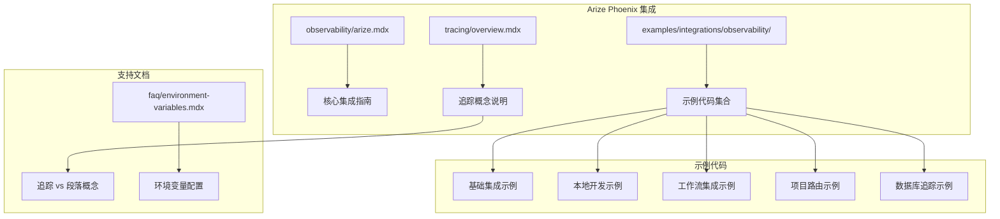

**图表来源**
- [observability/arize.mdx:1-122](file://observability/arize.mdx#L1-L122)
- [examples/integrations/observability/arize-phoenix-via-openinference.mdx:1-81](file://examples/integrations/observability/arize-phoenix-via-openinference.mdx#L1-L81)

**章节来源**
- [observability/arize.mdx:1-122](file://observability/arize.mdx#L1-L122)
- [examples/integrations/observability/overview.mdx:1-13](file://examples/integrations/observability/overview.mdx#L1-L13)

## 核心组件

### 1. 依赖包管理

Arize Phoenix 集成需要以下核心依赖：

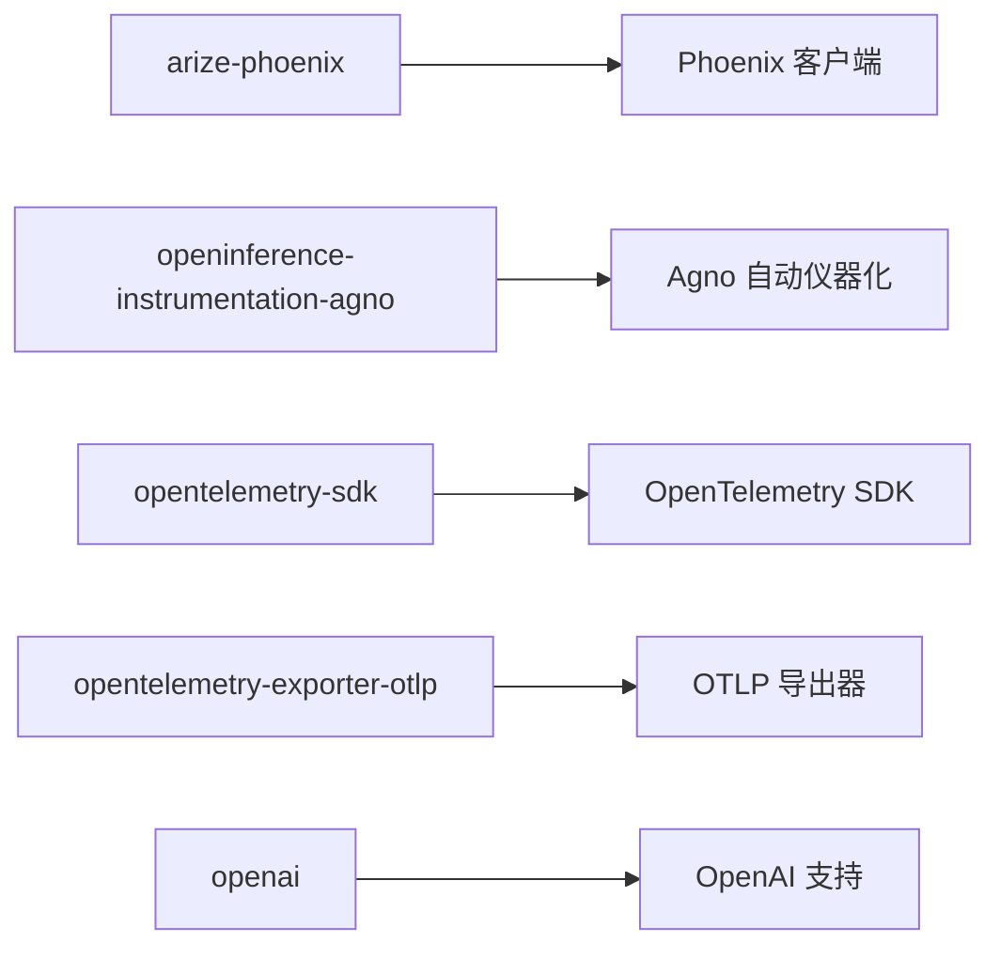

**图表来源**
- [observability/arize.mdx:16-18](file://observability/arize.mdx#L16-L18)

### 2. 环境变量配置

集成需要配置以下关键环境变量：

| 环境变量 | 用途 | 示例值 |
|---------|------|--------|
| `ARIZE_PHOENIX_API_KEY` | Phoenix API 密钥 | `phx-xxxxxxxxxxxxxxxx` |
| `PHOENIX_CLIENT_HEADERS` | 客户端认证头 | `api_key=phx-xxxxxxxxxxxxxxxx` |
| `PHOENIX_COLLECTOR_ENDPOINT` | 收集器端点 | `https://app.phoenix.arize.com` |
| `PHOENIX_API_KEY` | API 密钥（替代） | `phx-xxxxxxxxxxxxxxxx` |

**章节来源**
- [observability/arize.mdx:25-31](file://observability/arize.mdx#L25-L31)
- [examples/integrations/observability/arize-phoenix-via-openinference.mdx:26-29](file://examples/integrations/observability/arize-phoenix-via-openinference.mdx#L26-L29)

### 3. 追踪注册器

Phoenix 追踪注册器提供统一的配置接口：

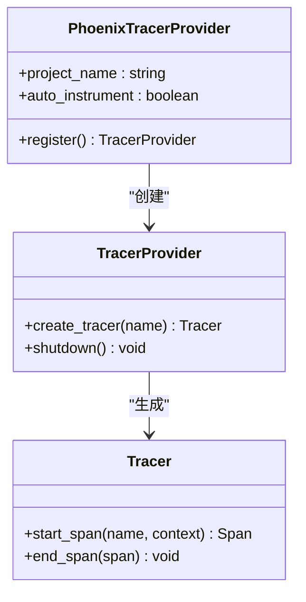

**图表来源**
- [examples/integrations/observability/arize-phoenix-via-openinference.mdx:32-35](file://examples/integrations/observability/arize-phoenix-via-openinference.mdx#L32-L35)

**章节来源**
- [examples/integrations/observability/arize-phoenix-via-openinference.mdx:32-35](file://examples/integrations/observability/arize-phoenix-via-openinference.mdx#L32-L35)

## 架构概览

Arize Phoenix 集成采用分层架构设计，确保与 OpenTelemetry 生态系统的完全兼容性：

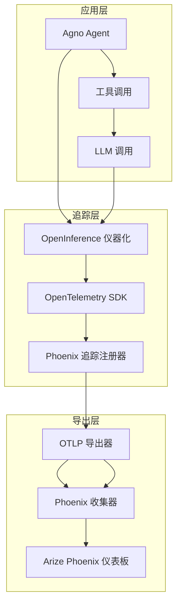

**图表来源**
- [observability/arize.mdx:35-69](file://observability/arize.mdx#L35-L69)
- [examples/integrations/observability/arize-phoenix-via-openinference.mdx:13-62](file://examples/integrations/observability/arize-phoenix-via-openinference.mdx#L13-L62)

## 详细组件分析

### 基础集成组件

#### 1. 环境配置组件

环境配置组件负责设置所有必要的运行时参数：

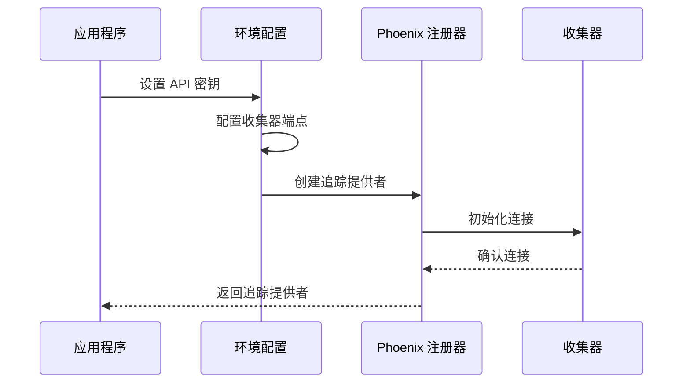

**图表来源**
- [observability/arize.mdx:48-56](file://observability/arize.mdx#L48-L56)
- [examples/integrations/observability/arize-phoenix-via-openinference.mdx:26-35](file://examples/integrations/observability/arize-phoenix-via-openinference.mdx#L26-L35)

#### 2. 代理集成组件

代理集成组件处理单个代理的追踪配置：

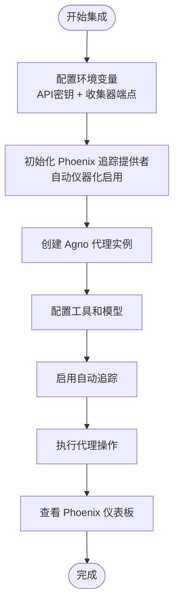

**图表来源**
- [observability/arize.mdx:58-68](file://observability/arize.mdx#L58-L68)
- [examples/integrations/observability/arize-phoenix-via-openinference.mdx:45-53](file://examples/integrations/observability/arize-phoenix-via-openinference.mdx#L45-L53)

**章节来源**
- [observability/arize.mdx:35-69](file://observability/arize.mdx#L35-L69)

### 工作流集成组件

#### 多步骤工作流追踪

工作流集成组件支持复杂的多步骤执行流程追踪：

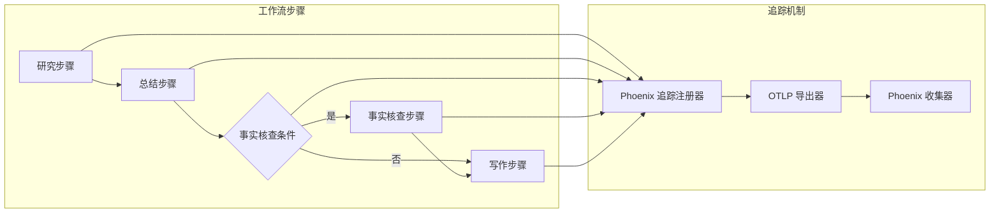

**图表来源**
- [examples/integrations/observability/workflows/arize-phoenix-via-openinference-workflow.mdx:96-110](file://examples/integrations/observability/workflows/arize-phoenix-via-openinference-workflow.mdx#L96-L110)

**章节来源**
- [examples/integrations/observability/workflows/arize-phoenix-via-openinference-workflow.mdx:1-149](file://examples/integrations/observability/workflows/arize-phoenix-via-openinference-workflow.mdx#L1-L149)

### 本地开发组件

#### 本地收集器设置

本地开发组件允许在本地环境中进行开发和测试：

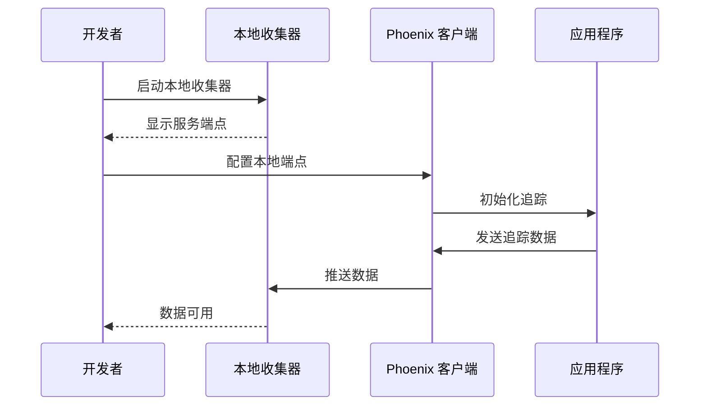

**图表来源**
- [observability/arize.mdx:82-115](file://observability/arize.mdx#L82-L115)

**章节来源**
- [observability/arize.mdx:80-121](file://observability/arize.mdx#L80-L121)

### 项目路由组件

#### 多项目追踪管理

项目路由组件支持将不同代理的追踪数据发送到不同的 Phoenix 项目：

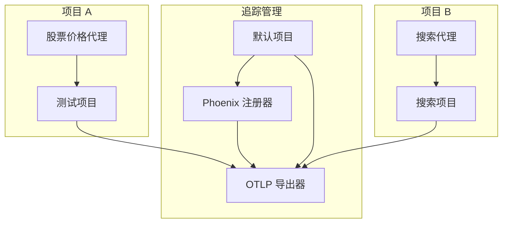

**图表来源**
- [examples/integrations/observability/arize-phoenix-moving-traces-to-different-projects.mdx:85-89](file://examples/integrations/observability/arize-phoenix-moving-traces-to-different-projects.mdx#L85-L89)

**章节来源**
- [examples/integrations/observability/arize-phoenix-moving-traces-to-different-projects.mdx:1-111](file://examples/integrations/observability/arize-phoenix-moving-traces-to-different-projects.mdx#L1-L111)

## 依赖关系分析

### 核心依赖关系图

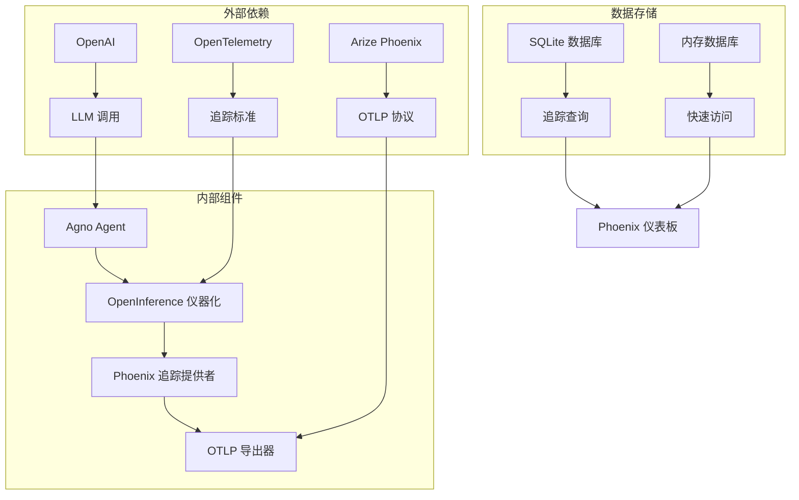

**图表来源**
- [examples/integrations/observability/trace-to-database.mdx:15-42](file://examples/integrations/observability/trace-to-database.mdx#L15-L42)

### 组件耦合度分析

| 组件 | 内聚性 | 耦合度 | 说明 |
|------|--------|--------|------|
| Phoenix 追踪提供者 | 高 | 低 | 专注于追踪功能，与其他组件解耦 |
| OpenInference 仪器化 | 中 | 中 | 与多个组件交互，但保持清晰边界 |
| 环境配置管理 | 高 | 低 | 独立的配置管理，易于测试 |
| 工作流集成 | 中 | 中 | 处理复杂流程，需要协调多个步骤 |

**章节来源**
- [examples/integrations/observability/trace-to-database.mdx:1-245](file://examples/integrations/observability/trace-to-database.mdx#L1-L245)

## 性能考虑

### 追踪开销优化

Arize Phoenix 集成在性能方面具有以下特点：

1. **异步追踪**：使用异步模式减少对主执行流程的影响
2. **批量导出**：支持批量导出以减少网络开销
3. **条件追踪**：可选择性地启用或禁用特定类型的追踪
4. **内存管理**：合理管理追踪数据的内存占用

### 最佳实践建议

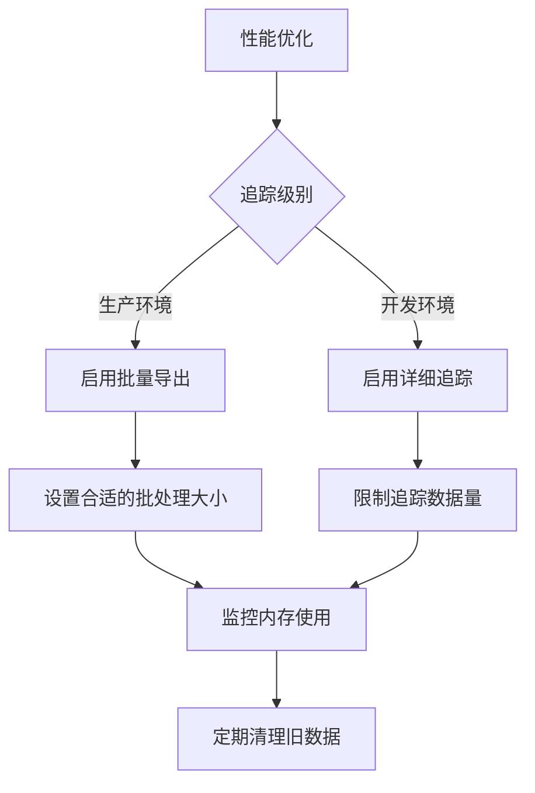

## 故障排除指南

### 常见问题及解决方案

#### 1. 环境变量配置问题

**问题症状**：
- 追踪数据无法发送到 Phoenix
- API 认证失败
- 收集器连接超时

**解决方案**：
- 验证 API 密钥格式正确
- 检查网络连接和防火墙设置
- 确认收集器端点可达性

#### 2. 代理集成问题

**问题症状**：
- 代理无法启动
- 追踪数据缺失
- 工作流执行异常

**解决方案**：
- 确保 OpenInference 依赖已安装
- 验证代理配置正确性
- 检查工具和模型的可用性

#### 3. 本地开发问题

**问题症状**：
- 本地收集器无法启动
- 数据无法显示在本地界面
- 端口冲突

**解决方案**：
- 检查端口占用情况
- 验证本地收集器版本兼容性
- 查看日志文件获取详细错误信息

**章节来源**
- [faq/environment-variables.mdx:1-120](file://faq/environment-variables.mdx#L1-L120)
- [observability/arize.mdx:117-122](file://observability/arize.mdx#L117-L122)

### 调试技巧

1. **启用调试模式**：在代理配置中启用调试模式获取详细日志
2. **检查追踪数据**：验证追踪数据是否正确生成和导出
3. **监控网络连接**：确保与 Phoenix 服务器的网络连接稳定
4. **验证权限设置**：确认 API 密钥具有足够的权限

## 结论

Arize Phoenix 与 Agno 的集成提供了完整的 AI 代理可观测性解决方案。通过 OpenInference 的自动仪器化和 OpenTelemetry 的标准化协议，该集成实现了：

- **无缝集成**：与现有 Agno 应用程序的简单集成
- **完整追踪**：从单个代理到复杂工作流的全面追踪
- **灵活配置**：支持云端和本地开发环境
- **强大功能**：提供性能监控、成本分析和错误诊断能力

该集成特别适合需要深入理解 AI 代理行为、优化性能和确保可靠性的应用场景。

## 附录

### 配置参数参考表

| 参数名称 | 类型 | 必需 | 默认值 | 描述 |
|----------|------|------|--------|------|
| `project_name` | string | 否 | `"default"` | Phoenix 项目名称 |
| `auto_instrument` | boolean | 否 | `true` | 是否启用自动仪器化 |
| `PHOENIX_API_KEY` | string | 是 | - | Phoenix API 密钥 |
| `PHOENIX_COLLECTOR_ENDPOINT` | string | 是 | - | 收集器端点地址 |
| `PHOENIX_CLIENT_HEADERS` | string | 否 | - | 客户端认证头 |

### 数据格式要求

追踪数据遵循 OpenTelemetry 标准格式，包括：
- **追踪 ID**：唯一标识符
- **跨度信息**：开始时间、结束时间和持续时间
- **属性字段**：键值对形式的元数据
- **状态信息**：成功或错误状态

### 最佳实践清单

- 在生产环境中使用批量导出以优化性能
- 为不同环境配置独立的项目空间
- 定期清理过期的追踪数据
- 监控网络连接和 API 使用配额
- 在开发环境中启用详细追踪日志