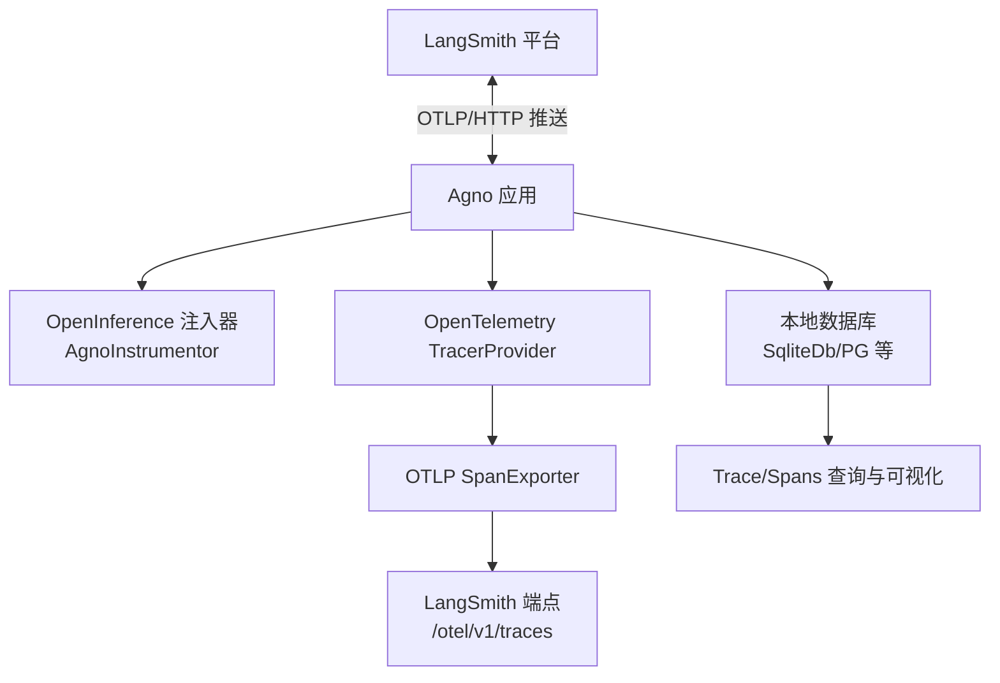
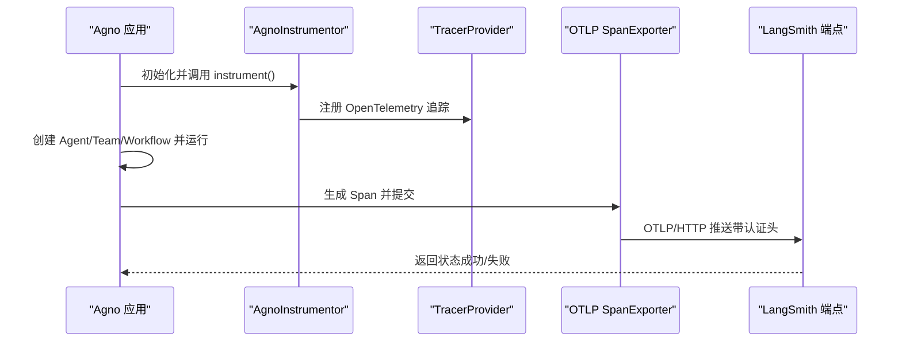
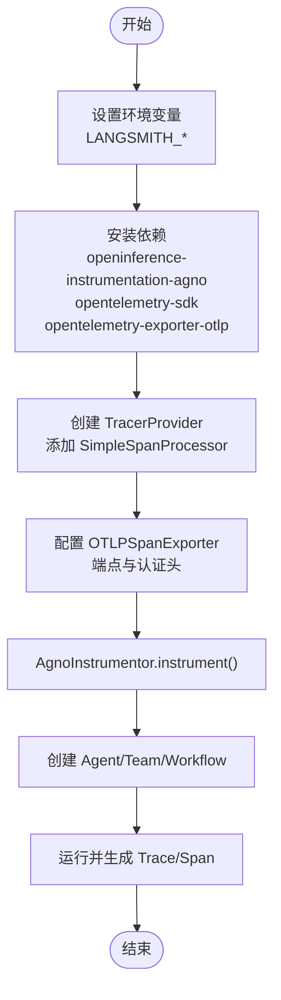
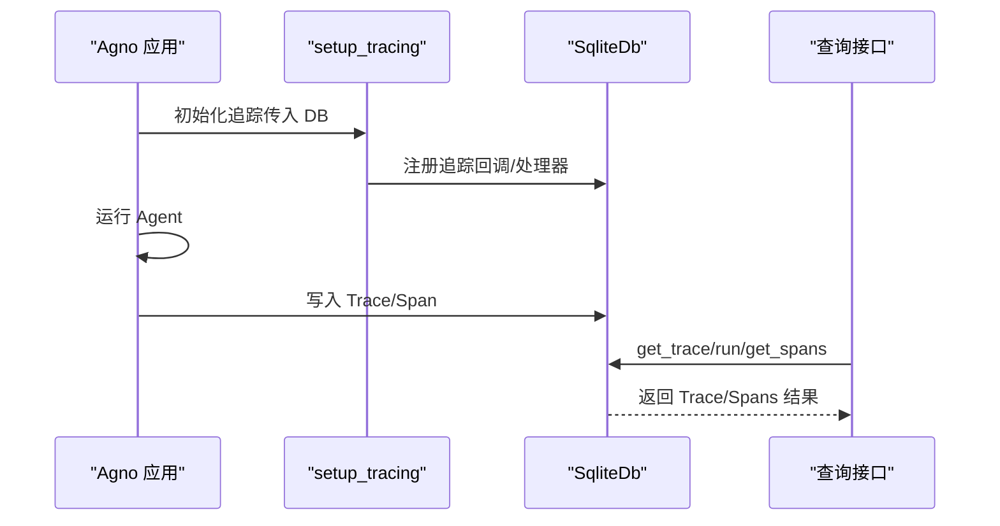
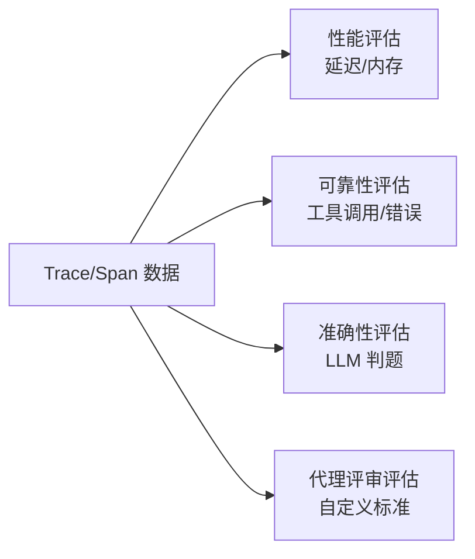
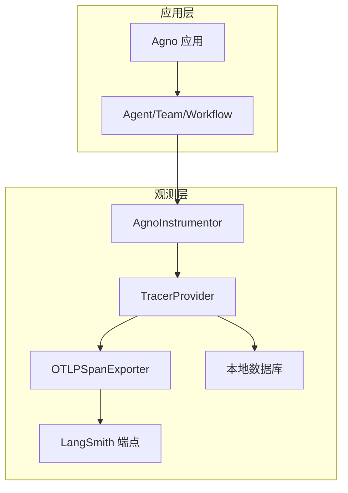

# LangSmith 集成

<cite>
**本文引用的文件**   
- [observability/langsmith.mdx](file://observability/langsmith.mdx)
- [examples/integrations/observability/langsmith-via-openinference.mdx](file://examples/integrations/observability/langsmith-via-openinference.mdx)
- [examples/integrations/observability/trace-to-database.mdx](file://examples/integrations/observability/trace-to-database.mdx)
- [tracing/overview.mdx](file://tracing/overview.mdx)
- [tracing/basic-setup.mdx](file://tracing/basic-setup.mdx)
- [evals/overview.mdx](file://evals/overview.mdx)
- [faq/environment-variables.mdx](file://faq/environment-variables.mdx)
- [reference-api/openapi.yaml](file://reference-api/openapi.yaml)
</cite>

## 目录
1. [简介](#简介)
2. [项目结构](#项目结构)
3. [核心组件](#核心组件)
4. [架构总览](#架构总览)
5. [详细组件分析](#详细组件分析)
6. [依赖关系分析](#依赖关系分析)
7. [性能考虑](#性能考虑)
8. [故障排除指南](#故障排除指南)
9. [结论](#结论)
10. [附录](#附录)

## 简介
本文件面向在 Agno 中集成 LangSmith 的实施需求，系统性介绍从 API 密钥获取、环境变量配置到客户端初始化的完整流程；深入讲解基于 OpenTelemetry 的追踪能力（包含链式调用记录、数据库落库查询、导出至 LangSmith）；并提供与 OpenTelemetry 兼容的数据格式规范、评估维度与最佳实践、性能监控建议以及常见问题排查路径。

LangSmith 是一个用于追踪与监控大模型调用的平台，通过 OpenInference 对 Agno 进行自动注入，将 Agent/Team/Workflow 的执行过程以“Trace（一次完整执行）”和“Span（单个操作）”的形式采集并发送到 LangSmith。同时，Agno 自身也支持将追踪数据持久化到本地数据库（如 SQLite），便于离线分析与调试。

## 项目结构
围绕 LangSmith 集成的关键文档与示例分布如下：
- 观测性与集成：observability/langsmith.mdx、examples/integrations/observability/langsmith-via-openinference.mdx
- 追踪与数据库：tracing/overview.mdx、tracing/basic-setup.mdx、examples/integrations/observability/trace-to-database.mdx
- 评估体系：evals/overview.mdx
- 环境变量设置：faq/environment-variables.mdx
- 数据格式参考：reference-api/openapi.yaml（包含 TraceNode、属性键等）

图表来源
- [observability/langsmith.mdx:1-87](file://observability/langsmith.mdx#L1-L87)
- [examples/integrations/observability/langsmith-via-openinference.mdx:1-76](file://examples/integrations/observability/langsmith-via-openinference.mdx#L1-L76)
- [examples/integrations/observability/trace-to-database.mdx:1-245](file://examples/integrations/observability/trace-to-database.mdx#L1-L245)

章节来源
- [observability/langsmith.mdx:1-87](file://observability/langsmith.mdx#L1-L87)
- [examples/integrations/observability/langsmith-via-openinference.mdx:1-76](file://examples/integrations/observability/langsmith-via-openinference.mdx#L1-L76)
- [examples/integrations/observability/trace-to-database.mdx:1-245](file://examples/integrations/observability/trace-to-database.mdx#L1-L245)
- [tracing/overview.mdx:1-158](file://tracing/overview.mdx#L1-L158)
- [tracing/basic-setup.mdx:1-233](file://tracing/basic-setup.mdx#L1-L233)

## 核心组件
- OpenInference 注入器（AgnoInstrumentor）
  - 自动对 Agno 的 Agent/Team/Workflow 执行进行 OpenTelemetry 注入，捕获 Trace/Span。
- OpenTelemetry TracerProvider 与 SpanExporter
  - TracerProvider 负责创建与管理 Tracer；SpanExporter 将 Span 发送到指定端点（LangSmith）。
- LangSmith 端点与认证头
  - 使用 OTLP/HTTP 协议向 LangSmith 推送，需携带 API Key 与项目名头信息。
- 本地数据库存储（可选）
  - 通过 setup_tracing 将 Trace/Span 写入本地数据库，便于离线分析与导出。

章节来源
- [observability/langsmith.mdx:36-87](file://observability/langsmith.mdx#L36-L87)
- [examples/integrations/observability/langsmith-via-openinference.mdx:13-58](file://examples/integrations/observability/langsmith-via-openinference.mdx#L13-L58)
- [tracing/overview.mdx:81-131](file://tracing/overview.mdx#L81-L131)

## 架构总览
下图展示了 Agno 与 LangSmith 的集成路径：应用启动后通过 OpenInference 注入器开启自动追踪，随后由 OpenTelemetry 将 Span 以 OTLP 协议推送到 LangSmith；同时，Agno 可选择将 Trace/Span 写入本地数据库以便进一步分析。

图表来源
- [observability/langsmith.mdx:36-87](file://observability/langsmith.mdx#L36-L87)
- [examples/integrations/observability/langsmith-via-openinference.mdx:23-58](file://examples/integrations/observability/langsmith-via-openinference.mdx#L23-L58)

## 详细组件分析

### 组件一：LangSmith 客户端初始化与追踪发送
- 关键步骤
  - 设置环境变量：LANGSMITH_API_KEY、LANGSMITH_PROJECT、LANGSMITH_ENDPOINT（按地区选择）、LANGSMITH_TRACING（可选开关）。
  - 安装依赖：openinference-instrumentation-agno、opentelemetry-sdk、opentelemetry-exporter-otlp。
  - 配置 TracerProvider 与 OTLPSpanExporter，指定 LangSmith 的 OTLP 端点与认证头。
  - 启动 AgnoInstrumentor 进行自动注入。
  - 创建 Agent 并运行，触发链式调用（Agent/Tool/LLM）被自动记录为 Span。
- 示例路径
  - [observability/langsmith.mdx:17-34](file://observability/langsmith.mdx#L17-L34)
  - [observability/langsmith.mdx:36-87](file://observability/langsmith.mdx#L36-L87)
  - [examples/integrations/observability/langsmith-via-openinference.mdx:13-58](file://examples/integrations/observability/langsmith-via-openinference.mdx#L13-L58)

图表来源
- [observability/langsmith.mdx:17-34](file://observability/langsmith.mdx#L17-L34)
- [examples/integrations/observability/langsmith-via-openinference.mdx:23-58](file://examples/integrations/observability/langsmith-via-openinference.mdx#L23-L58)

章节来源
- [observability/langsmith.mdx:17-87](file://observability/langsmith.mdx#L17-L87)
- [examples/integrations/observability/langsmith-via-openinference.mdx:13-58](file://examples/integrations/observability/langsmith-via-openinference.mdx#L13-L58)

### 组件二：本地数据库落库与查询（用于离线分析）
- 关键步骤
  - 使用 setup_tracing(db=SqliteDb(...)) 开启自动追踪。
  - 运行 Agent，Trace/Span 自动写入数据库。
  - 通过 db.get_trace/run/get_spans 等接口查询 Trace 与 Span，并打印关键属性（如 openinference.span.kind、llm.*、tool.* 等）。
- 示例路径
  - [tracing/overview.mdx:90-131](file://tracing/overview.mdx#L90-L131)
  - [examples/integrations/observability/trace-to-database.mdx:29-170](file://examples/integrations/observability/trace-to-database.mdx#L29-L170)

图表来源
- [examples/integrations/observability/trace-to-database.mdx:29-170](file://examples/integrations/observability/trace-to-database.mdx#L29-L170)
- [tracing/overview.mdx:90-131](file://tracing/overview.mdx#L90-L131)

章节来源
- [tracing/overview.mdx:90-131](file://tracing/overview.mdx#L90-L131)
- [examples/integrations/observability/trace-to-database.mdx:29-170](file://examples/integrations/observability/trace-to-database.mdx#L29-L170)

### 组件三：评估维度与导出（结合追踪数据）
- 评估维度
  - 准确性（Accuracy）：基于 LLM-as-a-judge 的正确性判断。
  - 代理评审（Agent as Judge）：自定义质量标准与评分策略。
  - 性能（Performance）：延迟、内存占用等指标。
  - 可靠性（Reliability）：工具调用、错误处理与限流行为。
- 与追踪的关系
  - 追踪数据可用于定位性能瓶颈、识别错误节点、统计 Token 使用量，从而支撑评估结果的解释与优化。
- 示例路径
  - [evals/overview.mdx:10-66](file://evals/overview.mdx#L10-L66)

图表来源
- [evals/overview.mdx:10-66](file://evals/overview.mdx#L10-L66)
- [examples/integrations/observability/trace-to-database.mdx:134-152](file://examples/integrations/observability/trace-to-database.mdx#L134-L152)

章节来源
- [evals/overview.mdx:10-66](file://evals/overview.mdx#L10-L66)
- [examples/integrations/observability/trace-to-database.mdx:134-152](file://examples/integrations/observability/trace-to-database.mdx#L134-L152)

### 组件四：OpenTelemetry 兼容性与数据格式规范
- 兼容性
  - 使用 OpenTelemetry 原生协议（OTLP/HTTP）推送 Span。
  - 属性键遵循 OpenInference/OTel 规范，如 openinference.span.kind、llm.*、tool.*、session.id、agno.run.id 等。
- 数据结构参考
  - TraceNode：递归节点结构，用于前端渲染 Trace 层级。
  - TraceSearchRequest：支持过滤表达式与分组模式（run/session）。
- 示例路径
  - [reference-api/openapi.yaml:13010-13052](file://reference-api/openapi.yaml#L13010-L13052)

章节来源
- [reference-api/openapi.yaml:13010-13052](file://reference-api/openapi.yaml#L13010-L13052)

## 依赖关系分析
- 组件耦合
  - AgnoInstrumentor 依赖 OpenTelemetry TracerProvider 与 SpanExporter。
  - 追踪数据既可直接发送至 LangSmith，也可落库至本地数据库。
- 外部依赖
  - openinference-instrumentation-agno：提供 Agno 的自动注入逻辑。
  - opentelemetry-sdk/exporter：提供 OpenTelemetry 的 SDK 与导出器。
  - LangSmith 端点：OTLP/HTTP 接口，需要正确的认证头。

图表来源
- [observability/langsmith.mdx:36-87](file://observability/langsmith.mdx#L36-L87)
- [examples/integrations/observability/langsmith-via-openinference.mdx:23-58](file://examples/integrations/observability/langsmith-via-openinference.mdx#L23-L58)
- [examples/integrations/observability/trace-to-database.mdx:29-170](file://examples/integrations/observability/trace-to-database.mdx#L29-L170)

章节来源
- [observability/langsmith.mdx:36-87](file://observability/langsmith.mdx#L36-L87)
- [examples/integrations/observability/langsmith-via-openinference.mdx:23-58](file://examples/integrations/observability/langsmith-via-openinference.mdx#L23-L58)
- [examples/integrations/observability/trace-to-database.mdx:29-170](file://examples/integrations/observability/trace-to-database.mdx#L29-L170)

## 性能考虑
- 处理器选择
  - SimpleSpanProcessor：立即推送，适合开发调试，无缓冲但写入更频繁。
  - BatchSpanProcessor：批量推送，适合生产环境，降低写入频率与网络开销。
- 建议
  - 开发阶段使用 SimpleSpanProcessor 快速验证；生产阶段切换为 BatchSpanProcessor 并合理设置批大小与刷新间隔。
  - 在高并发场景下，适当增加数据库连接池与索引，避免追踪写入成为瓶颈。

章节来源
- [tracing/basic-setup.mdx:211-221](file://tracing/basic-setup.mdx#L211-L221)

## 故障排除指南
- 症状：无法在 LangSmith 查看 Trace
  - 检查 LANGSMITH_API_KEY、LANGSMITH_PROJECT 是否正确设置。
  - 确认 LANGSMITH_ENDPOINT 与数据区域匹配。
  - 确保已安装 openinference-instrumentation-agno 并正确调用 AgnoInstrumentor.instrument()。
  - 参考：[observability/langsmith.mdx:17-34](file://observability/langsmith.mdx#L17-L34)
- 症状：本地数据库无 Trace
  - 确认已调用 setup_tracing(db=...) 并在运行前完成初始化。
  - 若使用 BatchSpanProcessor，等待刷新或手动 flush。
  - 参考：[examples/integrations/observability/trace-to-database.mdx:61-72](file://examples/integrations/observability/trace-to-database.mdx#L61-L72)
- 症状：环境变量未生效
  - 按平台设置临时/永久环境变量，并确保重启终端或重新加载配置。
  - 参考：[faq/environment-variables.mdx:16-119](file://faq/environment-variables.mdx#L16-L119)

章节来源
- [observability/langsmith.mdx:17-34](file://observability/langsmith.mdx#L17-L34)
- [examples/integrations/observability/trace-to-database.mdx:61-72](file://examples/integrations/observability/trace-to-database.mdx#L61-L72)
- [faq/environment-variables.mdx:16-119](file://faq/environment-variables.mdx#L16-L119)

## 结论
通过 OpenInference 与 OpenTelemetry 的组合，Agno 能够无缝对接 LangSmith 实现链式调用追踪与可视化；同时，借助本地数据库落库能力，可在不联网的情况下完成深度分析与导出。配合多维评估体系，可形成从“可观测—诊断—优化”的闭环，持续提升 Agent/Team/Workflow 的质量与稳定性。

## 附录
- 快速清单
  - 设置 LANGSMITH_API_KEY、LANGSMITH_PROJECT、LANGSMITH_ENDPOINT。
  - 安装 openinference-instrumentation-agno、opentelemetry-sdk、opentelemetry-exporter-otlp。
  - 初始化 TracerProvider 与 OTLPSpanExporter，启动 AgnoInstrumentor。
  - 可选：setup_tracing(db=SqliteDb(...)) 落库分析。
  - 参考：[observability/langsmith.mdx:17-87](file://observability/langsmith.mdx#L17-L87)、[tracing/overview.mdx:90-131](file://tracing/overview.mdx#L90-L131)