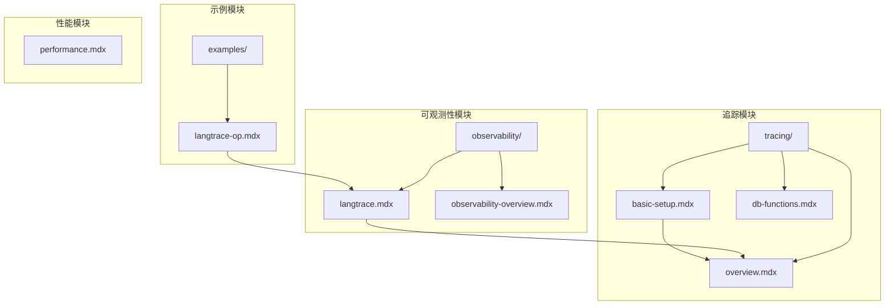
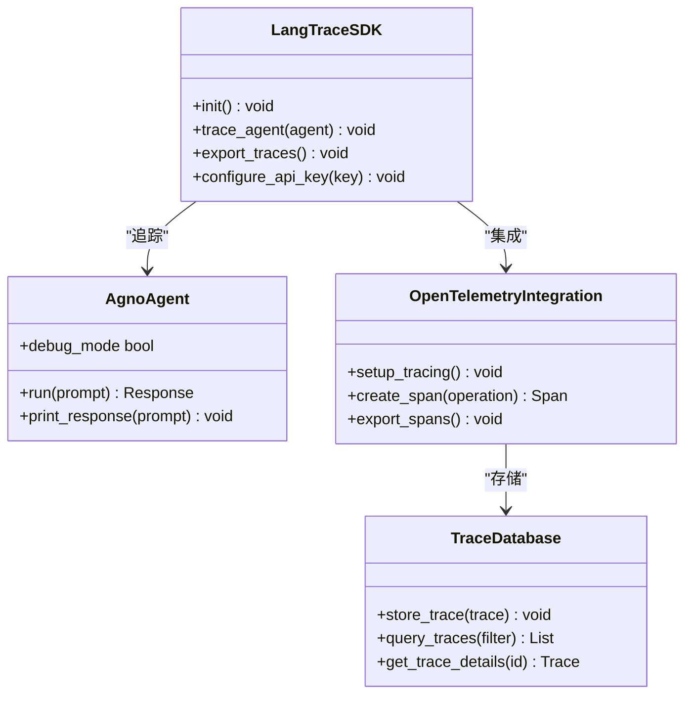
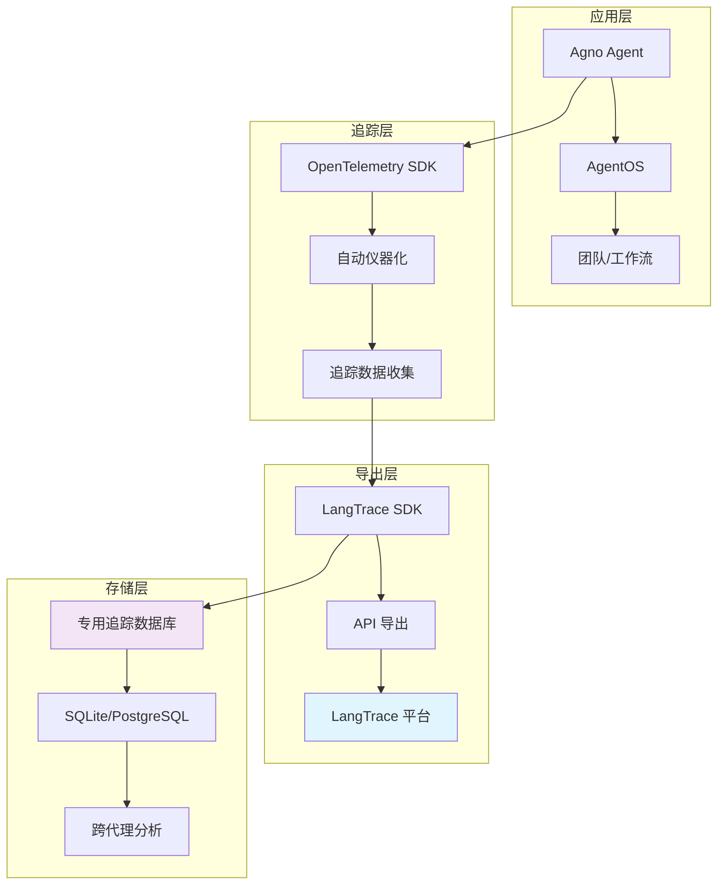
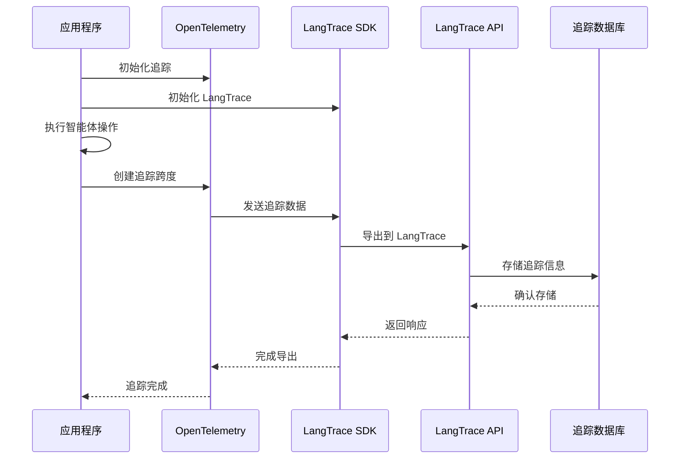
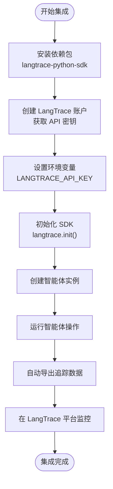
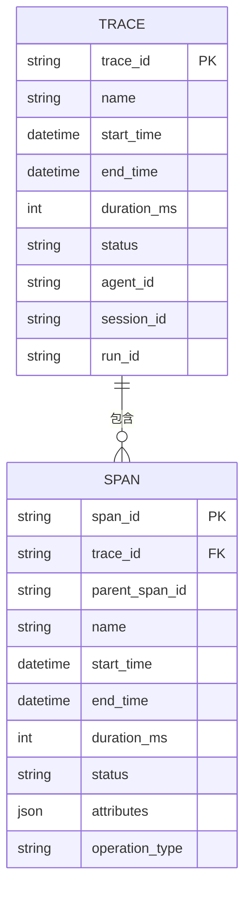
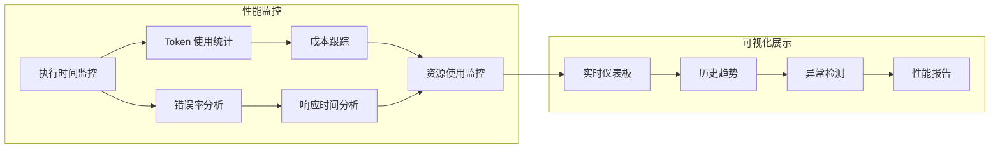
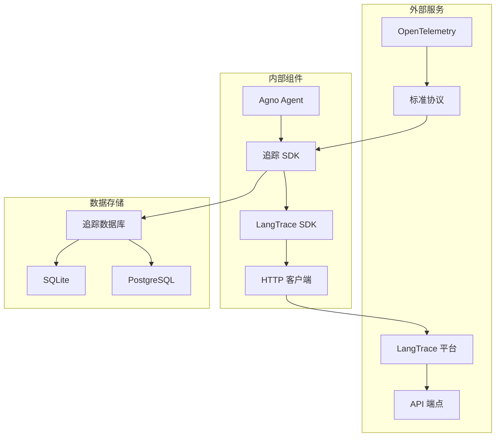
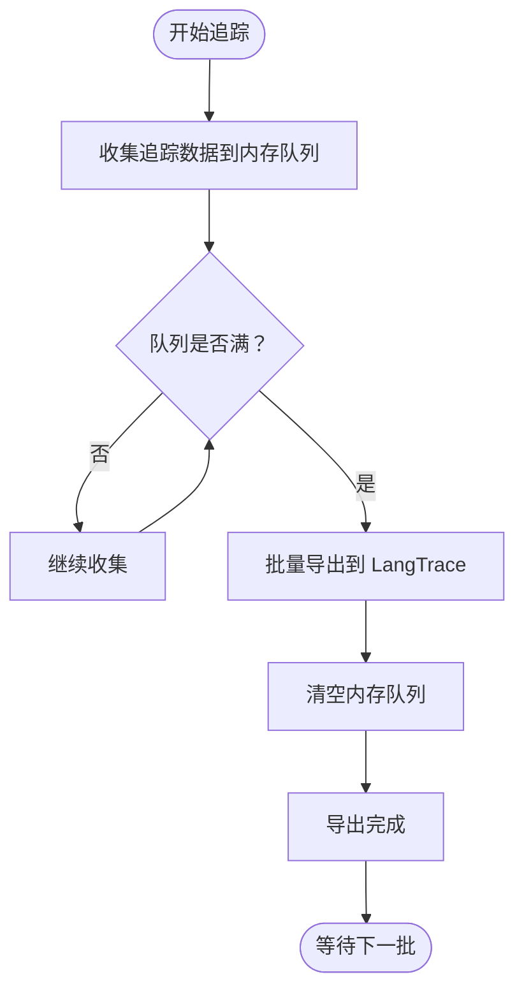
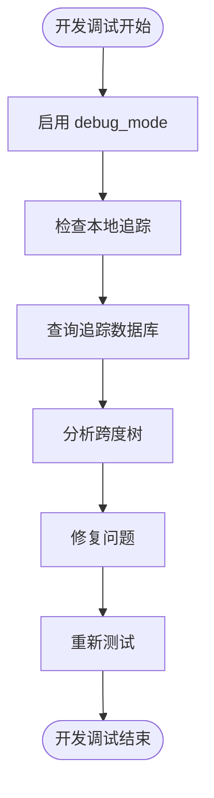

# LangTrace 集成

<cite>
**本文档引用的文件**
- [observability/langtrace.mdx](file://observability/langtrace.mdx)
- [examples/integrations/observability/langtrace-op.mdx](file://examples/integrations/observability/langtrace-op.mdx)
- [tracing/overview.mdx](file://tracing/overview.mdx)
- [tracing/basic-setup.mdx](file://tracing/basic-setup.mdx)
- [tracing/db-functions.mdx](file://tracing/db-functions.mdx)
- [observability/overview.mdx](file://observability/overview.mdx)
- [performance.mdx](file://performance.mdx)
</cite>

## 目录
1. [简介](#简介)
2. [项目结构](#项目结构)
3. [核心组件](#核心组件)
4. [架构概览](#架构概览)
5. [详细组件分析](#详细组件分析)
6. [依赖关系分析](#依赖关系分析)
7. [性能考虑](#性能考虑)
8. [故障排除指南](#故障排除指南)
9. [结论](#结论)
10. [附录](#附录)

## 简介

LangTrace 是一个强大的 AI 模型调用追踪和监控平台，通过与 Agno 集成，可以深入了解智能体的性能和行为。本文档提供了完整的 LangTrace 集成指南，包括追踪配置、环境设置和数据导出流程。

LangTrace 的核心功能包括：
- **链式追踪**：完整记录智能体执行流程
- **性能监控**：实时监控执行时间和资源使用
- **调试工具**：快速定位和解决执行问题
- **实时监控**：可视化展示执行状态
- **错误追踪**：精确捕获和分析异常
- **性能分析**：深入分析执行瓶颈

## 项目结构

Agno 项目采用模块化设计，LangTrace 集成主要涉及以下关键目录：



**图表来源**
- [observability/langtrace.mdx:1-65](file://observability/langtrace.mdx#L1-L65)
- [tracing/overview.mdx:1-158](file://tracing/overview.mdx#L1-L158)

**章节来源**
- [observability/langtrace.mdx:1-65](file://observability/langtrace.mdx#L1-L65)
- [tracing/overview.mdx:1-158](file://tracing/overview.mdx#L1-L158)

## 核心组件

### LangTrace SDK 集成

LangTrace 提供了专门的 Python SDK 来简化集成过程：



**图表来源**
- [observability/langtrace.mdx:37-58](file://observability/langtrace.mdx#L37-L58)
- [tracing/basic-setup.mdx:29-57](file://tracing/basic-setup.mdx#L29-L57)

### 追踪配置组件

Agno 的追踪系统基于 OpenTelemetry 标准，提供自动化的追踪配置：

| 组件 | 功能 | 配置选项 |
|------|------|----------|
| `setup_tracing()` | 启用追踪功能 | 数据库配置、批处理模式、队列大小 |
| `langtrace.init()` | 初始化 LangTrace SDK | API 密钥、导出配置 |
| `AgentOS` | 部署追踪 | tracing=True 参数 |
| `SqliteDb` | 追踪数据库 | 文件路径、连接参数 |

**章节来源**
- [tracing/basic-setup.mdx:21-95](file://tracing/basic-setup.mdx#L21-L95)
- [observability/langtrace.mdx:25-31](file://observability/langtrace.mdx#L25-L31)

## 架构概览

Agno 与 LangTrace 的集成架构采用分层设计，确保系统的可扩展性和可靠性：



**图表来源**
- [tracing/overview.mdx:17-88](file://tracing/overview.mdx#L17-L88)
- [observability/overview.mdx:14-23](file://observability/overview.mdx#L14-L23)

### 数据流架构



**图表来源**
- [examples/integrations/observability/langtrace-op.mdx:13-41](file://examples/integrations/observability/langtrace-op.mdx#L13-L41)

## 详细组件分析

### LangTrace SDK 集成流程

#### 基础集成步骤



**图表来源**
- [observability/langtrace.mdx:10-64](file://observability/langtrace.mdx#L10-L64)

#### 高级配置选项

| 配置项 | 类型 | 默认值 | 描述 |
|--------|------|--------|------|
| `batch_processing` | bool | False | 是否启用批处理模式 |
| `max_queue_size` | int | 2048 | 内存队列最大容量 |
| `max_export_batch_size` | int | 512 | 批量导出大小 |
| `schedule_delay_millis` | int | 5000 | 导出延迟毫秒数 |
| `db` | Database | None | 追踪数据库实例 |

**章节来源**
- [tracing/basic-setup.mdx:173-221](file://tracing/basic-setup.mdx#L173-L221)

### 追踪数据模型

#### Trace 和 Span 结构



**图表来源**
- [tracing/db-functions.mdx:12-116](file://tracing/db-functions.mdx#L12-L116)

#### 数据库查询接口

| 函数名 | 参数 | 返回值 | 用途 |
|--------|------|--------|------|
| `db.get_trace()` | trace_id 或 run_id | Trace 或 None | 获取单个追踪 |
| `db.get_traces()` | 多种过滤条件 | (List[Trace], int) | 获取多个追踪 |
| `db.get_span()` | span_id | Span 或 None | 获取单个跨度 |
| `db.get_spans()` | trace_id 或 parent_span_id | List[Span] | 获取跨度列表 |

**章节来源**
- [tracing/db-functions.mdx:10-149](file://tracing/db-functions.mdx#L10-L149)

### 性能监控特性

#### 实时性能指标

Agno 追踪系统提供以下性能监控能力：



**图表来源**
- [tracing/overview.mdx:23-37](file://tracing/overview.mdx#L23-L37)

**章节来源**
- [tracing/overview.mdx:23-37](file://tracing/overview.mdx#L23-L37)

## 依赖关系分析

### 外部依赖关系



**图表来源**
- [observability/overview.mdx:14-23](file://observability/overview.mdx#L14-L23)

### 内部耦合关系

| 组件 | 依赖组件 | 耦合程度 | 说明 |
|------|----------|----------|------|
| `setup_tracing()` | `SqliteDb` | 高 | 必需的数据库依赖 |
| `langtrace.init()` | `langtrace-python-sdk` | 高 | SDK 核心依赖 |
| `AgentOS` | `setup_tracing()` | 中 | 可选的集成方式 |
| `db.get_traces()` | `Trace` 模型 | 中 | 查询接口依赖 |

**章节来源**
- [tracing/basic-setup.mdx:97-95](file://tracing/basic-setup.mdx#L97-L95)

## 性能考虑

### 批处理模式优化

Agno 提供两种处理模式来平衡性能和实时性：

#### 批处理模式（推荐）



**图表来源**
- [tracing/basic-setup.mdx:177-189](file://tracing/basic-setup.mdx#L177-L189)

#### 简单处理模式

简单处理模式适用于开发和调试场景，提供即时可见性但有性能开销。

**章节来源**
- [tracing/basic-setup.mdx:200-221](file://tracing/basic-setup.mdx#L200-L221)

### 内存和性能基准

根据性能测试结果，Agno 在以下方面表现优异：

| 指标 | Agno | 其他框架对比 |
|------|------|-------------|
| 实例化时间 | 3μs | 最慢框架的 529× 更快 |
| 内存占用 | 6.6 KiB | 最慢框架的 24× 更小 |
| 并行执行 | 支持 | 需要额外配置 |

**章节来源**
- [performance.mdx:13-28](file://performance.mdx#L13-L28)

## 故障排除指南

### 常见问题及解决方案

#### 环境变量配置问题

**问题**：LangTrace API 密钥未正确设置
**解决方案**：
1. 确认 `LANGTRACE_API_KEY` 环境变量已设置
2. 验证密钥格式正确
3. 检查环境变量在启动时生效

#### 追踪数据缺失

**问题**：智能体运行后没有追踪数据
**排查步骤**：
1. 确认 `langtrace.init()` 在智能体创建前调用
2. 检查网络连接到 LangTrace 服务
3. 验证 API 密钥权限

#### 性能问题

**问题**：启用追踪后性能下降
**优化方案**：
1. 切换到批处理模式
2. 调整队列大小和导出间隔
3. 使用专用追踪数据库

**章节来源**
- [observability/langtrace.mdx:60-64](file://observability/langtrace.mdx#L60-L64)
- [tracing/basic-setup.mdx:55-57](file://tracing/basic-setup.mdx#L55-L57)

### 调试技巧

#### 开发环境调试



**图表来源**
- [tracing/db-functions.mdx:103-117](file://tracing/db-functions.mdx#L103-L117)

## 结论

LangTrace 与 Agno 的集成提供了企业级的 AI 智能体可观测性解决方案。通过自动化的追踪配置、灵活的数据导出和强大的分析工具，开发者可以获得：

1. **完整的执行视图**：从单个智能体到复杂工作流的全链路追踪
2. **实时监控能力**：及时发现和解决性能问题
3. **成本控制**：精确的 Token 使用和 API 调用监控
4. **合规保障**：完整的审计轨迹和错误追踪

建议在生产环境中采用批处理模式和专用追踪数据库，以获得最佳的性能和可靠性。

## 附录

### 配置模板

#### 基础配置模板

```python
# 基础 LangTrace 集成
from agno.agent import Agent
from agno.models.openai import OpenAIResponses
from langtrace_python_sdk import langtrace

# 初始化 LangTrace
langtrace.init()

# 创建智能体
agent = Agent(
    name="Stock Price Agent",
    model=OpenAIResponses(id="gpt-5.2"),
    instructions="You are a stock price agent...",
    debug_mode=True,
)

# 运行智能体
agent.print_response("What is the current price of Tesla?")
```

**章节来源**
- [observability/langtrace.mdx:37-58](file://observability/langtrace.mdx#L37-L58)

#### 高级配置模板

```python
# 高级追踪配置
from agno.tracing import setup_tracing
from agno.db.sqlite import SqliteDb

# 设置专用追踪数据库
db = SqliteDb(db_file="tmp/traces.db")

# 启用批处理模式
setup_tracing(
    db=db,
    batch_processing=True,
    max_queue_size=2048,
    max_export_batch_size=512,
    schedule_delay_millis=5000,
)

# 创建多个智能体共享追踪
agent1 = Agent(name="Agent 1", db=agent1_db)
agent2 = Agent(name="Agent 2", db=agent2_db)
```

**章节来源**
- [tracing/basic-setup.mdx:110-161](file://tracing/basic-setup.mdx#L110-L161)

### 最佳实践建议

1. **环境隔离**：为不同环境（开发、测试、生产）设置独立的 API 密钥
2. **数据库分离**：使用专用数据库存储追踪数据，避免与业务数据混合
3. **批处理优化**：生产环境使用批处理模式，合理配置队列大小
4. **监控告警**：设置关键指标的告警阈值，及时发现异常
5. **定期清理**：建立追踪数据的生命周期管理策略
6. **安全考虑**：限制 API 密钥权限，定期轮换密钥