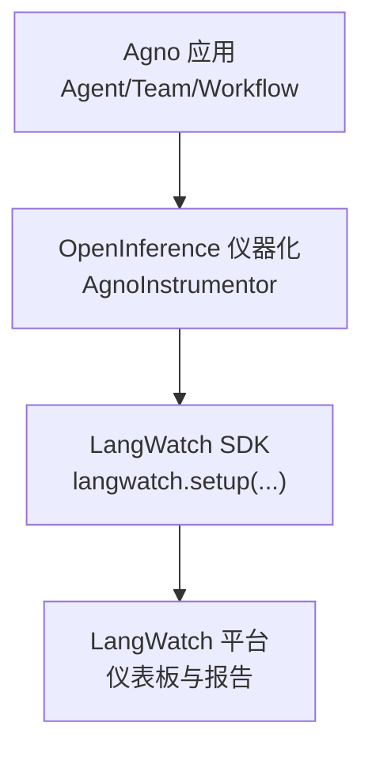
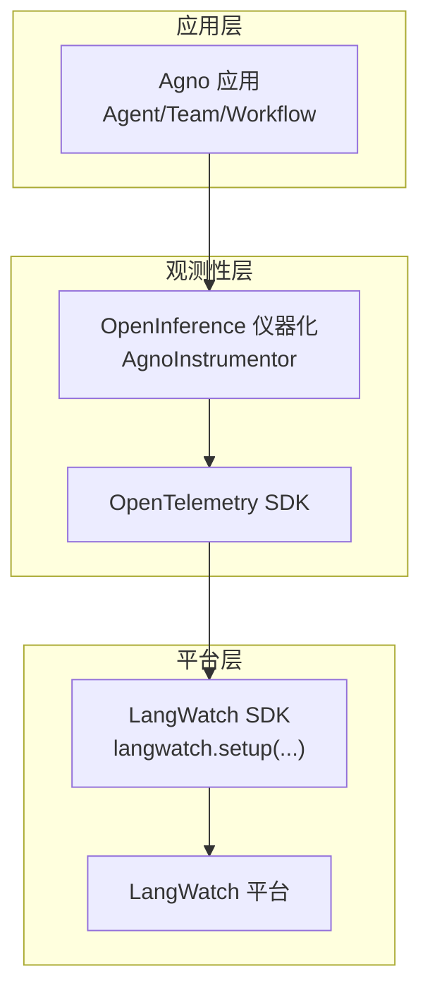
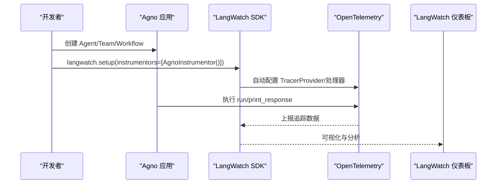
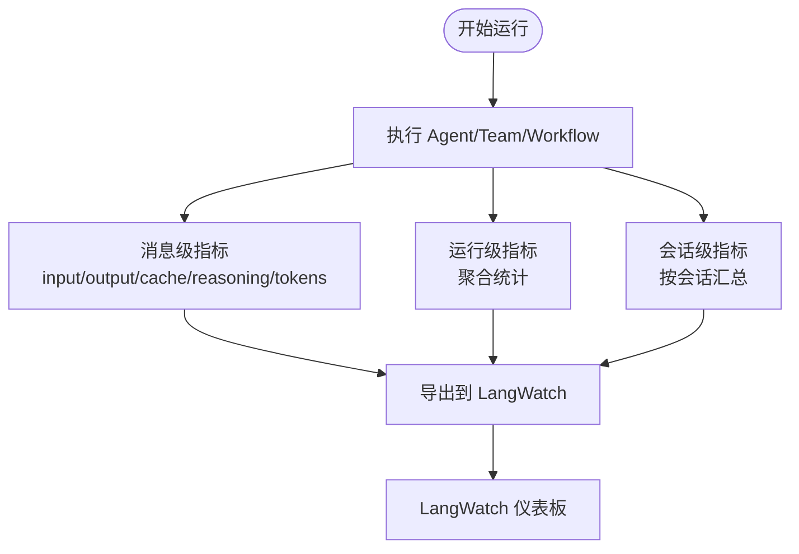
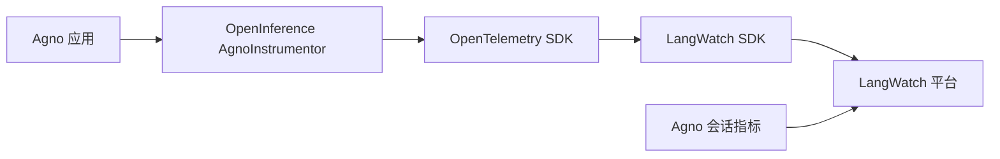

# LangWatch 集成

<cite>
**本文引用的文件**
- [observability/langwatch.mdx](file://observability/langwatch.mdx)
- [examples/integrations/observability/langwatch-op.mdx](file://examples/integrations/observability/langwatch-op.mdx)
- [observability/overview.mdx](file://observability/overview.mdx)
- [tracing/basic-setup.mdx](file://tracing/basic-setup.mdx)
- [sessions/metrics/overview.mdx](file://sessions/metrics/overview.mdx)
- [sessions/metrics/agent.mdx](file://sessions/metrics/agent.mdx)
- [sessions/metrics/team.mdx](file://sessions/metrics/team.mdx)
- [integrations/testing/overview.mdx](file://integrations/testing/overview.mdx)
</cite>

## 目录
1. [简介](#简介)
2. [项目结构](#项目结构)
3. [核心组件](#核心组件)
4. [架构总览](#架构总览)
5. [详细组件分析](#详细组件分析)
6. [依赖关系分析](#依赖关系分析)
7. [性能考虑](#性能考虑)
8. [故障排除指南](#故障排除指南)
9. [结论](#结论)
10. [附录](#附录)

## 简介
本指南面向在 Agno 中集成 LangWatch 的工程团队与平台工程师，系统讲解如何通过 OpenInference 与 LangWatch SDK 对 Agno 的代理（Agent）、团队（Team）与工作流（Workflow）进行自动观测性埋点，实现模型调用追踪、会话指标聚合、推理管道可视化与分析报告导出。LangWatch 作为 OpenTelemetry 兼容的观测平台，可直接接收由 Agno 自动注入的追踪数据，无需手动配置 OpenTelemetry 导出器。

LangWatch 的核心能力包括：
- 模型性能监控：输入/输出 token 数、时延、首 token 延迟、缓存命中等
- 数据质量跟踪：工具调用、消息内容、错误与异常
- 推理管道可视化：从用户输入到工具执行、模型生成的完整链路
- 会话级指标聚合：按会话维度汇总 token 使用与耗时
- 报告与评估：支持导出分析报告、RAG 元数据与评估指标

## 项目结构
与 LangWatch 集成相关的核心文档与示例位于以下路径：
- 观测性总览与平台能力：observability/overview.mdx
- LangWatch 集成文档：observability/langwatch.mdx
- 示例：examples/integrations/observability/langwatch-op.mdx
- 追踪基础配置：tracing/basic-setup.mdx
- 会话指标概览与示例：sessions/metrics/overview.mdx、sessions/metrics/agent.mdx、sessions/metrics/team.mdx
- 测试与模拟场景（含可选的 LangWatch API Key）：integrations/testing/overview.mdx

图表来源
- [observability/langwatch.mdx:35-63](file://observability/langwatch.mdx#L35-L63)
- [examples/integrations/observability/langwatch-op.mdx:19-23](file://examples/integrations/observability/langwatch-op.mdx#L19-L23)

章节来源
- [observability/overview.mdx:1-25](file://observability/overview.mdx#L1-L25)
- [observability/langwatch.mdx:1-71](file://observability/langwatch.mdx#L1-L71)
- [examples/integrations/observability/langwatch-op.mdx:1-56](file://examples/integrations/observability/langwatch-op.mdx#L1-L56)

## 核心组件
- LangWatch SDK：负责初始化与自动配置 OpenTelemetry，将追踪数据发送至 LangWatch 平台
- OpenInference Agno 仪器化：对 Agno 的 Agent/Team/Workflow 调用进行自动埋点
- Agno 会话指标：提供每条消息、每次运行与会话级别的指标，便于在 LangWatch 中进行聚合与分析
- 环境变量：LANGWATCH_API_KEY 用于认证与数据上报

章节来源
- [observability/langwatch.mdx:10-31](file://observability/langwatch.mdx#L10-L31)
- [observability/langwatch.mdx:35-63](file://observability/langwatch.mdx#L35-L63)
- [sessions/metrics/overview.mdx:8-38](file://sessions/metrics/overview.mdx#L8-L38)

## 架构总览
下图展示了 Agno 与 LangWatch 的集成架构，强调自动仪器化与平台兼容性：

图表来源
- [observability/overview.mdx:14-23](file://observability/overview.mdx#L14-L23)
- [observability/langwatch.mdx:35-63](file://observability/langwatch.mdx#L35-L63)

## 详细组件分析

### 组件一：LangWatch 初始化与自动仪器化
- 安装依赖：langwatch、agno、openinference-instrumentation-agno
- 设置环境变量：LANGWATCH_API_KEY
- 初始化：调用 langwatch.setup(instrumentors=[AgnoInstrumentor()])，自动完成 OpenTelemetry 配置
- 行为：所有 Agno 的 Agent/Team/Workflow 调用将被自动追踪并发送到 LangWatch

图表来源
- [observability/langwatch.mdx:39-61](file://observability/langwatch.mdx#L39-L61)
- [examples/integrations/observability/langwatch-op.mdx:22-42](file://examples/integrations/observability/langwatch-op.mdx#L22-L42)

章节来源
- [observability/langwatch.mdx:12-31](file://observability/langwatch.mdx#L12-L31)
- [observability/langwatch.mdx:35-63](file://observability/langwatch.mdx#L35-L63)
- [examples/integrations/observability/langwatch-op.mdx:13-43](file://examples/integrations/observability/langwatch-op.mdx#L13-L43)

### 组件二：会话指标采集与聚合
- 指标维度：消息级、运行级、会话级
- 关键指标：input_tokens、output_tokens、total_tokens、duration、time_to_first_token、cache_*、reasoning_tokens、provider_metrics
- 使用方式：在运行后打印或导出 metrics，结合 LangWatch 进行趋势分析与异常定位

图表来源
- [sessions/metrics/overview.mdx:8-38](file://sessions/metrics/overview.mdx#L8-L38)
- [sessions/metrics/agent.mdx:60-71](file://sessions/metrics/agent.mdx#L60-L71)
- [sessions/metrics/team.mdx:88-101](file://sessions/metrics/team.mdx#L88-L101)

章节来源
- [sessions/metrics/overview.mdx:8-38](file://sessions/metrics/overview.mdx#L8-L38)
- [sessions/metrics/agent.mdx:16-71](file://sessions/metrics/agent.mdx#L16-L71)
- [sessions/metrics/team.mdx:17-101](file://sessions/metrics/team.mdx#L17-L101)

### 组件三：测试与场景模拟（可选）
- 在测试场景中可选地设置 LANGWATCH_API_KEY，以启用模拟场景的观测数据上报
- 依赖：pytest、langwatch-scenario、agno、openai

章节来源
- [integrations/testing/overview.mdx:66-91](file://integrations/testing/overview.mdx#L66-L91)

## 依赖关系分析
- LangWatch 与 OpenTelemetry 的关系：LangWatch SDK 自动处理 OpenTelemetry 的配置与导出，简化了集成复杂度
- Agno 与 OpenInference：通过 AgnoInstrumentor 实现对 Agent/Team/Workflow 的自动仪器化
- 指标体系：Agno 提供多层级指标，LangWatch 支持对这些指标进行可视化与聚合

图表来源
- [observability/overview.mdx:14-23](file://observability/overview.mdx#L14-L23)
- [observability/langwatch.mdx:35-63](file://observability/langwatch.mdx#L35-L63)
- [sessions/metrics/overview.mdx:8-38](file://sessions/metrics/overview.mdx#L8-L38)

章节来源
- [observability/overview.mdx:14-23](file://observability/overview.mdx#L14-L23)
- [observability/langwatch.mdx:35-63](file://observability/langwatch.mdx#L35-L63)
- [sessions/metrics/overview.mdx:8-38](file://sessions/metrics/overview.mdx#L8-L38)

## 性能考虑
- 自动仪器化开销：OpenInference 与 LangWatch SDK 的默认配置已针对生产环境做了优化，通常对延迟影响较小
- 指标粒度：消息级指标有助于精确定位瓶颈，但也会增加数据量；建议在关键场景开启消息级指标
- 会话聚合：使用会话级指标进行长期趋势分析，降低高频数据对平台的压力
- 环境变量与密钥：确保 LANGWATCH_API_KEY 正确配置，避免因认证失败导致的数据丢失

## 故障排除指南
- 症状：无法看到任何追踪数据
  - 检查 LANGWATCH_API_KEY 是否正确设置
  - 确认已调用 langwatch.setup(instrumentors=[AgnoInstrumentor()]) 且未被覆盖
  - 验证网络连通性与平台可用性
- 症状：指标缺失或不完整
  - 确保运行后访问 RunOutput.metrics 与会话级指标接口
  - 检查是否启用了 store_member_responses（团队场景）
- 症状：测试场景无观测数据
  - 在测试环境中可选设置 LANGWATCH_API_KEY，参考测试示例中的步骤

章节来源
- [observability/langwatch.mdx:65-70](file://observability/langwatch.mdx#L65-L70)
- [integrations/testing/overview.mdx:70-75](file://integrations/testing/overview.mdx#L70-L75)

## 结论
通过 LangWatch 与 OpenInference 的无缝集成，Agno 能够在不改变业务代码的情况下，自动捕获代理执行的全链路数据，并在 LangWatch 平台上进行可视化与分析。配合会话指标体系，团队可以快速定位性能瓶颈、评估数据质量并持续优化推理管道。

## 附录

### 快速开始清单
- 安装依赖：langwatch、agno、openinference-instrumentation-agno
- 设置环境变量：LANGWATCH_API_KEY
- 初始化：langwatch.setup(instrumentors=[AgnoInstrumentor()])
- 运行 Agent/Team/Workflow，查看 LangWatch 仪表板

章节来源
- [observability/langwatch.mdx:12-31](file://observability/langwatch.mdx#L12-L31)
- [observability/langwatch.mdx:35-63](file://observability/langwatch.mdx#L35-L63)