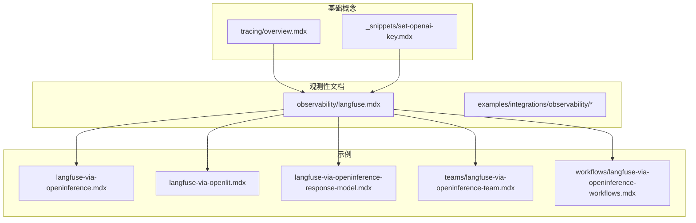
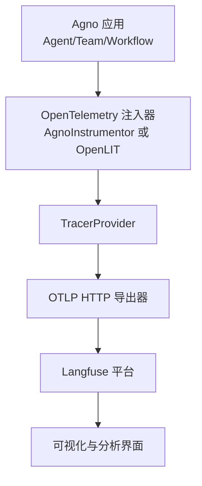
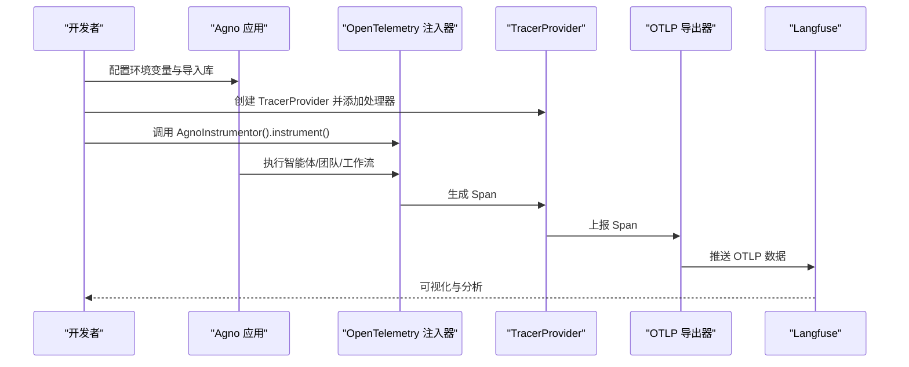
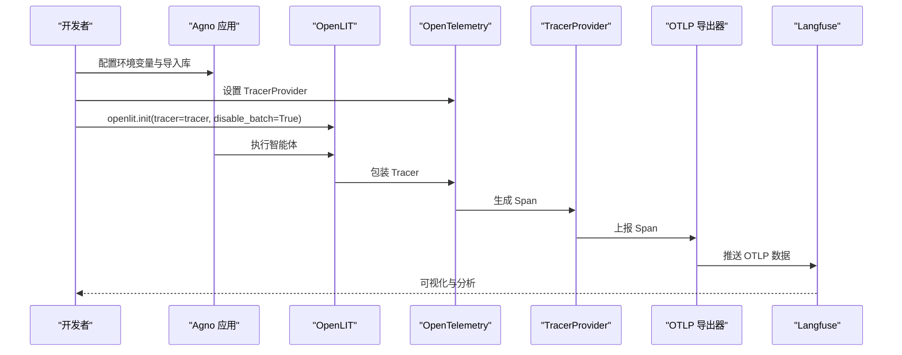
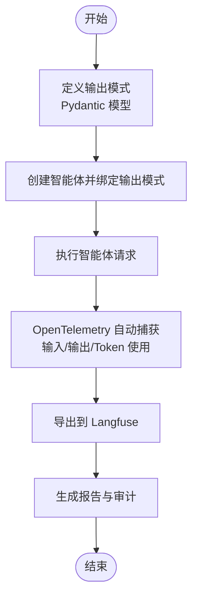
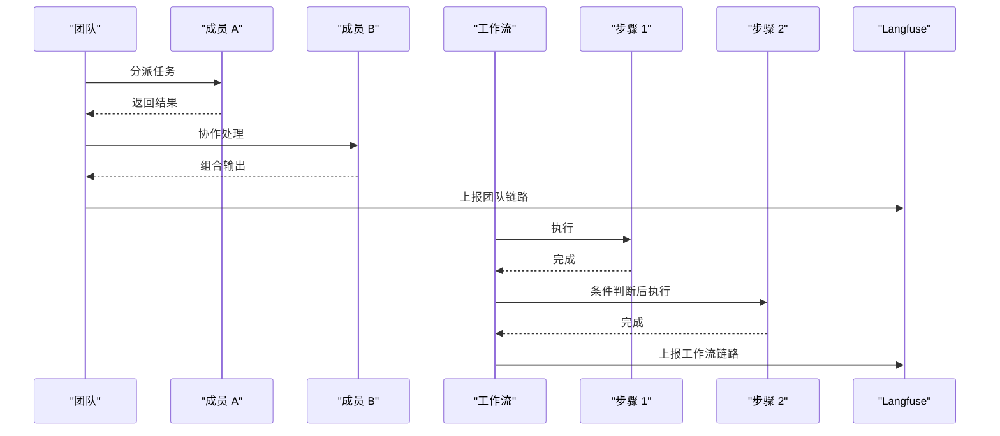
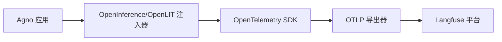

# Langfuse 集成

<cite>
**本文引用的文件**
- [langfuse.mdx](file://observability/langfuse.mdx)
- [langfuse-via-openinference.mdx](file://examples/integrations/observability/langfuse-via-openinference.mdx)
- [langfuse-via-openlit.mdx](file://examples/integrations/observability/langfuse-via-openlit.mdx)
- [langfuse-via-openinference-response-model.mdx](file://examples/integrations/observability/langfuse-via-openinference-response-model.mdx)
- [langfuse-via-openinference-team.mdx](file://examples/integrations/observability/teams/langfuse-via-openinference-team.mdx)
- [langfuse-via-openinference-workflows.mdx](file://examples/integrations/observability/workflows/langfuse-via-openinference-workflows.mdx)
- [tracing/overview.mdx](file://tracing/overview.mdx)
- [set-openai-key.mdx](file://_snippets/set-openai-key.mdx)
</cite>

## 目录
1. [简介](#简介)
2. [项目结构](#项目结构)
3. [核心组件](#核心组件)
4. [架构总览](#架构总览)
5. [详细组件分析](#详细组件分析)
6. [依赖关系分析](#依赖关系分析)
7. [性能考虑](#性能考虑)
8. [故障排除指南](#故障排除指南)
9. [结论](#结论)
10. [附录](#附录)

## 简介
本指南面向希望在 Agno 中集成 Langfuse 观测性的工程师与技术负责人。Langfuse 是一个开源的大模型观测平台，通过 OpenTelemetry 标准化链路追踪，可完整记录模型调用、工具执行、会话指标等关键行为，帮助实现对话追踪、模型使用分析与成本监控，并支持导出分析报告。

本指南覆盖：
- API 密钥与环境变量配置
- 初始化与启动流程（OpenInference 与 OpenLIT 两种方式）
- 核心功能：对话追踪、模型使用分析、成本监控
- 实战示例：单智能体、团队、工作流、结构化输出
- Langfuse 特性：用户体验追踪、A/B 测试支持、团队协作
- 配置模板、错误处理策略与性能优化建议
- 实际部署示例与故障排除

## 项目结构
与 Langfuse 集成相关的核心文档与示例位于以下路径：
- 观测性平台总览与 Langfuse 专用文档
- 多种集成示例（单智能体、响应模型、团队、工作流、OpenLIT）
- 基础追踪概念与最佳实践

**图表来源**
- [langfuse.mdx:1-133](file://observability/langfuse.mdx#L1-L133)
- [langfuse-via-openinference.mdx:1-91](file://examples/integrations/observability/langfuse-via-openinference.mdx#L1-L91)
- [langfuse-via-openlit.mdx:1-94](file://examples/integrations/observability/langfuse-via-openlit.mdx#L1-L94)
- [langfuse-via-openinference-response-model.mdx:1-99](file://examples/integrations/observability/langfuse-via-openinference-response-model.mdx#L1-L99)
- [langfuse-via-openinference-team.mdx:1-144](file://examples/integrations/observability/teams/langfuse-via-openinference-team.mdx#L1-L144)
- [langfuse-via-openinference-workflows.mdx:1-162](file://examples/integrations/observability/workflows/langfuse-via-openinference-workflows.mdx#L1-L162)
- [tracing/overview.mdx:1-158](file://tracing/overview.mdx#L1-L158)
- [_snippets/set-openai-key.mdx:1-15](file://_snippets/set-openai-key.mdx#L1-L15)

**章节来源**
- [langfuse.mdx:1-133](file://observability/langfuse.mdx#L1-L133)
- [tracing/overview.mdx:1-158](file://tracing/overview.mdx#L1-L158)

## 核心组件
- 追踪提供器与导出器
  - 使用 OpenTelemetry TracerProvider 与 OTLP HTTP 导出器，将链路数据发送至 Langfuse。
- OpenInference 与 OpenLIT 两种注入方式
  - OpenInference：通过 AgnoInstrumentor 自动注入，零代码改造即可采集。
  - OpenLIT：通过 openlit.init 对 OpenTelemetry Tracer 进行包装，适合特定场景。
- 智能体、团队与工作流
  - 单智能体：记录一次完整交互的链路。
  - 团队：记录多成员协作与决策过程。
  - 工作流：记录多步骤编排与条件判断。
- 结构化输出
  - 通过输出模式（Pydantic）增强可观测性，便于后续分析与报告生成。

**章节来源**
- [langfuse.mdx:36-133](file://observability/langfuse.mdx#L36-L133)
- [langfuse-via-openinference.mdx:13-71](file://examples/integrations/observability/langfuse-via-openinference.mdx#L13-L71)
- [langfuse-via-openlit.mdx:13-74](file://examples/integrations/observability/langfuse-via-openlit.mdx#L13-L74)
- [langfuse-via-openinference-response-model.mdx:13-79](file://examples/integrations/observability/langfuse-via-openinference-response-model.mdx#L13-L79)
- [langfuse-via-openinference-team.mdx:13-124](file://examples/integrations/observability/teams/langfuse-via-openinference-team.mdx#L13-L124)
- [langfuse-via-openinference-workflows.mdx:13-142](file://examples/integrations/observability/workflows/langfuse-via-openinference-workflows.mdx#L13-L142)

## 架构总览
下图展示了 Agno 与 Langfuse 的集成架构：应用层通过 OpenTelemetry 注入器捕获链路，TracerProvider 将 Span 发送到 OTLP 导出器，最终由 Langfuse 接收并可视化。

**图表来源**
- [langfuse.mdx:36-133](file://observability/langfuse.mdx#L36-L133)
- [langfuse-via-openinference.mdx:25-46](file://examples/integrations/observability/langfuse-via-openinference.mdx#L25-L46)
- [langfuse-via-openlit.mdx:20-56](file://examples/integrations/observability/langfuse-via-openlit.mdx#L20-L56)

## 详细组件分析

### 组件 A：OpenInference 方式集成
- 关键点
  - 通过环境变量设置 Langfuse 认证与 OTLP 端点。
  - 创建 TracerProvider 并注册 SimpleSpanProcessor + OTLPSpanExporter。
  - 调用 AgnoInstrumentor().instrument() 启用自动注入。
  - 支持同步与异步运行，适用于单智能体、团队与工作流。
- 示例路径
  - [langfuse-via-openinference.mdx:25-71](file://examples/integrations/observability/langfuse-via-openinference.mdx#L25-L71)
  - [langfuse-via-openinference-response-model.mdx:26-79](file://examples/integrations/observability/langfuse-via-openinference-response-model.mdx#L26-L79)
  - [langfuse-via-openinference-team.mdx:28-124](file://examples/integrations/observability/teams/langfuse-via-openinference-team.mdx#L28-L124)
  - [langfuse-via-openinference-workflows.mdx:27-142](file://examples/integrations/observability/workflows/langfuse-via-openinference-workflows.mdx#L27-L142)

**图表来源**
- [langfuse-via-openinference.mdx:25-46](file://examples/integrations/observability/langfuse-via-openinference.mdx#L25-L46)
- [langfuse.mdx:36-79](file://observability/langfuse.mdx#L36-L79)

**章节来源**
- [langfuse-via-openinference.mdx:1-91](file://examples/integrations/observability/langfuse-via-openinference.mdx#L1-L91)
- [langfuse-via-openinference-response-model.mdx:1-99](file://examples/integrations/observability/langfuse-via-openinference-response-model.mdx#L1-L99)
- [langfuse-via-openinference-team.mdx:1-144](file://examples/integrations/observability/teams/langfuse-via-openinference-team.mdx#L1-L144)
- [langfuse-via-openinference-workflows.mdx:1-162](file://examples/integrations/observability/workflows/langfuse-via-openinference-workflows.mdx#L1-L162)

### 组件 B：OpenLIT 方式集成
- 关键点
  - 通过 openlit.init 包装 OpenTelemetry Tracer，禁用批量以即时上报。
  - 与 OpenInference 类似，但注入路径不同，适合特定场景或已有 OpenLIT 生态。
- 示例路径
  - [langfuse-via-openlit.mdx:20-74](file://examples/integrations/observability/langfuse-via-openlit.mdx#L20-L74)

**图表来源**
- [langfuse-via-openlit.mdx:20-56](file://examples/integrations/observability/langfuse-via-openlit.mdx#L20-L56)
- [langfuse.mdx:81-123](file://observability/langfuse.mdx#L81-L123)

**章节来源**
- [langfuse-via-openlit.mdx:1-94](file://examples/integrations/observability/langfuse-via-openlit.mdx#L1-L94)

### 组件 C：结构化输出与响应模型
- 关键点
  - 通过 Pydantic 输出模式（如结构化股票价格模型）增强可观测性。
  - Langfuse 可捕获模型输出与上下文，便于后续审计与报告。
- 示例路径
  - [langfuse-via-openinference-response-model.mdx:47-79](file://examples/integrations/observability/langfuse-via-openinference-response-model.mdx#L47-L79)

**图表来源**
- [langfuse-via-openinference-response-model.mdx:47-79](file://examples/integrations/observability/langfuse-via-openinference-response-model.mdx#L47-L79)
- [langfuse.mdx:36-79](file://observability/langfuse.mdx#L36-L79)

**章节来源**
- [langfuse-via-openinference-response-model.mdx:1-99](file://examples/integrations/observability/langfuse-via-openinference-response-model.mdx#L1-L99)

### 组件 D：团队与工作流追踪
- 关键点
  - 团队：记录多成员协作、指令与响应，支持同步与异步运行。
  - 工作流：记录多步骤、条件判断与分支，便于定位瓶颈与异常。
- 示例路径
  - [langfuse-via-openinference-team.mdx:50-124](file://examples/integrations/observability/teams/langfuse-via-openinference-team.mdx#L50-L124)
  - [langfuse-via-openinference-workflows.mdx:50-142](file://examples/integrations/observability/workflows/langfuse-via-openinference-workflows.mdx#L50-L142)

**图表来源**
- [langfuse-via-openinference-team.mdx:50-124](file://examples/integrations/observability/teams/langfuse-via-openinference-team.mdx#L50-L124)
- [langfuse-via-openinference-workflows.mdx:50-142](file://examples/integrations/observability/workflows/langfuse-via-openinference-workflows.mdx#L50-L142)

**章节来源**
- [langfuse-via-openinference-team.mdx:1-144](file://examples/integrations/observability/teams/langfuse-via-openinference-team.mdx#L1-L144)
- [langfuse-via-openinference-workflows.mdx:1-162](file://examples/integrations/observability/workflows/langfuse-via-openinference-workflows.mdx#L1-L162)

## 依赖关系分析
- 组件耦合
  - Agno 应用与 OpenTelemetry 注入器解耦，通过环境变量与 TracerProvider 配置。
  - 导出器与 Langfuse 解耦，可通过更换端点适配不同区域或自托管。
- 外部依赖
  - OpenInference、OpenLIT、OpenTelemetry SDK、OTLP 导出器、Langfuse 平台。
- 潜在循环依赖
  - 无直接循环；注入器仅在启动时注册，不依赖应用内部逻辑。

**图表来源**
- [langfuse.mdx:36-133](file://observability/langfuse.mdx#L36-L133)
- [langfuse-via-openinference.mdx:13-46](file://examples/integrations/observability/langfuse-via-openinference.mdx#L13-L46)
- [langfuse-via-openlit.mdx:13-56](file://examples/integrations/observability/langfuse-via-openlit.mdx#L13-L56)

**章节来源**
- [langfuse.mdx:36-133](file://observability/langfuse.mdx#L36-L133)

## 性能考虑
- 批量与延迟
  - OpenLIT 示例中禁用批量以降低延迟，适合实时观测。
  - OpenInference 默认批量策略更利于吞吐，可根据场景权衡。
- 端点选择
  - 根据数据区域选择 OTLP 端点（US/EU/本地），减少网络开销。
- 资源隔离
  - 在生产环境使用独立数据库存储追踪数据，避免与业务数据争抢资源。
- 非阻塞
  - OpenTelemetry 导出默认非阻塞，不影响智能体执行速度。

[本节为通用指导，无需具体文件分析]

## 故障排除指南
- 环境变量未设置
  - 确认已正确导出 Langfuse 公钥/密钥与 OTLP 端点。
  - 参考：[langfuse.mdx:25-32](file://observability/langfuse.mdx#L25-L32)
- 认证失败
  - 检查公钥/密钥是否匹配，确认 Authorization 头格式。
  - 参考：[langfuse.mdx:53-58](file://observability/langfuse.mdx#L53-L58)
- 端点不可达
  - 切换至其他数据区域或本地部署端点。
  - 参考：[langfuse.mdx:128-131](file://observability/langfuse.mdx#L128-L131)
- OpenLIT 批量导致延迟
  - 将 disable_batch 设为 True 以即时上报。
  - 参考：[langfuse-via-openlit.mdx:54-55](file://examples/integrations/observability/langfuse-via-openlit.mdx#L54-L55)
- OpenInference 注入未生效
  - 确保在创建智能体前调用 instrument()，并正确配置 TracerProvider。
  - 参考：[langfuse-via-openinference.mdx:44-46](file://examples/integrations/observability/langfuse-via-openinference.mdx#L44-L46)
- 模型密钥问题
  - 若涉及模型调用，确保已设置模型提供商密钥。
  - 参考：[_snippets/set-openai-key.mdx:1-15](file://_snippets/set-openai-key.mdx#L1-L15)

**章节来源**
- [langfuse.mdx:25-32](file://observability/langfuse.mdx#L25-L32)
- [langfuse.mdx:53-58](file://observability/langfuse.mdx#L53-L58)
- [langfuse.mdx:128-131](file://observability/langfuse.mdx#L128-L131)
- [langfuse-via-openlit.mdx:54-55](file://examples/integrations/observability/langfuse-via-openlit.mdx#L54-L55)
- [langfuse-via-openinference.mdx:44-46](file://examples/integrations/observability/langfuse-via-openinference.mdx#L44-L46)
- [_snippets/set-openai-key.mdx:1-15](file://_snippets/set-openai-key.mdx#L1-L15)

## 结论
通过 OpenInference 与 OpenLIT 两种方式，Agno 可无缝接入 Langfuse，实现从单智能体到团队与工作流的全链路观测。结合结构化输出与会话指标，可完成对话追踪、模型使用分析与成本监控，并支持导出分析报告。建议在生产环境中采用独立数据库、合理配置端点与批量策略，并持续关注认证与网络连通性。

[本节为总结，无需具体文件分析]

## 附录

### 配置模板
- 环境变量
  - LANGFUSE_PUBLIC_KEY：Langfuse 公钥
  - LANGFUSE_SECRET_KEY：Langfuse 秘钥
  - OTEL_EXPORTER_OTLP_ENDPOINT：Langfuse OTLP 端点（按区域选择）
  - OTEL_EXPORTER_OTLP_HEADERS：Authorization 头（Basic 认证）
- 参考路径
  - [langfuse.mdx:25-32](file://observability/langfuse.mdx#L25-L32)
  - [langfuse.mdx:53-58](file://observability/langfuse.mdx#L53-L58)
  - [langfuse.mdx:128-131](file://observability/langfuse.mdx#L128-L131)

### 错误处理策略
- 认证失败：检查公钥/密钥与授权头格式。
- 端点不可达：切换至其他区域或本地部署。
- 注入未生效：确保在创建智能体前调用 instrument()。
- 参考路径
  - [langfuse.mdx:125-131](file://observability/langfuse.mdx#L125-L131)
  - [langfuse-via-openinference.mdx:44-46](file://examples/integrations/observability/langfuse-via-openinference.mdx#L44-L46)
  - [langfuse-via-openlit.mdx:54-55](file://examples/integrations/observability/langfuse-via-openlit.mdx#L54-L55)

### 性能优化建议
- 选择合适的批量策略（OpenLIT 禁用批量以降低延迟；OpenInference 默认批量提升吞吐）。
- 根据数据区域选择 OTLP 端点，减少网络延迟。
- 在生产环境使用独立数据库存储追踪数据。
- 参考路径
  - [langfuse-via-openlit.mdx:54-55](file://examples/integrations/observability/langfuse-via-openlit.mdx#L54-L55)
  - [langfuse.mdx:128-131](file://observability/langfuse.mdx#L128-L131)

### 实际部署示例
- 单智能体示例
  - [langfuse-via-openinference.mdx:62-71](file://examples/integrations/observability/langfuse-via-openinference.mdx#L62-L71)
  - [langfuse-via-openlit.mdx:72-74](file://examples/integrations/observability/langfuse-via-openlit.mdx#L72-L74)
- 团队示例
  - [langfuse-via-openinference-team.mdx:103-124](file://examples/integrations/observability/teams/langfuse-via-openinference-team.mdx#L103-L124)
- 工作流示例
  - [langfuse-via-openinference-workflows.mdx:128-142](file://examples/integrations/observability/workflows/langfuse-via-openinference-workflows.mdx#L128-L142)
- 结构化输出示例
  - [langfuse-via-openinference-response-model.mdx:77-79](file://examples/integrations/observability/langfuse-via-openinference-response-model.mdx#L77-L79)

### Langfuse 独特特性与最佳实践
- 用户体验追踪
  - 通过链路中的输入/输出与 Token 使用，构建用户交互画像。
- A/B 测试支持
  - 通过不同配置与模型版本对比链路与指标，评估效果。
- 团队协作
  - 团队与工作流的链路可作为协作审计与复盘依据。
- 参考路径
  - [tracing/overview.mdx:23-37](file://tracing/overview.mdx#L23-L37)
  - [langfuse-via-openinference-team.mdx:80-97](file://examples/integrations/observability/teams/langfuse-via-openinference-team.mdx#L80-L97)
  - [langfuse-via-openinference-workflows.mdx:108-122](file://examples/integrations/observability/workflows/langfuse-via-openinference-workflows.mdx#L108-L122)