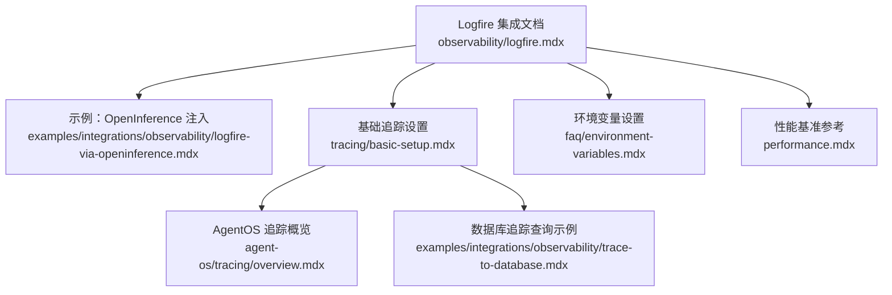
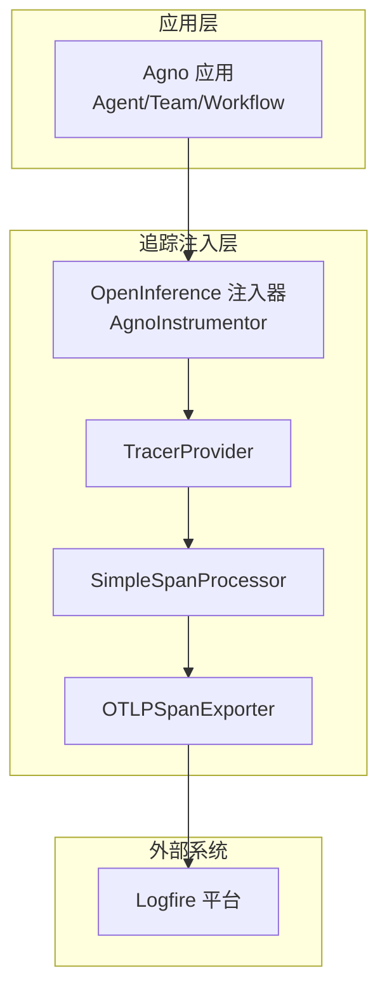
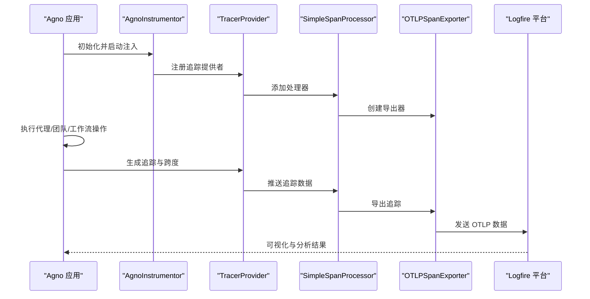
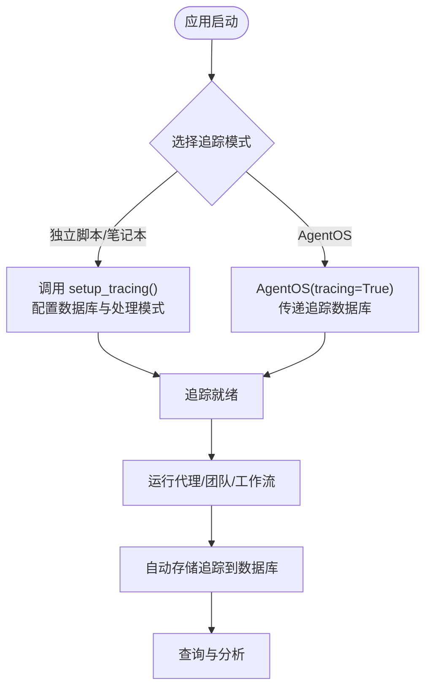
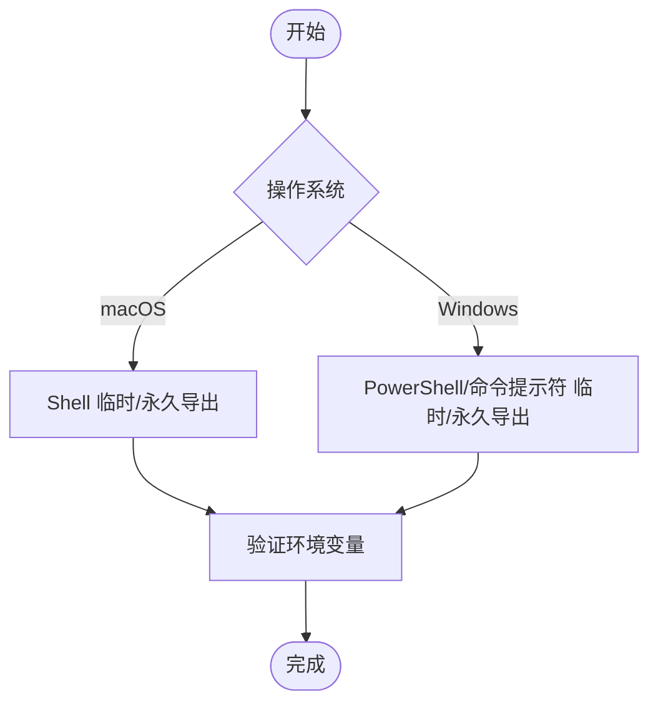
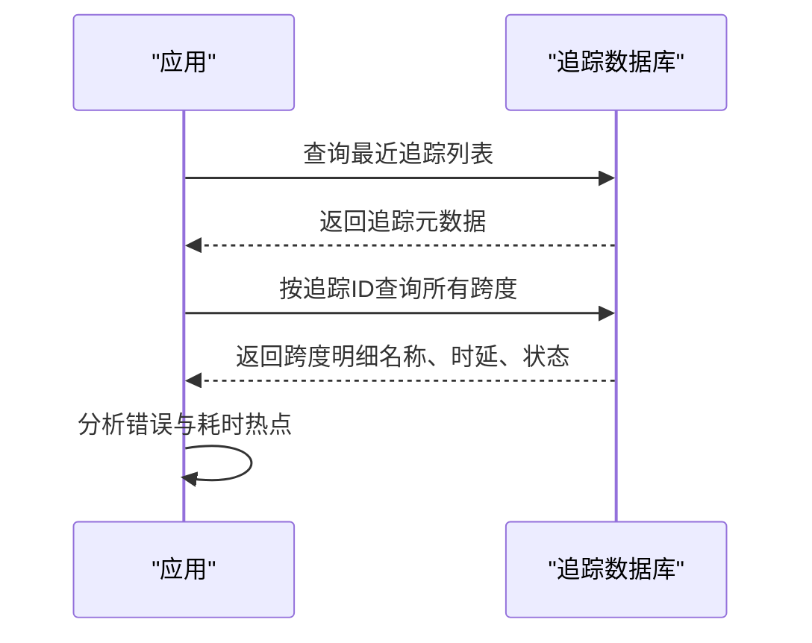
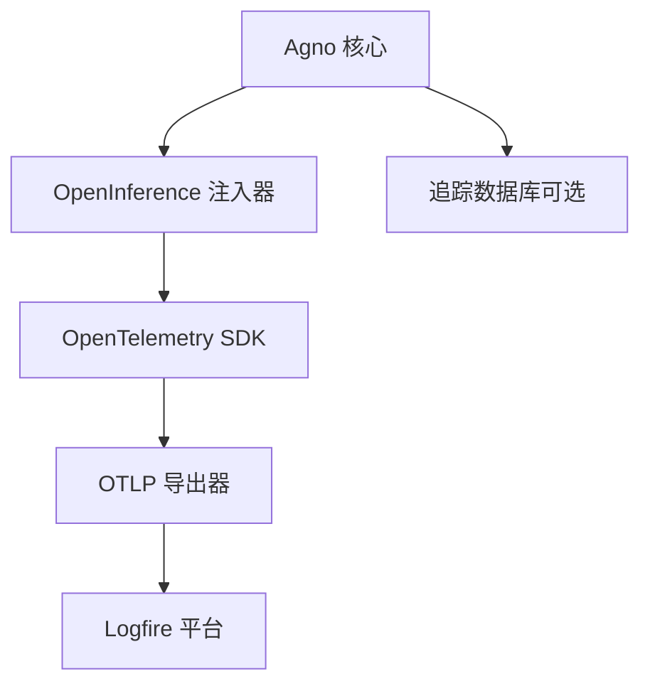

# Logfire 集成

<cite>
**本文引用的文件**
- [observability/logfire.mdx](file://observability/logfire.mdx)
- [examples/integrations/observability/logfire-via-openinference.mdx](file://examples/integrations/observability/logfire-via-openinference.mdx)
- [TBD/pages/cookbook/observability/overview.mdx](file://TBD/pages/cookbook/observability/overview.mdx)
- [tracing/basic-setup.mdx](file://tracing/basic-setup.mdx)
- [agent-os/tracing/overview.mdx](file://agent-os/tracing/overview.mdx)
- [faq/environment-variables.mdx](file://faq/environment-variables.mdx)
- [performance.mdx](file://performance.mdx)
- [examples/integrations/observability/trace-to-database.mdx](file://examples/integrations/observability/trace-to-database.mdx)
</cite>

## 目录
1. [简介](#简介)
2. [项目结构](#项目结构)
3. [核心组件](#核心组件)
4. [架构总览](#架构总览)
5. [详细组件分析](#详细组件分析)
6. [依赖关系分析](#依赖关系分析)
7. [性能考量](#性能考量)
8. [故障排除指南](#故障排除指南)
9. [结论](#结论)
10. [附录](#附录)

## 简介
本文件面向希望在 Agno 中集成 Logfire 的用户，系统性地介绍如何通过 OpenInference 对 Agno 进行可观测性注入，并将追踪数据发送到 Logfire 平台。内容涵盖：
- API 密钥与环境变量配置
- 客户端初始化与追踪启用方式
- 核心功能：日志聚合、性能监控、调试工具
- 实战示例：启用追踪、记录代理交互、分析性能指标
- 独特特性：实时日志流、错误追踪、性能分析
- 配置模板、最佳实践与常见问题排查

## 项目结构
与 Logfire 集成相关的核心文档分布在以下位置：
- 观测性集成文档：用于说明如何将 Agno 与 Logfire 结合
- 示例工程：展示通过 OpenInference 注入并发送追踪数据
- 基础追踪设置：说明如何在本地或 AgentOS 中启用追踪
- 环境变量设置：跨平台导出与持久化环境变量的方法
- 性能基准：帮助理解在不同模式下的性能影响
- 数据库追踪查询：展示如何从数据库侧查看与分析追踪

**图表来源**
- [observability/logfire.mdx:1-82](file://observability/logfire.mdx#L1-L82)
- [examples/integrations/observability/logfire-via-openinference.mdx:1-88](file://examples/integrations/observability/logfire-via-openinference.mdx#L1-L88)
- [tracing/basic-setup.mdx:1-233](file://tracing/basic-setup.mdx#L1-L233)
- [agent-os/tracing/overview.mdx:119-182](file://agent-os/tracing/overview.mdx#L119-L182)
- [faq/environment-variables.mdx:1-120](file://faq/environment-variables.mdx#L1-L120)
- [examples/integrations/observability/trace-to-database.mdx:75-105](file://examples/integrations/observability/trace-to-database.mdx#L75-L105)
- [performance.mdx:1-67](file://performance.mdx#L1-L67)

**章节来源**
- [observability/logfire.mdx:1-82](file://observability/logfire.mdx#L1-L82)
- [examples/integrations/observability/logfire-via-openinference.mdx:1-88](file://examples/integrations/observability/logfire-via-openinference.mdx#L1-L88)
- [tracing/basic-setup.mdx:1-233](file://tracing/basic-setup.mdx#L1-L233)
- [agent-os/tracing/overview.mdx:119-182](file://agent-os/tracing/overview.mdx#L119-L182)
- [faq/environment-variables.mdx:1-120](file://faq/environment-variables.mdx#L1-L120)
- [examples/integrations/observability/trace-to-database.mdx:75-105](file://examples/integrations/observability/trace-to-database.mdx#L75-L105)
- [performance.mdx:1-67](file://performance.mdx#L1-L67)

## 核心组件
- OpenTelemetry 与 OpenInference 注入器：负责对 Agno 的调用进行自动追踪与属性标注
- OTLP 导出器：将追踪数据导出至 Logfire（支持 HTTP 协议）
- TracerProvider 与 SpanProcessor：配置追踪提供者与处理器以收集与批处理追踪
- 环境变量：写入令牌与 OTLP 端点（支持多区域）

关键实现要点：
- 通过环境变量设置写入令牌与 OTLP 端点，确保导出器可访问
- 使用 TracerProvider 与 SimpleSpanProcessor 组合，将追踪直接发送到 Logfire
- 可选地使用 Agno 的内置追踪设置函数，将追踪落库以便后续查询与分析

**章节来源**
- [observability/logfire.mdx:33-80](file://observability/logfire.mdx#L33-L80)
- [examples/integrations/observability/logfire-via-openinference.mdx:24-43](file://examples/integrations/observability/logfire-via-openinference.mdx#L24-L43)
- [tracing/basic-setup.mdx:9-27](file://tracing/basic-setup.mdx#L9-L27)

## 架构总览
下图展示了 Agno 与 Logfire 的集成路径：应用层通过 OpenInference 注入追踪，TracerProvider 将追踪数据经由 OTLP 导出器发送到 Logfire 平台。

**图表来源**
- [examples/integrations/observability/logfire-via-openinference.mdx:19-43](file://examples/integrations/observability/logfire-via-openinference.mdx#L19-L43)
- [observability/logfire.mdx:43-57](file://observability/logfire.mdx#L43-L57)

## 详细组件分析

### 组件一：OpenInference 注入与 OTLP 导出
- 注入器：对 Agno 的调用进行自动追踪，生成高阶追踪与细粒度跨度
- 导出器：基于 HTTP 的 OTLP 协议，向 Logfire 发送追踪数据
- 提供者与处理器：TracerProvider 负责追踪生命周期管理；SimpleSpanProcessor 将追踪直接发送，适合低延迟场景

**图表来源**
- [examples/integrations/observability/logfire-via-openinference.mdx:19-43](file://examples/integrations/observability/logfire-via-openinference.mdx#L19-L43)
- [observability/logfire.mdx:43-57](file://observability/logfire.mdx#L43-L57)

**章节来源**
- [examples/integrations/observability/logfire-via-openinference.mdx:19-43](file://examples/integrations/observability/logfire-via-openinference.mdx#L19-L43)
- [observability/logfire.mdx:33-80](file://observability/logfire.mdx#L33-L80)

### 组件二：基础追踪设置与数据库存储
- 两种启用方式：独立脚本/笔记本使用 setup_tracing()；AgentOS 部署时通过 tracing=True 启用
- 建议使用专用追踪数据库，便于统一查询与跨代理分析
- 支持批量处理与简单处理两种模式，按需选择

**图表来源**
- [tracing/basic-setup.mdx:21-95](file://tracing/basic-setup.mdx#L21-L95)
- [agent-os/tracing/overview.mdx:137-182](file://agent-os/tracing/overview.mdx#L137-L182)

**章节来源**
- [tracing/basic-setup.mdx:21-95](file://tracing/basic-setup.mdx#L21-L95)
- [agent-os/tracing/overview.mdx:137-182](file://agent-os/tracing/overview.mdx#L137-L182)

### 组件三：环境变量与跨平台配置
- 必要环境变量：写入令牌与 OTLP 端点（支持 US/EU 区域）
- 跨平台设置方法：macOS Shell、Windows PowerShell/命令提示符的临时与永久配置
- 建议将写入令牌与端点导出到环境，避免硬编码

**图表来源**
- [faq/environment-variables.mdx:8-120](file://faq/environment-variables.mdx#L8-L120)
- [observability/logfire.mdx:25-31](file://observability/logfire.mdx#L25-L31)

**章节来源**
- [faq/environment-variables.mdx:8-120](file://faq/environment-variables.mdx#L8-L120)
- [observability/logfire.mdx:25-31](file://observability/logfire.mdx#L25-L31)

### 组件四：数据库追踪查询与分析
- 通过数据库接口查询追踪与跨度，获取时延、错误计数、会话与运行标识等信息
- 展示如何按时间顺序打印跨度详情，辅助定位性能瓶颈与异常

**图表来源**
- [examples/integrations/observability/trace-to-database.mdx:75-105](file://examples/integrations/observability/trace-to-database.mdx#L75-L105)

**章节来源**
- [examples/integrations/observability/trace-to-database.mdx:75-105](file://examples/integrations/observability/trace-to-database.mdx#L75-L105)

## 依赖关系分析
- OpenTelemetry 生态：提供追踪基础设施与导出能力
- OpenInference：为 Agno 提供自动注入与属性标注
- Logfire：接收 OTLP 数据，提供可视化与分析界面
- Agno 内置追踪：可选的数据库存储与查询能力

**图表来源**
- [observability/logfire.mdx:12-18](file://observability/logfire.mdx#L12-L18)
- [examples/integrations/observability/logfire-via-openinference.mdx:19-22](file://examples/integrations/observability/logfire-via-openinference.mdx#L19-L22)

**章节来源**
- [observability/logfire.mdx:12-18](file://observability/logfire.mdx#L12-L18)
- [examples/integrations/observability/logfire-via-openinference.mdx:19-22](file://examples/integrations/observability/logfire-via-openinference.mdx#L19-L22)

## 性能考量
- 批量处理 vs 简单处理：生产环境推荐批量处理以降低数据库写入压力；开发调试阶段可使用简单处理以获得即时可见性
- 性能基准：官方提供了与其他框架的实例化时间与内存占用对比，有助于评估整体开销
- 日志与追踪：开启调试模式与追踪会带来额外开销，应结合业务需求权衡

**章节来源**
- [tracing/basic-setup.mdx:173-221](file://tracing/basic-setup.mdx#L173-L221)
- [performance.mdx:13-28](file://performance.mdx#L13-L28)

## 故障排除指南
- 确认环境变量已正确导出：写入令牌与 OTLP 端点（US/EU 区域）
- 网络连通性：确保应用可访问 Logfire 的 OTLP 端点
- 认证失败：检查写入令牌是否有效且未过期
- 数据库追踪不可见：确认已调用 setup_tracing() 并传入可用的追踪数据库
- AgentOS 部署：确保将追踪数据库传递给 AgentOS，以便通过 API 与 UI 查询

**章节来源**
- [observability/logfire.mdx:72-78](file://observability/logfire.mdx#L72-L78)
- [faq/environment-variables.mdx:8-120](file://faq/environment-variables.mdx#L8-L120)
- [agent-os/tracing/overview.mdx:137-182](file://agent-os/tracing/overview.mdx#L137-L182)

## 结论
通过 OpenInference 与 OpenTelemetry，Agno 可以无缝对接 Logfire，实现对代理交互的完整追踪与可视化。结合数据库追踪与性能基准，用户可以快速定位性能瓶颈、分析错误并优化系统表现。建议在生产环境中采用批量处理与专用追踪数据库，并根据区域选择合适的 OTLP 端点。

## 附录

### 配置模板与示例路径
- 基础集成示例（OpenInference 注入 + OTLP 导出）：[示例路径:1-88](file://examples/integrations/observability/logfire-via-openinference.mdx#L1-L88)
- 文档中的集成步骤与注意事项：[文档路径:1-82](file://observability/logfire.mdx#L1-L82)
- 基础追踪设置与 AgentOS 集成：[文档路径:1-95](file://tracing/basic-setup.mdx#L1-L95)、[文档路径:137-182](file://agent-os/tracing/overview.mdx#L137-L182)
- 环境变量设置（macOS/Windows）：[文档路径:1-120](file://faq/environment-variables.mdx#L1-L120)
- 数据库追踪查询示例：[示例路径:75-105](file://examples/integrations/observability/trace-to-database.mdx#L75-L105)
- 性能基准参考：[文档路径:1-67](file://performance.mdx#L1-L67)

### 最佳实践
- 在部署前完成环境变量导出与网络连通性测试
- 生产环境优先使用批量处理与专用追踪数据库
- 开发阶段启用调试模式与简单处理以提升可见性
- 定期在 Logfire 仪表板审查错误率与关键路径耗时