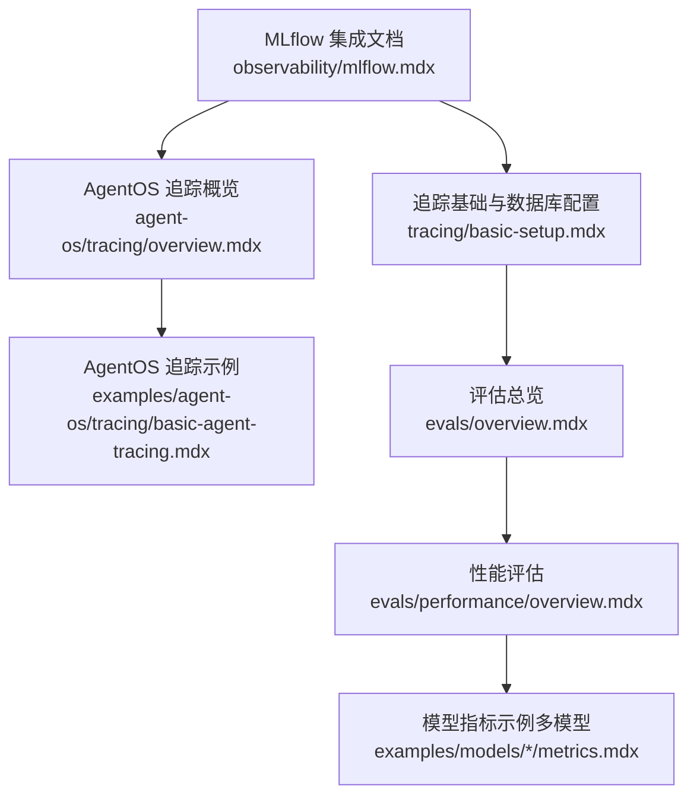
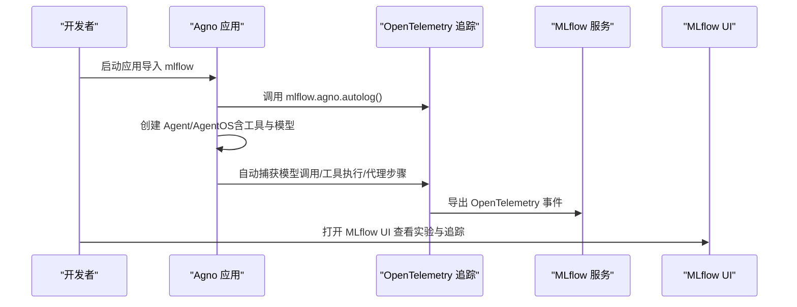
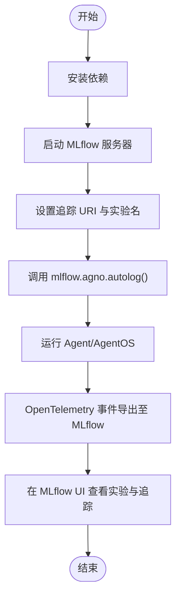
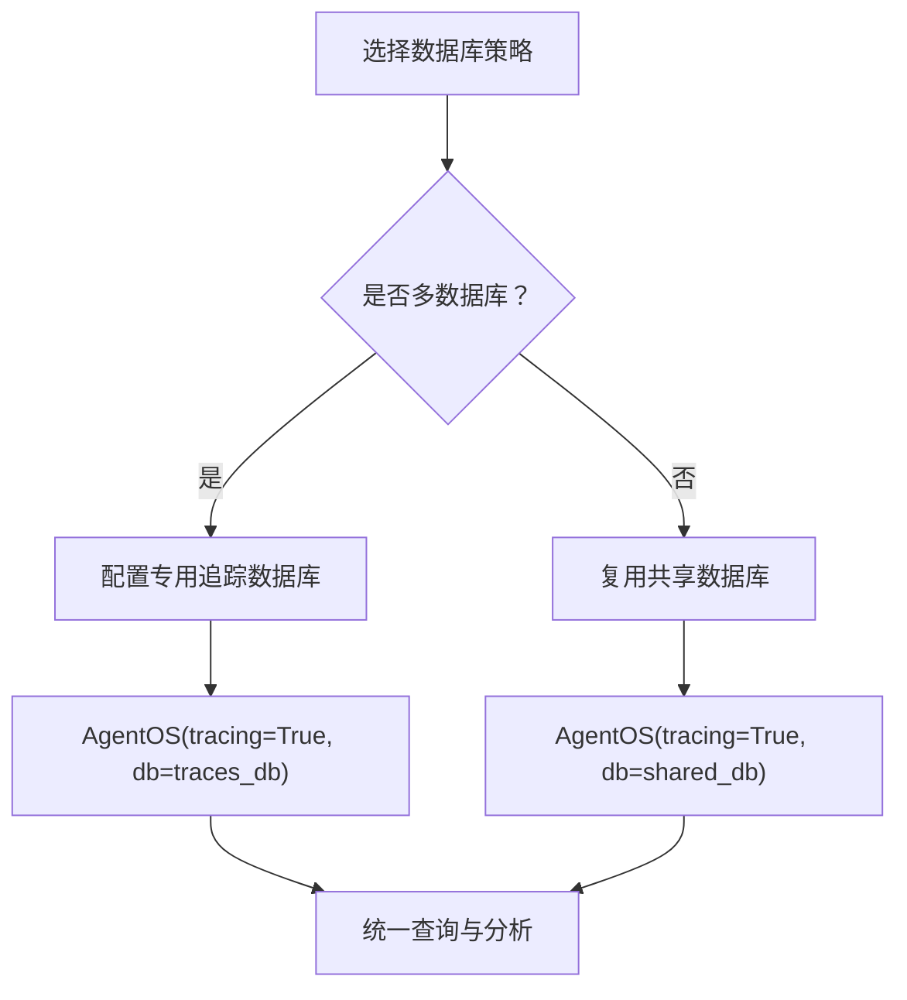
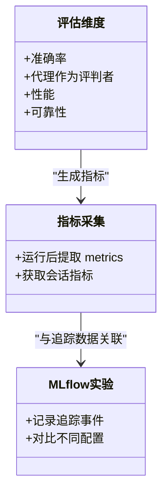
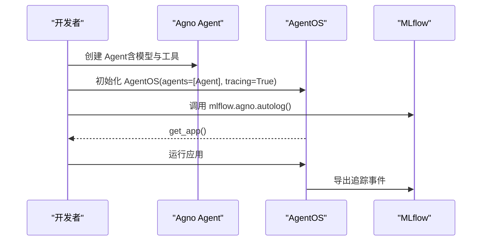
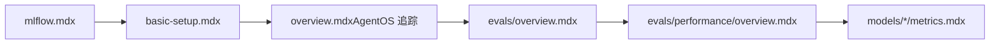

# MLflow 集成

<cite>
**本文引用的文件**
- [mlflow.mdx](file://observability/mlflow.mdx)
- [basic-setup.mdx](file://tracing/basic-setup.mdx)
- [overview.mdx（AgentOS 追踪）](file://agent-os/tracing/overview.mdx)
- [basic-agent-tracing.mdx（示例）](file://examples/agent-os/tracing/basic-agent-tracing.mdx)
- [overview.mdx（评估总览）](file://evals/overview.mdx)
- [overview.mdx（性能评估）](file://evals/performance/overview.mdx)
- [metrics.mdx（LLaMA 模型指标示例）](file://examples/models/meta/llama/metrics.mdx)
- [metrics.mdx（LLaMA OpenAI 模型指标示例）](file://examples/models/meta/llama-openai/metrics.mdx)
- [metrics.mdx（Groq 模型指标示例）](file://examples/models/groq/metrics.mdx)
- [metrics.mdx（OpenAI Chat 模型指标示例）](file://examples/models/openai/chat/metrics.mdx)
- [metrics.mdx（LiteLLM 模型指标示例）](file://examples/models/litellm/metrics.mdx)
</cite>

## 目录
1. [简介](#简介)
2. [项目结构](#项目结构)
3. [核心组件](#核心组件)
4. [架构总览](#架构总览)
5. [详细组件分析](#详细组件分析)
6. [依赖关系分析](#依赖关系分析)
7. [性能考量](#性能考量)
8. [故障排除指南](#故障排除指南)
9. [结论](#结论)
10. [附录](#附录)

## 简介
本指南面向希望在 Agno 中集成 MLflow 的用户，系统讲解如何通过一行自动追踪调用将 OpenTelemetry 原生的代理与工具调用链路无缝接入 MLflow 实验平台。内容覆盖前置条件、环境变量与服务器配置、代码启用方式、AgentOS 集成示例、实验与追踪的可视化入口，以及与 Agno 内置评估体系的协同方法。MLflow 在本方案中承担“GenAI 追踪”的角色，自动捕获模型调用、工具执行与代理步骤的 OpenTelemetry 事件，并在 MLflow UI 中进行探索与分析。

## 项目结构
围绕 MLflow 集成与观测性能力，仓库中与之直接相关的文档与示例如下：
- 观测性与 MLflow：observability/mlflow.mdx
- 追踪基础与数据库配置：tracing/basic-setup.mdx、agent-os/tracing/overview.mdx
- AgentOS 追踪示例：examples/agent-os/tracing/basic-agent-tracing.mdx
- 评估与指标采集：evals/overview.mdx、evals/performance/overview.mdx 及多个模型指标示例

图表来源
- [mlflow.mdx:1-135](file://observability/mlflow.mdx#L1-L135)
- [basic-setup.mdx:1-233](file://tracing/basic-setup.mdx#L1-L233)
- [overview.mdx（AgentOS 追踪）:1-184](file://agent-os/tracing/overview.mdx#L1-L184)
- [basic-agent-tracing.mdx（示例）:1-64](file://examples/agent-os/tracing/basic-agent-tracing.mdx#L1-L64)
- [overview.mdx（评估总览）:1-66](file://evals/overview.mdx#L1-L66)
- [overview.mdx（性能评估）:317-451](file://evals/performance/overview.mdx#L317-L451)

章节来源
- [mlflow.mdx:1-135](file://observability/mlflow.mdx#L1-L135)
- [basic-setup.mdx:1-233](file://tracing/basic-setup.mdx#L1-L233)
- [overview.mdx（AgentOS 追踪）:1-184](file://agent-os/tracing/overview.mdx#L1-L184)
- [basic-agent-tracing.mdx（示例）:1-64](file://examples/agent-os/tracing/basic-agent-tracing.mdx#L1-L64)
- [overview.mdx（评估总览）:1-66](file://evals/overview.mdx#L1-L66)
- [overview.mdx（性能评估）:317-451](file://evals/performance/overview.mdx#L317-L451)

## 核心组件
- MLflow 自动追踪集成：通过调用 mlflow.agno.autolog() 即可启用对 Agno 代理与工具调用的 OpenTelemetry 原生追踪。
- 追踪数据库与 AgentOS：Agno 提供两种追踪启用方式：独立脚本使用 setup_tracing()，或通过 AgentOS 的 tracing=True 参数快速启用；推荐为追踪单独配置数据库以便统一查询与分析。
- 评估与指标：Agno 提供多维度评估（准确率、代理作为评判者、性能、可靠性），并支持从运行结果中提取指标，用于与 MLflow 实验对比与归档。

章节来源
- [mlflow.mdx:54-75](file://observability/mlflow.mdx#L54-L75)
- [basic-setup.mdx:21-95](file://tracing/basic-setup.mdx#L21-L95)
- [overview.mdx（AgentOS 追踪）:16-71](file://agent-os/tracing/overview.mdx#L16-L71)
- [overview.mdx（评估总览）:10-25](file://evals/overview.mdx#L10-L25)

## 架构总览
下图展示了从应用启动到 MLflow 可视化的端到端流程，包括依赖安装、追踪启用、AgentOS 部署与 MLflow UI 访问。

图表来源
- [mlflow.mdx:54-75](file://observability/mlflow.mdx#L54-L75)
- [basic-setup.mdx:21-95](file://tracing/basic-setup.mdx#L21-L95)
- [overview.mdx（AgentOS 追踪）:16-71](file://agent-os/tracing/overview.mdx#L16-L71)

## 详细组件分析

### 组件一：MLflow 集成与自动追踪
- 安装依赖：确保安装 mlflow、Agno、OpenTelemetry 导出器与 Agno 仪器化包。
- 启动 MLflow 服务器：本地或托管均可，随后在代码中设置追踪 URI 与实验名，或在启动时一次性调用 mlflow.agno.autolog()。
- AgentOS 集成：在创建 AgentOS 实例前调用 mlflow.agno.autolog()，即可自动记录代理与工具调用链路。

图表来源
- [mlflow.mdx:10-75](file://observability/mlflow.mdx#L10-L75)

章节来源
- [mlflow.mdx:10-75](file://observability/mlflow.mdx#L10-L75)

### 组件二：追踪数据库与 AgentOS 配置
- 单数据库场景：所有代理共享同一数据库时，启用 tracing=True 即可将追踪写入该数据库。
- 多数据库场景：强烈建议为追踪配置专用数据库，避免追踪分散在不同数据库导致查询困难。
- 使用 setup_tracing()：可在 AgentOS 中通过传入 db 参数使追踪可通过 AgentOS API 与 UI 查询。

图表来源
- [overview.mdx（AgentOS 追踪）:30-120](file://agent-os/tracing/overview.mdx#L30-L120)
- [basic-setup.mdx:97-163](file://tracing/basic-setup.mdx#L97-L163)

章节来源
- [overview.mdx（AgentOS 追踪）:30-120](file://agent-os/tracing/overview.mdx#L30-L120)
- [basic-setup.mdx:97-163](file://tracing/basic-setup.mdx#L97-L163)

### 组件三：评估与指标采集（与 MLflow 协同）
- 评估维度：准确率、代理作为评判者、性能、可靠性，分别对应不同的评估类与运行方式。
- 指标采集：运行完成后可从输出对象中提取 metrics 与会话级指标，便于与 MLflow 实验中的追踪数据进行交叉分析。
- 性能评估：支持内存增长跟踪、调试模式等，适合在 MLflow 中对比不同配置下的性能表现。

图表来源
- [overview.mdx（评估总览）:10-25](file://evals/overview.mdx#L10-L25)
- [overview.mdx（性能评估）:317-451](file://evals/performance/overview.mdx#L317-L451)
- [metrics.mdx（LLaMA 模型指标示例）:44-67](file://examples/models/meta/llama/metrics.mdx#L44-L67)
- [metrics.mdx（LLaMA OpenAI 模型指标示例）:50-76](file://examples/models/meta/llama-openai/metrics.mdx#L50-L76)
- [metrics.mdx（Groq 模型指标示例）:44-67](file://examples/models/groq/metrics.mdx#L44-L67)
- [metrics.mdx（OpenAI Chat 模型指标示例）:44-67](file://examples/models/openai/chat/metrics.mdx#L44-L67)
- [metrics.mdx（LiteLLM 模型指标示例）:46-69](file://examples/models/litellm/metrics.mdx#L46-L69)

章节来源
- [overview.mdx（评估总览）:10-25](file://evals/overview.mdx#L10-L25)
- [overview.mdx（性能评估）:317-451](file://evals/performance/overview.mdx#L317-L451)
- [metrics.mdx（LLaMA 模型指标示例）:44-67](file://examples/models/meta/llama/metrics.mdx#L44-L67)
- [metrics.mdx（LLaMA OpenAI 模型指标示例）:50-76](file://examples/models/meta/llama-openai/metrics.mdx#L50-L76)
- [metrics.mdx（Groq 模型指标示例）:44-67](file://examples/models/groq/metrics.mdx#L44-L67)
- [metrics.mdx（OpenAI Chat 模型指标示例）:44-67](file://examples/models/openai/chat/metrics.mdx#L44-L67)
- [metrics.mdx（LiteLLM 模型指标示例）:46-69](file://examples/models/litellm/metrics.mdx#L46-L69)

### 组件四：AgentOS 示例（含 MLflow）
- 在 AgentOS 应用启动前调用 mlflow.agno.autolog()，随后通过 AgentOS.get_app() 获取应用并运行。
- 该方式同样适用于多代理或多团队场景，配合专用追踪数据库可实现跨代理的统一观测。

图表来源
- [mlflow.mdx:89-120](file://observability/mlflow.mdx#L89-L120)
- [basic-agent-tracing.mdx（示例）:36-42](file://examples/agent-os/tracing/basic-agent-tracing.mdx#L36-L42)

章节来源
- [mlflow.mdx:89-120](file://observability/mlflow.mdx#L89-L120)
- [basic-agent-tracing.mdx（示例）:36-42](file://examples/agent-os/tracing/basic-agent-tracing.mdx#L36-L42)

## 依赖关系分析
- MLflow 集成依赖 OpenTelemetry 生态与 Agno 仪器化包，确保事件能够被正确导出。
- 追踪数据库与 AgentOS 的耦合度较低，可通过参数注入实现灵活配置。
- 评估与指标采集与追踪解耦，但可通过实验标识与时间戳在 MLflow 中进行关联分析。

图表来源
- [mlflow.mdx:1-135](file://observability/mlflow.mdx#L1-L135)
- [basic-setup.mdx:1-233](file://tracing/basic-setup.mdx#L1-L233)
- [overview.mdx（AgentOS 追踪）:1-184](file://agent-os/tracing/overview.mdx#L1-L184)
- [overview.mdx（评估总览）:1-66](file://evals/overview.mdx#L1-L66)
- [overview.mdx（性能评估）:317-451](file://evals/performance/overview.mdx#L317-L451)

章节来源
- [mlflow.mdx:1-135](file://observability/mlflow.mdx#L1-L135)
- [basic-setup.mdx:1-233](file://tracing/basic-setup.mdx#L1-L233)
- [overview.mdx（AgentOS 追踪）:1-184](file://agent-os/tracing/overview.mdx#L1-L184)
- [overview.mdx（评估总览）:1-66](file://evals/overview.mdx#L1-L66)
- [overview.mdx（性能评估）:317-451](file://evals/performance/overview.mdx#L317-L451)

## 性能考量
- 批量处理：在生产环境建议开启批量处理，降低数据库写入压力并提升整体吞吐。
- 单次处理：开发与调试阶段可使用简单处理模式，以便即时看到追踪结果。
- 数据库分离：追踪数据库独立于业务数据库，有利于扩展与迁移，同时避免追踪对业务数据造成影响。

章节来源
- [basic-setup.mdx:173-221](file://tracing/basic-setup.mdx#L173-L221)

## 故障排除指南
- 确保已设置模型提供商密钥（如 OPENAI_API_KEY）。
- 使用包含 Agno 自动追踪集成的最新 MLflow 版本。
- 若未看到追踪结果，请检查 MLflow 服务器是否正常运行、追踪 URI 是否正确、是否在创建 Agent/AgentOS 之前调用了 mlflow.agno.autolog()。
- 在多数据库场景下，务必为追踪指定专用数据库，否则追踪可能分散在不同数据库中导致查询困难。

章节来源
- [mlflow.mdx:131-135](file://observability/mlflow.mdx#L131-L135)
- [overview.mdx（AgentOS 追踪）:122-136](file://agent-os/tracing/overview.mdx#L122-L136)

## 结论
通过在 Agno 中集成 MLflow，可以以极低的代码成本获得对代理与工具调用的全链路可观测性。结合 AgentOS 的便捷部署与专用追踪数据库，能够在本地或云端托管环境中稳定地收集与分析追踪数据。同时，将评估与指标采集结果与 MLflow 实验关联，可形成从“行为观测”到“质量度量”的闭环，支撑持续迭代与优化。

## 附录

### 配置模板与环境变量
- 追踪服务器与实验名设置（命令行或代码中设置）
- AgentOS 启用追踪的最小示例（含数据库与 tracing 参数）

章节来源
- [mlflow.mdx:36-52](file://observability/mlflow.mdx#L36-L52)
- [basic-agent-tracing.mdx（示例）:36-42](file://examples/agent-os/tracing/basic-agent-tracing.mdx#L36-L42)

### 实际使用案例与最佳实践
- 在 AgentOS 应用中启用 MLflow 自动追踪，随后在 MLflow UI 中查看实验与追踪。
- 将评估指标（如运行时长、内存占用）与 MLflow 实验进行对比，定位配置差异带来的性能变化。
- 在多代理场景中，统一使用专用追踪数据库，便于跨代理对比与分析。

章节来源
- [mlflow.mdx:89-128](file://observability/mlflow.mdx#L89-L128)
- [overview.mdx（性能评估）:365-451](file://evals/performance/overview.mdx#L365-L451)