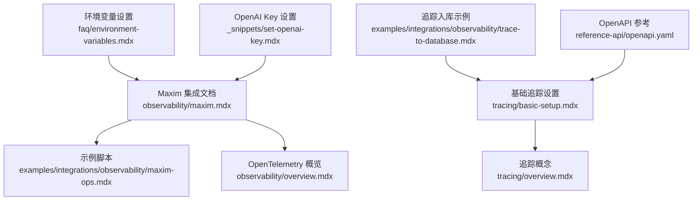
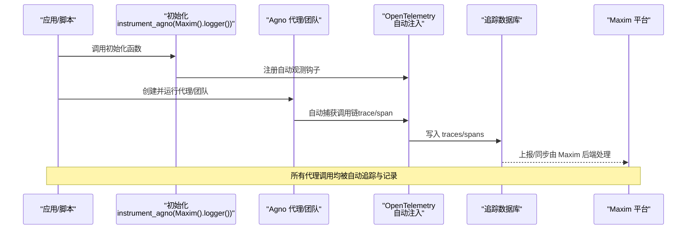
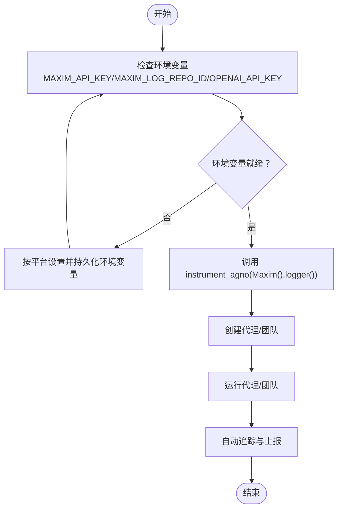
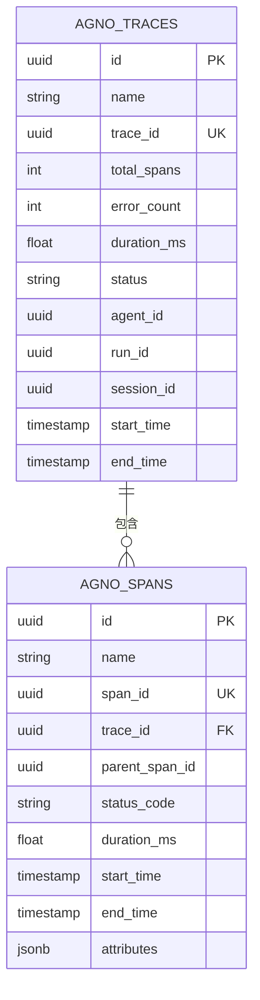
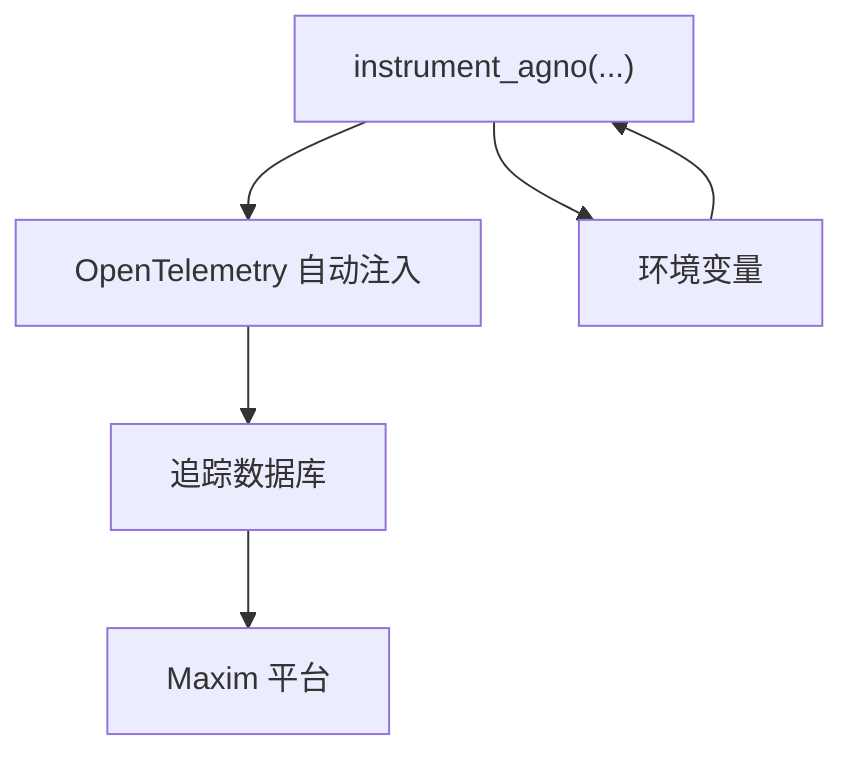

# Maxim Ops 集成

<cite>
**本文引用的文件**
- [observability/maxim.mdx](file://observability/maxim.mdx)
- [examples/integrations/observability/maxim-ops.mdx](file://examples/integrations/observability/maxim-ops.mdx)
- [observability/overview.mdx](file://observability/overview.mdx)
- [tracing/basic-setup.mdx](file://tracing/basic-setup.mdx)
- [tracing/overview.mdx](file://tracing/overview.mdx)
- [faq/environment-variables.mdx](file://faq/environment-variables.mdx)
- [_snippets/set-openai-key.mdx](file://_snippets/set-openai-key.mdx)
- [examples/integrations/observability/trace-to-database.mdx](file://examples/integrations/observability/trace-to-database.mdx)
- [reference-api/openapi.yaml](file://reference-api/openapi.yaml)
</cite>

## 目录
1. [简介](#简介)
2. [项目结构](#项目结构)
3. [核心组件](#核心组件)
4. [架构总览](#架构总览)
5. [详细组件分析](#详细组件分析)
6. [依赖关系分析](#依赖关系分析)
7. [性能考量](#性能考量)
8. [故障排除指南](#故障排除指南)
9. [结论](#结论)
10. [附录](#附录)

## 简介
本技术文档面向在 Maxim Ops 平台上集成 Agno 的用户，系统性介绍如何通过一行初始化完成对 Agno 代理（Agent）与团队（Team）的自动观测与追踪，并将代理调用链路、工具调用、模型使用与性能指标等数据发送到 Maxim。文档覆盖以下关键主题：
- API 密钥与环境变量配置
- 初始化与注入流程
- 核心功能：模型性能监控、成本分析、调试工具
- 与 OpenTelemetry 的兼容性与数据格式
- 配置示例、代码片段路径与最佳实践
- 故障排除、性能优化与常见问题

## 项目结构
与 Maxim 集成相关的核心内容分布在如下位置：
- 观测性与集成指南：observability/maxim.mdx
- 示例脚本：examples/integrations/observability/maxim-ops.mdx
- OpenTelemetry 概览与兼容平台列表：observability/overview.mdx
- 基础追踪设置与数据库存储：tracing/basic-setup.mdx
- 追踪概念与层级：tracing/overview.mdx
- 环境变量设置指引：faq/environment-variables.mdx
- OpenAI API Key 设置提示：_snippets/set-openai-key.mdx
- 追踪入库查询示例：examples/integrations/observability/trace-to-database.mdx
- 追踪数据结构参考（OpenAPI）：reference-api/openapi.yaml

**图表来源**
- [observability/maxim.mdx:1-205](file://observability/maxim.mdx#L1-L205)
- [examples/integrations/observability/maxim-ops.mdx:1-107](file://examples/integrations/observability/maxim-ops.mdx#L1-L107)
- [observability/overview.mdx:1-25](file://observability/overview.mdx#L1-L25)
- [tracing/basic-setup.mdx:1-233](file://tracing/basic-setup.mdx#L1-L233)
- [tracing/overview.mdx:23-59](file://tracing/overview.mdx#L23-L59)
- [faq/environment-variables.mdx:1-120](file://faq/environment-variables.mdx#L1-L120)
- [_snippets/set-openai-key.mdx:1-15](file://_snippets/set-openai-key.mdx#L1-L15)
- [examples/integrations/observability/trace-to-database.mdx:75-244](file://examples/integrations/observability/trace-to-database.mdx#L75-L244)
- [reference-api/openapi.yaml:13010-13052](file://reference-api/openapi.yaml#L13010-L13052)

**章节来源**
- [observability/maxim.mdx:1-205](file://observability/maxim.mdx#L1-L205)
- [examples/integrations/observability/maxim-ops.mdx:1-107](file://examples/integrations/observability/maxim-ops.mdx#L1-L107)
- [observability/overview.mdx:1-25](file://observability/overview.mdx#L1-L25)
- [tracing/basic-setup.mdx:1-233](file://tracing/basic-setup.mdx#L1-L233)
- [tracing/overview.mdx:23-59](file://tracing/overview.mdx#L23-L59)
- [faq/environment-variables.mdx:1-120](file://faq/environment-variables.mdx#L1-L120)
- [_snippets/set-openai-key.mdx:1-15](file://_snippets/set-openai-key.mdx#L1-L15)
- [examples/integrations/observability/trace-to-database.mdx:75-244](file://examples/integrations/observability/trace-to-database.mdx#L75-L244)
- [reference-api/openapi.yaml:13010-13052](file://reference-api/openapi.yaml#L13010-L13052)

## 核心组件
- 初始化与注入
  - 通过调用 instrument_agno(Maxim().logger()) 完成对 Agno 的自动观测注入，确保所有后续代理与工具调用被自动追踪并上报至 Maxim。
  - 初始化必须在创建或执行任何代理之前进行，以保证拦截与记录生效。

- 环境变量与密钥
  - 必需环境变量：MAXIM_API_KEY、MAXIM_LOG_REPO_ID、OPENAI_API_KEY（若使用 OpenAI 模型）。
  - 文档提供了跨平台设置方式与持久化建议。

- 数据采集与存储
  - 追踪数据默认写入本地 SQLite 数据库（可替换为其他数据库），包含 traces 与 spans 两张表。
  - 支持批量处理模式以降低写入开销，适合生产环境。

- 功能特性
  - 观测与追踪：代理生命周期、工具调用、决策流、令牌用量、模型信息、性能指标（延迟、成本、错误率）。
  - 评估与分析：自动评估、人工评估、节点级评估、仪表盘可视化。
  - 告警：基于错误率、成本、令牌用量、用户反馈与延迟的实时告警。

**章节来源**
- [observability/maxim.mdx:32-41](file://observability/maxim.mdx#L32-L41)
- [observability/maxim.mdx:171-193](file://observability/maxim.mdx#L171-L193)
- [tracing/basic-setup.mdx:21-95](file://tracing/basic-setup.mdx#L21-L95)
- [faq/environment-variables.mdx:8-119](file://faq/environment-variables.mdx#L8-L119)

## 架构总览
下图展示了从应用启动到数据上报的端到端流程，以及与 OpenTelemetry 的关系：

**图表来源**
- [observability/maxim.mdx:48-77](file://observability/maxim.mdx#L48-L77)
- [observability/maxim.mdx:83-114](file://observability/maxim.mdx#L83-L114)
- [observability/overview.mdx:14-23](file://observability/overview.mdx#L14-L23)
- [tracing/basic-setup.mdx:29-57](file://tracing/basic-setup.mdx#L29-L57)

## 详细组件分析

### 组件一：初始化与注入流程
- 关键点
  - 在创建任何代理前调用 instrument_agno(Maxim().logger())。
  - 若需要调试，可传入 debug 参数开启详细日志。
  - 支持与 OpenAI 模型配合使用时，需正确配置 OPENAI_API_KEY。

- 代码片段路径
  - [基础集成示例（单代理）:48-77](file://observability/maxim.mdx#L48-L77)
  - [多代理集成示例（团队）:83-167](file://observability/maxim.mdx#L83-L167)
  - [示例脚本入口:68-92](file://examples/integrations/observability/maxim-ops.mdx#L68-L92)

**图表来源**
- [observability/maxim.mdx:32-41](file://observability/maxim.mdx#L32-L41)
- [observability/maxim.mdx:61-62](file://observability/maxim.mdx#L61-L62)
- [faq/environment-variables.mdx:8-119](file://faq/environment-variables.mdx#L8-L119)

**章节来源**
- [observability/maxim.mdx:48-77](file://observability/maxim.mdx#L48-L77)
- [observability/maxim.mdx:83-167](file://observability/maxim.mdx#L83-L167)
- [examples/integrations/observability/maxim-ops.mdx:19-32](file://examples/integrations/observability/maxim-ops.mdx#L19-L32)
- [faq/environment-variables.mdx:8-119](file://faq/environment-variables.mdx#L8-L119)

### 组件二：追踪与数据库存储
- 追踪与跨度
  - Trace：一次完整的代理执行；Span：执行中的单个操作，形成父子层级。
  - 数据库包含 agno_traces 与 agno_spans 表，支持按 trace_id 聚合查询。

- 处理模式
  - 批量处理：内存队列 + 批量写入，适合生产环境。
  - 简单处理：逐条写入，适合开发调试。

- 查询与可视化
  - 提供示例脚本演示如何查询 traces 与 spans，并打印树形结构。

**图表来源**
- [tracing/basic-setup.mdx:165-169](file://tracing/basic-setup.mdx#L165-L169)
- [examples/integrations/observability/trace-to-database.mdx:75-105](file://examples/integrations/observability/trace-to-database.mdx#L75-L105)
- [reference-api/openapi.yaml:13010-13052](file://reference-api/openapi.yaml#L13010-L13052)

**章节来源**
- [tracing/overview.mdx:39-59](file://tracing/overview.mdx#L39-L59)
- [tracing/basic-setup.mdx:97-221](file://tracing/basic-setup.mdx#L97-L221)
- [examples/integrations/observability/trace-to-database.mdx:75-244](file://examples/integrations/observability/trace-to-database.mdx#L75-L244)
- [reference-api/openapi.yaml:13010-13052](file://reference-api/openapi.yaml#L13010-L13052)

### 组件三：OpenTelemetry 兼容性与数据格式
- 兼容性
  - Agno 对 OpenTelemetry 提供原生支持，可自动注入并导出到任意兼容后端，包括 Maxim。
  - 平台列表中明确包含 Maxim。

- 数据格式
  - 追踪节点（TraceNode）包含 id、name、type、duration、start_time、end_time、status 等字段。
  - 属性（attributes）与扩展数据（extra_data）用于承载自定义元数据。

**章节来源**
- [observability/overview.mdx:14-23](file://observability/overview.mdx#L14-L23)
- [reference-api/openapi.yaml:13010-13052](file://reference-api/openapi.yaml#L13010-L13052)

## 依赖关系分析
- 组件耦合
  - 初始化与代理生命周期强耦合：必须先初始化再创建代理。
  - 追踪系统与数据库解耦：可通过不同数据库实现集中式追踪存储。
  - 与模型提供商解耦：通过统一的 OpenTelemetry 接口适配不同模型供应商。

- 外部依赖
  - Maxim SDK（maxim-py）与 OpenTelemetry 生态。
  - 可选的 OpenAI API Key（当使用 OpenAI 模型时）。

**图表来源**
- [observability/maxim.mdx:61-62](file://observability/maxim.mdx#L61-L62)
- [observability/overview.mdx:14-23](file://observability/overview.mdx#L14-L23)
- [faq/environment-variables.mdx:8-119](file://faq/environment-variables.mdx#L8-L119)

**章节来源**
- [observability/maxim.mdx:61-62](file://observability/maxim.mdx#L61-L62)
- [observability/overview.mdx:14-23](file://observability/overview.mdx#L14-L23)
- [faq/environment-variables.mdx:8-119](file://faq/environment-variables.mdx#L8-L119)

## 性能考量
- 批量处理优先：生产环境推荐启用批量处理，减少数据库写入压力。
- 分离追踪数据库：避免与业务数据库混合，便于独立扩展与查询。
- 调试模式仅限开发：开启 debug 模式会增加日志输出，不适合生产。
- 模型成本控制：结合令牌用量与成本分析，选择合适模型与上下文长度。

[本节为通用指导，无需特定文件引用]

## 故障排除指南
- 无法导入 Maxim
  - 症状：ImportError 提示未安装 maxim-py。
  - 处理：按照文档安装 maxim-py 或 agno 与 openai 的组合包。
  - 参考：[基础集成示例（异常处理）:53-59](file://observability/maxim.mdx#L53-L59)

- 环境变量未生效
  - 症状：初始化失败或无法连接 Maxim。
  - 处理：确认 MAXIM_API_KEY、MAXIM_LOG_REPO_ID、OPENAI_API_KEY 已正确设置并持久化。
  - 参考：[环境变量设置（macOS/Windows）:8-119](file://faq/environment-variables.mdx#L8-L119)，[OpenAI Key 设置:1-15](file://_snippets/set-openai-key.mdx#L1-L15)

- 初始化顺序错误
  - 症状：代理创建后无追踪数据。
  - 处理：确保 instrument_agno(...) 在创建任何代理前调用。
  - 参考：[注意事项与调试模式:194-203](file://observability/maxim.mdx#L194-L203)

- 追踪数据未入库
  - 症状：数据库中无 traces/spans。
  - 处理：确认已调用 setup_tracing 并传入 db；检查批量处理是否已触发导出。
  - 参考：[基础追踪设置:29-57](file://tracing/basic-setup.mdx#L29-L57)

**章节来源**
- [observability/maxim.mdx:53-59](file://observability/maxim.mdx#L53-L59)
- [faq/environment-variables.mdx:8-119](file://faq/environment-variables.mdx#L8-L119)
- [_snippets/set-openai-key.mdx:1-15](file://_snippets/set-openai-key.mdx#L1-L15)
- [observability/maxim.mdx:194-203](file://observability/maxim.mdx#L194-L203)
- [tracing/basic-setup.mdx:29-57](file://tracing/basic-setup.mdx#L29-L57)

## 结论
通过一行初始化，Agno 即可无缝接入 Maxim Ops，获得从代理调用到工具执行、从令牌用量到性能指标的全链路可观测能力。结合 OpenTelemetry 的兼容性与数据库化的追踪存储，用户可在开发与生产环境中灵活配置、高效运维，并借助 Maxim 的评估与告警能力持续优化智能体表现。

[本节为总结性内容，无需特定文件引用]

## 附录

### A. 配置清单与示例路径
- 环境变量
  - MAXIM_API_KEY、MAXIM_LOG_REPO_ID、OPENAI_API_KEY
  - 参考：[环境变量设置:32-35](file://faq/environment-variables.mdx#L32-L35)，[OpenAI Key 设置:1-15](file://_snippets/set-openai-key.mdx#L1-L15)

- 初始化与运行
  - 单代理示例：[基础集成示例:48-77](file://observability/maxim.mdx#L48-L77)
  - 多代理示例：[团队集成示例:83-167](file://observability/maxim.mdx#L83-L167)
  - 示例脚本入口：[maxim-ops 示例:68-92](file://examples/integrations/observability/maxim-ops.mdx#L68-L92)

- 追踪与查询
  - 基础追踪设置：[setup_tracing 与 AgentOS 集成:29-95](file://tracing/basic-setup.mdx#L29-L95)
  - 追踪入库查询示例：[trace-to-database 示例:75-244](file://examples/integrations/observability/trace-to-database.mdx#L75-L244)

**章节来源**
- [faq/environment-variables.mdx:32-35](file://faq/environment-variables.mdx#L32-L35)
- [_snippets/set-openai-key.mdx:1-15](file://_snippets/set-openai-key.mdx#L1-L15)
- [observability/maxim.mdx:48-77](file://observability/maxim.mdx#L48-L77)
- [observability/maxim.mdx:83-167](file://observability/maxim.mdx#L83-L167)
- [examples/integrations/observability/maxim-ops.mdx:68-92](file://examples/integrations/observability/maxim-ops.mdx#L68-L92)
- [tracing/basic-setup.mdx:29-95](file://tracing/basic-setup.mdx#L29-L95)
- [examples/integrations/observability/trace-to-database.mdx:75-244](file://examples/integrations/observability/trace-to-database.mdx#L75-L244)

### B. 最佳实践
- 在应用启动阶段尽早调用 instrument_agno(...)，确保全局拦截生效。
- 生产环境启用批量处理与专用追踪数据库，避免影响主业务数据库。
- 使用调试模式仅限开发与联调阶段，避免产生大量日志。
- 结合模型与工具的令牌用量与成本数据，定期评估与优化。

[本节为通用指导，无需特定文件引用]